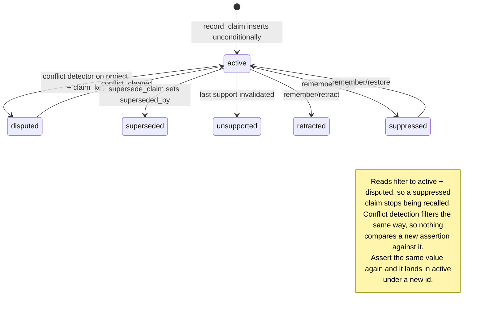

## 1. Executive Summary

ostk-recall is roughly 90,000 lines of Rust across ten crates, dual-licensed MIT
and Apache-2.0, shipping one binary that indexes notes, source trees and
assistant session logs into a local corpus and serves them over MCP. Data stays
on the machine. The README describes it as pre-alpha and says the maintainer runs
it daily.

Two stores sit behind it. **LanceDB** holds chunk vectors and a Tantivy BM25
index; **SQLite** holds everything with an identity — the claim table, the
concept ledger, the audit tables and an append-only access chain log. That split
is the design's spine: the corpus is bulk and rebuildable, and the ledger is the
part that can be wrong.

It carries five of this atlas's seven marks. The two it does not carry are the
report.

**`forget` tells the caller it wrote a tombstone, and it did not.** The MCP
handler returns the warning *"claim suppressed with an anti-resurrection
tombstone; hard purge was not performed"*, and the call behind it is
`transition_claim(id, ClaimState::Suppressed, …)` — keyed on the claim's
autoincrement id. Three things follow, each of them checkable in one file.
`record_claim` inserts unconditionally; its only pre-write lookup is a
`memory_mutation_receipts` idempotency check, which guards a replayed *request*
rather than a re-asserted *value*. Conflict detection selects
`WHERE project=? AND claim_key=? AND conflict_eligible=1 AND state IN
('active','disputed')`, so the suppressed row is invisible to the one mechanism
that would notice its value coming back. And reads default to the same two
states. So assert the fact again and a fresh row lands in `active` and is
recalled, with the suppressed row sitting beside it unconsulted.

That is read-side suppression, which is a real protection for the agent and no
protection for the store. The mark is withheld on the atlas's definition — a
tombstone is keyed on the *value* — and the near-miss is worth stating precisely
because the vocabulary is exactly right and the mechanism is not. Adding it is
cheap here in a way it is not elsewhere: `claim_key`, `subject`, `predicate` and
`value_json` are already columns, so a digest over the value already exists in
all but name.

**And the only thing making `forget` mean anything is untested.** The read
filter is what stops a suppressed claim being recalled, and no committed case
asserts that it holds. `split_is_atomic_replayable_and_keep_false_suppresses_parent`
asserts the parent's *state*, not its absence from a result.

Against that, three mechanisms here are ones the atlas has not found elsewhere,
and they are all in the concept ledger rather than the claim table.

## 2. Mental Model

A thing becomes a belief here along one of two paths that never merge.

**Ingested material** is chunked, embedded and indexed. It has provenance and a
`project`, and it is bulk: nothing about it is asserted, and rebuilding the
corpus from source loses nothing.

**A claim** is asserted, by an agent through `remember` or by promotion, and it
is the part with an epistemic life. It enters `active`. If another claim shares
its `project` and `claim_key` and both are `conflict_eligible`, an automatic
detector opens a conflict and moves both to `disputed` — no human in the loop,
and the reverse transition (`conflict_cleared`) is automatic too. If every
support behind a claim is invalidated it becomes `unsupported`. A human or agent
can supersede it, retract it, or forget it.

The state is a field, not a score, and a separate `confidence` float lives beside
it — the distinction the [trust-state machine](../../patterns/trust-state-machine/)
pattern argues for. `is_current()` is `Active | Disputed`, and that pair is what
every default read filters to.

The gap is on the write side, and the diagram is drawn on it.

## 3. Architecture

One binary, no services. `crates/store` owns SQLite and every table with an
identity; `crates/query` owns LanceDB, the hybrid lanes and the diffusion walk;
`crates/pipeline` owns scan, chunk and embed; `crates/attention` is a runtime of
timer- and event-driven passes; `crates/mcp` and `crates/attention-mcp` are the
agent-facing surfaces, served over stdio or a shared local socket.

Embeddings are static (model2vec), which is the decision that makes the whole
thing a single binary with no GPU and no service to stand up. The optional
cross-encoder reranker is fastembed. An operator's cost is a config file and a
scan; there is nothing to operate beyond the daemon.

## 4. Essential Implementation Paths

- **Claim write** — `crates/store/src/claims.rs`: `record_claim` → idempotency
  receipt lookup → `insert_claim` → support rows → `insert_event`, all in one
  transaction.
- **Conflict detection** — same file: the `project`/`claim_key`/`conflict_eligible`
  query, opening a conflict and moving members to `disputed`, or clearing it and
  writing a `conflict_cleared` event.
- **State transitions** — `transition_claim` and `supersede_claim`, both guarded
  on the prior state being `active` or `disputed` and both bumping `revision`.
- **Hybrid retrieval** — `crates/query/src/hybrid.rs`: filter construction with
  `sql_escape`, dense and BM25 lanes, RRF fusion.
- **Edge conductance** — `crates/store/src/activation.rs`: `conductance_of`.
- **Attention passes** — `crates/attention/src/{observer,weaver,curator}.rs`.

## 5. Memory Data Model

`memory_claims` carries `id`, `project`, `kind`, `claim_key`, `subject`,
`predicate`, `value_json`, `text`, `polarity`, `state`, `origin`, `actor`,
`confidence`, `valid_from`, `valid_to`, `superseded_by`, `revision`,
`conflict_eligible`, `created_at` and `updated_at`, indexed on
`(project, claim_key, state)`.

Two things there are worth naming. `valid_from`/`valid_to` beside
`created_at`/`updated_at` is genuine bi-temporality: when the claim was true and
when the system recorded it are separate columns, so correcting a fact does not
destroy the ability to ask what was believed last March. And `polarity` lets a
claim assert that something is *not* the case, which is rarer than it should be —
most stores in this atlas can only record presence.

The concept ledger is the other half: `concepts`, `concept_edges`,
`concept_aliases`, `concept_evidence`, `concept_notes`. Every edge records an
`origin` of authored, observed or promoted.

## 6. Retrieval Mechanics

model2vec dense vectors and Tantivy BM25, fused by reciprocal rank fusion, with
an optional cross-encoder rerank pass. `project` is compiled into the LanceDB
filter predicate — `stale = false AND project = 'a''b'` in the committed test,
with `sql_escape` doing the quoting — which is what earns `scope_enforced`.

The filter can be widened by source: `project = 'p' OR source = 'code'` is a
shape the tests exercise. That does not cost the mark, which certifies the key
reaches the query rather than that a caller cannot pass a different argument, but
it is worth knowing before treating `project` as a boundary.

Diffusion walks both halves of the concept graph — the reified edges and the
latent vector-similarity neighbourhood. An off-diagonal bridge walked during
consolidation is promoted into a *weak reified edge*, which then has to earn its
conductance through use or decay away.

## 7. Write Mechanics

`record_claim` is synchronous and transactional: the claim, its support rows, its
concept links and its event all land or none do, and the caller gets the claim
back. There is no queue in front of it, so a claim is retrievable through the
claim reads immediately.

Embeddings are the asynchronous part. `upsert_claim_embeddings` is a separate
model-scoped call — "replays are idempotent and model changes replace the old
coordinate atomically" — so a claim exists before its vector does, and the lag
before it is reachable through *vector* recall is the lag of whatever drives that
call.

Ingest is a different path entirely: scan, chunk, embed, upsert into LanceDB,
with a manifest in SQLite. The orphan sweep tombstones ingest chunks by path —
that is the ordinary record-keyed kind, and unrelated to the claim story above.

No background pass rewrites the claim store. The curator fades *threads*, and the
docstring is explicit that this is not forgetting: *"the substrate doesn't forget,
but the surfacer stops shouting about threads whose score has fallen below the
archive line."* Hysteresis around each threshold keeps a thread near a boundary
from flipping every tick.

## 8. Agent Integration

Two tools — `recall` and `remember` — with historical names kept as hidden
aliases for one transition cycle. `remember` carries the verbs: record,
supersede, retract, forget, restore, resolve. Beside them is a resources surface
including an ambient "memory lens" aligned to the current attention vector, which
is an unusual thing to expose: a resource whose content tracks what the agent is
attending to rather than what it asked for.

Served over stdio or a shared local-socket daemon, so several clients can share
one index.

## 9. Reliability, Safety, and Trust

The audit surface is genuinely strong. `memory_claim_events` and
`memory_claim_link_events` are documented append-only histories, mutations carry
receipts in `memory_mutation_receipts` keyed by idempotency key with payload
comparison — a replay with a *different* payload is rejected rather than
silently accepted — and `chain_log` is an indexed access ledger. Every
state-changing verb takes an actor and a reason.

`resolve_conflict_with_receipt` records a `resolution_kind` and a
`resolution_reason` alongside the actor, which is what earns `human_review`: a
person adjudicates a conflict the detector opened, and the adjudication is
itself a durable record rather than a mutation.

The weaknesses are the two withheld marks, and they compound. The `forget`
warning asserts an anti-resurrection property, the mechanism behind it is a
status flip on one row, and nothing committed asserts even the read-side half
holds. A reader who takes the warning at face value will believe a value cannot
come back when it can, and the test suite will not tell them otherwise.

## 10. Tests, Evals, and Benchmarks

1,028 `#[test]` and `#[tokio::test]` functions across the crates, plus a
`tests/` directory with fixtures and a `queries.yaml`. Nothing was run for this
review.

The suite is dense where the design is careful. `claim_link_lifecycle_is_idempotent_audited_and_scoped`
exercises the three properties in its name at once. `build_filter_project_and_source`
pins the scope predicate including SQL escaping. `unstructured_notes_are_not_conflict_eligible`
pins the gate that keeps free text out of the conflict detector.
`orphan_marking_gates_not_deletes` and `ensure_is_idempotent_and_never_downgrades`
are both the shape of assertion this atlas asks for.

What is missing is the one the design most needs: no committed case asserts that
a suppressed or retracted claim is absent from a recall result. The filter is
`state IN ('active','disputed')` in four separate queries, each with an override
flag, and a fifth query added without the predicate would pass every test here.

## 11. For Your Own Build

### Steal

- **Derive the edge weight instead of storing it.** `conductance_of(confidence,
  last_seen_at, now)` is `confidence × recency_lift(…)`, clamped. Every other
  decay-and-reinforcement implementation in this atlas stores a mutable score and
  updates it on a schedule; deriving it means there is no weight to drift out of
  step with its inputs, no migration when the formula changes, and no background
  pass whose failure silently freezes the graph.
- **Make a promoted edge earn its place.** A bridge found in the latent
  neighbourhood is reified as a *weak* edge that must earn conductance through
  use or decay away. That is evidence-before-belief applied to graph structure:
  the promotion is visible, provisional, and reversible by inaction.
- **Put the origin on the edge.** `authored` / `observed` / `promoted` answers
  "why does this link exist" without a join.
- **Compare the payload on an idempotency replay.** Accepting a replayed key with
  a different body is the failure this guards, and most implementations do not.
- **Say what fading is.** *"The substrate doesn't forget, but the surfacer stops
  shouting"* is the clearest one-line statement of decay-as-ranking in this
  atlas, and the hysteresis beside it is the detail most implementations skip.

### Avoid

- **A warning that asserts a property the code does not have.** The cost is not
  the missing tombstone — plenty of systems here lack one. It is that the string
  tells the caller the value cannot come back, which is worse than silence,
  because it forecloses the question.
- **A read-path filter with no test.** Four queries carry
  `state IN ('active','disputed')` and an override flag; nothing asserts the
  fifth will.

### Fit

Take this if you want one local binary over your own files and sessions, you are
comfortable on a pre-alpha daily driver, and the concept ledger is the part you
actually want — that is where the original thinking is. It suits a single
operator with one machine and several MCP clients sharing a socket.

Walk away if you need a correction to *hold* against re-extraction. Everything
else here is careful, which makes the gap easy to miss: the states are rich, the
audit is real, the scoping reaches the query, and none of that stops a forgotten
value returning under a new id on the next ingest.

## 12. Open Questions

- Does anything drive `upsert_claim_embeddings` on the `remember` path, or is a
  claim reachable only by claim reads until an ingest pass runs?
- The `polarity` column can express a negative claim. Does the conflict detector
  treat a positive and a negative claim on the same `claim_key` as conflicting,
  which is the case that would make polarity load-bearing?
- `conflict_eligible` defaults to `0`. What proportion of real claims are
  eligible, given that ineligible ones never reach `disputed`?

## Appendix: File Index

| Path | Role |
| --- | --- |
| `crates/store/src/claims.rs` | Claim table, states, conflicts, audit events, mutation receipts |
| `crates/store/src/concepts.rs` | Concept ledger, aliases, merge and canonicalization |
| `crates/store/src/activation.rs` | `conductance_of`, activation reads, promoted-edge audit |
| `crates/store/src/threads.rs` | Threads, thread links, `chain_log` |
| `crates/store/src/events.rs` | `audit_events` |
| `crates/query/src/hybrid.rs` | Filter construction, dense and BM25 lanes, RRF |
| `crates/query/src/lanes.rs` | Lane execution and the scope vector |
| `crates/attention/src/curator.rs` | Idle fade with hysteresis |
| `crates/attention/src/weaver.rs` | Auto-weaver, `ProposedWeave` |
| `crates/pipeline/src/lib.rs` | Scan, chunk, embed, orphan sweep |
| `crates/mcp/src/claims.rs` | `remember` verbs and the `soft_forget` warning |

## History

**2026-08-08** — [`5f25e8444219e6bec5eb080112a1150abe78657f`](https://github.com/os-tack/ostk-recall/commit/5f25e8444219e6bec5eb080112a1150abe78657f) — first reading, at the `v0.9.3` release commit. Screened before reading: **0 auto-run surfaces**, 1 build-time exec path (`Makefile`), and 3 dependency surfaces changed inside the seven-day cooldown — `Cargo.lock`, `Cargo.toml` and `crates/pipeline/Cargo.toml`, all changed the same day, because the release landed the same day. **Nothing was executed**, and every claim here is established by reading.

The claim lifecycle was traced end to end: `record_claim` and its idempotency receipt, `insert_claim`, the conflict detector's `(project, claim_key, conflict_eligible)` query and the `disputed` transitions it drives in both directions, `supersede_claim`, and `transition_claim` behind retract, forget and restore. Marks: `trust_state` for the six-value `state` with `is_current()` and a separate `confidence` float; `bitemporal` for `valid_from`/`valid_to` beside `created_at`/`updated_at`; `scope_enforced` for the `project` predicate compiled into the LanceDB filter with `sql_escape`, pinned by `build_filter_project_and_source`; `audit_log` for the documented append-only `memory_claim_events` and `memory_claim_link_events` with receipts beside them; and `human_review` for `resolve_conflict_with_receipt` carrying actor, reason and resolution kind.

`tombstone` is withheld and the near-miss is the report. The `remember/forget` handler returns *"claim suppressed with an anti-resurrection tombstone"*, and the suppression is keyed on the claim's autoincrement id: `record_claim` inserts without consulting it, and conflict detection filters to `state IN ('active','disputed')`, so the suppressed row cannot see its own value return. `negative_eval` is withheld for the matching reason — the read filter is the only thing the warning rests on, and nothing committed asserts it holds.
