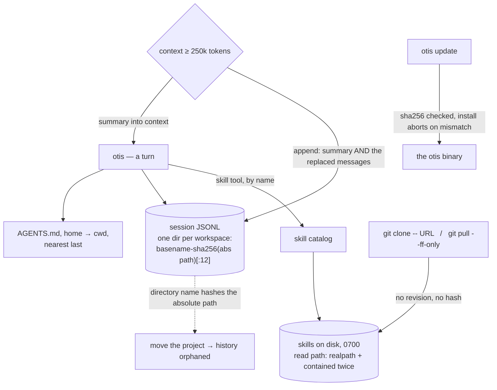

## 1. Executive Summary

Otis is a terminal coding agent — 11,531 lines of TypeScript, MIT, macOS and
Linux — that runs against any public serverless Fireworks model supporting tool
calls. The premise is locality: *"Sessions, configuration, usage, tool activity,
and diffs stay local"*, with inference under Fireworks' zero-data-retention
default and no service of the project's own.

Its durable state is three things. **Sessions** are append-only JSONL under a
per-workspace directory, resumable by id or by `--continue`. **`AGENTS.md`**
files are collected from the home directory and every ancestor of the working
directory, ordered so the nearest file lands last. And **skills** are directories
of Markdown the agent loads by name through a `skill` tool whose description is
the whole retrieval policy: *"Read SKILL.md before following a matching skill."*

**The skills are the memory worth reading about, and they are unpinned.**
Installing one is `git clone -- <url> <dir>` with no revision, no tag and no
depth; updating is `git pull --ff-only`. The runtime manifest schema
(`ManagedSkillSource = { id, url, skills: [{ name, relativePath }] }`) has no
field for a commit or a hash, so what the agent will follow tomorrow is whatever
that repository's default branch says tomorrow.

That is worth naming because of what sits beside it. The same codebase verifies
its **own** release archive — `sha256File(archivePath) !== artifact.sha256`
aborts the install, and the manifest parser rejects a checksum that is missing or
not 64 hex characters. And `skills-lock.json` in the repository root records a
`computedHash` for the one skill vendored during development. That string appears
**exactly once in the entire tree**: nothing in `src/` writes it, reads it or
checks it. The project treats its own binary as a supply-chain risk and the
instructions its agent follows as a URL.

**Where the skill code is rigorous is the other half.** `readSkillResource`
refuses absolute paths, resolves the request against the skill root, asserts
containment, calls `realpath`, asserts containment *again* so a symlink cannot
escape, and decodes with `TextDecoder("utf-8", { fatal: true })`. The manifest
parser rejects `..` segments, absolute paths, duplicate ids and malformed names.
Git runs with `--` before the URL and a scrubbed environment. Every skill
directory is 0700 and every file 0600. The containment of a skill already on
disk is careful; which skill arrived is not checked at all.

## 2. Mental Model

Three durable surfaces, none of which holds a belief.

**A session** is a stream of events — prompts, responses, tool activity, usage,
compaction — appended to one JSONL file, with a title, a message count and an
`updatedAt`. It is retrieved whole, by id or by recency, never searched.

**A skill** is procedural memory with an install step. It is fetched, listed in a
catalog, and read on demand; nothing scores it, ages it or retires it.

**`AGENTS.md`** is the instruction layer, assembled per invocation from the home
directory upward so that *"closer files override broader ones"* — a scoping rule
expressed as ordering rather than as a filter.

The one place something is decided about memory is compaction, and it decides
generously:

```text
context reaches AUTO_COMPACT_THRESHOLD_TOKENS (250_000)
        │
        ▼
summary replaces the messages in the model's context
        │
        └── session log appends { type: "compacted", summary, messages, toolActivities }
                                                              ^^^^^^^^
                                         the replaced messages are kept, not dropped
```

The model forgets and the store does not. Most systems in this atlas compact by
destroying the source; here the event that performs the compaction carries the
material it compacted, so a resumed session can still be read back in full even
though the agent will not see it again.



## 3. Architecture

- **`src/core/`** — `agent.ts` runs the turn loop, `compaction.ts` holds the
  threshold and the summary marker, `context.ts` walks for `AGENTS.md`.
- **`src/storage/`** — `session.ts`, `session-events.ts` (419 lines),
  `session-files.ts`, `session-lock.ts`: the JSONL store, its event union and its
  locking.
- **`src/skills/`** — 781 lines across ten files: `manager.ts` installs and
  updates, `catalog.ts` lists, `read.ts` serves a resource to the tool,
  `managed-manifest.ts` validates the on-disk manifest, `manager-lock.ts` is a
  PID-and-token mutex with a 30-second staleness rule.
- **`src/tools/`** — nine tools: `web_search`, `web_read`, `skill`, `read`,
  `grep`, `glob`, `write`, `edit`, `bash`.
- **`src/permissions/`, `src/local/`, `src/cli/`** — approval, platform paths and
  settings, and the terminal UI plus a headless CLI.

### Deployment and ergonomics

A single binary from a release archive, or `bun run` from source. Two keys — a
Fireworks key for inference and a Parallel key for web search and page reading.
No database, no service, no daemon.

The screen flagged what a reader should weigh before installing from source:
`package.json` changed the day before this reading and has eight floating ranges
with no lockfile beside it, so a fresh install resolves whatever those ranges
now allow.

## 4. Essential Implementation Paths

**The session partition** — `session-files.ts:44`:

```ts
const hash = createHash("sha256").update(workspace).digest("hex").slice(0, 12)
return `${slug || "workspace"}-${hash}`
```

**The skill install** — `manager.ts:60`, `await this.#git(["clone", "--", cleanURL, temporarySource])`,
and the update at `:160`, `await this.#git(["pull", "--ff-only"], { cwd: sourceDirectory })`.

**The manifest contract** — `managed-types.ts` in full:

```ts
export type ManagedSkill = { name: string; relativePath: string }
export type ManagedSkillSource = { id: string; url: string; skills: ManagedSkill[] }
export type SkillManagerManifest = { version: 1; sources: ManagedSkillSource[] }
```

**The containment** — `read.ts`: `assertInside(skill.root, requested)` before
`realpath`, `assertInside(skill.root, canonical)` after it.

**The binary check** — `cli/update/binary-installer.ts:30`, which is the standard
this project applies to itself.

## 5. Memory Data Model

There is no schema for a memory, because nothing is extracted. The session event
union is the closest thing, and `{ type: "compacted"; summary; messages; toolActivities? }`
is its most interesting member for this atlas: an event that carries what it
replaced.

Files are private by construction — directories created `0o700` and
`chmod`ed again after, files written `0o600`, and the manifest written to a
temporary path and `rename`d into place so a reader never sees a partial file.

Nothing carries provenance, a source, a confidence, a validity interval or a
status. A skill's origin is its source id and URL in the manifest; which commit
produced the text on disk is not recorded anywhere.

## 6. Retrieval Mechanics

There is no retrieval over memory, and the design says so by omission. A session
is resumed whole. A skill is loaded by exact name. `AGENTS.md` is concatenated by
ancestry. The `grep` and `glob` tools search the *workspace*, not the history.

For a coding agent that is a defensible position — the working tree is the
memory that matters and it is already searchable — and it is the same position
the atlas records for the file-native harnesses. Its cost is the one those share:
a session from three weeks ago is findable only if the operator remembers it
exists, and there is nothing to rank.

## 7. Write Mechanics

Writes are synchronous, append-only and unconditional: no model call decides what
is worth keeping, and there is no extraction, consolidation or background pass
anywhere in the tree. A memory is retrievable as soon as the event is flushed.

`--ephemeral` refuses to create a session at all, and cannot be combined with
`--session` or `--continue` — a small, correct guard.

Deletion is per session (`deleteSession`) and total. There is no per-fact
correction because there are no facts, and a skill is corrected by pulling its
remote, which is the same operation as being changed without asking.

## 8. Agent Integration

The agent *is* the product, so integration is the tool list and the permission
layer rather than an adapter. The `skill` tool is the memory-facing one, and its
description carries the only retrieval instruction in the system: read SKILL.md
before following a matching skill.

`AGENTS.md` is read as data by the harness and handed to the model as context —
the same file this atlas's screening treats as instructions addressed to a
reading agent, which is worth noticing on both sides: Otis ships one for its own
repository.

## 9. Reliability, Safety, and Trust

**The unpinned skill is the finding.** A skill is instructions the model reads
and follows. Installing it takes the default branch; `otis skills update` takes
whatever that branch now holds; and the manifest has nowhere to record what was
approved. A reader who audits a skill today has audited a moving target, and
nothing in the system would report that it moved.

The fix is small and the project already owns the parts: record the resolved
commit at install, clone at that commit, and make update an explicit bump that
shows the diff. `git.ts` already runs arbitrary git argument lists.

**The care elsewhere is real and worth crediting**, because it is what makes the
gap legible rather than sloppy: `--` before a URL, `--ff-only` on pull, a
scrubbed child environment, double containment around `realpath`, a fatal UTF-8
decode, `..` and absolute-path rejection in the manifest parser, atomic manifest
writes, 0700/0600 throughout, and a PID-plus-token mutex that treats a partial
lock file as live until it ages out.

**Compaction does not destroy evidence**, which is the property most systems here
get wrong.

**Moving a project orphans its history.** The session directory hashes the
*absolute* workspace path, so renaming a checkout leaves the old sessions on disk
under a name nothing will look up again. The hash prevents collisions between two
projects with the same basename, which is why it is there; the cost is not
recorded anywhere a user would see it.

## 10. Tests, Evals, and Benchmarks

**42 test files** across ten directories mirroring `src/`, including a `skills/`
suite, run by `bunx vitest` with a coverage script and a CI badge on the README.
`npm run verify` chains lint, typecheck and tests.

There is no benchmark and the project claims none — no accuracy number, no
comparison, no leaderboard. For a coding agent that is the honest posture, and
the atlas records it as such rather than as an absence.

Nothing was run for this review: the manifest changed the day before the reading
and carries eight floating ranges with no lockfile, which the seven-day cooldown
in this project's screening rules refuses.

## 11. Patterns Worth Stealing

### Steal

- **Keep what you compacted, in the event that compacts it.** One field on one
  event — `messages` beside `summary` — and the store stops being lossy while the
  context still gets smaller.
- **Assert containment on both sides of `realpath`.** Checking the requested path
  and then the canonical path is two lines and closes the symlink escape that one
  check leaves open.
- **Refuse the combination, not just the flag.** `--ephemeral` cannot be used
  with `--session` or `--continue`, so "do not persist" cannot be silently
  overridden by "resume this".
- **Order context by proximity and say so.** Home first, cwd last, with the
  convention written in the loader's docstring rather than assumed.

### Avoid

- **Procedural memory pinned to a URL.** If a skill is instructions the agent
  will follow, the thing to record is the revision that was reviewed.
- **A hash field nothing computes.** `computedHash` in `skills-lock.json` reads
  as an integrity guarantee to anyone who opens the file, and appears once in the
  whole tree.
- **Deriving a store's location from an absolute path** without recording the
  mapping, so a move is indistinguishable from an empty history.

### Fit

Right for someone who wants a local coding agent on open weights with a readable
session history and no service in the middle — the locality claim is honest, the
file permissions are right, and the code is unusually careful for its size.

Wrong as a memory system to lift. There is no fact store, no correction, no
scope key and no retrieval; the transferable parts are the compaction event, the
containment checks and the ephemeral guard, which are three ideas rather than an
architecture. And if you adopt the skill manager, adopt it with a revision field
first.

## 12. Antipatterns / Risks

- **Skills track a moving branch**, with no recorded revision and no diff on
  update.
- **A vestigial integrity field** that suggests a check the code does not
  perform.
- **No epistemic state at all**, so a skill that turns out to be wrong is
  corrected only by editing or removing it — and re-installing restores it.
- **Session history keyed by absolute path**, orphaned by a move.
- **Eight floating dependency ranges with no lockfile**, in a project whose own
  release path is checksum-verified.
- **`AGENTS.md` from every ancestor of the working directory**, including
  directories the user did not author, is instruction content assembled by
  location — safe in a personal checkout and worth knowing about in a shared one.

## 13. Build-vs-Borrow Takeaways

Borrow the compaction event and the containment pair. Both are small, both fix
failures this atlas records repeatedly — compaction that destroys its source, and
a path check that a symlink walks around — and neither depends on anything else
here.

Build, before relying on the skill manager: a resolved commit recorded at install
time, an update that reports what changed, and a manifest field to hold it. The
repository's own updater is the worked example of the standard to apply.

Do not look here for a memory layer. Otis is a well-made agent that persists its
work; the belief-shaped machinery this atlas compares is absent by design.

## 14. Open Questions

- **Was `skills-lock.json` once enforced?** The file carries a `computedHash` and
  a `sourceType` the runtime manifest has no concept of, which reads like a
  development-time record of a vendored document rather than a lapsed check —
  but nothing in the tree says which.
- **What happens on an `--ff-only` failure?** A force-pushed skill remote makes
  the update fail rather than silently rewrite, which is the safe outcome; what
  the user is told, and whether the stale copy keeps being loaded, was not traced
  here.
- **Is there a path for a user-authored local skill?** The manager is built
  around remote sources; whether a skill directory placed on disk by hand is
  catalogued alongside them was not determined.
- **How much does the agent actually read?** Skills are loaded by name on the
  model's initiative, so their effect depends entirely on the model choosing to
  call the tool — measurable from the session logs the project already writes,
  and not measured anywhere.

## Appendix: File Index

| Path | What it holds |
| --- | --- |
| `src/skills/manager.ts` | Install and update; the clone and the `--ff-only` pull |
| `src/skills/managed-manifest.ts` | The on-disk manifest schema, path-traversal and duplicate guards |
| `src/skills/managed-types.ts` | The whole managed-skill contract — no revision, no hash |
| `src/skills/read.ts` | Containment before and after `realpath`; fatal UTF-8 decode |
| `src/skills/manager-lock.ts` | PID-and-token mutex with a staleness rule |
| `src/storage/session-events.ts` | The event union, including `compacted` with its replaced messages |
| `src/storage/session-files.ts` | Per-workspace directory naming and private modes |
| `src/core/compaction.ts` | The 250k threshold and the summary marker |
| `src/core/context.ts` | `AGENTS.md` collection, home first and cwd last |
| `src/cli/update/binary-installer.ts` | The checksum verification the skills path lacks |
| `skills-lock.json` | A `computedHash` that appears once in the tree |

## History

**2026-08-13** — [`39e98023104d89a22e89b9cb534f7f681229cc1e`](https://github.com/TrianglLabs/otis/commit/39e98023104d89a22e89b9cb534f7f681229cc1e) — first reading, at release v0.1.20. The screen reported a `package.json` changed the day before with eight floating ranges and no lockfile beside it, and an `AGENTS.md` addressed to a reading agent, read as data; nothing was installed and no test was run. The claim that `computedHash` is unused was checked by grepping the whole tree for that string and for `createHash`, `sha256` and `digest(`.
