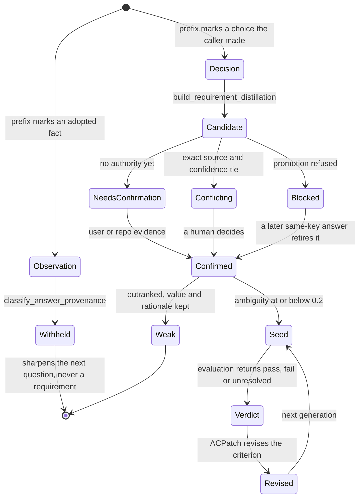

## 1. Executive Summary

Ouroboros is a spec-first workflow engine for AI coding — 310,000 lines of
Python across 573 modules, MIT, 2,072 commits since 21 January 2026 — that
positions itself as an "Agent OS" and drives fourteen named agent hosts through
one loop: interview the human, crystallize an immutable Seed, execute, evaluate,
reflect, repeat.

**It is not a memory system, and that is what makes it worth reading here.** The
durable store holds no facts about the world, no user profile, no retrieved
documents. It holds a **decision ledger**: for each key of a specification, what
the system currently believes the user wants, which authority that belief rests
on, how the decision was reached, and — when a better source arrived — the older
value with a written note saying what displaced it. Nearly every mechanism this
atlas hunts for in knowledge stores turns out to be here, applied to intent.

Three things are genuinely good. First, **provenance is two axes, not one.**
`LedgerSource` records what kind of authority a value rests on — a user goal, a
repository fact, a conservative default, an assumption — and `DecisionProvenance`
records separately how the decision was reached: `USER_CONFIRMED`,
`MODEL_INFERRED`, `TIMEOUT_DEFAULT`, `LATERAL_CONSENSUS`, `MAINTAINER_POLICY`.
The module says why the split exists: a timeout-defaulted decision had been
indistinguishable from a user-confirmed one, so degraded specifications executed
silently. The two model-derived provenances are gated; the three grounded ones
pass unconditionally.

Second, **an adopted fact is structurally barred from becoming a requirement.**
`bigbang/answer_provenance.py` classifies an interview answer once, where it
enters, on its advertised prefix: `[from-code]`, `[from-repo]`, `[from-research]`
and `[from-data]` mark something the user *adopted* rather than *decided*. The
content is withheld from the answer slot — the slot requirements are read from —
and left intact in the question slot, because sharpening the next question is
what the observation was collected for. `test_observation_content_never_reaches_a_requirement_consumer`
runs that assertion against all four render surfaces at once.

Third, **conflict resolution has no model in it.** `resolve_conflict` walks a
fixed ten-entry source-priority ladder, falls back to confidence, and returns
`CONFLICTING` only on an exact tie — at which point the driver blocks rather
than invent a merge. The loser is demoted to `WEAK` and keeps its value and a
rationale string naming what displaced it.

The weakness is the one the design implies rather than one it got wrong: **the
belief has a horizon of one build.** The ledger is per-session, the lineage is
per-task, and no path carries a settled decision from a finished run into a new
one. `project_map.py` can enumerate a project's past runs, but nothing reads them
to answer "we already decided this last month". A system whose headline is *"it
gets smarter on its own"* accumulates, at this commit, within a lineage and not
across them.

## 2. Mental Model

A memory here is a **ledger entry**: one decision about one key of a
specification. `auto/ledger.py` gives it a value, a `LedgerSource`, a
`DecisionProvenance`, a confidence, and a `LedgerStatus` from `MISSING`, `WEAK`,
`DEFAULTED`, `INFERRED`, `CONFIRMED`, `CONFLICTING`, `BLOCKED`. Alongside it,
`core/requirement_candidate.py` models the pre-Seed form with its own vocabulary
— `CandidateResolution` of `CONFIRMED` / `NEEDS_CONFIRMATION` / `UNKNOWN` /
`CONFLICTING`, a `ConfirmationAuthority` of `USER` / `REPO_EVIDENCE` / `NONE`
held deliberately separate from `CandidateContentSource`, and a
`PromotionDisposition` of `PROMOTE` / `OMIT` / `BLOCK`.

The separation of *where content came from* and *who confirmed it* is the load-
bearing idea. A value can be `MODEL_INFERRED` in origin and `USER` in authority;
the two fields never collapse, so the question "why do you believe that" and the
question "who signed off" have different answers and both are stored.

A belief becomes durable in stages. An utterance is classified as decision or
observation at the moment it is recorded. A decision distills into a candidate.
A candidate is confirmed by the user or by repository evidence, or it waits, or
it conflicts. Confirmed candidates promote into a Seed — and the Seed is frozen,
never mutated. A belief stops being one in exactly three ways: it is **demoted**
to `WEAK` by a higher-priority source, with the old value and a rationale
retained; it is **blocked**, which is a human-decision surface rather than a
terminal state, and an earlier transient blocker can be retired by a later
same-key answer; or its acceptance criterion is **revised** in the next
generation through an `ACPatch` of `keep` / `revise` / `add`. Deletion is absent
by construction — `remove` was deliberately left out of the v1 patch vocabulary
because dropping an AC would shift the positional identity that regression
detection depends on.

Above a Seed sits the lineage. `core/lineage.py` tracks O₁ → O₂ → … → Oₙ as
frozen read models projected from events and never persisted directly. An
acceptance criterion carries a `semantic_ac_key` — a SHA-256 digest of its
description, verify command, expected artifacts and output assertion, with list
position and session identity deliberately excluded — so the same criterion keeps
one identity across retries and successors, and a semantically replaced one gets
a new key. `ACResult` then adds the epistemic layer the atlas cares about most:
`authority_state` returns `pass`, `fail` or `unresolved`, and an overridden
verdict retains what the evaluator originally said in `provisional_verdict`
alongside the overriding source and reason.

## 3. Architecture

Nothing has to be running. Ouroboros is a Python package installed by `pipx` or
`uv tool`, exposing a `ouroboros` CLI (aliased `ooo`) and an MCP server, with a
Rust TUI crate under `crates/ouroboros-tui` and a Bun plugin for OpenCode. There
is no daemon, no server, no container, no vector service, and no queue.

Durable state lands in three places:

- **`~/.ouroboros/ouroboros.db`** — a single global SQLite database resolved by
  `config/models.py:resolve_event_store_path`, with exactly two tables. `events`
  is the append-only log: `id`, `aggregate_type`, `aggregate_id`, `event_type`,
  a JSON `payload`, a timestamp and a `consensus_id`, with five indexes.
  `brownfield_repos` registers repositories. Two migrations, dated 16 January and
  18 March 2026, are the whole schema history.
- **`~/.ouroboros/data/*.json`** — interview and auto-pipeline state, written
  through `core/owner_only.py:write_owner_only` at mode 0600 in directories at
  0700, atomically, with the parent directory fsynced and a warning logged when
  durability cannot be confirmed.
- **`.ouroboros/artifacts/<prefix>/<sha256>.json`** — content-addressed bodies
  for Disposable Memory, with per-contract manifests holding reference and
  tombstone history, guarded by one cross-process store lock.

The split between the first two matters more than it looks. The event log stores
**previews, not content**: `events/interview.py` writes `initial_context[:500]`,
`question_preview[:200]` and `response_preview[:200]`, and the timing payload is
commented as "privacy-safe". `events/base.py` additionally strips every nested
`raw_*` and `subscribed_*` key before persistence, so an event payload cannot
carry another event payload. The consequence is worth stating plainly: the
permanent, global audit trail cannot reconstruct the content it audits, and if
`ooo cleanup` prunes a terminal session's state file, the 200-character preview
is what remains.

There is no retrieval stack because there is nothing to search. Twelve runtime
dependencies — `aiosqlite`, `anyio`, `click`, `jsonschema`, `pydantic`,
`prompt-toolkit`, `python-dotenv`, `pyyaml`, `rich`, `sqlalchemy`, `structlog`,
`typer` — and not an embedding, index or similarity function among them.

### Deployment and ergonomics

One command installs it; it runs fully local and offline apart from whichever LLM
the chosen host calls. No API key is needed to *store* anything — the event log
and state files work with no provider configured — though the interview,
reflection and evaluation stages are all LLM calls, so an unconfigured install
stores nothing interesting. Every durable file is JSON or SQLite and repairable
by hand.

The dependency policy is the most careful this atlas has read. Runtime
dependencies carry bounded ranges; optional extras are **exact-pinned on
purpose**, with the reason in the manifest: a future compromised "latest" must
not be auto-pulled on a fresh PyPI install, since `pipx` and `uv tool` resolve
from package metadata and not from `uv.lock`. The comment names the March 2026
litellm 1.82.7/1.82.8 incident as the motivation, `uv.lock` hash-pins the full
transitive graph, and a test —
`test_runtime_and_optional_dependencies_have_upper_bounds` — enforces that
runtime deps stay ranges and extras stay exact. `python-dotenv` gets a tighter
patch-only ceiling than its neighbours because it parses `.env`, which the
codebase names as a trust boundary.

Against that, the repository's own `.mcp.json` starts the server with
`uvx --isolated --from "ouroboros-ai[mcp]"` and no version, so a harness reading
that file resolves the newest published `ouroboros-ai` at every start. The
exact-pinned extras bound what that pulls in transitively; the package's own
version floats.

## 4. Essential Implementation Paths

**Capture and classification.** `bigbang/interview.py:InterviewState.record_answer`
is the single point where an answer enters. `bigbang/answer_provenance.py:classify_answer_provenance`
reads the advertised prefix and settles provenance as a typed field; consumers
read the field and never re-read the marker. The module documents the drift this
prevents: `_classify_interview_answer_source` in `mcp/tools/authoring_handlers.py`
classifies `[from-research]` as human, and that is exactly the per-surface
re-reading the design removes.

**Distillation.** `bigbang/requirement_distillation.py:build_requirement_distillation`
turns rounds into `RequirementCandidate` records with tagged
`RequirementEvidence`. This path emits a Seed with no LLM in it, which is why the
withholding must be structural rather than prompt-level — a redaction that lived
in a prompt template would never have reached here.

**Conflict resolution.** `auto/ledger.py:resolve_conflict` compares normalized
values first (identical values are `SAME_VALUE`, not a conflict), then handles
`BLOCKED` in both directions, then indexes both sources into `SOURCE_PRIORITY`,
then compares confidence, and only then returns `CONFLICTING`. The surrounding
`add_entry` logic applies the outcome: the loser's status becomes `WEAK` and its
`rationale` is set to a sentence naming the reason — "Superseded by a later
user-confirmed answer", "Superseded by deterministic source-priority/confidence
policy", "Conflicts with another same-priority auto ledger answer".

**Gate.** `bigbang/ambiguity.py` scores goal clarity at 40%, constraint clarity
at 30% and success-criteria clarity at 30%; `AMBIGUITY_THRESHOLD = 0.2` decides
whether the ledger may become an executable Seed. `auto/grading.py` holds the
separate gate that `MODEL_INFERRED` and `TIMEOUT_DEFAULT` decisions must pass.

**Crystallization.** `core/seed.py` freezes the Seed and derives
`semantic_ac_key` per criterion via `derive_semantic_ac_key`.

**Reflection.** `evolution/reflect.py:ReflectEngine` reads the prior generation's
evaluation results, the current ontology and the wonder output, and emits
`ACPatch` deltas and `OntologyMutation` records for the next Seed. Interview runs
for generation 1 only; Reflect handles every generation after it.

**Regression.** `evolution/regression.py:RegressionDetector` computes regressions
from lineage history with no new storage — an AC that passed in any prior
generation and fails in the latest is a regression, tracked with its consecutive-
failure count.

**Rewind.** `evolution/rewind.py` returns a `CommittedRewindResult` carrying a
`rewind_event_id`. Rewinding to an earlier generation appends an event; it does
not delete the generations after it.

**Invalidation.** `InterviewState.discard_stale_requirement_distillation`, called
on every `load_state`, drops a cached distillation unless it matches both a
`requirement_input_revision` and a `requirement_input_fingerprint` — a code
version and a content hash. A derived belief survives a reload only if neither
its inputs nor the logic that derived them changed.

**Projection.** `project_map.py:ProjectMap.build` enumerates all sessions, filters
on `project_id` or `project_root`, rejects a session whose start identity is
partial or duplicated, and raises `ProjectRunLimitError` past its limit rather
than return a truncated history.

**Artifact lifecycle.** `persistence/artifact_store.py` writes bodies by SHA-256,
tracks per-contract references and retention, and prunes only under the store
lock, with the prune reason recorded. `ArtifactTombstonedError` makes a replay of
a pruned artifact fail loudly.

## 5. Memory Data Model

The relational schema is two tables and neither is about memory content. Identity
and structure live in Pydantic models, almost all `frozen=True`.

A `LedgerEntry` carries a section key, a value, a `LedgerSource`, a
`DecisionProvenance`, a confidence, a `LedgerStatus`, and a `rationale` that is
written when the entry loses a conflict. Ten required sections — goal, actors,
inputs, outputs, constraints, non_goals, acceptance_criteria, verification_plan,
failure_modes, runtime_context — define what a complete belief set looks like.

A `RequirementCandidate` carries `candidate_id`, a `RequirementSection` from a
nine-value enum, text bounded at 8,000 characters, a `CandidateContentSource`, a
`CandidateResolution`, a `ConfirmationAuthority`, and typed `RequirementEvidence`
items. Reference-derived evidence is validated to require a `reference_id`, so a
claim sourced from a reference cannot be stored without naming which one.

Scoping is a `ProjectIdentity` of `project_id`, `project_root` and
`workspace_path`, where `project_id` is derived from the canonical root and
re-derived in `__post_init__` to reject a mismatched pair. It is written onto
session events through `to_event_data()` and applied as a read filter in
`project_map.py`. A session whose start event carries only part of the identity
raises `ProjectIdentityConflictError` rather than being partially attributed.

Temporal fields are single-axis. Events carry one `timestamp`, which is record
time; artifacts carry `retain_until`; the interview state carries an updated-at
stamp. Nothing tracks when a belief was *true* separately from when it was
*written*, which is the right call for a store whose subject is a decision rather
than a fact about the world.

Episodic and semantic material are not separated because neither exists.
Everything here is what the atlas would call procedural and normative: what to
build, how it will be checked, and who said so.

## 6. Retrieval Mechanics

There is no search. No keyword index, no embeddings, no graph traversal, no
reranking, no LLM judge over stored material, no token budgeter for injected
memories. The read paths are three:

- **Replay by identity.** `EventStore.replay(aggregate_type, aggregate_id)`
  reconstructs one aggregate. Lineages and sessions are read models rebuilt this
  way and never persisted directly.
- **Load by key.** `load_state(interview_id)`, `AutoStateStore.load(session_id)` —
  a file path derived from an id, under a shared file lock, with the stale-
  distillation check on the way out.
- **Enumerate and filter.** `get_all_sessions()`, `get_recent_events(limit=100)`,
  `query_latest_events_per_aggregate`, and the project-scoped filter above.

Retrieval is application-driven throughout: `ooo resume`, `ooo status`,
`ooo cancel`, the TUI session selector, and the MCP resource handlers each ask
for what they need by identity. The agent never issues a memory query.

The failure modes that follow are the ones a store without ranking has. Recall is
exact or absent — there is no fuzzy path to a prior decision, so a decision the
caller cannot name by id is unreachable. And because the reflect prompt assembles
the prior generation's material directly rather than selecting from a corpus,
context growth is bounded by generation count rather than by store size, with
`core/text.py:truncate_head_tail` doing the trimming.

## 7. Write Mechanics

Writes are **synchronous and blocking**, and this is the correct choice for the
subject matter: a decision the user just made must be durable before the next
question is asked. There is no deferred extraction, no lag before a memory is
retrievable, and no eventual consistency to reason about.

`InterviewEngine.save_state` serializes on the event loop, then offloads the
locked write to a thread so the loop is not stalled; `write_owner_only` writes
atomically, chmods to 0600, and fsyncs the parent directory, returning whether
durability was confirmed and logging
`interview.state_save_durability_uncertain` when it was not. `EventStore` offers
both `append` and `append_durable(event, timeout=...)`, plus conditional
appenders — `append_session_start_if_absent`, `append_session_terminal_if_active`,
`append_session_pause_if_active` — that make idempotence a property of the store
rather than of every caller.

Extraction is partly LLM and partly not, and the split is deliberate. The
interview and reflection stages call a model; `build_requirement_distillation`
does not, and `resolve_conflict` does not. Where a wrong answer would silently
corrupt the specification, the logic is deterministic.

Deduplication is by normalized value: identical values on the same key resolve to
`SAME_VALUE` and no conflict is raised. Update is append-with-demotion rather
than overwrite — the superseded entry keeps its value and gains a rationale.

Forgetting exists in two forms. `ooo cleanup` prunes merged worktrees, stale
locks, and terminal-phase state files whose worktree is gone, defaulting to
completed sessions only and requiring `--state-all` to touch blocked or failed
ones. Artifacts expire by TTL crossed with per-contract retention, and the GC
takes the store lock so a new reference cannot race a prune decision; a replay
after pruning raises `ArtifactTombstonedError` rather than returning empty. **The
event log itself is never pruned** — there is no retention policy, no vacuum, and
no delete path over `events`.

Nothing runs in the background over memory. No consolidation pass, no nightly
map-reduce, no re-embedding — so the token bill scales with the day's activity
and not with the corpus.

Malicious input is handled unevenly, and the seam is worth naming. Session
signals are scrubbed against four secret-shaped regexes in
`core/session_signal.py` before they travel. Interview answers are validated for
emptiness and length only — `InputValidator.validate_user_response` does no
redaction — and while the event log records just a 200-character preview, the
state file under `~/.ouroboros/data/` holds the full text at 0600. A credential
pasted into an interview answer is stored in the clear on disk and travels into
the Seed.

## 8. Agent Integration

The MCP server is the primary surface, with roughly forty handler modules under
`mcp/tools/` covering the interview, seed authoring, evaluation, evolution, jobs,
brownfield registration and projections. `.mcp.json` starts it under the
`claude-cli` runtime with the `claude_code` LLM backend; `runtime_backend` is a
`Literal` over `claude`, `codex`, `copilot`, `hermes`, `gemini`, `opencode`,
`kiro` and `goose`, with more hosts named in the README.

The model has essentially **no agency over memory**. It cannot write a belief,
promote a candidate, or resolve a conflict. It answers interview questions,
executes against a frozen Seed, and produces evaluation verdicts; the ledger's
transitions are code. Where a model does shape the store — the interview, the
reflect stage, auto-fill — its output is tagged with a provenance that a gate
later checks, rather than entering as an unmarked fact.

Two Claude Code hooks ship in `.claude/settings.json`, and both are local and
read-only: `scripts/keyword-detector.py` parses the prompt for trigger words and
prints a skill suggestion, and `scripts/drift-monitor.py` stats
`~/.ouroboros/data/interview_*.json` and prints an advisory if a session was
touched in the last hour. Neither reaches the network or reads outside the
project and that directory.

Adapting the integration for another harness is the design's stated purpose and
the code supports it: the runtime adapter layer under `providers/` and
`interview_adapters/` is where host differences live, and `SessionSignalCapabilities`
defaults every runtime ability to unsupported so adding a capability contract
cannot change an existing runtime's behaviour.

## 9. Reliability, Safety, and Trust

Provenance is the strongest thing here. Two orthogonal axes, decided at the
boundary, carried as typed fields, gated where they are weakest. `ACResult`
retains the provisional verdict, the overriding source and the override reason
whenever an evaluator's verdict is overturned, so a `pass` that was originally a
`fail` can always be told from one that never was. Uncertainty has somewhere to
live: `unresolved` is a distinct authority state from `fail`, and an unresolved
criterion stays in the evolution working set.

Injection resistance is unusual in shape. Because the model cannot write a
belief, a prompt-injected "remember that X" has no store to land in. The nearest
real surface is repository-derived content — `[from-code]` and `[from-repo]`
answers reflect what is in the tree — and the withholding rule is precisely the
mitigation: adopted material can sharpen a question but cannot become a
requirement. It still reaches the question slot, and the test suite pins that as
intended rather than conceded.

Concurrency is handled with more care than the single-user framing requires:
`BEGIN IMMEDIATE` on SQLite writes, a cross-process artifact store lock, file
locks around interview state, lease-based advancement claims with waiters in
`persistence/lineage_claims.py`, and a settlement fence for transactional writes.

Three real gaps. **Interview content is unredacted at rest**, as above. **The
audit trail cannot reconstruct what it audits** — the global event log holds
previews, the content lives in files that `ooo cleanup` can delete, and the two
have different lifetimes. And **the global database is unbounded**: `events`
accumulates across every project on the machine forever, with no retention path,
which is a defensible choice for an audit log and an undocumented one for disk.

Backup and replication are absent by design; the store is a file the user owns.

## 10. Tests, Evals, and Benchmarks

15,650 test functions across 724 files, nine CI workflows including bespoke gates
for module size, an auto-mode performance budget, a max-turns envelope and an
auto-boundary check.

The memory-relevant testing is genuinely good.
`tests/unit/bigbang/test_answer_provenance.py` is the piece to copy: twenty
tests around one rule, including a **negative eval** parametrized across all four
requirement-consuming render surfaces asserting that an observation's content is
absent and the withheld-note present; a companion test asserting the user's
decision in the same interview survives; a test asserting an interview with no
observation renders exactly as before; and a test pinning that the *question*
line is deliberately not redacted, with a docstring explaining that redacting it
would make the user's own answer uninterpretable and that this is "intended
behavior, not a conceded leak". Separate tests cover a round persisted before the
provenance field existed, a legacy reframed answer recovering its provenance, and
a distillation cached before the change not being reused.

`tests/canonical/README.md` is unusually honest about what its harness is not:
"no CI obligation", not a regression engine, not a replay system, not a
cost-budgeted runner, with CI running a fixture shape-check only and the live run
gated behind `OUROBOROS_RUN_CANONICAL=1` and an acknowledged token cost.

The one committed experiment is the most creditable artifact in the repository
and the sharpest contrast with the README. `tests/canonical/evidence/issue-1450-20260715-162447-736593/REPORT.md`
records a live paired quality experiment run on 15 July 2026 against source tree
`fbf81ae`: three paired orders, six arms, 393 seconds, 46 committed evidence
files. Its verdict is **`inconclusive`** — all three pairs were `invalid`, both
arms failed different mandatory gates, and the report says so, adds "do not wire
the treatment into production based on this run", declines to report cost because
"an exact cost cannot be reported without fabrication", and closes by refusing to
generalize beyond the frozen `cli-todo` fixture.

Set against that: the README's headline is "It gets smarter on its own", its
results table promises "12 hidden assumptions exposed, ambiguity scored to 0.19",
and its comparison table claims a low rework rate. No committed artifact measures
any of those. The engineering discipline inside the repository is not the
discipline of the front page.

What is missing before trusting the store: no test asserts that a credential in
an interview answer is redacted anywhere, and none covers the event log's growth
or an operator's ability to bound it.

## 11. For Your Own Build

### Steal

**Decide provenance once, at the boundary, and carry it as a type.** The
`answer_provenance` module exists because the same marker was being re-read by
each consumer and one of them got it wrong. A field set where the data enters
cannot drift; a regex re-applied per surface will.

**Split what a value rests on from how the decision was reached.** One
provenance axis conflates a user's answer with a model's guess that a human
happened to accept. Two axes let you gate the weak combinations —
`MODEL_INFERRED` and `TIMEOUT_DEFAULT` behind a clarity threshold — without
distrusting everything a model touched.

**Withhold by role, not by string.** The same text is an observation in the
answer slot and useful context in the question slot. A rule that redacts the
string everywhere destroys the second use; a rule scoped to the slot keeps it.
Then pin the intentional non-redaction with a test, or a later contributor will
"finish the job".

**Resolve same-key conflicts with a fixed priority ladder and no model.** Ten
ordered sources, then confidence, then a tie that blocks. It is auditable,
reproducible, free, and it makes the residual human decision small and rare —
which is the difference between a contradiction queue that drains and one that
grows.

**Demote instead of deleting, and write the reason in the record.** A `WEAK`
entry carrying its old value and the sentence "Superseded by a later
user-confirmed answer" answers "why does the system think this now" without a
separate audit join.

**Invalidate a derived cache on both a content fingerprint and a code
revision.** Most stores that cache an extraction re-derive it when the input
changes and never when the extractor does, so an improved extractor silently
leaves old records behind.

**Make a scope key derivable and verify it on construction.** `project_id` is a
function of the project root, re-derived in `__post_init__`; a mismatched pair
cannot exist. Refusing a *partial* identity rather than repairing it is the same
instinct.

**Fail rather than truncate a history.** `ProjectRunLimitError` past the run
limit is better than a silent partial answer, because a truncated history reads
exactly like a complete one.

**Commit the inconclusive experiment.** A repository containing a negative
result with its raw evidence is telling you something no benchmark table can.

### Avoid

**Do not let an unbounded global log accumulate with no retention story.** One
SQLite file under `$HOME` collecting every event from every project forever needs
either a documented growth bound or a prune path; an append-only log with neither
is a decision deferred onto the user's disk.

**Do not let the audit trail and the content it audits have different
lifetimes.** Previews in a permanent log plus full text in files a cleanup
command deletes means the surviving record cannot explain itself.

**Do not treat "the user typed it" as "the user consented to store it."** An
interview is a text field, users paste secrets into text fields, and length
validation is not redaction. If one code path already knows what a credential
looks like — this one has four regexes for exactly that — run it where content
becomes durable, not only where it travels.

### Fit

This is a large, opinionated system with a narrow purpose, and the fit question
is not about memory at all. If you want a store for what an agent has learned
about a user or a domain, walk away: there is nothing here to retrieve, no
knowledge accumulates, and a finished run teaches the next one nothing. If you
want an engine that forces a specification out of a vague request and then holds
the agent to it, this is a serious implementation of that idea with the
provenance machinery to back it.

The maintenance budget it assumes is real — 310,000 lines and 573 modules,
carried by one dominant author and a handful of regulars, with bespoke CI gates
that exist because the codebase is large enough to need them. The deployment cost
is almost nothing, which is the trade: complexity concentrated in the package
rather than in the operator's infrastructure.

The people who should read it and take only the parts are builders of memory
systems who have a trust field they are not sure how to populate. The four
enums in `auto/ledger.py` and `core/requirement_candidate.py` are perhaps two
hundred lines total and encode more careful thinking about epistemic state than
most dedicated memory stores in this atlas manage across their whole schema.

## 12. Open Questions

- Does anything carry a settled decision from a completed run into a new one? No
  read path found does, but the surface is large and `project_map.py` shows the
  data would support it.
- How large does `~/.ouroboros/ouroboros.db` get for a heavy user over months?
  Answering this needs a real usage history rather than a checkout.
- Does the interview state file ever get redacted before or during the handoff to
  an external host's context? The Seed is what travels; whether an unredacted
  answer reaches a provider depends on adapter behaviour that would need running
  to observe.
- What fraction of real interviews end in `CONFLICTING` and reach a human? The
  ladder is designed to make that rare and no committed telemetry says whether it
  is.
- The README names two sibling repositories, `Ouro-labs/ourocode` and
  `Ouro-labs/ouroboros-plugins`. Whether either introduces cross-run memory was
  not examined.

## Appendix: File Index

**Storage and schema** — `src/ouroboros/persistence/schema.py`,
`src/ouroboros/persistence/migrations/scripts/001_initial.sql`,
`src/ouroboros/persistence/migrations/scripts/002_brownfield.sql`,
`src/ouroboros/config/models.py` (`get_config_dir`, `resolve_event_store_path`),
`src/ouroboros/core/owner_only.py`.

**Belief model** — `src/ouroboros/auto/ledger.py`,
`src/ouroboros/core/requirement_candidate.py`,
`src/ouroboros/bigbang/answer_provenance.py`,
`src/ouroboros/core/lineage.py`, `src/ouroboros/core/seed.py`.

**Write path** — `src/ouroboros/persistence/event_store.py`,
`src/ouroboros/bigbang/interview.py` (`save_state`, `load_state`,
`discard_stale_requirement_distillation`), `src/ouroboros/auto/state.py`,
`src/ouroboros/persistence/lineage_claims.py`.

**Read and projection** — `src/ouroboros/project_map.py`,
`src/ouroboros/core/project_identity.py`,
`src/ouroboros/evolution/regression.py`, `src/ouroboros/evolution/rewind.py`.

**Gates and evolution** — `src/ouroboros/bigbang/ambiguity.py`,
`src/ouroboros/auto/grading.py`, `src/ouroboros/evolution/reflect.py`,
`src/ouroboros/evolution/loop.py`.

**Forgetting** — `src/ouroboros/persistence/artifact_store.py`,
`src/ouroboros/persistence/artifact_binding.py`,
`src/ouroboros/cli/commands/cleanup.py`,
`src/ouroboros/core/disposable_memory.py`.

**Safety** — `src/ouroboros/core/security.py`,
`src/ouroboros/core/session_signal.py`, `src/ouroboros/events/base.py`.

**Integration** — `.mcp.json`, `.claude/settings.json`,
`scripts/keyword-detector.py`, `scripts/drift-monitor.py`,
`src/ouroboros/mcp/tools/`.

**Tests and evidence** — `tests/unit/bigbang/test_answer_provenance.py`,
`tests/canonical/README.md`,
`tests/canonical/evidence/issue-1450-20260715-162447-736593/REPORT.md`.

## History

**2026-08-13** — [`6deb72d37da119bd6419be4d0508b71bfc3b5b59`](https://github.com/Q00/ouroboros/commit/6deb72d37da119bd6419be4d0508b71bfc3b5b59)
— first reading, at release v0.51.3. Screened before reading: 2 auto-run surfaces
(`.claude/settings.json` hooks, `.mcp.json` MCP server), 2 dependency surfaces
inside the seven-day cooldown (`pyproject.toml`, `uv.lock`), 1 unpinned manifest
(`src/ouroboros/opencode/plugin/package.json`, two `latest` ranges); both hooks
read only the project and `~/.ouroboros/data` and reach no network. Nothing was
installed and nothing was executed.
