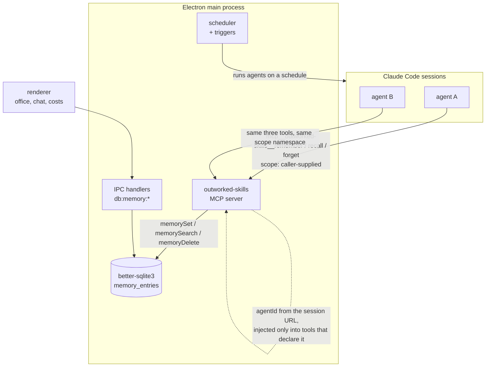

## 1. Executive Summary

Outworked is a macOS Electron app that runs Claude Code agents as employees in a
pixel-art office: you hire an agent, give it a role, watch its sprite work, and
pay for it on a cost dashboard. GPL-3.0, v0.4.3, ~41,000 lines of TypeScript and
JavaScript. Nothing in the pitch mentions memory.

Underneath it is a real one. `electron/db/database.js` keeps a `memory_entries`
table, and `electron/mcp/mcp-server.js` exposes three built-in tools — named
`remember`, `recall` and `forget` — on an MCP server that `src/lib/ai.ts` mounts
into **every** agent session, filtering out any user-configured duplicate so its
own entry always wins. The model is the caller. That is the whole test for
whether a searchable store is agent memory rather than a product feature, and
this one passes it in the vocabulary the atlas uses.

**What is genuinely good here is its smallness.** The write path calls no model,
computes no embedding, and runs no background job: `remember` is one upsert. The
search escapes `LIKE` wildcards so a user string cannot become a pattern. The
scope vocabulary — `global`, `agent:<id>`, `project:<path>` — is written in the
tool description, which is where the writer actually reads it.

**The weakness is one line that does not exist.** The MCP session already knows
which agent is talking: the server is mounted at a URL carrying `agentId`, and
`mcp-server.js:831-833` injects that id into tool arguments *for the tools that
declare an `agentId` parameter*. The memory tools do not declare one; they take
`scope`. So an agent asked to keep something private writes it under
`agent:<its own id>` by convention, and any other agent can read or overwrite it
by passing that string. The identity is present at the boundary and is not
applied to the store.

## 2. Mental Model

A memory is a string under a key, in a namespace the writer names.

```text
     remember(scope, key, value)          recall(scope, query?)
                │                                  │
                ▼                                  ▼
        ┌───────────────────────────────────────────────┐
        │ memory_entries  UNIQUE(scope, key)            │
        │   id = "<scope>:<key>"                        │
        │   value  ← overwritten in place on re-set     │
        │   created_at / updated_at                     │
        └───────────────────────────────────────────────┘
                │
         forget(scope, key) ──► DELETE, returns changes > 0
```

There are no states. A row is present or absent; nothing marks it doubtful,
superseded, rejected or stale, and no field records where the value came from or
which agent wrote it. Re-setting a key destroys the previous value with no
history, and `forget` destroys the row with no trace — so the store cannot
express *this was believed and is not any more*, only *this is not here*.

Control is **agent-controlled**, almost purely. The three tools are the entire
interface, the model chooses when to call them, and there is no automatic
capture, no extraction from transcripts, and no injection of memory into a
prompt anywhere in the tree. Nothing recalls unless the model decides to.

The system treats what it holds as ground truth, and has no way not to.

## 3. Architecture



**Runtime shape.** One Electron app. The main process owns the SQLite handle,
the MCP server and the scheduler; the renderer reaches the same database over
`ipcMain.handle("db:memory:set" | ":search" | ":delete", …)`
(`electron/main.js:2680-2684`). `electron/sdk-bridge.js` runs the Claude Agent
SDK per employee and recognises `mcp__outworked-skills__*` tool names on the way
through.

**Persistence.** `better-sqlite3`, with a `schema_migrations` table and
`db.transaction()` around each migration. Beside `memory_entries` sit
`scheduled_tasks`, `task_run_logs`, `channel_configs`, `channel_messages`,
`triggers`, `skill_auth`, `app_settings`, `cost_records`, `cost_cumulative`,
`cost_budgets` and `custom_skills` — coordination and billing state, none of it
memory.

**Search.** SQL `LIKE`, no index on `value`, `idx_memory_scope` on the scope
column. No embeddings anywhere in the tree; the vector-adjacent code you might
expect is absent.

### Deployment and ergonomics

A signed macOS `.dmg` — this is a desktop application, not a library, and there
is no headless mode. It requires Claude Code on the machine and a workspace
directory. Everything is local: the database lives in the app's userData
directory and nothing is synced. The store is SQLite, so it is inspectable and
repairable with any client, which is the practical mitigation for most of
section 9.

`src/components/McpServersModal.tsx:73-76` offers
`@modelcontextprotocol/server-memory` from the registry as an installable
server, described as *"Persistent key-value memory"*. An operator who enables it
has two key-value memories mounted at once, neither aware of the other, with
overlapping tool semantics and separate stores.

## 4. Essential Implementation Paths

**Write.** `electron/mcp/mcp-server.js:519` `case "remember"` →
`db.memorySet(args.scope, args.key, args.value)` →
`electron/db/database.js:318`, which computes `id = ${scope}:${key}` and runs an
`INSERT … ON CONFLICT(scope, key) DO UPDATE SET value = excluded.value,
updated_at = excluded.updated_at`. The old value is gone. Returns the row to the
model as `Remembered: [scope] key`.

**Read.** `:523` `case "recall"` → `database.js:339` `memorySearch(scope, query,
{limit = 200, offset = 0})`. With a query it escapes `%`, `_` and `\` —
`query.replace(/[%_\\]/g, "\\$&")` — and runs
`WHERE scope = ? AND (key LIKE ? ESCAPE '\' OR value LIKE ? ESCAPE '\') ORDER BY
updated_at DESC LIMIT ? OFFSET ?`. Without one it lists the scope, newest first.
Results are rendered to the model as `[key] value.slice(0, 500)` joined by blank
lines — so a value longer than 500 characters is silently truncated at the point
of recall, and the model is not told.

**Delete.** `:532` `case "forget"` → `database.js:366`, a `DELETE … WHERE scope =
? AND key = ?` returning `changes > 0`, reported as `Forgot:` or `Not found:`.

**Mounting.** `src/lib/ai.ts:227-253` assembles each agent's MCP configuration,
skips any user entry named `outworked-skills`, and adds its own with
`agentId` in the query string (`:247`). `:320` allows the tool pattern
`mcp__outworked-skills__*`.

**Identity at the boundary.** `mcp-server.js:929` reads
`reqUrl.searchParams.get("agentId")`; `:795` threads it into
`handleMcpRequest(msg, agentId, allowedRuntimes)`; `:831-833` sets
`toolArgs.agentId = agentId` when the tool's arguments do not already carry one.
`create_trigger` and `list_triggers` declare `agentId` and benefit. `remember`,
`recall` and `forget` declare `scope`, and nothing maps one to the other.

**Sessions.** `src/lib/sessions.ts:169` migrates an agent's in-memory history
into a persisted session for resume — conversation state, not memory.

**Tests.** `electron/db/test-migrations.js`, `electron/mcp/test-mcp.js`,
`electron/mcp/test-mcp-injection.js`, `electron/triggers/test-triggers.js`. None
of them touches `memorySet`, `memorySearch` or `memoryDelete`.

## 5. Memory Data Model

```sql
CREATE TABLE IF NOT EXISTS memory_entries (
  id TEXT PRIMARY KEY,          -- "<scope>:<key>"
  scope TEXT NOT NULL,
  key TEXT NOT NULL,
  value TEXT NOT NULL,
  created_at INTEGER NOT NULL,
  updated_at INTEGER NOT NULL,
  UNIQUE(scope, key)
);
CREATE INDEX IF NOT EXISTS idx_memory_scope ON memory_entries(scope);
```

That is the whole model. **Scoping** is three documented conventions —
`global`, `agent:<id>`, `project:<path>` — enforced as string equality and
nothing else: no foreign key to an agent row, no validation that the shape is one
of the three, no rejection of an unknown namespace. A typo creates a new scope
silently, and a scope no agent uses is invisible rather than an error.

**Provenance:** none. The row does not record which agent wrote it, whether a
human dictated it or a model inferred it, or what it was derived from.
**Temporal:** `created_at` and `updated_at`, both ingestion time; there is no
notion of when the fact was true. **Versioning:** none — the upsert is the
version. There is no episodic/semantic split, no profile, no summary and no
document type; every memory is the same shape.

## 6. Retrieval Mechanics

One channel: substring match inside one scope. No ranking beyond
`ORDER BY updated_at DESC`, no relevance score, no fusion, no reranking, no
query transformation. `limit` defaults to 200 through the API and the MCP path
passes no override, so a `recall` on a large scope returns up to 200 rows and the
model pays for all of them — the only budget is the 500-character truncation per
value.

Retrieval is **tool-mediated and never automatic**. Nothing injects memory into a
system prompt at session start; if the model does not call `recall`, the store
might as well be empty. For a product whose premise is a persistent team of
employees, that is the load-bearing design decision, and it is made by omission
rather than argued.

**Failure modes.** A `LIKE '%q%'` over `value` finds a substring and not a
meaning, so recall is exact-ish and brittle: an employee that stored *"prefers
pnpm"* will not find it searching *"package manager"*. There is no
under-recall signal — an empty result and a wrong scope string are the same
answer, `No memories found in scope "…"`.

## 7. Write Mechanics

Writes are synchronous, model-initiated, and cost nothing beyond the tool call.
No extraction prompt, no consolidation pass, no dedupe, no conflict detection.
The nearest thing to a policy is the `remember` description telling the model
what the scopes mean, which is
[tool descriptions as policy](../../compare/#tool-descriptions-as-policy) with
no backend behind it — nothing validates the scope, and nothing constrains what
the model considers worth storing.

**Update is destruction.** The upsert overwrites `value` in place. If an agent
re-remembers a key with a worse value, the better one is gone; there is no
supersession chain, no previous-value column and no audit row.

**Delete is destruction.** `forget` removes the row. A later `remember` of the
same `(scope, key)` re-creates it with no memory that it was ever deleted, which
is the rejected-value gap in its plainest form: the store cannot distinguish
*never known* from *deliberately forgotten*.

**Malicious input.** Values are stored verbatim and rendered back into the
model's context by `recall` as plain text with no fence or envelope. Any agent
can write to `global`, so one compromised or confused employee can leave an
instruction where every other employee will read it. The `LIKE` escaping shows
the codebase thinks about injection at the SQL layer; the prompt layer has no
equivalent.

### Operational cost

Write: one SQLite upsert, no model call, no lag — a memory is retrievable the
instant the tool returns. Read: up to 200 rows × 500 characters, on demand only.
No background pass ever re-reads or rewrites the store, so the token bill scales
with what the agents choose to do and not with the corpus. On this axis the
design is close to ideal, and it is worth saying that plainly before section 9.

## 8. Agent Integration

The MCP server is always mounted, per agent, and its three memory tools sit
beside `send_message`, `list_channels`, `read_channel_messages`, `tunnel_*`,
`create_trigger`, `list_triggers`, `update_trigger`, `delete_trigger`,
`list_skills` and `get_app_documentation`. Skills contribute further tools
discovered at runtime.

Agency over memory is total and unsupervised: the model decides what to store,
under which scope, and when to delete. There is no review surface — the renderer
has an `AgentEditor`, a `SkillsModal` and an `McpServersModal`, and no memory
viewer at all, so a person cannot see what their employees have remembered
without opening the SQLite file.

`src/lib/storage.ts:153` writes a `memory:` field into a subagent's Markdown
frontmatter and `:481` reads it back, so an agent *definition* carries a memory
mode. It is configuration for the Agent SDK rather than a policy this store
enforces.

Portability is good in the way MCP makes things portable and no better: any MCP
client could mount the same server, and would inherit the same caller-supplied
scope.

## 9. Reliability, Safety, and Trust

**The scope is not a boundary.** This is the finding. Every read is filtered by
scope in SQL, which is what the `scope_enforced` mark means and all it means —
[the rubric](../../methodology/atlas-rubric/) is explicit that the column says
the key reaches the query, not that the deployment is safe. Here the key is the
model's own argument. An agent instructed to keep notes in `agent:me` has no
protection from an agent that passes `agent:someone-else`, and the app's premise
is several agents running at once under one user.

The fix is small and the material is already present: the session URL carries
`agentId`, `handleMcpRequest` receives it, and `:831-833` already injects it into
tools that declare it. Resolving `agent:<id>` server-side from that value —
rejecting or rewriting a mismatched `agent:` scope — would turn the key into a
boundary without changing the tool surface the model sees.

**No trust representation.** No status, no confidence, no provenance. A value
written by a hallucinating employee and one dictated by the user are the same
row.

**Data loss.** Two silent overwrites: the upsert, and the 500-character
truncation on recall — the second is a display truncation, so the data survives,
but a model reading a clipped value has no marker telling it so.

**Concurrency.** `better-sqlite3` is synchronous and the main process serialises
access, so concurrent agents cannot interleave a single statement. Two agents
racing on the same key still resolve last-write-wins with no detection.

**Privacy deletion** is genuine as far as it goes — the row is really gone — and
there is no export, sync or replica to chase, which is the upside of a
single-file local store.

## 10. Tests, Evals, and Benchmarks

Four hand-rolled test scripts run with bare `node`, using a local `assert(label,
condition)` helper rather than a framework: migrations, MCP request handling, MCP
server *injection* (which servers each agent sees), and triggers. The injection
file carries real negative assertions — *"no outworked-skills injected"*, *"only
1 outworked-skills entry (not 2)"* — but they are about configuration assembly,
not about memory content, so they do not earn `negative_eval`.

**The memory subsystem has no test at all.** `memorySet`, `memorySearch` and
`memoryDelete` are three small functions with an escape routine, an upsert
conflict clause and a delete predicate — the easiest things in this repository to
pin, and none of them is pinned. The tests I would want before trusting it, in
order: that a value written under one scope never appears in a `recall` on
another; that a `%` in a query matches literally; that an upsert replaces rather
than duplicates; and that `forget` returns false for a key that was never there.

No benchmark, no eval, no published numbers, and no paper.

## 11. For Your Own Build

### Steal

- **Name your memory tools in the user's vocabulary and put the namespace rules
  in the tool description.** `remember`, `recall`, `forget`, and one sentence
  saying what the three scopes mean, is a legible surface the model uses
  correctly most of the time without any prompt engineering elsewhere.
- **Escape `LIKE` wildcards before interpolating a query.** `replace(/[%_\\]/g,
  "\\$&")` with `ESCAPE '\'` is two lines and removes a class of surprise where a
  user string silently becomes a pattern.
- **Keep the write path free of model calls.** An upsert with no extraction means
  a memory is retrievable the moment the tool returns, and the write cannot fail
  because a provider is down.
- **Mount your own server unconditionally and filter user duplicates.**
  `src/lib/ai.ts` skips any user-configured `outworked-skills` entry before
  adding its own, so an operator cannot half-configure the memory out from under
  the product.

### Avoid

- **Do not take a scope from the party the scope constrains** when the session
  already knows who is asking. If your transport carries an identity, resolve the
  namespace from it and treat a caller-supplied scope as a request to be
  validated.
- **Do not truncate a recalled value without telling the model.** A clipped
  string reads as a complete one; append a marker or return the length.
- **Do not let delete and never-written be the same state** in a store several
  writers share, or one agent's `forget` is another agent's invitation to write
  it again.
- **Do not offer a second memory server beside your own** without saying which
  one wins. Two key-value memories with the same verbs and different stores is a
  configuration a user cannot reason about.

### Fit

This suits one person running a handful of agents on their own laptop who wants
memory to be *simple and legible* — a SQLite table they can open, three verbs the
model already understands, and no background machinery to debug. That is a real
and underserved shape, and most of this atlas is heavier than it needs to be for
it. Walk away the moment more than one principal is involved: the scope is a
convention, not a wall, and the app's own premise of a team of employees is
already the case where that matters. Walk away too if anything must be
*remembered reliably* rather than *rememberable* — nothing recalls unless the
model chooses to, and no one is checking that it did.

## 12. Open Questions

- Do the shipped employee roles instruct their agents to use `remember`/`recall`
  at all? The prompts live in the app's role definitions and asset packs, and
  which of them mention memory decides whether this store is used or ornamental.
- What happens when two agents write the same `global` key in the same second?
  Serialised by `better-sqlite3`, but the observable ordering is not specified.
- Is the `memory:` field on a subagent definition consumed by the Agent SDK in a
  way that interacts with this store, or are they independent?
- No commit since 2026-03-31 at this pin; whether the project is finished or
  paused is not visible from the tree.

## Appendix: File Index

- **Storage / schema:** `electron/db/database.js:62` (`memory_entries`), `:318` (`memorySet`), `:331` (`memoryGet`), `:339` (`memorySearch`), `:357` (`memoryList`), `:366` (`memoryDelete`)
- **Agent surface:** `electron/mcp/mcp-server.js:158-198` (tool definitions), `:516-536` (execution), `:795`, `:831-833`, `:929` (session identity)
- **Mounting:** `src/lib/ai.ts:227-253`, `:320`; `electron/sdk-bridge.js:235`
- **Renderer path:** `electron/main.js:2680-2684`, `electron/preload.js:160-166`, `src/lib/tools.ts:17-19`
- **Adjacent:** `src/lib/storage.ts:153`, `:481` (subagent `memory:` field); `src/components/McpServersModal.tsx:73-76` (the second memory)
- **Tests:** `electron/db/test-migrations.js`, `electron/mcp/test-mcp.js`, `electron/mcp/test-mcp-injection.js`

## History

**2026-08-20** — [`89ed7b99c91e20da4b5ece4bd0a61e255fbf0b7f`](https://github.com/outworked/outworked/commit/89ed7b99c91e20da4b5ece4bd0a61e255fbf0b7f) — first reading, at v0.4.3. Screened before anything was read: no auto-executing surface, one build-time lifecycle script, one unpinned range behind a lockfile; nothing was installed and the app was never launched. The scope finding was established by reading the tool definitions against `handleMcpRequest` and its `agentId` injection, not by running two agents against one store. No commit on the repository since 2026-03-31.
