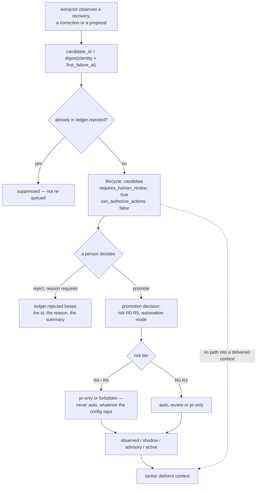

## 1. Executive Summary

OwnMem is git-native memory for coding agents — Apache-2.0, about 35,300 lines of
JavaScript, no database. Memories are markdown topics in the repository's working
tree, retrieved by a feature-weighted lexical ranker, and everything the system
knows travels with a clone.

Five marks, and two of them are the same idea applied twice: **a refusal is a
record, not an absence.**

`rejectMemoryCandidate` (`lib/memory-candidates.mjs:333`) throws unless the caller
supplies a reason, moves the candidate into `ledger.rejected`, and keeps its
summary. The docstring says why, and it is the argument this atlas makes about
tombstones in the project's own words:

> The reason is required and the summary is kept, because a rejection with no
> record of what was rejected is indistinguishable from a candidate that was never
> generated, and the next reader cannot tell whether the extractor is quiet or the
> queue is being silently drained.

The record binds because the key is a value. `candidateId` is
`digest("recovery <identity> <first_failure_at>")` (`:90-92`), so re-running the
extractor over the same observation produces the same id, and
`mergeMemoryCandidates` suppresses it rather than putting it back in front of a
reviewer. That is a value-keyed tombstone, and the atlas counts few.

**The second good idea is that the schema argues.** `schemas/promotion/decision.schema.json`
carries nine lifecycle states, six risk tiers and four automation modes, and then
three `allOf` rules that encode the invariants rather than leaving them to the
policy layer. Each states its reasoning in a `description`:

- R4 and R5 *"can never be encoded as automatic, whatever the evidence or the
  repository configuration says. Written here as well as in the policy so that a
  producer building a decision by hand is bound by it."*
- R5 is the control plane — *"policy, gates, permissions, this system's own
  code"* — and *"may not take effect from inside at all, so R5 is not merely
  non-automatic."* The system cannot promote a change to its own governance.
- An `auto` decision that also names a blocker is refused as *"self-contradictory,
  and it is the exact shape a bug in the resolver would produce."*

That last one is a schema constraint written against a specific failure of a
specific component, which is rarer than the constraint.

**What is withheld.** `scope_enforced` is refused: scope tokens exist on a topic
and reach `scopeOverlapFeature` in the ranker (`lib/memory-ranker.mjs:228-233`),
where they contribute to a relevance score. Nothing filters on them, so a scope
here changes what ranks first rather than what is visible.
`bitemporal` is refused for absence — a grep of `lib/` and `schemas/` for
`valid_from`, `valid_until`, `as_of` and their camel-case spellings returns
nothing.

## 2. Mental Model

A memory is a proposal that has to survive a lifecycle before anything reads it,
and the extractor is not allowed to skip ahead.



The dotted edge is the one the source comment insists on: `observed` is a
lifecycle a memory can be recalled at, and `candidate` is not.

## 3. Architecture

No service and no database. The store is the repository: markdown topics, a
candidate ledger, append-only promotion receipts and daily JSONL event files, all
committed. A clone carries the memory, and `git log` is the history of it.

**What it costs to run.** Node, and nothing else. There is no embedding step and
no vector index — retrieval is lexical, which is why the benchmark can be
deterministic and offline.

**Distribution is four front ends over the same files**: a CLI, a Claude Code
plugin, a Gemini extension manifest, and a skills/commands directory.

## 4. Essential Implementation Paths

- **Candidates and refusals** — `lib/memory-candidates.mjs`: `candidateId` (90),
  emission with `requires_human_review` (300-302), `mergeMemoryCandidates` (306-330),
  `rejectMemoryCandidate` (333-350).
- **Promotion contract** — `schemas/promotion/decision.schema.json`: the enums
  (12-32), the three invariant rules (55+); `schemas/promotion/receipt.schema.json`;
  `schemas/promotion/review-material.schema.json`.
- **Receipt ledger** — `lib/memory-promotion-receipt.mjs`: the stated shape (10, 22),
  digest-not-text (222-224), `promotionAnchorRootSha256` (209).
- **Event log** — `lib/memory-observability.mjs`: daily file pattern (59),
  `recordMemoryObservabilityEvent` (270), torn-line trim (218).
- **Ranking** — `lib/memory-ranker.mjs`: feature list (26), `scopeOverlapFeature` (228).
- **Duplicates** — `lib/memory-duplicates.mjs`: `createMemoryFingerprint` (39),
  `compareMemoryFingerprints` (80).
- **Benchmark** — `benchmarks/public-benchmark.mjs`: `negativeAccuracy` (266),
  worst-language gates (381-383); `benchmarks/corpus.json` (negatives at 167).

## 5. Memory Data Model

A topic is markdown with front matter. The interesting fields are the governance
ones: a `lifecycle` from the nine-value vocabulary, a `logical_type` of
`normative`, `procedural`, `factual`, `diagnostic`, `preference` or `feedback`,
scope tokens, and a risk tier that travels with any promotion decision about it.

The candidate ledger is a separate object with `candidates` and `rejected` maps,
both keyed on the same digest. A rejected entry keeps the reason and the summary —
enough for a later reader to see what was refused without the material being
retained in full.

`logical_type` is deliberately nullable, and the comment at
`lib/memory-candidates.mjs:237-239` explains the null case: a user correction is
*"a lead about memories that already exist being wrong, not a proposal to write a
new one of some type. What a reviewer does with it is retire, correct or narrow
the scope."*

## 6. Retrieval Mechanics

A lexical ranker over tokenized topics with a named feature list — code symbols,
code tests, authority documents, scopes and others — combined by weight. There is
no embedding arm and no graph arm.

Scope is a feature, not a filter. `scopeOverlapFeature` tokenizes a document's
`metadata.scopes` and measures overlap with the query, returning 0 when the topic
declares none. A memory scoped to one area is therefore ranked lower for an
unrelated query and never hidden from it, which is the right behaviour for a
single-repository tool and the wrong shape to inherit as a boundary.

## 7. Write Mechanics

Writes are file writes, synchronous, and there is no lag before a memory is
retrievable — the ranker reads the working tree. What stands between an
observation and a delivered context is the lifecycle, not a queue.

Extraction is idempotent by construction: the candidate id is a digest, so a
second pass over the same observation updates `last_seen_at` and leaves
`first_seen_at` alone, *"which is how a growing failure count reaches the reviewer
without spawning a second entry"*. The same key is what makes a refusal durable.

The promotion receipt ledger is append-only and stores anchors rather than
content: a file hash, a symbol fingerprint, a git object, and for feedback the
hash of the query. The module says the separation plainly — it is *"one
append-only ledger; applying a change is somebody else's decision"* — so the
record of what was decided is not also the mechanism that enacts it.

## 8. Agent Integration

A CLI plus plugin manifests for Claude Code and Gemini, and a `skills/` directory.
The agent-facing contract is the lifecycle: an agent can read `active` and
`advisory` memories, can cause candidates to be generated, and cannot promote one.
`can_authorize_actions: false` is stamped on every candidate at emission.

## 9. Reliability, Safety, and Trust

The README grounds the design in five external papers — Reflexion, AgentPoison,
CaMeL on prompt injection, selective classification for abstention, and
metamorphic testing — which is unusual and worth noting because the influence is
visible in the code rather than decorative: abstention is a measured benchmark
metric, and the control-plane rule is CaMeL's separation applied to the system's
own governance.

`CITATION.cff` is a software citation, not a paper. There is no paper of the
project's own.

The torn-write detail in the event log is the kind of care that suggests the
ledger is meant to be trusted: an interrupted trailing partial line is removed
before appending *"so it cannot corrupt the next event"*.

What is missing is a boundary. Everything here is one repository's memory, and the
design leans on that — no scope filter, no principal, no tenancy. That is coherent
rather than careless, and it is the thing that stops the design generalising.

## 10. Tests, Evals, and Benchmarks

Four self-tests under `test/` — structure, public surface, evolution and a
multilingual tokenizer — plus `benchmarks/public-benchmark.mjs` over a committed
corpus with a multilingual supplement.

**The negative arm is the part worth copying.** `benchmarks/corpus.json` commits
sixteen `negative_queries` — nonsense across locales, *"quantum foam renderer
calibrates lunar antenna"* and its Chinese and Polish variants — and
`negativeAccuracy` counts a case as passing **only when the ranking is empty**,
recording every non-empty result as a `false_positive` carrying the query and what
was wrongly returned. A metric that named only a rate would hide which query
broke; this one hands back the counterexample.

It is not vacuous, and the reason is structural rather than lucky: the same run
computes `recall_at_1` over the same corpus, so a configuration that returned
nothing for everything would fail the positive metrics in the same report.
`worst_language_negative_abstain_rate` gates the worst locale rather than the
mean, which is the right aggregation for a multilingual claim.

The shape is abstention on unrelated queries rather than a named value that must
not come back — this report awards `negative_eval` on it and says which kind it is.

Nothing was run. The screen reports one auto-run surface and two dependency files
changed within the seven-day cooldown.

## 11. For Your Own Build

### Steal

**Keep the refusal, with the reason.** Not the decision — the *record*. A
rejection that deletes the candidate leaves a queue that looks identical whether
the extractor is quiet or a reviewer is draining it silently, and nobody can tell
from the outside which they are looking at.

**Key the refusal on a digest of the observation.** Then re-extraction is
suppressed automatically and idempotence and durability are the same mechanism.

**Put the invariant in the schema as well as the policy**, and say in the
description that you did it twice on purpose. *"Written here as well as in the
policy so that a producer building a decision by hand is bound by it"* is the
sentence that makes a duplicated rule a design rather than an oversight.

**Make your own control plane the highest risk tier.** R5 covers policy, gates,
permissions and the system's own code, and cannot take effect from inside at all.
A memory system that can promote a change to its own promotion rules has no rules.

**Return the counterexample, not just the rate.** `false_positives` carries the
query and the wrong answer, so a regression names itself.

**Score abstention beside recall on one corpus.** The positive metric is what
stops the negative one passing vacuously, and running both in the same pass makes
that structural instead of a convention.

### Avoid

**Reading a scope as a boundary when it is a ranking feature.** `scopes` here
raises a score and hides nothing. That is fine for one repository and would be a
leak the first time two principals shared a store.

**Putting a timestamp inside the key you want to suppress on.** `first_failure_at`
is in the digest, so the same identity failing again next week is a new candidate
and the earlier refusal does not reach it. Defensible — it is new evidence — but
it means the tombstone binds an observation rather than a claim.

### Fit

This suits a team that wants project memory reviewed like code, in the repository,
with no service to run and a git history of every decision. The governance is the
product: nine lifecycle states and six risk tiers are a lot of ceremony for a
single developer, and exactly right where a wrong memory would be expensive and a
reviewer already exists.

It is the wrong fit where memory must be scoped between principals, where
retrieval needs semantic reach beyond lexical matching, or where nobody will
review — the lifecycle guarantees that unreviewed candidates never reach a
context, so an unattended deployment gets a queue instead of a memory.

## 12. Open Questions

- **Should the rejection digest drop the timestamp?** Keying on identity alone
  would make a refusal bind a claim rather than one observation of it.
- **What empties the candidate queue in a repository nobody reviews?** Nothing
  promotes on its own below R4 unless configured to, and `candidate` has no path
  into a delivered context.
- **Does the receipt ledger get verified?** The anchors are recomputable by
  design; whether anything recomputes them is not visible in the tree.
- **Would a semantic arm break the abstention metric?** The sixteen negatives pass
  today against a lexical ranker, and an embedding arm returns something for
  everything.

## Appendix: File Index

**Candidates, refusals and promotion**

- `lib/memory-candidates.mjs` — `candidateId` (90), emission (300-302),
  `mergeMemoryCandidates` (306-330), `rejectMemoryCandidate` (333-350)
- `schemas/promotion/decision.schema.json` — enums (12-32), invariant rules (55+)
- `schemas/promotion/receipt.schema.json`, `schemas/promotion/review-material.schema.json`
- `lib/memory-promotion-receipt.mjs` — ledger shape (10, 22), digest-not-text (222-224)
- `lib/memory-review-material.mjs`

**Store and retrieval**

- `schemas/memory.schema.json`; `lib/memory-ranker.mjs` — features (26),
  `scopeOverlapFeature` (228)
- `lib/memory-duplicates.mjs` — `createMemoryFingerprint` (39)
- `lib/memory-observability.mjs` — daily files (59), torn-line trim (218), record (270)

**Evaluation**

- `benchmarks/public-benchmark.mjs` — `negativeAccuracy` (266-276), worst-language
  gates (381-383)
- `benchmarks/corpus.json` — `negative_queries` (167); `benchmarks/supplement.json`
- `test/` — four self-tests

### Commands behind the absence claims

```sh
grep -rn "valid_from\|valid_until\|validFrom\|as_of\|asOf" lib/ schemas/
grep -rn "scopes" lib/memory-ranker.mjs
grep -rn -i "arxiv\|doi" README.md
```

## History

**2026-09-13** — [`14f4edec52ebc5d1dcf7794f451d3e6d2c64e969`](https://github.com/grpcer/ownmem/commit/14f4edec52ebc5d1dcf7794f451d3e6d2c64e969) — first reading. Screened first: one auto-run surface and two dependency files changed within the seven-day cooldown, so nothing was installed and neither the self-tests nor the benchmark was run; every claim about them is a claim about their committed source. Five marks. `tombstone` is earned on a refusal keyed on a digest of the observation, with the reason required and the summary kept — one of the few in this corpus where the project's own docstring makes the argument. `scope_enforced` is withheld: scope tokens reach a ranking feature and no filter. `bitemporal` is withheld for absence, with the grep recorded in the appendix. `CITATION.cff` is a software citation; the project has no paper of its own, and the five papers the README cites are external influences.
