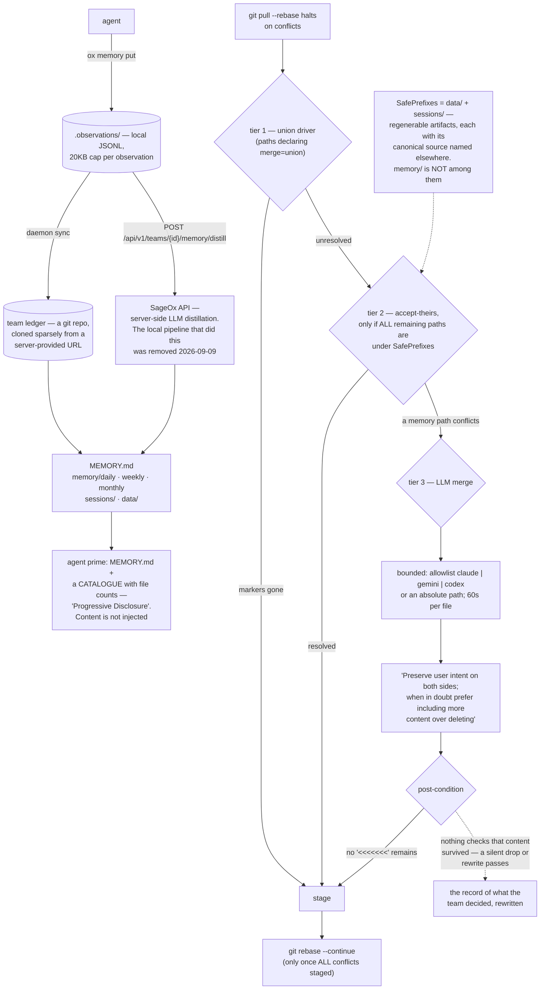

## 1. Executive Summary

SageOx CLI is "[t]he hivemind for human-agent teams" — MIT, Go, 651,919 lines
across 1,337 test files, shipping an `ox` binary and a Claude plugin.

Its team memory is a git repository. The cloud provisions it, the CLI clones it
sparsely, and it holds `MEMORY.md` plus `memory/daily/`, `memory/weekly/` and
`memory/monthly/` alongside `sessions/` and `data/`. Agents write observations
with `ox memory put`; a daemon syncs them; the server distils them into the
summaries that later get read.

Two design choices are worth the visit and one is worth knowing before you
trust it.

The first is how memory reaches an agent. Priming does not inject it. It hands
over `MEMORY.md` and then a catalogue — "Recent: memory/daily/ (12 files — what
happened recently)", "Patterns: memory/weekly/", "Trends: memory/monthly/" —
under a heading called Progressive Disclosure, and leaves the agent to open what
it wants with ordinary file tools. In a corpus where nearly every system either
retrieves-and-injects or injects whole, advertising the shelf and letting the
reader choose is a genuinely different answer, and it costs nothing at prompt
time.

The second is the comment on `DefaultResolveRules`, which is the best piece of
writing in this repository and possibly the best documented engineering
judgement in this atlas. It explains why `sessions/` auto-resolves on conflict:
`meta.json` is written by both the cloud summarizer and the local CLI, so with
no rule "the rebase halts, nothing can resolve it, the abort restores the
pre-rebase state, and the next attempt fails identically — a deterministic wedge
that never escalates and never self-heals." Then the evidence: "One ledger sat
341 ahead / 1055 behind for 13 days with 281 such conflicts." Then the
justification, artifact by artifact, each with its canonical source named
elsewhere, and the trade stated outright: "An imperfect summary beats a ledger
that can never sync again." Then a SAFETY paragraph about pointer-wins ordering
that ends "Do not weaken that guard", and a NOTE explaining why the rule is
scoped to the ledger rather than added to the shared defaults.

Crucially, the paths that auto-resolve are `data/` and `sessions/` — the
regenerable ones. The memory directories are not on that list. That is the right
call, and it is what makes the third thing matter.

A conflict that is *not* under a safe prefix falls to tier three:
`internal/ledger/automerge` runs an LLM — `claude`, `gemini` or `codex`, or an
explicit absolute path, restricted by an allowlist with the argv[0] substitution
attack spelled out in the comment — on the conflicted file, with a 60-second
per-file deadline, and asks it to merge.

The system prompt is careful: "Preserve user intent on both sides; when in doubt
prefer including more content over deleting. Remove all conflict markers from
your output."

The verification is that the conflict markers are gone.

That is the whole post-condition. A model that resolves the conflict by keeping
one side and discarding the other, or by paraphrasing both into something
neither person wrote, produces a file with no conflict markers and is staged and
committed. For source code that is a familiar risk with a familiar remedy —
someone reviews the diff. For a team's shared memory, the thing being silently
rewritten is the record of what the team decided.

## 2. Mental Model

An **observation** is what an agent records in the moment: `{"content": "..."}`,
capped at 20KB.

A **fact** is what extraction produces: a headline, an optional summary and
rationale, a `who`, a source type and reference, a timestamp, and a category
from a closed list.

The **ledger** is a git repository shared by the team's humans and agents.

A **sync** is `git pull --rebase`, and when it halts, the three tiers decide
what the team remembers.

## 3. Architecture

| Area | Role |
| --- | --- |
| `internal/ledger/` | The git-backed team ledger: clone, sparse checkout, sync, push |
| `internal/ledger/automerge/` | The three conflict tiers and the LLM binary allowlist |
| `internal/facts/` | The unified `Fact` schema and its JSONL reader and writer |
| `cmd/ox/memory_put.go` | Local observation capture |
| `cmd/ox/memory_distill.go` | The call to the server's distillation endpoint |
| `cmd/ox/agent_prime.go` | What an agent is told about memory at session start |
| `internal/manifest/` | Sparse-checkout paths and the resolve rules |
| `docs/specs/team-memory-journal.md` | The superseded local pipeline, kept as history |

## 4. Essential Implementation Paths

`internal/ledger/ledger.go:36-71`. Read the comment, not just the rule. It is
forty lines of engineering judgement with its evidence attached, and it is the
reason to read this project.

Then `internal/ledger/automerge/automerge.go:1-20` for the tiers, and `llm.go:22`
for the prompt that decides a merge.

Then `cmd/ox/agent_prime.go:2313-2328` for progressive disclosure.

## 5. Memory Data Model

The `Fact` is well shaped for citation: `SourceRef` is "the stable canonical
identifier", `SourceURL` is "the human-clickable URL for drill-down",
`SourceTitle` is "a short human label for citations", and the comment notes that
older files lacking the last two are still valid because "the citation pipeline
degrades gracefully (link omitted, label derived from other fields)". `Who`
carries the author. A file header records a schema version, the source type, a
recorded-at, an optional source hash and the query window that produced it.

What the model does not carry is any epistemic state. `Category` is
`decision | learning | open_question | action_item | context | ship | blocker |
direction_change` — a taxonomy of what kind of thing was said, decided at write
time. Nothing marks a fact as disputed, superseded, corrected or withdrawn, and
`WriteFacts` opens the file with `os.Create`, which truncates: a rewrite
replaces the file rather than appending to it. The history is git's, which is
real but is the repository's history rather than the memory's own record — and
after an LLM merge, the git history shows a resolution commit, not what each
side originally said.

That is why this report carries no marks. Every mechanism the atlas asks about
is either absent or delegated: no stored status filtering a read, no validity
interval, no value-keyed rejection, no scope predicate — the team boundary is a
separate repository — no append-only mutation record of its own, no human review
step over memory, and no committed must-not-retrieve assertion.

## 6. Retrieval Mechanics

There is none to speak of, deliberately. `MEMORY.md` is the always-present
document; everything else is a file tree the agent may open. For a team whose
agents already have file tools, that is a defensible answer and it makes the
memory auditable by `git log` and readable by a human without the CLI.

The cost is that nothing ranks. An agent that does not go looking does not find
the weekly summary, and the priming text is the only thing nudging it.

## 7. Write Mechanics

`ox memory put` accepts a JSON object or JSONL batch on the command line, from a
file, or on stdin, caps each observation at 20,480 bytes ("~5000 tokens"), and
writes into `.observations` for the daemon to sync. Priming instructs the agent
to use it as a standing behaviour: "Proactively record observations throughout
this session … Record decisions, discoveries, questions, and notable events as
they happen — don't wait to be asked."

Distillation is the other half and it is not here. `ox memory distill` posts the
pending observations and a date range to
`/api/v1/teams/{teamID}/memory/distill` and receives a summary — the comment
calls it "server-side LLM distillation". The command also refuses to run for a
human, printing an explanation instead, because "[m]emory distillation is an
automated process run by AI coworkers."

So the policy that decides what a team remembers — what gets summarised, what is
dropped, how contradictions between two agents' observations are settled — runs
on a server whose code is not in this repository. The local pipeline that once
did it was removed: `docs/specs/team-memory-journal.md` is headed "**Superseded
— 2026-09-09:** `ox distill` and its entire `history` command tree have been
removed", and the surviving references to `memory/daily/` in Go are a file count
for priming and a sparse-checkout path.

## 8. Agent Integration

A Claude plugin plus the CLI, with agent priming, session upload and a daemon.
The daemon is where the LLM resolver runs (`internal/daemon/llm_resolver.go`),
which means the merge decision happens in the background rather than in front of
whoever caused the conflict.

## 9. Reliability, Safety, and Trust

The LLM binary allowlist is the trust mechanism done well. `claude`, `gemini`
and `codex` as bare names, or an explicit absolute path — "relative paths with a
slash are refused outright" — with the reasoning recorded: an attacker who can
write a binary earlier on `PATH` could otherwise "redirect to /tmp/evil", while
an absolute path is trusted because "the operator already chose where to point
this binary." A test file exists solely for the allowlist.

Each tier is conservative in the right direction: "a tier that can't safely
resolve every remaining conflicted path returns control to the next tier", and
the resolver "only calls `git rebase --continue` once all conflicts have been
staged." The accept-theirs tier fires only when *every* remaining conflict is
under a safe prefix, so one memory file in the set sends the whole batch to the
next tier rather than resolving the rest quietly.

The gap is the post-condition on tier three, and it is worth stating precisely
because the rest of the design is careful enough that it stands out. The check
is `strings.Contains(data, "<<<<<<<")`. That confirms the file is syntactically
clean. It cannot confirm that both sides' content survived, and the instruction
that it should is a sentence in a system prompt. A cheap improvement exists: the
tier already has both sides of the conflict, so a post-merge check that every
non-marker line from either side appears in the output — or a count of lines
dropped, logged and thresholded — would turn the prompt's intent into something
enforced.

## 10. Tests, Evals, and Benchmarks

1,337 test files, including dedicated coverage for the allowlist, sparse
clone, the murmur paths, github sync and the automerge tiers. The memory
commands have put, write, integration and observation-roundtrip tests.

The README is candid about what is not running: a comment in the badge block
reads "CI badge intentionally omitted: ci.yml is currently disabled
(ci.yml.disabled). Only docs.yml and smoke-test.yml are active, and neither is a
build signal." Saying so in the file where a badge would otherwise imply
otherwise is the honest choice.

No test asserts anything about what the LLM merge tier preserves.

## 11. For Your Own Build

Copy the comment on `DefaultResolveRules` as a form. Name the failure, quantify
it, justify the scope one item at a time, state the trade in a sentence, mark
the safety constraint, and explain what you deliberately did *not* do. A rule
documented that way survives the next refactor because its reasoning is
checkable.

Confine automatic conflict resolution to artifacts you can regenerate, and name
the canonical source of each one where the rule lives. `data/` and `sessions/`
qualify; a record of what someone decided does not.

If an LLM resolves merges in a shared memory, give the tier a post-condition
about content, not only about syntax. You have both sides in hand at that point;
checking that neither vanished is cheap, and the absence of conflict markers is
not evidence that a merge preserved anything.

Consider progressive disclosure for team-scale memory. Advertising
`memory/weekly/ (7 files — weekly themes)` costs a line of prompt and lets the
agent decide; injecting the same content costs the context window every turn
whether it is relevant or not.

## 12. Open Questions

What the server's distillation does with contradictory observations from two
agents. The request carries only observations and a date range; the policy is
not in this repository.

Whether the LLM merge tier ever fires on memory paths in practice, or whether
those conflicts abort. The tier ordering allows it; nothing in the tree records
how often it happens.

Whether a fact can be retracted. Nothing in the schema or the CLI surface
suggests a mechanism, and `WriteFacts` rewriting the file whole means a removal
leaves no trace in the format itself.

## Appendix: File Index

| Path | What to read it for |
| --- | --- |
| `internal/ledger/ledger.go:36-71` | Forty lines of documented judgement, with the evidence |
| `internal/ledger/automerge/automerge.go` | The three tiers, and where each one stops |
| `internal/ledger/automerge/llm.go` | The allowlist, its threat model, and the merge prompt |
| `internal/facts/types.go` | A citation-shaped fact with no epistemic state |
| `cmd/ox/memory_put.go` | The observation cap and the local-then-sync path |
| `cmd/ox/agent_prime.go` | Progressive disclosure instead of injection |
| `docs/specs/team-memory-journal.md` | The local pipeline that was removed, kept as history |

## History

**2026-09-16** — [`02f4f406a4b973fa4adda9df62725904cc1859d9`](https://github.com/sageox/ox/commit/02f4f406a4b973fa4adda9df62725904cc1859d9) — first reading, at a commit dated 15 September 2026. Screened before opening, from a shallow clone: twenty files scanned, three auto-run surfaces, one build-time execution point, one unpinned surface, five dependency files inside the seven-day cooldown, and the `CLAUDE.md` and `AGENTS.md` read as data. Nothing was installed, built or run.
