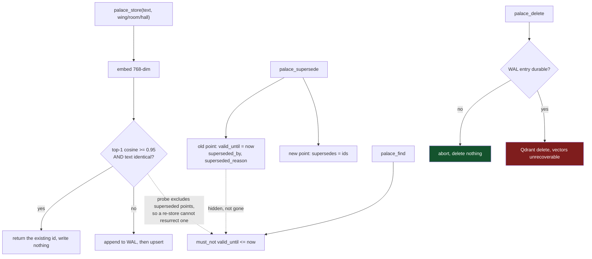

## 1. Executive Summary

Palazzo is an MIT-licensed MCP server in about 5,500 lines of Rust: a Qdrant
collection, a local ONNX or remote Ollama embedder, eleven tools, no UI, no
background work. It is unusually honest about being a small thing — the README
names `qdrant/mcp-server-qdrant` and [MemPalace](../mempalace/) as its prior art,
links both, and calls itself *"the minimum-viable single-user flavour of the same
idea"*.

The mechanism worth taking is one method in `src/wal.rs`. Every mutation is
appended to a JSONL write-ahead log, and the destructive paths call a different
one:

```rust
/// Like `log`, but errors when the entry cannot be durably appended —
/// including when no WAL path is configured at all. Destructive operations
/// (palace_delete, palace_delete_by_filter) call this and abort before
/// touching Qdrant: the WAL is their only audit trail, so a delete that
/// can't be logged must not happen.
pub fn log_strict<T: Serialize>(&self, operation: &str, params: &T) -> anyhow::Result<()>
```

In every other system here that carries `audit_log`, the log is a consequence of
the mutation. Here it is a **precondition**
(`src/wal.rs:59`): an unwritable audit means the delete does not happen. The
entry carries a text preview of each point, so the log records what was removed
rather than only that something was — which matters because Qdrant deletion is
irreversible and the vectors are gone either way.

The second thing worth reading is a note the project committed against its own
interest. `inbox/longmemeval-bench-2026-04-27.md` reports a LongMemEval pilot at
**R@5 of 36.0%**, against the 96.6% that MemPalace claims and that palazzo's own
README cites as the bar. It carries Wilson confidence intervals, a stopping rule
— *"the prefix arm was stopped at 16q once the early signal made clear it was not
winning"* — a diagnosis (R@30 is 92%, so *"the bottleneck is ranking
discrimination, not coverage"*), and a decision not to chase it, because both
routes to closing the gap either invalidate every stored vector or require the
LLM dependency the project exists to avoid. Systems in this atlas that benchmark
themselves almost always publish a win. This one published a loss, with error
bars, and changed no code as a result.

**And the README's central claim about the schema is false.** It says palazzo
*"starts from that interface and replaces the untyped metadata with an
enum-validated palace schema"* — the whole stated reason to choose it over the
generic Qdrant server. `src/schema.rs` opens by saying the opposite:

```rust
// category / wing / room / hall are deliberately free-text — the palace
// taxonomy is whatever the user makes of it. Conventional values are suggested
// in the `palace_store` tool-arg descriptions but never enforced.
```

`validate_tag` (`src/mcp.rs:1506`) trims, rejects empty, and caps the length.
There is no enum in the crate; the four tags are `String`. The code is right and
the README is wrong, which is the better direction for a reader to discover it —
but that sentence is the differentiator, and it is on the landing page.

## 2. Mental Model

A memory is **a verbatim sentence filed at an address**. The address is four
free-text tags — `category`, `wing`, `room`, `hall` — and the sentence is stored
exactly as the agent wrote it. Nothing extracts, summarises or rewrites.

Correction is supersession, and the schema carries both halves of a temporal
record:

| Column | Meaning |
| --- | --- |
| `timestamp` | when the server recorded it |
| `valid_from` | *"when this memory started being authoritative"* |
| `valid_until` | *"when this memory stopped being authoritative"* |
| `supersedes` | ids the new point replaces |
| `superseded_by` | id of the successor, on the old point |
| `superseded_reason` | a human sentence explaining the correction |

`palace_supersede` writes a new point and stamps the old ones. The read path then
hides them: `palace_find` sends Qdrant a `must_not` range on
`valid_until <= now` (`src/qdrant.rs:77`), and `include_superseded: true` lifts
it for archaeology. The old text stays addressable through `palace_recall`, so a
correction hides a memory without destroying it.



The dotted edge on the left is a decision worth naming on its own. The duplicate
probe filters out superseded points before comparing, and says why
(`src/mcp.rs:450`):

```rust
/// Filter for duplicate checks: only current-truth memories count. A superseded
/// point must NOT swallow a re-store of the same text — it is hidden from
/// default `palace_find`, so short-circuiting on it would make the "stored"
/// memory invisible.
```

That is the exact collision [Empryo](../empryo/) resolves the other way. Empryo's
`content_hash` is unique and its upsert treats a collision as an update that
clears `hidden`, so re-saving a deleted sentence resurrects it, with a test named
for the behaviour. Palazzo, facing the same question, decided a hidden point must
not absorb a new write, and has a test for that too
(`dedup_filter_excludes_superseded`, `src/mcp.rs:1680`). Two coding-agent
memories, four lines each, opposite answers.

## 3. Architecture

Three moving parts and one file.

**The binary.** One Rust crate, 5,492 lines across eleven source files, speaking
MCP over stdio or streamable HTTP. `src/mcp.rs` is 2,212 of those lines and holds
every tool; `src/qdrant.rs` is the client and filter builder.

**Qdrant.** One collection of 768-dimension points, with payload indexes created
at startup including one on `valid_until` as a `datetime`
(`src/qdrant.rs:470`), so the supersession filter is an index range rather than a
scan.

**An embedder.** Either `fastembed-rs` running `nomic-embed-text-v1.5` as local
ONNX — self-contained, no network — or a remote Ollama serving the same model.
Both produce the same vector space, so the backends are interchangeable over an
existing collection, a property the INT8 quantisation work was careful to
preserve.

**The WAL.** `$PALAZZO_WAL`, or `~/.palazzo/wal.jsonl`. Opened with
`OpenOptions::new().create(true).append(true)` (`src/wal.rs:80`), one JSON object
per line carrying a timestamp, an operation name and the parameters.

There is no scheduler, no consolidation pass, no reflection. Every tool call does
its work and returns.

**Security is stated bluntly and the statement is accurate.** The README's first
element is a warning block: no authentication, no TLS, bind to localhost, and
*"`PALAZZO_ALLOWED_HOSTS` is a DNS-rebinding guard, not auth — don't mistake it
for one."* The optional auth module says the same about itself:

```rust
//! **This is attribution, not authentication.** The email is unverified (no OTP
//! in v1) — it records who wrote what and soft-gates by domain. It is NOT a
//! defence against a malicious insider.
```

Most projects here that ship an auth module describe it as security. This one
ships 438 lines of JWT minting and middleware and refuses to call it that. The
`author` field carries the same disclaimer in the schema — *"Unverified — it's
provenance, not proof."*

## 4. Essential Implementation Paths

| Path | Location |
| --- | --- |
| Audit as a precondition for deletion | `src/wal.rs:59` (`log_strict`) |
| Append-only file handle | `src/wal.rs:80` |
| Duplicate probe excludes superseded points | `src/mcp.rs:450` (`dedup_filter`) |
| Store short-circuit: cosine **and** exact text | `src/mcp.rs:480` |
| Supersede stamps the old points | `src/mcp.rs:930` |
| Supersession hidden on the read path | `src/qdrant.rs:77` |
| Taxonomy validation, such as it is | `src/mcp.rs:1506` (`validate_tag`) |
| Count-echo guard on mass delete | `src/mcp.rs:1181` |
| Recency re-rank | `src/mcp.rs:835` |
| The probe's looser duplicate rule | `src/mcp.rs:1268` |
| Attribution, explicitly not authentication | `src/auth.rs:1` |

## 5. Memory Data Model

`Payload` is the stored record: four tag strings, the text, a `timestamp`, and
optional `session`, `source_file` and `author`, plus the five temporal fields.
`Memory` is the same shape returned to callers, with an `id` and an optional
`score`.

Three things follow.

**There is no unit below the sentence.** No entities, no claims, no graph. A
memory is whatever text the agent chose to file, which is why the benchmark note
correctly identifies decomposition as the thing MemPalace has and palazzo does
not.

**There is no status field.** Nothing marks a memory as unverified, disputed or
low-confidence. `valid_until` is a lifecycle boundary, not an epistemic one — it
says *this was replaced*, never *this may be wrong* — so `trust_state` is
withheld. The closest thing to a judgement anywhere in the record is
`superseded_reason`, a free-text sentence on the old point, written by the same
agent that wrote the replacement.

**The bi-temporal columns exist and nothing fills them.** `valid_from` is
documented as *"only differs when callers want explicit temporal semantics"*, and
no tool accepts it: `palace_store` writes `None` (`src/mcp.rs:510`),
`palace_store_batch` writes `None` (`:658`), and `palace_supersede` writes
`Some(now)` (`:900`). `valid_until` is likewise stamped `now` on the old point
(`:930`). Validity time is therefore always the clock reading at the moment of
the write, which `timestamp` already records. The schema is bi-temporal and the
writers are not, so the mark is withheld — and the gap is one optional tool
argument wide, because the read filter already compares against an arbitrary
instant rather than assuming the present.

## 6. Retrieval Mechanics

Cosine search over the whole collection, narrowed by whichever of six optional
filters the caller passes: `wing`, `category`, `room`, `hall`, `author`, and a
`since`/`until` range on `timestamp`. All compose into a Qdrant `must` clause,
and the supersession exclusion rides along as `must_not`.

`recency_half_life_days` is the one ranking idea. When set, palazzo over-fetches
to four times the requested limit (capped at 80), multiplies each hit by
`exp(-age_days / half_life)`, re-sorts and truncates (`src/mcp.rs:835`). The
README gives calibrated values — 30 aggressive, 90 moderate, 365 gentle — and the
arithmetic matches: at one half-life the score halves. Being opt-in and off by
default is the right call for a knob nobody has tuned against a labelled set.

**`scope_enforced` is withheld, and the reason is worth stating precisely.**
`author` is a stored user key and it does reach the Qdrant filter, which is more
than several systems the atlas has criticised manage. But it is optional, never
applied by default, unverified by construction, and described in its own tool
text as a way to *"pull everything one user stored"* — a facet for browsing
rather than a boundary. A default `palace_find` returns the whole palace. The
wing/room/hall keys are a filing taxonomy, not tenancy. One collection, one
palace, no notion of *mine*.

## 7. Write Mechanics

Writes are synchronous and block the tool call: embed, probe for a duplicate,
append to the WAL, upsert to Qdrant, return. A memory is retrievable the moment
`palace_store` returns; there is no queue and no indexing lag.

The duplicate probe is the interesting part, and it is stricter than the
documentation says. `do_store` short-circuits only when the top hit is **both**
above 0.95 cosine **and** textually identical (`src/mcp.rs:480`). The vector
comparison is a cheap index lookup; the equality is the actual decision. A
paraphrase is never deduped, whatever its cosine.

`palace_check_duplicate` does not apply the second half (`src/mcp.rs:1268`):

```rust
let is_duplicate = top.as_ref().and_then(|m| m.score)
    .map(|s| s >= DUPLICATE_THRESHOLD).unwrap_or(false);
```

Its tool description tells the agent to *"call this before palace_store to avoid
duplicates"*, and `palace_store_batch`'s description claims dedup uses *"the same
0.95-cosine + exact-text-match rule"*. The probe and the writer therefore
disagree: text at cosine 0.97 with different wording is reported
`is_duplicate: true` and would then store as a new point. The failure direction
is false alarms rather than silent loss, so it costs an agent a write it was told
not to make rather than losing one it made — but an agent that trusts the probe
skips writes palazzo would have accepted.

`palace_store_batch` embeds up to 256 items in one inference pass and upserts in
one HTTP call, with per-item dedup against the live collection and per-item error
reporting, so one bad item does not fail the batch.

Nothing rewrites the store. There is no consolidation, no decay and no
re-embedding pass; the collection only grows until someone deletes from it.

## 8. Agent Integration

Eleven MCP tools over stdio or streamable HTTP, and the tool descriptions are
where a surprising amount of the design lives. They are long, they name the
alternative tool for the adjacent job — *"for fact corrections always prefer
palace_supersede"* — and they carry the operating procedure for the destructive
ones.

That is also where the safety model has its seam. `palace_delete`'s description
reads *"You MUST get the human operator's explicit approval before EVERY
palace_delete call"*, and the enforcement is `if !args.confirm` — a boolean the
same model sets. The mass-delete flow adds a real code-level check: a non-dry-run
call must carry `expected_count`, and the tool refuses when it does not equal the
current match count (`src/mcp.rs:1181`). That is a genuine guard against a filter
that changed between the two calls. It is not a guard against a missing human,
because an agent can run the dry run, read the count, and pass it back with
nobody else in the loop.

So `human_review` is withheld. The approval the README describes is real and it
lives in the MCP client's tool-permission prompt — outside this repository, in
the user's settings, which the README tells you to configure. A reader should
take that recommendation seriously and should not read the `confirm` flag as the
thing that enforces it.

`palace_gain` is the odd tool out and the most product-shaped: it aggregates a
per-tool log and reports how many tokens of agent context the server saved
against a hand-coded SSH-and-curl equivalent. It measures the integration rather
than the memory, and it is the only self-measurement in the tree besides the
benchmark note.

## 9. Reliability, Safety, and Trust

**The WAL discipline is the best thing here.** Non-destructive mutations use
best-effort `log`, which warns on failure and is a silent no-op when no path is
configured; destructive ones use `log_strict`, which fails the operation. That
split is correct: a lost store line is an inconvenience, a lost delete line is
the erasure of the only record that the erasure happened.

Two limits on it. The default path is `$HOME/.palazzo/wal.jsonl`, so a process
with no `HOME` has no WAL at all — every store then goes silently unlogged while
deletes fail loudly, which is the right failure on the destructive side and an
invisible one on the write side. And the file is append-only by *file handle*,
not by storage: nothing signs it, chains it, or would notice an edit. It is an
audit trail against accident and a weak one against an adversary with disk
access, which is consistent with a design that already says it is not defending
against a malicious insider.

**Correction is well shaped and stops one step short.** Supersession hides the
old point, keeps it addressable, records a reason, and the dedup probe refuses to
match it. What is missing is any record keyed on the *value*: nothing stops the
agent filing the same corrected-away claim again in different words tomorrow,
and because dedup requires exact text equality, a paraphrase always writes. There
is no `tombstone` here — see
[the pattern](../../patterns/rejected-value-tombstone/) for what that would take.

**Deletion is honest about being irreversible.** The tool text says vectors are
not recoverable from the WAL, and that is true: the log carries a text preview,
not the embedding. Caps are 100 ids per call and 1,000 matches per filter.

**Prompt injection reaches memory directly.** Any text an agent reads can become
a `palace_store` call, there is no extraction step to filter it, and there is no
trust state to mark it with. On a single-user localhost deployment that is
proportionate; the README's warning about exposing the port is the load-bearing
mitigation, and it is on the landing page rather than in a footnote.

## 10. Tests, Evals, and Benchmarks

63 inline Rust tests across seven modules, and a CI workflow that runs
`cargo fmt --check`, `cargo clippy -D warnings` over two feature sets, a release
build of each, `cargo test`, and `cargo audit --deny warnings`. For a solo
project this is a serious pipeline, and clippy at deny-warnings across both the
fastembed and ollama configurations is more than most.

The memory tests run against a mock Qdrant (`src/testmock.rs`), which shapes what
they can assert. `exclude_superseded_becomes_must_not_valid_until` checks that
the built filter contains a `must_not` on `valid_until`; the `palace_find` tests
check that the outgoing search request carries it. Those assert *the query is
correct*, not *the superseded point is absent from the results* — the mock
returns whatever the test hands it. No committed case asserts that particular
material must not come back, so `negative_eval` is withheld. The distinction
matters more than usual here, because hiding superseded memories is the
correction mechanism, and what is under test is the filter rather than the
outcome.

`delete_happy_path_wal_logs_then_deletes` is the test that matters most, and it
exists: it pins the ordering that makes the audit a precondition.

**The benchmark note is the strongest and the weakest artifact in the
repository.** It reports R@1 18.0%, R@5 36.0% and R@30 92.0% over 50 questions,
with a Wilson interval of [23.5%, 50.6%] at R@5 and the note itself saying the
±14-point band is *"too coarse for any decision smaller than 'is this an
order-of-magnitude gap'"*. It diagnoses the shortfall as ranking rather than
coverage, rules out the task-prefix hypothesis with a clean control — confirming
first that the library does not auto-prefix, so the arms really differed — and
attributes MemPalace's advantage to a decomposition pipeline palazzo has
deliberately not built.

What it does not do is let anyone re-run it. The harness lived at
`/tmp/lme-direct.py` and is not committed — *"the script is small enough to
recreate in 30 minutes if needed"* — and the result files sit on a machine the
note itself calls ephemeral. The 50 questions are all one question type, because
the dataset is ordered by type. So the honest reading is: a self-reported,
non-reproducible pilot that reports a loss and is careful about how much it
proves. The atlas's standing complaint is that memory systems publish wins
measured against nothing; this is the opposite failure mode, and a much better
one.

Two numbers should not be repeated as facts. MemPalace's 96.6% R@5 is
**MemPalace's claim as relayed here**, unverified by this atlas and not measured
by this note. And the 36.0% comes from a direct-cosine harness that bypasses
palazzo's server entirely, so it measures the embedding model at session
granularity rather than the product.

## 11. For Your Own Build

### Steal

**Make the audit entry a precondition for the destructive operation.** One extra
method and a different call site. `log_strict` turns "we log deletes" into "a
delete that cannot be logged does not happen", and the difference only shows up
on the day the disk is full — which is exactly the day you need the record. Keep
the split: best-effort for writes, strict for destruction.

**Put the payload preview in the audit entry, not just the id.** This atlas has
audit logs that record `{scope, key}` and can therefore tell you a change
occurred without telling you what it was. Palazzo writes a preview of every
deleted point before deleting it, which makes the log a partial recovery
mechanism rather than only a receipt.

**Exclude retired records from the duplicate probe, and write down why.** Four
lines of filter and a comment. It is the difference between a correction that
holds and one the next identical write undoes, and the comment is what stops
someone simplifying it away later.

**Publish the benchmark that goes against you.** The LongMemEval note costs the
project its most flattering framing and buys a reader something no marketing
number can: a diagnosis, a ruled-out hypothesis with a control, and a stated
reason for not chasing the gap. If you write one, commit the harness — that is
the only part this note gets wrong.

**Say what your auth is not.** *"This is attribution, not authentication… NOT a
defence against a malicious insider"*, in the module docstring, above 438 lines
of JWT code. A reader who skims still gets it right.

### Avoid

**Do not let the README claim a property the code disclaims.** "Enum-validated
palace schema" is the stated reason to choose this over the generic Qdrant
server, and `schema.rs` says the tags are free-text and never enforced. Whichever
is the intent, the other is a bug, and a differentiator that exists only in prose
is the most expensive kind to leave standing.

**Do not ship a probe that answers a different question than the writer asks.**
`palace_check_duplicate` flags on cosine alone; `palace_store` requires cosine
*and* exact text. An agent instructed to call the first before the second is
being told to trust an answer the second will not honour.

**Do not express a human-approval requirement as a sentence to the model.** *"You
MUST get the human operator's explicit approval"* in a tool description, enforced
by `confirm: true` in the same call, is a policy the caller grades itself
against. The `expected_count` echo is the part that is real, because the server
checks it — and note that it too is satisfiable by the agent alone.

**Do not ship bi-temporal columns no writer fills.** `valid_from` is documented
as caller-controllable and no tool accepts it, which leaves a schema that looks
like it answers *when was this true* and only ever answers *when did we hear it*.

### Fit

Take palazzo if you are one person with a coding agent, a small VM, and a
preference for a binary over a stack. It deploys as one file plus Qdrant, runs
the embedder locally with no network and no LLM, and its correction model is
better shaped than several hosted services in this atlas. The WAL discipline and
the supersession-aware dedup are worth reading whatever you are building.

Do not take it as a retrieval engine. Its own measurement puts recall far below
the system it names as prior art, and the diagnosis in that note is structural
rather than a tuning problem: a memory here is a whole verbatim blob, and ranking
blobs by cosine is what the number is measuring.

Do not take it for more than one user. There is no tenancy, no verified identity
and no default scope, and the README says so before it says anything else.

## 12. Antipatterns / Risks

- **The enum-validated schema does not exist.** README claim versus
  `src/schema.rs`'s own comment and `validate_tag`.
- **Probe and writer disagree on what a duplicate is** (`src/mcp.rs:1268` versus
  `:480`).
- **Human approval is instruction text plus a self-set boolean**; the
  `expected_count` guard protects against a changed filter, not a missing person.
- **`valid_from` and `valid_until` are always the clock**, so the bi-temporal
  columns carry record time twice.
- **No WAL when `HOME` is unset** — stores go silently unlogged while deletes
  fail loudly.
- **Nothing keyed on the value survives a correction**, and dedup requires exact
  text, so a paraphrase of a superseded claim always writes.
- **The benchmark is not reproducible from the repository** — harness in `/tmp`,
  results on a machine the note calls ephemeral.
- **The WAL never rotates.** Append-only, no compaction, one line per store.

## 13. Build-vs-Borrow Takeaways

Borrow `src/wal.rs`. It is 129 lines including its tests, it depends on nothing
else in the crate, and the idea it encodes — the audit entry gates the mutation —
transfers to any store with a destructive path.

Build the retrieval. Palazzo's is one cosine query with optional facets over
whole-blob memories, and the project has measured what that costs and written it
down. If recall is the requirement, the note in this repository is a good map of
where the work is: decomposition before embedding, which is
[MemPalace](../mempalace/)'s approach and which the atlas also sees in
[Graphiti](../graphiti/)-style extraction pipelines.

The interesting middle path is the one palazzo declined. Its wedge is
*self-contained, no LLM*, and every route to better recall it identified requires
either a model swap that invalidates stored vectors or an LLM in the write path.
Naming that trade-off explicitly, in a committed file, is worth copying even by
projects that resolve it the other way.

## 14. Open Questions

- **Is the README's "enum-validated" line stale or aspirational?** An earlier
  version with real enums would explain the sentence; nothing at this commit
  does.
- **Was `valid_from` meant to be a tool argument?** The doc comment describes
  caller-supplied temporal semantics no tool exposes, and the read filter is
  already written to compare against an arbitrary instant.
- **What is in the WAL after a year?** Append-only with no rotation and no reader
  other than a person with `jq`.
- **Does anyone run with `PALAZZO_AUTH=email`?** The module is 438 lines with an
  OAuth companion, while the README's headline warning describes the
  unauthenticated configuration as the norm.
- **Would `palace_gain`'s figure survive an audit?** It compares against a
  hand-coded SSH-and-curl baseline defined in `src/baselines.rs`, which is 52
  lines; the comparison is only as good as that estimate.

## 15. Appendix: File Index

| File | Role |
| --- | --- |
| `src/wal.rs` | Append-only JSONL audit log; `log` and `log_strict` |
| `src/schema.rs` | `Payload`, `Memory`, `ExportPoint`, and the free-text comment |
| `src/mcp.rs` | All eleven tools, dedup, supersede, delete guards, re-rank |
| `src/qdrant.rs` | Client, filter construction, payload indexes |
| `src/embeddings.rs`, `src/embed/` | fastembed ONNX and Ollama backends |
| `src/auth.rs`, `src/oauth.rs` | Optional attribution; explicitly not authentication |
| `src/baselines.rs` | The SSH-and-curl baseline behind `palace_gain` |
| `src/testmock.rs` | Mock Qdrant the memory tests run against |
| `inbox/longmemeval-bench-2026-04-27.md` | The negative benchmark result |
| `inbox/palace_supersede-*.md` | The supersession RFC and its regression note |
| `.github/workflows/ci.yml` | fmt, clippy across two feature sets, test, audit |
