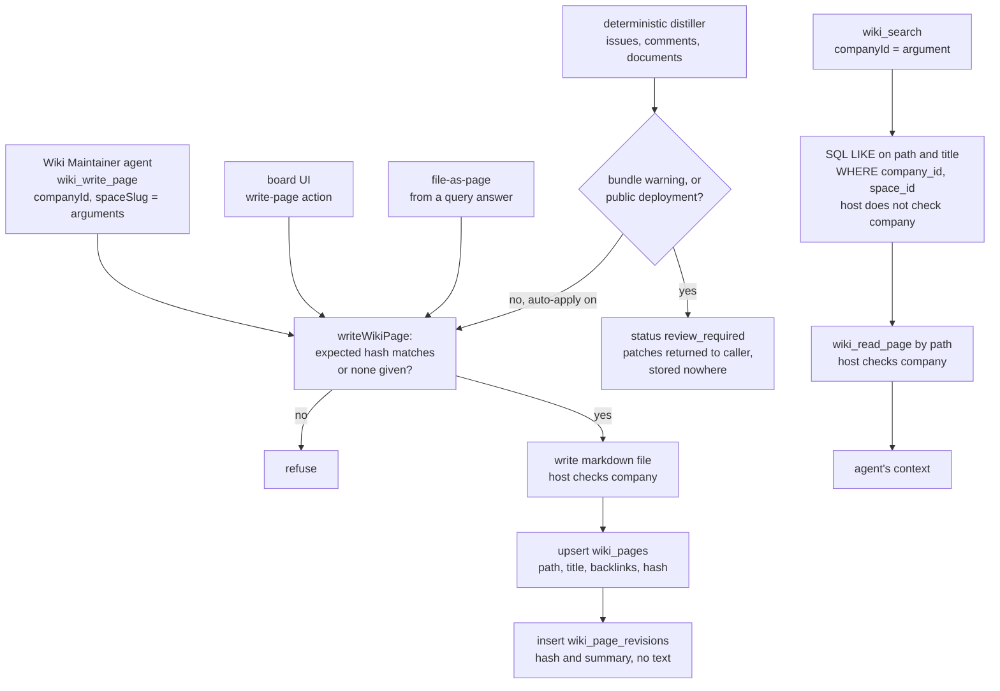

## 1. Executive Summary

Paperclip is a Node.js server and React board that runs a company of coding
agents — an org chart, heartbeats, issues, budgets, approvals and a tool
gateway. Almost everything it persists is work state. Its memory is an
experimental plugin in the same repository, LLM Wiki: a managed maintainer
agent writes markdown pages into a local folder, Postgres indexes their paths,
titles and backlinks, and agents find pages by title substring and read them
by path. The notable part is the Paperclip-side distillation, which records
what issue history a page came from with source hashes and snapshots. The weak
part is the read path. Search never looks at page text, and both scope keys are
tool arguments the agent supplies.

The plugin is one of three the board lists as experimental
(`server/src/routes/plugins.ts:182-186`), is installed from the plugin page,
and ships its maintainer agent and three routines paused
(`packages/plugins/plugin-llm-wiki/src/manifest.ts:173, 241, 268, 295`).

Four findings shape the rest of this report.

- **The company key reaches every query, and the caller chooses it.** Every
  metadata read filters on `company_id` and `space_id`
  (`src/wiki/core.ts:4071-4081`). Both values come from the tool's arguments.
  The host checks a plugin's local-folder calls against the invoking run's
  company, and does not check its SQL, so `wiki_search` accepts another
  company's id and returns that company's page paths and titles. Page bodies
  stay behind the local-folder check. This is read from the code and was not
  reproduced.
- **Review-required means discarded.** A distillation with a bundle warning, or
  on a public deployment, returns its proposed patches to the caller and stores
  none of them (`src/wiki/core.ts:3463-3490`). The only caller in the UI
  discards the result (`src/ui/app.tsx:5512-5517`).
- **Search reads titles.** `wiki_search` is a `LIKE` on path and title; it
  never opens a page. Recall rests on the agent reading `wiki/index.md` and
  following links.
- **Revisions record that a page changed, not what it said.** Each write
  inserts a revision row carrying the new content hash. The prior text is gone
  unless the operator keeps the folder under version control.

Two other things in the tree carry the word memory and are not scored. The
`para-memory-files` skill tells the CEO agent to keep facts in YAML files under
`$AGENT_HOME/life/` and search them with `qmd`, and no Paperclip code reads or
writes those files. The memory connectors are ordinary tool connections to
Mem0, Zep, Supermemory, Cognee and Honcho, off by default
(`packages/shared/src/validators/instance.ts:57`). The design document
`doc/memory-landscape.md` plans a company-level memory binding with provenance
and cost rows; no code implements it, and
`evals/promptfoo/tests/phase5-memory-control-surfaces.yaml` grades a model's
prose about that design.

## 2. Mental Model

A memory is a markdown page. It becomes a belief the moment the file is
written: there is no candidate state, no status on a page, and no check against
other pages. The writer is almost always the Wiki Maintainer agent. It follows
an operation issue and one of five skills — `wiki-ingest`, `wiki-query`,
`wiki-lint`, `paperclip-distill`, `index-refresh` — and writes with
`wiki_write_page`. A person can write through the board, and a deterministic
distiller can write project pages without a model.

A page stops being believed only by being rewritten. There is no delete tool
and no page-delete path in the plugin. Contradiction is handled in prose. The
wiki's schema tells the agent to add a `> ⚠ contradicted by` callout rather
than overwrite (`templates/AGENTS.md:77`), and the lint skill is read-only and
reports contradictions as findings (`skills/wiki-lint/SKILL.md:19-20`). The
callout is text on the page. No reader treats it differently.

Two layers of page do different jobs, by instruction rather than by code.
`wiki/projects/<slug>/standup.md` is rewritten to the current state on every
distillation. `index.md`, `decisions.md` and `history.md` accumulate, and the
distill skill tells the agent to supersede an accepted decision with a callout
rather than remove it (`skills/paperclip-distill/SKILL.md`, *Workflow* step 2).

`raw/` holds captured sources and is immutable by instruction. The path check
lets `wiki_write_page` write only under `wiki/` and a few named root files, so
the agent's tool cannot rewrite `raw/` (`src/wiki/core.ts:1181-1190`).
`AGENTS.md` and `IDEA.md` are writable only by the board
(`src/wiki/core.ts:1192-1196`).

| Paperclip-side record | What it holds | Can it be false about the world? |
| --- | --- | --- |
| Distillation cursor | Last processed time and source hash per project or root issue | No — it is processing state |
| Source snapshot | The redacted issue bundle a run read, with source refs | No — it is what was read |
| Page binding | Which source hash a generated page was last applied from | No — it is provenance |
| Wiki page | Agent or template prose about projects, entities and concepts | Yes — this is the memory |

## 3. Architecture

Paperclip is a monorepo: an Express server with an embedded Postgres by default,
a React board, a CLI, adapters for Claude Code, Codex, Gemini, Cursor and
others, and a plugin host that runs each plugin in a worker process over
JSON-RPC. The LLM Wiki is one such plugin
(`packages/plugins/plugin-llm-wiki/`). Its manifest asks for 34 capabilities,
from `database.namespace.write` to `agents.managed`
(`src/manifest.ts:89-124`).

Memory adds three things to a running Paperclip. The first is a declared local
folder, `wiki-root`, with `raw/`, `wiki/` and its subfolders
(`src/manifest.ts:134-150`). The second is a Postgres namespace built by three
migrations: instances, sources, pages, revisions, operations, query sessions,
resource bindings, five distillation tables, and spaces
(`migrations/001_llm_wiki.sql`, `002_paperclip_distillation.sql`,
`003_spaces.sql`). The third is a managed agent, a managed project and three
routines. Each space other than the default is a subfolder
`spaces/<slug>/` of the same root, and each carries its own key.

The plugin's SQL runs through the host's `db.query` and `db.execute`, which
validate that the statement stays in the plugin's namespace or its four
declared core read tables and nothing more (`server/src/services/plugin-database.ts:557-570`).
File reads and writes go through the host's local-folder service, which
resolves the folder per company and applies path containment and symlink
checks (`server/src/services/plugin-host-services.ts:1486-1502`).

Retrieval has no index beyond Postgres B-trees and a `?` match on the
`backlinks` JSON array. There is no full-text index, no embedding, and no model
in the read path.

### Deployment and ergonomics

Nobody runs this memory without running Paperclip: Node 24, the server, its
Postgres, a configured local folder, and a coding-agent CLI for the maintainer.
It runs fully local. Storing a page needs no API key; the maintainer agent
needs whatever its adapter needs. The store is plain markdown, readable and
repairable in any editor, and the board lists files that exist on disk and not
in the index (`src/wiki/core.ts:1726-1741`). Adoption is a plugin install, a
root-folder bootstrap, and unpausing the agent and routines.

## 4. Essential Implementation Paths

**Tool registration.** `registerWikiTools` (`src/wiki/core.ts:4059-4276`)
registers ten tools. Each handler reads `companyId` with `requireString` from
its own parameters and resolves a space with `resolveSpace`. The SDK passes a
second `runCtx` argument carrying the run's company
(`packages/plugins/sdk/src/worker-rpc-host.ts:1969-1975`); no wiki handler
takes it.

**Write.** `writeWikiPage` (`src/wiki/core.ts:1842-1862`) resolves the space,
runs `assertPagePath` and `assertPageWriteAllowed`, and reads the current file
through `readCurrentWithHash`, which returns a null hash on any error
(`:1678-1690`). It refuses on a hash mismatch only when both hashes exist
(`:1759-1763`). It then calls `localFolders.writeTextAtomic` and
`upsertPageMetadata` (`:1787-1840`). That function upserts `wiki_pages` on
`(company_id, wiki_id, space_id, path)`, and inserts a
`wiki_page_revisions` row (`:1831-1836`). Title comes from the first `#`
heading, page type from the folder, backlinks from markdown links and bare
`wiki/…md` tokens (`:1649-1676`).

**Search.** `wiki_search` (`:4060-4087`) runs one `UNION ALL` over
`wiki_pages` and `wiki_sources` with `lower(path) LIKE lower($3)` or the same
on title, and on URL for sources, ordered by kind and path, capped at 50.

**Read.** `wiki_read_page` (`:4089-4101`) reads the file by path through the
local-folder service and returns it with its hash. `readWikiPage` for the board
does the same and joins the metadata row (`:4420-4445`).

**Deterministic distillation.** `distillPaperclipProjectPage`
(`:3334-3538`) assembles a bounded bundle of issues, comments and documents
(`assemblePaperclipSourceBundle`, `:2609`), records a run and a source
snapshot, and skips low-signal windows by regex (`:3000-3012`) and unchanged
source hashes via `paperclip_page_bindings`. It builds standup, index,
decisions and history pages from templates. It then either returns the patches
as `review_required` (`:3464-3490`) or writes each through `writeWikiPage` and
upserts a page binding (`:3492-3516`).

**Agent distillation.** `distill-paperclip-now` creates a work item and a hidden
operation issue assigned to the maintainer (`src/worker.ts:590-622`); the agent
follows `skills/paperclip-distill/SKILL.md` and writes with the same tools.

**Query.** `startWikiQuerySession` (`:3836`) opens a hidden `query` operation
issue, starts an agent session with a prompt naming the company, wiki and
space (`:3788-3800`), and streams events to the board. `fileQueryAnswerAsPage`
(`:3986-4057`) writes an answer as a page.

**Events.** `handlePaperclipEventIngestion` (`:3733-3782`) turns issue,
comment and document events into cursor observations and writes nothing.

## 5. Memory Data Model

| Table | Key columns | Notes |
| --- | --- | --- |
| `wiki_pages` | company_id, wiki_id, space_id, path | title, page_type, `frontmatter` (always `{}`), `source_refs`, `backlinks`, content_hash, current_revision_id |
| `wiki_page_revisions` | company_id, wiki_id, space_id, page_id | operation_id, path, content_hash, summary; no text, no actor |
| `wiki_sources` | company_id, wiki_id, space_id | source_type, title, url, raw_path, content_hash, status `captured` |
| `wiki_spaces` | company_id, wiki_id, slug | path_prefix, access_scope, owner_user_id, owner_agent_id, team_key, status |
| `paperclip_page_bindings` | company_id, wiki_id, space_id, page_path | last_applied_source_hash, last_distillation_run_id |

The page text lives only in the file. `frontmatter` is inserted as `'{}'` and
never updated (`src/wiki/core.ts:1805-1808`), so the YAML frontmatter the skills
require (`current_as_of`, `sources`, `type`) is not indexed.

**Provenance on agent writes is empty.** `wiki_write_page`'s declared schema has
no `sourceRefs` property (`src/manifest.ts:352-368`), so an agent write stores
`source_refs = []` unless the model adds an undeclared field. Citations exist
only as links in the page text. The distiller and file-as-page do fill
`source_refs`.

**Scope** is company, then wiki id, then space. Every read predicate names all
three. The `access_scope` column takes `shared`, `personal` or `team`, and the
only read of it refuses Paperclip ingestion into non-shared spaces *"until host
permissions are enforced"* (`src/wiki/core.ts:869-876`).
`owner_agent_id` and `owner_user_id` are always inserted null
(`:1419-1456`).

**Time.** `created_at` and `updated_at` on rows; `current_as_of` exists only as
agent-written frontmatter. Distillation runs record a source window, which
describes what was read rather than when a claim was true.

## 6. Retrieval Mechanics

Retrieval is tool-mediated and agent-driven. The query prompt tells the agent
to read `wiki/index.md` first, then use `wiki_search`, `wiki_read_page`,
`wiki_list_sources` and `wiki_read_source` (`src/wiki/core.ts:3788-3800`).
No hook injects wiki content into any agent's context. Other Paperclip agents
reach the wiki only if their tool profile admits the plugin's tools; the plugin
grants its own maintainer `pluginTools: [PLUGIN_ID]`
(`src/manifest.ts:170-172`).

**`wiki_search` matches names.** It is a substring test on path and title,
lowercased, with the query wrapped in `%…%` (`:4071-4081`). A question phrased
in the page's words and not its title finds nothing. The design leans on the
index page and on backlinks, which `wiki_list_backlinks` serves from the
`backlinks` array (`:4240-4249`). That is the Karpathy LLM-wiki shape, which
`templates/IDEA.md` cites, and it scales with how well the agent keeps
`wiki/index.md` current.

**The agent's tools and the board read different lists.** The board's `pages`
data drops rows whose file no longer exists, through `filterReadableRows`
(`:4363`, `:1692-1708`), and adds files present on disk and absent from the
index. The agent's `wiki_list_pages` and `wiki_search` return index rows as
they are. An agent can therefore be offered a page that no longer exists and
miss one written outside the tools.

Token budget is the agent's own: `wiki_search` caps at 50 rows, list tools at
200, and `wiki_read_page` returns the whole file.

## 7. Write Mechanics

Writes are explicit and synchronous. The agent decides what to write. Each
`wiki_write_page` call is a file write and two SQL statements, with no model
call inside the tool. The model cost is the maintainer's own run, recorded as
Paperclip cost against a per-space billing code (`src/wiki/core.ts:2277-2285`).
A page is retrievable by `wiki_read_page` as soon as the file is written, and by
`wiki_search` once the metadata upsert commits.

**Conflict control is optional.** `expectedHash` refuses a stale write only when
the caller passes it and the file exists (`:1759-1763`). The distiller passes
the hash it read. The agent's tool leaves it to the model.

**`wiki_append_log` can lose an entry.** It reads `wiki/log.md`, appends a line,
and writes the whole file back with no hash check (`:4196-4205`). Two
concurrent operations can each drop the other's line. `wiki/log.md` is also
writable through `wiki_write_page`, so *"append-only"* in the schema is an
instruction.

**Deterministic auto-apply.** The distiller applies its templated pages when
`autoApplyIngestPatches` is not false in config and the deployment is not
`authenticated` and `public` (`:3309-3332`). In any `local_trusted` instance
that means template output lands without review whenever the bundle carries no
warning (`:3405`, `:3463-3464`). The `paperclip-distill` skill describes this
templating as the thing it *"replaces"*. Both paths remain callable.

**Secret suppression covers comments and documents.**
`protectDistillationSourceBody` replaces a comment or document body that
matches any of nine secret patterns with a suppression notice
(`:591-637`, called at `:2676` and `:2717`). Issue descriptions go into the
bundle unfiltered (`:2640-2651`). Raw sources captured through
`captureWikiSource` are not filtered either (`:1864-1894`).

**Event capture writes nothing.** Four formatters that once turned events into
raw files have no caller (`:3540-3630`); events only update cursors.

No background pass rewrites the store. The cursor-window routine, when
unpaused, wakes the agent every six hours; the lint routine is read-only by
skill; index refresh rewrites `wiki/index.md` hourly.

### Operational cost

- Write: synchronous, one file write plus two SQL statements; no model call in
  the tool. Retrievable immediately.
- Background: none at install. Unpaused, one agent run per six-hour window per
  cursor, one nightly lint run and an hourly index refresh, each a full agent
  session.
- Read: one SQL query per search; a page read returns the whole file. Nothing
  is injected per turn, so nothing disturbs a prompt-prefix cache.

## 8. Agent Integration

The integration is Paperclip's own. The plugin registers ten tools through the
host's tool registry. The tool gateway lists them to an agent after the
per-agent policy decision, and allows or queues each call
(`server/src/services/tool-gateway.ts:8875-8903`). Plugin tools need an agent
run context (`:10412-10420`) and dispatch with the run's company, agent and
project (`:10444-10455`). The gateway passes the arguments through unchanged.

Work arrives as hidden plugin-operation issues assigned to the managed Wiki
Maintainer, a `claude_local` agent with sandboxing on
(`src/manifest.ts:152-176`). Its instructions embed the wiki root's absolute
path and the tool list (`agents/wiki-maintainer/AGENTS.md:7-13`). The operation
prompt repeats a *"Space isolation requirement"* in prose
(`src/wiki/core.ts:2297-2315`).

The model has full agency over pages it can reach: read, write, overwrite,
search. It has no delete, and cannot write `raw/`, `AGENTS.md` or `IDEA.md`
through the tools. Porting the design needs the plugin host; the skills and
the page layout port by copying.

## 9. Reliability, Safety, and Trust

**Cross-company metadata reads.** The host's invocation scope is the run's
company, derived from `runContext` (`server/src/services/plugin-worker-manager.ts:1129-1132`).
`requireInvocationCompanyScope` compares it with a `companyId` field in the
worker's host-call parameters (`packages/plugins/sdk/src/host-client-factory.ts:571-635`).
`db.query` parameters are `{ sql, params }` (`packages/plugins/sdk/src/protocol.ts:1577-1584`),
so a plugin query is never checked. A comment in the host states the model:
plugins are instance-wide and there is *"no per-company availability gate"*
(`server/src/services/plugin-host-services.ts:802-806`).

For the wiki this splits the tools in two. `wiki_read_page`,
`wiki_read_source` and `wiki_write_page` touch the local folder, and a foreign
`companyId` is refused. `wiki_search`, `wiki_list_pages`, `wiki_list_sources`
and `wiki_list_backlinks` touch only SQL. Given another company's UUID, they
return its page paths, titles and source URLs. `resolveSpace` also inserts a
default space row for that company on the way (`src/wiki/core.ts:1331-1352`).
The agent would need the UUID. This was traced, not run.

**Prompt-injected memories.** Issue text, comments and documents from any
Paperclip actor become distillation input and, through the agent, page prose.
Nothing marks a page as unverified, and the query skill tells the agent to cite
pages as evidence.

**Data loss.** A write overwrites the file. The revision row keeps the new hash
only. Without the operator's own git, the prior text is unrecoverable.

**Deletion.** There is no delete tool. A page removed on disk leaves its index
row, which the agent's tools keep returning.

**Uncertainty.** Distillation patches carry `confidence` and
`humanReviewRequired`. Both are returned in the action's result and stored
nowhere; a page has no field for either.

Capability marks:

- `scope_enforced` — awarded, with the limit in its record: the predicates are
  on every read, and the values are the caller's arguments.
- `audit_log` — awarded. `wiki_page_revisions` is insert-only, one row per write
  path. Its limits: no text, no actor, and an operation id on the file-as-page
  path only.
- `human_review` — withheld. The distiller's `review_required` run holds no
  proposal to review: the patches are returned and discarded, a queue nothing
  fills. `wiki_propose_patch` returns a proposal and stores nothing. The
  gateway can hold any tool call for approval, and that gates an invocation
  rather than a memory. Nothing in the tree configures it for the wiki, and the
  board's writes bypass it.
- `trust_state` — withheld. Pages have no status. The run status
  `review_required` describes a distillation run.
- `tombstone` — withheld. Contradiction is a prose callout; nothing records a
  rejected claim.
- `bitemporal` — withheld. `current_as_of` is unindexed frontmatter.
- `negative_eval` — withheld; section 10.

## 10. Tests, Evals, and Benchmarks

Nothing was installed, built or run for this report. Everything below is from
reading the tests at the pin.

The plugin's suite is `tests/plugin.spec.ts` (81 cases), a UI spec (16) and an
attachment spec (4). They run against the SDK's `createTestHarness`, whose
`db.query` records the SQL and returns `[]`
(`packages/plugins/sdk/src/testing.ts:895-899`). No case executes a scope
predicate against a database. Most cases stub `localFolders` with a `Map`.

The cases that can fail on memory behaviour:

- *"writes pages atomically, records metadata, and rejects stale hashes"*
  (`tests/plugin.spec.ts:3455-3491`) asserts a stale `expectedHash` is refused
  and that a revision insert is issued.
- *"keeps suppressed secret-like source content out of generated wiki patches"*
  (`:2509-2578`) asserts two planted tokens are absent from every patch and the
  suppression marker is present.
- *"filters stale page and raw source rows out of browse data"*
  (`:1533-1604`) returns a live row and a stale row from a mocked query and
  asserts the board's list equals the live one exactly.
- *"keeps default-space files at the root and isolates managed spaces under
  slug prefixes"* (`:3269-3367`) asserts two same-named writes land in two
  folders.

**`negative_eval` is withheld.** The stale-row case is the nearest: a populated
list, an excluded row, and a positive control. It asserts that the board's
listing agrees with the disk. The rows it excludes are dangling index entries
for a file that is gone, not memory kept out of a result. The filter it
exercises is absent from the agent's tools (section 6). The secret case keeps
material out of a write. The space case asserts where writes land, and ends
in `.every(...)` over SQL strings.

`server/src/__tests__/plugin-database.test.ts:485-530` applies the three
migrations through the production validator on embedded Postgres and asserts
the space-keyed unique constraints. It skips where embedded Postgres is
unsupported (`:30-31`).

`evals/promptfoo/tests/phase5-memory-control-surfaces.yaml` grades a model's
answers about a memory-provider binding that no code implements. No paper,
citation block or benchmark result is committed. `templates/IDEA.md` credits
the pattern to Karpathy's LLM Wiki gist.

## 11. For Your Own Build

### Steal

- **Bind a generated page to the source hash it was built from.** A binding row
  with `last_applied_source_hash` makes re-distillation idempotent and answers
  *"what did this page come from"*.
- **Snapshot the input bundle, redacted, beside the run.** The snapshot is
  what the page was derived from, so an auditor does not have to reconstruct
  issue state at run time.
- **Refuse auto-apply by deployment exposure, not by config.** A public
  authenticated instance cannot turn it back on.
- **Protect the schema files from the agent's own write tool.** The agent reads
  `AGENTS.md` and cannot rewrite the rules it follows.
- **Suppress, rather than mask, a source that matches a secret pattern.**
  Replacing the whole body with a notice carrying the reason keeps a partial
  secret out of prose.

### Avoid

- **A scope key as a tool argument where the transport carries the identity.**
  The run context arrived with the call and the handler ignored it. Derive the
  key from the caller; treat an argument as a request to validate. See
  [scope as a first-class key](../../patterns/scope-as-a-first-class-key/).
- **A review state with nothing to review.** If a run is marked for review,
  persist the proposal and an apply verb the agent does not hold.
- **An audit row that holds a hash of text you did not keep.** It proves a
  change happened and cannot say what changed. Store the prior text, or
  record the writer and the run.
- **Two lists of the same pages with different filters.** The person and the
  agent should see the same set.

### Fit

This suits an operator who already runs Paperclip, keeps the wiki folder under
their own git, and wants a browsable project wiki that agents keep current.
Pages read like documentation, and a person can correct one in an editor.
It is not a memory to adopt on its own: it needs the plugin host, a paused agent
brought to life, and a model run per operation. It stops fitting when recall
has to work from page content rather than titles. It also stops fitting when
companies on one instance must not see each other's page names, or when a
wrong page has to be traced back to who wrote it.

## 12. Open Questions

- Does any deployment path bind plugin SQL to the invoking company, outside the
  host-client handlers read here? A run against two companies would settle the
  metadata read.
- Which agents does the default tool profile admit to the wiki's tools? The
  policy service was read at its entry point only.
- Does the maintainer's sandbox let it edit files under the wiki root directly?
  Its instructions carry the absolute path, and such edits produce no revision
  row.
- How large do wikis get in the maintainers' own use, and does title search
  hold up there? Nothing committed says.

## Appendix: File Index

- **Storage and schema:** `packages/plugins/plugin-llm-wiki/migrations/001_llm_wiki.sql`,
  `002_paperclip_distillation.sql`, `003_spaces.sql`; `src/manifest.ts:89-150`.
- **Write path:** `src/wiki/core.ts:1156-1204` (path checks), `:1759-1862`,
  `:1864-1894`, `:4187-4232`; `src/worker.ts:316-328`.
- **Retrieval:** `src/wiki/core.ts:4060-4101`, `:4149-4185`, `:4234-4275`,
  `:4328-4445`.
- **Distillation:** `src/wiki/core.ts:591-637`, `:2609-2765`, `:2846-2893`,
  `:3000-3012`, `:3231-3538`; `skills/paperclip-distill/SKILL.md`.
- **Spaces and scope:** `src/wiki/core.ts:854-895`, `:1331-1460`;
  `packages/plugins/sdk/src/host-client-factory.ts:571-635, 749-755`;
  `packages/plugins/sdk/src/protocol.ts:1577-1584`;
  `server/src/services/plugin-worker-manager.ts:1115-1140`;
  `server/src/services/plugin-host-services.ts:802-806, 1486-1502`;
  `server/src/services/plugin-database.ts:557-570`.
- **Agent integration:** `agents/wiki-maintainer/AGENTS.md`, `skills/`,
  `templates/AGENTS.md`; `server/src/services/tool-gateway.ts:8875-8903,
  10412-10455`; `server/src/routes/plugins.ts:182-186`.
- **Not scored:** `skills/para-memory-files/`,
  `server/src/onboarding-assets/ceo/AGENTS.md:49`, `doc/connections/MEMORY.md`,
  `packages/shared/src/memory-connectors.ts`, `doc/memory-landscape.md`.
- **Tests:** `tests/plugin.spec.ts`; `packages/plugins/sdk/src/testing.ts:895-899`;
  `server/src/__tests__/plugin-database.test.ts:485-530`.

### Recorded searches

Run at the root of the checkout at the pinned revision.

- `rg -n 'deleteFile|DELETE FROM' packages/plugins/plugin-llm-wiki/src` — no match: the plugin deletes no page, source or row.
- `rg -n 'wiki_page_revisions' packages/plugins/plugin-llm-wiki/src` — one match, the `INSERT` at `core.ts:1833`; no `UPDATE` or `DELETE`.
- `rg -n 'writeWikiPage\(ctx' packages/plugins/plugin-llm-wiki/src` — five call sites; only `core.ts:4007` (file-as-page) passes `operationId`.
- `rg -n 'filterReadableRows' packages/plugins/plugin-llm-wiki/src` — defined at `core.ts:1692`, called at `:4363` and `:4406` only; no agent tool calls it.
- `rg -n 'access_scope|accessScope' packages/plugins/plugin-llm-wiki/src/wiki/core.ts` — the only branch on the value is `:869`, the Paperclip-ingestion refusal.
- `rg -n 'formatIssueEventSource|formatCommentEventSource|formatDocumentEventSource|rawPathForPaperclipEvent' packages/plugins/plugin-llm-wiki` — definitions only, no caller.
- `rg -n 'redactDistillationSensitiveText|protectDistillationSourceBody' packages/plugins/plugin-llm-wiki/src/wiki/core.ts` — called for documents (`:2676`) and comments (`:2717`); not for issue descriptions or `captureWikiSource`.
- `rg -n '"db.query": gated' -A2 packages/plugins/sdk/src/host-client-factory.ts` and `rg -n '"db.query":' -A3 packages/plugins/sdk/src/protocol.ts` — the handler is gated, and its parameters carry no `companyId` for the scope check to read.
- `rg -n -i 'memoryProvider|memory_provider|memory provider' --type ts` — a run-log test helper and connector UI strings; no memory-provider binding.
- `rg -n 'para-memory-files|AGENT_HOME' --glob '!skills/para-memory-files/**' | grep -v '^doc/plans'` — skill defaults, onboarding prose and env propagation; no code reads `life/`, `items.yaml` or `MEMORY.md`.
- `grep -rliE 'arxiv|bibtex|@article|@misc|doi\.org' packages/plugins/plugin-llm-wiki README.md doc/memory-landscape.md` — no match, and no `CITATION.cff` at the root.

## History

**2026-09-27** — [`01d9a121859a3d8298dce91452f75516e837e819`](https://github.com/paperclipai/paperclip/commit/01d9a121859a3d8298dce91452f75516e837e819) — first reading, at the head of `master`, a commit dated 26 September 2026; the wiki plugin last changed at [`d95c71027df0f9832a628968e5a3c17d2aed16f6`](https://github.com/paperclipai/paperclip/commit/d95c71027df0f9832a628968e5a3c17d2aed16f6) on 3 September. `scope_enforced` and `audit_log` awarded; section 9 names the rest. Screened before reading: no auto-run surface, one build-time execution point (a root `postinstall`), 46 unpinned surfaces, 53 files inside the cooldown — inflated, since a depth-1 clone dates every file to the tip — and `AGENTS.md` recorded as data. Nothing was installed, built or run.
