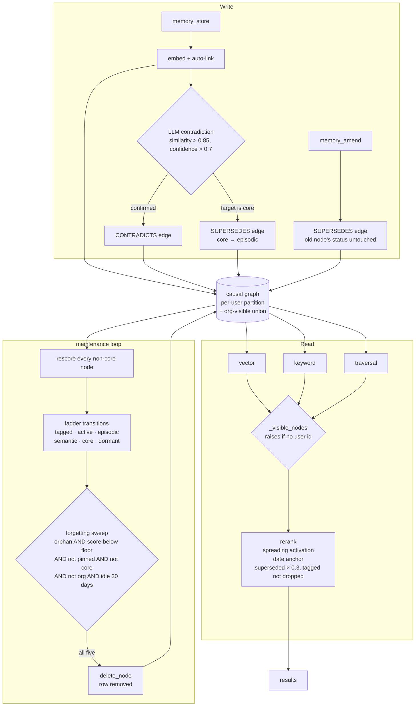

## 1. Executive Summary

Papez is an MCP memory server built around a causal graph. Memories are scored
multiplicatively — relevance times connectivity times reactivation — linked by
typed edges, walked up a consolidation ladder by a background pass, and
eventually deleted. The README's framing is that flat vector memory gives
recall with no understanding, and the graph is the answer to *why did I choose
X*.

Two marks, and both are about boundaries rather than beliefs.

**Scope is enforced inside the store, not at the door.** Every read helper
resolves through one visibility function: the caller's own partition, plus
anything marked org-visible whose org is in the caller's list. Identity lives
in request-scoped context variables, and the resolver **raises** when no user
is set rather than falling back to a shared bucket — the failure mode is an
error, not a quiet read of everyone's data.

**The exclusion tests are paired.** The traversal case asserts, in one block,
that the org node came back and the private one did not; the vector pair uses
the *same* embedding for the included and excluded nodes, so the difference
between them is visibility and nothing else. That is what separates a real
isolation test from one that passes because the query matched nothing.

What is withheld is more interesting than what is awarded. This system has a
seven-value status enum, a CONTRADICTS edge, a SUPERSEDES edge and an LLM
contradiction detector — everything a trust state is usually made of — and no
read path withholds anything on any of it. A superseded memory has its rank
multiplied by 0.3 and gains a `superseded_by` field. It is still returned, and
the `amend` tool's docstring says leaving it that way is deliberate.

And forgetting is a hard delete. The enum's `pruned` value is never assigned by
any code in the package.

## 2. Mental Model

Three mechanisms run over one graph and they are easy to conflate.

**The ladder** is consolidation: `tagged` on arrival, promoted to `active` when
an edge forms, demoted to `episodic` after three sessions below a relevance
threshold, to `dormant` after ninety days, or promoted to `core` by a composite
of ACT-R activation, hub degree, neighbourhood density and stability. These are
tiers of importance.

**The edges** are epistemics: CONTRADICTS and SUPERSEDES, created by an LLM
check against high-similarity neighbours. They describe relationships between
claims.

**The sweep** is deletion, and no other path in this package destroys
anything.

The three meet in exactly one place: when a new memory contradicts a node that
is currently `core`, a SUPERSEDES edge is added and the old node is demoted to
`episodic` — losing a tier because something disagreed with it. Everywhere else
the ladder and the edges run past each other.

## 3. Architecture

## 4. Essential Implementation Paths

- **Identity:** `src/papez/context.py` — four context variables and the reason
  two of them have no default.
- **Visibility:** `src/papez/storage/memory.py` — `_get_org_ids`,
  `_visible_nodes`, and the read helpers built on them.
- **Tools:** `src/papez/mcp/tools.py` — store, recall, search, traverse, amend,
  promote, erase.
- **Ladder:** `src/papez/engine/transitions.py`; promotion in
  `src/papez/core_memory/promoter.py`.
- **Contradiction:** `src/papez/engine/contradiction.py`.
- **Forgetting:** `src/papez/engine/forgetting.py`, driven by
  `src/papez/engine/maintenance.py`.

## 5. Memory Data Model

A node carries its scoring state on its face: `decay_score`, `causal_weight`,
`reactivation_count`, a `reactivation_pattern` of burst, steady or single, an
`irrelevance_counter`, and a `stability` term described as spaced repetition.
Alongside those sit `pinned`, `promotion_reason`, and the three scope fields —
`org_id`, `visibility`, `original_user_id`.

The status field is the one worth naming carefully, because its shape invites a
misreading. `tagged`, `active`, `episodic`, `semantic` and `core` are a
consolidation ladder; `dormant` is its floor; `pruned` is declared and, at this
pin, never assigned — the forgetting sweep calls `delete_node` instead.

Content can be a summary alone, a summary plus full text, or a summary plus a
reference, which is a sensible way to keep a 200-character summary in the
graph while the body lives elsewhere.

## 6. Retrieval Mechanics

Recall runs vector and keyword searches and pulls causal chains, all through
the visibility helper, then reranks. Three adjustments stack: a small bonus per
edge between two members of the result set (spreading activation), a boost when
one of a memory's dates falls inside an absolute window parsed out of the
question, and a multiplier of 0.3 on any hit a newer memory supersedes.

The date-anchor module is careful in a way worth noting: it requires an
explicit four-digit year before it will emit any window, so relative temporal
questions are left completely untouched rather than anchored to a guess, and
its docstring states that no rule references a gold answer or dataset statistic
— a declaration about benchmark hygiene made in the code rather than the
README.

The supersession handling carries a bug comment that is the clearest thing in
the file. A previous version marked the superseder itself as superseded
whenever the old node fell out of the result set — *"down-ranking the
correction it was supposed to prefer."* The direction of the edge now decides:
new is the source, old is the target, only targets are tagged.

## 7. Write Mechanics

Storing embeds, auto-links, and runs contradiction detection over the twenty
nearest neighbours, keeping only pairs above 0.85 similarity and asking an LLM
to confirm, above 0.7 confidence, before writing a CONTRADICTS edge.

There is also a cheap pre-check, and its comments are a short lesson in
building a heuristic against real failures. It fires `numeric_mismatch` only
when two texts carry different numbers under a *shared anchor word*, with a
stopword list that exists because *"budget is 50000"* and *"latency is 200"*
were colliding on the anchor `is` — the comment cites the field report, a 200ms
latency memory flagging a $50,000 budget memory. A number's unit is part of its
key, so six weeks and eight months never conflict. And the whole thing is
labelled: hints only, *"never verified contradictions and never materialized as
edges."*

Correction is `memory_amend`: a new node with a SUPERSEDES edge back. The old
node's status is explicitly not changed, on the reasoning that recall already
decays and tags it and the transitions engine will demote it naturally, and
that mutating status here would bypass that engine and be non-reversible.

## 8. Agent Integration

A stdio MCP server, published on PyPI as `papez`, with a Dockerfile and a
compatibility shim under the project's former name. The README is explicit that
this package is the core library — in-process graph, optional JSON persistence,
no database dependency and no REST API — and that the hosted product with
Postgres and an HTTP API is separate and not included.

One artefact of the rename survives: every tunable is still read from a
`GENESYS_`-prefixed environment variable.

## 9. Reliability, Safety, and Trust

**Scope enforced — awarded.** One helper behind every read, fed from
request-scoped identity that raises when unset, and an org list with no default
because a shared mutable default is a leak hazard. Two limits belong on the
record and are in the evidence: the store's helpers accept an explicit override,
and the stdio server in this package sets a single constant user id, so the
partition this mark certifies is exercised by the tests rather than by that
deployment.

**Negative eval — awarded**, on the paired cases rather than on the end-to-end
recall test, which asserts only an absence and would pass on an empty result.

**Trust state — withheld, and this is the near miss of the report.** Everything
needed is present: a stored discrete field with seven values, a CONTRADICTS
edge type, a SUPERSEDES edge type, and an LLM detector that creates them. What
is missing is a read that withholds. Supersession multiplies a rank score by
0.3 and adds a `superseded_by` field to the result — the rubric's distinction
exactly, a number used for ranking rather than a state used for filtering. The
status field *can* be filtered on, but only because the caller passes
`filters.status`; the default is no filter, so a dormant memory is returned by
default. The one place a state does change on epistemic grounds is a
contradicted `core` node being demoted to `episodic`, and episodic is a tier,
not a doubt.

**Tombstone — withheld.** The forgetting sweep calls `delete_node`; nothing is
keyed on a rejected value and no write path consults anything. The `pruned`
status exists in the enum and nothing sets it.

**Audit log — withheld.** `evaluate_transitions` builds a record of every
transition with an old value, a new value and a reason — and its only caller
takes the length of the list and discards it. Erasure produces a manifest and
fires a `user.erased` event, but `_notify` is a callback the embedder supplies,
not a store.

**Human review — withheld.** Ownership is checked on pin, unpin, delete,
promote and amend, and an admin role is bounded so that it can reach another
user's org node but not a different org's and not a private one. Those are
access controls on the actor, not a place where a person adjudicates content.

**Bi-temporal — withheld.** `created_at` may be supplied by the caller, and the
date-anchor reranker reads event dates out of the content text. Both are one
axis; no read returns the graph as of a past instant.

## 10. Tests, Evals, and Benchmarks

**No paper**, and no `CITATION.cff`. The benchmark claim lives in the README
and is unusually well-qualified: 85.55 ± 0.37 on LoCoMo under a protocol it
names as frozen — a fixed answerer and judge, temperature 0, ten runs — with
comparison figures for two other systems, a statement that self-reported
figures above roughly 90 use different answerers and judges and are not
comparable, and the oracle retrieval ceiling under that protocol given as 94.9.
The harness is a separate repository. Nothing in *this* repository reproduces
the number, so the claim is checkable elsewhere and not here.

The in-repo `benchmarks/` directory is a different thing: a runner comparing
Papez against a flat vector baseline over four committed scenario files —
causal reasoning, outdated info, structural importance, temporal awareness —
graded against ground-truth prose by an LLM, needing API keys, with no results
committed.

19 test files. The isolation pairs carry the negative-eval mark and are quoted
in the evidence. Two more are worth naming for their shape rather than their
mark: `test_private_orphan_still_pruned` is the positive control that keeps
`test_org_node_exempt_from_forgetting` honest, and `test_gdpr_erasure` checks
both erasure modes, including the one that anonymises a promoted node and
scrubs PII from edge reasons rather than deleting it.

## 11. For Your Own Build

- **Raise on a missing scope key.** Returning an empty result for an unset
  identity is the same code path as a legitimate empty result, and only one of
  them is a bug you will notice.
- **Give a scope list no default.** The comment here is worth internalising: a
  shared mutable default is a cross-request leak waiting to happen.
- **Pair every exclusion test with an inclusion that uses the same query.**
  Identical embeddings for the visible and invisible node is the cheapest way
  to prove the exclusion was caused by the boundary rather than by the search
  finding nothing.
- **Write the false positive into the heuristic's comments.** The stopword list
  and unit keying in the contradiction pre-check each name the case that
  produced them, which is what stops the next maintainer simplifying them away.
- **Decide whether supersession ranks or filters, and say which.** This code
  chose to rank and tag, and documented the reason in the amend tool. That is a
  defensible choice; leaving it implicit is not.

## 12. Open Questions

- The `pruned` status is declared and never set, while forgetting deletes the
  row. Was a soft-delete tier intended, and would it change what the sweep can
  safely do at its 0.01 threshold?
- `evaluate_transitions` composes a reason string for every transition and the
  maintenance pass keeps only the count. Those reasons are the only account of
  why a memory moved down the ladder — is there a plan to persist them?
- A superseded memory is returned with a `superseded_by` field and a rank
  multiplier. What happens in a client that renders results without reading
  that field — is an opt-in filter on the recall tool worth the reversibility
  the amend docstring is protecting?

## Appendix: File Index

- Identity: `src/papez/context.py`
- Visibility and the graph store: `src/papez/storage/memory.py`
- MCP tools: `src/papez/mcp/tools.py`
- Node and edge models: `src/papez/models/node.py`,
  `src/papez/models/edge.py`, `src/papez/models/enums.py`
- Ladder and promotion: `src/papez/engine/transitions.py`,
  `src/papez/core_memory/promoter.py`
- Contradiction: `src/papez/engine/contradiction.py`
- Forgetting and maintenance: `src/papez/engine/forgetting.py`,
  `src/papez/engine/maintenance.py`
- Date anchors: `src/papez/retrieval/date_anchor.py`
- Tests: `tests/test_org_accounts.py`, `tests/test_cross_org_security.py`,
  `tests/test_phase1_security.py`, `tests/test_forgetting.py`,
  `tests/test_gdpr_erasure.py`

## History

**2026-09-19** — [`3ef91dd17a9cda4d522f8f4aa4cc53cc7fc484e6`](https://github.com/Astrix-Labs/papez/commit/3ef91dd17a9cda4d522f8f4aa4cc53cc7fc484e6) — first reading, at the head of `main`. The project was renamed: the changelog records *genesys-memory is now papez*, a compatibility shim ships under the old name, and every environment variable still carries the `GENESYS_` prefix; neither name appears elsewhere in this corpus. Screened with `scripts/screen_repo.py` before anything was read: an MCP server manifest declaring a start command and two dependency surfaces with no lockfile beside them, and nothing else. Nothing was installed, built or run. AGPL-3.0 with a contributor licence agreement that governs contributions rather than use. Two marks. The reading covered the node and edge models, the visibility helpers and every read path built on them, the tool handler's identity threading, the consolidation ladder and its thresholds, the contradiction detector and its pre-check, the amend and erasure paths, the forgetting sweep, the date-anchor reranker, and the isolation tests; the hosted service's Postgres backend is outside this package and was not read. Five marks are withheld with reasons in section 9, and the one to read is `trust_state`: every ingredient is in the schema and the only consumer ranks rather than filters.
