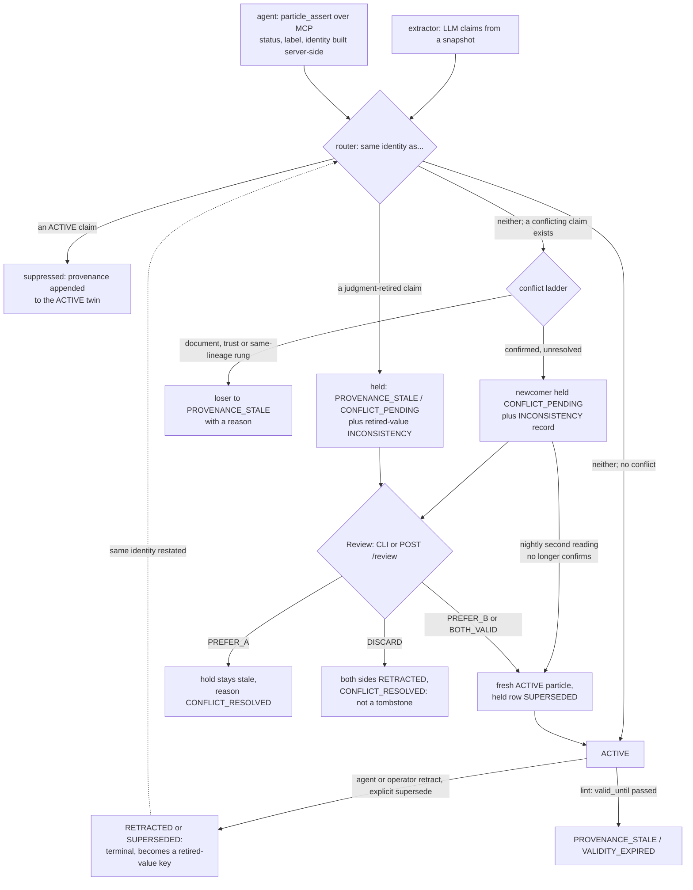

## 1. Executive Summary

Particles is a single-operator belief store for agents: sources go into an
append-only corpus, an LLM extracts claim-granular *particles* from them, and
agents assert, supersede or retract their own particles over MCP. A particle is
never edited. It changes status, and recall reads only the `ACTIVE` ones,
ranked by a confidence that trust, recency and use adjust at read time.

What is notable is how contradiction and correction are handled. A claim that
contradicts a stored one is kept, quarantined, behind an `INCONSISTENCY` record
until a person rules on it. A claim whose exact text was retracted or
superseded by a judgment is held the same way when a source says it again.
The trust-, status- and identity-bearing fields of an agent's write are built
by the server, never taken from the call.

What is weak is the boundary between projects and between callers. The project
observer is off unless the MCP server is launched bound to a directory, and
every scoped tool takes an `all_projects` argument that lifts it. With the
default `dev-key`, a loopback HTTP engine accepts operator mutations and
review resolutions with no credential, while comments beside those routes say
it never does.

The engine is one of three repositories. It pins
`linkedparticles-core==1.172.0` (`pyproject.toml:72`), which ships the schema,
the status table, the scoring formulas and the extractor into the same
`particles` import package; this report reads it at
[`16543c081fd59b0e37481527728f48ac9d90d5d6`](https://github.com/LinkedParticles/particles-core-py/commit/16543c081fd59b0e37481527728f48ac9d90d5d6),
tag `v1.172.0`, and cites it as *core*. The specification lives in
[particles-standard](https://github.com/LinkedParticles/particles-standard),
read at
[`bf3528f48b32f1103366b3b33eba222facf5e08c`](https://github.com/LinkedParticles/particles-standard/commit/bf3528f48b32f1103366b3b33eba222facf5e08c).
The public history is an export: one squashed commit per release, starting at
version 1.130.0, stamped *"from the development upstream at export time"*
(`pyproject.toml:17-18`).

Five marks: `tombstone`, `trust_state`, `audit_log`, `human_review` and
`negative_eval`. Section 9 names the two withheld, `bitemporal` and
`scope_enforced`.

## 2. Mental Model

A particle becomes a belief when it is written `ACTIVE`. Two producers do
that. Extraction reads a deposited corpus snapshot with an LLM and proposes
claims; an agent calls `particle_assert` with one sentence, a subject list, a
self-reported confidence and an excerpt that is deposited as the claim's
source. Both go through the same router before anything is written.

**Every candidate is routed in a fixed order** (`particles/ingest/routing.py:96-107`).
An exact twin of an `ACTIVE` claim is suppressed into it, with the new source
appended as provenance. Otherwise a twin of a claim retired by judgment sends
the candidate to a hold. Otherwise a conflicting `ACTIVE` claim sends it to the
conflict ladder. Otherwise it is inserted `ACTIVE`. Identity is the normalised
text, the resolved subject set and the stance holder (core
`particles/core/duplicate_key.py:58-92`).

**The ladder can resolve a conflict without a person, or hold it.** Rungs for a
superseding document, a source-trust differential and a strictly newer claim
from the same source lineage demote the loser to `PROVENANCE_STALE` with a
reason. A confirmed contradiction they do not resolve is written as an
`INCONSISTENCY` record naming both sides, and the newcomer is stored in full,
born `PROVENANCE_STALE` with reason `CONFLICT_PENDING`. Agent writes run the
ladder fail-closed, so an unverifiable contradiction is held too
(`particles/operations/agent_write.py:327-330`).

**A belief stops being one by status, never by edit.** `SUPERSEDED` and
`RETRACTED` are terminal except for one reversible edge, un-merging an
automatic duplicate merge (core `particles/core/status.py:71-108`).
`PROVENANCE_STALE` covers expiry of a `valid_until`, a missing source, a
retracted dependency and the demotions above. Review resolves a hold:
`PREFER_A` keeps the incumbent; `PREFER_B` and `BOTH_VALID` mint a fresh
`ACTIVE` particle from a quarantined side; `DISCARD` retracts both; `DEFER`
leaves it open.

**The tombstone is the retired row itself.** A retraction or an explicit
supersession is a judgment, so the retired particle stays in the store and its
identity becomes a key the router consults. When a source restates it, the
candidate is held behind an `INCONSISTENCY` record marked as a retired-value
record, and only Review lifts it (`particles/ingest/pipeline.py:2288-2330`).

## 3. Architecture

The engine is a library with four surfaces over it: a Typer CLI, a FastAPI
server (`particles engine serve`), a stdio MCP server, and the Claude Code
hooks (`ARCHITECTURE.md`). Every surface reaches the operations through one
`Backend` seam, local in-process or HTTP to a remote engine, so a laptop
agent can write into a shared engine
(`particles/mcp/tools/write.py:9-14`).

**Persistence is SQLAlchemy over SQLite by default, Postgres by URL**
(`particles/db.py`). The particle store, subject store, trust store, relation
graph and operator event log are tables in one database per store handle,
migrated by alembic. The corpus is a content-addressed blob store
on disk plus entry and snapshot rows. The service is declared single-writer,
and a cross-process file lock serialises SQLite writers.

**Retrieval loads every `ACTIVE` embedding on each query.** The loader selects
every `ACTIVE` row with an embedding, deserialises the JSON vector, skips
vectors from a different embedding model, and scores in NumPy
(`particles/store/particle_store.py:1260-1302`). There is no vector index.
Embeddings come from a local `sentence_transformers` model in core; extraction,
the second reading, the natural-language answer and consolidation call the
Anthropic API.

**Background work is a nightly consolidation cycle** run from cron or the
resident daemon, and each run is recorded as a `CONSOLIDATION_RUN` event
(`particles/operations/consolidation.py:6-30`). Its passes are extract
catch-up, a reconcile sweep, a contradiction census with an LLM second
reading, disclosure records, a curation queue, utility mining and a
`MEMORY.md` projection.

### Deployment and ergonomics

`pip install linkedparticles` brings both distributions; `particles db init`
creates a SQLite store and nothing else needs to run for recall. An
`ANTHROPIC_API_KEY` is required to extract, to answer a question in prose and
to run the census; deposit, agent assertion, the digest and structural queries
make no model call. The store is not hand-repairable as text, but `particles
events`, `lint`, `review`, `particle show`, exporters to Obsidian, Logseq and
JSONL, and an `--as-of` lens make it inspectable. A container image and a chart
live under `deploy/`.

## 4. Essential Implementation Paths

**Agent write.** `particle_assert` (`particles/mcp/tools/write.py:87-142`)
checks the store against `mcp.write.enabled_stores`, default empty, and calls
the backend. `assert_belief` (`particles/operations/agent_write.py:441-503`)
constructs the particle in `_construct_and_insert` (`:185-331`). That applies a
granularity gate on length and sentence count, resolves subjects, and deposits
the excerpt as a `CONVERSATION` entry tagged with the server-bound project key
(`:126-182`). Confidence is clamped to `max_asserted_confidence` and labelled
`AGENT_ASSERTED`, and `asserted_by` is the configured identity. It then calls
`reconcile_and_insert(..., fail_closed=True)` and records `PARTICLE_ASSERTED`.

**Routing and the hold.** `reconcile_and_insert`
(`particles/ingest/pipeline.py:1737`) builds the duplicate index and the
retired-value index for the one candidate (`:1805-1818`) and routes it. The
extraction pass does the same per snapshot (`:1161-1169`, `:1282-1300`).
`_hold_retired_reassertion` (`:2288-2330`) appends the observation to an open
hold or writes the quarantined candidate and a retired-value record.

**Supersede and retract.** `supersede_belief` (`agent_write.py:506-618`) loads
the target through `_load_mutable_target` (`:390-438`), which refuses a
non-`ACTIVE` target, a `HUMAN_REVIEW`-calibrated one, and another principal's
unless `allow_cross_asserter`; it retires the predecessor with
`EXPLICIT_SUPERSESSION`, asserts the successor with `supersedes` set, and
records `PARTICLE_SUPERSEDED`. `retract_belief` (`:690-732`) does the same with
`EXPLICIT_RETRACTION`.

**Status changes.** `update_particle_status`
(`particles/store/particle_store.py:546-615`) validates against the core table,
enforces the reason gate on the one reversible edge, stamps a write-once
`retired_at` on leaving `ACTIVE`, and drops a retracted particle from its
co-evidential groups.

**Query.** `query` in `particles/operations/query/main.py` loads candidates
(`:204-208`), applies the document-meta, non-asserted, stance, tag, structured
claim and recency filters, then the observer (`:312-325`), then scores. The
MCP `query` tool marks each hit contested when an open `INCONSISTENCY` names it.

**Session start.** The `SessionStart` hook and the `particles://digest/{store}`
resource reach `build_digest_located` (`particles/operations/digest.py:63-145`):
every `ACTIVE` particle, an optional observer, ranked, capped by
`digest_max_beliefs`, contested ones badged. No model call.

**Review.** `particles review` (`particles/api/cli/review.py:22-140`) and
`POST /review/{id}` (`particles/api/app.py:1535-1565`) call `resolve` in
`particles/operations/review.py`, which promotes, demotes or retracts, writes
a trust statement for a `PREFER` ruling, closes the wrapper and records
`REVIEW_RESOLVED`.

**Hard delete.** `delete_entry` (`particles/operations/corpus_delete.py:152-200`)
deletes the entry and every particle whose only source it was, strips its refs
from the rest, and records `CORPUS_ENTRY_DELETED` with counts only.

## 5. Memory Data Model

`ParticleRow` (`particles/store/particle_store.py:89-220`) carries `content`,
a confidence value with variance and calibration source, `uncertainty_nature`
(`EPISTEMIC` or `ALEATORY`), `asserted_by`, `asserted_at`, `status` and
`status_reason`. Beside those sit `particle_type`, `assertion_modality`,
`valid_until`, `supersedes`, `retired_at`, `born_retired` and
`content_norm_hash`. Provenance refs, the extractor reference and provider
model, the embedding and its model id, subject ids, properties, tags and an
optional structured claim complete the row.

**Provenance is mandatory.** An agent assertion with neither an excerpt nor an
existing corpus entry is refused (`agent_write.py:167-170`), and a
`ProvenanceEdgeRow` indexes particle to corpus entry and snapshot. The corpus
keeps every snapshot of a source, so a claim points at the bytes it came from.

**Time is one axis with an expiry on it.** `asserted_at` and `retired_at` are
transaction time, and the `--as-of` lens evaluates what the store believed at
an instant (`particles/operations/query/as_of.py`). `valid_until` is a world
boundary an extractor may emit; lint retires the claim when it passes, and the
as-of lens dates that retirement from `valid_until` (`as_of.py:180`). There is
no validity start.

**Scope is not on the particle.** A project key is a `project:` tag on a corpus
entry, and a belief's observer scope is derived at read time from the entries
its provenance names, through co-evidential groups and derivation premises
(core `particles/core/observer_scope.py:1-24`;
`particles/store/observer_scope_join.py:1-35`). An entry with no key is global
unless a harness tagged it, in which case it is unattributed and in view for
no project. The agent cannot name the key: `_scope_tags` drops any caller
`project:` tag and adds the server's own, and a bound agent may cite only its
own project's entries (`agent_write.py:150-182`).

**Principals.** `asserted_by` is the configured `mcp:claude-code` for every
agent on a server, `mcp:memory-compat` for the facade, the extractor for
extracted claims and `curation.operator_identity` for operator corrections.
`SECURITY.md` states that there is no per-caller isolation on one engine.

## 6. Retrieval Mechanics

Retrieval is dense cosine over the candidate set, after filters that only
narrow it. Hits are ranked by an effective confidence: stored confidence
times source trust and an extractor trust weight, with a recency factor from
the source's publication date and a utility lens mined from tool use. Trust is
the operator's present policy even under `--as-of`. `top_k` defaults to 40 on
the MCP tool, and an LLM writes the answer; the README describes a gate that
admits only citation ids from the retrieved set.

The filters that withhold rather than rank are status (`ACTIVE` only),
document-meta and non-asserted prose, stance particles and, when an observer is
set, project scope. A contradiction is disclosed, not hidden: both sides of an
open `INCONSISTENCY` stay `ACTIVE` when the conflict was disclosed by the
census, and each hit carries a `contested` id.

The structural mode answers predicate, comparison and aggregate questions over
structured claims with no embedding and no model call. The memory-server facade
answers `search_nodes` with a case-insensitive substring match over an
in-memory projection of `ACTIVE` particles.

**Failure modes.** Every query reads every `ACTIVE` embedding, so latency and
memory scale with the store. A vector from another embedding model is skipped
with a warning, so a model change makes old claims unsearchable until
re-embedded. The digest injects up to `digest_max_beliefs` lines ranked by
effective confidence, 200 by default (core `particles/config.py:2509`),
regardless of the session's question.

## 7. Write Mechanics

Extraction writes are batch: a session's transcript and memory files are
harvested into the corpus at `SessionEnd`, and extraction runs inline only when
`extract_inline` is set, otherwise in the nightly cycle
(`particles/api/cli/hook.py:355-433`, `:675-701`). A harvested fact is
therefore retrievable after the next cycle by default. Agent assertions are
synchronous and retrievable at once. Each is one transaction that embeds the
claim and scans every `ACTIVE` embedding for a conflict candidate
(`particles/ingest/pipeline.py:1737-1790`); whether a model call follows a
similar pair depends on the conflict probe, which this reading did not trace.

**Deduplication is exact, never by similarity.** The module states the reason:
below identity, cosine did not order duplicate-likelihood, and its worst false
positive sat at 0.9951 (`particles/ingest/duplicate_suppression.py:28-33`). A
duplicate becomes another provenance ref on the existing claim.

**Agent-generated facts are labelled and capped.** Calibration source
`AGENT_ASSERTED`, confidence at most 0.90, an `AUTHOR` trust statement seeded
at 0.8 and never raised over an operator's demotion
(`agent_write.py:98-123`; core `particles/config.py:2464-2484`). A compound
assertion is refused by a size gate.

**Hostile input** is fenced, not filtered: deposited text is wrapped in a
per-call nonce fence before every model call and the model is given no tools
(`README.md`, *Security posture*). Secrets in a deposit are stored verbatim
(`SECURITY.md`).

### Operational cost

- Agent write: synchronous, one transaction, one embedding and a scan of every
  `ACTIVE` embedding; any model call depends on the conflict probe.
- Extraction: one or more LLM calls per snapshot chunk, deferred to the cycle
  by default; lag until the next cycle.
- Background: the nightly cycle probes a delta window from the previous run's
  start, with capped census probes and a spend budget; it does not re-read the
  whole store each night.
- Read: the digest is bounded by `digest_max_beliefs` and rendered fresh each
  session start; `query` loads the whole `ACTIVE` set per call and may make one
  answer call.

## 8. Agent Integration

`particles mcp serve` registers sixteen read tools always and eight write
tools only when a store is write-enabled: `particle_assert`,
`particle_supersede`, `particle_retract`, `deposit_text`, `link_add`,
`link_remove`, `particle_tag`, `particle_untag`
(`particles/mcp/server.py:90-121`, `:147-167`). The digest is an MCP resource,
with a second template that names a project. `particles init claude-code`
installs `SessionStart` and `SessionEnd` hooks, enables a `memory` store for
writes, and leaves the observer at the default `store`, which is store-wide
(`particles/api/cli/_claude_code.py:214-225`; core
`particles/config.py:2608`).

A second MCP server reproduces the reference memory server's nine tools over
the same store, with deletes mapped to retractions and an entity deletion to a
tombstone particle tagged on the subject (`particles/mcp/memory_compat/`).

The bundled skill tells the agent that ruling on a contradiction *"is the
operator's decision, not yours"* (`particles/skills/keeping-it-clean.md:23-28`).
The tool surface agrees: no review verb is registered.

## 9. Reliability, Safety, and Trust

**The agent cannot author its own standing.** Status, calibration label,
principal and project key are server-side; confidence is clamped; mutation is
own-beliefs-only, and an operator correction labelled `HUMAN_REVIEW` is out of
the agent's reach (`agent_write.py:390-438`).

**The transition table is enforced at one seam.** Every status write passes
`validate_transition` in `update_particle_status`, and the one reversible edge
is gated on its reason there too (`particle_store.py:546-615`).

**A loopback engine is open to operator writes by default.** `_verify_key`
returns without checking credentials when the key is `dev-key` and the peer is
loopback (`particles/api/auth.py:131-163`), and `tests/test_auth.py:52` pins
that. The operator supersede and retract routes and `POST /review` depend on
that check alone, beside comments saying they *"never ride the dev-key loopback
skip"* (`particles/api/app.py:565-570`, `:2565-2577`; routes at `:2605-2667`).
Read, not run.

**Corpus delete outranks the tombstone.** A hard delete removes every particle
sourced only from the entry, retracted twins included
(`particles/operations/corpus_delete.py:7-11`, `:176`), so re-depositing the
document re-mints what had been retracted.

**Links cross the project lens.** `link_add` writes a co-evidential relation
between any two ids with no ownership or observer check
(`particles/api/client/local.py:673-689`). A belief's attesting entries include
those of every particle it is co-evidential with
(`particles/store/observer_scope_join.py:15-18`), so by inference a bound agent
can pull another project's belief into its own view. Read, not run.

**Code and specification.** In the standard's
`docs/spec/technical-specification.md`, the §6.6 table says an agent revision
sets no reason on the superseded particle (`:403`). Its §6.2 field list (`:76`)
and the code (`agent_write.py:571-573`) set `EXPLICIT_SUPERSESSION`; the code
follows §6.2, and the tombstone depends on it. Core's table admits
`INCONSISTENCY → PROVENANCE_STALE` (`particles/core/status.py:84`), an edge the
§6.6 table does not list for a record, and §6.6 calls an added transition
non-conformant (`:397`); `resolve` retracts the record instead
(`particles/operations/review.py:241-243`). On the event log (`:2088-2099`) and
the retired-value rule (`:1016-1056`) code and specification agree.

Capability marks:

- `tombstone` — awarded. A judgment-retired identity holds every restatement
  for review, on both write paths, by default. The test module's docstring
  takes its test list from the Agent Memory Atlas and names
  [Verel](../verel/)'s red-team sequence (`tests/test_retired_value_quarantine.py:5-24`, `:207-209`).
  It is exact-text only, and `DISCARD` deliberately does not arm it
  (core `particles/core/conflict_review.py:205-216`).
- `trust_state` — awarded. `CONFLICT_PENDING`, `INCONSISTENCY`, `RETRACTED`
  and `SUPERSEDED` are excluded by the query loader, the digest and the facade.
- `audit_log` — awarded. `operator_events` is append-only by convention and
  written in the mutation's transaction.
- `human_review` — awarded. The hold waits for `review`, which no agent tool
  reaches. Two limits stand: `reviewer_id` is a supplied string, and a
  general shell on the same host can run the CLI or call the open loopback
  route.
- `negative_eval` — awarded; section 10.
- `bitemporal` — withheld. `valid_until` is an expiry that lint turns into a
  retirement, with no validity start, and the README calls `--as-of` the
  assertion-time lens, not world time.
- `scope_enforced` — withheld. The key and the predicate are real, and the read
  lens and the write gate share them. But the observer is unset unless the
  server is launched with `--project-observer cwd`, and the hooks read
  store-wide by default. `query`, `particles_list`, `particle_search` and
  `graph_view` each take `all_projects=True` from the caller
  (`particles/mcp/observer.py:39-41`), and the digest template accepts any
  project name. The subjects, lint, events and facade tools carry no observer.

## 10. Tests, Evals, and Benchmarks

I read the tests at the pin and ran none of them.

**Negative retrieval.** `tests/test_query_negative_retrieval.py` drives the
real `query` with only the embedding model and the answer generator mocked,
and gives every particle the same embedding so only filters can decide.
`test_query_excludes_retracted_particles` asserts the retracted id absent and
`ids == [kept.id]` (`:107-124`); the superseded and `INCONSISTENCY` cases have
the same shape (`:127-173`); the as-of case asserts the later claim absent
then and present without the instant (`:176-199`). The observer case asserts
project A's view holds its own and global beliefs and excludes the other
project's, an unattributed harvest and a cross-project derivation, then that
the unscoped query returns all six (`:274-290`).

**Tombstone.** `tests/test_retired_value_quarantine.py` covers re-assertion of
a retracted claim, the supersede-then-restate sequence, non-judgment
retirements not firing, the `ACTIVE` twin winning, idempotence, normalisation
variants, the off switch, both review outcomes and the trust cascade leaving
the hold to a person (`:128-497`).

**Conformance.** Core ships a self-certification runner over the standard's
`artifacts/conformance/profile.yaml`: numeric vectors for effective confidence,
recency, calibration and noisy-or merging, and categorical vectors for the
conflict-ladder ordering, the context fingerprint and cascade gating (core
`particles/conformance/runner.py:5-34`). Status transitions and the
retired-value rule are covered by unit tests, not by vectors.

**LongMemEval.** The README reports Recall@40 0.969 and end-to-end QA 0.804,
against a full-context ceiling of 0.878 and a no-memory floor of 0.047. I
recomputed each from the committed per-question records with a standalone
script. The QA figure is the mean of three runs scoring 121, 121 and 120
correct in 150 (`docs/benchmarks/longmemeval-s150-v2-p2-topk40-subjects-names*-2026-09-20.json`).
Recall is 0.9685 over 143 non-abstention questions. The ceiling is 130 correct
in 148 and the floor 7 in 150, both from
`longmemeval-s150-v2-rejudge-p2-2026-09-19.json`, a run two days before the
lead row's. The benchmarks page records the arms where Particles loses.

**No paper.** The standard carries a whitepaper and a technical specification
as Markdown; no arXiv, DOI or `CITATION.cff` is in the engine or core.

**Missing.** No test exercises an operator route under `dev-key` from loopback
as a property to forbid; no case asserts that a `DISCARD`ed value re-mints or
is held; no negative case covers the MCP tools with `all_projects`.

## 11. For Your Own Build

### Steal

- **Make the tombstone the retired row.** Key retirement-by-judgment on the
  same identity the deduplicator uses, consult it on every write path before
  the conflict logic, and hold a match for review instead of refusing it, so
  the source's restatement is still on record.
- **Route every candidate through one ordered decision**: duplicate of a live
  claim, twin of a retired one, conflict, insert. Each later rung can then
  assume the earlier ones did not fire.
- **Build trust-bearing fields on the server.** Status, calibration label,
  principal and scope key never come from the agent's arguments.
- **Say which retirements are judgments.** A list that excludes source
  withdrawal, reindex, merge and expiry keeps the tombstone from freezing
  claims that were never judged wrong.
- **Publish per-question records under every headline number.**

### Avoid

- **A scope argument the caller can lift.** An observer that is opt-in at
  launch and dropped by a boolean on each tool is a convenience filter.
- **Security comments the code does not enforce.** A guard named in a comment
  and absent from the dependency is a finding waiting for a reader.
- **Leaving the strongest rejection out of the tombstone.** If "neither side is
  worth keeping" does not hold the value, say so where the reviewer chooses it.

### Fit

This suits one operator who wants claims with provenance, contradictions put in
front of them rather than resolved by recency, and a record of every
correction, and who will run a nightly cycle on an Anthropic key. It is not a
multi-tenant memory: `SECURITY.md` rules that out, and the project scope is a
lens, not a wall. At a large store the brute-force cosine will hurt first.
A team that wants a small memory for coding sessions is adopting a
three-repository standard, a specification and a curation discipline to get
it.

## 12. Open Questions

- Does a re-added observation through the memory-server facade, after a
  `delete_observations`, come back held rather than visible, and does the
  facade report that to its client?
- How large do stores get in use before the per-query load of every `ACTIVE`
  embedding dominates latency?
- Is the dev-key operator surface intended for loopback, with the comments
  stale, or is a second gate missing?
- How often does the nightly second reading withdraw a record, releasing a held
  claim without a person?

## Appendix: File Index

- **Schema and status:** `particles/store/particle_store.py`,
  `particles/store/event_store.py`, `particles/store/observer_scope_join.py`;
  core `particles/core/status.py`, `particles/core/duplicate_key.py`,
  `particles/core/observer_scope.py`, `particles/core/conflict_review.py`,
  `particles/config.py`.
- **Write path:** `particles/operations/agent_write.py`,
  `particles/ingest/pipeline.py`, `particles/ingest/routing.py`,
  `particles/ingest/duplicate_suppression.py`, `particles/corpus/deposit.py`.
- **Correction:** `particles/operations/review.py`,
  `particles/operations/_quarantine.py`,
  `particles/operations/contradiction_disclosure.py`,
  `particles/operations/corpus_delete.py`,
  `particles/operations/lint/staleness.py`.
- **Retrieval and context:** `particles/operations/query/main.py`,
  `particles/operations/query/observer_scope.py`,
  `particles/operations/query/as_of.py`, `particles/operations/digest.py`.
- **Surfaces:** `particles/mcp/server.py`, `particles/mcp/tools/`,
  `particles/mcp/observer.py`, `particles/mcp/resources.py`,
  `particles/mcp/memory_compat/`, `particles/api/app.py`,
  `particles/api/auth.py`, `particles/api/cli/review.py`,
  `particles/api/cli/hook.py`, `particles/api/cli/_claude_code.py`.
- **Background:** `particles/operations/consolidation.py`.
- **Tests and benchmarks:** `tests/test_query_negative_retrieval.py`,
  `tests/test_retired_value_quarantine.py`, `tests/test_auth.py`,
  `docs/benchmarks.md`, `docs/benchmarks/*.json`; core
  `particles/conformance/runner.py`, `artifacts/conformance/profile.yaml`.

### Recorded searches

Checked against the engine at the pinned revision and core at `v1.172.0`, with
`git grep` on tracked files; `git ls-files -i -c --exclude-standard` lists no
committed-but-ignored file in either.

- `git grep -n -i -E 'arxiv|zenodo|bibtex|@article|@misc|doi\.org'` in engine and core — only a DOI URI template in the subject-authority registry; no `CITATION.cff`.
- `git grep -nE 'delete\((OperatorEvent|operator_event)|update\((OperatorEvent)|operator_events' -- particles alembic` — the table definitions and migration `017`; no update or delete.
- `git grep -n -i 'create trigger\|before update\|before delete' -- alembic particles` — no match.
- `grep -c record_event particles/operations/lint/staleness.py` — 0.
- `git grep -n 'all_projects\|observer_for\|bound_project()' -- particles/mcp` — `query`, `particles_list`, `particle_search` and `graph_view` take `all_projects`; the write tools stamp `bound_project()`.
- `git grep -nE 'observer|project' -- particles/mcp/tools/subjects.py particles/mcp/tools/lint.py particles/mcp/tools/events.py particles/mcp/tools/links_suggest.py particles/mcp/memory_compat/` — no observer on those reads.
- `git grep -n 'review_resolve(\|operations.review import' -- particles` — the CLI, the HTTP app and the curation session; no MCP tool.
- `git grep -n 'promote_quarantined' -- particles` — `review.py`, `cascade.py`, `contradiction_disclosure.py`.
- `git grep -n -i 'dev_key\|_DEV_KEY\|"dev-key"' -- particles` — `api/auth.py` and the `engine` status line only; no second gate on operator routes.
- `git grep -n -i 'valid_from\|valid_at\|valid_time' -- particles alembic` in engine and core — no match.
- `git grep -n -i 'tombstone' -- particles` — the facade's entity tombstones and a graph legend.
- `git ls-files | grep -iE '(AGENTS|CLAUDE)\.md'` in engine and core — none committed.

## History

**2026-10-04** — [`a2533495cf9f2072bde1167467f080494d9ef954`](https://github.com/LinkedParticles/particles-engine-py/commit/a2533495cf9f2072bde1167467f080494d9ef954) — first reading, at the head of `main`, release 1.172.0. Five marks; section 9 names the two withheld. Core read at [`16543c081fd59b0e37481527728f48ac9d90d5d6`](https://github.com/LinkedParticles/particles-core-py/commit/16543c081fd59b0e37481527728f48ac9d90d5d6) and the specification at [`bf3528f48b32f1103366b3b33eba222facf5e08c`](https://github.com/LinkedParticles/particles-standard/commit/bf3528f48b32f1103366b3b33eba222facf5e08c). Screened before reading: two auto-run surfaces (`hooks/`, mkdocs build hooks; `server.json`, an MCP registry manifest), two build-time execution points, two dependency files inside the cooldown and two unpinned. Core: one execution point, one inside the cooldown from its depth-1 clone, one unpinned. No agent instruction file is committed. The LongMemEval figures were recomputed from committed JSON with a standalone script; nothing from either tree was installed, built or run.
