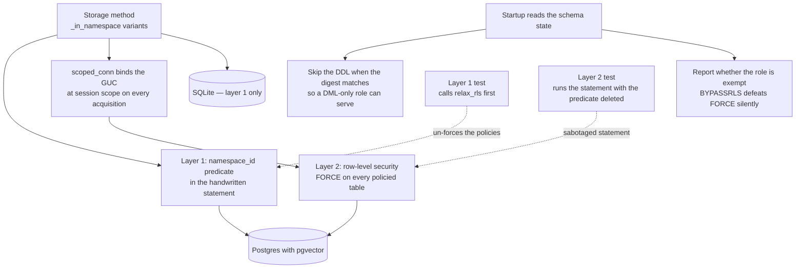

## 1. Executive Summary

Pensyve is an Apache-2.0 memory runtime for agents — 113,429 lines of Rust with
1,393 test functions, 752 commits since March 2026, SQLite or Postgres behind one
storage trait, reached through an MCP server, a gateway, a CLI and bindings for
Python, Go, TypeScript and WebAssembly.

Three marks, and the scope one is the strongest case this atlas has read.

Most systems here enforce a tenant boundary with a predicate in a query builder
and stop. Pensyve has that — `namespace_id = $n` in every handwritten statement,
which the code calls *"the load-bearing layer in every deployment"* — and behind
it, Postgres row-level security as an explicit backstop *"for a query that forgets
layer 1 — which is exactly the bug PR #218 found"*.

What makes it worth reading is that the module documents two separate ways the
backstop had been present and doing nothing.

The first is a bug worth memorising. The connection helper set the scoping
variable with `set_config('pensyve.namespace_id', $1, true)` as a standalone
statement. The `true` means transaction-local; a standalone statement is its own
implicit transaction; so Postgres discarded the setting before the query it was
meant to scope ever ran, and *"every policy compared against NULL and matched
nothing."* Row-level security was enabled, the policies were correct, and the
whole layer was inert.

The second: Postgres exempts a table's owner from its own policies, and the
application connected as the schema owner — so `ENABLE ROW LEVEL SECURITY` alone
changed nothing until `FORCE` was moved into the schema that every startup
applies.

And the test that proves the fix is the best of its kind in this corpus. It takes
the production delete statement, removes the namespace predicate, and runs it
across namespaces:

```rust
// `delete_memory_by_id_in_namespace`'s statement, minus its namespace
// predicate. The real one reads:
//     DELETE FROM episodic_memories WHERE id = $1 AND namespace_id = $2
const SABOTAGED_DELETE: &str = "DELETE FROM episodic_memories WHERE id = $1";
```

Seed a memory in namespace A, open a connection scoped to namespace B, run that,
and assert A's row is still there. The assertion is about the backstop alone,
because the primary defence has been deliberately deleted for the duration of the
test.

## 2. Mental Model

A namespace owns memories. Four kinds live under it — episodic, semantic,
procedural and observation — each with a salience fixed at encoding, a storage
strength that only ever increases, an event time held apart from the encoding
timestamp, and the supersession pair that retires it.

Scope is two things at once, and the project is careful to keep them separate in
its own head. Layer 1 is the predicate a human wrote into each statement. Layer 2
is a policy the database applies whether or not the human remembered. They are
tested apart, and the reason is stated: a cross-namespace test that runs with
both layers live *"passes on the policies alone and proves nothing about the
`namespace_id` predicate it was written for"*.

That predicate is not redundant, and the module says exactly when it is the only
thing standing: on SQLite, which has no policies, and on a Postgres whose role
carries `BYPASSRLS` — which `FORCE` cannot remove.

## 3. Architecture



## 4. Essential Implementation Paths

- **Bind the scope.** `scoped_conn` sets the namespace GUC at session scope on
  every acquisition, including the unscoped path, after the transaction-local
  form was found to evaporate before the query ran. Two tests gate both halves:
  the setting must survive to the next statement, and must *not* survive into the
  next checkout.
- **Force the policies.** `postgres_schema.sql` carries the `FORCE ROW LEVEL
  SECURITY` statements, so every startup enforces rather than depending on an
  operator having run a separate file; a test pins that the schema forces every
  policied table *and only those*.
- **Filter the read.** Listings bind `WHERE namespace_id = $1 AND ($2 OR
  superseded_by IS NULL)`; retrieval joins add `AND memory.superseded_by IS NULL
  AND memory.invalid_at IS NULL` (`storage/postgres.rs:837-1000`).
- **Start unprivileged.** Startup reads `pensyve_schema_state` and skips the DDL
  batch when the applied digest matches this build, so the serving role needs only
  DML grants — because an owner is exempt until `FORCE`, and a managed-Postgres
  owner usually also carries `BYPASSRLS`, which `FORCE` cannot remove.

## 5. Memory Data Model

Four memory kinds share a common spine. The fields that matter here:

| Field | Note |
|---|---|
| `superseded_by` | the successor's id, set when a memory is retired |
| `invalid_at` | when it stopped being valid because it was superseded |
| `event_time` | *"When the described event occurred (may differ from encoding timestamp)"* |
| `salience` | fixed at encoding, modulates decay |
| `storage_strength` | *"monotonically increases, never decays"* |
| `agent_id`, `user_id` | multi-tenant scope, nullable for legacy rows |

`bitemporal` is withheld, and the reason is narrow. `event_time` is a genuine
validity timestamp held apart from the encoding time — the docstring says so —
but no query filters on it and nothing reads the store as of a past moment. The
axis is recorded and never asked about, which is one field short of the mark
rather than a missing idea.

## 6. Retrieval Mechanics

A retrieval engine fuses vector, lexical and graph signals with reciprocal rank
fusion, with a reranker, an activation model and decay over salience and storage
strength.

The detail worth taking is where the supersession filter sits. It is a bound
parameter *inside* the statement — `($2 OR superseded_by IS NULL)` — not a loop
over the results. Two consequences follow. A retired memory never occupies one of
the `limit` slots the database returns, so a caller asking for ten live memories
gets ten. And the "include superseded" escape cannot be forgotten by a new read
method that has no post-processing stage, because there is no post-processing
stage to forget.

This atlas read [a system with the opposite placement](../beever-atlas/) in the
same session, where the filter had to run in application code because the store
could not express an is-null filter, and the one read method with no loop never
got it. Pensyve's store can express it, and the difference in outcome is exactly
the difference in placement.

## 7. Write Mechanics

Observation, extraction and consolidation pipelines feed the store, with a
surprise signal and a salience estimate deciding what is worth keeping, and a
classifier routing it to a memory kind.

Correction is supersession rather than deletion: the prior memory keeps its row
and gains a pointer to its successor plus the time it stopped being valid. Nothing
is keyed on the retired content, so `tombstone` is withheld — the same sentence
observed again is a new memory.

## 8. Agent Integration

An MCP server with a tool layer, a gateway exposing REST, a CLI, and four
language bindings over the same core. The tool layer is also where the activity
feed is written, and that is where `audit_log` fails.

`activity_events` is a real table — id, event type, namespace, a JSON detail and
a timestamp, indexed by namespace and date — and the insert is append-only. But
every call site is in the MCP tool server, written as `let _ = state.storage
.log_activity(...)`, so the result is discarded and a failed write is silent; the
row is written outside the transaction that performed the mutation; and the event
types mix mutations with retrievals — `recall` sits beside `forget` and
`observe`. A mutation that reaches storage by any path other than an MCP tool
leaves no row at all. That is an activity feed for a UI rather than an account of
what changed, which is the distinction the mark draws.

## 9. Reliability, Safety, and Trust

The scope work is the reason to read this repository, and its methodology
generalises past Postgres.

**Two layers, tested apart.** The fixture provisions as a `NOSUPERUSER
NOBYPASSRLS` role so both layers are live — *"that is the deployed shape"* — and a
test that means to gate layer 1 calls `relax_rls` first to un-force the policies.
Without that step the test would pass on the backstop and say nothing about the
predicate it was written for. Most projects that build defence in depth never
notice that it makes each layer's test unfalsifiable; this one built the switch
to turn the other layer off.

**The failure modes are named.** Two ways RLS was present and inert, one caught by
a PR and one by conversion work, both with the mechanism spelled out — a
transaction-local GUC set outside a transaction, and an owner's exemption from its
own policies. Either is the kind of thing that passes review because the
configuration looks right.

**The residual risk is announced at startup.** `FORCE` cannot remove `BYPASSRLS`,
so a role that carries it defeats layer 2 entirely — and, in the module's words,
*"makes FORCE enforce nothing with no other symptom."* The answer was to make the
symptom: startup reports whether the role is exempt. A system that tells the
operator when its own backstop is disabled is doing something almost nothing here
does.

**The checklist was retired when it emptied.** A test named
`enforced_rls_fails_closed_for_unscoped_methods` used to assert that three
unscoped methods read and deleted nothing under enforcement *while still
reporting success*. As each method gained a scoped variant the assertion flipped
and moved into that method's own test, and when the list was empty the checklist
was deleted. A gate that shrinks to nothing and is then removed, rather than
lingering as a passing test over an empty set, is good hygiene.

## 10. Tests, Evals, and Benchmarks

1,393 test functions; nothing was run here. The live-Postgres suite skips with an
explicit message when `PENSYVE_TEST_DATABASE_URL` is unset so the ordinary
`cargo test` stays green without a database, and CI sets it. Every test in that
file provisions its own database and unprivileged role and drops both, so nothing
is written to the database the URL names — which is the right shape for a suite
that must run as a superuser to test what a non-superuser cannot do.

There is a `benchmarks` directory, a `pensyve-benchmarks` crate, a `loadtest`
crate and a `results` directory, which I did not read in depth; no claim in the
README was checked against them in this reading.

## 11. For Your Own Build

- **Sabotage the statement to test the backstop.** Copying a production query,
  deleting its scope predicate and asserting nothing crosses is the only way to
  learn whether your second layer is load-bearing. A cross-tenant test with both
  layers live passes either way.
- **And disable the backstop to test the predicate.** Defence in depth makes both
  layers' tests unfalsifiable unless you can turn each off. Build the switch with
  the second layer.
- **A transaction-local setting outside a transaction is discarded.**
  `set_config(..., true)` in a standalone statement silently scopes nothing, and
  every policy then compares against NULL and matches nothing — enabled, correct,
  and inert.
- **The owner is exempt from its own policies.** `ENABLE ROW LEVEL SECURITY` does
  nothing for an application connecting as the table owner. `FORCE` fixes that;
  `BYPASSRLS` defeats `FORCE`, and only the role's own attributes will tell you.
- **Announce the condition that disables your safety net.** If a deployment choice
  can make a control inert with no other symptom, the control's job includes
  saying so at startup.
- **Put the status filter in the statement.** A supersession check bound as a
  parameter cannot be forgotten by a new read method and does not spend result
  slots on rows it is about to discard.

## 12. Open Questions

- `event_time` is stored as explicitly distinct from the encoding timestamp and
  no read consults it. Is an as-of query intended, or is the field for display?
- Would moving `log_activity` inside the storage mutation — and not discarding its
  result — be wanted, or is the feed deliberately a tool-layer convenience?
- On SQLite there is one layer by construction. Is that documented for deployers
  choosing a backend, beyond the note in this test module?

## Appendix: File Index

- Scope and its tests: `pensyve-core/src/storage/postgres/live_rls.rs:1-100` (the
  two layers, the three fixed failure modes, and which layer each test gates),
  `:2309-2340` (`rls_alone_blocks_cross_namespace_access` and `SABOTAGED_DELETE`).
- Schema: `pensyve-core/src/storage/postgres_schema.sql` (policies and the `FORCE`
  statements; `activity_events` at 343-351).
- Reads: `pensyve-core/src/storage/postgres.rs:837-1000` (namespace and
  supersession bound together), `pensyve-core/src/storage/sqlite.rs`.
- Types: `pensyve-core/src/types.rs:308-640` (the four memory kinds, with
  `superseded_by` and `invalid_at` on each and `event_time` at 332-334).
- Activity feed: `pensyve-core/src/storage/postgres.rs:5965-6000`,
  `pensyve-mcp-tools/src/server.rs` (the call sites, each `let _ = …`).
- Surrounding: `pensyve-core/src/retrieval/engine.rs`,
  `pensyve-core/src/consolidation/`, `pensyve-core/src/gdpr.rs`,
  `pensyve-core/src/namespace_export.rs`.

**Searches recorded for the negative claims**

```sh
grep -rn "as_of\|point_in_time" pensyve-core/src --include='*.rs'    # 0 — event_time is stored and never queried as of
grep -rn "log_activity(" --include='*.rs' . | grep -v "fn "          # every call site is in the MCP tool server, each `let _ =`
grep -rn "superseded_by IS NULL\|invalid_at IS NULL" pensyve-core/src/storage/*.rs   # bound in the statements, both backends
grep -rn "approver\|approved_by\|reviewed_by" pensyve-core/src --include='*.rs'      # 0 — no approval surface
```

## History

**2026-09-19** — [`9ec26ade242a9360a69dc130356d54311dca1c87`](https://github.com/major7apps/pensyve/commit/9ec26ade242a9360a69dc130356d54311dca1c87) — `trust_state` re-tested at the unchanged pin. Every predicate the record cites is exact, on both backends, and the re-read adds the half that is more interesting than the filter: where the project refuses to apply it. The erasure fixture seeds a superseded episodic row on purpose, with the reason in a doc comment — a GDPR erase *"has to take history, not just current state, so neither predicate may grow a `superseded_by IS NULL` clause — and every read path around the delete filters on supersession somewhere, so such a clause would look natural."* That is a project naming the wrong edit its own convention invites and building the fixture that would fail it. The purge verifier makes the same move from the other side: it reads through `get_all_memories_by_namespace_including_superseded` rather than the plain accessor, because the plain one filters `superseded_by IS NULL` and so *cannot see the rows the test is about* — a check that would otherwise pass by being blind to its own subject. The isolation assertions in the same file carry positive controls of the same character, one of which fails with *"the predicate-free select matched nothing even in the owning namespace, so the cross-namespace assertion above proved nothing"*. Nothing was installed and no suite was run.

**2026-09-17** — [`9ec26ade242a9360a69dc130356d54311dca1c87`](https://github.com/major7apps/pensyve/commit/9ec26ade242a9360a69dc130356d54311dca1c87)
— first reading, at the head of `main`, 752 commits in. Screened with
`scripts/screen_repo.py` first: three auto-run surfaces (a Claude Code plugin
marketplace manifest, a `server.json` MCP manifest and a `smithery.yaml` packaging
manifest), and four dependency manifests changed inside the seven-day cooldown
including `Cargo.lock`. Nothing was installed, built or run — no cargo, no uv, no
Postgres started, and the live-database suite was read rather than executed. Three
marks. `bitemporal` is withheld one field short: `event_time` is documented as
distinct from the encoding timestamp and no query filters on it, so there is no
as-of read. `tombstone` is withheld because supersession keys on the row and
nothing is keyed on the retired content. `audit_log` is withheld on where the
writer sits rather than on an absence — `activity_events` is append-only and
namespace-scoped, and every call site is in the MCP tool server with the result
discarded, outside the mutating transaction, mixing `recall` with `forget`, so a
mutation arriving by another path leaves no row. `human_review` is absent.
