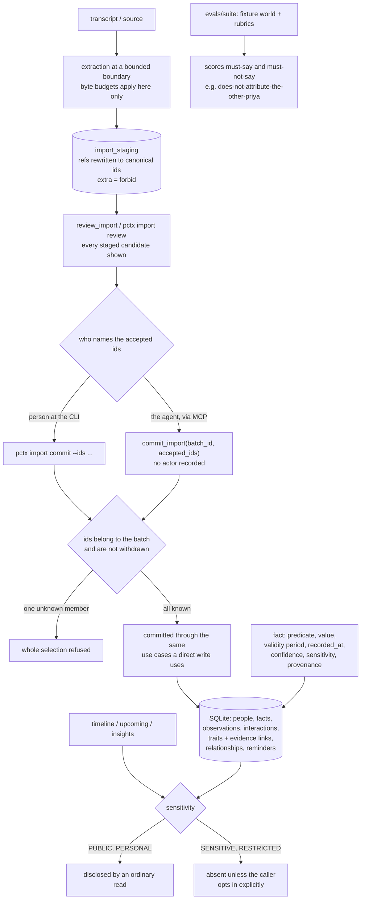

## 1. Executive Summary

people-context is memory about people rather than about code: "who someone is,
how you know them, what you last agreed, and how they like to be talked to",
held in one local SQLite file with "[n]o account, no cloud, no network calls".
MIT, version 1.2.1, 238 commits since 16 July 2026, 33,465 lines of Python in
`src` against 52,271 lines of tests, plus a committed eval suite, an Obsidian
plugin and an OpenClaw plugin.

The subject matter is the first thing to say about it. This is a store of
personal data about third parties who did not consent to being in it, and the
project knows: sensitivity is a first-class field, CLI error paths are
annotated with warnings that a rejected input echoes submitted values "which
may be personal", and a validation error is noted as "not automatically safe to
print". That care shows up as mechanism rather than as a policy document.

**Disclosure is narrow by default and widened on purpose.**
`ORDINARY_SENSITIVITIES` is `(PUBLIC, PERSONAL)`, documented as "[l]evels an
ordinary read may disclose, in the shared order used by every other read path",
with `ALL_SENSITIVITIES` kept for "the explicit local opt-in". A fact defaults
to `PERSONAL`. So a record marked `SENSITIVE` or `RESTRICTED` is simply absent
from a timeline or an upcoming-reminder read until a caller asks for it — the
shape this atlas looks for in a scope key, applied here to confidentiality
rather than to tenancy.

**Imports stage, review, then commit by name — and the commit verb is a tool
the agent holds.** The import module's opening line states the intent: "[t]he
lifecycle keeps its review gate on purpose. A staged batch is durable review
state, and that gate is the product invariant that makes import safe — not a
step to collapse into a one-shot command." `pctx import review` lists the staged
candidates and `pctx import commit` takes selected ids, where "one unknown
member refuses the whole selection rather than silently committing the part that
happened to parse" (`src/people_context/cli/imports.py:682-683`). Refusing the
whole selection on one bad id is the conservative choice and the uncommon one,
and it is worth copying on its own terms.

What it is not is a human gate, which is why `human_review` was withdrawn on the
2026-09-19 re-read. The same module says so two lines above: the CLI "is an
adapter, not a second import architecture", and acceptance policy stays "in the
application use cases **the MCP tools already drive**." Those tools are
registered unconditionally (`src/people_context/adapters/mcp/tools/__init__.py`),
and the set includes `stage_candidates`, `review_import`, `amend_candidate`,
`withdraw_candidates` and `commit_import`. An agent stages the candidates it
extracted and then commits them by calling `commit_import(batch_id,
accepted_ids)` itself. `CommitImport.execute`
(`src/people_context/app/imports/workflow.py:703-735`) checks that every
accepted id belongs to the batch and was not withdrawn, and — if the caller
passes the optional `expected_batch_digest` — that the batch has not moved since
a read. None of those is an actor check; the digest is optimistic concurrency,
and the tool docstring's "the review the user approved" is a description of
intended use rather than a condition the code enforces.

The staging model's docstring is the best piece of writing in the repository
and is worth reading for the principle rather than the code. It explains which
validations belong at the staging boundary and which do not, and the rule it
lands on for a restore is subtle and right: re-check a bound only when refusing
could not reject this installation's own data. A trait's evidence budget and
its `stated_by` attribution are re-checked because they were unconditional at
the input boundary and their breach would be carried forward; an observation's
`text` and a fact's `value` keep their released shape, because narrowing those
"*would* refuse rows this installation legitimately stored."

**The eval suite scores what an answer must not say.** `evals/suite/suite.json`
carries a fixture world and weighted rubrics; the `identity-disambiguation`
task seeds two contacts sharing a first name and scores
`names-the-right-priya` and `states-employer-and-role` beside
`does-not-attribute-the-other-priya`.

Two limits to state plainly. The store is one person's local file, so
sensitivity is a discipline about what surfaces show, not a boundary between
principals — there is no second principal to keep out. And a fact carries a
validity period and a recording time, which the domain calls "bitemporal-lite";
no read path found here gates a query against a past instant, so the data
supports a point-in-time question that the interface does not yet ask.

Two marks: `scope_enforced` and `negative_eval`.

## 2. Mental Model

A **person** is the subject. Around them: **facts** (predicate, value, validity
period, recorded time, confidence, sensitivity, provenance), **observations**,
**interactions**, **traits** with typed **evidence links**, **relationships**
from a vocabulary, **groups**, **organizations**, **preferences** and
**reminders**.

A **sensitivity** is one of four levels. Ordinary reads see two.

A **staged candidate** is an import in review: not the shape it arrived in, not
the shape it will be stored as, but a third thing with batch-local references
rewritten to canonical ids.

## 3. Architecture

| Area | Role |
| --- | --- |
| `src/people_context/domain/` | The model — one file per concept, including `staged_candidate.py` and `trait_evidence.py` |
| `src/people_context/app/` | Use cases, including `insights/timeline.py` and `insights/upcoming.py` where the sensitivity bound lives |
| `src/people_context/adapters/`, `ports/` | The SQLite adapter behind ports |
| `src/people_context/cli/` | `pctx` — people, groups, imports, insights, portability, onboarding, maintenance |
| `evals/` | A harness, a suite with a fixture world, and recorded results |
| `obsidian-plugin/`, `openclaw-plugin/`, `mcpb/`, `skills/` | Integrations |

## 4. Essential Implementation Paths

- `src/people_context/app/insights/timeline.py:66-74` — the two sensitivity
  tuples and the comment that makes the default explicit.
- `src/people_context/cli/imports.py:1-9, 200-260` — the review gate and the
  all-or-nothing selection.
- `src/people_context/domain/staged_candidate.py` — the boundary reasoning.
- `src/people_context/domain/fact.py:10-22` — the "bitemporal-lite" fact.
- `evals/suite/suite.json` — the rubrics, including the must-not item.

## 5. Memory Data Model

One domain file per concept keeps the model readable, and two details stand
out. A trait's evidence link carries the record *type* as well as the id,
because "ids are opaque and unique only within their own table, so a restored
store may hold an observation and an interaction sharing one id" — a
restore-safety concern most systems discover later. And `extra="forbid"` on the
staged shape is justified as "staging is where extraction output stops being
prose, so a key nothing here declares is unexplained text that review would
display and every later bundle would carry."

## 6. Retrieval Mechanics

Resolve the person first — the eval suite's system prompt instructs exactly
that, and says "never guess an identity you could look up" — then read their
stored context. Timelines and upcoming reminders are bounded by the ordinary
sensitivity levels.

## 7. Write Mechanics

Direct writes through the CLI and MCP tools; imports through extraction,
staging, review and a named commit. Error paths are written with the awareness
that echoing a rejected value may print personal data.

## 8. Agent Integration

An MCP server plus `pctx`, with an Obsidian plugin, an OpenClaw plugin, an
`mcpb` bundle and skills. The pitch — "[y]our agent already remembers your
codebase. Now it can remember your people" — is a fair description of the gap
it fills in this corpus, where almost every subject is about code or tasks.

## 9. Reliability, Safety, and Trust

The care about personal data is real and mechanical: a default sensitivity of
`PERSONAL`, ordinary reads bounded to two levels, error paths annotated for
what they may echo, and a staging step before anything extracted becomes
durable. The staging step is a place a person *can* stand; it is not a place the
code requires one, because `commit_import` is an ordinary MCP tool and the
agent that staged the batch can accept it.

What the design cannot do is consent. The people in this store did not agree to
be in it, and no software decision changes that; the honest framing is that the
project reduces accidental disclosure rather than resolving the underlying
question. Anyone deploying it should read the sensitivity levels as a tool for
their own discipline.

The single-user local model is also why `scope_enforced` here means something
narrower than it does for a multi-tenant service: the key is stored and the
read path honours it, but the party being kept out is the surface, not another
principal.

## 10. Tests, Evals, and Benchmarks

52,271 lines of tests against 33,465 of source, organised to mirror the
package, plus `evals/` with a harness, a committed fixture world, a suite and
recorded results. The eval design is the part to copy: a small hand-built world
with deliberately confusable contacts, tasks with weighted rubric items, and
rubric kinds that include both `answer_contains_all` and a must-not pattern.

## 11. For Your Own Build

### Steal

- **Make the narrow set the default and name the wide one.** Two constants —
  `ORDINARY_SENSITIVITIES` and `ALL_SENSITIVITIES` — with a comment saying
  which one an ordinary read uses, is clearer than a boolean parameter.
- **Refuse the whole selection on a bad id.** Committing the part that parsed
  is how a review gate quietly becomes a formality.
- **Decide whether the reviewer is a person, and let the tool surface say so.**
  A staging table plus a named-id commit is the right shape, and it is a
  human gate only if the commit verb is somewhere the producer cannot reach.
  Here the CLI and the MCP tool call the same use case with no actor between
  them, which is the common way this design stops being what its docstring
  says it is.
- **Decide which validations belong at which boundary, and write the rule
  down.** Re-check a bound on restore only when refusing could not reject your
  own stored data.
- **Put the record type in an evidence citation.** Ids unique only within a
  table collide after a restore, and a bare id renders two records as one.
- **Seed an eval world with confusable entities** and score what the answer
  must not say.

### Avoid

- **Printing a rejected value without thinking about what it contains.** The
  CLI's annotations exist because the obvious error message leaks the thing the
  store is careful about.

### Fit

Reach for this if you want an agent to hold relationship context locally with
disclosure bounded by default. Look elsewhere if you need multi-principal
scoping, or point-in-time reads over the validity periods it already stores.

## 12. Open Questions

- The fact carries a validity period and a recording time. Is an as-of read
  planned, and would it use both axes or only validity?
- Sensitivity bounds ordinary reads. Does the MCP surface expose the opt-in,
  and if so what stops an agent taking it by default?
- Trait evidence links name the record type. Is there a check that a cited
  record still exists after an erasure?

## Appendix: File Index

| Path | What to read it for |
| --- | --- |
| `app/insights/timeline.py` | The sensitivity bound and its comment |
| `cli/imports.py` | The stage-review-commit gate and its refusal rule |
| `domain/staged_candidate.py` | Which validations belong where, and why |
| `domain/fact.py` | The "bitemporal-lite" assertion |
| `evals/suite/suite.json` | Rubrics including a must-not item |

## History

**2026-09-19** — re-pinned to [`f2bfd5caeb8abb2a8c507636122a093f1dbf1051`](https://github.com/JinyangWang27/people-context/commit/f2bfd5caeb8abb2a8c507636122a093f1dbf1051). **`human_review` is withdrawn; two marks stand.** The staging lifecycle is exactly as described and is worth copying — durable review state, a selection parser that refuses the whole selection on one unknown member, a withdrawn candidate that stays visible as `rejected`. What the previous reading missed is who holds the commit verb. `commit_import` is registered on the MCP server unconditionally beside `stage_candidates`, `review_import`, `amend_candidate` and `withdraw_candidates`, so the agent that staged a batch can accept it by naming its own candidate ids. `CommitImport.execute` validates membership, refuses a withdrawn id, and honours an optional `expected_batch_digest` — three good checks, none of them an actor check, and the digest is optimistic concurrency rather than proof a person looked. The import module says as much itself: the CLI is "an adapter, not a second import architecture", with acceptance policy left in "the application use cases the MCP tools already drive". The quoted sentence in the old record no longer exists in the source; its current form is at `src/people_context/cli/imports.py:682-683` and is quoted in section 1 instead. `scope_enforced` re-verified — `ORDINARY_SENSITIVITIES` at `timeline.py:66` and `upcoming.py:25`, applied at `timeline.py:171` and `upcoming.py:141`, with `fact.py:22` defaulting a fact to `PERSONAL` (the record's line for that default was 20 and is corrected). `negative_eval` re-verified against `evals/suite/`. Screened again first: twenty files, three auto-run surfaces, two build-time execution points, nine dependency files inside the cooldown, an `AGENTS.md` recorded as data. Nothing installed or run.

**2026-09-16** — [`e4afd375f3b79217cdae2a238153bd2d4dd6519b`](https://github.com/JinyangWang27/people-context/commit/e4afd375f3b79217cdae2a238153bd2d4dd6519b) — first reading, at a commit dated 14 September 2026. Screened before opening, from a shallow clone: twenty files, three auto-run surfaces (a `.claude-plugin/` directory, an `.mcp.json` and an MCP server manifest), two build-time execution points, two unpinned surfaces, nine dependency files inside the cooldown, and `AGENTS.md` read as data. Nothing was installed, built or run.
