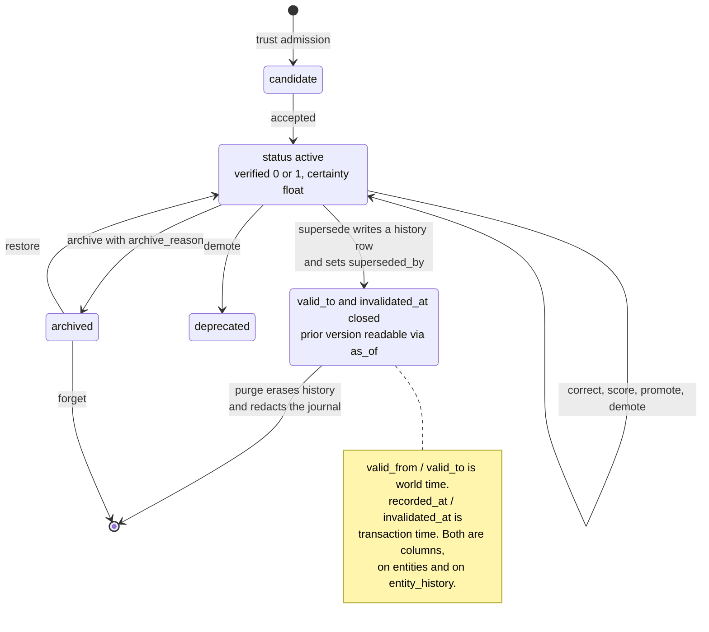

## 1. Executive Summary

Perseus Vault is roughly 59,000 lines of Rust over 660 commits, MIT-licensed,
shipping one binary and one SQLite file with no services. It exposes memory
through an MCP stdio server plus LangGraph, CrewAI and AutoGen adapters, stores
entities with bi-temporal bounds, retrieves with BM25 and dense vectors fused by
RRF, and can encrypt bodies with AES-256-GCM. It carries six of this atlas's
seven capability marks — everything but a rejected-value tombstone.

That would make it a substantial report on mechanism alone. It is a more
interesting one because of how it handles its own claims.

**It ships a `CLAIMS-AUDIT.md` that retires claims it cannot back.** The file
audits the README against code and committed artifacts, and its 2026-07-16 entry
records what that cost:

- *"Retired the 'sub-millisecond recall' entry"* — with the reason stated plainly:
  no committed artifact supported it, and the old justification, bundled offline
  embeddings, *"said nothing about latency."* The replacement is measured and
  cited: FTS5 recall p50 3.14 ms at 10K entities, dense p50 194.5 ms at 1M.
- *"Removed the unbacked 100K-entity insert-rate figure from the README (no
  artifact anywhere in the repo backed it)."*
- Reworded "signed results" to **"content-hashed (sha256)"**, because
  `signature_sha256` is a self-computed content hash *"not a cryptographic
  signature."* Downgrading your own security-adjacent wording is not a common
  edit.
- Clarified that `federate` is a local export and re-import, *"file based, no
  network peers."*

This atlas's [benchmarks page](../../benchmarks/) has spent most of its length on
figures with no traceable artifact. Here is a project that went looking for its
own and deleted the ones that failed.

**Its benchmark discipline is the strongest in the corpus.** The README leads
with 73.8% on LongMemEval against Zep's published 63.8% and Mem0's 49.0%. That
number is the mean of **three independent full 500-question runs**, each with its
own committed report carrying dataset, split, `n_instances`, `mock_llm: false`,
the pinned answerer and judge model snapshots, temperature, retrieval mode and
`k`, commit, binary version, platform, hardware, elapsed time and a run
signature. Recomputed from those three artifacts at this commit:

```text
qa_report.json        0.736
qa_report_seed2.json  0.750
qa_report_seed3.json  0.728
mean                  0.738   ← the published figure, exactly
```

**And the headline is the lower of its two numbers.** The same directory holds
three `official-cot` runs meaning **79.0%** (0.800 / 0.786 / 0.784, also
recomputed exactly), and the README quotes the plain-prompt 73.8% instead. The
comparison document explains why in a section headed *"Caveats (read before
quoting the number)"*: the two prompts are different official conditions,
*"every quote must carry its `answer_prompt` label"*, and — on the competitors —
*"Zep's publication does not state their variant; flag that when comparing, never
blend."* Zep's and Mem0's figures are labelled as their publishers' claims and
cited to an issue rather than reproduced as head-to-heads, which is the reporting
policy this atlas credits [Daimon](../daimon/) for writing down, implemented.

**Then the one claim the audit's own method contradicts.** `CLAIMS-AUDIT.md`
states 65 canonical MCP tools, the README states it three times, and the audit
supplies the check with an instruction attached — *"this is the authoritative
command — re-run it and update README/manifest.json/glama.json whenever a tool is
added"*:

```bash
grep -o '"name": "mimir_[a-z_]*"' src/mcp.rs | sort -u | wc -l
```

Run against `src/mcp.rs` at this commit it returns **76**. Parsing the embedded
registry literal instead of grepping it gives a third figure: **88 top-level
entries**, 87 of them `mimir_`-named and one `perseus_vault_`-named.

So the claim says 65, its designated check says 76, and the registry the check is
supposed to be counting holds 88. **None of the three is established as the
canonical figure**, because the canonical/legacy split does not exist in the
literal at all — `tool_registry_base` describes the `mimir_*` names as *"an
implementation migration detail"*, and `legacy_alias_tool` synthesizes aliases by
prefix rewriting at advertise time. What is advertised is decided at runtime by
`build_tools_array`, which no static grep can see.

The finding is therefore not that the count is wrong by some amount. It is that
**the count definition and its verification command have drifted apart**, and
that the command cannot answer the question it is designated to answer. A count
generated from the registry and asserted in CI is the fix, and it is the one the
project's author names.

**One more disclosure worth naming as a strength.** The README states, in its own
install section, that *"Encryption is opt-in. A stock install writes plaintext
bodies until you initialize encryption"*, and that `doctor` *"reports the actual
on-disk state rather than assuming the database is encrypted."* A banner that says
"Encrypted" over a default that is not, with the gap disclosed above the fold and
tracked in the claims audit, is a better outcome than most projects manage in
either direction.

**The distinction is worth preserving whenever the system is summarised**, and it
is the one a one-line description erodes: *supports AES-256-GCM* and *a stock
install encrypts by default* are different claims, and only the first is true
here. This report's own frontmatter previously carried the shorter form.

## 2. Mental Model

An entity's standing is three separate things — a discrete `status`, a boolean
`verified`, and a `certainty` float — over a bi-temporal record that keeps its
own history.



The schema comments say it directly — `valid_from_unix_ms` is *"when the fact
became true in the world"* and `recorded_at_unix_ms` is *"transaction time: when
Mneme first knew it"* — which is the distinction the
[bi-temporal fact validity](../../patterns/bi-temporal-fact-validity/) pattern
exists for, present on both the live table and its history.

What the diagram has no state for is a value that was judged wrong. `purge` and
`forget` remove records; nothing records the *content* so a later ingest cannot
re-assert it. That is the one mark missing and the one gap the rest of the design
makes conspicuous.

## 3. Architecture

One Rust binary over one SQLite file. Tables: `entities` and `entity_history`,
`journal` with `audit_chain_state`, `communities`, `keystones`, `artifacts` and
`artifact_bindings`, `agents`, `authority_manifests` with
`authorized_actions` and `authorized_action_leases`, `dedup_signatures`,
`encryption_canary`, and a `state` key-value table.

Entity columns carry the whole model: `category`, `key`, `body_json`, `status`,
`type`, `tags`, `decay_score`, `retrieval_count`, `layer`, `topic_path`,
`archived` with `archive_reason`, `links`, `verified`, `source`, `certainty`,
`always_on`, `workspace_hash`, `visibility`, the four temporal columns, an
`embedding` blob and an `emb_sig` sign-bit signature.

### Deployment and ergonomics

`curl | sh` to `~/.local/bin`, then `serve --db`. No Docker, no Postgres, no
network dependency in `Cargo.toml`. Encryption requires an explicit `init` that
creates the key and the canary row; `serve` warns when an encrypted vault is
opened without a key.

The cost of the single-file model is the usual one and the project does not hide
it: `federate` is export and re-import rather than peer sync, so multi-machine
use is a file operation.

## 4. Essential Implementation Paths

### Three runs, one signature, and a caveat section

`benchmark/longmemeval/` holds `run.py`, the per-run reports, `COMPARISON.md` and
a retrieval diagnostic. Each report is a full config stamp rather than a score,
and the comparison document records the provenance per run — *"plain run 2
signature `929623670d8bcc67…`; CoT runs `20327b31b5940f58…` / `7c8ce1b406c0cc4b…`
/ `eb848e786677a8d1…` — each over the per-question verdict set."*

The design decision worth stealing is that the answer prompt is *"folded into the
run signature (a CoT number can never be silently blended with a plain-prompt
one)"*. Blending incomparable conditions is the most common way a benchmark table
misleads without anybody lying, and making the condition part of the hash removes
the possibility rather than warning against it.

Publishing per-question-type results is the second. The committed report shows
`single-session-user` at 0.957 and `single-session-preference` at **0.300** on
30 questions. A weak category is visible because they published the breakdown;
in most of this corpus it would be inside the headline average.

### The count that the audit's own command refutes

Three surfaces say 65. The audit's designated command returns 76, and the tool
names it lists are unmistakably real — `recall`, `supersede`, `correct`,
`forget`, `purge`, `bitemporal`, `valid_at`, `operator_review`, `journal`,
`beliefs`, `conflicts`, `promote`, `demote`, `keystone_get`, and so on.

Two smaller inconsistencies sit beside it. The command greps the legacy `mimir_`
prefix while the audit's own text says the canonical prefix is
`perseus_vault_*`, of which `src/mcp.rs` contains one. And the audit's History
section ends *"Now **57**"*, a figure two revisions behind the 65 above it, kept
under a note that earlier figures are historical.

**The instructive part is not the wrong number, it is where it sits.** This is a
project that retired a latency claim for lack of an artifact and downgraded
"signed" to "content-hashed" on its own initiative. The claim that went stale is
the one with a check attached — because a command written down in a Markdown file
runs only when somebody remembers, and the discipline that catches unbacked
claims is a different discipline from the one that keeps backed claims current.
It is the same failure this atlas has recorded in its own count sweeps: the
guard exists, and nothing runs it.

### Trust as three axes, not one float

`status` carries `active`, `candidate`, `superseded`, `deprecated`, `compacted`,
`dead` and `useful`; `verified` is a separate boolean; `certainty` is a separate
float; `source` records where it came from. `src/trust_admission.rs` gates what
enters.

Keeping "we checked this" apart from "how confident are we" apart from "what
state is this record in" is a distinction most systems here collapse, and it is
what makes the `trust_state` mark straightforward: `candidate` and `superseded`
are states that withhold a memory from being treated as current, expressed as a
column rather than inferred from a number.

### Deletion that is tested to have happened

`purge_erases_history_and_redacts_journal_for_purged_entities` seeds an entity
with fake PII, supersedes it several times so `entity_history` accumulates, then
purges and asserts the history rows are gone, the journal rows are marked
`redacted`, and `category`, `key` and `entity_id` are scrubbed to empty strings.
A companion test,
`purge_does_not_redact_other_workspace_live_journal_rows`, asserts the blast
radius stops at the workspace boundary.

An audit log that reproduces the content a user asked to delete is a real hazard
and one this atlas has flagged elsewhere. Testing both that the secret is gone
and that the erasure did not over-reach is the pair of assertions the problem
needs, and it is why the `negative_eval` mark applies.

## 5. Memory Data Model

The unit is an entity keyed by `(category, key, workspace_hash)` — an identity
index the schema comments date to issue #339 and credit with *"~66x on
workspace-scoped browse at 30k rows."*

`entity_history` mirrors the entity columns and adds the transaction interval,
with a comment describing it as `[recorded_at_unix_ms, invalidated_at_unix_ms)`
and `superseded_by` pointing at the replacement. So a superseded value is
readable as of a past instant rather than lost, and `mimir_as_of`,
`mimir_valid_at`, `mimir_recall_when`, `mimir_timeline` and `mimir_history` are
the tools over it.

The `journal` is hash-chained — SHA-256 plus a keyed MAC, with `audit_chain_state`
holding the chain head — and rows are stamped with `workspace_hash` at write time
*"so purge can scope journal redaction per-workspace."* That is an append-only
mutation record in the system's own store with a tamper-evident chain, which is
the `audit_log` mark and a strong instance of it.

What is absent is the tombstone. `forget` and `purge` are removals; supersession
records a replacement. Nothing is keyed on the rejected *value*, so a later
ingest of the same wrong content creates a new entity, and the
[rejected-value tombstone](../../patterns/rejected-value-tombstone/) page's
argument applies unchanged.

## 6. Retrieval Mechanics

FTS5 for lexical, dense vectors for semantic, fused by reciprocal rank. The
performance detail worth noting is `emb_sig`: a sign-bit signature of each
embedding, one bit per dimension, so `dense_search` Hamming-prefilters candidates
*"instead of reading every full embedding blob once the vault is large enough."*
Written on store and backfilled by a migration.

Scope reaches the query: `workspace_hash` appears in read predicates across
`tools.rs`, `communities.rs` and the trust-admission path, alongside a
`visibility` column. The usual caveat applies — the caller supplies the workspace
— so the mark certifies the key reaches the query, not that a caller cannot pass
a different one.

Measured latencies, from the artifacts the claims audit points at rather than
from prose: FTS5 recall p50 3.14 ms at 10K entities; dense recall p50 194.5 ms at
1M entities on the uniform arm.

## 7. Write Mechanics

Writes arrive as MCP tool calls and are synchronous against SQLite. Supersession
writes a history row, closes the prior interval and sets `superseded_by`;
`correct`, `promote`, `demote` and `score` move the trust axes; `archive` sets a
flag and a reason; `forget` and `purge` remove.

Background work is extensive — decay ticks, `cohere`, `dream`, `consolidate`,
`hygiene`, community detection — and `score` sets a persistent importance floor
that decay and cohere respect, with the reasoning in the schema comment: *"an
explicit score survives the recency-based recompute instead of being erased by
the next tick (fidelity > recency)."* An explicit human judgement outranking an
automatic recompute is the right default and is written down where the column is
declared.

### Operational cost

No model in the read path; embeddings are bundled ONNX and run locally. The
background passes are the variable cost and several are LLM-assisted. Storage
grows with history, which is the price of the bi-temporal model, and `purge` is
the release valve.

## 8. Agent Integration

An MCP stdio server implementing `initialize`, `tools/list` and `tools/call`,
with adapters committed for LangGraph, CrewAI and AutoGen. Legacy `mimir_*` and
`mneme_*` aliases remain callable and are counted separately from the canonical
set — and `mimir_alias_usage` exposes counters for canonical versus alias calls,
so a maintainer can see whether the old names can be retired. Instrumenting a
deprecation rather than announcing one is a small, unusually practical touch.

## 9. Reliability, Safety, and Trust

Strengths:

- **A claims audit that retires unbacked claims**, naming the retired figure, the
  reason, and the artifact that replaced it.
- **Three full runs per benchmark condition**, each with a complete config stamp,
  and published means that recompute exactly from the committed reports.
- **The answer prompt folded into the run signature**, so incomparable conditions
  cannot be blended.
- **Competitor figures labelled as published claims** and cited, not reproduced
  as head-to-heads.
- **Per-question-type results published**, including the weak category.
- **Bi-temporal columns on the live table and its history**, with `superseded_by`.
- **A hash-chained journal** with a keyed MAC and per-workspace stamping.
- **Purge tested both ways** — the content is gone, and the erasure did not cross
  the workspace boundary.
- **Trust split into status, verified and certainty**, three axes rather than one.
- **An explicit score that outranks the decay recompute**, with the rule stated at
  the column.
- **The encryption default disclosed** in the README's own install section.

Gaps:

- **The tool count has no working verification.** The claim (65), its designated
  command (76) and the parsed registry (88) disagree three ways, and the command
  greps a prefix the audit itself calls legacy, so it cannot distinguish canonical
  tools from compatibility aliases.
- **No rejected-value tombstone**, so purge and supersession cannot stop
  re-assertion. Read this against the pattern page's own header rather than as a
  missing best practice — [it is carried by five systems here](../../patterns/rejected-value-tombstone/)
  and the page states outright that it is not established practice, with real
  tradeoffs around normalization, scope, expiry, trusted correction and privacy
  deletion. It matters here for a specific reason: this store re-derives memory
  automatically, through consolidation, cohere and dream passes, which is exactly
  the condition under which record-keyed removal stops holding.

  The falsifying test is small and worth writing down, because the project's
  author states it in the same terms: reject value A, replace it with B,
  re-ingest A through a different write path, run the background consolidation
  passes, and check whether A is still rejected. Nothing committed covers that
  sequence today.
- **Encryption is opt-in**, so the default install stores plaintext bodies —
  disclosed, and still the default.
- **Federation is file-based**, so the multi-machine story is manual.

## 10. Tests, Evals, and Benchmarks

536 `#[test]` functions inline across `src/`, plus three integration files under
`tests/`. Nothing was run for this review — the suite is Rust and the benchmark
harness calls `gpt-4o-2024-08-06` for both answering and judging, so reproducing
the LongMemEval figure means paying for 500 questions × 3 runs × 2 model calls.

**What was verified is the arithmetic, and it holds.** The published 73.8% and
79.0% are the exact means of the three committed reports in each condition. That
is a weaker claim than a re-run and a much stronger one than the corpus norm: it
establishes that the headline figure is a function of artifacts in the repository
rather than a number in a README, and that the runs behind it were three rather
than one.

`benchmark/` also carries scale, contention, temporal, recall, quality, beam,
context-selection and embedding-quantization suites with committed JSON, and
`GAUNTLET.md` over the top. `PERF.md` and the claims audit both point at
artifacts rather than restating figures.

The untested surface is the one the tool-count finding exposes: nothing in CI
runs the audit's verification command, so a claim with a documented check went
stale anyway.

## 11. For Your Own Build

### Steal

- **Keep a claims audit file and let it delete things.** Naming a retired claim,
  why it failed, and what replaced it is worth more than any number the README
  could have kept.
- **Run your benchmark three times and commit all three.** A single run is a
  sample; a mean with its members committed is a result, and it lets a reader
  recompute your headline without rerunning anything.
- **Fold the condition into the run signature.** If the prompt variant is part of
  the hash, a chain-of-thought number cannot be quoted beside a plain one by
  accident.
- **Publish the per-category breakdown**, including the category you do badly on.
  It costs a table and it is the difference between a score and a result.
- **Cite competitors as their publishers' claims.** Reproducing someone else's
  number as a head-to-head asserts a comparability you did not establish.
- **Split trust into status, verified and confidence.** One float cannot express
  "checked and wrong".
- **Let an explicit human score outrank the automatic recompute**, and write the
  rule where the column is declared.
- **Test a deletion in both directions** — the content is gone, and the erasure
  stopped at the boundary.
- **Instrument your deprecation.** A counter for canonical versus alias calls
  tells you when the alias can go.

### Avoid

- **Documenting a verification command and not running it.** A check that lives
  in Markdown runs when somebody remembers; the count it guards went stale by
  eleven while the audit around it stayed sharp. Put it in CI or accept that it
  is a comment.
- **Treating supersession and purge as protection against re-assertion.** Both
  are keyed on the record. The next ingest of the same wrong value creates a new
  one.
- **Shipping a banner claim your default does not meet**, even disclosed. The
  disclosure here is exemplary and the first line still says "Encrypted".

### Fit

Right if you want a single-binary local memory with real correction semantics —
bi-temporal history, supersession with a readable past, a tamper-evident journal,
tested purge — and you would rather read a project's own audit of its claims than
take its README on faith. Six of seven marks is a genuinely unusual position.

Wrong if you need multi-machine memory without manual file movement, encryption
you cannot forget to enable, or a guarantee that a value you rejected stays
rejected. The last of those is the only mark it lacks, and in a system with this
much correction machinery it is the conspicuous absence rather than an oversight
you would expect at this level of care.

## 12. Open Questions

- Is 65 or 76 the intended canonical count, and which surface is wrong — the
  README, the audit's command, or the registry?
- Why does the authoritative command grep `mimir_` when the audit names
  `perseus_vault_*` as canonical, and what does the single `perseus_vault_`
  literal in `src/mcp.rs` mean for the alias mapping?
- Would the tombstone fit? The entity already has `status` and a history chain;
  what is missing is a value-keyed record consulted on ingest.
- `single-session-preference` scores 0.300 in the committed report. Is that a
  retrieval failure, a prompt failure, or a category the design does not target?
- Does `emb_sig` Hamming prefiltering change recall, and is there an artifact
  measuring the loss rather than the speedup?
- What would it take to make `federate` a sync rather than an export?

## Appendix: File Index

- Schema and temporal model: `src/schema.rs` (`entities`, `entity_history`,
  `journal`, `audit_chain_state`, `encryption_canary`, the `valid_*` and
  `recorded_at`/`invalidated_at` columns).
- Tools and review surface: `src/mcp.rs` (registry),
  `src/tools.rs` (`handle_operator_review`, recall, supersede, correct, purge).
- Trust admission: `src/trust_admission.rs`.
- Storage and deletion tests: `src/db.rs`
  (`purge_erases_history_and_redacts_journal_for_purged_entities`,
  `purge_does_not_redact_other_workspace_live_journal_rows`).
- Benchmarks: `benchmark/longmemeval/` (`qa_report.json`, `qa_report_seed2.json`,
  `qa_report_seed3.json`, the three `qa_report_cot*.json`, `COMPARISON.md`,
  `run.py`), `benchmark/scale/report.json`, `benchmark/lambda/results/`,
  `benchmark/GAUNTLET.md`, `PERF.md`.
- Claims: `CLAIMS-AUDIT.md`; encryption behaviour: `docs/ENCRYPTION.md`.
- Integrations: `integrations/langgraph/`, `integrations/crewai/`,
  `integrations/autogen/`.

## History

**2026-08-04** — same pin, corrected after the project's author reviewed the
report. The tool-count finding was stated as "stale by eleven", which asserts
that 76 is the true canonical figure; nothing established that. Parsing the
embedded registry literal rather than grepping it returns **88** top-level
entries — 87 `mimir_`-named, one `perseus_vault_`-named — so the claim (65), its
designated command (76) and the registry (88) disagree three ways. The
canonical/legacy split is not present in the literal: `tool_registry_base` calls
the `mimir_*` names "an implementation migration detail" and `legacy_alias_tool`
synthesizes aliases by prefix rewriting at advertise time, so what is advertised
is a runtime decision no static count can see. The finding is drift between a
count definition and its verification command, not a corrected number. The
tombstone gap is additionally qualified against the pattern page's own "not an
established best practice" header, and the falsifying test the author proposes —
reject A, replace with B, re-ingest A by another path, run consolidation, check
whether A stays rejected — is recorded in section 9.

**2026-08-04** — [`838c63dabbcfc4aaee0867ba7ff0bab7829e442b`](https://github.com/Perseus-Computing-LLC/perseus-vault/commit/838c63dabbcfc4aaee0867ba7ff0bab7829e442b) — first reading. The published LongMemEval means were recomputed from the six committed per-run reports and match exactly (73.8% plain, 79.0% CoT); the benchmark itself was not re-run, as it requires paid model calls. The claims audit's own tool-count command was executed and returns 76 against a claim of 65.
