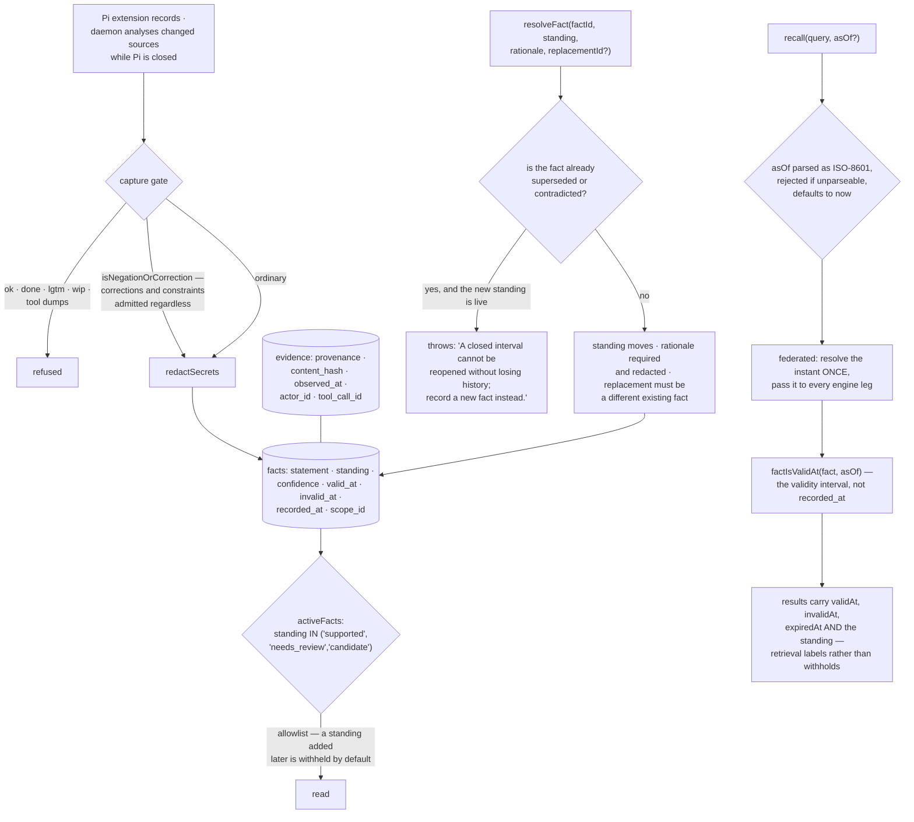

## 1. Executive Summary

pi-memory is "Pi-native temporal memory and hybrid retrieval for agents" — MIT,
TypeScript, version 0.1.0, 15,920 lines with 41 test files. It is an extension
for [Pi](../pi/) plus a standalone daemon that "analyzes changed sources while
Pi is closed."

The architecture note in the README is worth quoting for what it declines to do:
`/memory sync` "fingerprints publishers and enqueues work — it does not copy raw
source bodies", and "[d]o not install a persistent service unless explicitly
authorized." Both are restraint written into the first screen.

The memory model is bitemporal in the way the atlas asks for. A fact carries
`valid_at` and `invalid_at` — when the thing it states was true — separately from
`recorded_at`, when the store learned it. Both retrieval entry points accept an
`asOf`, parse it strictly (`"asOf must be ISO-8601."`), default it to now, and
filter candidates with `factIsValidAt(fact, asOf)`. The federated path resolves
the instant once and passes it down to every engine leg, so a query spanning
several scopes reads one consistent moment rather than a different now per leg.

Beside that runs a five-value standing — `candidate`, `supported`,
`needs_review`, `contradicted`, `superseded` — and the storage layer reads it
through an allowlist:

```
SELECT id FROM facts WHERE scope_id=? AND standing IN ('supported','needs_review','candidate')
```

An allowlist rather than a denylist, so a standing added next year is withheld
by default instead of leaking until somebody remembers to exclude it.

The sentence that makes the whole thing cohere is in `resolveFact`. Moving a
fact to a new standing requires a rationale, which is redacted before it is
committed, and a replacement must be a different existing fact. And a fact that
is already `superseded` or `contradicted` cannot be moved back:

> "A closed interval cannot be reopened without losing history; record a new
> fact instead."

That is the rule that keeps a mutable standing from undoing a temporal record.
The standing can move forward; the interval it closed stays closed; the way to
say "actually it is true again" is to record that as a new fact with its own
validity, which is what a bitemporal store is for.

The capture gate deserves a mention for one detail. It refuses routine chatter —
`ok`, `done`, `lgtm`, `wip` — and tool dumps, and then `isNegationOrCorrection`
deliberately admits corrections and constraints regardless. Corrections are the
class most likely to look like noise to a filter and the most expensive to drop,
and the module's first line names the failure it is avoiding: "Not a copy of
prjct fail-open excess."

## 2. Mental Model

A **fact** states something, for an interval, as of a moment it was recorded.

A **standing** says how the store currently regards it. Two of the five values
are terminal.

An **asOf** is a question about a moment, not about now.

**Evidence** is what a fact rests on: a content hash, a provenance, an actor, a
session and the tool call that produced it.



## 3. Architecture

| Area | Role |
| --- | --- |
| `src/storage/migrations.ts` | The schema: documents, chunks, episodes, evidence, entities, facts |
| `src/storage/projection.ts` | The read layer, including the standing allowlist |
| `src/engine.ts` | `resolveFact` and the reopening guard |
| `src/retrieval/hybrid.ts`, `federated.ts` | `asOf` parsing, candidate selection, validity filtering |
| `src/curation/` | The pipeline, validation and publication |
| `src/retention/` | Capture gate, consolidation, a value model, bounded GC |
| `src/security/redact.ts` | Secret redaction on capture and on rationales |
| `src/eval/` | Oracles, evidence scoring and a comparison CLI |
| `src/daemon/` | Out-of-process analysis of changed sources |

## 4. Essential Implementation Paths

`src/engine.ts:358-367` — `resolveFact`, four lines of validation and the
sentence that explains the model.

`src/storage/projection.ts:721-726` — the allowlist, and the scope parameter.

`src/retrieval/federated.ts:29-40` — one `asOf` resolved once and pushed to
every leg.

`src/retention/capture-gate.ts:1-12` — what it refuses, and the exception for
corrections.

## 5. Memory Data Model

Facts sit on top of evidence rather than replacing it. An `evidence` row carries
an origin, a provenance string, an optional URI, a content hash, an excerpt, an
observed-at, an actor, a session and the tool call it came from; an
`episode_evidence` join links episodes to the evidence they rest on, with
`ON DELETE CASCADE` from the episode and a plain reference to the evidence, so
deleting an episode does not delete the evidence another episode may also cite.

A fact adds `kind`, a statement, an optional subject/predicate/object triple, a
`standing`, a `confidence`, and the three timestamps. Confidence is a float and
therefore not a trust state in the atlas's sense; `standing` is the discrete
field, and it is the one the reads use.

## 6. Retrieval Mechanics

Hybrid lexical, vector and graph retrieval over a scope, federated across
engines. Two details are worth borrowing.

`asOf` is validated rather than coerced — an unparseable value throws instead of
silently becoming now — and in the federated path it is resolved once and passed
down, which is the difference between "as of last Tuesday" and "as of whenever
each leg happened to evaluate".

And the relevance gate reports rather than returns: when nothing clears the
threshold the response carries "Insufficient evidence: no candidate meets the
default relevance gate." A memory that can say it does not know is a better
input to an agent than one that returns its three closest guesses.

The honest limit is what retrieval does with `standing`. It is threaded into
every result — `standing: fact.standing` beside `validAt`, `invalidAt` and
`expiredAt` — rather than used to withhold. So the storage-level allowlist
governs `activeFacts` and publication, and a caller using the hybrid API gets
contradicted facts back, labelled. That is a defensible design for an API whose
consumer is another program, and it means the label has to be read.

## 7. Write Mechanics

The extension records; the daemon analyses. `/memory sync` fingerprints
publishers and enqueues work rather than copying source bodies, which keeps the
store from becoming a second copy of everything it has seen.

`resolveFact` is the state-change surface and it asks for three things: the new
standing, a rationale, and optionally a replacement. The rationale passes
through `redactSecrets` before it reaches the event log, which is the kind of
detail that is easy to skip — a free-text explanation of why a fact was
contradicted is exactly where somebody pastes a token.

## 8. Agent Integration

A Pi extension and a daemon, with the caution about persistent services stated
in the README rather than left to the installer. The eval CLI and oracles —
`final-answer`, `grounding`, `evidence-complete`, `unanswerable` — suggest the
project measures answer quality rather than only retrieval, and having an
`unanswerable` oracle kind at all is a good sign: it is the case where a memory
system is supposed to say nothing.

## 9. Reliability, Safety, and Trust

Redaction on capture and on rationales, a capture gate, a compact-authority
singleton with a digest, an applied-events table, and the reopening guard.

The guard is the one to take away, and it generalises past this project. Any
store with a mutable status over a temporal record faces the same question: can
a closed interval be reopened? Answering yes quietly loses the history of the
closure; answering no forces the honest representation — a new fact, with its
own validity, recording that the thing became true again. pi-memory answers no,
in one line, with the alternative in the same sentence.

## 10. Tests, Evals, and Benchmarks

41 test files including `curation-safety`, `capture-gate`, `compact-authority`,
`compact-promotion` and `daemon`, plus the eval oracles and a comparison CLI.

What is absent is a must-not-retrieve assertion: nothing in the tree seeds a
contradicted or superseded fact and asserts it stays out of a retrieval, which
is the test that would pin the allowlist against a future refactor moving the
filter. Given that the storage query is the single place the rule lives, that
test is cheap and load-bearing.

## 11. For Your Own Build

Refuse to reopen a closed interval. If your status is mutable and your record is
temporal, the two will eventually disagree; deciding in advance that terminal
means terminal, and that the way forward is a new fact, keeps the history
honest. Put the alternative in the error message so the caller knows what to do.

Read the status through an allowlist. A denylist knows only the statuses
somebody remembered to add; an allowlist withholds a new one by default, which
is the direction you want to fail in.

Validate `asOf` and resolve it once. Parsing it strictly stops a bad string
silently becoming now, and resolving it once before fanning out is what makes a
federated as-of query mean anything.

Let the gate admit corrections. A noise filter tuned on "ok" and "done" will
also catch "no, it's the other one" unless you exempt it deliberately, and that
is the sentence you most wanted to keep.

Redact free-text rationales. The field where someone explains why a fact was
wrong is a field where someone pastes the thing that proved it.

## 12. Open Questions

Whether the hybrid API should withhold contradicted facts rather than label
them. The storage layer and the publication path both exclude them; the
retrieval API does not, and nothing in the tree records that as a decision
either way.

Whether `scope_id` will move from a parameter to a property of the handle. As a
parameter it is the caller's to pass correctly, which is why no scope mark is
claimed here.

What the redactor does not catch. The rest of the codebase writes limits down;
this module does not, and a pattern-based redactor always has some.

## Appendix: File Index

| Path | What to read it for |
| --- | --- |
| `src/engine.ts:358-367` | The reopening guard, and the alternative in the message |
| `src/storage/projection.ts:721-726` | An allowlist read, and the scope parameter |
| `src/retrieval/federated.ts:29-40` | One `asOf`, resolved once, pushed to every leg |
| `src/storage/migrations.ts:137-176` | Evidence with provenance, and a fact's three timestamps |
| `src/retention/capture-gate.ts` | What it refuses, and the exemption for corrections |
| `src/eval/oracles.ts` | An oracle kind for the answer that should not be given |

## History

**2026-09-16** — [`4eed65428da97bba1ebd41630767a1764cbe9d09`](https://github.com/prjct-app/pi-memory/commit/4eed65428da97bba1ebd41630767a1764cbe9d09) — first reading, at a commit dated 15 September 2026. Screened before opening, from a shallow clone: three files scanned, no auto-run surfaces, no build-time execution points, one unpinned surface and two dependency files inside the seven-day cooldown. Nothing was installed, built or run, and the README's caution against installing a persistent service was moot for a read-only reading.
