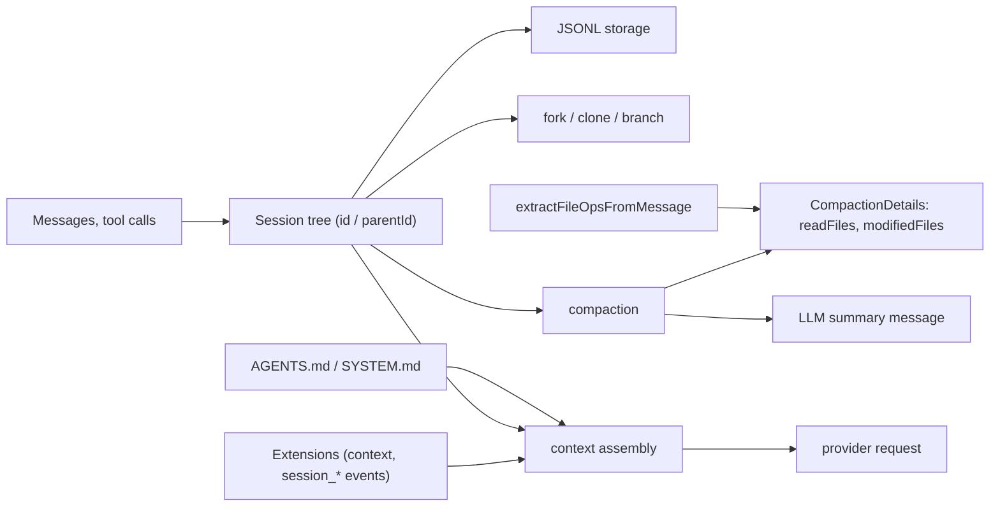

## 1. Executive Summary

Pi is an MIT-licensed, actively developed TypeScript agent toolkit: a unified LLM API (`pi-ai`), an agent runtime (`pi-agent`), a coding-agent CLI (`pi-coding-agent`), a TUI, storage, and a server.

**It has no memory system.** Searching its SDK documentation for "memory" returns `SessionManager.inMemory()` and `InMemoryCredentialStore` — storage backends, not agent memory. There is no memory record, no retrieval, no extraction, and no memory-provider interface.

That is precisely why it belongs here. Pi is the third host runtime in the atlas after [Hermes Agent](../hermes-agent/) and [OpenClaw](../openclaw/), and it is the strongest form of the argument in the [pluggable memory provider](../../patterns/pluggable-memory-provider/) pattern. Hermes and OpenClaw at least define memory contracts that happen to lack deletion hooks and scope parameters. Pi defines no memory contract at all: its `ExtensionAPI` exposes more than twenty lifecycle events, and memory plugins such as [Magic Context](../magic-context/) build everything themselves on top of `context`, `session_start`, and `session_before_compact`. There is nowhere for a deletion request or a scope to live, even in principle.

What Pi does provide is a **substrate**, and two parts of it are genuinely novel for this atlas.

**Sessions are a tree, not a log.** Entries carry `id` and `parentId`, and the runtime supports forking, cloning, and branch summarization. Every other system here treats a session as a linear stream. A branchable session raises a question nothing in the atlas has had to answer: when you fork a conversation, what memory does the fork inherit? Magic Context has a `clone-inheritance.ts` specifically for this.

**Compaction carries a deterministic file manifest.** `CompactionDetails` records `readFiles` and `modifiedFiles`, extracted from tool calls by `extractFileOpsFromMessage` rather than produced by the summarizing model. The LLM writes the prose; the code writes the file list. This is the same instinct as [claude-mem](../claude-mem/), which replaces its observer's modified-file list with paths derived deterministically from tool calls, and it is the right way to keep the checkable part of a summary out of the model's hands.

Read this report for the substrate and the negative space. The memory itself is [Magic Context](../magic-context/)'s.

## 2. Mental Model

There is no memory unit. The persistence unit is a session-tree entry:

```typescript
SessionTreeEntryBase {
  id: string
  parentId: string | null      // the tree
  ...
}

// entry variants
MessageEntry
ThinkingLevelChangeEntry
ModelChangeEntry
ActiveToolsChangeEntry
CompactionEntry<T>       // carries CompactionDetails
BranchSummaryEntry<T>
```

```typescript
interface CompactionDetails {
  readFiles: string[]      // deterministic, from tool calls
  modifiedFiles: string[]  // deterministic, from tool calls
}
```

Persistence is JSONL on disk (`jsonl-storage.ts`, `jsonl-repo.ts`) with an in-memory alternative (`memory-storage.ts`, `memory-repo.ts`) for tests and embedded use.

Context assembly comes from three places, none of them a memory store:

```text
resource files (AGENTS.md / SYSTEM.md, auto-discovered by resource-loader.ts)
  + session tree walked from the current leaf to the root
  + whatever extensions inject via the `context` event
-> provider request
```

## 3. Architecture

Packages: `ai`, `agent`, `coding-agent`, `tui`, `storage`, `server`, `evals`.

The parts that matter for memory are small and legible:

- `packages/agent/src/harness/session/` — `session.ts` (359 lines), `jsonl-storage.ts` (376), `jsonl-repo.ts` (179), `memory-storage.ts` (189), `memory-repo.ts` (50), `repo-utils.ts` (51).
- `packages/agent/src/harness/compaction/` — `compaction.ts` (880), `branch-summarization.ts` (275), `utils.ts` (132).
- `packages/coding-agent/src/core/resource-loader.ts` — `AGENTS.md` / `SYSTEM.md` discovery.
- `packages/coding-agent/src/core/extensions/types.ts` — the `ExtensionAPI`, including the event surface.



## 4. Essential Implementation Paths

### The session tree (`harness/session/`)

Entries form a tree through `parentId`, and the type system distinguishes messages from model changes, thinking-level changes, active-tool changes, compaction entries, and branch summaries. Building a context means walking from the current leaf toward the root (`buildSessionContext`).

Forking is a first-class operation with its own error code (`invalid_fork_target`) and its own extension event (`session_before_fork`), and `branch-summarization.ts` can summarize a branch rather than a linear range.

The memory consequence is unexplored territory for this atlas. Every retrieval-and-correction story here assumes one linear history per scope. In a tree, two branches can hold contradictory facts that were both true on their own path, a memory extracted on one branch may be nonsense on a sibling, and "forget that" has to mean something specific about which branches are affected. Pi provides the mechanism; nothing in the atlas has worked out the semantics.

### Compaction with a deterministic manifest (`harness/compaction/`)

`compaction.ts` serializes the conversation, calls a model for a summary, and attaches `CompactionDetails`. The file lists come from `computeFileLists` / `extractFileOpsFromMessage` in `utils.ts` — parsed out of tool calls, not asked of the model.

This preserves the one part of a compaction summary that is objectively checkable. A model asked to summarize a coding session will confidently misremember which files it touched; a parse of the tool calls will not. Anything that later needs to know "what did this session actually modify?" — a memory plugin, a reviewer, a verification pass — can trust the manifest even where the prose has drifted.

`branch-summarization.ts` extends the same idea to branches, and `custom-compaction.ts` in `packages/coding-agent/examples/extensions/` shows compaction being replaced wholesale by an extension.

### Resource files (`core/resource-loader.ts`)

`AGENTS.md` and `SYSTEM.md` are auto-discovered and injected. This is Pi's only built-in durable, cross-session context, and it is entirely human-authored: the agent does not write these files as part of any memory loop. Compare [Hermes Agent](../hermes-agent/), whose `MEMORY.md` and `USER.md` are agent-written under a budget and a write gate. Pi's equivalent is documentation, not memory.

### The extension surface (`core/extensions/types.ts`)

The event list is long and well-factored:

```text
project_trust · resources_discover
session_start · session_info_changed · session_before_switch
session_before_fork · session_before_compact · session_compact
session_before_tree · session_tree · session_shutdown
context (with a result — extensions can rewrite assembled context)
before_provider_request · before_provider_headers · after_provider_response
before_agent_start · agent_start · agent_end · agent_settled
```

Several carry result types, so handlers can veto or modify — `session_before_compact` can change what gets compacted, `context` can rewrite what reaches the model.

For memory this is more than sufficient as *mechanism* and completely absent as *contract*. A plugin can capture at `session_start`, inject at `context`, react to forks at `session_before_fork`, and consolidate at `session_compact`. What it cannot do is declare itself a memory provider, receive a scope, or be told to forget something. Nothing in Pi knows that memory exists, so nothing in Pi can ask memory a question.

## 5. Memory Data Model

None. The session tree is conversation history with structured entry types, not a belief store: there is no memory record, no status, no verification, no importance, no provenance beyond entry lineage, and no deletion semantics beyond removing session files.

`packages/storage/` provides storage primitives, and `SessionManager.inMemory()` an ephemeral backend, but neither is a memory abstraction.

## 6. Retrieval Mechanics

None. Context is assembled by walking the session tree and adding discovered resource files. There is no search over past sessions, no embedding, no ranking, and no cross-session recall — which is exactly the gap plugins like [Magic Context](../magic-context/) exist to fill, and why Magic Context has to build its own message index and FTS tables over Pi's history rather than querying anything Pi provides.

## 7. Write Mechanics

Sessions append to JSONL as the conversation proceeds. Compaction replaces a range with a summary entry plus its deterministic manifest. Forking creates a new branch from an existing entry.

There is no notion of a durable claim, so there is no write gate, dedupe, conflict detection, or correction path — none of it applies.

## 8. Agent Integration

Pi *is* the harness: a CLI, a TUI, an SDK, and a server, with extensions loaded via `jiti`. Its integration story for memory is the extension API described above, and its practical memory ecosystem is third-party:

- [Magic Context](../magic-context/) — the substantial one, sharing a store between its Pi and OpenCode adapters.
- db0 — a hosted integration whose backend is not open, and therefore not reviewable on this atlas's terms.
- `pi-chat`, a separate project, injects two persistent memory files into the system prompt **every turn**, which is a deliberate contrast with Hermes's inject-once frozen snapshot: fresher, and it forfeits the prompt-cache benefit Hermes is optimizing for.

## 9. Reliability, Safety, and Trust

Strengths, as a substrate:

- Deterministic file manifests on compaction, keeping the checkable part of a summary out of the model's output.
- A typed session tree that distinguishes message, model-change, tool-change, compaction, and branch-summary entries rather than flattening everything into text.
- Extension events with result types, so handlers can veto rather than only observe.
- A `project_trust` event, indicating trust is modeled somewhere in the harness.
- Swappable JSONL and in-memory session backends.
- MIT licensed and actively developed.

Gaps, for memory specifically:

- **No memory contract**, so no scope parameter, no deletion hook, no capability negotiation, and no way for the host to ask a plugin anything.
- **No built-in cross-session recall**, so every memory plugin reimplements indexing over the same history.
- **Fork semantics for memory are undefined** — the mechanism exists, the meaning does not.
- **Human-authored resource files are the only built-in durable context**, which is a documentation mechanism rather than a memory one.

## 10. Tests, Evals, and Benchmarks

Pi carries an `evals` package and substantial test infrastructure including `packages/agent/test/harness/session-test-utils.ts`. The suites were not run for this review.

There is no memory benchmark, because there is no memory. Compaction quality — how much a compacted branch loses — is the closest analogue and no committed measurement of it was found.

## 11. Patterns Worth Stealing

- **Deterministic manifests attached to generated summaries.** Where part of a summary is derivable from structured events, derive it. Never ask a model to recall what your tool-call log already knows.
- **Typed session entries.** Distinguishing compaction entries and branch summaries from ordinary messages means later consumers can find and re-derive them instead of pattern-matching prose.
- **Extension events with result types**, letting a handler modify or veto rather than merely observe.
- **A session tree with explicit fork points**, which is a better substrate for exploratory agent work than a linear log — provided someone works out what it means for memory.

## 12. Antipatterns / Risks

- **A rich lifecycle API with no memory contract** — the strongest instance in the atlas of the pluggable-provider gap, since here there is not even a partial contract to extend.
- **Every plugin reimplements history indexing**, with no shared abstraction and no way for two memory plugins to coexist coherently.
- **Branching without memory semantics**, which will produce contradictions across branches that nothing is positioned to reconcile.

## 13. Build-vs-Borrow Takeaways

Borrow:

- The deterministic compaction manifest, essentially as written.
- The typed session-entry model.
- The result-returning event pattern.

Do not copy:

- The absence of a memory contract, if you expect third-party memory. Define scope and deletion in the interface before plugins exist, because retrofitting them across independently-shipped backends is much harder than specifying them once.

## 14. Open Questions

- What should a forked session inherit from its parent's memory, and should memory written on a branch be visible on siblings?
- Should Pi define a minimal memory contract — scope in, forget out — given that a serious memory ecosystem is already forming around it?
- How much is lost across repeated compactions, and does the deterministic manifest survive compaction-of-compactions?
- Should the harness offer a shared history index, so every memory plugin does not rebuild one?

## Appendix: File Index

- Session tree and storage: `packages/agent/src/harness/session/session.ts`, `jsonl-storage.ts`, `jsonl-repo.ts`, `memory-storage.ts`, `memory-repo.ts`.
- Entry types including `SessionTreeEntryBase`, `CompactionEntry`, `BranchSummaryEntry`: `packages/agent/src/harness/types.ts`.
- Compaction and deterministic manifests: `packages/agent/src/harness/compaction/compaction.ts`, `utils.ts` (`extractFileOpsFromMessage`, `computeFileLists`), `branch-summarization.ts`.
- Resource-file discovery: `packages/coding-agent/src/core/resource-loader.ts`.
- Extension API and events: `packages/coding-agent/src/core/extensions/types.ts`.
- Custom compaction example: `packages/coding-agent/examples/extensions/custom-compaction.ts`.
- SDK documentation: `packages/coding-agent/docs/sdk.md`.
