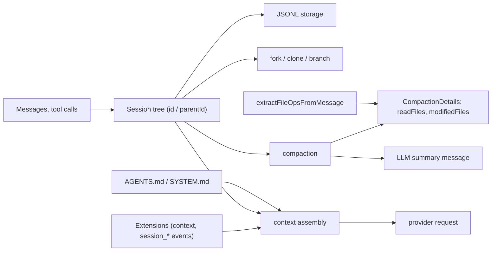

## 1. Executive Summary

Pi is an MIT-licensed, actively developed TypeScript agent toolkit: a unified LLM API (`pi-ai`), an agent runtime (`pi-agent`), a coding-agent CLI (`pi-coding-agent`), a TUI, session backends, a protocol, a client and a server.

**It has no memory system.** Searching its SDK documentation for "memory" returns `SessionManager.inMemory()` and `InMemoryCredentialStore` — storage backends, not agent memory. There is no memory record, no retrieval, no extraction, and no memory-provider interface.

That is precisely why it belongs here. Pi is a host runtime beside [Hermes Agent](../hermes-agent/) and [OpenClaw](../openclaw/), and it is the strongest form of the argument in the [pluggable memory provider](../../patterns/pluggable-memory-provider/) pattern. Hermes and OpenClaw at least define memory contracts that happen to lack deletion hooks and scope parameters. Pi defines no memory contract at all: its `ExtensionAPI` exposes more than twenty lifecycle events, and memory plugins such as [Magic Context](../magic-context/) build everything themselves on top of `context`, `session_start`, and `session_before_compact`. There is nowhere for a deletion request or a scope to live, even in principle.

What Pi does provide is a **substrate**, and three parts of it matter for memory.

**Sessions are a tree, not a log.** Entries carry `id` and `parentId`; a session holds named **branches**, each a movable tip over the shared tree, and the runtime supports forking and branch summarization. A branchable session raises a question a linear log never does: when you fork a conversation, what does the fork inherit? Magic Context has a `clone-inheritance.ts` specifically for this.

**Pi answers that question for its own state, and leaves memory to the answer's edges.** A session also holds typed durable **values** (replaceable) and **lists** (append-only) at `(namespace, key)` addresses; `pi.*` namespaces are reserved and applications define their own. `session/fork-policy.ts` is one closed policy over every namespace: the session name copies, entry labels follow the entries they label, branch tips and lane state are rebuilt, pending operations and results are dropped, and **application namespaces follow the fork's scope** — carried whole on a tree fork, dropped on a branch fork. A memory plugin that keeps its state in values therefore has a defined inheritance rule it did not have to write, and one it cannot refine per key.

**Compaction carries a deterministic file manifest.** `CompactionDetails` records `readFiles` and `modifiedFiles`, extracted from tool calls by `extractFileOpsFromMessage` rather than produced by the summarizing model. The LLM writes the prose; the code writes the file list. This is the same instinct as [claude-mem](../claude-mem/), which replaces its observer's modified-file list with paths derived deterministically from tool calls, and it is the right way to keep the checkable part of a summary out of the model's hands.

Read this report for the substrate and the negative space. The memory itself is [Magic Context](../magic-context/)'s.

## 2. Mental Model

There is no memory unit. The persistence units are a session-tree entry and a typed value:

```typescript
EntryBase {
  id: string
  parentId: string | null      // the tree
  seq: number
  timestamp: number
  type: "message" | "compaction" | "branch_summary" | "custom"
  customType?: string
}

// entry variants
MessageEntry
CompactionEntry          // summary, retainedTail, details
BranchSummaryEntry       // fromId, summary, details
CustomEntry              // application-defined; an EntryProjector may turn it into model context

value<T>(namespace, key)   // one replaceable durable value
list<T>(namespace, key)    // one append-only durable list
```

```typescript
interface CompactionDetails {
  readFiles: string[]      // deterministic, from tool calls
  modifiedFiles: string[]  // deterministic, from tool calls
}
```

Persistence is JSONL on disk (`session/jsonl/`, with a reader for the previous v3 format), a `node:sqlite` backend in `packages/session-backends/sqlite-node` with one database file per session, and an in-memory backend (`session/memory.ts`) that the backends share a conformance suite with.

Context assembly comes from three places, none of them a memory store:

```text
resource files (AGENTS.md / SYSTEM.md, auto-discovered by resource-loader.ts)
  + the branch walked from its tip to the root
  + custom entries turned into messages by registered entry projectors
  + whatever extensions inject via the `context` event
-> provider request
```

## 3. Architecture

Packages: `ai`, `agent`, `coding-agent`, `tui`, `session-backends`, `protocol`, `client`, `server`, `telemetry`, `chord`, `evals`.

The parts that matter for memory are legible, and the session layer grew with the runtime around it:

- `packages/agent/src/harness/session/` — `session.ts` (475 lines), `types.ts` (602), `values.ts` (195), `fork-policy.ts` (67), `fork.ts` (119), `commit.ts` (116), `context.ts` (64), `memory.ts` (453, the in-memory backend), and `jsonl/` (`storage.ts`, `repo.ts`, `fork.ts`, `legacy-v3.ts`).
- `packages/session-backends/sqlite-node/` — the SQLite session backend.
- `packages/agent/src/harness/compaction/` — `compaction.ts` (865), `branch-summarization.ts` (300), `utils.ts` (132).
- `packages/agent/src/search/index.ts` — a `SessionSearchService` interface with no implementation in the tree.
- `packages/coding-agent/src/core/resource-loader.ts` — `AGENTS.md` / `SYSTEM.md` discovery.
- `packages/coding-agent/src/core/extensions/types.ts` — the `ExtensionAPI`, including the event surface.



## 4. Essential Implementation Paths

### The session tree (`harness/session/`)

Entries form a tree through `parentId`, and the type system distinguishes messages, compaction entries, branch summaries and application custom entries. Model, thinking-level and tool configuration live on the branch's lane rather than as entries. Building a context means walking from a branch tip toward the root (`buildSessionContext` in `session/context.ts`), with each custom entry offered to the projector registered for its `customType`.

Forking is a first-class operation with its own extension event (`session_before_fork`). A fork is scoped to one branch — optionally from a named entry, before or at it — or to the whole tree, and `fork-policy.ts` decides what state crosses: application namespaces cross on a tree fork and not on a branch fork. `branch-summarization.ts` can summarize a branch rather than a linear range.

The memory consequence is mostly open. Retrieval-and-correction stories usually assume one linear history per scope. In a tree, two branches can hold contradictory facts that were both true on their own path, a memory extracted on one branch may be nonsense on a sibling, and "forget that" has to mean something specific about which branches are affected. Pi's fork policy settles only the coarse case — all of an application's state, or none of it — and leaves the per-memory question to the plugin.

### Compaction with a deterministic manifest (`harness/compaction/`)

`compaction.ts` serializes the conversation, calls a model for a summary, and attaches `CompactionDetails`. The file lists come from `computeFileLists` / `extractFileOpsFromMessage` in `utils.ts` — parsed out of tool calls, not asked of the model.

This preserves the one part of a compaction summary that is objectively checkable. A model asked to summarize a coding session will confidently misremember which files it touched; a parse of the tool calls will not. Anything that later needs to know "what did this session actually modify?" — a memory plugin, a reviewer, a verification pass — can trust the manifest even where the prose has drifted.

`branch-summarization.ts` extends the same idea to branches, and `custom-compaction.ts` in `packages/coding-agent/examples/extensions/` shows compaction being replaced wholesale by an extension.

### Resource files (`core/resource-loader.ts`)

`AGENTS.md` and `SYSTEM.md` are auto-discovered and injected. This is Pi's only built-in durable, cross-session context, and it is entirely human-authored: the agent does not write these files as part of any memory loop. Compare [Hermes Agent](../hermes-agent/), whose `MEMORY.md` and `USER.md` are agent-written under a budget and a write gate. Pi's equivalent is documentation, not memory.

### The extension surface (`core/extensions/types.ts`)

The event list is long and well-factored:

```text
project_trust · resources_discover
session_start · session_info_changed · session_before_switch
session_before_fork · session_before_compact · session_compact
session_before_tree · session_tree · session_shutdown
context (with a result — extensions can rewrite assembled context)
before_provider_request · before_provider_headers · after_provider_response
before_agent_start · agent_start · agent_end · agent_settled
```

Several carry result types, so handlers can veto or modify — `session_before_compact` can change what gets compacted, `context` can rewrite what reaches the model.

For memory this is more than sufficient as *mechanism* and completely absent as *contract*. A plugin can capture at `session_start`, inject at `context`, react to forks at `session_before_fork`, and consolidate at `session_compact`. What it cannot do is declare itself a memory provider, receive a scope, or be told to forget something. Nothing in Pi knows that memory exists, so nothing in Pi can ask memory a question.

## 5. Memory Data Model

None. The session tree is conversation history with structured entry types, not a belief store: there is no memory record, no status, no verification, no importance, no provenance beyond entry lineage, and no deletion semantics beyond removing session files.

The typed values and lists are the nearest thing to a memory abstraction: durable, namespaced, and carried or dropped by a fork policy. They are storage — no status, no scope beyond the session, no search — and `SessionManager.inMemory()` remains an ephemeral backend rather than memory.

## 6. Retrieval Mechanics

None. Context is assembled by walking a branch, projecting custom entries, and adding discovered resource files. `packages/agent/src/search/index.ts` declares a `SessionSearchService` — `searchSessions`, `searchEntries`, `sync`, `notify`, `remove` — and nothing in the tree implements it; the SQLite backend's README says search is a separate projection. There is no embedding, no ranking, and no cross-session recall — which is exactly the gap plugins like [Magic Context](../magic-context/) exist to fill, and why Magic Context has to build its own message index and FTS tables over Pi's history rather than querying anything Pi provides.

## 7. Write Mechanics

Sessions append entries and write values through atomic commits as the conversation proceeds. Compaction replaces a range with a summary entry plus its deterministic manifest. Forking creates a new branch from an existing entry.

There is no notion of a durable claim, so there is no write gate, dedupe, conflict detection, or correction path — none of it applies.

## 8. Agent Integration

Pi *is* the harness: a CLI, a TUI, an SDK, and a server, with extensions loaded via `jiti`. Its integration story for memory is the extension API described above, and its practical memory ecosystem is third-party:

- [Magic Context](../magic-context/) — the substantial one, sharing a store between its Pi and OpenCode adapters.
- db0 — a hosted integration whose backend is not open, and therefore not reviewable on this atlas's terms.
- `pi-chat`, a separate project, injects two persistent memory files into the system prompt **every turn**, which is a deliberate contrast with Hermes's inject-once frozen snapshot: fresher, and it forfeits the prompt-cache benefit Hermes is optimizing for.

## 9. Reliability, Safety, and Trust

Strengths, as a substrate:

- Deterministic file manifests on compaction, keeping the checkable part of a summary out of the model's output.
- A typed session tree that distinguishes message, model-change, tool-change, compaction, and branch-summary entries rather than flattening everything into text.
- Extension events with result types, so handlers can veto rather than only observe.
- A `project_trust` event, indicating trust is modeled somewhere in the harness.
- Swappable JSONL, SQLite and in-memory session backends with a shared conformance suite.
- A closed fork policy over every state namespace, so what a fork carries is written down rather than accidental.
- MIT licensed and actively developed.

Gaps, for memory specifically:

- **No memory contract**, so no scope parameter, no deletion hook, no capability negotiation, and no way for the host to ask a plugin anything.
- **No built-in cross-session recall**, so every memory plugin reimplements indexing over the same history.
- **Fork semantics stop at the namespace** — an application's state crosses a tree fork whole and a branch fork not at all, with no per-key or per-memory rule.
- **Human-authored resource files are the only built-in durable context**, which is a documentation mechanism rather than a memory one.

## 10. Tests, Evals, and Benchmarks

Pi carries an `evals` package and substantial test infrastructure including `packages/agent/test/harness/session-test-utils.ts`. The suites were not run for this review.

There is no memory benchmark, because there is no memory. Compaction quality — how much a compacted branch loses — is the closest analogue and no committed measurement of it was found.

## 11. For Your Own Build

### Steal

- **Deterministic manifests attached to generated summaries.** Where part of a summary is derivable from structured events, derive it. Never ask a model to recall what your tool-call log already knows.
- **Typed session entries.** Distinguishing compaction entries and branch summaries from ordinary messages means later consumers can find and re-derive them instead of pattern-matching prose.
- **Extension events with result types**, letting a handler modify or veto rather than merely observe.
- **A session tree with explicit fork points**, which is a better substrate for exploratory agent work than a linear log — provided someone works out what it means for memory.

### Avoid

- **A rich lifecycle API with no memory contract** — the pluggable-provider gap in its plainest form, since here there is not even a partial contract to extend.
- **Every plugin reimplements history indexing**, with no shared abstraction and no way for two memory plugins to coexist coherently.
- **Branching without memory semantics**, which will produce contradictions across branches that nothing is positioned to reconcile.

### Fit

Borrow:

- The deterministic compaction manifest, essentially as written.
- The typed session-entry model.
- The result-returning event pattern.

Do not copy:

- The absence of a memory contract, if you expect third-party memory. Define scope and deletion in the interface before plugins exist, because retrofitting them across independently-shipped backends is much harder than specifying them once.

## 12. Open Questions

- Is namespace-level fork inheritance enough for memory, or does a plugin need a hook to decide per memory what a branch fork keeps?
- Should Pi define a minimal memory contract — scope in, forget out — given that a serious memory ecosystem is already forming around it?
- How much is lost across repeated compactions, and does the deterministic manifest survive compaction-of-compactions?
- Will the declared `SessionSearchService` get an implementation in the harness, so every memory plugin does not rebuild a history index?

## Appendix: File Index

- Session tree, values and storage: `packages/agent/src/harness/session/session.ts`, `types.ts`, `values.ts`, `commit.ts`, `memory.ts`, `jsonl/`; `packages/session-backends/sqlite-node/`.
- Fork policy: `packages/agent/src/harness/session/fork-policy.ts`, `fork.ts`.
- Context assembly and entry projectors: `packages/agent/src/harness/session/context.ts`.
- Session search interface: `packages/agent/src/search/index.ts`.
- Harness design document: `packages/agent/docs/harness.md`.
- Compaction and deterministic manifests: `packages/agent/src/harness/compaction/compaction.ts`, `utils.ts` (`extractFileOpsFromMessage`, `computeFileLists`), `branch-summarization.ts`.
- Resource-file discovery: `packages/coding-agent/src/core/resource-loader.ts`.
- Extension API and events: `packages/coding-agent/src/core/extensions/types.ts`.
- Custom compaction example: `packages/coding-agent/examples/extensions/custom-compaction.ts`.
- SDK documentation: `packages/coding-agent/docs/sdk.md`.

## History

**2026-09-15** — [`f9bcd351dc3cedf989bc5fc0f8aa012db5737df2`](https://github.com/earendil-works/pi/commit/f9bcd351dc3cedf989bc5fc0f8aa012db5737df2) — 1,226 commits on, 2026-09-14. Screened before reading: no auto-run surface, twelve build-time execution points, eight unpinned surfaces and eleven dependency surfaces inside the cooldown; nothing was installed or run. Still no memory model; the session layer under it was rebuilt. A session is now an entry tree with named branches and agent lanes, plus typed durable values and lists at namespaced addresses; `fork-policy.ts` decides which state a fork carries, application namespaces crossing a tree fork and not a branch fork — a partial answer to the open question the first reading ended on. Custom entries can be projected into model context. Storage gained a `node:sqlite` backend beside JSONL and in-memory ones, `packages/storage` is gone, and a session search interface is declared without an implementation. Corpus-ranking sentences were rewritten. No mark changes.

**2026-07-27** — [`a597371bda2af70372d1323d550483b5f4a0ae36`](https://github.com/earendil-works/pi/commit/a597371bda2af70372d1323d550483b5f4a0ae36) — first reading.
