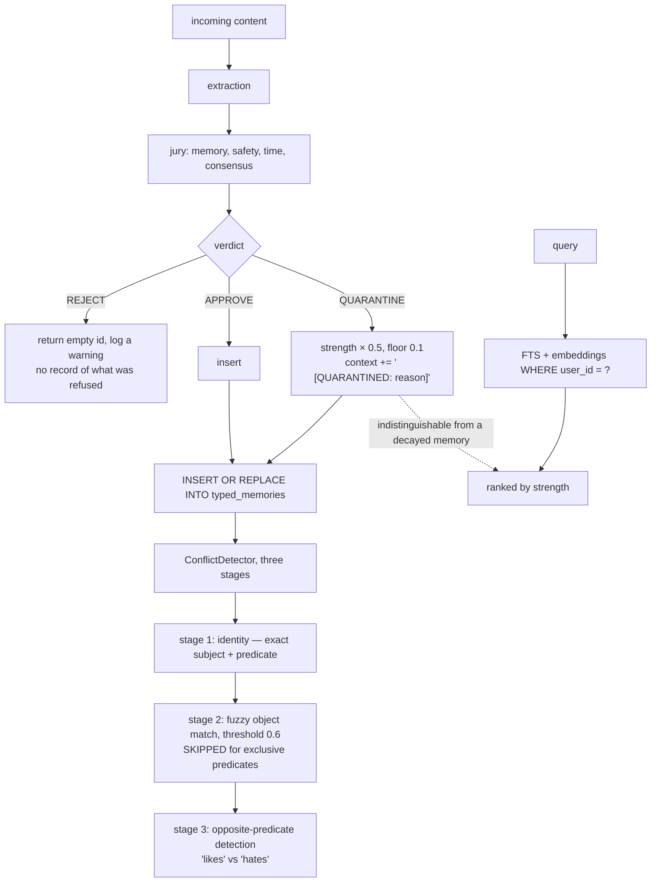

## 1. Executive Summary

PLTM is an MIT-licensed MCP server giving Claude Desktop persistent memory:
67,000 lines of Python, 136 advertised tools, a React dashboard, and a
one-command installer for macOS, Linux and Windows.

**The idea worth taking is in `src/reconciliation/conflict_detector.py`:**

> "Opposite predicate detection catches conflicts that LLM-based systems miss.
> Example: 'I like jazz' vs 'I hate jazz' — LLMs may see high semantic similarity
> and miss the conflict, but our rule-based approach explicitly detects opposite
> predicates."

That is a correct and useful observation about a structural blind spot. Two
statements that contradict each other are *near neighbours* in embedding space,
because contradiction requires shared subject and shared topic. A similarity
threshold therefore treats a contradiction and a corroboration identically. The
three-stage pipeline — identity match on subject + predicate, fuzzy object match
with a threshold, and an explicit exception that **skips the similarity filter
for exclusive predicates** so no conflict is filtered away — is the right shape
for the problem.

**The second mechanism is a four-judge jury on the write path** — memory, safety,
time and consensus judges, returning `APPROVE`, `REJECT` or `QUARANTINE`, with
the safety judge documented as "always-binding". A three-valued verdict where the
middle value means *stored but not trusted* is exactly the design this atlas
looks for.

**And it has nowhere to live.** `typed_memories` has no verdict column. A
quarantined memory is handled like this:

```python
elif decision.verdict == Verdict.QUARANTINE:
    logger.info(f"Jury QUARANTINED memory: {decision.explanation} — reducing strength")
    mem.strength = max(0.1, mem.strength * 0.5)   # Store with reduced strength
    mem.context = (mem.context + f" [QUARANTINED: {decision.explanation}]").strip()
```

A halved float and a marker appended to a free-text field. Nothing can query for
quarantined memories, nothing on the read path treats them differently from a
memory that simply decayed, and the reason survives only as prose inside the
content a model will read back as fact.

**The numbers need discounting**, section 10.

## 2. Mental Model

Text arrives, is extracted into memories, and a jury deliberates before anything
is stored. Conflicts against existing memories are detected by rules rather than
by a model. Retrieval is per-user, ranked by strength with decay.



## 3. Architecture

`src/` holds the engine: `core` (models, ontology), `storage` (`sqlite_store`
with `atoms` and `provenance`, `vector_store`), `memory` (`memory_types` with
`typed_memories`, `memory_jury`), `jury` (four judges plus an orchestrator),
`extraction`, `reconciliation`, `pipeline` (`memory_pipeline`, `write_lane`),
and `api`.

**There are two memory systems in the repository.** `atoms` +
`provenance` is a subject/predicate/object graph with an `UNIQUE(subject,
predicate, object, graph)` constraint; `typed_memories` is a flat row with
`strength`, `confidence`, `evidence_for`, `evidence_against`,
`episode_timestamp`, `success_count`, `failure_count` and consolidation fields.
`migrate_atoms_to_typed.py` sits at the repository root, so the migration is in
progress and both are live: the jury runs on `typed_memories`, the benchmark runs
on `atoms`.

Two housekeeping facts a reader will notice. `venv311/` — a Python virtual
environment — is committed. And two files named
`C__Users_alber_CascadeProjects_LLTM_CONSCIOUSNESS_SYNTHESIS_COMPLETE.md` and
`..._IMPROVEMENTS_NEEDED.md` sit at the root, Windows paths flattened into
filenames by a copy that went wrong.

## 4. Essential Implementation Paths

**Judge** — `src/jury/orchestrator.py`, `memory_judge.py`, `safety_judge.py`,
`time_judge.py`, `consensus_judge.py`, `base_judge.py`.

**Store** — `src/memory/memory_types.py` (`typed_memories` DDL `:168`, the jury
call and verdict handling `:253-280`, the insert `:280-289`).

**Detect conflicts** — `src/reconciliation/conflict_detector.py` (the three
stages and the exclusive-predicate exception).

**Retrieve** — `src/memory/memory_types.py` (`user_id` conditions `:364`, the FTS
join `:410`).

## 5. Memory Data Model

`atoms`: `id`, `atom_type`, `graph`, `subject`, `predicate`, `object`, a JSON
`metadata` blob, and denormalised `confidence`, `first_observed`,
`last_accessed`, under `UNIQUE(subject, predicate, object, graph)`.

`provenance` is the most complete provenance schema in this batch, and the
comment above it states the intent: *every claim must be traceable*. It carries
`claim_id`, `source_type`, `source_url`, `source_title`, `quoted_span`,
`page_or_section`, `accessed_at`, `content_hash`, `confidence`, `authors`,
`arxiv_id`, `doi`, `commit_sha`, `file_path` and `line_range`, with a foreign key
to `atoms` and an index on `claim_id`.

**No code inserts into it.** `INSERT INTO provenance` appears nowhere in `src`.
The schema names exactly the fields a serious traceability model needs — a quoted
span, a content hash, a commit SHA, a line range — and no writer exists.

`typed_memories` carries `strength`, `confidence`, `evidence_for`,
`evidence_against`, `episode_timestamp`, `emotional_valence`, `trigger`,
`action`, `success_count`, `failure_count`, `consolidated_from` and
`consolidation_count`. `episode_timestamp` alongside `created_at` is the raw
material for a bitemporal model, and no query filters on it as a validity
interval — only `episode_timestamp > ?` for recency.

## 6. Retrieval Mechanics

FTS5 with an embedding path and MMR, ranked by strength with decay.

**`user_id` is a genuine read-path predicate.** It appears as the first condition
in the filtered query builder (`conditions = ["user_id = ?"]`), in the FTS join
(`WHERE typed_memories_fts MATCH ? AND tm.user_id = ?`), and in the statistics
and existence queries. A stored key reaching the query is what the
`scope_enforced` mark certifies, and it is earned here.

Quarantined memories are returned like any other, ranked slightly lower because
their strength was halved once. A memory quarantined for a safety reason and a
memory that has simply not been accessed for a while are, to the read path, the
same thing.

## 7. Write Mechanics

The jury deliberates, then `INSERT OR REPLACE INTO typed_memories`.

**`REJECT` leaves nothing behind.** The handler logs a warning with the first 80
characters of the content and returns an empty string: *"Empty ID signals
rejection"*. There is no record keyed on the rejected value, so the same content
arriving again is judged again from scratch — and if the judges are
non-deterministic or the rules change, it can be admitted next time with nothing
recording that it was once refused.

**The jury's individual verdicts are discarded at the adapter.**
`convert_to_legacy_decision` maps a four-judge `SimpleJuryDecision` onto the older
`JuryDecision` shape and sets `memory_judge=None`, `safety_judge=None`, with the
comment "Individual judge verdicts not tracked in new system". The confidence
adjustment collapses to three constants — `+0.1` for approve, `-0.1` for
quarantine, `-0.3` for reject. Which judge objected, and on what grounds, does
not survive.

`SafetyJudge` is rule-based by design — "For MVP: Rule-based safety checks.
Future: Grammar-constrained LLM with Outlines" — matching SSN, credit-card,
email, password and US phone patterns. Naming the MVP status and the intended
successor in the docstring is the right way to ship a placeholder.

## 8. Agent Integration

An MCP server for Claude Desktop with 136 advertised tools, a curl-to-bash and
irm-to-iex installer that "clones the repo, creates a venv, installs deps,
downloads the embedding model, initializes the database, and auto-configures
Claude Desktop", a `health_check.py`, a React dashboard, Docker Compose, k8s
manifests and a monitoring directory.

136 tools against 26 test files is a wide surface on a narrow base, and the
README's own badges put the contrast side by side: `MCP tools 136` next to
`tests 11 passing`.

## 9. Reliability, Safety, and Trust

**Scope enforced — awarded**, per section 6.

**Trust state — withheld, and this is the near miss.** `QUARANTINE` is a real
third verdict with a real meaning, produced by a real deliberation, and it is
persisted as a halved float plus a bracketed string inside `context`. The mark
requires a discrete status as a *field*; a marker in free text cannot be queried,
cannot be filtered on, and worse, is read back to the model as part of the
memory's own text. Add a `verdict` column and a read-path filter and this becomes
one of the better trust models in the corpus.

**Tombstone — no**, per section 7.

**Audit log — no.** The jury's decision is a log line, not a row.

**Bitemporal, human review, negative eval — no.**

## 10. Tests, Evals, and Benchmarks

**No paper.** 26 test files under `tests/`, a dozen loose `test_*.py` scripts at
the repository root, and `REPRODUCE.md`.

The headline claims are "198/200 tests pass (99% accuracy)" and, in the conflict
detector's own docstring, "Accuracy: 100% on benchmark (vs 66.9% for Mem0
baseline)".

**These are not retrieval benchmark numbers.** `run_200_test_benchmark.py` is a
class called `ComprehensiveBenchmark` that constructs an in-memory SQLite store,
a rule-based extractor and the conflict detector, then runs 200 hand-written
assertions and prints `Accuracy: passed/total`. It is a unit-test suite whose
pass rate is being reported as accuracy.

`benchmarks/compare_with_mem0.py` then runs Mem0 against the same 200 cases and
calls it "apples-to-apples… the exact same 200-test benchmark". It is the same
test set, and the test set was written by the author of the system it scores, to
exercise the rules that system implements. **Scoring 100% on your own
specification is a tautology, and the other system's 66.9% measures how much of
this system's spec it happens to satisfy.** The mechanism may well be better than
Mem0 at opposite-predicate conflicts — the reasoning in section 1 suggests it
should be — but this comparison cannot establish it.

`REPRODUCE.md` is offered as independent reproduction and its first instruction
is `git clone https://github.com/yourusername/procedural-ltm` — a placeholder
account and a repository name that is not this repository's. As written, the
reproduction cannot be run.

One more small thing: the README carries an MIT badge, `pyproject.toml` declares
`license = {text = "MIT"}`, and there is no `LICENSE` file in the tree.

**I ran nothing.**

## 11. For Your Own Build

### Steal

- **Detect opposite predicates explicitly.** Contradictions are near neighbours
  in embedding space by construction — "I like jazz" and "I hate jazz" share
  subject and topic — so a similarity threshold treats a contradiction like a
  corroboration. A rule that knows `likes` and `hates` are opposites catches what
  cosine distance structurally cannot.
- **Skip the similarity filter for exclusive predicates.** If a predicate can
  have only one true object, every candidate is a potential conflict and
  filtering by string similarity first will drop the ones you most need to see.
- **Give the write path a three-valued verdict.** Approve, reject, quarantine —
  with the middle value meaning "stored, not trusted" — is a better vocabulary
  than a confidence float, and it is what the atlas's `trust_state` mark is for.
- **Make one judge always-binding.** A safety veto that no consensus can outvote
  is the right structure for the category where a majority is not the question.
- **Say when a component is an MVP and what replaces it.** "For MVP: Rule-based
  safety checks. Future: Grammar-constrained LLM with Outlines" tells a reader
  exactly how much to trust the current behaviour.
- **Design the provenance table the way this one is designed** — `quoted_span`,
  `content_hash`, `accessed_at`, `commit_sha`, `file_path`, `line_range`. Then
  write to it.

### Avoid

- **Do not store a verdict in a free-text field.** `context += " [QUARANTINED:
  …]"` cannot be queried, cannot be filtered, and gets read back to the model as
  part of the memory. A verdict needs a column and a read-path predicate.
- **Do not signal rejection by returning an empty string.** The refusal is not
  recorded anywhere, so the same content can be admitted on the next attempt with
  nothing remembering that it was once refused.
- **Do not discard which judge objected.** "Individual judge verdicts not tracked
  in new system" throws away the only information that makes a jury better than
  a single classifier.
- **Do not report a unit-test pass rate as accuracy.** 198/200 assertions passing
  is a statement about your code, not about your retrieval.
- **Do not benchmark a competitor on your own specification.** Cases written to
  exercise your rules will score your rules at 100% and anything else lower, and
  the number says nothing about either system on a third party's data. Use
  LoCoMo, LongMemEval, BEAM, or state plainly that the suite is a specification.
- **Check the reproduction instructions by running them.** `yourusername` and a
  repository name that does not exist are both caught by one attempt.
- **Do not commit `venv311/`.**

### Fit

The conflict detector is the part worth reading and it is self-contained: three
stages, a similarity threshold, an exclusive-predicate exception, and an
opposite-predicate table. That idea transfers to any system doing dedup or
correction by embedding similarity, which is most of this atlas.

The rest is a large surface — 136 tools, two parallel memory schemas mid-
migration, a dashboard, k8s manifests — on 26 test files, with the headline
numbers measuring the code against its own assertions. Treat the claims as
untested and the mechanism as interesting.

## 12. Open Questions

- **Which schema wins?** `atoms` + `provenance` and `typed_memories` are both
  live, with a migration script at the root and the jury wired to only one.
- **Was `provenance` ever written?** The schema is detailed enough that something
  must have been intended; no writer exists at this commit.
- **Does the jury run on every write path?** It was traced through
  `memory_types.py`; `pipeline/write_lane.py` and `memory_pipeline.py` also
  deliberate, and whether every entry point passes through one of them was not
  established.
- **What are the two failing tests of 200?** `REPRODUCE.md` reports 198/200 and
  does not say which.

## Appendix: File Index

**Conflict detection** — `src/reconciliation/conflict_detector.py` (the docstring
claim `:1-13`, the three stages `:26-40`)

**Jury** — `src/jury/orchestrator.py` (`convert_to_legacy_decision` `:16-45`,
the dropped per-judge verdicts `:42-44`), `src/jury/safety_judge.py` (the
always-binding docstring `:11-22`, `PII_PATTERNS` `:24-30`),
`src/jury/memory_judge.py`, `time_judge.py`, `consensus_judge.py`,
`base_judge.py`, `src/core/models.py` (`JuryVerdict` / `JudgeVerdict` `:63`,
`:72`)

**Storage** — `src/storage/sqlite_store.py` (`atoms` `:56-73`, `provenance`
`:78-97`), `src/storage/vector_store.py` (`atom_embeddings` `:68`),
`src/memory/memory_types.py` (`typed_memories` `:168`, the verdict handling
`:265-279`, the insert `:280-289`, `user_id` predicates `:258`, `:364`, `:410`,
`:522`, `:534`, the episodic recency query `:1064`)

**Pipeline** — `src/pipeline/memory_pipeline.py` (`deliberate_batch` `:93-97`),
`src/pipeline/write_lane.py`

**Claims** — `README.md` (the badge row), `REPRODUCE.md` (the placeholder clone
URL `:9`, the accuracy framing `:14`, `:62-66`),
`run_200_test_benchmark.py` (`ComprehensiveBenchmark` `:13-60`, the accuracy
print `:458`), `benchmarks/compare_with_mem0.py` (the apples-to-apples framing
`:1-12`)

**Housekeeping** — `venv311/`,
`C__Users_alber_CascadeProjects_LLTM_CONSCIOUSNESS_SYNTHESIS_COMPLETE.md`,
`C__Users_alber_CascadeProjects_LLTM_IMPROVEMENTS_NEEDED.md`,
`migrate_atoms_to_typed.py`

## History

**2026-08-09** — [`5146bfbfd2f210674da5a3b16c04ac0ddf6803f0`](https://github.com/Alby2007/PLTM-Claude/commit/5146bfbfd2f210674da5a3b16c04ac0ddf6803f0) — first reading. Screened before reading; the tree was read, never installed, and no benchmark was run.
