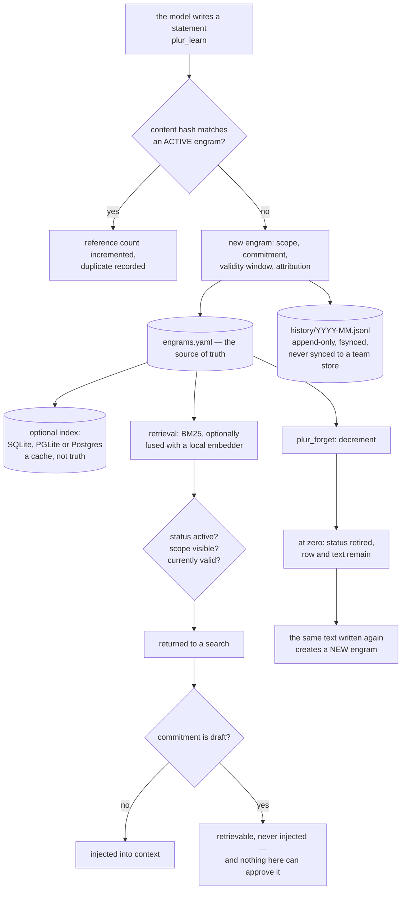

## 1. Executive Summary

PLUR is a local-first shared memory for coding agents — Apache-2.0, 927 commits
between 19 March and 8 September 2026 by thirteen authors, 66,632 lines of
TypeScript outside tests across ten packages, beside 82,289 lines of tests
holding 4,893 cases. The screen found three auto-run surfaces — two plugin
manifests and a hooks directory — one build-time execution point and twelve
unpinned surfaces; nothing was installed or run, and the read was made from a
full clone. The store is plain files under `~/.plur`, with `engrams.yaml` as the
source of truth and SQLite, PGLite or Postgres attachable as an index the code
describes as a cache rather than truth.

**Six of seven marks, and the one that decides the character of the system is
`trust_state`.** An engram carries a `commitment` — exploring, leaning, decided,
locked or draft — and `skipForApproval` returns true for `draft`
(`packages/core/src/inject.ts:172-173`), which the injection loop uses to skip
that engram in both its selection pass and its spreading-activation pass
(`:657`, `:697`). A draft is still retrievable and still searchable; it just
never reaches the model's context. The producer is agent-reachable: `plur_learn`
takes a `commitment` argument that flows into the persisted shape, and feedback
cannot launder the value because the transition function returns an unrecognised
state untouched.

The other five. `bitemporal` on a temporal block the schema calls bi-temporal
anchoring, with `valid_from` and `valid_until` beside `learned_at` and
`ingested_at`, filtered by the retrieval path and the injection gate
independently of the record timestamps. `scope_enforced` on a scope with two
read-side predicates, the stricter of which is exact membership carrying an
explicit rule in the source that an empty permitted list must match nothing —
*"a principal with no permitted scopes must see nothing. NEVER treat an empty
list as 'no filter'"*. `audit_log` on an append-only monthly JSONL of
twenty-one mutation event types, fsynced, in the store's own directory.
`human_review` on a tension queue where a person confirms, dismisses or resolves
a detected contradiction and the loser is retired. `negative_eval` on three
cases asserting a draft absent from a populated injection, one of them through
spreading activation.

Four findings sit against the design. **A retired engram cannot stop itself
returning, on purpose.** `_hashDedup` matches only active rows
(`packages/core/src/index.ts:1833`), and the codebase frames that as a feature
twice over — *"its content hash cannot resurrect it"* — with a committed test
titled *"retired engrams are excluded from dedup — new write creates new
engram"* asserting the new id differs
(`packages/core/test/reference-count.test.ts:149-155`). That is a deliberate
design choice and it is the reason `tombstone` is withheld. **Nothing here can
approve a draft.** The schema comment points at a separate enterprise repository
for the review-queue write sites, and the shipped dashboard is read-only, so
`draft` is a one-way state in this tree. **The direct correction path destroys
what it replaces.** `_updateEngramReturning` overwrites the row in place
(`:5923`) with no history event and no version bump, while the two
model-mediated paths both preserve the prior statement in a history event.
**The benchmark harness is not here.** The README says the harness is published
so every number can be reproduced, and names the separate repository that holds
it six lines later; a commit in July removed 2,238 lines including the corpus
importer from this tree.

## 2. Mental Model

A memory is **a sentence the model wrote and a set of judgements about it**.
The statement is stored verbatim — the only rewriting on the main path strips
tool-call envelope artifacts and derives an eighty-character summary. Everything
else on the engram is metadata about that sentence: who asserted it, how it was
arrived at, how sure the author is, when it holds, and who may see it.

Two independent gates decide what reaches the model. **Status** decides whether
an engram is retrievable at all; retired ones are not. **Commitment** decides
whether a retrievable engram may be injected; drafts are not. The separation is
the design: a draft can be found, cited in a review and argued about without
ever being presented to the model as something it knows.

Forgetting is a reference count. Each repeat of the same content increments a
counter; forgetting decrements it, and only at zero does the engram retire —
with its full text still in the file.



## 3. Architecture

Ten packages. `core` (39,629 lines) holds the schema, the stores, retrieval,
injection, feedback, tensions, packs and sync. `cli` (12,532) and `mcp` (5,625)
are the two human and agent surfaces; `dsh`, `claw`, `ui`, `migrate` are
smaller, and three Python packages adapt the store for Hermes and LangChain.

The storage layer is deliberately layered: `YamlPrimaryStore` reads and writes
the whole engram array, and the indexed stores mirror it into a table whose
`data` column holds the engram as JSON or JSONB with the queryable fields
promoted into columns. The scope filter is pushed down into each of them rather
than applied after loading.

### Deployment and ergonomics

- **What has to run:** Node. Nothing else — BM25 needs no model, and the ONNX
  embedder is optional and local.
- **Fully local and offline:** yes on the default path; the batch-dedup and
  failure-report paths call a model.
- **Hand-repairable:** entirely. The store is YAML a person can read and edit,
  and the indexes rebuild from it.
- **Install:** npm packages per surface, plus plugin manifests for two agent
  runtimes.

## 4. Essential Implementation Paths

- **Learn.** `packages/mcp/src/tools.ts:1125` sanitises the statement (`:1245`),
  checks the pin quota and calls into the core. `Plur.learn`
  (`packages/core/src/index.ts:2850`) asserts writability, resolves the validity
  window (`:2858`), takes the store lock, runs the content-hash dedup
  (`:2901-2904`), mints an id, builds the shape (`:2948`), appends (`:3119`),
  syncs the index (`:3123`), appends the history event (`:3124-3129`) and
  writes provenance.
- **Dedup.** `_hashDedup` (`:1829-1838`) matches on `status === 'active'` and
  the content hash; a hit increments the reference count instead of writing.
- **Retrieve.** `packages/core/src/fts.ts:448-488` scores BM25 with k1 1.2 and
  b 0.75; `packages/core/src/hybrid-search.ts:135-197` runs the lexical leg on a
  rewritten query and the embedding leg on the original, widening both limits,
  and merges by reciprocal rank at k=60 (`:63-80`).
- **Filter.** `Plur._filterEngrams` (`:4777-4878`) applies status (`:4837`), the
  scope allow-list (`:4843-4844`), a domain prefix, scope visibility (`:4861`),
  temporal validity (`:4872`) and a minimum strength.
- **Inject.** `packages/core/src/inject.ts` selects and spreads, skipping
  drafts at both stages (`:657`, `:697`) and expired engrams at `:140-153`.
- **Correct.** Three paths: `_updateEngramReturning` (`:5905-5928`) overwrites;
  `plur_report_failure` (`:8020-8084`) has a model rewrite a procedural
  statement and writes the old text into a `procedure_evolved` event with a
  version bump and a previous-version reference; the batch dedup
  (`packages/core/src/learn-async.ts:237-300`) records the old and new statement
  with the deciding model as the actor.
- **Forget.** `Plur.forget` (`:6249`) decrements the reference count and at zero
  sets status retired (`:6427-6432`), optionally rewriting the rationale, and
  appends a retirement event with the before and after counts.
- **Adjudicate.** `packages/mcp/src/tools.ts:3880-3897` and
  `packages/cli/src/commands/tensions.ts:113-129` confirm, dismiss or resolve a
  tension; a resolve retires the loser.

## 5. Memory Data Model

The engram schema is 553 lines of Zod (`packages/core/src/schemas/engram.ts`).
Beyond the statement it carries: lineage (source, derivation count, pack,
abstract, derived-from), classification (a knowledge type with a memory class
and a cognitive level, a domain, tags), activation (retrieval and storage
strength, frequency, last accessed), a relation block with broader, narrower,
related, conflicts, supersedes and superseded-by, weighted associations,
knowledge anchors, dual coding with an example and an analogy, provenance with
an origin, a chain, a licence and a **reserved** signature whose algorithm the
schema says is not yet specified, an attribution block naming the asserting
runtime, model and tool, a claim class, feedback and usage counters, and
optional temporal, episodic, exchange and insight blocks.

**Temporal:** `learned_at`, `valid_from`, `valid_until` and `ingested_at` beside
`created_at`, `updated_at` and each source's `stored_at`. `bitemporal` earned.

**Trust:** commitment and status, both filtering. `trust_state` earned.

**Scoping:** a free-form scope with two predicates. `scope_enforced` earned.

**Tombstone:** withheld — see section 9.

**A status value with no writer.** The `status` enum admits `candidate` and
`dormant`, and the schema says of them: *"'dormant' and 'candidate' are NOT
assigned by any code today"* (`:352-354`), which a search confirms. The
consequence is that `plur_promote`, a shipped MCP tool advertised as activating
candidate engrams, has nothing this codebase can produce to act on. Separately
`candidates.yaml` is allocated and synced with the sync module noting it has no
in-core writer.

## 6. Retrieval Mechanics

BM25 with the standard constants over a rewritten lexical query, optionally
fused with a local ONNX embedding search over the original query. Fusion is
reciprocal rank at k=60, with the lexical leg fetching three times the limit and
the embedding leg twice, widened to five and three times for queries the system
classifies as aggregations.

**There is no relevance threshold in either leg**, and the code contains a
comment that reasons as though there were one — treating an empty embedding
result as meaning no neighbours cleared a threshold, when the embedding search
returns the top N regardless of score and an empty result can only mean an empty
corpus or an unavailable embedder. The fusion score is surfaced deliberately so
that a caller can apply a cutoff.

**Failure modes.** The embedder being unavailable degrades to BM25 silently,
which is the right default for a local-first tool. A draft is retrievable and
uninjectable, so an agent that reads search results directly sees something the
injector would have withheld. And the index stores are caches: a stale index is
a stale answer, with the YAML still correct.

## 7. Write Mechanics

**The model writes the sentence.** No summariser stands between the agent's
words and the file, which is the point of a store whose selling line is that
memory is text you can read rather than weights you cannot. The regex-based
ingest path captures verbatim groups; only the batch and failure-report paths
put a model between input and storage, and both record what they replaced.

**Repetition is a counter, not a duplicate.** The same content within the same
scope increments a reference count. Forgetting decrements it. That makes
`plur_forget` a vote rather than a delete, which is defensible, and it means a
single forget on a thrice-learned engram changes nothing visible.

**What the correction story does not do.** The path most likely to be used from
a library — the direct update — replaces the statement with no record that it
ever said anything else, while the two paths that need a model both preserve the
prior text. The version and previous-version fields exist on the schema and only
one of the three paths sets them.

### Operational cost

- A write is a YAML rewrite of the array, an index upsert and a JSONL append.
- A read is BM25 in process, optionally an ONNX pass, no network.
- The audit history grows monthly and is never pruned or synced.

## 8. Agent Integration

43 MCP tools, of which about a dozen write. The model's path to memory is
injection rather than a recall call — the injector selects, spreads activation
over associations and assembles a block — with the draft gate and the validity
gate applied inside that assembly.

The human surfaces are the CLI, the YAML file itself, and a dashboard that is
read-only by design: one route renders and a single POST reveals a folder,
documented as writing nothing and bound to loopback.

One naming issue is worth flagging for anyone reading the tool list: session end
takes a parameter called engram suggestions and writes them straight through the
learn path with no approval step.

## 9. Reliability, Safety, and Trust

**Trust state — awarded.** A discrete state that withholds from injection while
leaving the engram retrievable, produced through an agent-facing argument,
enforced inside the injector, and pinned by three tests. The caveat is
substantial and belongs in the same paragraph: **nothing in this repository
lifts it.** The schema points at a separate enterprise repository for the
review-queue write sites, and the shipped dashboard cannot write. A draft
written here stays a draft.

**Bitemporal — awarded.** Two axes with producers on each and independent
filters on both the retrieval and the injection path, including an expiry that
can be parsed from the statement text and is echoed back to the caller rather
than applied silently.

**Scope — awarded.** Two predicates, one segment-aware so a project whose name
shares a prefix with another is excluded rather than matched, and one exact
membership whose empty case is documented in the source as a security rule and
asserted by a test.

**Audit log — awarded.** Append-only, fsynced, twenty-one event types, in the
store's own directory, with a reader tool. One property worth stating: the
history directory is not in the sync path, so a store pushed to a team carries
the engrams without the record of how they got there.

**Human review — awarded.** A person confirms, dismisses or resolves a
contradiction and the resolution retires the loser. This is adjudication of
memory content, and the dashboard is correctly not counted as it writes nothing.

**Negative evaluation — awarded.** Three draft-gate cases with positive controls
in the same assertion, including one through spreading activation, plus scope
and validity exclusions.

**Tombstone — withheld, and it is a deliberate design decision rather than an
omission.** Retirement is soft: the row and the full statement stay in the file,
which is the right choice for a store meant to be read by humans. But the
content-hash dedup matches only active rows, so the retired text does not block
its own re-assertion. The codebase states this twice as a benefit, and a
committed test asserts that re-learning a forgotten statement produces a new
engram with a new id. The mark asks for a record keyed on the value that a later
write consults; here the record exists and the write path deliberately looks
past it.

**What the delete story promises and does not do.** The tool table describes a
retired memory as eventually pruned, and a comparison page describes erasure as
a real file delete a user can watch happen. No pruning of retired engrams exists
in the tree; the only deletion of an engram row is an outbox cleanup after a
successful remote push. Erasure is a status flip, and a person who wants the
text gone edits the YAML.

## 10. Tests, Evals, and Benchmarks

4,893 cases in 396 files and 82,289 lines against 66,632 lines of source, with
dedicated adversarial, meta and fixture directories under the core package's
tests. Exclusion assertions number 337, concentrated in named files for the
draft gate, scope pushdown, read-side visibility, supersession, validity
instants and the pinned quota.

**The benchmark harness is in a different repository, and this one says so.**
The README's benchmark section opens by saying the harness is published so every
number can be reproduced, and six lines later names `plur-ai/plur-bench` as the
source of truth for every figure the project publishes. A commit on 8 July 2026
removed the in-repo harness — 2,238 lines across a runner, a per-question
protocol, its tests and the LongMemEval corpus importer — and the `benchmark/`
directory now holds one file, a latency micro-benchmark for branch comparison.
The data and result directories are gitignored, and the project's contributor
notes say result JSONs are no longer committed here.

Two things follow, and both are the project's own words rather than an inference.
The only measurement this tree can show is an n=30 fixture run reported at
80.0% R@5 in a dated benchmark document, against README headline figures of
92.2% to 97.6% at n=500. And a self-audit document in `docs/reports/` states of
an earlier figure: *"The raw run artifact for the 86.7% / 93.3% measurement is
not archived in this repository"* and *"the claim is widely propagated, the
artifact is not."* That document's own remediation instructions point at the
runner and the result file the July commit deleted.

The honest summary for a reader: the harness is published, just not here, and
nothing in this checkout reproduces a published number.

## 11. For Your Own Build

### Steal

- **Separate retrievable from injectable.** A state that keeps an engram
  searchable while withholding it from the model's context is the cheapest
  review mechanism there is, and it is four lines in the injector.
- **Enforce the gate in the injector, not in the caller.** Every path that
  assembles context passes the same predicate, including the spreading-activation
  pass that is easy to forget.
- **Make the empty grant match nothing, and write the reason in the source.**
  The comment saying never to treat an empty permitted list as no filter is the
  kind that survives a refactor by someone who did not write it.
- **Append the mutation history beside the store and fsync it.** Twenty-one
  event types with an actor and a reason cost one append per write.
- **Echo a parsed expiry back to the caller.** Silently inferring a validity
  window from statement text would be a trap; saying what was inferred is not.
- **Count references instead of deleting.** A memory learned three times and
  forgotten once should not disappear.

### Avoid

- **A dedup that looks past what you retired.** Whether that is right depends on
  whether forgetting means *this was wrong* or *I do not need this now* — the
  choice is defensible, but the two readings need different mechanisms and only
  one of them is built.
- **A withholding state with no way to lift it in the same repository.** A draft
  that nothing here can approve is a one-way door, and the pointer to another
  repository is not usable by a reader of this one.
- **A correction path that overwrites without a record**, beside two others that
  preserve it. The one most likely to be called from a library is the one that
  forgets.
- **A status value nothing assigns**, and a shipped tool whose whole purpose is
  to act on it.

### Fit

Right if you want an agent's memory to be plain text you can read, diff and edit,
shared across several MCP clients, with no service to run and no model required
on the default path. The draft gate, the scope rules and the audit history are
all well built. Wrong if you need a rejected statement to stay rejected, an
in-repo way to approve what was drafted, or to reproduce the published retrieval
numbers from this checkout.

## 12. Open Questions

- What approves a draft outside the enterprise repository? The gate is enforced
  here and the lift is not, which leaves the mark's most useful half elsewhere.
- Should retirement block re-assertion? The current answer is deliberate and
  tested; the alternative needs a second state meaning *judged wrong* rather
  than *not needed*.
- Will the direct update path gain a history event? The two model-mediated paths
  already write one, and the version fields exist on the schema.
- What removes a retired engram? The tool description promises pruning and
  nothing implements it.

## Appendix: File Index

| Path | Lines | What it holds |
| --- | --- | --- |
| `packages/core/src/schemas/engram.ts` | 553 | The engram schema; the temporal block (141-146), the unassigned status values (352-354), the reserved signature (56-57), the enterprise pointer (538) |
| `packages/core/src/index.ts` | — | `learn` (2850), `_hashDedup` (1829-1838), `_filterEngrams` (4777-4878), `_updateEngramReturning` (5905-5928), `forget` (6249-6457), the failure-report rewrite (8020-8084) |
| `packages/core/src/inject.ts` | — | `skipForApproval` (172-173), the two skip sites (657, 697), the validity gate (140-153) |
| `packages/core/src/history.ts` | — | The event union (7), the record shape (26-40), `appendHistory` (58-112) |
| `packages/core/src/scope-util.ts` | — | `isScopeWithin` (70-74), `makeVisibilityPredicate` (108-116), `scopeAllowFilter` and its empty-list rule (126-141) |
| `packages/core/src/fts.ts`, `hybrid-search.ts`, `embeddings.ts` | — | BM25 (448-488), RRF at k=60 (63-80), the optional ONNX search |
| `packages/core/src/storage.ts`, `store/yaml-primary-store.ts` | — | The store root layout (29-40) and the YAML source of truth |
| `packages/mcp/src/tools.ts` | — | 43 tools; `plur_learn` (1021), `plur_forget` (1822), `plur_tensions` (3855-3897), `plur_promote` (3781) |
| `packages/cli/src/commands/tensions.ts` | — | The confirm, dismiss and resolve commands (51-53, 113-129) |
| `benchmark/micro.ts` | 313 | The only file in `benchmark/`: a latency micro-benchmark |
| `packages/core/test/draft-approval-gate.test.ts` | — | The three draft exclusions (38-67) |
| `packages/core/test/reference-count.test.ts` | — | The retired-dedup behaviour, asserted (149-155) |
| tests | 82,289 in 396 files | 4,893 cases, 337 exclusion assertions |

**Searches recorded for the negative claims**

```sh
rg -n "status\s*[:=]\s*'candidate'" --glob '*.ts' packages/*/src     # 0: declared and never assigned
rg -n "status\s*[:=]\s*'dormant'" --glob '*.ts' packages/*/src       # 1, a comment; no assignment
rg -i 'tombstone' --glob '*.ts' packages                             # 1, a test title about soft retirement
rg -i 'prune' --glob '*.ts' packages/*/src                           # no pruning of retired engrams
ls benchmark/                                                        # one file: micro.ts
ls benchmark/run.ts benchmark/results/baseline-main-hybrid.json      # both absent; the self-audit points at them
git show 19b74b5 --stat                                              # the harness removal: 2,238 lines
```

## History

**2026-09-08** — [`d005139ee82eb124466472190302a9bc1770693b`](https://github.com/plur-ai/plur/commit/d005139ee82eb124466472190302a9bc1770693b) — first reading, at the head of `main`, on a commit from the same day. Screened before anything was read: three auto-run surfaces (two plugin manifests and a hooks directory), one build-time execution point, twelve unpinned surfaces; nothing was installed or run, and the read was made from a full clone. Six marks. `trust_state` rests on a draft commitment enforced inside the injector at both its passes, with the caveat that nothing in this repository can approve one. `bitemporal`, `scope_enforced`, `audit_log`, `human_review` and `negative_eval` rest on the temporal block and its two independent filters, the segment-aware and exact-membership scope predicates, the fsynced monthly JSONL, the tension adjudication, and the three draft-gate exclusions with controls. `tombstone` is withheld on a decision rather than an omission: the dedup deliberately looks past retired rows and a committed test pins that. The benchmark position was verified rather than repeated — the harness was removed from this tree in `19b74b5` and lives in a separate repository the README names, so no published number is reproducible from this checkout, which the project's own self-audit document also states. The reading covers the engram schema, the write and dedup paths, retrieval and injection, the scope predicates, the history log and the tension queue; the packs and exchange subsystems, the sync outbox, the migration package and the Python adapters were treated as context.
