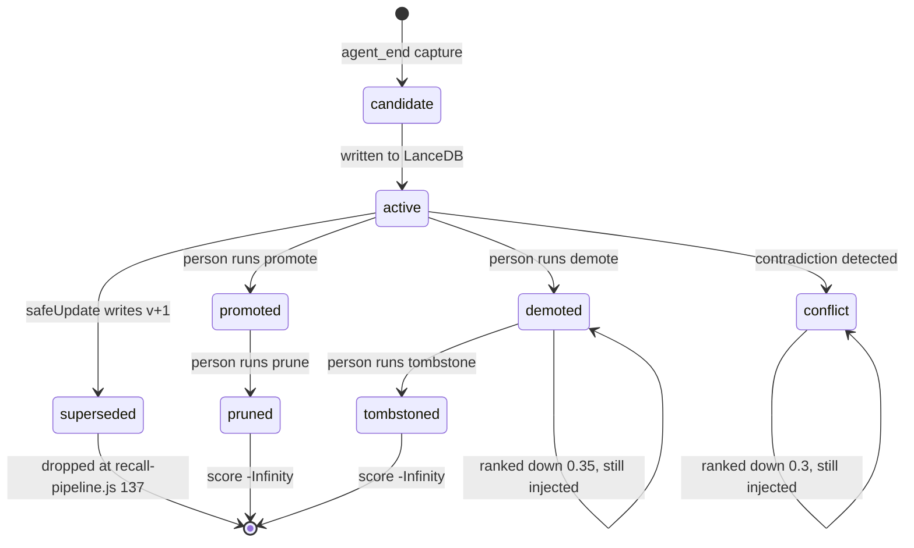

## 1. Executive Summary

PLUR1BUS is an MIT-licensed memory plugin for OpenClaw, at release 7.4.0 — around 10,900 lines in `index.js`, 61,000 across `lib/`, and more again in `tests/` and `test/`, which is the first unusual thing about it: the test suite is larger than the implementation it covers, across 361 test files.

The second unusual thing is the ratio of care to surface. `openclaw.plugin.json` declares forty-seven top-level configuration groups, covering dreaming, emotional state, persona voice, an Obsidian vault bridge, skill mining, reminders, a semantic lens, conversation reactivation, and a proactive governor. Underneath that is a correction path — `lib/safe-update.js`, 414 lines — that is more disciplined than most of the dedicated memory systems in this atlas: a content change is refused unless the caller supplies both an update source and a quoted piece of evidence, the replacement row is written and made durable *before* the old row is marked superseded, and the whole transition is appended to a reconsolidation event log keyed by an idempotency hash.

The most interesting single line in the repository is `safe-update.js:357`. Before a content change is accepted, the new embedding is compared against the old one and the update is rejected if the cosine distance exceeds 0.45 — a machine refusing to let a "correction" quietly replace a memory with something that means something else. It is a genuinely novel gate, and the only caller in the tree, the user-facing `/correct` command at `index.js:6422`, passes `skipDriftGate: true` — deliberately, with the reasoning written at the call site: the gate throws rather than degrades, a large correction is exactly what a user typing `/correct` intends, and the confirmation dialog shows the old and new text in full before anything is written. The measured drift is still recorded on the reconsolidation event. A gate that is off by argument is a different thing from a gate that is off by accident, and this is the first.

Where it is strongest: scope. `checkAccess` (`lib/acl-middleware.js:103`) denies by default, denies on a missing owner, denies on a conflicting ownership tuple, and is applied as a filter on the read path in three places. The tests assert the denials rather than the permissions.

Where doubt acts, it now acts in two places and is held back in a third **on a
measurement rather than an omission**. `scoreNeoRecallItem` returns `-Infinity`
for `demoted` alongside the deletion states, so a record a person has demoted
cannot reach the prompt at all; the claim-level epistemic status does the same
for `invalidated` at all three read layers (`recall-pipeline.js:157`,
`neo-arch.js:1385`, and the SQL clause at `db-adapter.js:519`). `conflict` is
still a ranking penalty, and the comment that keeps it one is the interesting
part — the detector is *"an unvalidated LLM"*, a live probe on 16 August 2026
found 4,017 newest-revision records carrying `conflict` (2,505 on a single
agent) *"with no resolve path that clears the status"*, and a twenty-row sample
was not pairwise contradiction. Hard-filtering on that signal would have
withheld thousands of records on a flag the system cannot yet clear. The
distinction the code draws — withhold on a state a person set, rank on a state a
model guessed — is the right one, and it is drawn with the numbers in the
source.

Two mechanisms this atlas looks for are present and unusually well-tested. A claim carries a **real-world validity window** — `validFrom`/`validUntil` on the row, tracked separately from `createdAt`/`updatedAt` and queryable as-of through a `validAt` recall parameter, so "where did he work in 2025" is a different query from "what did we record in 2025". And a **value-keyed tombstone** survives a `/forget`: a content fingerprint is written to a durable append-only registry and checked as step zero of every capture, so the forgotten sentence cannot be silently re-stored.

## 2. Mental Model

There are two stores and they hold different kinds of thing.

**LanceDB cards** are the memories proper — one table per agent, a row per card. A card's life is short to describe: it is `active`, or it has been superseded by a newer version that names it in `previousVersion`. Retrieval is unforgiving about this. `lib/recall-pipeline.js:137` drops any entry whose status is set and is not `active`, so a superseded card is not ranked down, it is gone from the read path.

**Neo records** are the JSONL layer — turn journal, memory candidates, behaviour cards, graph edges, dream diary, episodes — and they carry the epistemics. Each record has a `status` from `NEO_STATUSES` (`lib/neo-arch.js:62`):

```js
["candidate", "active", "promoted", "demoted", "conflict", "pruned", "tombstoned"]
```

and an `origin.trustLevel` from `NEO_TRUST_LEVELS` (`lib/neo-arch.js:52`), running `untrusted → user_asserted → assistant_asserted → tool_observed → validated → curated`.

What moves a record between states is a person. `/plur1bus memory promote|demote|prune|tombstone <id>` (`index.js:5961`) requires authorization, calls `transitionRecordStatus`, and appends the transitioned record back to the JSONL. There is no automatic promoter; a candidate becomes promoted because someone typed the command.

The consequence of each state is where the design divides, and the line has
moved. `scoreNeoRecallItem` returns `-Infinity` for `pruned`, `tombstoned` and
`demoted` — three states genuinely withheld, and the third is there because a
person set it. `conflict` stays in the arithmetic below on the reasoning quoted
in section 1. Everything between is arithmetic:

```js
const trustBoost = ({ curated: 0.3, validated: 0.25, user_asserted: 0.18,
  tool_observed: 0.18, assistant_asserted: -0.2, untrusted: -0.3 })[item.origin?.trustLevel] ?? 0;
…
const penalties = (item.origin?.role === "assistant" ? 0.2 : 0)
  + (item.status === "demoted" ? 0.35 : 0)
  + (item.status === "conflict" ? 0.3 : 0)
  + (item.stale === true ? 0.15 : 0);
```

**The exits from `conflict` are authorized and narrow, which is the right shape
for a status a model assigns.** Two subcommands sit behind the same
authorization check as `promote`/`demote`/`prune`/`tombstone`
(`index.js:5867`). `/plur1bus curation resolve <id> keep|drop`
(`lib/curation-resolve.js`, dispatched at `index.js:6940`) moves one record and
appends a `curation.resolve` event. `/plur1bus curation drop-injected`
(`lib/drop-injected-conflicts.js`, `index.js:6959`) is the bulk form, and it is
bounded twice rather than trusted: `previewDropInjected` shows the set before
`applyDropInjected` touches it, and the apply path refuses any record whose
`status !== "conflict"` or whose text does not satisfy `isInjectedContextText`
(`:104`), so the bulk verb cannot reach a record the narrow predicate does not
already describe. Neither auto-resolves: a `conflict` a person never looks at
stays a penalty forever, which is the honest cost of leaving an unvalidated
detector's output in the ranking rather than in a filter.

So the neo statuses now split three ways rather than two: the deletion states
and `demoted` withhold, `conflict` and the trust ladder rank, and the split
tracks who or what set the flag. A record a person demoted is gone from the read
path; a record an LLM detector flagged as contradicting another is ranked down
and can still reach the prompt, carrying its status in the rendered line, which
is the difference between a model that can weigh the flag and one that cannot see
it.

The exception lives on a different axis. Alongside the neo status is a claim-level **epistemic status** (`lib/epistemic-status.js`) — `untrusted → observed → corroborated → trusted → disputed → invalidated`, explicitly orthogonal to *who* asserted a memory (`origin.trustLevel`) and to its numeric `confidence`. Most of its values are a ranking boost (`trusted +0.25 … disputed −0.4`), but `invalidated` is a hard filter, dropped on the read path at `recall-pipeline.js:157`, given `-Infinity` at `neo-arch.js:1385`, and excluded in SQL at `db-adapter.js:519` (`epistemicStatus != 'invalidated'`). It withholds rather than ranks, as `demoted` now does on the neo axis, and the transitions into `trusted` and `invalidated` require an authorized actor, so a memory cannot promote or condemn itself. A conservative merge rule (`combineEpistemicStatusForMerge`) takes the lower of two inputs, so a weakly-trusted memory cannot launder its way up by being merged with a trusted one.

**Which copy of a record the scorer sees is itself a design decision here, and it is the one that makes the rest of the vocabulary mean anything.** The JSONL stores are append-only event logs: `transitionRecordStatus` appends a fresh line under the same id rather than replacing the old one, so a record that has moved to `demoted` exists on disk twice, once in each state. `routeNeoRecall` (`lib/neo-arch.js:1419`) deduplicates by id and keeps the **newest revision**, ordered by `updatedAt` — the field a transition sets — while preserving first-appearance order so the `itemIndex` tiebreak below stays stable. The helper that dates a revision, `neoRevisionTimeMs` (`:1412`), carries a note on why the existing `recordTimeMs` will not serve: it reads `startTime`/`createdAt`, which are identical across every revision of one record, so it cannot tell two revisions apart. An undated record sorts to `-Infinity` so any dated revision beats it and the comparison never lands on `NaN`.

Read against an append-only store, that is not a detail. Keeping the first line seen means scoring the record as it was *before* the transition, which would apply the `active` arithmetic to a record a person had just demoted — and a status penalty computed against the wrong copy is not a weakened penalty, it is no penalty. `tests/neo-status-transition-dedupe.test.js` fixes the arithmetic to a number: `active=0.371` against `demoted=-0.116` at a live `minScore` of `0.08`, so the two copies fall on opposite sides of the admission threshold.

The rendered line carries the status the penalty was computed from. `formatNeoRecallContext` emits `lane`, `category`, `trust`, `id`, `score` and `status` on each `<memory-record>`, which matters because the memory prompt supplement tells the model to prefer `active` and `promoted` over conflicting cards — an instruction that can only be followed if the distinction is in the payload.

One state transition is not epistemic at all and is worth naming here because it protects the whole loop. Text that PLUR1BUS itself injected into a prompt — recall blocks, temporal context, status reminders, cron output — is matched against a marker list and refused as a capture candidate (`isInjectedContextText`, `lib/neo-arch.js:176`, applied at `neo-arch.js:1199` and `:1242`). Without it, recall output becomes next turn's memory, which the comment above the marker list dates to a performance analysis on 29 May 2026.



## 3. Architecture

An OpenClaw v6 plugin, loaded from `index.js`, requiring Node ≥ 22.5 and a running OpenClaw gateway. Nothing else has to be stood up: LanceDB is embedded, the neo store is JSONL on disk, and the caches use the `node:sqlite` module built into Node rather than a dependency.

- **`index.js`** (9,292 lines) — plugin entry, hook registration, chat commands, and the wiring between every subsystem below.
- **`lib/`** (206 files, 54,781 lines) — `recall-pipeline.js` (1,903), `neo-arch.js` (2,356), `obsidian-control-room.js` (3,918) and `obsidian-bridge.js` (2,035) dominate; `safe-update.js`, `acl-middleware.js`, `memory-history.js` and `contradiction-detector.js` carry the correction path.
- **`lib/jobs/`** — fifteen background jobs: daily consolidation, garbage collection, conflict resolution, skill mining, critical-push classification, memory compaction, reflection.
- **`lib/dreaming/`** — `light-dream.js`, `rem-dream.js`, `dream-narrative.js`.
- **`patches/apply-cron-plugin-direct-dispatch.mjs`** — see below.

**Storage.** LanceDB tables per agent under `{baseDbPath}/{agentId}/` (`lib/db-adapter.js:312`), so agent isolation is a directory boundary before it is a query filter. Alongside: eleven JSONL files and four JSON files per workspace in the neo store, an optional SQLite embedding cache and LLM result cache, and an optional Obsidian vault the bridge keeps in sync as Markdown.

**Retrieval stack.** Vector search over LanceDB with a lexical fallback when the embedder is not ready, graph hydration of neighbouring cards (`hydrateGraphResults`, `recall-pipeline.js:816`), and two additive passes — a precomputed semantic lens and conversation reactivation — that append to a recall result and, per `AGENTS.md`, must never replace it. Both are off by default and both carry a 50 ms hard timeout.

**Embeddings** come from OpenAI or an optional local `@huggingface/transformers`. A key is not required to store a memory: the adapter falls back to text search when embedding fails.

### Deployment and ergonomics

Install is `npm install` into an OpenClaw installation, and this is where an operator should look before anything else. `package.json` declares:

```json
"postinstall": "node scripts/setup-feature-crons.mjs || true"
```

That script does not only register cron jobs. Before reading or mutating any cron it calls `applyCronPluginDirectDispatchPatch`, which resolves the *host's* OpenClaw dist directory and patches it, because the plugin needs a dispatch path the host does not offer. The script's own header states the contract — it must never fail an install, and it exits 0 whatever happens — so a patch of another package's installed code happens during `npm install`, best-effort, and reports success either way. It is not concealed: the file is 300 lines of readable planning code, it is listed in `package.json`'s `files`, and `tests/cron-plugin-direct-dispatch-patch.test.js` covers it. It is still a memory plugin editing its host at install time — and it can now be told not to. `PLUR1BUS_SKIP_HOST_PATCH=1` is honoured by both `scripts/setup-feature-crons.mjs` and `scripts/install-memory-system.sh`, has its own test (`tests/host-patch-skip.test.js`), and is documented in the README as completing the install *"without writing into the OpenClaw dist tree"*. The patch remains the default, so the reader who installs without reading still gets it; what changed is that a reader who objects has a switch rather than a fork.

The store is human-readable and repairable by hand: JSONL and Markdown for everything except the LanceDB tables, which is a real operational advantage when a background job has done something unexpected. `scripts/repair-installed-plugin.mjs` and `lib/memory-doctor.js` exist for when it has.

## 4. Essential Implementation Paths

### Capture — `index.js:6754`

`api.on("agent_end", …)` hands the turn to `runtimeScheduler.enqueueCapture(agentId, …)` with an abort signal. Capture is per-agent queued and runs after the turn ends, so the model's reply is never waiting on it. Background turns are flagged and treated differently, which is what stops a cron-triggered agent run from writing memories about itself.

### Correction — `lib/safe-update.js:246`

The most carefully built path in the repository, in order:

1. **Refuse non-active rows.** A superseded memory cannot be updated; the chain only grows at the leaf.
2. **Validate the ownership tuple** before any read or write, requiring the binding that the row's own scope demands.
3. **Demand evidence.** `validateUpdatePatch` throws unless a text or summary change carries both `evidence.updateSource` and `evidence.updateEvidence`.
4. **Check idempotency** — a SHA-256 over id, source, evidence and the patched fields, looked up in the reconsolidation event log, so a retried correction is a no-op rather than a second version.
5. **Demand a new vector.** A text change without `patch.vector` throws: *"The embedding must reflect the new content."* This closes the failure where a corrected memory keeps ranking under the old text's query.
6. **Gate on semantic drift** (`safe-update.js:355`) — cosine distance over 0.45 is rejected outright.
7. **Store the new version first, supersede second** (`:373`, `:377`). The comment is worth reading in full: storing first means a crash leaves both versions active — "a recoverable fork, never a loss" — whereas superseding first would point the old row at an id that was never written.
8. **Rewrite graph edges** onto the new id, then **append the event** with the action, the source, the evidence, the confidence and the measured drift.

### The drift gate's two callers — `index.js:7653` and `lib/jobs/apply-conflict-resolution.js`

`/correct <old> to <new>` runs a confirmation token exchange, then calls `safeUpdate` with `updateSource: "telegram:/correct"`, an evidence string, and `skipDriftGate: true` — the one place in the tree outside a test where the flag is set.

The reasoning sits at the call site rather than in a commit message: `/correct` is a nonce-confirmed user action, the confirmation dialog shows old and new text in the clear, so high semantic drift there is intended and consented to, and the gate would block a legitimate large correction with an exception rather than a warning. The drift is still computed and written onto the reconsolidation event as `semanticDrift`, so switching the gate off costs the measurement nothing.

The gate does fire on the other caller, which is the automated path it was written for. `applyConflictViaSafeUpdate` (`lib/jobs/apply-conflict-resolution.js`) refuses outright unless `opts.confirm === true`, then calls `safeUpdate` **without** the skip flag; when the gate throws *"Semantic drift too high"* the apply catches it and returns `{ok: false, reason: "review_only"}` rather than writing. So a conflict resolution the detector rated high-confidence still cannot rewrite a card that has drifted too far from what it replaces — it is downgraded to something a person must look at. That is the shape a drift threshold wants: skipped where a human has confirmed the exact text, enforced where a job proposes one. Consolidation and dreaming still do not call `safeUpdate` at all, so the gate guards the conflict path and not those.

The confirmation dialog is the part worth copying. Target resolution is fuzzy — candidates are resolved without a minimum score, and "unambiguous" means only that the top match beats the second by more than 0.15 — while `safeUpdate` replaces the entire text. A prompt naming an 80-character title cannot tell a user which memory they are about to overwrite, so it renders the stored text and the replacement at 300 characters each. The same value carries into provenance: `payload.oldText` holds the stored content being replaced rather than the search term that found it, and `updateEvidence` builds its evidence line from that.

### Scope — `lib/acl-middleware.js:103`

`checkAccess(ctx, memory)` returns `{allowed, reason}` and denies with a stable reason code on: no context, no memory, an unknown scope value, a requester with no agent id, an invalid or conflicting ownership tuple, a private row with no owner, a workspace row with no workspace, and a user row whose principal is not a `user:v1:<sha256>` string. Every path that is not an explicit match is a denial.

It is applied on the read path at `lib/db-adapter.js:361`, `:454` and `:474` (query, search, get), at `lib/recall-pipeline.js:173`, in the shared-memory pool, the wiki command, both dream passes, and the Telegram query and edit commands. `filterMemoriesByAcl` (`:226`) is the batch form, with optional violation logging to `acl-audit.jsonl`.

Note that two scope vocabularies coexist: the ACL's `agent-private | workspace | user` and the neo store's `agent_private | workspace_shared | global_user`, reconciled by `normalizeNeoScope`. Neo records are filtered by `isNeoRecordAccessible` (`lib/neo-arch.js:1364`) rather than by `checkAccess`, and the comment at `neo-arch.js:1704` is candid about the limit: dreams, episodes, graph edges and patterns carry no scope field at all, so passing a requester to those readers would filter every record to nothing rather than filter correctly, and the reader was deliberately left unscoped instead.

The dream reader shows the failure direction of a fail-closed ACL, and it is worth recording because it is the opposite of a leak. The REM-dream candidate loader built its scope partition as `user` or `workspace` only — never `agent-private` — so every agent-private candidate was rejected by the partition match. On stores where the week's candidates were all agent-private (measured at 70/70 and 49/49 on two live agents), the job permanently reported `too_few_memories` and did nothing: a correct filter handed the wrong partition produces zero output rather than an exposure. `buildRemPartitions` (`lib/dreaming/rem-dream.js`) now runs every sensible partition, `agent-private` first, with per-partition dedup and vault files; a committed test asserts the old workspace-only partition returns null candidates against the same LanceDB table. The per-card ACL was also extended to the `/critical` review surface (`lib/critical-review.js`), which previously gated only on a destructive-channel check while returning every critical card of the agent.

### Status transitions, and a dedupe key that had to be designed

The neo store is append-only JSONL with an id index, and appends are deduplicated. That creates an obvious hazard: `transitionRecordStatus` returns the same record with a new status and the *same id*, so an id-keyed dedupe would silently swallow every promotion. It does not, and the reason is three small functions at `lib/neo-arch.js:2007`:

```js
function appendDedupeId(record) {
  if (!record || typeof record !== "object" || !record.id) return "";
  if (record.updatedAt || record.embeddingUpdatedAt) return "";   // a mutated record always appends
  return String(record.id);
}

function recordStatusTransitionDedupeKey(record) {
  if (!record || typeof record !== "object" || !record.id || !record.updatedAt) return "";
  const status = normalizeNeoStatus(record.status, "");
  if (!status || status === "candidate") return "";
  return `status:${record.id}:${status}:${record.updatedAt}`;
}
```

A transition is keyed on the transition, not on the content, so it is never mistaken for a duplicate; a candidate is never deduplicated at all. The residual gap is millisecond-wide: two transitions to the same status within the same `updatedAt` collapse into one.

### Recall

`lib/recall-pipeline.js` runs lifecycle filtering, ACL filtering, namespace merge with canonical-content dedupe, importance boost, Jaccard dedupe at 0.78, and graph hydration, emitting a decision trace throughout (`lib/recall-decision-trace.js`) and a retrieval ledger entry per query. `/memory <query> --explain` renders the trace back to the user, so "why was this memory shown" is answerable without reading logs.

### Tests covering the behaviour

`tests/crr-status-filter.test.js` is the sharpest one: it constructs a superseded and an active memory with identical text, runs the reactivation selector, and asserts the superseded one is absent from the block that gets injected into the prompt. The header names the regression it locks — reactivation reached the semantic lens without a status filter, so a corrected memory could resurface as current evidence.

## 5. Memory Data Model

A LanceDB card, from `buildUpdateEntry` (`lib/safe-update.js:79`), carries roughly fifty fields. The ones that matter:

- **Identity and lineage** — `id`, `versionNumber`, `previousVersion`, `supersededBy`, `status`, `versionCreatedAt`.
- **Provenance** — `sourceTurnId`, `sourceMessageRole`, `sourceTimestamp`, `sourceUrl`, `evidenceQuote`, `updateSource`, `updateEvidence`, `reconsolidationConfidence`. This is typed provenance in columns, not a metadata blob, and it is the part most systems in this atlas skip.
- **Ownership** — `agentId`, `storedBy`, `workspaceId`, `workspaceKey`, `scope`, `ownerUserId`.
- **Dynamics** — `importance`, `memoryStrength`, `halfLifeDays`, `lastStrengthenedAt`, `retrievalCount`, `lastRetrievedAt`, `replayCount`, `memoryClass`, `neverForget`, `coreMemoryScore`.
- **Affect** — `emotionalValence`, `emotionalIntensity`, `emotionalDominant`, `moodContextAtCapture`.

`neverForget` and `memoryClass: "core"` are honoured by the garbage collector (`lib/garbage-collector.js:87`), which is a small thing that many decay implementations forget: a decay curve with no pin will eventually reach the memories the user cared most about.

Two fields the data model previously lacked are now first-class, and both are the value-keyed kind the atlas keeps asking for:

- **A validity window.** `validFrom` and `validUntil` (`lib/db-adapter.js:404`) record when a claim was true in the world, `0` meaning "no known bound" rather than the epoch. They are separate from `createdAt`/`updatedAt`, and the file header states the separation outright: they are *"the REAL-WORLD validity window of a claim … independent of and orthogonal to … System Time."* Recall threads an optional `validAt` instant through every chokepoint — `isEntryValidAt` does a left-inclusive/right-exclusive `validFrom <= validAt < validUntil`, pushed down to the vector store as SQL — and the `memory_recall` tool exposes it directly (*"restrict recall to facts valid at this specific point in time … 'where did he work in 2025'"*). Historical facts are sibling rows with disjoint windows, not edits to a version chain, so validity time and record time are finally two different questions. Validity is caller-supplied only, never guessed from text: a vague phrase resolves to `0`/unknown rather than a fabricated date.
- **A rejected-value tombstone.** `/forget` soft-deletes the row (`tombstoneCard`, `db-adapter.js:659` — `status="deleted"`, `epistemicStatus="invalidated"`) and writes a durable tombstone keyed on a **content fingerprint**, a SHA-256 of the NFKC-normalized text and never the plaintext (`lib/tombstone.js:69`), to an append-only registry that survives restore, migration and re-embedding. `findBlockingTombstoneForCapture` runs as step zero of both capture callsites (`index.js:5218`, `:8605`) and refuses a re-store of the forgotten value; corrupt or unreadable registry lines fail closed. This is the value-keyed mechanism the [rejected-value tombstone](../../patterns/rejected-value-tombstone/) pattern describes, and it supersedes the record-keyed `tombstoned` neo status as the thing that keeps a forgotten value gone.

What remains absent:

- **No scope on the derived records.** Dreams, episodes, graph edges and patterns are unscoped, as the code says — though the dream *reader's* partition bug above is now fixed.

## 6. Retrieval Mechanics

Automatic injection on the turn, plus explicit `/memory` and `plur1bus_recall` tool access.

Ranking blends vector similarity, lexical overlap, the importance boost, category lane matching, and the trust and status arithmetic quoted in section 2. Results are deduplicated twice — by canonical content key across namespaces, then by Jaccard similarity at 0.78 — which matters in a system that keeps every version of a memory, because a v3 and a v4 of the same fact are near-identical text.

Two additive passes sit after primary recall and are architecturally constrained rather than merely documented: the semantic lens reads a precomputed index and appends community, bridge and faded memories; conversation reactivation appends a `<memory-reactivation>` block on an idle gap or after compaction. Both cap their output (three memories, one faded, three open threads), both time out at 50 ms, both fall back to the unmodified base recall, and neither writes anything.

The failure mode to watch is over-recall by construction. Base recall, plus graph hydration of neighbours, plus lens, plus reactivation, plus temporal context, plus emotional state, plus persona voice all target the same prompt. The caps are per-feature and there is no global token budget across them.

`lib/temporal-provenance.js` is the interesting counterweight and is unusual enough to name. It classifies a recalled memory by age and by whether its content is *operational* — cron, systemctl, deploy, gateway, migration — and by destructive keywords, then decides whether the agent must verify live before acting on it. A memory that a cron job is disabled is treated as a fact about the past rather than the present after fifteen minutes. That is the right shape for the class of memory that gets an agent into trouble, and no other system in this atlas conditions action on the age of the specific memory being acted upon.

The guard is only as good as the timestamp reaching it, and the timestamp is produced by the mapping layer rather than by the store. Canonical hits from `KNOWLEDGE.md` carry no `createdAt` of their own and take the file's mtime as their age, and they are marked `authoritative` and exempted from the operational guard on the reasoning that a canonical document is the reference something else is verified *against*. Semantic-lens hits copy `createdAt`, `updatedAt` and `lastRetrievedAt` off the underlying entry, and the reactivation block renders age and freshness rather than omitting them. `parseMemoryTimestamp` discards a value outside the representable `Date` range the way it discards a missing one, which keeps `buildTemporalProvenance` from throwing a `RangeError` and taking the whole recall rendering with it — the age label is therefore always `unknown` or `<n>[mhd] ago`, which is what the reactivation renderer assumes.

## 7. Write Mechanics

Writes are created by the `agent_end` capture, by explicit tool and command use, by the Obsidian bridge importing vault edits, and by background jobs.

**Conflict handling** is split. `lib/contradiction-detector.js` asks an injected LLM whether two interpretation overlays of the same memory are mutually incompatible and persists findings to `contradictions.jsonl`; `lib/memory-text-contradiction.js` and `lib/jobs/conflict-resolver.js` cover the card text. The output is a `conflict` status and a listing under `/plur1bus curation conflicts` — a queue for a person, not a resolution.

**Malicious input** is filtered at capture. `PROMPT_INJECTION_RE` (`lib/neo-arch.js:103`) matches the familiar overrides plus chat-template delimiters, and a turn marked `quality.promptInjectionSuspected` is excluded from the recallable set at `neo-arch.js:1242`. The injected-context marker list discussed in section 2 closes the self-capture loop. `lib/relevant-memory-context.js` prepends a recall safety preamble telling the model that memory content is data.

### Operational cost

- **The write path is deferred.** Capture runs after `agent_end` through a per-agent scheduler; the agent never blocks on extraction.
- **The lag before a memory is retrievable** is capture-queue depth plus an embedding round-trip, and it is not measured anywhere in the repository. Embeddings are queued through `embedding-queue.jsonl` and drained by a cron, so a memory can be lexically retrievable before it is vector-retrievable — an interval nothing bounds.
- **Background passes rewrite broad slices of the store.** Daily consolidation, memory compaction, memory-dynamics maintenance, GC, skill mining, REM dreaming (weekly) and light dreaming each read and write in bulk, and their token bill scales with the corpus rather than with the day's traffic. Most default off; `scripts/setup-feature-crons.mjs` registers only those explicitly enabled.
- **Read-path injection is bounded per feature and not in aggregate.** Recall blocks, temporal context, reactivation and emotional state each carry their own cap. All of them are injected as a per-turn prefix, which will invalidate a provider's prompt-prefix cache on every turn in which any of them changes.

## 8. Agent Integration

The plugin registers commands (`/memory`, `/forget`, `/correct`, `/state`, `/enable`, `/disable`, and a `/plur1bus` namespace covering curation, memory, behaviour, dreaming, skills and reminders), an `agent_end` hook, gateway start/stop lifecycle hooks, and MCP-style tools for explicit recall.

The model has moderate agency: it can recall explicitly and capture happens for it, but promotion, demotion, pruning and tombstoning are authorized human commands. The destructive ones check `checkAuth(..., { destructive: true })` first, and `/forget` requires a confirmation token issued by a prior call.

The Obsidian bridge is the second integration and the more unusual one. Memory is mirrored into a vault as Markdown, a person edits or annotates it there, and the bridge syncs changes back — under an explicit stance stated at the top of `lib/obsidian-control-room.js`: PLUR1BUS stays authoritative, vault text is untrusted input, and apply never mutates memory without explicit approval plus immediate revalidation. Deleting a vault file does not delete a memory; it raises an `approval_required_tombstone` action (`lib/obsidian-bridge.js:1528`).

Adapting this to another agent host would be substantial work. The plugin is written against OpenClaw's plugin API, its cron dispatch, its agent workspace resolution and its command registration, and one of its install steps patches that host.

## 9. Reliability, Safety, and Trust

Strengths:

- **Correction demands evidence** — a source and a quote — and refuses a text change without a matching new embedding.
- **Write ordering is reasoned about explicitly**, with the crash window named in a comment and resolved in favour of a recoverable fork.
- **Idempotent corrections** via a hash checked against the event log.
- **An append-only reconsolidation event log** carrying action, source, evidence, confidence and measured drift.
- **A fail-closed ACL** on the read path, whose tests assert denials.
- **Recall output cannot become capture input**, closing a feedback loop the project traces to a dated performance analysis.
- **Prompt-injection suspicion excludes a turn from recall**, rather than only logging it.
- **Age-conditioned action guards** for operational memories.
- **Pins survive decay** — `neverForget` and `memoryClass: core` are honoured by the GC.
- **A repairable store** — JSONL and Markdown, plus a doctor and a repair script.
- **The scorer reads the newest revision of an append-only record**, so a status a person set is the status the ranking arithmetic uses.
- **A correction dialog that shows what it will overwrite**, at 300 characters of old and new text, against a target resolved by fuzzy match.
- **A validity window** separate from record time, queryable as-of, so a corrected fact preserves the period the old value was in force rather than erasing it.
- **A value-keyed tombstone** that blocks re-capture of a forgotten sentence, keyed on a content fingerprint and never the plaintext, and gated on a binding audit — `/forget` fails if the audit record cannot be written.
- **One doubt state that withholds.** The epistemic `invalidated` status is a hard filter at all three read layers, and transitions into `trusted`/`invalidated` require an authorized actor, so a memory cannot condemn or promote itself.

Gaps:

- **Neo doubt still does not withhold.** `conflict`, `demoted` and `untrusted` remain ranking penalties rather than filters, so a memory the system records as contradicted can still reach the prompt labelled with its status, moving the decision to the model. The new epistemic `invalidated` state is the exception that withholds, but it sits on a separate axis and the neo statuses that flag *contradiction* are not it.
- **The drift gate is skipped on the confirmed human correction and enforced on the automated conflict apply**, where exceeding it downgrades the write to a review rather than blocking with an exception.
- **Derived records are unscoped** — dreams, episodes, graph edges, patterns — and the code says the reader was left unfiltered rather than filtering everything to nothing.
- **`postinstall` patches the host** and is contractually unable to fail.
- **A prompt-facing value can be produced by four different mapping paths**, and correctness has to be established at each one rather than at the store.
- **The feature surface is the risk.** Forty-seven config groups, fifteen background jobs and two dream passes over one memory store means the number of paths that can write to a card is large, and only one of them goes through `safeUpdate`.

## 10. Tests, Evals, and Benchmarks

The memory tests need no framework: `npm test` is `node --check` on selected modules followed by `node --test` over `tests/` and `test/`, and the regression files import only node builtins and in-tree modules, so they run without the `@lancedb/lancedb` install the screen refuses. At the previous pin three such files were executed (27 passing across 7 suites) with a negative control — restoring `lib/neo-arch.js` from the older pin failed 5 of 7 in the dedup file, confirming the tests discriminate rather than merely pass. At this pin the dependency surface was again inside the seven-day cooldown, so nothing was installed or run; the new behaviour was read from the source and its committed tests.

339 test files under `tests/` and `test/` — larger than the implementation, and the twelve largest additions since the previous pin are the new subsystems: `valid-time.test.js` (1,721 lines), `epistemic-status.test.js` (974), `tombstone.test.js` (509), and a family of `tombstone-*` files covering torn writes, the registry cache, scope, query recovery and the forget scripts.

What is covered, by name: ACL call-site adapters and ownership binding, shared-memory recall and the share store, sensitive-read authorization, `safe-update` data loss, the DB adapter's `updateCard` data loss, dedupe and status-filter regressions, contradiction detection across four files, the embedding cache, the LLM result cache, cron bootstrap and the direct-dispatch patch, GC's `neverForget` guard, Obsidian command gating, vault confirmation, review authority, and zero-mutation guarantees.

The negative assertions are real and specific, and the new subsystems widen them. `tests/crr-status-filter.test.js` asserts a superseded memory must not reach the reactivation block; `semantic-lens-status-filter.test.js` asserts an `invalidated` memory is not surfaced by the lens while a trusted one still is, so it proves discrimination rather than blanket suppression. `tombstone-e2e.test.js` asserts a re-store after `/forget` returns `tombstone_blocked` and that `/forget` *fails* if its binding audit cannot be written; `correct-tombstone-guard.test.js` asserts a tombstoned card is not revived by a correction (`updateCard` call count 0). `tombstone.test.js` asserts no plaintext lands in the tombstone and that only a *committed* tombstone blocks — a failed or merely attempted one does not. `tests/b13-acl-callsite-adapters.test.js` asserts an unbound private row, a conflicting ownership tuple, and a raw user id in place of a canonical principal all fail closed; `tests/gc-neverforget-guard.test.js` asserts pinned memories are not archived. On the bitemporal side, `valid-time.test.js` pins the right-exclusive boundary, the BigInt-zero open-window sentinel, and that `createdAt`/`updatedAt` are never read as validity bounds.

What is missing is quality measurement. There is no retrieval-quality eval, no benchmark harness, and no committed result for any of it — which for a system whose ranking function sums seven weighted terms means the weights in `scoreNeoRecallItem` are unvalidated by anything in the repository. **No paper, arXiv reference or citation file exists in this tree**; the documentation is a 51 KB README, an 87 KB changelog, and a 97 KB `how-to-memory-perfect.md`.

`tests/neo-status-transition-dedupe.test.js` is worth reading for its shape as much as its subject: it pins the arithmetic to numbers — `active=0.371` against `demoted=-0.116` at a live `minScore` of `0.08` — so the assertion is about which side of the admission threshold each copy falls on, not about an ordering that a weight change would silently invert.

The test I would want before trusting this in production is now partly present: `tombstone-e2e.test.js` asserts a store→forget→re-store is blocked and `correct-tombstone-guard.test.js` blocks correcting a tombstoned card. What is still not asserted end to end is that *every* internal compaction and dream write routes through `findBlockingTombstoneForCapture` — the guard runs at the capture and correct chokepoints, and whether the bulk background passes all pass through it is untested.

## 11. For Your Own Build

### Steal

- **Require evidence for a content change.** A source and a quote, validated at the function boundary, turns "the model decided to update this" into a record you can audit later. It costs two required arguments.
- **Require a new embedding with new text.** A corrected memory that keeps its old vector ranks under the old query forever, and nothing about it looks wrong.
- **Store the replacement before superseding the original**, and write down why. The crash window is real, the comment at `safe-update.js:368` is the artifact, and the resulting failure — both versions active — is one a person can fix.
- **Key an idempotency hash on the correction, not the record**, so a retried correction cannot fork a version chain.
- **Make recall output unrecapturable.** Marker-match your own injected blocks and refuse them as candidates. The failure this prevents is a store that inflates on its own output.
- **Condition action on the age of the specific memory.** For operational facts — a service state, a deploy, a cron — "recalled and recent" is a different authorization than "recalled".
- **Design the append-key before making a log append-only.** A status change carries the same id as the record it changes; an id-keyed dedupe would eat it silently.
- **Pin memories out of decay.** A `neverForget` flag the GC honours costs one condition and saves the memories a decay curve is worst at keeping.

### Avoid

- **Discrete trust states wired to a score.** If `conflict` is a 0.3 penalty, the system cannot refuse to act on a contradiction — it can only be slightly less enthusiastic. Decide which states filter and which rank, and make the filtering ones filter.
- **A safety gate with no live caller.** A threshold every caller disables is one nobody is maintaining, and it reads as protection in the schema. The resolution worth copying is the one here: keep the skip where a human confirmed the exact replacement text, enforce it where a job proposes one, and convert the exceeded gate into a review outcome instead of an exception the caller has to catch.
- **Deduplicating an append-only log by first appearance.** If a state change appends rather than replaces, the first copy is the pre-change one, and every consumer that keeps it is reading the record as it was before the decision. Pick the newest revision by a field the transition actually sets, and check that the field differs between revisions before relying on it.
- **Instructing a model to weigh a distinction your renderer omits.** A prompt supplement that says *prefer active over conflicting* needs the status in the payload; otherwise it is an instruction the model has no way to follow and no way to report it cannot.
- **Patching your host at `postinstall`.** However well-tested and however necessary, an install step that rewrites another package's shipped code — and cannot fail by contract — is a support burden and a supply-chain surface.
- **Per-feature injection caps with no global budget.** Seven bounded features can still fill a context window.

### Fit

This suits one specific reader: someone running OpenClaw for themselves or a small team, who wants a memory that grows and is willing to operate it. The feature surface assumes a maintainer who enjoys the surface — dreaming, emotional state, persona voice and an Obsidian vault are not incidental extras, they are most of the product, and someone who wants only "the agent remembers what I told it" will be configuring their way out of features for a while. Defaults help: most of the elaborate machinery ships off.

Walk away if you need multi-tenant guarantees. The read-path ACL is good, but derived records are unscoped by the code's own admission, background jobs write across the store, and the failure mode of a scope gap is unrecoverable. Walk away if you cannot accept a `postinstall` that patches your host.

The part worth taking whatever you are building is `lib/safe-update.js`. It is 414 lines, has one dependency on the rest of the system, and is the most complete answer in this atlas to "what does it take to change a memory without losing the old one".

## 12. Open Questions

- What is the lag between capture and vector-retrievability under a real embedding cron? Nothing in the tree measures it.
- Do the seven weights in `scoreNeoRecallItem` come from measurement or from judgement?
- Does a consolidation or dream pass resurrect the text of a corrected memory into a new card? The capture and correct chokepoints now consult the content-fingerprint tombstone registry, but whether every bulk background write routes through that check is not asserted.
- How much does the full feature set inject per turn in aggregate, and at what point do the per-feature caps collectively exceed a sensible budget?
- Is the host patch upstreamed or proposed to OpenClaw, or does each release re-apply it?
- How many other prompt-facing fields are produced by more than one mapping path, and is there a check that all of them agree?

## Appendix: File Index

- Correction and versioning: `lib/safe-update.js`, `lib/memory-history.js`, `lib/memory-merge-safety.js`.
- Scope and access: `lib/acl-middleware.js`, `lib/memory-request-context.js`, `lib/security.js`, `lib/sql-safety.js`.
- Epistemic states, neo store, injection guards: `lib/neo-arch.js`, `lib/epistemic-status.js`.
- Validity time (bitemporal): `lib/valid-time.js`, `validFrom`/`validUntil` columns in `lib/db-adapter.js`, `validAt` recall parameter in `index.js`.
- Rejected-value tombstone: `lib/tombstone.js`, `lib/registry-lock.js`, `scripts/reapply-tombstones.mjs`, `scripts/repair-tombstones.mjs`.
- Retrieval: `lib/recall-pipeline.js`, `lib/recall-decision-trace.js`, `lib/semantic-lens-index.js`, `lib/conversation-reactivation-recall.js`, `lib/relevant-memory-context.js`.
- Storage adapter: `lib/db-adapter.js`, `lib/multi-namespace-pool.js`, `lib/shared-memory.js`.
- Contradiction and overlays: `lib/contradiction-detector.js`, `lib/memory-text-contradiction.js`, `lib/interpretation-overlay.js`, `lib/overlay-generator.js`.
- Decay, GC and dynamics: `lib/memory-dynamics.js`, `lib/garbage-collector.js`, `lib/temporal-provenance.js`.
- Human surfaces: `lib/obsidian-control-room.js`, `lib/obsidian-bridge.js`, `lib/obsidian-mutation-policy.js`, `lib/obsidian-review-authority.js`, `lib/critical-review.js`, `lib/telegram-commands/`.
- Background work: `lib/jobs/`, `lib/dreaming/`, `lib/runtime-scheduler.js`.
- Install-time host patch: `scripts/setup-feature-crons.mjs`, `patches/apply-cron-plugin-direct-dispatch.mjs`.
- Tests cited: `tests/crr-status-filter.test.js`, `tests/b13-acl-callsite-adapters.test.js`, `tests/gc-neverforget-guard.test.js`, `tests/safe-update-dataloss.test.js`, `tests/valid-time.test.js`, `tests/tombstone-e2e.test.js`, `tests/correct-tombstone-guard.test.js`, `tests/semantic-lens-status-filter.test.js`, `tests/rem-dream-acl-partition.test.js`.

## History

**2026-08-18** — [`3479373f87dc8f70d460d09ddeb20ffb83355231`](https://github.com/Cyb3rb1ade/openclaw-plur1bus-memory/commit/3479373f87dc8f70d460d09ddeb20ffb83355231) — same pin, three mechanisms added after a re-read prompted by the upstream author. The authorized exits from `conflict` were missing from this report: `/plur1bus curation resolve` and `/plur1bus curation drop-injected` sit behind the same authorization gate as the status transitions (`index.js:5867`), and the bulk form is doubly bounded — a preview before the apply, and a refusal of any record that is not `status === "conflict"` and does not satisfy `isInjectedContextText` (`lib/drop-injected-conflicts.js:104`). Derived dream records stamp a `visibility` and `rem-dream.js` hands its reader a requester triple, which the scoping row now says. Each was read at this pin against `index.js` and `lib/`, not taken from the report of it.

**2026-08-17** — [`3479373f87dc8f70d460d09ddeb20ffb83355231`](https://github.com/Cyb3rb1ade/openclaw-plur1bus-memory/commit/3479373f87dc8f70d460d09ddeb20ffb83355231) — re-pinned at release 7.4.0, 49 commits past the previous pin. Screened again: the same `postinstall` host patch, both manifests inside the seven-day cooldown, four floating ranges behind the lockfile; nothing installed or run, and the new behaviour was read from the source and its committed tests. Marks unchanged at all seven and now carrying evidence records. **Two published criticisms are corrected, both in the direction that understated the system.**

- **The drift gate has a live caller.** This report said a threshold whose only caller disabled it had no live consumer. `lib/jobs/apply-conflict-resolution.js` now calls `safeUpdate` without `skipDriftGate` behind a `confirm === true` check, catches the *"Semantic drift too high"* throw, and returns `review_only` instead of writing — so the automated conflict apply is gated where the confirmed human correction is not. `/correct` keeps the skip, and `index.js:7653` is the only non-test `skipDriftGate` left.
- **`demoted` withholds.** The report recorded the neo doubt states as ranking penalties rather than filters. `scoreNeoRecallItem` now returns `-Infinity` for `demoted` alongside `pruned` and `tombstoned`, pinned by `tests/neo-demoted-withhold.test.js` — *"excludes demoted at -Infinity and keeps conflict finite"*. `conflict` is deliberately left finite, and the reason is written at the call site with its numbers: the detector is *"an unvalidated LLM"*, a 16 August 2026 live probe found 4,017 newest-revision records carrying `conflict` (2,505 on one agent) *"with no resolve path that clears the status"*, and a twenty-row sample was not pairwise contradiction. The split the code now draws — withhold on a state a person set, rank on a state a model guessed — is a better answer than closing both.

Also new: `PLUR1BUS_SKIP_HOST_PATCH=1` is honoured by `scripts/setup-feature-crons.mjs` and `scripts/install-memory-system.sh`, with its own test, so the install can complete *"without writing into the OpenClaw dist tree"* — the patch is still the default, and the objection now has a switch rather than a fork. A global injection budget lands at `index.js:10740` (`recall.globalInjectMaxChars`, default 17,000 characters across the joined prompt block). Tombstone coverage extends across the bulk writers, with `tests/tombstone-bulk-writers.test.js` and `tests/light-dream-injection-guard.test.js` asserting that a dream rewrite cannot resurrect forgotten text. `index.js` is 10,867 lines, `lib/` 61,178, across 361 test files.

**One fact about the repository is worth recording plainly.** `docs/superpowers/specs/2026-08-17-atlas-remaining-gaps-design.md` is a design document titled *"Remaining Atlas Gaps"* that cites this report by URL and by pin (`b550a2d8`, v7.3.0) as its input, lists what a prior pull request closed — including *"Neo `demoted` ranked instead of withholding"* — and plans eight further workstreams against it, one of which is to *"document the Atlas objection at the patch callsite"*. Every claim above was verified against the code and its tests rather than against that document.

**2026-08-15** — [`b550a2d84f607da28438b39d86f1edd04e0951ff`](https://github.com/Cyb3rb1ade/openclaw-plur1bus-memory/commit/b550a2d84f607da28438b39d86f1edd04e0951ff) — re-pinned at release 7.3.0 ("audit fixes, epistemic status, bi-temporal memory"). Screened again before reading: the same `postinstall` host patch, both manifests inside the seven-day cooldown, four floating ranges with the lockfile present; nothing was installed or run, and the new behaviour was read from the source and its committed tests. Three new load-bearing modules close two gaps and add a hard-filtering trust state:

- **Bi-temporal memory** (`lib/valid-time.js`, columns at `db-adapter.js:404`) adds a real-world validity window (`validFrom`/`validUntil`) separate from record time, queryable as-of through a `validAt` recall parameter, with validity caller-supplied rather than guessed. That earns `bitemporal`.
- **A value-keyed tombstone** (`lib/tombstone.js`) writes a content-fingerprint denial record on `/forget` — SHA-256 of the normalized text, never the plaintext — to an append-only registry that survives restore, migration and re-embedding, checked as step zero of every capture (`index.js:5218`, `:8605`) and gated on a binding audit. That earns `tombstone` and supersedes the record-keyed `tombstoned` neo status. [`d25e101ff8bfee80b6cefe043912ceab6f88b847`](https://github.com/Cyb3rb1ade/openclaw-plur1bus-memory/commit/d25e101ff8bfee80b6cefe043912ceab6f88b847) stops a correction from reviving a tombstoned card.
- **A claim-level epistemic status** (`lib/epistemic-status.js`) whose `invalidated` value hard-filters on the read path (`recall-pipeline.js:157`, `neo-arch.js:1385`, `db-adapter.js:519`) — the first doubt-adjacent state in the system that withholds rather than ranks. Transitions into `trusted`/`invalidated` require an authorized actor, and a conservative merge rule refuses to launder a weak memory up to a higher tier.

Two scope fixes land in the same release. [`09a5254ca5d0e398525fc4f5bdabd0e130fcf56a`](https://github.com/Cyb3rb1ade/openclaw-plur1bus-memory/commit/09a5254ca5d0e398525fc4f5bdabd0e130fcf56a) repairs the REM-dream candidate loader, whose scope partition was built as `user`/`workspace` only and so rejected every agent-private candidate — measured disabling the dream job entirely on two live agents (70/70 and 49/49 candidates agent-private); `buildRemPartitions` now runs `agent-private` first. [`90ced8cbfb8fc68484018455b12062448efa9c99`](https://github.com/Cyb3rb1ade/openclaw-plur1bus-memory/commit/90ced8cbfb8fc68484018455b12062448efa9c99) adds a per-card ACL to the `/critical` review surface (`lib/critical-review.js`), which had gated only on a destructive-channel check. `index.js` is 10,289 lines, `lib/` 57,345, across 339 test files. No paper or citation file exists in the tree.

**2026-08-11** — [`3efedcd4179f6e5594229b7a52f2ca8a6e234d9a`](https://github.com/Cyb3rb1ade/openclaw-plur1bus-memory/commit/3efedcd4179f6e5594229b7a52f2ca8a6e234d9a) — second reading the same day, at release 7.2.6, twelve commits past the first pin. Screened again before reading: 0 auto-run surfaces, the same `postinstall`, both manifests inside the cooldown; nothing was installed. Three regression files were executed with `node --test` and pass (27 tests); restoring `lib/neo-arch.js` from the previous pin on a scratch copy fails 5 of 7 in the dedup file.

**A published claim was wrong, and wrong in the system's favour.** This report stated that a record marked `conflict` or `demoted` was ranked down by 0.3 and injected anyway. The penalty was not being applied at all. The JSONL stores are append-only, so `transitionRecordStatus` appends a second line under the same id; `routeNeoRecall` deduplicated by first appearance and therefore scored the pre-transition copy, with its `active` status. [`20cf0fe79c03d13a9d4ce18e9e9a807a76232b9e`](https://github.com/Cyb3rb1ade/openclaw-plur1bus-memory/commit/20cf0fe79c03d13a9d4ce18e9e9a807a76232b9e) changes the deduplication to keep the newest revision by `updatedAt`, preserving first-appearance order so the tiebreak stays stable. The error in this report was one of mechanism rather than of outcome — the observable behaviour was as described — and it came from reading the scorer without reading what the scorer is handed.

The same commit renders `status` on each `<memory-record>` line, closing a gap this report did not find: the memory prompt supplement instructs the model to prefer `active` and `promoted` over conflicting cards, and the template emitted lane, category, trust, id and score but not status, so the instruction asked for a distinction the payload did not carry. The reading that would have caught it is one this report did not perform — checking every distinction a prompt instruction demands against the fields the renderer actually emits.

It also corrects `/correct`. The confirmation dialog named an 80-character title while `safeUpdate` replaced the full text against a fuzzily-resolved target, and `payload.oldText` carried the user's search term rather than the stored content, so `updateEvidence` recorded the query instead of the value it replaced. Both are fixed, and `skipDriftGate` is retained with its rationale written at the call site. That answers the open question this report carried about why the gate is disabled.

[`35852e8e5db32e588456d50643c2b10d55e15509`](https://github.com/Cyb3rb1ade/openclaw-plur1bus-memory/commit/35852e8e5db32e588456d50643c2b10d55e15509) repairs the timestamps the operational guard depends on: canonical `KNOWLEDGE.md` hits carried no age and, containing operational keywords, permanently demanded live verification; they now take the file mtime and are marked `authoritative` and exempt. A probe over the live namespaces is recorded in that commit as 25,550 rows with none missing `createdAt`, placing the defect in the read path's mapping layer rather than in the store.

The unreferenced `plur1bus/` directory described in the previous entry is deleted. Its `index.js` imported `./lib/categorize.js`, which never existed inside that directory, so the copy could not have run.

**2026-08-11** — [`241aac282e20c40819bdfffef0f9ce7115abd936`](https://github.com/Cyb3rb1ade/openclaw-plur1bus-memory/commit/241aac282e20c40819bdfffef0f9ce7115abd936) — first reading, at release 7.2.3. Screened before reading: 0 auto-run surfaces, 1 build-time exec (`postinstall` runs `scripts/setup-feature-crons.mjs`, which patches the host OpenClaw dist directory), 1 unpinned manifest, and both `package.json` and `package-lock.json` changed inside the seven-day cooldown; nothing was installed and nothing was executed.
