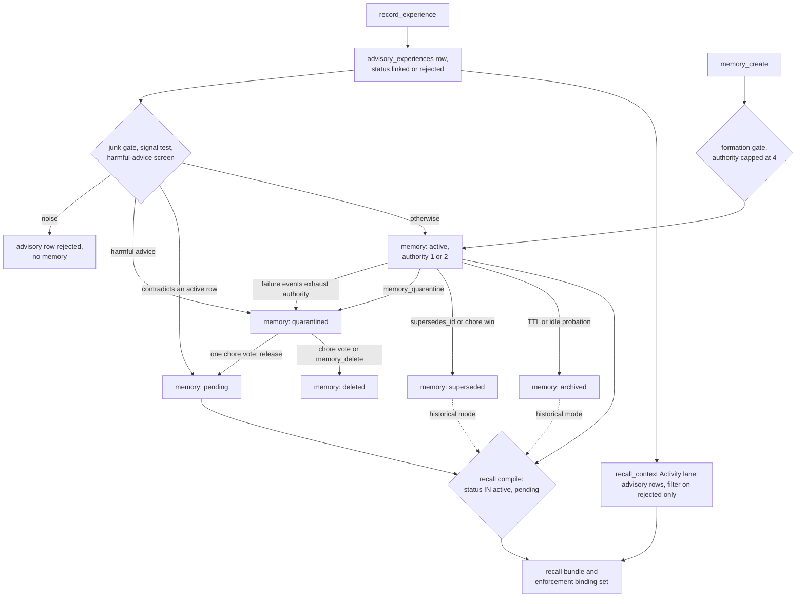

## 1. Executive Summary

Pluribus is a Go service over Postgres that gives every coding agent connected
to it one shared memory pool of constraints, decisions, failures, patterns and
state, reached through an HTTP MCP endpoint and a REST API. What is notable is a
lifecycle that withholds. A deterministic screen stores safety-negating advice
as `quarantined`, and quarantined, deleted and rejected rows are filtered from
recall and enforcement in SQL and again after the retrieval lanes merge. What is
weak is the perimeter around that filter. `recall_context` appends advisory rows
that quarantine never touches, every tool runs whatever the listed tier, and
agent identity is a string the caller supplies.

The design is stated in `docs/memory-doctrine.md` and the code follows it. There
is no partition: *"Memory is global — one shared pool"*, and project, task and
workspace are listed as forbidden concepts. Ingestion is generous and ranking
does the curating. A lesson from `record_experience` is active at authority 1 or
2 in the same request. No model runs on the server: extraction, contradiction
detection, consolidation and the harm screen are string rules, and judgement is
delegated to the agents that visit, through *chores* they vote on.

The licence is source-available. Personal and internal use, modification for
internal use and study are granted. Offering the software as a service,
embedding it as core functionality of a commercial product and commercial
redistribution need a separate licence. `LICENSE.md` is headed *Purinus License
v1.0*, while the README and code say Pluribus. This project is unrelated to
[PLUR1BUS](../plur1bus/), an OpenClaw memory plugin from Cyb3rb1ade whose name
differs by one character.

Three marks: `trust_state`, `bitemporal` and `negative_eval`. Section 9 names
the four withheld and the reason for each.

## 2. Mental Model

A memory is a distilled statement with a kind, an integer authority from 0 to
10, an applicability (`governing`, `advisory`, `analogical`, `experimental`) and
a status (`pkg/api/enums.go:6-40`). It is treated as a belief from the moment it
is written, weighted by authority. A low-authority row is weak guidance, not a
candidate.

**Three routes create one.** `record_experience` stores an advisory experience
and, in the same request, forms a probationary memory if the summary passes a
length floor, a junk gate and a keyword signal test, at authority 2 for a strong
signal and 1 for a weak one (`internal/vet/service.go:17-21`, `:72-179`).
`memory_create` writes directly through a formation gate that, under the shipped
`hive_defaults`, caps client authority at 4 and leaves the row active
(`internal/formation/gate.go:64-73`, `configs/config.yaml:76-88`). Distillation
produces `candidate_events` rows that are not memory until `curation_materialize`
promotes them.

**Duplicates reinforce instead of inserting.** A write whose kind and normalised
statement key match an active or pending row returns that row, and a partial
unique index enforces it (`internal/memory/service.go:317-354`,
`migrations/0001_memory_baseline.sql:196-198`). Authority then rises only when a
different agent uses or re-submits the memory. The author's own reuse merges
salience and leaves authority unchanged (`internal/memory/service.go:202-213`,
`:334-338`).

**Authority falls on evidence and can empty a row out of recall.** A failure or
contradiction event lowers authority multiplicatively with a guaranteed one-step
drop, a fix whose comment records that rounding had made poisoned rows impossible
to demote (`internal/memory/lifecycle.go:39-46`). At zero an active row moves to
`quarantined` with reason `authority_exhausted` (`internal/memory/service.go:629-638`).

**Seven statuses, three of them withheld.**

| Status | Written by | Read by recall |
|---|---|---|
| `active` | every create path | current guidance |
| `pending` | contradiction-on-write, quarantine release, demotion of a refuted governing constraint | current mode, score × 0.88 |
| `superseded` | `supersedes_id`, chore consolidation or contradiction win | historical mode, labelled `superseded_context` |
| `archived` | TTL expiry and idle probationary rows | historical mode, labelled `archived_context` |
| `quarantined` | harm screen, `memory_quarantine`, authority exhaustion | never |
| `deleted` | `memory_delete`, chore delete vote | never |
| `rejected` | nothing in the tree writes it to a memory row | never |

Current mode admits superseded rows when the query contains one of five cue
substrings, and `"stal"` matches *install* as well as *stale*
(`internal/recall/lifecycle_candidates.go:11-25`). Those rows arrive labelled and
scored at 0.12 of their relevance (`internal/recall/relevance_scoring.go:527-529`).

**A memory never dies.** No path hard-deletes a `memories` row. Quarantine
release goes to `pending`, never to `active`, and *"nothing an agent vote does can
mint an active memory"* (`internal/chores/service.go:192-239`). There is no
restore from `deleted` outside SQL.

## 3. Architecture

One Go module, `control-plane/`, serves a chi router on `:8123`. The routes are
`/v1/memory`, `/v1/recall`, `/v1/curation`, `/v1/advisory-episodes`,
`/v1/enforcement`, telemetry and utility-policy families, and MCP at `POST
/v1/mcp` (`internal/apiserver/router.go:507-617`). A stdio adapter,
`cmd/pluribus-mcp`, forwards to the same REST surface.

Persistence is Postgres with `pgvector` and `pgcrypto`. Eighteen forward-only,
idempotent migrations are embedded in the binary and applied on boot
(`migrations/embed.go:1-9`). `memories` carries a generated `statement_tsv` with
a GIN index and an embedding column. Side tables hold tags, typed relationships,
contradiction records, advisory experiences, candidates, utility events and
scores, and curation chores with their votes. Redis caches tag searches and
compiled bundles, and every memory mutation drops both prefixes
(`internal/memory/service.go:276-283`).

Embeddings come from an Ollama-compatible endpoint (`nomic-embed-text`, 768
dimensions) and fall back to lexical retrieval when it is down
(`configs/config.yaml:60-67`). A curation scheduler runs hourly in-process
(`internal/curationloop/scheduler.go:92-150`, `configs/config.yaml:120-138`).

### Deployment and ergonomics

`docker compose up -d` starts `pgvector/pgvector:pg18`, `redis:7` and the
service. Ollama is optional. No API key is needed to store anything: auth is off
unless `PLURIBUS_API_KEY` is set, and then it is one shared key for REST and MCP
(`docs/authentication.md`, `internal/apiserver/router.go:617`). The store is
plain SQL and can be repaired by hand. The doctrine treats the database as
*"sacred"*, with in-place upgrades preceded by a verified backup through
`scripts/upgrade-in-place.sh`.

## 4. Essential Implementation Paths

**Capture.** `record_experience` maps to `POST /v1/advisory-episodes`
(`internal/mcp/proxy.go:71`, `:558-559`). The handler inserts the advisory row
and calls `AfterAdvisoryCreate` inline (`internal/similarity/handlers.go:79-81`),
wired to `vet.ProcessNewAdvisoryExperience` (`internal/apiserver/router.go:452-454`).
`tryFormProbationary` runs the gates, attaches `agent_id` from the argument or an
`agent:` tag, applies `formation.HarmfulAdviceReason`, and calls
`memory.Service.Create` (`internal/vet/service.go:72-179`).

**Direct write.** `memory_create` maps to `POST /v1/memory`. `Create` validates
kind and length, runs the formation gate, accepts status `active`, `pending` or
`quarantined`, dedups, optionally merges near-duplicate patterns and semantic
near-duplicates, inserts, then applies `supersedes_id` and any contradiction link
(`internal/memory/service.go:286-414`, `:581-590`).

**Retrieval.** `recall_context` builds a compile body, calls `POST
/v1/recall/compile`, wraps the bundle in `mcp_context`, and may append the
Activity lane (`internal/mcp/context_resolve.go:215-270`). `Compiler.Compile`
resolves the lifecycle mode, fetches candidates, merges the pgvector slice,
re-filters, applies the contradiction policy and ranks
(`internal/recall/compiler.go:167-300`, `internal/recall/lifecycle_candidates.go:30-102`).
`wakeup_context` is the same compiler with tighter caps
(`internal/recall/wakeup.go:52-82`).

**Enforcement.** `enforcement_evaluate` reads `ListBindingMemory`: active and
pending, authority at least `min_binding_authority`, not advisory, top 120 by
authority, matched against the proposal by rules (`internal/enforcement/service.go:36-59`,
`internal/memory/repo.go:765-792`).

**Correction.** `memory_quarantine` and `memory_delete` call
`setRemediationStatus`, which overwrites `status` and `status_reason`
(`internal/memory/service.go:678-761`). `resolve_chore` records a vote and
applies the action when enough distinct non-author hashes agree
(`internal/chores/service.go:80-153`).

**Background.** `Scheduler.RunOnce` expires rows, optionally auto-promotes, runs
the chore pass, backfills embeddings and prunes rejected advisory rows
(`internal/curationloop/scheduler.go:92-150`).

## 5. Memory Data Model

`memories` holds `kind`, `statement`, `statement_canonical`, `statement_key`,
`dedup_key` (always `"shared"`), `payload` JSONB, `authority`, `applicability`,
`status`, `status_reason`, `deprecated_at`, `ttl_seconds`, `occurred_at`,
`agent_id`, the embedding with model and provenance hash columns, and timestamps
(`migrations/0001_memory_baseline.sql:6-22`, `0003`, `0014`, `0017`).

**Time.** `occurred_at` is *"when the described event or fact took place"*,
nullable, beside `created_at` and `updated_at`
(`migrations/0003_memories_occurred_at.sql:1-5`). Supersession stamps
`deprecated_at` (`internal/memory/repo.go:274-277`).

**Scope.** None. `dedup_key` is a constant (`internal/memory/scope_tags.go:5-8`).
Tags are free strings the client sends, never inferred. `agent_id` is stored for
attribution and corroboration and appears in no recall `WHERE` clause.

**Provenance and correction chains.** `memory_relationships` holds typed edges
(`supports`, `contradicts`, `supersedes`, `same_pattern_family`, `derived_from`)
with reason and source (`migrations/0004_memory_relationships.sql:3-18`).
`contradiction_records` tracks a pair through `unresolved`, `override`,
`deprecated` and `narrow_exception`. Promotion and consolidation lineage live in
`payload.pluribus_promotion` and `payload.pluribus_consolidation`.

**Separation.** Canonical memory lives in `memories`. Advisory experiences
(`advisory_experiences`) are the episodic intake log and *"not memory"* by
doctrine, yet a read path serves them, as section 9 describes. Candidates
(`candidate_events`) are a pre-memory queue. Utility events and scores rank
without changing authority.

## 6. Retrieval Mechanics

Retrieval is tool-mediated, with automatic injection where the Claude Code
plugin's hooks are installed. Compile assembles candidates from four lanes. A
Postgres full-text top-50 runs over the whole situation query per allowed
status. Per-keyword `ILIKE` bridges run without tags. An authority-ordered
fallback takes 100 rows per status, filters by tag through `EXISTS`, and it runs when the
query is empty or the first lanes return fewer than 20. A pgvector slice runs
when semantic retrieval is on (`internal/recall/lifecycle_candidates.go:30-102`,
`internal/recall/compiler.go:195-266`).

Status is checked in each SQL statement and again by
`filterLifecycleCandidates` and `applyCandidateSafetyFilter`, whose comment says
*"do not trust vector SQL alone"* (`internal/recall/candidate_safety_filter.go:9-36`).
Unresolved contradiction pairs default to picking a winner and dropping the loser
(`internal/recall/compiler.go:267-300`).

Ranking is relevance-first with authority as a multiplier. Relevance combines
lexical similarity, tag match, semantic similarity, recency on
`coalesce(occurred_at, updated_at)`, cross-context and cross-agent salience,
situational affinity on `repo_root` and tags, and penalties for wrong-domain and
generic terms. Pending rows are multiplied by 0.88
(`internal/recall/relevance_scoring.go:515-540`, `internal/recall/scorer.go:133-153`).
The default cap is five items per kind. The plugin hooks cap injected text at
9,000 and 9,500 bytes (`integrations/claude-code-plugin/hooks/session-start.sh:101`,
`hooks/user-prompt-recall.sh:67`).

The failure mode the code guards hardest is lexical traps, high-authority noise
from another domain winning a query, and the committed recall benchmark is built
around them. The one it does not guard is the Activity lane in section 9.

## 7. Write Mechanics

Writes are explicit tool calls. `record_experience` is the default-loop write
and `memory_create` the deliberate one. The server never extracts from a
transcript. Distillation of advisory text into candidates is rule-based, and
`auto_promote` is off by default.

Filtering of noisy or malicious input is the formation gate plus the harm screen.
The screen flags text with an advice marker (*always*, *should*, *going
forward*) and a safety-negating verb within 48 characters of a safety target,
unless the verb is itself negated. It also flags a list of standalone phrases
such as `--no-verify` (`internal/formation/harm_screen.go:25-90`). It is
called from one place, `tryFormProbationary` (`internal/vet/service.go:122`), so
`memory_create`, `memory_promote` and `curation_materialize` do not pass through
it.

Conflict handling at write time is `contradiction_on_write`. A governing or
high-authority constraint, and every probationary lesson, is checked against up
to 40 active memories of the same kind by a negation heuristic. A hit lands the
new row `pending` and records a `contradicts` edge and an unresolved
contradiction (`internal/memory/service.go:454-509`, `:391-408`).

### Operational cost

The write path is synchronous and model-free. A `record_experience` call
returns after the advisory insert, the inline formation, an embedding call to
the local embedder when semantic retrieval is on, and the insert. The memory is
retrievable on the next compile. The hourly pass touches only expiry
candidates, open chores, a bounded near-duplicate window (14 days, 20 pairs), a
an embedding backfill bounded at 50 rows and old rejected advisory rows. Nothing
rewrites the store. Recall injects a bounded bundle per call, and the plugin's
prompt hook fires on every prompt at least 45 characters long.

## 8. Agent Integration

The MCP surface registers 59 tools (`internal/mcp/tool_registry.go:264-330`).
`tools/list` shows seven under the default `core` tier: `wakeup_context`,
`recall_context`, `record_experience`, `memory_feedback`, `list_chores`,
`resolve_chore` and `health` (`internal/mcp/tool_tiers.go:14`, `:46-54`). The
tier filters the listing only. `tools/call` validates the arguments and forwards
any registered name (`internal/mcp/handler.go:246-272`), as the comment on
`SetToolsTier` says: *"tools/call still accepts all names"*
(`internal/mcp/tool_tiers.go:16`). An agent told the name of `memory_delete` can
run it.

The expected loop is `recall_context` before work and `record_experience` after,
taught by `integrations/pluribus-instructions.md` and per-editor packs. The
Claude Code plugin automates the read side. Its `SessionStart` hook calls
`wakeup_context` through MCP and injects identity and governing rows plus one
housekeeping chore, and its `UserPromptSubmit` hook compiles a preview with
`tags: ["claude-code"]` (`integrations/claude-code-plugin/hooks/session-start.sh:41-101`,
`hooks/user-prompt-recall.sh:21-67`). Both hooks fail open. When the client
omits `agent_id`, the MCP handler fills it from the client's self-reported name
for five tools, `resolve_chore` among them (`internal/mcp/default_agent_id.go:9-33`).

Adapting it to another agent is cheap: any MCP client over HTTP works, and the
REST surface is documented route by route in `docs/http-api-index.md`.

## 9. Reliability, Safety, and Trust

**Trust state — awarded.** The status column withholds, and it does so on every
read of `memories` an agent reaches through recall. Current mode requests active
and pending, historical mode active, superseded and archived, and
`include_status` refuses quarantined, deleted and rejected with an error
(`internal/recall/recall_mode.go:52-93`). The post-merge filters drop the three
again (`internal/recall/lifecycle_candidates.go:149-151`,
`internal/recall/candidate_safety_filter.go:33-36`). Enforcement binds only
`status IN ('active', 'pending')` (`internal/memory/repo.go:786`).
`quarantined` has three producers on reachable paths. The mark rests on
quarantine; `rejected` has no writer on a memory row anywhere in the tree.

**The Activity lane carries the quarantined text past the filter.**
`recall_context` appends advisory experiences whenever the task reads as
episodic or a time bound is set (`internal/mcp/activity_lane.go:14-19`,
`internal/mcp/context_resolve.go:264-270`). That lane reads
`advisory_experiences` filtered only on `memory_formation_status <> 'rejected'`
(`internal/similarity/repo.go:107-114`). A lesson's advisory row is set to
`linked` when its memory is created (`internal/similarity/repo.go:186-188`), and
quarantine and soft delete never touch it. So poisoned advice the screen caught,
or a deleted memory that came from `record_experience`, is returned verbatim by
the default-tier tool, labelled *Activity*. `episode_search_similar` reads the
same rows.

**Quarantine is released by one self-named vote.** The code default and the
shipped config both set `chore_min_resolvers` to 1
(`internal/chores/service.go:16-17`, `configs/config.yaml:129-131`), while the
doctrine says the default is 2. The red-team test that a lone vote cannot apply
sets `MinResolvers = 2` before asserting (`internal/chores/service_redteam_test.go:17-20`).
Distinctness is a hash of `agent_id`, which the caller supplies
(`internal/memory/agent_key.go:11-18`), and the author exclusion applies only
when the memory has an `agent_id`. The release lands `pending`, which current
recall returns.

**Other gaps.** Auth is off by default, and with it on there is one key for every
client, so the `agent_id` that drives corroboration is unauthenticated. The
`memory_quarantine` and `memory_delete` descriptions say *Operator remediation*,
and both are on the agent's tool surface. `memory_create` skips the harm screen.
Under the shipped config a governing constraint at the capped authority of 4
lands active and clears `min_binding_authority: 3`, so it binds enforcement for
every agent at once (`internal/formation/gate.go:64-73`, `configs/config.yaml:178-179`).
`POST /v1/memories/search` takes `status` from the body and returns quarantined
rows on request (`internal/memory/repo.go:604-654`).

**Bitemporal — awarded.** `occurred_at` is event time beside record time, and
compile filters on it (`internal/recall/candidate_safety_filter.go:42-48`). The
limits are in the frontmatter record: a nullable point, a fallback to
`created_at`, and a `deprecated_at` nothing reads.

**Tombstone — withheld.** `deleted` is a status on a row. `FindActiveDuplicate`
and the unique index see only active and pending rows
(`internal/memory/repo.go:41-58`), so re-submitting a deleted statement inserts a
fresh active row. The rejected advisory bucket is keyed on the episode.

**Scope enforced — withheld, by design.** One pool. Tags filter only the
authority fallback; the full-text, keyword and vector lanes ignore them for
candidate selection (`internal/recall/lifecycle_candidates.go:42-75`). No read
applies `agent_id`.

**Audit log — withheld.** Status changes overwrite `status` and `status_reason`
in place (`internal/memory/repo.go:365-370`). `agent_loop_events` records MCP
tool calls with arguments and memory ids (`internal/mcp/compliance_hook.go:51-62`),
but REST calls, scheduler archiving, authority exhaustion and chore applications
leave no row there. `memory_utility_events` is feedback, and
`agent_utility_applications` records utility-score changes and is updated in
place on revert (`internal/utilitypolicy/repo.go:156`).

**Human review — withheld.** Every verb that resolves a memory's state —
`curation_materialize`, `curation_reject_candidate`, `resolve_chore`,
`memory_quarantine`, `memory_delete` — is a registered MCP tool the producing
agent can call. Chores are designed for agents: *"The server detects; visiting
agents judge."*

**Durability.** Canonical rows are never hard-deleted. Backup, restore and
in-place upgrade scripts ship. Concurrency rests on Postgres. The dedup check
and insert are two statements, and the partial unique index catches the race.

## 10. Tests, Evals, and Benchmarks

I counted 1,067 Go test functions across 225 test files. Many tests use
`sqlmock` or in-test stubs; integration tests under `cmd/controlplane` need a
database. I ran nothing.

**Negative eval — awarded.** The lifecycle recall gate,
`internal/recall/lifecyclebenchmark/benchmark_test.go`, compiles 15 fixture
cases from `testdata/lifecycle_recall/cases.json` against a stub holding active,
pending, superseded, archived and rejected rows under one tag.
`current_mode_excludes_superseded_memory` fails if the superseded constraint
appears, and `historical_mode_includes_superseded_memory` fails if the same
statement is missing. CI runs it in `go test ./...` and again as `make
test-lifecycle-recall` (`.github/workflows/ci.yml:24`, `:45`). Its limits are in
the frontmatter record. The fixture's `expect_status_in_bundle` field, the
positive half of `current_mode_defaults_when_omitted`, is declared at line 32
and read nowhere.

The recall benchmark is a second instance. `testdata/recall_benchmark/cases.json`
holds 28 cases over 45 memories, and 10 of them assert zero forbidden labels in
the top 10 alongside a minimum recall of the expected labels
(`internal/recall/benchmark/metrics.go:336-351`). For example,
`pluribus_high_auth_wrong_domain` forbids a high-authority marketing pattern
from another domain (`cases.json:226-238`). CI runs it with
`RECALL_BENCHMARK_GATE=1` (`ci.yml:33`). The test's own skip message calls it
*"expected to fail until recall scoring improves"*, and I did not run it.

The semantic-filter tests in `internal/recall/compiler_semantic_filter_test.go`
are vacuous as exclusions. Each current-mode case seeds one withheld row, loops
over the result and asserts nothing is present. An empty bundle passes, and no
case pairs them with a positive control.

The harm screen is tested on the write side. `TestRedTeam_hostileAuditPoisonLandsQuarantined`
asserts the insert carries `quarantined` (`internal/vet/service_redteam_test.go:19-74`).
No test reads a quarantined lesson back through `recall_context`. That is the
test that would have found the Activity lane.

No paper describes Pluribus. `internal/agentusefulness/research_alignment.go`
cites five external sources, two on arXiv, as anchors for fixture principles.
`artifacts/` and `evidence/` hold committed run logs from 26–27 March 2026,
older than most of the code at the pin.

## 11. For Your Own Build

### Steal

- Filter status twice: once in each SQL lane, and once after the lanes merge,
  because a vector or keyword lane added later will forget the predicate.
- Quarantine is a status, not a delete: a screen that errs toward safety costs
  little when its false positives stay stored and reviewable.
- Guarantee a negative event makes progress. Multiplicative decay with integer
  rounding can stall a poisoned row at low authority forever.
- Let only a different agent raise authority. Self-reinforcement is the cheapest
  poisoning loop in a shared pool.
- Return superseded and archived rows only in an explicit historical mode, with
  a lifecycle role on each item and a score cap.

### Avoid

- A listing tier is not an access control. If `tools/call` accepts every name,
  the hidden tools are only undocumented.
- Corroboration by distinct identity needs identity. A hash of a caller-supplied
  string counts strings, not agents.
- A withholding status on the derived row does nothing for the source row it
  came from. Find every table that holds the same text and every read over it.
- A test that sets the safe threshold before proving the threshold is safe
  certifies the configuration nobody ships.

### Fit

Pluribus suits a small team on a trusted LAN running several coding agents
against one Postgres they already operate, who want shared constraints,
pre-change checks and a model-free server. It assumes every connected agent is
benign, since identity, authorisation and the votes that curate rest on what the
client says. A deployment where memory must be partitioned, where one client
might be hostile, or where a person must approve what becomes governing should
walk away. The doctrine rules partition out, and nothing in the tree puts a
person between an agent and the state column.

## 12. Open Questions

- Does the CI recall benchmark gate pass at the pin, given the test's own
  expectation that it fails?
- How often does the Activity lane fire in practice, given that it depends on
  the episodic cue heuristic in `inferContextStrategy`?
- Is `chore_min_resolvers: 1` the intended shipped default, or did the doctrine's
  2 lose to single-agent convenience?
- Do the integration tests under `cmd/controlplane` exercise quarantine through
  a real compile against Postgres?

## Appendix: File Index

- **Schema:** `control-plane/migrations/0001_memory_baseline.sql`, `0003`, `0004`,
  `0010`, `0014`, `0016`, `0017`, `0018`; `pkg/api/enums.go`,
  `pkg/api/lifecycle_trust.go`.
- **Write path:** `internal/vet/service.go`, `internal/formation/gate.go`,
  `internal/formation/harm_screen.go`, `internal/memory/service.go`,
  `internal/memory/repo.go`, `internal/similarity/handlers.go`.
- **Retrieval:** `internal/recall/compiler.go`, `lifecycle_candidates.go`,
  `candidate_safety_filter.go`, `recall_mode.go`, `relevance_scoring.go`,
  `date_filter.go`, `wakeup.go`; `internal/enforcement/service.go`.
- **Context assembly:** `internal/mcp/context_resolve.go`,
  `internal/mcp/activity_lane.go`, `internal/similarity/repo.go`.
- **Curation and background:** `internal/chores/service.go`,
  `internal/curationloop/scheduler.go`, `internal/utility/service.go`.
- **MCP and integration:** `internal/mcp/tool_registry.go`, `tool_tiers.go`,
  `handler.go`, `proxy.go`, `default_agent_id.go`;
  `integrations/claude-code-plugin/hooks/`.
- **Config and doctrine:** `control-plane/configs/config.yaml`,
  `docs/memory-doctrine.md`, `docs/authentication.md`, `LICENSE.md`.
- **Tests:** `internal/recall/lifecyclebenchmark/benchmark_test.go`,
  `testdata/lifecycle_recall/cases.json`, `internal/recall/benchmark/`,
  `testdata/recall_benchmark/`, `internal/recall/compiler_semantic_filter_test.go`,
  `internal/vet/service_redteam_test.go`, `internal/chores/service_redteam_test.go`.

### Recorded searches

Checked against the checkout at the pinned revision, from `control-plane/` unless the path says otherwise.

- `grep -rnE "StatusRejected|'rejected'|\"rejected\"" --include='*.go' . | grep -v _test | grep -v internal/recall/` — matches on candidates, advisory rows, ingestion records and the enum; no writer of `rejected` to `memories.status`.
- `grep -rn 'HarmfulAdviceReason' --include='*.go' . | grep -v _test` — one caller, `internal/vet/service.go:122`.
- `grep -rnE "status *(IN|=|NOT IN|<>|!=) *\(?'?(deleted|quarantined|rejected)" --include='*.go' --include='*.sql' .` — the quarantine index, the chore picker and comments; no write-path lookup of deleted or quarantined statements.
- `grep -rnE "WHERE.*agent_id|AND m?\.?agent_id" --include='*.go' . | grep -v _test` — one match, in `internal/utilitypolicy/repo.go:77`; no memory read filters on `agent_id`.
- `grep -rn 'ExpectStatusInBundle' .` — the struct field at `internal/recall/lifecyclebenchmark/benchmark_test.go:32` only.
- `grep -rln 'activity_lane\|ActivityLane\|formatActivityLane' --include='*_test.go' .` — `internal/mcp/effectiveness_probes_test.go` only; `grep -rn quarantin --include='*_test.go' internal/mcp internal/similarity cmd` — no match.
- `grep -rn 'DELETE FROM agent_loop_events\|DELETE FROM agent_sessions' --include='*.go' . | grep -v _test` — no match; `grep -rn 'UPDATE agent_utility_applications' --include='*.go' .` — `internal/utilitypolicy/repo.go:156`.
- `grep -rnE 'chore_min_resolvers|MinResolvers' --include='*.go' --include='*.yaml' .` — `configs/config.yaml:131` sets 1; `config.example.yaml:279` shows 2, commented.
- `grep -rliE 'arxiv|bibtex|@article|@misc|doi\.org' . --exclude-dir=.git` from the repository root — `internal/agentusefulness/research_alignment.go` only, citing external work; no `CITATION.cff`.
- `find . -iname 'AGENTS.md' -o -iname 'CLAUDE.md'` from the repository root — no match.

## History

**2026-10-03** — [`e869aa2ba2c4fb78506b9edd55ce7fe1016cbcc6`](https://github.com/johnnyjoy/pluribus/commit/e869aa2ba2c4fb78506b9edd55ce7fe1016cbcc6) — first reading, at the head of `main`, a commit dated 15 September 2026. Three marks: `trust_state`, `bitemporal`, `negative_eval`. Screened before reading: no auto-run surface at the root, two build-time execution points (`Makefile`, `control-plane/Makefile`), nothing inside the cooldown, two unpinned surfaces (`sdk/python/pyproject.toml` without a lockfile, caret ranges in the VS Code extension). The Claude Code plugin's `hooks/hooks.json` under `integrations/` is inert unless installed, and was read as data. No `AGENTS.md` or `CLAUDE.md`. Read with `grep` and `sed`; nothing was installed, built or run.
