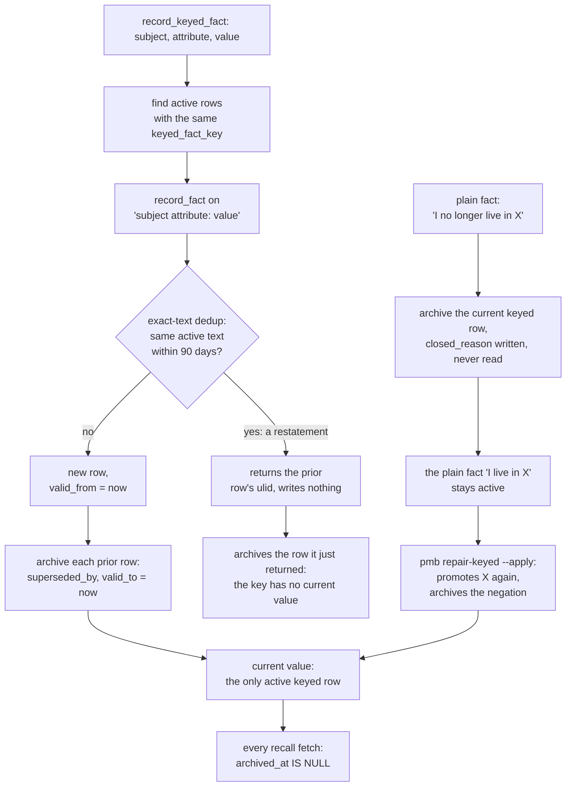

## 1. Executive Summary

PMB is a local memory server for coding agents: a SQLite event store with a
LanceDB vector index beside it, reached through an MCP server, a warm local
daemon and five Claude Code hooks. What is notable is how little the model has
to cooperate. A UserPromptSubmit hook classifies each message by regex and
injects lessons and recall hits, a Stop hook writes an activity entry when the
agent recorded nothing, and every write returns after one SQLite insert into a
durable outbox. What is weak is the correction path it advertises most: the
keyed-fact supersession that is meant to make *"I moved to Warsaw"* replace
*"I live in Kyiv"* archives its only current row when the same value is
restated, and the as-of query that the tool description offers the agent has no
caller outside tests.

The design is explicitly write-heavy and filter-light. Every memory becomes a
belief at insert, ranking does the rest, and forgetting is archive-only except
for an explicit hard delete. The daemon's maintenance tick decays importance
across the whole store daily and archives cold rows; it never deletes and never
resolves a conflict on its own.

Two engineering choices are worth more than the retrieval stack. The write
outbox (`src/pmb/core/engine/batch.py:83-126`) turns a fire-and-forget MCP write
into a crash-safe one without making the agent wait on an embedding. The lesson
loop logs every time a rule is surfaced and judges it `useful`, `harmful` or
`unverified` only when a Wilson interval clears the baseline, and states that
the verdict must not drive ranking (`src/pmb/health/earned_memory.py:212-225`).

One mark, `negative_eval`, on two CI-run cases: a superseded keyed value must
not be recalled, and a project-scoped recall must not return another project's
fact, each beside a positive control. Section 9 names the six withheld.

## 2. Mental Model

A memory is a row in `events`. It becomes a belief the moment it is inserted:
there is no candidate state, and nothing between the write and the recall
filter asks whether it is true. It stops being one when `archived_at` is set —
by `forget`, by supersession of a keyed fact, by a user negation of a keyed
value, by the decay pass, or by a dedup merge — or when `delete --hard` removes
the row. Every read path filters `archived_at IS NULL`, so archived is the only
state that withholds anything (`src/pmb/core/events.py:427-467`).

**The tiers are decay rates, not trust levels.** `working`, `episodic` and
`semantic` differ only in how fast importance decays, and recall reads all three
equally (`src/pmb/core/events.py:38-58`). A row is promoted by being recalled
twice, then seven times.

**A keyed fact is the correction mechanism.** `record_keyed_fact(subject,
attribute, value)` canonicalises the attribute, finds active rows with the same
`keyed_fact_key`, writes `"{subject} {attribute}: {value}"` with `valid_from`,
and archives each prior row with `superseded_by` and `valid_to`
(`src/pmb/core/engine/write.py:497-648`). A plain user fact that states a
current attribute is promoted into one, and a plain fact that negates one
archives the current value with `closed_reason` (`write.py:389-452`).

**Restating the current value erases it.** The new text goes through
`record_fact`, whose exact-text dedup returns the ulid of any active fact with
the same normalised content in the last 90 days, without writing
(`write.py:148-160`; `src/pmb/reasoning/dedup.py:142-181`). On a restatement
that ulid is the prior keyed row itself. `record_keyed_fact` then archives it
and stamps it `superseded_by` its own ulid (`write.py:604-632`), so the key has
no current value. The guard beside it names the collision — *"identical content
would otherwise dedup-collide with the very row we'd archive"* — and runs only
when `extract.anchor_keyed` is on and the model is warm (`write.py:566-584`).
That flag defaults to false. This was read, not reproduced.

**A negation does not stay negated.** The plain fact that stated the old value
stays active after `_close_keyed_attr` archives the keyed row. `pmb repair-keyed
--apply` promotes the newest current-state plain fact back into a keyed value,
and the new value's write archives the negation as obsolete
(`src/pmb/cli/commands/maintenance.py:26-90`; `write.py:650-708`, `:1049-1120`).
Nothing reads `closed_reason`.

Memory is hybrid-controlled: the agent writes through tools, the hooks write
activity and correction drafts, the daemon decays and archives, and the user
forgets, pins and deletes from the CLI or dashboard.

## 3. Architecture

PMB is a Python package with three entry points over one `Engine`: the `pmb`
CLI, the `pmb-mcp` server, and `pmb-hook`, a stdlib-only client that forwards
hook calls to a warm daemon on `127.0.0.1` and falls back to a cold engine when
none is running (`src/pmb/cli/hooks.py:85-135`). The engine is twelve mixins
over one workspace (`src/pmb/core/engine/base.py:45-58`).

A workspace is a directory, `~/.pmb/workspaces/<id>/`, holding `events.sqlite`,
`vectors.lance` and `bm25_index.pkl` (`src/pmb/core/workspace.py:73-87`). The
graph, arcs, dedup queue, write outbox, lesson surfaces and error log are
further tables in the same SQLite file. The id comes from `PMB_WORKSPACE`, a
`.pmb/workspace.yaml` in the working directory or any of ten parents, a
persisted default, or a hash of the git remote or path (`workspace.py:159-219`).
The yaml's id is joined to the storage root without sanitising it
(`workspace.py:187-200`, `:237-238`).

The default embedder is `paraphrase-multilingual-MiniLM-L12-v2`, loaded
locally. Writes land in SQLite first and embed through an in-process queue
backed by a durable `embed_queue_pending` table when the model is cold
(`base.py:156-167`). No LLM is called on the read path or on the default write
path. Optional LLM backends serve consolidation, borderline dedup verification
and entity extraction.

Team use runs one streamable-HTTP server with a single shared bearer token
(`src/pmb/mcp/server.py:497-528`, `:630-664`). If middleware installation
fails, the server logs a warning and runs unauthenticated rather than refusing
to start.

### Deployment and ergonomics

`pip install pmb-ai`, `pmb setup` and `pmb warmup`; nothing else has to run, no
API key is needed, and everything works offline once the embedder is cached. The
store is plain SQLite and readable by hand; `pmb export` writes Markdown or
JSON, `pmb snapshot` makes verified backups, and `pmb workspace export` makes an
encrypted bundle. `pmb workspace init --remote` versions the directory in git.

## 4. Essential Implementation Paths

**Write, batched.** `record_batch_async` inserts the items into `write_outbox`
and returns; a drainer thread replays pending rows through `record_batch`
(`src/pmb/core/engine/batch.py:83-126`, `:259-345`). `record_batch` dispatches
by item type — `lesson` and `failure` become facts with `metadata.kind`
(`batch.py:474-501`).

**Write, single.** `record_fact` redacts secrets, runs dedup, flags suspected
junk (capping importance at 0.2), caps high-importance writes per day, appends,
embeds or defers, indexes the graph, parses `event_time`, then runs the
current-state promotion and negation close (`write.py:119-318`).

**Keyed facts.** `record_keyed_fact` (`write.py:497-648`), `_close_keyed_attr`
(`:420-452`), `keyed_fact_as_of` (`:805-856`), `get_keyed_fact_history`
(`:898-931`), and the repair passes `backfill_keyed_from_facts`,
`repair_keyed_facts` and `archive_negations_for_current_keys`, reachable only
through `pmb repair-keyed`.

**Retrieval.** `recall` wraps `_recall_impl` in a singleflight
(`src/pmb/core/engine/recall.py:137-189`). The pipeline runs typo correction,
query routing, the predictive cache, BM25 plus vectors at `top_k * 5`, graph
expansion, PageRank, causation and arc expansion, keyed-fact injection for
personal questions, one batched fetch with `only_active=True`, and scoring
(`recall.py:191-1431`). `recall_scoped` post-filters by project
(`recall.py:1662-1702`).

**Injection.** The UserPromptSubmit hook runs `prepare-context --max-chars
4000`: intent classification, `find_lessons`, and an unscoped `engine.recall`
for past-query and factual intents (`src/pmb/hooks/auto_recall.py:690-800`).

**Forget.** `forget` archives, `unforget` restores, `purge` removes the row,
the vector and graph links (`recall.py:1438-1478`; `events.py:627-663`).

**Background.** `run_maintenance_tick` (`src/pmb/maintenance/tick.py`), decay in
`src/pmb/signals/decay.py:70-147`.

## 5. Memory Data Model

| Field | Notes |
| --- | --- |
| `ulid` | millisecond hex timestamp plus eight hex characters of a UUID4 |
| `workspace_id` | equals the store's own workspace; every query predicates on it |
| `event_type` | `fact`, `qa`, `activity`, `preference`, `summary`, `goal`, `git` and others |
| `content`, `metadata_json` | text, and a free-form JSON blob holding kind, source, project, keyed key and value, validity window, supersession pointers |
| `timestamp`, `last_accessed`, `access_count` | record time and reinforcement |
| `importance`, `tier` | ranking weight and decay rate |
| `archived_at` | the one filter every read applies |
| `source_session_id` | session binding |

The schema is `src/pmb/core/events.py:155-170`. Everything epistemic lives in
the metadata blob, which callers read-modify-write over separate connections
(`write.py:420-452`, `:612-632`), so two writers can overwrite each other's
keys.

**Scope is the database file.** `workspace_id` is on every row and every query,
and it can only hold one value per file: `migrate_workspace_into` copies another
workspace's rows in under the target's id and tags them `project`
(`write.py:1311-1420`). The project tag is what `recall_scoped` reads.

**Provenance is a label.** `metadata.source` is set by the writing path
(`lesson`, `autowrite`, `correction-capture`, `current_state_auto`, import
names) and rendered by `describe_source` (`src/pmb/provenance.py:15-60`). The
agent can set it in `record_batch` item metadata.

**Time is record time.** `valid_from` and `valid_to` on keyed facts are both
`time.time()` at the writing call (`write.py:600-601`, `:626`). `event_time` is a
date parsed from the content by regex and used as a ranking boost
(`recall.py:1791-1826`).

## 6. Retrieval Mechanics

Retrieval is hybrid and tuned for LoCoMo-style questions. BM25 weight defaults
to 0.7 against the vector score, both min-max normalised over the candidate set
(`src/pmb/core/search.py:246-247`, `:934-935`). Graph expansion adds events
linked to entities in the query, weighted by rarity; personalized PageRank runs
by default; a keyed-fact boost fires only when the query has both a question
word and a first-person cue (`recall.py:776-813`). The cross-encoder rerank is
off by default, and the config text says it regresses LoCoMo.

**The score the model is told to trust is relative.** The server instructions
say *"Trust results with score > 0.2 - that's the user's recorded reality, more
authoritative than your inferences from code / docker / env / web"*
(`src/pmb/mcp/server.py:190-191`). The auto-recall hook's own comment says the
score is min-max normalised, *"top hit ≈ 1.0 even for an irrelevant corpus"*
(`auto_recall.py:715-717`). The absolute-cosine gate that would fix this,
`recall_evidence_min`, defaults to off.

The predictive cache, on by default, returns precomputed ulids for a query
within cosine 0.85 of a cached one, and still filters archived rows on hydrate
(`recall.py:428-494`). It is filled only by `precompute_predictive_cache`, which
calls an LLM.

Injection is bounded by character caps on the hook commands: 4,000 on
UserPromptSubmit and 3,000 on SessionStart (`hooks.py:97-103`). Lessons are
always attached, up to three; correction drafts are kept out of lesson lists by
`source` (`src/pmb/core/engine/lessons.py:665-671`) and surfaced through a
separate correction banner.

## 7. Write Mechanics

Writes are explicit tool calls, hook-generated entries and imports. The minimal
tool profile, the default, exposes one general write (`record_batch`) and
`record_keyed_fact` (`src/pmb/mcp/_toolspec.py:28-50`). The Stop hook's
autowrite, on by default, writes an `activity` tagged `source=autowrite` when
the agent recorded nothing and the turn cleared an outcome bar; `pmb
forget-auto` archives those rows (`src/pmb/core/engine/ambient.py:138-161`).
The correction hook writes a lesson draft tagged `draft: True` when a user
message reads as pushback (`lessons.py:145-288`).

Dedup has three layers at write time: exact text over 90 days, cosine at or
above 0.92 against active rows of the same type, and a borderline band from 0.80
queued for an LLM verdict. A duplicate returns the existing ulid and bumps its
access count, so an agent's repetition reinforces rather than accumulates. The
cosine layer is skipped inside a batch.

Secrets are redacted before persistence (`write.py:78-81`, `:126-127`). The junk
gate flags and down-weights rather than rejects. Nothing filters content for
truth or for injected instructions.

### Operational cost

- **Write:** `record_batch_async` blocks for one outbox insert; its docstring
  puts the lag before recall sees the items at 100 to 1,000 ms
  (`batch.py:95-97`). A direct `record_fact` embeds inline when the model is
  warm and defers otherwise.
- **Background:** once per 24 hours of daemon uptime, after five idle minutes,
  the tick loads up to 100,000 active rows and writes a new importance to each,
  then archives rows below 0.05 importance past an age floor
  (`decay.py:95-147`). It is a whole-store pass, with no model call.
- **Read:** a hook-driven recall per substantive prompt, capped at 4,000
  characters, placed in the prompt where it changes every turn.

## 8. Agent Integration

`pmb connect` writes the MCP entry and appends usage rules to the global and
project `CLAUDE.md` or `AGENTS.md` (`src/pmb/cli/connect.py:275-282`). `pmb
hooks install claude-code` registers UserPromptSubmit, SessionStart, a
PreToolUse lesson guard on Bash and edit tools, a PostToolUse action logger and
three Stop hooks (`hooks.py:95-135`). The guard matches the pending tool call
against failures and correction drafts and is advisory.

The agent's reach is broad: it writes, records keyed facts, and under the
`default` profile also pins and forgets; under `full` it can run
`auto_resolve_conflicts`, `dedupe_run_pending` and `compact_storage`
(`_toolspec.py:55-80`). The `recall` tool takes an optional `project`
(`src/pmb/mcp/tools.py:36-59`).

The `record_keyed_fact` tool description tells the agent history is available
through `engine.keyed_fact_as_of('user', 'city', past_timestamp)`
(`tools.py:283-286`). No tool, CLI command or dashboard route calls it.

Adapting PMB to another MCP host costs one config entry. The hook layer is
Claude Code's; Codex gets a notify command, and MCP-only hosts get a git
observer.

## 9. Reliability, Safety, and Trust

**Crash safety is real on the async path.** A batch is durable once its outbox
row commits, and `recover_outbox` replays pending rows at the next start
(`batch.py:170-245`). Concurrency relies on SQLite WAL and a busy timeout set
globally by patching `sqlite3.connect` (`base.py:9-15`).

**The keyed path loses current values.** The restatement collision in section 2
empties a key without any error. The same shape may follow from the cosine
layer if two values of one attribute embed above 0.92; that was not measured.

**A pickled index travels with git sync.** `bm25_index.pkl` is synced by default
so a clone is queryable at once (`src/pmb/core/git_sync.py:27-30`, `:50`), and
the loader calls `pickle.load` on it (`search.py:708-716`). In the team setup
the git sync module describes, any collaborator who can push can place a file
every puller unpickles on the next search. Pull resolves conflicts with
`-X theirs` by default, so the remote's `events.sqlite` replaces local writes
made since the last push (`git_sync.py:255-280`).

**The dashboard's writes check no origin.** It binds to `127.0.0.1` and omits
CORS headers, which stops a foreign page reading responses
(`src/pmb/dashboard/server.py:50-54`). `do_POST` parses any body as JSON and
checks neither `Origin`, `Host` nor content type (`server.py:174-220`), so a
simple cross-site POST can reach `/api/config_set` and `/api/run`, whose
handlers need no identifier (`server.py:264-273`, `:299-334`). Whether a browser
delivers it depends on its local-network policy. Read, not reproduced.

**Uncertainty is not representable.** A memory is active or archived.

Capability marks:

- `negative_eval` — awarded; evidence in section 10.
- `tombstone` — a negation archives the keyed row and writes `closed_reason`,
  which nothing reads, and `pmb repair-keyed --apply` re-asserts the value from
  the plain fact that stated it. A `failure` lesson is a rule for the agent, not
  a record keyed on a rejected value.
- `trust_state` — no status field. `draft: True` on a correction lesson has one
  writer and no reader (`lessons.py:255`); drafts are left out of lesson lists
  by `source` and still returned by recall. `quality_flag` caps importance and
  blocks promotion, and recall still reads the row. Lesson verdicts are computed
  per report and not stored.
- `bitemporal` — both ends of the validity window are write time, and the as-of
  query is reachable only from tests.
- `scope_enforced` — the boundary is the workspace's own SQLite file. The
  `workspace_id` predicate cannot exclude a row, since a file holds one id. The
  project filter is optional per call, matches a substring of the content as
  well as the tag (`recall.py:53-72`), and is absent from the hook's recall
  (`auto_recall.py:708`).
- `audit_log` — rows are updated in place and purged by `DELETE`. `write_outbox`
  records async batches only and rewrites its own status column; git sync
  history is git.
- `human_review` — the dashboard edits after the write. A borderline duplicate
  is active before any verdict, and `dedupe_run_pending` is an agent tool under
  the `full` profile.

## 10. Tests, Evals, and Benchmarks

Nothing was installed, built or run for this report; everything below is from
reading the tests at the pin. CI runs the whole suite on Linux, Windows and
macOS, excluding `quarantined` tests and, off Linux, `platform_sensitive` ones,
and enforces a 61% line-coverage floor (`.github/workflows/ci.yml:36-112`,
`:119-150`).

**The negative cases.** `test_keyed_upsert_recall_returns_only_current` records
Kyiv then Warsaw under one key and asserts Warsaw is recalled and Kyiv is not
(`tests/engine/test_hardening.py:314-325`).
`test_recall_scoped_filters_by_project` asserts an unscoped recall returns both
project facts before asserting the alpha-scoped recall drops the beta one
(`tests/recall/test_recall_scoped.py:15-34`). Both assert the included case, so
an empty result fails. A third, the hard-delete case, asserts absence on a
workspace the purge has emptied (`tests/engine/test_delete.py:36-47`).

**What the keyed tests do not cover.** The keyed suites supersede with a
different value each time (`test_hardening.py:288-325`;
`tests/engine/test_keyed_canonical.py:104-147`). The one restatement test is the
anchor-alias case, which runs with the guard switched on
(`tests/lang/test_extract_anchor_wiring.py:113-118`). No test records the same
keyed value twice with default config, and none runs `repair-keyed` after a
negation.

**Benchmarks.** A LoCoMo harness is committed
(`scripts/benchmarks/benchmark_locomo.py`), reporting evidence recall@K and
token F1 over a dataset fetched at run time, from the paper
[arXiv:2402.17753](https://arxiv.org/abs/2402.17753). Its header says F1 is not
comparable to LLM-graded numbers. The 94.5% recall@10 in the README and
`CITATION.cff` has no result file in the tree. No paper about PMB is cited;
`CITATION.cff` is a software citation.

## 11. For Your Own Build

### Steal

- **Make the async write durable before returning.** One synchronous insert
  into an outbox table, then a drainer — the agent gets a sub-millisecond
  acknowledgement and a crash loses nothing.
- **Measure whether a surfaced rule was followed, and keep the verdict out of
  ranking.** Log each surfacing with an id, infer follow-through at turn end,
  and call a rule useful only when a confidence interval clears the baseline.
- **Floor the decay of rules.** A lesson that decays below retrieval stops
  surfacing, and the agent repeats the mistake it encoded.
- **Capture the correction at the first complaint.** A draft written the moment
  the user pushes back beats a rule written at the seventh.
- **Filter the archived state on every fetch**, including cache hydration.

### Avoid

- **Routing a supersession through a dedup that can return the row being
  superseded.** Check whether the new value equals the current one before
  writing, not after.
- **A closure reason nothing reads.** If a value was negated, every path that
  can promote it again must consult the negation.
- **Advertising an as-of query to the model that is not a tool.** The model will
  cite it and cannot call it.
- **Syncing a pickle between machines.** Rebuild derived indexes locally.
- **Telling the model to trust a relative score.** A min-max score is always
  high for the top hit.

### Fit

PMB suits one developer who wants a coding agent to carry decisions, lessons and
project structure between sessions on one machine, with no service and no API
key, and who accepts a large, fast-moving codebase with over a hundred
tunables. It does not suit anyone relying on it to hold a corrected personal
fact, since the correction path has the two failures above. Nor does it suit a
team sharing memory through git sync without reviewing what the sync ships.

## 12. Open Questions

- Does the cosine dedup layer merge two values of one keyed attribute, for
  example two city names, at the default 0.92 threshold? Measuring it needs the
  embedder.
- Does the daemon honour a repository's `.pmb/workspace.yaml` when a hook
  arrives from that directory, or does it serve the workspace it started with?
- How large does the per-row decay pass get on a real workspace, and how long
  does the tick hold the database?
- Is the dashboard's cross-site POST exposure blocked by the local-network
  policies of current browsers in practice?

## Appendix: File Index

- **Storage and schema:** `src/pmb/core/events.py`, `src/pmb/core/workspace.py`,
  `src/pmb/core/search.py`, `src/pmb/graph/store.py`,
  `src/pmb/reasoning/dedup.py`.
- **Write path:** `src/pmb/core/engine/write.py`, `src/pmb/core/engine/batch.py`,
  `src/pmb/core/engine/dedup.py`, `src/pmb/core/engine/lessons.py`,
  `src/pmb/core/engine/ambient.py`, `src/pmb/security/redact.py`.
- **Retrieval and injection:** `src/pmb/core/engine/recall.py`,
  `src/pmb/hooks/auto_recall.py`, `src/pmb/reasoning/temporal.py`.
- **Background:** `src/pmb/maintenance/tick.py`, `src/pmb/signals/decay.py`,
  `src/pmb/health/conflicts.py`, `src/pmb/health/earned_memory.py`.
- **MCP, CLI, dashboard, sync:** `src/pmb/mcp/server.py`, `src/pmb/mcp/tools.py`,
  `src/pmb/mcp/_toolspec.py`, `src/pmb/cli/hooks.py`,
  `src/pmb/cli/commands/maintenance.py`, `src/pmb/dashboard/server.py`,
  `src/pmb/core/git_sync.py`, `src/pmb/core/encryption.py`.
- **Tests:** `tests/engine/test_hardening.py`,
  `tests/recall/test_recall_scoped.py`, `tests/engine/test_delete.py`,
  `tests/engine/test_keyed_canonical.py`,
  `tests/engine/test_keyed_close_negation.py`,
  `tests/lang/test_extract_anchor_wiring.py`, `.github/workflows/ci.yml`.

### Recorded searches

Checked against the checkout at the pinned revision, from the tree root.

- `grep -rn 'keyed_fact_as_of' --include='*.py' .` — callers only in `tests/recall/test_jscore_levers.py` and `tests/engine/test_keyed_close_negation.py`; the rest are docstrings and config text.
- `grep -rn 'closed_reason\|closed_by' --include='*.py' .` — writers at `write.py:446-447` and one test assertion; no reader in `src/`.
- `grep -rnE '"draft"|\.get\("draft' --include='*.py' .` — one match, the writer at `lessons.py:255`.
- `grep -rn -iE 'quarantin|unverified|"candidate"|verified|trust_state|provisional|pending_review|needs_review' src --include='*.py'` — no status field; `needs_review` is a conflict-report label and `unverified` a lesson-report verdict.
- `grep -rn -iE 'tombstone|blocklist|denylist|rejected_value|suppress' src --include='*.py'` — "negation tombstone" names negation facts archived when a value arrives; no value-keyed refusal.
- `grep -rn 'CREATE TABLE' src` — twenty-two statements; none is a mutation log.
- `grep -rn -E 'mutation|audit_log|memory_history|event_log' --include='*.py' src` — one config comment.
- `grep -rn 'engine.recall\|recall_scoped\|project_scope\s*=' src/pmb/hooks/auto_recall.py` — the hook's recall at `:708` takes no project; only `find_lessons` is scoped.
- `grep -rn -iE 'HTTP_ORIGIN|headers.get\("(origin|host)' --include='*.py' src` — no match.
- `grep -rn 'pickle\|bm25_index' src --include='*.py'` — `pickle.load` at `search.py:714`; the file is in git sync's cache list and the encrypted bundle's members.
- `grep -rn -iE 'arxiv|bibtex|@article|@misc|doi\.org' --exclude-dir=.git .` — LoCoMo, Zep and RAG-Fusion cited in comments and the benchmark; no paper about PMB. `CITATION.cff` is a software citation.
- `find . -path ./.git -prune -o \( -iname '*locomo*' -o -iname '*result*' \) -print` — the harness and a judge module; no result file.

## History

**2026-09-26** — [`59b6800cfed6797f7afcace83f3c23ecd5b0f638`](https://github.com/oleksiijko/pmb/commit/59b6800cfed6797f7afcace83f3c23ecd5b0f638) — first reading, at the head of `main`, a merge dated 23 September 2026. One mark, `negative_eval`. Screened before reading: one auto-run surface (`server.json`, an MCP registry manifest naming the PyPI package, with no command), three build-time execution points (`Makefile`, an npm `postinstall`, `tests/conftest.py`), two dependency files inside the cooldown — every file in a depth-1 clone dates to the tip — and one unpinned surface. No `AGENTS.md` or `CLAUDE.md` at the root; `.claude/launch.json` was read as data. Nothing installed, built or run.
