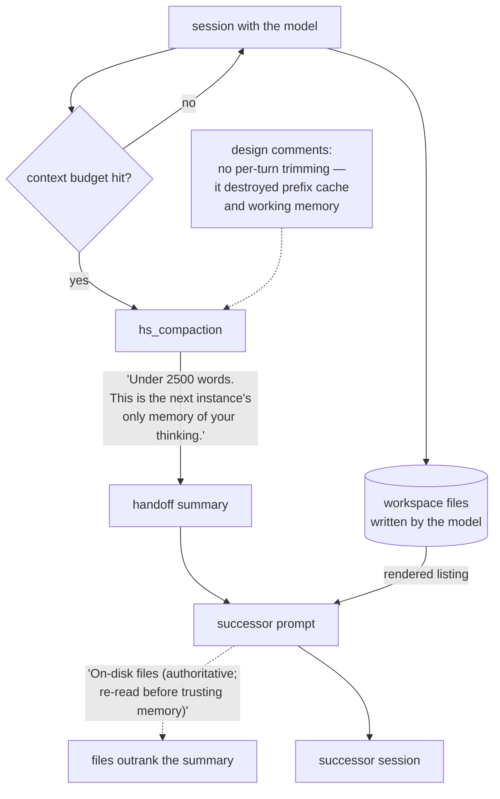

## 1. Executive Summary

Polyphony ARC is Mininglamp AI's ARC-AGI-3 harness — 6,542 lines of its own
Python beside 79,035 vendored, MIT, a single commit dated 6 July 2026 and no
tests directory.

Its published ARC-AGI-3 result is 19.80% at $115 — 2 of 21 games won, 59/157
levels — which is the lower end of that leaderboard and well below the two
harnesses this report compares it to. Its memory is a compaction: when the
context budget runs out, the model writes a handoff summary and a fresh context
starts from it. Two design decisions in
`hs_compaction.py` are worth a report. The summary is **bounded and its stakes
are stated to the writer** — *"Under 2500 words. This is the next instance's
only memory of your thinking."* And the successor is told not to trust it:
files on disk are rendered under the heading *"On-disk files (authoritative;
re-read before trusting memory):"*

**No marks.** Both rules are prompt text, and unlike [Tycho](../tycho/) none of
it is machinery.

## 2. Mental Model

A compaction is a lossy write, and this harness treats it as one.

The model is told the word budget and told what the words are for, which is a
different instruction from *summarise the conversation*: a writer who knows the
summary is the successor's only recollection prioritises differently from one
who thinks a transcript is still available.

Then the successor is given the summary and, in the same prompt, a list of the
files that outlive it — with the files declared authoritative. Where the two
disagree, the prose loses.

## 3. Architecture

## 4. Essential Implementation Paths

**Compaction is the only memory event.** There is no store, no record type and
no write path other than the summary the model produces at the boundary.

**The bound is stated with its reason.** *"Under 2500 words. This is the next
instance's only memory of your thinking."* A cap without a reason gets a
truncated transcript; a cap with the stakes attached gets a briefing. It is a
prompt-engineering choice rather than a mechanism, but it is the right one.

**The file listing carries the precedence rule inline.** Rather than a separate
instruction to prefer files, the authority claim is the *heading* of the
listing — the successor cannot read the file names without reading that the
files outrank its memory.

**The comments record what went wrong before.** Two survive in the source: one
noting that an earlier approach *"deleted the agent's WORKING MEMORY"*, and one
that per-turn trimming *"destroyed prefix cache + working memory"* and was
therefore removed. Both are failure modes of aggressive context management, and
the current design is legible as a response to them.

## 5. Memory Data Model

None. The unit is prose under a word cap. There is no field for confidence, for
provenance, for time, for scope or for a rejected conclusion, and nothing parses
the summary after it is written.

This places the system at the same point as [Retrodict](../retrodict/) — the
memory contract is a prompt — with one difference in the contract's content.
Retrodict asks the model to mark each point *checked against the log* or *still
assumed*; Polyphony asks for a bounded summary and states which artifact wins a
disagreement. Neither is read by code. Retrodict's version says more.

## 6. Retrieval Mechanics

There is no retrieval. The summary is injected into the successor's prompt in
full, and the file listing beside it is a directory rendering rather than a
query. Nothing is ranked and nothing is selected, which for a single bounded
summary is coherent.

## 7. Write Mechanics

One write, at the compaction boundary, by the model. No validation, no schema,
no size enforcement beyond the instruction, and no diff against the summary it
replaces.

## 8. Agent Integration

The harness wraps a long-horizon ARC-AGI-3 session with a deliberate choice not
to trim per turn — the comment above says why — so the working context stays
intact until the budget forces a full compaction. The vendored tree is twelve
times the size of the harness's own code and was not read for this review.

## 9. Reliability, Safety, and Trust

Single agent, single workspace, no other principal: scope, audit and review
have no consumer here, and their absence is not a defect. What is a defect is
that neither of the two good rules is checkable. A summary that runs to 4,000
words, or one that contradicts a file it was supposed to defer to, produces no
error and leaves no trace.

The absence of a tests directory matters more than the marks it costs. This is a
harness whose entire memory behaviour is emergent from prompt text, published
with a benchmark claim and without a single committed assertion about the
compaction path.

## 10. Tests, Evals, and Benchmarks

There is no tests directory. Nothing was run for this review.

The published result is
[the official scorecard](https://arcprize.org/scorecards/d0895597-2bb5-4191-9b7b-ec97917da1aa),
listed on the ARC Prize community leaderboard as **19.80%** on ARC-AGI-3 Public
Demo for $115, dated 7 July 2026 and tagged `v11.2-swarm`. Underneath: **2 of 21
environments won**, 59/157 levels, 6,838 actions. Two games finish at 100.00
(`lp85-305b61c3` and `tu93-0768757b`) and eleven score below 5. The 21
per-environment scores average to 19.8029, so the figure recomputes from its own
table.

Two qualifications belong beside it. The metric is RHAE — relative human action
efficiency — so 19.80% is not a completion rate, and the 59/157 levels is the
closer thing to one. And this run covers **21 environments where
[Tycho](../tycho/) and [Retrodict](../retrodict/) cover 25**: `ft09`, `r11l`,
`sb26` and `sc25` are absent here, so the three numbers are not means over the
same set, which matters for anyone below a ceiling. The leaderboard hosts but
does not check these — only ARC-AGI-1 and ARC-AGI-2 semi-private results are run
and verified by ARC Prize, and *"everything else is scored on a public set and
self-reported."*

A harness at 19.80% with no committed test of its compaction path is not a
system whose memory design has been demonstrated. The two prompt lines in
section 4 are worth reading because they are well-stated, not because a result
vouches for them.

## 11. For Your Own Build

**Tell the summariser what the summary is for.** *"This is the next instance's
only memory of your thinking"* changes what a model chooses to keep, at no
implementation cost.

**Put the precedence rule in the artifact, not beside it.** Making *files are
authoritative* the heading of the file listing means the reader cannot skip it.

**Leave the failure in the comment.** *"No per-turn trimming (that destroyed
prefix cache + working memory)"* is why the next person will not reintroduce it.

## 12. Open Questions

**What does a real handoff summary look like?** None is committed, so whether
the 2,500-word bound is honoured, and what a compaction drops, is unmeasured.

**Is anything carried between games?** The summary is within-run. Nothing found
here moves a conclusion across runs.

**What is in the vendored tree?** 79,035 lines, unread for this review; a memory
mechanism inside it would not have been seen.

## Appendix: File Index

| Path | What it holds |
| --- | --- |
| `arc_hs/hs_compaction.py` | The compaction, the word bound, the authoritative-files heading, the design comments |
| `arc_hs/` | The harness's own code, 6,542 lines |
| vendored tree | 79,035 lines, not read |

## History

**2026-08-28** — [`9bb384c25d1bc95501cb08a124af7871c9ea24eb`](https://github.com/Mininglamp-AI/polyphony-arc-3/commit/9bb384c25d1bc95501cb08a124af7871c9ea24eb) — same commit, second reading, covering the published scorecard: 19.80% on ARC-AGI-3 Public Demo at $115, 2 of 21 environments won, 59/157 levels, 6,838 actions, recomputing from its own per-environment table. The run covers 21 environments where the two harnesses this report compares against cover 25, so the three means are not over the same set. Sections 1 and 10 now carry the result, which the first reading described only as "a benchmark claim". Marks unchanged at none.

**2026-08-27** — [`9bb384c25d1bc95501cb08a124af7871c9ea24eb`](https://github.com/Mininglamp-AI/polyphony-arc-3/commit/9bb384c25d1bc95501cb08a124af7871c9ea24eb) — first reading, MIT, 6,542 lines of harness code beside 79,035 vendored, a single commit dated 6 July 2026, no tests directory. Screened before reading: no auto-run surface, no execution surface, one unpinned dependency surface. Nothing was installed and nothing was run. No marks. The whole memory mechanism is a compaction that asks the model for a handoff summary under 2,500 words and hands the successor that summary beside a file listing headed as authoritative. `trust_state` is withheld: the files-outrank-memory rule is prompt text with nothing reading it, and no memory carries a status field. `tombstone`, `bitemporal`, `scope_enforced`, `audit_log` and `human_review` are absent, and `negative_eval` cannot be earned — there are no tests. The reading covers the harness's own code; the vendored tree was not read.
