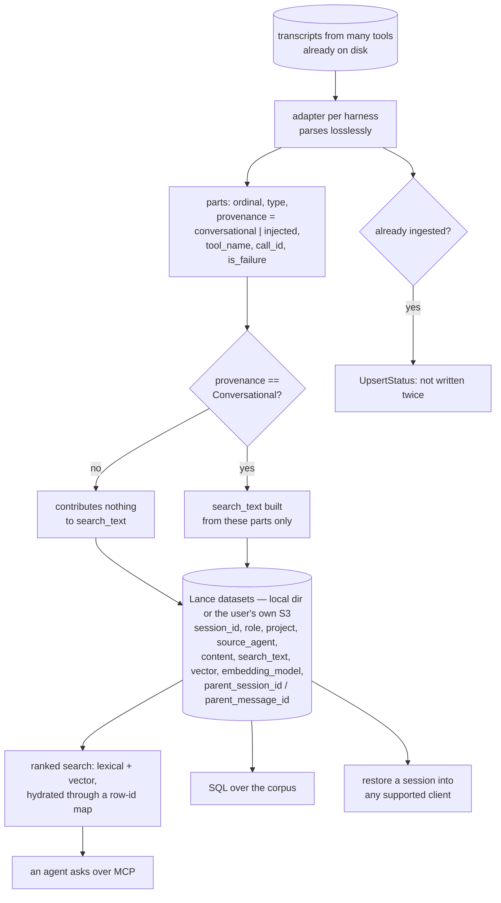

## 1. Executive Summary

pond and the retroactive-archive idea arrive at the same observation — the
sessions are already on disk — and diverge on what to do with them. Where a
peer indexes the transcripts in place, pond **ingests them losslessly** into
Lance columnar datasets in storage the user owns, a local directory or their own
S3 bucket, and then makes the corpus searchable, SQL-queryable, and restorable:
*"any session can be restored into any supported client and continued there."*

Apache-2.0; 462 commits between 7 May and 9 September 2026 from seven authors;
78,218 lines of Rust in one crate under a Moon-managed workspace with a Nix
flake; 307 test attributes. The screen found one auto-run surface, two manifests
inside the seven-day cooldown, two build-time execution paths and four unpinned
dependency surfaces; nothing was installed or run.

**The mechanism worth the report is one predicate.** Every message part carries a
`provenance` column with two values, `conversational` or `injected`, and
`search_text` skips anything that is not conversational:

```rust
// spec.md#search: only conversational parts contribute to the indexed
// text; harness-injected scaffolding is excluded from search.
if part.provenance != Provenance::Conversational {
    continue;
}
```

So the archive keeps everything — the injected `<task-notification>` blocks, the
system scaffolding, whatever the harness put in the transcript — and none of it
can be found later as though a person had said it. That is the right split for a
lossless archive, and it is the distinction most session-search tools do not draw
at all: they index the transcript, scaffolding included, and a search for a
phrase the harness emits returns hundreds of hits.

**The mark it earns is for testing that predicate honestly.** The case drives the
real `search_text` twice against the same message shape: a conversational part
yields `Some("real human prompt")`, and an injected part carrying a
`<task-notification>` payload yields `None`, asserted with *"a message whose only
part is injected has null search_text."* The present control sits above the
absence in the same body, so neither arm can pass over an empty fixture.

**An unknown provenance is an error, not a default.** `provenance_from_str`
matches the two known values and otherwise `bail!("unknown part provenance
{other}")`. A new value from a changed adapter fails the read rather than
silently becoming conversational and entering the index — the conservative
direction, and the one that is easy to get backwards.

**What it does not have is any epistemic layer, and the archive framing explains
why.** No confidence, no status, no validity interval, no forgetting. A
conclusion that was wrong a year ago is a row like any other, ranked by
relevance. The design is an archive with search over it, and it says so.

**Two things a reader should weigh before installing it.** Nothing is redacted on
ingest: a lossless archive of every session on a machine is a lossless archive of
every credential anyone pasted into one, now also in an S3 bucket if that is
where the corpus lives. And no scope is applied by default — `project` and
`source_agent` are stored and filterable, and the corpus spans every tool and
every project unless a caller narrows it.

## 2. Mental Model

A session happened in some tool. An adapter for that tool parses its transcript
into pond's own shape: a session, its messages, and each message's parts. The
parse is meant to lose nothing, so a part that is a tool call keeps its
`tool_name`, its `call_id` and whether it failed, and a part the harness injected
keeps its text.

Ingest is an upsert. Re-reading a session that has already been ingested returns
an `UpsertStatus` rather than writing it twice, and a sync-state record per
source tracks what has been taken.

The split between *stored* and *searchable* is made at ingest. `search_text` is
computed once, from the conversational parts only, and written as a column. The
vector is computed from the same material with the embedding model recorded
beside it. So the index is a view of what somebody said, while the dataset holds
what happened.

Reading has three shapes. An agent asks over MCP and gets ranked hits, hydrated
from a row-id map so the exact row is fetched rather than re-found. A person runs
SQL over the corpus. Or a session is restored into a client and continued — the
part that makes this an archive rather than a search index, because the
transcript was kept whole enough to replay.



## 3. Architecture

One Rust crate, `packages/pond`, 78,218 lines, under a workspace whose root
manifest exists mainly to hold the build profiles — with a comment explaining
that cargo honours them only there. Moon manages tasks, Nix pins the toolchain,
and the release surface is Homebrew and Scoop.

The modules divide cleanly: `adapter/` per harness, `sessions.rs` as the large
one holding the Lance schemas and the read and write paths, `sql.rs` for the
query surface, `embed.rs` for vectors, `handlers.rs` for the MCP tools,
`snapshots/` and `syncstate.rs` for incremental ingest, `schedule.rs` for the
periodic run, `rowmap.rs` for the hydration map, `render.rs` for output and
`wire.rs` for the shared types including `Provenance`.

Storage is Lance rather than SQLite or Postgres, which is the choice that makes
the SQL surface and the S3 option coherent: columnar files the user owns, no
server, and a scan that can push a predicate and a projection. `ScanOpts::
with_predicate_and_projection` appears throughout the read path, so the code is
written for column pruning rather than row fetching.

The code carries its reasoning in comments the way a maintained project does —
the `SearchHit` type documents when `rowid` is `Some` and why, and the profile
comments explain each setting's cost.

## 4. Essential Implementation Paths

- **Ingest.** an adapter parses a transcript → messages and parts → `upsert`
  returning `UpsertStatus::Inserted` or its siblings → `syncstate` records what
  this source has contributed.
- **Decide what is searchable.** `search_text(&message, &parts)`
  (`sessions.rs:4461-4470`) skips every part whose provenance is not
  `Conversational`, then collects text and file parts for user and assistant
  roles.
- **Parse provenance.** `provenance_from_str` (`sessions.rs:5855-5861`) maps the
  two known strings and `bail!`s on anything else.
- **Store.** the Lance message schema (`sessions.rs:5076-5107`) with
  `parent_session_id`, `parent_message_id`, `source_agent`, `project`, `role`,
  `content`, `search_text`, `vector`, `embedding_model`; the parts schema
  (`:5222-5233`) with `ordinal`, `type`, `provenance`, `tool_name`, `call_id`,
  `is_failure`.
- **Search and hydrate.** the two arms produce `SearchHit`s carrying a
  `MessageKey` and an optional `rowid`; hydration uses `take_rows` on the row id
  when the map resolved one and falls back to an `IN` predicate when it did not.
- **Filter, if asked.** `handlers.rs:1924-1927` pushes
  `Predicate::LikeContains("project", …)` or `Predicate::Regex("project", …)`
  when the caller supplied a project filter.

## 5. Memory Data Model

**The message.** `session_id`, `id`, `role`, `source_agent`, `project`,
`content`, `search_text`, a `vector` with its `embedding_model` recorded beside
it, a timestamp, and `parent_session_id`/`parent_message_id`. Those last two are
worth naming: a session forked or resumed from another keeps a pointer to where
it came from, so the corpus is a forest rather than a flat list, and a search hit
can be traced back through the branch that produced it.

Recording `embedding_model` on the row rather than in configuration is a small
correctness win — a corpus embedded across a model change can tell which rows
are comparable.

**The part.** `ordinal`, `type`, `provenance`, and for a tool interaction
`tool_name`, `call_id` and `is_failure`. Keeping the failure flag means the
corpus knows which tool calls went wrong, which is exactly the material somebody
searching *"how did we fix this before"* wants and which most transcript indexes
flatten away.

**The one discrete state.** `Provenance::Conversational` or
`Provenance::Injected`. It is a genre — assigned by the adapter from the
transcript's structure at ingest — rather than a judgement about whether
something is true, which is why `trust_state` is withheld below. What it does is
still the useful half: it separates what a participant said from what a harness
inserted.

**What is absent.** No confidence, no verification status, no supersession
pointer, no validity interval — a search of the crate for `valid_from`,
`valid_to` and `as_of` returns nothing. For an archive that is coherent; the
report records it because a reader evaluating pond as a *memory* rather than as
an archive will find nothing here that ages a claim.

## 6. Retrieval Mechanics

Two arms over Lance. The lexical arm reads `search_text`; the vector arm reads
`vector`, with `embedding_model` alongside so a mixed-model corpus is legible.
Both produce `SearchHit`s that carry a `MessageKey` and an optional `rowid`.

The hydration path is the engineering detail worth copying. A prewarm builds a
row-id map, and a hit that resolved a stable row id is fetched with `take_rows`
rather than re-found with an `IN` predicate scan — the type's own comment
explains that `rowid` is `None` on the fallback path used by local tests and
before prewarm. Two ways to fetch the same row, with the cheap one available when
the map is warm and a correct fallback when it is not.

Filtering is optional and caller-supplied. `project` accepts a contains match or
a regex; `source_agent` is stored and available the same way. Nothing narrows by
default, which is deliberate — the value proposition is a corpus that spans every
tool — and it is why `scope_enforced` is withheld: there is no boundary, only a
query the caller may narrow.

A SQL surface exposes the datasets for arbitrary queries, which is a genuine
differentiator: a person who wants *how many tool calls failed in this project
last quarter* has a query rather than a feature request.

## 7. Write Mechanics

Ingest is per-adapter parsing followed by an upsert, and the upsert returns a
status so a caller can tell an insert from a no-op. A `syncstate` record per
source tracks what has already been taken, so a periodic run is incremental
rather than a full re-read.

**The write path is where searchability is decided.** `search_text` is computed
once, at ingest, from the conversational parts, and stored as a column. That
makes the exclusion cheap at query time and permanent until re-ingest — an
adapter that mislabels a part has no second chance to be corrected without
rebuilding, which is the cost of deciding at write time rather than filtering at
read time.

**Session content is not redacted, and the project does redact elsewhere.**
`config.rs` carries three separate guards citing `spec.md#storage-redaction` —
`pond config show` never echoes a credential value, and the generated recipe
must not contain the real one. So the codebase knows how to redact and chooses
to on the configuration path. It does not on the ingest path: a lossless archive
of every session on a machine holds every token, key and password anyone pasted
into an agent, and if the corpus is configured to an S3 bucket it holds them
there. Losslessness and redaction are in genuine tension, and the asymmetry is
worth knowing before pointing pond at a work machine.

## 8. Agent Integration

An MCP server is the agent-facing surface, so a coding agent can query the corpus
mid-task rather than a person searching separately. A CLI covers the human side,
and installation is Homebrew or Scoop, or — per the README — asking an agent to
follow the documented setup prompt.

The feature that distinguishes pond from a search tool is restoration: *"Sessions
stop being locked to the tool that created them: any session can be restored into
any supported client and continued there."* That is only possible because ingest
is lossless and the part structure was preserved, and it turns the archive into a
migration path between harnesses rather than only a memory of them.

## 9. Reliability, Safety, and Trust

**Negative evaluation — awarded.** The `search_text` test drives the real
function on both arms against the same message shape, with the conversational
control asserted before the injected absence, so neither can pass on an empty
fixture. The absence is also the property the design is *for*, which is the best
kind of case to have.

**Trust state — withheld, and the near miss is worth the paragraph.**
`Provenance` is a stored, discrete, two-value field, and one of its values causes
material to be withheld from the index entirely — which is most of what the mark
asks. Two things keep it back. It is a genre assigned by an adapter from the
transcript's structure, not a judgement about whether a claim holds, so it
answers *who put this here* rather than *may this be treated as true*. And the
exclusion happens at ingest, when `search_text` is computed, rather than as a
filter on the read path — the injected row is stored and simply never becomes
searchable. Both are defensible choices for an archive and both put it outside
this mark.

**Scope — withheld.** `project` and `source_agent` are stored and filterable, and
the filter is a caller's option with no default. A corpus spanning every tool and
project is the product; a boundary is not offered.

**Tombstone — withheld.** Nothing records a rejected value. There is no rejection
in the model at all.

**Audit log — withheld.** The archive is a record of sessions, not of mutations
to memory; `syncstate` records what each source has contributed, which is an
ingest bookmark.

**Bitemporal — withheld.** A message timestamp; record time only.

**Human review — withheld.** No surface adjudicates content.

**One property worth naming that the rubric has no mark for.** An unknown
provenance value is a hard error. `provenance_from_str` bails on anything that is
not one of the two known strings, so an adapter change that introduces a third
kind fails loudly instead of quietly labelling scaffolding as speech. Failing
closed on an unrecognised value is the same instinct that makes another system's
trust matrix raise rather than default, and it is rarer than it should be.

## 10. Tests, Evals, and Benchmarks

307 test attributes across the crate, inline in the modules they cover in the
Rust convention. The provenance case described above is the one this report
turns on; `parts_chunk_materializes_tool_identity_columns` sits beside it,
pinning that the tool identity columns reach the Lance chunk.

There is no benchmark and none is claimed. The README's demonstration is a
recording — *"A live 12k-session corpus, then a three-month-old fix found and
verified against the current code"* — which is a claim about an installation
rather than a measurement anyone can rerun, and this report records it as the
former. No committed result file, no harness for a public benchmark, and no
retrieval-quality evaluation.

No paper of its own. `docs/spec.md` cites others — including
[arXiv:2512.24601](https://arxiv.org/abs/2512.24601) on recursive language
models, credited for corroborating pond's branching model, which is the
`parent_session_id` lineage in the schema.

**The spec is worth naming as a practice.** `docs/spec.md` is the design
document, and the code cites it by anchor: `spec.md#search` above the provenance
skip, `spec.md#storage-redaction` above each credential guard. A comment that
names the section of a spec it implements is a reference that survives a
refactor, and it is how the reasoning above stayed checkable while reading.

## 11. For Your Own Build

### Steal

- **Store everything; index only what somebody said.** One predicate on a
  provenance column keeps harness scaffolding out of search while leaving it on
  disk for reconstruction. Most transcript indexes skip this and then return
  hundreds of hits for a phrase the harness emits.
- **Make an unknown enum value an error.** `bail!("unknown part provenance
  {other}")` means an adapter change cannot silently promote scaffolding into the
  searchable corpus.
- **Record the embedding model on the row.** A corpus embedded across a model
  change can then say which rows are comparable, without a migration.
- **Keep `is_failure` on a tool part.** The searchable corpus of *what went
  wrong* is the one people actually query, and flattening tool results loses it.
- **Give a hit a stable row id and a correct fallback.** `take_rows` when the
  prewarmed map resolved one, an `IN` predicate when it did not, with the
  type's own comment saying which path is which.

### Avoid

- **A lossless archive with no redaction.** Ingesting every session on a machine
  whole means ingesting every secret pasted into one, and pointing that at an S3
  bucket moves them. Redaction and losslessness are in tension, and the tension
  should be a documented decision rather than an unstated one.
- **Deciding searchability at write time without a rebuild path.** `search_text`
  is computed at ingest, so an adapter that mislabels a part is wrong until the
  corpus is re-ingested.

### Fit

pond suits someone with a long history across several agent tools who wants that
history in storage they own, queryable with SQL as well as searched, and who
values being able to pick a session up in a different client than the one that
wrote it. The Lance choice makes it operable without a server and portable to a
bucket, and the provenance split means the search results are what people said
rather than what the harness emitted. It is the wrong choice on a machine that
touches other people's secrets, because nothing is stripped on the way in and the
corpus is a single undifferentiated pool. It is also not a memory in this atlas's
sense — nothing here can be marked doubtful, corrected or retired, and a reader
wanting that should treat pond as the substrate and build the epistemic layer
above it.

## 12. Open Questions

- Is redaction planned, and would it be compatible with the losslessness claim?
  A stored-but-masked column would satisfy both, at the cost of a second copy.
- Can `search_text` be recomputed without a full re-ingest? An adapter fix today
  appears to need one.
- What uses `parent_session_id`/`parent_message_id` on the read path? The lineage
  is stored; the reading did not find a surface that walks it.
- Does the S3 configuration change the security posture the docs assume? The
  local-directory default and a shared bucket are different threat models for the
  same unredacted corpus.

## Appendix: File Index

| Path | Lines | What it holds |
| --- | --- | --- |
| `packages/pond/src/sessions.rs` | — | The large one: `MessageMeta` (210-219), `SearchHit` (228-233), `search_text` and the provenance skip (4461-4470), the Lance message schema (5076-5107), the parts schema (5222-5233), `provenance_from_str` (5855-5861), the provenance test (6300-6329) |
| `packages/pond/src/adapter/` | — | One parser per supported harness |
| `packages/pond/src/handlers.rs` | — | The MCP tools; the optional project predicate (1924-1927) |
| `packages/pond/src/sql.rs`, `embed.rs`, `rowmap.rs` | — | The SQL surface; the vector arm; the row-id map that makes `take_rows` hydration possible |
| `packages/pond/src/syncstate.rs`, `snapshots/`, `schedule.rs` | — | Incremental ingest bookkeeping, snapshots, the periodic run |
| `packages/pond/src/wire.rs` | — | The shared types including `Provenance` |
| `Cargo.toml` (root), `moon.yml`, `flake.nix` | — | Build profiles with their reasoning, task running, the pinned toolchain |

Searches behind the absence claims above, run from the repository root:

```sh
rg -n 'Provenance::' packages/pond/src --glob '!*test*'                 # the skip in search_text and the parser; nothing filters on read
rg -n 'valid_from|valid_to|as_of' packages/pond/src                     # none: a message timestamp, record time only
rg -n -i 'redact|scrub|mask' packages/pond/src                          # three guards in config.rs on credentials; none on the ingest path
rg -n 'confidence|verified|status' packages/pond/src/sessions.rs         # UpsertStatus only — an ingest outcome, not a claim state
rg -n -i 'arxiv|bibtex|@article|@misc|Citation|CITATION.cff|doi' README.md docs  # citations in docs/spec.md to others; no paper of its own
```

## History

**2026-09-10** — [`e75182a41964754acec493696581806118b2b9f0`](https://github.com/tenequm/pond/commit/e75182a41964754acec493696581806118b2b9f0) — first reading, at the head of `main`, the last commit of 9 September 2026. Screened before reading: one auto-run surface, two manifests inside the seven-day cooldown, two build-time execution paths, four unpinned dependency surfaces, and agent instruction files treated as data; nothing was installed, built or run, and the read was made from a full clone. One mark. The reading covered the Lance schemas, the ingest and upsert path, the provenance split and what it excludes, the two retrieval arms and their hydration, and the optional filters; the SQL surface, the snapshot machinery, the scheduler and the per-harness adapters were read as context rather than as subject.
