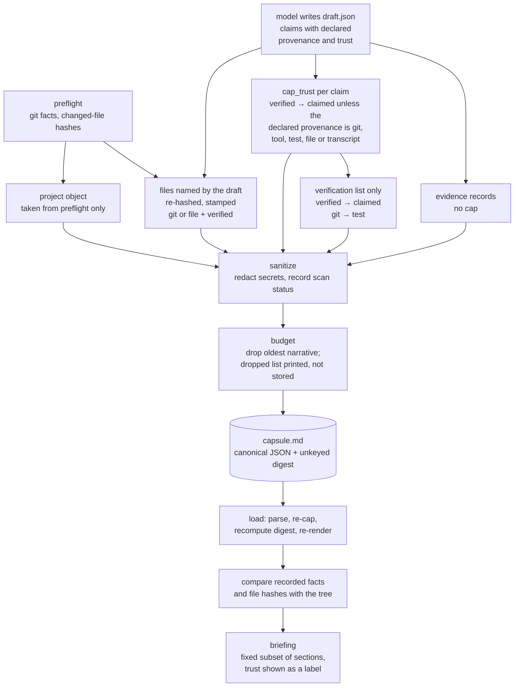

## 1. Executive Summary

Portable Handoff writes one Markdown **capsule** at the end of a coding session
so the next session, possibly in a different tool, starts from what mattered.
Its notable move is a split of authority: local code records git state and file
hashes, the model writes labelled claims, and `verified` is refused to any claim
whose declared provenance is conversation or inference. Its weakness is that the
cap compares two fields the same author writes, and no read path filters on any
of the five trust states.

The README's design sentence is *"the model supplies the meaning and local code
supplies the facts."* It holds for the repository: `finalize` takes the
`project` object from `preflight` alone and re-hashes every file the draft
names, so a draft cannot forge a commit, a dirty flag or a hash. It does not
hold for claims. A constraint written with `"provenance": "tool"` and
`"trust": "verified"` passes `cap_trust` and reaches the capsule, and the
briefing, as `[verified]`. The skill documents that rule
(`skills/handoff/SKILL.md:107-110`), so the cap works as written; the written
rule is weaker than "the model may not author facts".

**Strongest:** the briefing states the capsule's age, whether its HEAD is
reachable from a remote-tracking branch, and which recorded facts and file
hashes no longer match the tree. The secret scan records whether it ran as well
as what it redacted. The command-safety module classifies a carried shell
command at load time against raw text, *"so a capsule has no field it could
populate to declare itself safe."*

**Weakest:** nothing withholds. Every trust state is a label beside text, a
memory marked `untrusted` reaches the capsule exactly like a `verified` one, and
the briefing drops whole sections by schema rather than by status. That is why
`trust_state` is withheld. Beside it, file references and evidence records are
never capped, and the list of what the budget dropped goes to the terminal at
`finalize` rather than into the capsule.

## 2. Mental Model

A memory is a **claim**: text, plus where it says it came from, plus how much
weight it can carry.

```text
claim = { text, provenance, trust, evidence_refs[], captured_at }

provenance ∈ conversation:user · conversation:assistant · tool · file
             git · test · transcript · model_inference
trust      ∈ verified · observed · claimed · inferred · untrusted

                       cap_trust(provenance, trust)
   trust = verified  ───────────────────────────────►  claimed
   unless declared provenance ∈ { git, tool, test, file, transcript }

decision.status ∈ active · superseded
secret_scan.status ∈ passed · failed · not_run · unknown
```

The state machine is about **authority**, not lifecycle. A claim never moves
between trust states over time; it is assigned one when the draft is written
and capped once when the draft or capsule is parsed. Nothing promotes a claim,
nothing demotes it later, and nothing expires. A capsule is never rewritten; the
only correction is another capsule, and no capsule references the one it
replaces.

Authority is divided by **field**, not by claim. Local code owns the repository
snapshot and the file hashes and never interprets them. The draft author owns
every claim, including the provenance the cap consults. The cap rules out one
pairing — `verified` beside conversation or inference — and leaves the author
free to name a deterministic source. The system treats a capsule as untrusted
historical data and says so in the rendered artifact, the module docstrings and
the briefing.



## 3. Architecture

**Runtime shape.** A Python CLI with eight subcommands — `preflight`,
`finalize`, `validate`, `load`, `doctor`, `export`, `list` and `source`, the
last with `probe`, `list` and `show` of its own (`cli.py:24-78`) — plus a
`skills/handoff/` package installed into Claude Code, Codex CLI or Cursor, and
`integrations/generic/HANDOFF_INSTRUCTIONS.md` for other hosts. No server, no
daemon, no database, no runtime dependencies.

**Persistence.** One Markdown file per capsule under
`<repo>/.handoff/capsules/` (`storage.py:19-21`), with an embedded canonical
JSON document (`strict_json.py`, `canonical.py`). The schema, version 1.2,
ships twice as byte-identical copies in `schemas/` and the package resources.
Versions 1.0 and 1.1 are refused by name (`models.py:26`, `:675-676`) because
*"1.1 adds fields a 1.0 reader would not know to distrust."*

**Retrieval.** There is none. A capsule is loaded whole and projected into a
briefing; there is no query, no index and no embedding. The unit of recall is
the session.

**Transcript adapters.** `adapters/` reads Claude, Codex (files and SQLite),
Cursor (files and live) and a generic transcript, bounded and read-only, and
`source show` marks its output `untrusted_content: True` (`sources.py:45`).

### Deployment and ergonomics

`pip install`, standard library only, enforced in CI by
`scripts/check_stdlib_only.py`, and no lockfile beside `pyproject.toml`.
`doctor` reports a host as `supported`, `degraded` (no git, so repository facts
are unknown) or `unsupported`. Everything is local, and the capsule is a
Markdown file you can read, diff and email.

A host with no shell gets a draft, not a capsule. The README says so, and says
what it costs: the result has *"no digest and no verified repository facts"*
until `finalize` runs on a machine with the CLI (`README.md:129-136`).
`integrations/generic/HANDOFF_INSTRUCTIONS.md:13-14` gives different advice,
to write a Markdown capsule with the embedded JSON by hand and mark local facts
`unknown` or `claimed`. Such a file cannot pass `validate`, which recomputes a
SHA-256 digest and requires a byte-exact re-render (`validate.py:31-41`).

## 4. Essential Implementation Paths

**Fact capture.** `preflight.py` and `gitfacts.py` record the repository root,
remotes, branch, commit, dirty state, worktrees and changed files, each changed
file hashed and stamped `git` and `verified` (`gitfacts.py:137-138`).
Publication is `git branch --remotes --contains <commit>` (`gitfacts.py:225`),
so it reports reachability from a local remote-tracking ref and makes no
network call.

One guard in that path defends the capsule's central claim. A repository with no
commits reports `HEAD` as git's all-zero object id, which matches the hex
pattern a commit is validated against, so recording it verbatim *"would let a
capsule claim a specific commit exists when nothing has been committed at
all."* `_is_null_oid` rejects it and the field becomes `None` instead
(`gitfacts.py:183`, `:203`), and
`test_unborn_branch_worktree_commit_is_not_a_fabricated_hash` pins it.

**Meaning capture.** The model writes a draft JSON against
`schemas/handoff-v1.schema.json`. A bare string defaults to `model_inference`
and `inferred`, and the skill tells the model that `verified` is accepted only
beside `git`, `tool`, `test`, `file` or `transcript`
(`skills/handoff/SKILL.md:95-110`).

**Merge.** `finalize.py` builds the capsule from three sources. The `project`
object comes from preflight alone, and a draft that sets `created_at`,
`handoff_id`, `integrity` or an evidence digest is refused (`finalize.py:41-58`).
Every file the draft names is resolved inside the root, re-hashed and stamped
`git` or `file` with `verified` (`:96-123`). Everything else is the draft's,
normalized by `models.py`.

**Cap.** `cap_trust` (`models.py:166-170`) returns `claimed` for `verified`
unless the provenance is in
`DETERMINISTIC_PROVENANCES = {git, tool, test, file, transcript}` (`:22`). It
runs on claims, decisions, verification records, errors and recent context
(`:216`, `:250`, `:313`, `:340`, `:365`). It does not run on file references
(`:282`), changed files (`:482`) or evidence records (`:394`), and an evidence
record the draft leaves unlabelled defaults to `tool` and `observed`
(`:392-393`). `_downgrade_model_verification` (`finalize.py:126-133`) then
rewrites `verified` to `claimed` and `git` to `test` on the `verification`
list only (`:170`).

So a draft cannot turn conversation into `verified`, and it can label any
constraint, decision or risk `verified` by declaring `tool` or `test` as its
source. Nothing checks that a tool ran. The quality harness's *model overclaims
trust* scenario pins the first half (`tests/quality/evaluate_quality.py:90`,
`:146`); no committed case covers the second.

**Sanitize.** `sanitize.py` scans every string for eight secret families and
replaces a match with a kind marker such as `[REDACTED:github]` (`:38-45`),
recording kind and count but not the matched text. `finalize` records the scan
as a `ScanStatus` — `passed`, `failed`, `not_run` or `unknown` —
(`finalize.py:204`), and `render.py:263` says in the artifact: *"An empty list
is only meaningful when the scan status above is `passed`."*

**Budget.** `budgeting.py` drops the oldest item from recent context, evidence,
completed state, risks, errors, files and scope-out in rotation until the token
estimate is under target, then truncates long narrative behind a `…[budgeted]`
marker (`:64-72`, `:52`). The `BudgetReport` with `dropped[]` and `truncated[]`
is printed in the `finalize` command's JSON result (`cli.py:115-124`) and is not
written into the capsule. A later reader sees truncation markers and no trace of
dropped items. The priority comment says verified facts are preserved, while
`files`, the re-hashed records, is on the drop list.

**Load.** `load.py` validates first: strict parse, normalization with the cap,
the digest recomputed over the normalized document, and a byte-exact re-render
(`validate.py:31-41`, `canonical.py:31-35`). It then compares recorded facts
with the tree. Root, remote and commit are compared when both sides have them,
branch and dirty state when they differ, and each named file is re-hashed and
reported `match`, `different`, `missing` or `appeared` (`load.py:82-154`). The
result is a bucket from `fresh` through `obsolete` (`:156-169`); a mismatched
root makes the capsule `obsolete` and yields a briefing regardless. The briefing
states age and publication state, pinned by
`test_briefing_states_capsule_age_and_publication_state`: *"less than a day
old"*, *"HEAD reachable from a remote: no"*.

**Command safety.** `command_safety.py` classifies `next_action.command` as
`read_only`, `review` or `dangerous` against fifteen named families
(`:30-46`) — downloaded content piped into a shell, recursive deletion, history
rewrite, privilege escalation, credential disclosure, scheduled persistence.
Its docstring states its limits: *"It is not a sandbox and can be evaded. It
over-flags on purpose"* (`:8-12`).

**Tests.** `tests/` holds unit, integration, security, adapter and quality
suites, and `tests/quality/` carries a committed `quality_report.json`.

## 5. Memory Data Model

The unit is the labelled claim, and `CLAIM_FIELDS = {text, provenance, trust,
evidence_refs, captured_at}`. Beside it sits an **evidence record** —
`evidence_id`, `kind`, `source`, `digest`, `summary`, `captured_at`, plus its own
provenance and trust — and claims point at evidence by id through
`evidence_refs`. That is the shape of
[evidence before belief](../../patterns/evidence-before-belief/), with the link
as an unchecked string list: nothing resolves a ref against the evidence
records, and the budgeter drops evidence before claims, so a ref can name a
record the capsule no longer holds.

**Scoping** is the repository. Capsules live in the repository's own
`.handoff/capsules/` directory, the capsule records a `repo_root_hint`, and load
compares it with the current root and reports the result. There is no user,
agent or tenant key, and none is wanted for a file a person carries between
their own sessions.

**Temporal.** `captured_at` per claim in RFC3339 UTC, validated
(`models.py:213-215`), and a capsule `created_at`. All of it is *capture* time —
there is no interval during which a fact is asserted true, so `bitemporal` is not
marked. What the design does instead suits its purpose: it computes the age at
read time, says it in words, and adds a re-verify warning past seven days
(`load.py:24`, `:238-239`).

**Correction.** `DecisionStatus` is `active | superseded`, so a decision can be
marked as replaced within one capsule. Across capsules there is only order:
`load latest` takes the newest filename in the directory
(`storage.py:115-119`), and no capsule references, supersedes or invalidates an
older one. There is no delete. For a per-session artifact that is defensible;
it also means the store cannot answer *what did we decide, currently* across a
project's history.

## 6. Retrieval Mechanics

`load` produces a briefing, not the capsule. It carries the goal, task status,
in-progress, pending and blocker text, constraints and user corrections with
their trust labels, the recorded repository facts, verification history,
staleness reasons, any blocking question and the next action
(`load.py:181-270`). Decisions, risks, unknowns, errors, recent context and
evidence are not in it, and files appear only as staleness reasons. `load --format json` returns the whole normalized
document, and `export` returns the prose half, the briefing or the JSON
(`cli.py:139-175`). There is no search, no ranking and no relevance model.

`test_export_emits_one_half_not_both` does not check what `export` writes: it
asserts the exit code and then that each forbidden marker is present in the full
capsule (`tests/integration/test_blocking_and_briefing.py:122-125`). The split
is correct on reading `_export`, and unasserted.

Two things happen at read time that most stores do only at write time, if at
all.

**The capsule is checked against the world.** The recorded git facts and file
hashes are compared with the current repository, so the reader sees which of
the capsule's assumptions have expired rather than discovering it later.

**The capsule's own reliability is stated.** Age in words, and whether the
recorded HEAD is reachable from a remote-tracking branch — *"may exist only on
the machine that wrote this capsule"* — which matters for a handoff between
machines.

**Failure modes.** The briefing's sections are fixed by the code, so what
reaches the next session is decided by the schema rather than the task; an
active decision and a superseded one are equally absent. Within the capsule,
dropped items leave no trace. Trust labels appear on two sections of the
briefing as text, and nothing else acts on them.

## 7. Write Mechanics

Two phases, and the split protects **repository facts**: the model cannot write
the commit, branch, dirty flag or a file hash. It writes the trust of its own
claims within the cap — `verified` beside `conversation:*` or
`model_inference` becomes `claimed`, and `verified` beside `tool` or `test`
stays. The cap runs again when any capsule is loaded, so a capsule from another
tool or an older version meets the same rule. Because the digest is recomputed
after normalization, a foreign capsule whose JSON, as hashed, pairs `verified`
with a conversational provenance fails the integrity check rather than loading
capped.

Writes are synchronous, local and deterministic apart from the model's own draft
step. There is no extraction pass over transcripts by default — the adapters
read them bounded and read-only, and mark the content untrusted.

**Bounds everywhere.** `bounds.py` caps string length, list items and nesting
depth; `test_large_nested_input_is_bounded` pins the depth limit;
`strict_json.py` rejects duplicate keys and does not echo the offending value
into the error. A parser that refuses to quote what it rejected is a small
property that few stores keep.

**Conflict handling.** None across capsules, and `active`/`superseded` within
one.

### Operational cost

No background work, no model call on the tool's own path — the only LLM
involvement is the drafting step the host agent performs. The read cost is one
briefing per session start. The token estimate and the dropped and truncated
lists are printed once, to whoever ran `finalize`. Write-to-readable lag is two
commands, and there is no staleness process because a capsule is never updated
— only re-read, with its age reported.

## 8. Agent Integration

A skill (`skills/handoff/SKILL.md`) plus per-host command files for Claude Code
and Cursor, an `agents/openai.yaml` for Codex, and
`HANDOFF_INSTRUCTIONS.md` for other hosts. `scripts/install_skill.py` installs
it, and `tests/integration/test_skill_install.py` covers the install.

The agent's agency is bounded by construction: it writes a draft in a fixed
schema and never touches the repository snapshot. No command edits a stored
capsule; `finalize --force` can replace one at an explicit output path
(`cli.py:42`, `storage.py:61`).

The briefing is where the design shows most clearly. It carries trust labels on
constraints and user corrections (`load.py:207-208` renders `> [claimed] text`),
while in-progress, pending and blocker lines carry text only (`:201-203`). It
states that capsule and transcript prose are untrusted historical data
(`:269`), and presents a carried command inside a fenced block with *"has not
been executed and is not a verified instruction"* and *"review before
running"* — assertions pinned by `test_briefing_presents_a_command_as_inert_data`.

## 9. Reliability, Safety, and Trust

**The security posture is the strongest part of the system.** A capsule is
untrusted input, classification runs on raw text at load, and the classifier's
limits are written into its docstring. The format note is equally plain about
the digest: it *"does **not** authenticate authorship: anyone who edits the
JSON can recompute it"* (`skills/handoff/references/capsule-format.md:34-40`).

**Provenance is typed, and on claims it is declared.** Eight channels, a cap on
the one pairing that would let conversation pass as fact, and evidence records
with digests. A draft that sets `created_at`, the integrity digest or an
evidence digest is refused at finalize
(`test_forged_timestamp_integrity_and_evidence_hash_are_rejected`).

**Secrets** are redacted with the kind recorded and the match withheld, and the
scan's own status is a field, so an empty redaction list cannot be read as a
clean bill of health.

**What is absent:** no state withholds. `untrusted` is rendered, not enforced,
and nothing in `src/` writes it on a capsule record. `superseded` is rendered in
the capsule and absent from the briefing along with every active decision. A
`dangerous` command is labelled and gated in prose rather than removed. The
consistent theory is *tell the reader everything and let the reader decide*,
which is coherent, and which relies on a model honouring labels in its context —
the one assumption this codebase otherwise refuses to make.

**Deletion and privacy.** A capsule is a file; deleting it is deleting the file.
Nothing syncs and nothing uploads.

## 10. Tests, Evals, and Benchmarks

Unit, integration, adapter, security and quality suites, run in CI on three
operating systems and Python 3.11 to 3.13. I did not run them. The security file
is short: a draft forging a timestamp, a digest or an evidence hash is refused,
malformed JSON never echoes content, and deeply nested input is bounded.

The negative assertions earn the one capability mark.
`test_secrets_are_redacted_without_disclosing_the_match` puts a token in a draft
field and asserts it **absent** from the rendered Markdown *and*
`[REDACTED:github]` **present** in the same fixture — an absence assertion with
its own positive control, so it cannot pass on an empty render.
`test_malformed_json_never_echoes_content` does the same for the parser's error
path, which is not memory.

`tests/quality/evaluate_quality.py` runs twelve scenarios through preflight,
finalize and load on a real git fixture and scores each output on twenty
boolean dimensions: canary strings planted in the draft must reach the briefing,
a failing test must not become `passed`, a secret must not appear, a hostile
command must be flagged. The committed `quality_report.json` records every
dimension passing in every scenario, a total score of 240, and
`test_quality_eval.py` re-runs the harness and asserts every scenario passes.
Its `trust_not_inflated` dimension checks the pairing, so a claim declared
`tool` and `verified` would pass it.

**What is not tested:** a draft claim that names a deterministic provenance, the
uncapped evidence and file records, and the content of `export`, whose test
asserts only an exit code.

## 11. For Your Own Build

### Steal

- **Cap the trust a record may declare by the provenance it arrived with, at
  parse time.** `cap_trust(provenance, trust)` is four lines, and applying it on
  read as well as write makes it hold for artifacts you did not produce. Then go
  one step further than this system: supply the provenance from the code path
  that created the record, not from the record's author.
- **Take the facts half away from the model entirely.** The `project` object is
  never read from the draft, and every file the draft names is re-hashed. That
  is the part of the split that holds without qualification.
- **Make "the scan did not run" a distinct value from "the scan found nothing."**
  `ScanStatus.not_run` beside `passed`, plus a rendered line saying an empty
  redaction list is only meaningful when the status is `passed`.
- **State the artifact's age and publication state at read time.** Not a badge —
  a sentence: *"less than a day old"*, *"may exist only on the machine that wrote
  this capsule."*
- **Classify carried commands against raw text at load, and say the classifier
  can be evaded.** A capsule with no field it can populate to declare itself safe
  is the correct shape for any artifact that crosses a trust boundary.

### Avoid

- **Do not let the author of a claim choose the provenance the cap consults.**
  A cap on the pairing stops conversation from passing as fact and does nothing
  about a model that names `tool` as its source.
- **Do not stop at labelling.** Five well-chosen trust states that no read path
  consults put the whole burden on a model honouring words in its context. At
  minimum, let the lowest state change what gets rendered.
- **Do not report the budget's losses only to the writer.** `dropped[]` exists
  and goes to the terminal; the reader who needs it gets the capsule without it.
- **Do not lose the chain.** A new capsule that does not reference the one it
  replaces cannot answer *what is currently decided* across a project, which is
  the question a handoff format will be asked next.

### Fit

This is for one person moving work between agents and tools. Take it if your
problem is the lost hour between sessions, you are willing to read the capsule,
and you treat its repository facts as checked and its claims as the model's.
Walk away if you need memory that accumulates: there is no store, no query, no
supersession across capsules and no way to ask what is true now rather than what
was true at the end of one session.

## 12. Open Questions

- Is there an intended chain between capsules — a `previous_capsule` field — or
  is one-shot the design? The schema has no field for it and the README does not
  say.
- Should a claim declaring `tool` or `test` be required to carry an
  `evidence_refs` entry that resolves to a record `finalize` wrote? The schema
  has both halves and nothing joins them.
- The repository is at version 0.1.0 with its last commit on 8 September 2026;
  none of the above has been exercised by other people's capsules in anything
  committed here.

## Appendix: File Index

- **Schema / model:** `src/portable_handoff/models.py` (`Trust`, `Provenance`, `DETERMINISTIC_PROVENANCES` at `:22`, `cap_trust` at `:166`, capped sites `:216`, `:250`, `:313`, `:340`, `:365`, uncapped `:282`, `:394`, `:482`), `schemas/handoff-v1.schema.json`, `src/portable_handoff/schema.py`
- **Write path:** `src/portable_handoff/preflight.py`, `gitfacts.py` (`:137-138`, `:183`, `:203`, `:225`), `finalize.py` (`_reject_forged_draft_fields` at `:41`, `_verified_files` at `:96`, `_downgrade_model_verification` at `:126`, applied at `:170`), `sanitize.py`, `budgeting.py` (`:64-72`), `canonical.py`, `strict_json.py`, `storage.py`
- **Read path:** `src/portable_handoff/load.py` (drift checks at `:82-169`, briefing at `:181-270`, trust rendering at `:208`), `validate.py`, `render.py`, `command_safety.py`, `cli.py` (budget output at `:115-124`, `export` at `:158-175`)
- **Agent surface:** `skills/handoff/SKILL.md`, `skills/handoff/references/capsule-format.md`, `integrations/claude/commands/handoff.md`, `integrations/cursor/commands/handoff.md`, `integrations/generic/HANDOFF_INSTRUCTIONS.md`, `scripts/install_skill.py`
- **Adapters:** `src/portable_handoff/adapters/` (claude, codex, codex_sqlite, cursor, cursor_live, transcript_file)
- **Tests:** `tests/security/test_adversarial.py`, `tests/integration/test_blocking_and_briefing.py`, `tests/integration/test_create_load.py`, `tests/quality/evaluate_quality.py`, `tests/quality/test_quality_eval.py`

### Recorded searches

Run from the repository root at the pinned commit.

```sh
grep -rn 'cap_trust(' src
grep -rn '_downgrade_model_verification(' src
grep -n '"trust": trust' src/portable_handoff/models.py
grep -rn 'dropped\|truncated\|budget' src skills tests integrations
grep -rn "get(.trust\|\[.trust.\]" src
grep -rn '"untrusted"\|UNTRUSTED' src
grep -rn 'evidence_refs' src --include='*.py'
grep -rn 'previous_capsule\|supersedes\|parent_handoff\|previous_handoff' src schemas skills README.md
grep -rn 'unlink\|rmtree\|os.remove' src
grep -rn 'atomic_write(' src
grep -rn 'DETERMINISTIC_PROVENANCES\|Provenance.TOOL\|Provenance.TEST' src
grep -rnE '"provenance": "(tool|test|git|file|transcript)", "trust": "verified"' tests
grep -rniE 'expire|ttl\b|decay' src
grep -rniE 'valid_(from|to|until)|effective_' src
grep -nE 'document\["(decisions|risks|unknowns|errors|recent_context|evidence|files)"\]' src/portable_handoff/load.py
grep -rln 'urllib\|http.client\|socket\|requests' src
grep -rn 'def test_' tests | wc -l
grep -rniE 'arxiv|bibtex|@article|@misc|citation|doi\.org' README.md skills
ls CITATION.cff
cmp schemas/handoff-v1.schema.json src/portable_handoff/resources/handoff-v1.schema.json
```

## History

**2026-09-26** — [`ec5f203b2bf042a74377d4a51cafb695d25efdef`](https://github.com/legoambarish/portable-handoff/commit/ec5f203b2bf042a74377d4a51cafb695d25efdef) — audit at an unchanged pin; upstream `main` has not moved. The mark is unchanged and five published claims were wrong. The cap binds `verified` to a provenance the draft author also writes, file and evidence records skip it, and the `git`-to-`test` rewrite covers verification records only ([section 4](#4-essential-implementation-paths)). The budget's `dropped[]` is printed at `finalize`, not stored. `load` renders a fixed subset, not the whole capsule, and `test_export_emits_one_half_not_both` asserts nothing about the export ([section 6](#6-retrieval-mechanics)). The README does state the shell-less trust consequence, and the census carried the first pin's line count. The two open questions on the quality suite and shell-less hosts are answered in the body. Screened on a full clone: one build-time execution point (`tests/conftest.py`) and `pyproject.toml` without a lockfile. Nothing installed, built or run.

**2026-09-13** — [`ec5f203b2bf042a74377d4a51cafb695d25efdef`](https://github.com/legoambarish/portable-handoff/commit/ec5f203b2bf042a74377d4a51cafb695d25efdef) — re-read, three commits past the previous pin. The mark stands and the fact-capture path gained a guard: an unborn branch reports `HEAD` as the all-zero object id, which satisfies the 40-to-64 hex-character check a commit was validated against, so a capsule built in a repository with no commits recorded a commit that does not exist. `_is_null_oid` now rejects it and the field is `None`. Around it, 222 lines of cases cover unusual git states — unborn branch, detached HEAD, publication against a remote, multiple remotes, a capped changed-file list whose total is not capped, a symlinked untracked file that is neither hashed nor marked existing, and three paths outside any repository. `negative_eval` is unchanged: it rests on the rendered capsule and the parser's error path, and these new cases pin fact collection rather than retrieval. Screened again first; nothing was installed and no suite was run.

**2026-08-20** — [`4c9b7f7309803d009ce795af9f397875f23d567e`](https://github.com/legoambarish/portable-handoff/commit/4c9b7f7309803d009ce795af9f397875f23d567e) — first reading, at version 0.1.0. Screened before anything was read: no auto-executing surface, one build-time execution point, one dependency manifest inside the seven-day cooldown and no lockfile beside `pyproject.toml`; nothing was installed and no command was run. The trust cap and the command classifier were established by reading `models.py` and `command_safety.py` against the committed tests rather than by producing a capsule.
