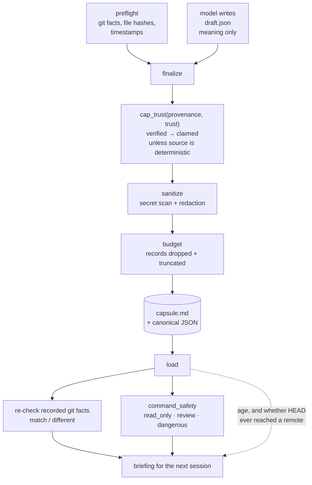

## 1. Executive Summary

Portable Handoff writes one Markdown **capsule** at the end of a coding session
so the next session — possibly in a different tool — starts from what mattered
rather than from nothing. Apache-2.0, 5,415 lines of Python, standard library
only, with a committed check (`scripts/check_stdlib_only.py`) that keeps it that
way.

The design is one sentence in the README and it is the right sentence: *"the
model supplies the meaning and local code supplies the facts."* `preflight`
collects git state, file hashes and timestamps from the machine; the model
writes a semantic draft as JSON; `finalize` merges the two and — the part worth
the report — **rewrites any trust label the source cannot support**.

**What is genuinely interesting:** trust is not a number and not a claim the
writer gets to make. `Trust` is a five-state enum, `Provenance` is an eight-value
enum naming the channel a claim arrived through, and `cap_trust(provenance,
trust)` refuses `verified` to anything whose provenance is not in
`DETERMINISTIC_PROVENANCES` — *at parse time*, so it applies to every capsule
this tool reads and not only to ones it wrote. A capsule handed to you by a
stranger cannot declare itself verified.

**Strongest beyond that:** the budget reports what it dropped and truncated
rather than clipping silently; the briefing states the capsule's age and whether
its HEAD ever left the machine; `load` re-checks the recorded repository facts
against the current tree and reports each as `match` or `different`; and the
command-safety module classifies a carried shell command at load time against
raw text, *"so a capsule has no field it could populate to declare itself safe."*

**Weakest:** nothing withholds. Every trust state is rendered as a label beside
the text and no read path filters, ranks or omits on it. The five states are the
right vocabulary attached to no mechanism — a memory marked `untrusted` reaches
the briefing exactly like a `verified` one, distinguished by a word the model is
asked to respect. That is why `trust_state` is withheld below despite this being
the best-shaped trust vocabulary in the corpus.

## 2. Mental Model

A memory is a **claim**: text, plus where it came from, plus how much weight it
can carry.

```text
claim = { text, provenance, trust, evidence_refs[], captured_at }

provenance ∈ conversation:user · conversation:assistant · tool · file
             git · test · transcript · model_inference
trust      ∈ verified · observed · claimed · inferred · untrusted

                       cap_trust(provenance, trust)
   trust = verified  ───────────────────────────────►  claimed
   unless provenance ∈ { git, tool, test, file, transcript }

decision.status ∈ active · superseded
secret_scan.status ∈ passed · failed · not_run · unknown
```

The state machine is about **authority**, not about lifecycle. A claim never
moves between trust states over time; it is assigned one at capture and capped
once at parse. Nothing promotes a claim, nothing demotes it later, and nothing
expires. A capsule is immutable once written — the only "correction" available is
writing another capsule, and no capsule references the one it replaces.

Control is **hybrid and explicitly divided**: the model authors meaning and may
not author facts; the local code authors facts and does not interpret them; the
user runs the commands. That division is the product.

The system treats a capsule as **untrusted historical data** and says so in the
rendered artifact, in the module docstrings, and in the briefing text it hands
the next model.

## 3. Architecture



**Runtime shape.** A Python CLI with nine subcommands — `preflight`, `finalize`,
`validate`, `load`, `doctor`, `export`, `list`, `source probe|list|show` — plus
a `skills/handoff/` package installed into Claude Code, Codex CLI or Cursor, and
`integrations/generic/HANDOFF_INSTRUCTIONS.md` for a host with no shell at all.
No server, no daemon, no database, no dependencies.

**Persistence.** One Markdown file per capsule with an embedded canonical JSON
document (`strict_json.py`, `canonical.py`), stored by `storage.py`. Schema
`handoff-v1.schema.json` ships twice — in `schemas/` and in the package
resources — and `models.py:26` rejects schema versions 1.0 and 1.1 by name
rather than accepting them, *"because 1.1 adds fields a 1.0 reader would not know
to distrust."*

**Retrieval.** There is none. A capsule is loaded whole; there is no query, no
index and no embedding. The unit of recall is the session.

**Transcript adapters.** `adapters/` reads Claude, Codex (files and SQLite),
Cursor (files and live) and a generic transcript, bounded and read-only, marking
every result `untrusted_content: True` (`sources.py:45`).

### Deployment and ergonomics

`pip install`, stdlib only, no lockfile beside `pyproject.toml`. `doctor` reports
whether the host can produce a capsule at all. Everything is local; the capsule
is a Markdown file you can read, diff and email. The paste-only path means the
design degrades to a host with no shell, at the cost of the deterministic half —
which is the one part the README does not spell out as a trust consequence.

## 4. Essential Implementation Paths

**Fact capture.** `preflight.py` and `gitfacts.py` — repository root, remote,
branch, commit, dirty state, changed files, and per-file hashes, each stamped
`Provenance.GIT` and `Trust.VERIFIED` (`gitfacts.py:138`).

**Meaning capture.** The model writes a draft JSON against
`schemas/handoff-v1.schema.json`; `skills/handoff/SKILL.md` and the per-host
command files tell it what belongs there.

**Merge and cap.** `finalize.py` combines the two.
`_downgrade_model_verification` (`:126-134`) walks model-authored records and
rewrites `trust: verified → claimed` and `provenance: git → test`.
`models.py:216` then applies `cap_trust(provenance, trust)` to every claim as it
is parsed — `:166-170`, *"Downgrade `verified` to `claimed` when the source
cannot support it"* — against
`DETERMINISTIC_PROVENANCES = {git, tool, test, file, transcript}` (`:22`).

**Sanitize.** `sanitize.py` scans fields for secrets and replaces a match with a
kind marker (`[REDACTED:github]`), recording the redaction kind but not the
matched text. `finalize` records the scan itself as a `ScanStatus` — `passed`,
`failed`, `not_run` or `unknown` — so *"no redactions"* can be read against
whether a scan ran at all, and `render.py:263` says so in the artifact: *"An
empty list is only meaningful when the scan status above is `passed`."*

**Budget.** `budgeting.py` produces a `BudgetReport` carrying `estimated_tokens`,
`dropped[]` and `truncated[]`, with preservation priorities deciding what goes
first. The losses are part of the document.

**Load.** `load.py` re-reads the recorded repository facts and compares them with
the current tree — repo root, remote, commit, branch, dirty — appending a check
per field with `status: "match" | "different"` (`:92-141`). The briefing then
states the capsule's age and its publication state, pinned by
`test_briefing_states_capsule_age_and_publication_state`: *"less than a day
old"*, *"HEAD reachable from a remote: no"*, *"may exist only on the machine that
wrote this capsule."*

**Command safety.** `command_safety.py` classifies `next_action.command` into
`read_only`, `review` or `dangerous` from fifteen-plus named families —
downloaded content piped into a shell, recursive deletion, history rewrite,
privilege escalation, credential disclosure, scheduled persistence. Its docstring
states the two things that make it honest: *"It is not a sandbox and can be
evaded. It over-flags on purpose"*, and *"Classification runs at load time
against the raw text, so a capsule has no field it could populate to declare
itself safe."*

**Tests.** `tests/` — unit, integration, security/adversarial, adapters, and a
`quality/` suite with a committed `quality_report.json`.

## 5. Memory Data Model

The unit is the labelled claim, and `CLAIM_FIELDS = {text, provenance, trust,
evidence_refs, captured_at}`. Beside it sits an **evidence record** —
`evidence_id`, `kind`, `source`, `digest`, `summary`, `captured_at`, plus its own
provenance and trust — and claims point at evidence by id through
`evidence_refs`. That is
[evidence before belief](../../patterns/evidence-before-belief/) with an explicit
link in the schema rather than as a convention.

**Scoping** is the repository. The capsule records a `repo_root_hint`, and load
compares it with the current root; there is no user, agent or tenant key, and
none is wanted for a file a person carries between their own sessions.

**Temporal.** `captured_at` per claim in RFC3339 UTC, validated
(`models.py:195-197`), and a capsule `created_at`. All of it is *capture* time —
there is no interval during which a fact is asserted true, so `bitemporal` is not
marked. What the design does instead is more useful for its purpose: it computes
the age at read time and says it in words.

**Correction.** `DecisionStatus` is `active | superseded`, so a decision can be
marked as replaced *within* one capsule. Across capsules there is nothing: a new
capsule does not reference, supersede or invalidate an older one, and there is no
delete. For a per-session artifact that is defensible; it also means the store
cannot answer *what did we decide, currently* across a project's history.

## 6. Retrieval Mechanics

`load` renders the whole capsule into a briefing, ordered and budgeted; `export`
emits a smaller view for pasting, and `test_export_emits_one_half_not_both`
pins that it emits one half rather than both. There is no search, no ranking and
no relevance model, because the unit of recall is the whole session.

Two things happen at read time that most stores in this corpus do only at write
time, if at all.

**The capsule is checked against the world.** The recorded git facts are compared
with the current repository and each field is reported `match` or `different`, so
the reader sees exactly which of the capsule's assumptions have expired rather
than discovering it later.

**The capsule's own reliability is stated.** Age in words, and whether the
recorded HEAD is reachable from a remote — *"may exist only on the machine that
wrote this capsule"* — which is a publication fact with real consequences for a
handoff between machines.

**Failure modes.** Everything in the capsule is injected; there is no way to ask
for part of it, so a large session's capsule spends the budget and the
`dropped[]` list is the only signal of what did not fit. And the trust labels
ride along as text — if the receiving model ignores them, nothing else enforces
them.

## 7. Write Mechanics

Two phases by design, and the split is the safety property: **the model may
write meaning and may not write facts.** A model-authored record claiming
`verified` is rewritten to `claimed`; a model-authored record claiming `git`
provenance is rewritten to `test`. The cap is applied again on parse, which
means it holds for a capsule written by another tool, an older version, or a
hostile author.

Writes are synchronous, local and deterministic apart from the model's own draft
step. There is no extraction pass over transcripts by default — the adapters
read them bounded and read-only, and mark the content untrusted.

**Bounds everywhere.** `bounds.py` caps string length, list items and nesting
depth; `test_large_nested_input_is_bounded` pins the depth limit;
`strict_json.py` rejects duplicate keys and does not echo the offending value
into the error. A parser that refuses to quote what it rejected is a small thing
that almost nothing in this corpus does.

**Conflict handling.** None across capsules, and `active`/`superseded` within
one.

### Operational cost

No background work, no model call on the tool's own path — the only LLM
involvement is the drafting step the host agent performs. The read cost is one
budgeted document per session start, with the estimate and the losses recorded
in the document itself. Write-to-readable lag is however long it takes to run
two commands, and there is no staleness process at all because a capsule is
never updated — only re-read, with its age reported.

## 8. Agent Integration

A skill (`skills/handoff/SKILL.md`) plus per-host command files for Claude Code
and Cursor, an `agents/openai.yaml` for Codex, and
`HANDOFF_INSTRUCTIONS.md` for hosts with no shell, where the model is walked
through producing the draft by hand. `scripts/install_skill.py` installs it, and
`tests/integration/test_skill_install.py` covers the install.

The agent's agency is bounded by construction: it writes a draft in a fixed
schema and never touches the fact half. There is no tool the model can call to
mutate a stored capsule, which is unusual here and follows from the artifact
being a file rather than a service.

The briefing is where the design shows most clearly. It carries the trust label
inline on each line (`load.py:208` renders `> [claimed] text`), states that
capsule and transcript prose are untrusted historical data, and presents a
carried command inside a fenced block with *"has not been executed and is not a
verified instruction"* and *"review before running"* — assertions pinned by
`test_briefing_presents_a_command_as_inert_data`.

## 9. Reliability, Safety, and Trust

**The security posture is the strongest part of the system**, and it is stated in
the same terms the atlas uses. A capsule is untrusted input; classification runs
on raw text at load; the artifact cannot self-certify; the classifier's own
limits are written into its docstring rather than implied.

**Provenance is real and typed.** Eight channels, capped trust, evidence records
with digests, and a forged timestamp or evidence hash rejected
(`test_forged_timestamp_integrity_and_evidence_hash_are_rejected`).

**Secrets** are redacted with the kind recorded and the match withheld, and the
scan's own status is a field, so an empty redaction list cannot be read as a
clean bill of health.

**What is absent:** no state withholds. `untrusted` is rendered, not enforced;
`superseded` is rendered, not filtered; a `dangerous` command is labelled and
gated in prose rather than removed. The consistent theory is *tell the reader
everything and let the reader decide*, which is coherent, and which relies
entirely on a model honouring labels in its context — the one assumption this
codebase otherwise refuses to make anywhere else.

**Deletion and privacy.** A capsule is a file; deleting it is deleting the file.
Nothing syncs and nothing uploads.

## 10. Tests, Evals, and Benchmarks

Unit, integration, adapter, security and quality suites, with CI. The security
file is short and pointed: forged timestamps and evidence hashes rejected,
malformed JSON never echoing content, large nested input bounded.

The negative assertions earn the one capability mark, and one of them is the
shape this atlas argues for elsewhere: `test_secrets_are_redacted_without_
disclosing_the_match` asserts the secret is **absent** from the rendered Markdown
*and* that `[REDACTED:github]` is **present** in the same fixture — an absence
assertion with its own positive control, so it cannot pass on an empty render.
`test_malformed_json_never_echoes_content` does the same for the parser's error
path.

`tests/quality/evaluate_quality.py` with a committed `quality_report.json` is
the nearest thing to an eval; it scores capsule quality rather than retrieval,
and the committed artifact means the claim is checkable rather than asserted.

**What is not tested:** the paste-only path's trust consequences. When a host has
no shell, the deterministic half cannot run, so every fact becomes model-authored
and `cap_trust` demotes it — which is correct behaviour and, as far as the tree
shows, unasserted.

## 11. For Your Own Build

### Steal

- **Cap the trust a record may declare by the provenance it arrived with, at
  parse time.** `cap_trust(provenance, trust)` is four lines and it means an
  authority claim cannot be smuggled in by whoever wrote the file. Applying it on
  read rather than only on write is what makes it hold for artifacts you did not
  produce.
- **Record what the budget dropped, inside the artifact.** `dropped[]` and
  `truncated[]` beside the token estimate turns a silent truncation into a
  disclosed one, which is the difference between a reader who knows the summary
  is partial and one who does not.
- **Make "the scan did not run" a distinct value from "the scan found nothing."**
  `ScanStatus.not_run` beside `passed`, plus a rendered line saying an empty
  redaction list is only meaningful when the status is `passed`.
- **State the artifact's age and publication state at read time.** Not a badge —
  a sentence: *"less than a day old"*, *"may exist only on the machine that wrote
  this capsule."*
- **Classify carried commands against raw text at load, and say the classifier
  can be evaded.** A capsule with no field it can populate to declare itself safe
  is the correct shape for any artifact that crosses a trust boundary.

### Avoid

- **Do not stop at labelling.** Five well-chosen trust states that no read path
  consults put the whole burden on a model honouring words in its context — from
  a codebase that otherwise refuses to trust anything it did not compute. At
  minimum, let the lowest state change what gets rendered.
- **Do not let a capsule be the only unit.** With no query, a large session
  spends the budget and the reader gets whatever survived the priority order.
- **Do not lose the chain.** A new capsule that does not reference the one it
  replaces cannot answer *what is currently decided* across a project, which is
  the question a handoff format will be asked next.

### Fit

This is for one person moving work between agents and tools, and within that
scope it is the most carefully reasoned artifact in this corpus about *what a
model may be trusted to assert*. Take it if your problem is the lost hour between
sessions and you are willing to read the capsule. Walk away if you need memory
that accumulates: there is no store, no query, no supersession across capsules
and no way to ask what is true now rather than what was true at the end of one
session.

## 12. Open Questions

- On a host with no shell, everything becomes model-authored and `cap_trust`
  demotes it — does the briefing tell the reader that the deterministic half was
  unavailable, or does it read the same as a capsule with real facts in it?
- What does the quality suite actually score, and against what reference? The
  committed report makes it checkable, but the rubric behind the number is not
  obvious from the tree.
- Is there an intended chain between capsules — a `previous_capsule` field — or
  is one-shot the design? The schema has no field for it and the README does not
  say.
- The repository is new at this pin, with a first release version of `0.1.0`;
  none of the above has had time to be exercised by other people's capsules.

## Appendix: File Index

- **Schema / model:** `src/portable_handoff/models.py` (`Trust`, `Provenance`, `cap_trust` at `:166`, `DETERMINISTIC_PROVENANCES` at `:22`), `schemas/handoff-v1.schema.json`, `src/portable_handoff/schema.py`
- **Write path:** `src/portable_handoff/preflight.py`, `gitfacts.py`, `finalize.py` (`_downgrade_model_verification` at `:126`), `sanitize.py`, `budgeting.py`, `canonical.py`, `strict_json.py`
- **Read path:** `src/portable_handoff/load.py` (drift checks at `:92-141`, trust rendering at `:208`), `render.py`, `command_safety.py`
- **Agent surface:** `skills/handoff/SKILL.md`, `integrations/claude/commands/handoff.md`, `integrations/cursor/commands/handoff.md`, `integrations/generic/HANDOFF_INSTRUCTIONS.md`, `scripts/install_skill.py`
- **Adapters:** `src/portable_handoff/adapters/` (claude, codex, codex_sqlite, cursor, cursor_live, transcript_file)
- **Tests:** `tests/security/test_adversarial.py`, `tests/integration/test_blocking_and_briefing.py`, `tests/integration/test_create_load.py`, `tests/quality/evaluate_quality.py`

## History

**2026-08-20** — [`4c9b7f7309803d009ce795af9f397875f23d567e`](https://github.com/legoambarish/portable-handoff/commit/4c9b7f7309803d009ce795af9f397875f23d567e) — first reading, at version 0.1.0. Screened before anything was read: no auto-executing surface, one build-time execution point, one dependency manifest inside the seven-day cooldown and no lockfile beside `pyproject.toml`; nothing was installed and no command was run. The trust cap and the command classifier were established by reading `models.py` and `command_safety.py` against the committed tests rather than by producing a capsule.
