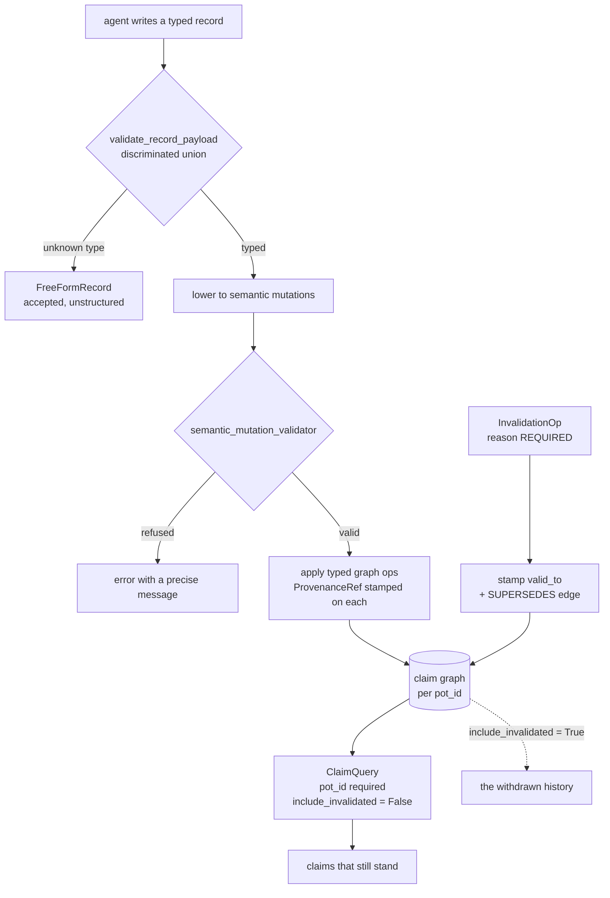

## 1. Executive Summary

Potpie is Apache-2.0, 693 Python files across five packages, 764 commits since
12 August 2024, and it describes itself as turning a codebase and its
development lifecycle into a *living context graph* — indexing code, structure,
decisions, source history and team knowledge so an agent can answer with
project-specific context.

Most of that is a corpus index of the user's own source, which this atlas keeps
outside its boundary. What puts Potpie inside it is the other half: a typed
record layer where an agent writes claims that could later turn out to be wrong,
and a mutation layer built to take them back.

**The mechanism worth the report is that an invalidation cannot be recorded
without a reason, and does not delete anything.** `InvalidationOp`
(`graph_mutations.py:160`) takes a target entity key or edge, a **required**
`reason`, and an optional `superseded_by_key`. Its own docstring states the
contract: *"the invalidated node/edge gets valid_to stamped rather than being
deleted, preserving the audit trail"*, and when a replacement is named a
`SUPERSEDES` edge is written from the new entity to the old one. Deletion of a
claim is not in the verb set.

**Provenance is a first-class contract rather than a convention.**
`ProvenanceRef` (`:11`) is stamped on every entity, edge *and invalidation*, and
its docstring names the question it exists to answer: *"where did this come
from, when was it observed, when was it last written, how confident is it, and
who produced it"*. The confidence lives on the provenance, beside the fact,
rather than inside it.

**The read path defaults to hiding what was withdrawn.** `ClaimQuery`
(`ports/claim_query.py`) carries `include_invalidated: bool = False` and an
optional `as_of` datetime. A caller who asks for nothing in particular gets the
claims that still stand; the history is reachable and requires saying so. A
committed conformance case asserts exactly that, which is rare enough to be the
reason the negative-eval mark is carried.

**The gap is what the refusal is keyed on.** Invalidation targets an entity key
or an edge triple. Nothing is keyed on the *value*, so a claim withdrawn once and
re-derived later under a different key is a new entity rather than a refused
write — the distinction this atlas draws between supersession and a
rejected-value tombstone. The tombstone mark is withheld on that, and the
machinery to close it is already present: the reason, the provenance and the
SUPERSEDES edge are all there, and only the key is row-shaped.

## 2. Mental Model

Two layers, and the epistemic content is in the upper one.

**The lower layer is a code graph** — files, symbols, call structure, source
history — regenerated from the repository. Nothing there is a claim; it is a
projection of something that can be recomputed, and on its own it would place
Potpie outside this atlas beside the other corpus indexes.

**The upper layer is a claim graph**, written by an agent through typed records.
`context_records.py` defines a discriminated union with six shapes and a
fallback, and the shapes are unusually specific about epistemic status:

```text
fix           symptom_signature, fix_steps, root_cause,
              verification_status = "unverified",
              attempted_failed_fixes   <- what did NOT work
bug_pattern   the symptom side of a fix
preference    prescription + code_scope + strength (hard|strong|soft)
                                        + audience (team|service|project|global)
decision      ADR-shaped: rationale + alternatives_rejected
verification  a confirm/refute against an existing fix:
                            worked | didnt_work | partial
```

Two of those fields are the interesting ones. `attempted_failed_fixes` and
`alternatives_rejected` record the road not taken — the negative half that most
stores in this corpus discard — and they are ordinary tuples on the record
rather than anything the write path consults. They are documentation of a
rejection, not a refusal of one.

`verification` is the sharper idea: a *separate record type* whose whole job is
to confirm or refute a fix that already exists. Corroboration is a write rather
than a score adjustment, and `didnt_work` is a first-class outcome.



## 3. Architecture

Five packages under `potpie/`. `context-core` holds the domain — records,
ontology, mutations, queries and the validators — and its test suite asserts
that the core imports only the standard library and pydantic
(`test_library_isolation.py`), which is how the domain stays portable across
backends. `context-engine` holds the adapters, reconciliation and the LLM
planning path. `parsing`, `sandbox`, `daemon`, `cli` and `integrations` sit
around them.

The graph is behind a port. `falkordb` is the default with an embedded
`falkordblite` for a hostless run, `neo4j` is an extra, and `networkx` is
available in process — so the same claim semantics run against three very
different stores, and the domain does not know which.

## 4. Essential Implementation Paths

**The write.** A record arrives, `validate_record_payload` dispatches on
`record_type` and raises `ContextRecordValidationError` with a precise message
on bad input; the returned dataclass is attached to the submission so
downstream consumers read structured fields *"without re-parsing free text"*.
An unknown record type is not an error — it falls back to `FreeFormRecord`,
which is the pre-typing `{summary, details}` shape kept deliberately so the
agent's writes are not rejected for being ahead of the schema.

**The lowering.** `record_to_semantic.py` turns a record into semantic
mutations, carrying `verification_status` through and marking a refuted fix
`failed` (`:224`). `semantic_mutation_validator.py` then refuses malformed
operations by name — `append_event` without a verb class is rejected at `:422`.

**The invalidation.** `InvalidationOp` has four production call sites, in
`graph_plans.py:493` and `semantic_mutation_lowering.py` at `:335`, `:344` and
`:397`, plus an LLM-facing schema `LlmInvalidationOp` so a planned mutation can
propose one. It is wired, not declared.

**The read.** `graph_query.py` takes `pot_id` as a required positional at `:64`,
`:114` and `:151`. `ClaimQuery` adds predicate, source-system and time filters,
an optional native vector arm, and `include_invalidated` defaulting to `False`.

## 5. Memory Data Model

A claim carries its provenance rather than pointing at it. `ProvenanceRef`
holds `pot_id`, `source_event_id`, a generated `mutation_id`, `source_system`
and `source_kind`, with a confidence alongside. The temporal vocabulary the
reconciliation validator recognises is `valid_at`, `valid_from`, `valid_to`,
`observed_at`, `deployed_at` (`reconciliation_validation.py:44`) — five distinct
times, of which two are about the world and three about the system.

Scope is expressed twice and differently. `pot_id` is the hard boundary, applied
in the query. `PreferenceRecord.code_scope` is a soft one — a mapping of
language, framework, repo and service that *"readers intersect against task
scope at query time"* — beside a `SCOPE_KINDS` vocabulary of service,
component, feature, module, language, framework and global. The first is
enforcement; the second is relevance.

## 6. Retrieval Mechanics

Claims are filtered rather than ranked into oblivion: pot, predicate, source
system, time window, and an optional vector arm when the port supports a native
query. The default excludes invalidated claims. `as_of` makes the graph
answerable at a past instant, which is the half of bi-temporality most systems
in this corpus declare and do not query.

## 7. Write Mechanics

Every write is validated twice — once against the record schema, once against
the semantic mutation contract — before anything reaches the graph. The LLM sits
on the *planning* side: `reconciliation/llm_plan_schema.py` defines what a model
may propose, including `LlmInvalidationOp`, and the validator is what decides
whether the proposal is applied. A model can propose a withdrawal; it cannot
perform one without passing the same gate as any other mutation.

## 8. Agent Integration

A CLI, a daemon, an MCP surface, and agent bundles shipped as skills —
`potpie/cli/templates/agent_bundle/.agents/skills/` and a Claude Code plugin
directory beside it. The integration ships the *instructions* for using the
graph, not only the graph.

## 9. Reliability, Safety, and Trust

**What is strong.** An invalidation cannot be recorded without a reason. A
withdrawal preserves the row. Provenance is stamped on the invalidation itself,
so the record of a retraction says who retracted it and from what event. The
scope key is required rather than defaulted, which is the difference between a
boundary a caller must pass and one they must remember.

**What is missing, and it is the same absence twice.** There is no human review
surface: an LLM-planned mutation that passes the validator is applied, and
nothing in the tree holds it for a person. And nothing is keyed on the value, so
the refusal of a rejected claim depends on the next writer using the same entity
key. A system this careful about *recording* a withdrawal has not yet made the
withdrawal *bind*.

**One repository-hygiene note.** `results.md` at the root is a working scratchpad
— an outline of product directions — committed beside the source.

## 10. Tests, Evals, and Benchmarks

159 test files, split across unit, conformance and integration. The conformance
suite is the one that matters here: `test_public_graph_runtime.py` drives the
public runtime against a backend and asserts, after an invalidation, that the
default claim query returns `== []` and that `include_invalidated=True` returns
exactly one row carrying a non-null `invalid_at` (`:324-330`). That is a
must-not-appear assertion against the real read path rather than a helper, and
it is what the negative-eval mark rests on.

`benchmarks/retrieval_eval.py` exists in the engine package. No committed
results were found for it, and none is claimed. I did not run the suite.

## 11. Patterns Worth Stealing

- **Require the reason on the withdrawal, not on the write.** `InvalidationOp`
  cannot be constructed without one. Most systems here make the reason optional
  and then find they cannot explain a retraction.
- **Stamp provenance on the invalidation too.** A retraction is a claim about a
  claim, and it has a source and an author like any other.
- **Make the scope key a required positional.** `pot_id` cannot be omitted; a
  defaulted scope is the widening hazard this atlas keeps finding one refactor
  before it becomes real.
- **Model corroboration as a record, not a score.** A `verification` write
  carrying `worked | didnt_work | partial` against an existing fix is auditable
  in a way that a confidence increment is not.
- **Keep a free-form fallback so the schema does not reject the future.**
  `FreeFormRecord` accepts what the typed union does not yet model, which is how
  a discriminated union stays adoptable.

## 12. Open Questions

- **Would a value-keyed refusal fit?** The reason, the provenance and the
  SUPERSEDES edge already exist. What is missing is a digest of the normalised
  claim and a check on the write path.
- **What decides an LLM-planned invalidation is right?** The validator checks
  shape, not judgement, and there is no queue between the plan and the graph.
- **Does `attempted_failed_fixes` reach retrieval?** It is stored on the record;
  no consumer was traced.
- **What do the retrieval benchmarks score?** The harness is present and no
  result is committed.

## Appendix: File Index

| Path | What it holds |
| --- | --- |
| `potpie/context-core/src/potpie_context_core/context_records.py` | The six typed record shapes, their vocabularies, and the validator |
| `potpie/context-core/src/potpie_context_core/graph_mutations.py` | `ProvenanceRef`, `InvalidationOp`, and the typed graph operations |
| `potpie/context-core/src/potpie_context_core/graph_query.py` | Query functions with `pot_id` required |
| `potpie/context-core/src/potpie_context_core/ports/claim_query.py` | `ClaimQuery` — `include_invalidated`, `as_of`, vector arm |
| `potpie/context-core/src/potpie_context_core/record_to_semantic.py` | Record to semantic mutation, carrying `verification_status` |
| `potpie/context-core/src/potpie_context_core/semantic_mutation_validator.py` | The refusals, by name |
| `potpie/context-engine/.../reconciliation/llm_plan_schema.py` | What a model may propose, including an invalidation |
| `potpie/context-engine/tests/conformance/test_public_graph_runtime.py` | The invalidated-claim-is-absent assertion |
| `potpie/context-core/tests/unit/test_library_isolation.py` | The domain imports only stdlib and pydantic |

## History

**2026-08-19** — [`a341978880b9d4c1b403831931279ccedf6184ae`](https://github.com/potpie-ai/potpie/commit/a341978880b9d4c1b403831931279ccedf6184ae) — first reading. The screen reported no auto-run file, six manifests inside the seven-day cooldown, a `Makefile` and three `conftest.py` executing on collection; nothing was installed and no test was run, so the conformance assertions were read rather than executed. `InvalidationOp`'s four production call sites and the `include_invalidated` default were traced by hand rather than taken from the docstrings, and the tombstone mark was withheld after checking that the invalidation target is an entity key or edge triple and never the claim value.
