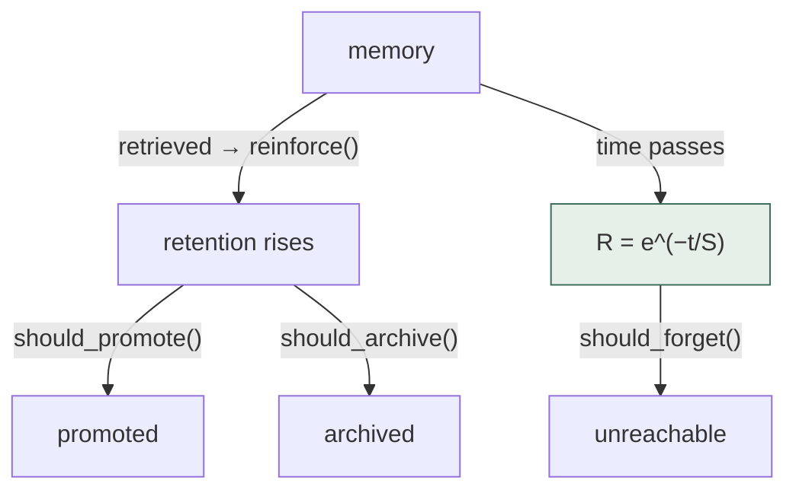
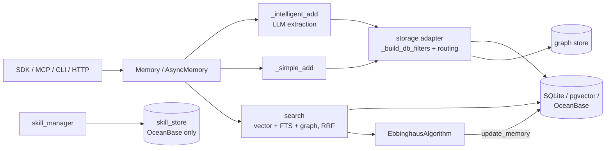

## 1. Executive Summary

PowerMem is OceanBase's memory layer: LLM extraction into a vector store, hybrid
vector/full-text/graph retrieval fused by reciprocal rank, an Ebbinghaus
forgetting curve governing what stays reachable, and a two-layer "Experience +
Skill" distillation above the fact layer. It ships a Python SDK, an HTTP server,
an MCP server, a CLI, a VS Code extension and a Claude Code plugin, with 128 test
files behind them.

**The best thing here is the retention model.** `EbbinghausAlgorithm` is the most
complete implementation of [decay and reinforcement](../../patterns/decay-and-reinforcement/)
in the atlas, and it is complete in the way that matters: `should_promote`,
`should_forget`, `should_archive` and `reinforce` are four separate decisions with
four separate thresholds, and the decay rate varies by memory type. Most systems
here have one number that goes down.

**Two findings should shape how you read the rest.**

The first is a fact about this repository that took one search to establish and is
worth more than any architectural summary: the `history` table — `memory_id`,
`old_memory`, `new_memory`, `event`, `actor_id` — is created by a migration that
carefully upgrades an older schema version, and **`add_history` and `get_history`
have zero callers anywhere in the repository**. Not in `src/`, not in the tests,
not in the benchmark server. PowerMem has a mutation audit table it has never
written a row to. Section 9 works through what that means.

The second is that retrieval mutates the store. `search()` evaluates decay,
reinforcement and forgetting against the rows it retrieves and calls
`storage.update_memory(...)` on some of them — sometimes inline, sometimes on a
background executor. Reading memory changes memory.

## 2. Mental Model

A memory is an **extracted assertion with a retention score**. Above it sit two
distilled layers:

| Layer | What it is |
| --- | --- |
| memory | LLM-extracted text, an embedding, and retention metadata |
| experience | distilled from interactions |
| skill | a reusable workflow — **OceanBase-only store** |

The layers distil upward, and the top one is only available on one backend.

The state machine is entirely quantitative, and this is the design's defining
choice:



Retrieval and time pull in opposite directions on one number — the
[decay and reinforcement](../../patterns/decay-and-reinforcement/) pattern, with
an explicit exponential rather than a hand-tuned counter. Note what the three
`should_*` predicates decide: reachability, never truth.

`calculate_decay` implements `R = e^(-t/S)` directly —
`decay_factor = math.exp(-hours_elapsed / (24 * rate))` — with
`_get_decay_rate_for_type` giving different memory types different half-lives and
`_apply_reinforcement` raising the rate for memories that keep being used.

What the model has no vocabulary for is **truth**. A memory is reachable or not,
promoted or not, archived or not. It is never candidate, verified, disputed,
superseded or rejected. So "the user corrected me" and "the user has not mentioned
this in a while" reach the store through the same channel — a change in a score —
and afterwards nothing can distinguish them. That is the failure
[decay and reinforcement](../../patterns/decay-and-reinforcement/) warns about,
and PowerMem is its most sophisticated instance: the more carefully tuned the
curve, the more convincingly it stands in for a trust model it is not.

Memory is background-managed. There is no human review surface and no tool by
which the model marks something wrong.

## 3. Architecture



- **Storage** is pluggable — `storage/sqlite/`, `storage/pgvector/`,
  `storage/oceanbase/` — behind `adapter.py` and `factory.py`, with a
  `migration_manager.py`. SQLite gets FTS5 hybrid search with RRF fusion, which
  makes the free tier genuinely usable.
- **Sub-store routing** is real: `_route_to_store(routing_filters)` picks a store
  from the scope keys, and `_get_embedding_service(filters)` can select a
  different embedding model per sub-store. That is more configurability than most
  of this atlas offers and is how the Experience/Skill split is deployed.
- **Intelligence** lives in `intelligence/`: `ebbinghaus_algorithm.py`,
  `importance_evaluator.py`, `intelligent_memory_manager.py`,
  `memory_optimizer.py`, `skill_manager.py`, plus a `plugin.py`.

### Deployment and ergonomics

Start-up is easy: `pip install powermem`, point it at SQLite, and hybrid search
works locally. An LLM key is needed for extraction — `_simple_add` exists and
stores messages without extraction, so there is a degraded path, which is more
than most offer.

The vendor gradient is worth naming. `storage/skill_store/` and
`storage/source_store/` each contain exactly `base.py` and `oceanbase.py`. Skill
distillation is a headline feature of the project and it has one backend, which
happens to be the product of the organization that publishes the library. Nothing
about that is hidden — the base classes are there and a second implementation is
clearly anticipated — but a reader evaluating PowerMem on SQLite should know that
the two-layer story is not available to them at this commit.

The store is SQL and inspectable; the retention metadata lives in the payload
JSON, so repairing a decayed memory by hand means editing JSON inside a row.

## 4. Essential Implementation Paths

**Write** — `core/memory.py:1170`, branching between `_simple_add(...)` and
`_intelligent_add(...)` on the same argument list
`(messages, user_id, agent_id, run_id, metadata, filters, scope, memory_type,
prompt)`. `_add_to_graph(messages, filters, user_id, agent_id, run_id)` runs
alongside for the graph projection.

**Scope construction** — `storage/adapter.py:378`. `routing_filters` is built from
`user_id`, `agent_id` and `run_id`, used to pick a target store via
`_route_to_store`, and then `_build_db_filters(user_id, agent_id, run_id,
filters)` produces the `effective_filters` the query runs with. The same triple
reaches `search_memories(...)` and `search_memories_async(...)` in the storage
base class.

**Retrieval** — `core/memory.py:1718`, `search()`. Parameters are unusually
explicit: `retrieval_mode`, `fusion="rrf"`, `vector_weight`, `fts_weight`,
`rrf_k=60`, `candidate_limit`, `threshold`. The SQLite vector store implements
the FTS5 half (`sqlite_vector_store.py`) with payload JSON extraction
(`json_extract(payload, '$.user_id')`).

**Retention** — `intelligence/ebbinghaus_algorithm.py`. `calculate_decay` (134),
`calculate_relevance` (181), `should_promote` (213), `should_forget` (252),
`should_archive` (271), `reinforce` (305), `calculate_current_retention` (340),
`get_review_schedule` (365), and `_resolve_decay_rate` / `_get_decay_rate_for_type`
for per-type curves.

**The write-during-read** — inside `search()`, roughly `core/memory.py:1795`
onward: `self.storage.update_memory(mem_id, {**upd}, user_id, agent_id)` for
reinforcement, `forget_updates` for decay, and
`_BACKGROUND_EXECUTOR.submit(self.storage.update_memory, ...)` for the deferred
variant.

**Audit** — `core/audit.py`, `AuditLogger` with `log_event`, `log_event_async`,
`log_access`, `log_data_change`, `log_security_event`, instantiated at
`core/memory.py:753` and `core/async_memory.py:197`.

**History** — `storage/sqlite/sqlite.py:106` creates the table, `:126`
`add_history` inserts, `:169` `get_history` reads. Neither is called.

## 5. Memory Data Model

Scoping is the strongest structural property and it is applied properly. Three
keys — `user_id`, `agent_id`, `run_id` — are accepted at the API, assembled into
`effective_filters` in the adapter, and passed into the store's own query rather
than filtered afterwards. The `run_id` level is a genuine third boundary that many
systems here lack: a single agent serving a single user can still keep one run's
memories out of another's.

Payload-based storage means the schema is thin and the metadata is JSON —
retention scores, importance, memory type, timestamps. That buys flexibility and
costs queryability; a question like "how many memories are within a week of being
forgotten" is a JSON scan.

The `history` table is the interesting absence. Its columns are exactly right for
an append-only mutation record — `old_memory`, `new_memory`, `event`, `actor_id`,
`role`, `created_at` — and `add_history` is insert-only, so had it been wired up
it would plausibly have carried this atlas's `audit_log` mark. Instead:

```text
$ grep -rn "add_history" .        # one hit: the definition
$ grep -rn "get_history" .        # one hit: the definition
```

The migration path around it is not vestigial either — `sqlite.py:55` logs
"Migrating history table to new schema (no convo columns)" and rewrites a
`history_old` table. The code maintains a schema for data that has never existed.
This is a mem0-lineage artifact carried through a rewrite, and it is the cleanest
example in the atlas of why the review method is static-with-callers rather than
schema-reading: a capability matrix built from migrations would have marked
PowerMem as having a mutation audit trail.

No trust state, no validity interval, no supersession pointer, no rejected-value
record.

## 6. Retrieval Mechanics

Three arms — vector, FTS and graph — fused by RRF with tunable weights, an
explicit `rrf_k`, a candidate limit, a score threshold, and an `auto` retrieval
mode that picks. This is a well-specified hybrid retriever and the parameters are
exposed rather than buried, which is the right call for a library.

On top of similarity, retention enters the ranking: `calculate_relevance` combines
the query match with the memory's current retention, so an old unused memory is
both less reachable and less highly ranked.

Then it writes. This is the part to think about before adopting:

- **Cost.** A search is no longer a read. Under concurrency, two searches touching
  the same popular memory both reinforce it, and the `_BACKGROUND_EXECUTOR` path
  makes the ordering of those writes non-deterministic.
- **Semantics.** Retrieval reinforces whatever the retriever surfaced, which is
  the self-reinforcement loop the decay pattern page names: a memory that ranks
  well gets reinforced, which makes it rank better. Popularity compounds, and
  nothing in the loop consults correctness.
- **Operations.** A read-only replica cannot serve search.

The design is coherent — this is genuinely how a forgetting curve wants to work,
since retrieval *is* the rehearsal event — and the consequences are still real.

## 7. Write Mechanics

Two paths. `_simple_add` stores messages directly; `_intelligent_add` runs LLM
extraction, merge and update. Having both is a real strength: an outage or a
cost ceiling degrades to storage rather than to failure, which is the
[zero-LLM capture](../../patterns/zero-llm-capture/) property most extraction-first
systems lack.

Correction is `update_memory` plus the retention machinery. There is no
supersession chain and no rejected-value record, so "forget this" resolves to
either a delete or a score below `should_forget`'s threshold. The second is
reversible by any subsequent reinforcement, and the first leaves nothing behind —
so an extraction pass that re-encounters the same statement will store it again.

The Experience and Skill layers are distilled by `skill_manager` and
`intelligent_memory_manager` from interaction history, which is the
[skills as procedural memory](../../patterns/skills-as-procedural-memory/) shape.
What the atlas looks for there — a verified-execution gate before a procedure is
written — was not found; distillation is LLM judgement over past interactions.

### Operational cost

- **Synchronous?** `_intelligent_add` blocks on extraction; `_simple_add` does not.
- **Lag?** None for `_simple_add`. For the intelligent path, one extraction round
  trip.
- **Whole-store passes?** No scheduled global pass — decay is evaluated lazily on
  the rows a search touches, which is a genuinely cheaper design than a nightly
  sweep and is why the write-during-read exists.
- **Read path?** Bounded by `limit` (default 30) and `candidate_limit`, with a
  threshold. The hidden cost is the writes, not the tokens.

## 8. Agent Integration

The widest integration surface of anything reviewed in this round: Python SDK,
HTTP server (`benchmark/server/main.py` and the packaged server), MCP
(`src/powermem/mcp/`), CLI, a VS Code extension and a Claude Code plugin under
`apps/`.

Model agency is moderate. Through MCP the agent can add, search, update and delete
memories; it cannot mark one wrong, and there is no vocabulary for it to express
that a memory should never come back.

The MCP surface plus three scope keys makes this straightforward to mount under
another host, and the sub-store routing means one deployment can serve several
agents with different embedding models — a feature the
[pluggable memory provider](../../patterns/pluggable-memory-provider/) pattern
would like more systems to have.

## 9. Reliability, Safety, and Trust

**The audit story is the thing to be precise about, because there are two
mechanisms and neither is what it looks like.**

`AuditLogger` is real and is called — it is constructed in both `Memory` and
`AsyncMemory` — and it writes `log_event`, `log_access`, `log_data_change` and
`log_security_event` records. But it writes them to a **rotating file**:
`CompressingRotatingFileHandler` with `maxBytes` from a `log_rotation_size`
default of 100MB, `backupCount=5`, and a `retention_days` default of 90. An audit
log that rotates is an audit log with a horizon; after five rollovers the earliest
records are gone. It is also outside the memory store, so it cannot be joined to
the rows it describes, and the atlas's definition asks for a record in the
system's own store for exactly that reason.

The `history` table would have been that record and is not written. So the
capability is withheld twice over: once because the log rotates and lives
elsewhere, once because the in-store table is unwired.

Trust is unrepresented. Uncertainty is expressible only as a lower retention or
importance score, which conflates "I am unsure this is true" with "this has not
been useful lately".

Prompt injection has the usual route through extraction, with a specific
amplifier: injected content that is subsequently retrieved gets *reinforced* by
the read path, so a successful injection becomes more durable each time it
surfaces.

Multi-tenancy is sound at the query layer. The graph tests note that "legacy
unscoped graph tables are recreated for user isolation", which indicates the
boundary was retrofitted into the graph store and that the retrofit is at least
tested for schema shape.

Concurrency is the open operational risk, per section 6.

## 10. Tests, Evals, and Benchmarks

128 test files, covering storage backends, FTS, MCP, the CLI plugin installer,
graph isolation and the intelligence modules. The suite is broad and mostly unit-
level.

No test asserts that particular material must not be retrieved. The isolation
tests that come closest — `test_oceanbase_graph.py:122` and `:131` — assert that
the *schema* includes user isolation and that legacy unscoped tables are
recreated. That is a claim about DDL, not about what a query returns, so
`negative_eval` is withheld. (Compare [MIRIX](../mirix/), which creates a row under
one scope, queries under another, and asserts the id is absent.)

`benchmark/locomo/` commits a full harness — `run_experiments.py`, `evals.py`,
`generate_scores.py`, `methods/add.py`, `methods/search.py`,
`metrics/llm_judge.py`, the `locomo10.json` dataset and a `run.sh`. That is more
than most systems ship and it is genuinely reusable.

**No scored results are committed.** The README's headline table — LOCOMO accuracy
87.79% against a 52.9% "Baseline" for a "+65.9%" improvement, p95 latency 1.44s
against 17.12s, tokens ~0.9k against 26k — has no committed artifact behind it at
this commit, and the baseline is identified only as "Baseline". So the numbers are
claims: the atlas's
[published benchmark numbers without committed artifacts](../../compare/#published-benchmark-numbers-without-committed-artifacts)
note applies, and so does the caution about
[vendor-run comparisons](../../benchmarks/#vendor-run-comparisons-compare-them-with-them-plus-us),
since a 65.9% *relative* improvement over an unnamed baseline is the shape that
section is about. The harness is committed, so this is fixable by running it and
committing the output — which [ReMe](../reme/) does.

The test I would want: add a memory, search until `should_forget` fires, then
re-run the extraction that produced it and assert what happens. Nothing of that
shape exists, and from reading the code the answer is that it comes back.

## 11. For Your Own Build

### Steal

- **Split forgetting into four decisions.** `should_promote`, `should_forget`,
  `should_archive` and `reinforce` as separate predicates with separate thresholds
  is much more useful than one score crossing one line, and it lets archival be a
  different thing from forgetting.
- **Vary the decay rate by memory type.** A preference and a transient task status
  should not age at the same speed, and `_get_decay_rate_for_type` is a small
  amount of code for a large amount of realism.
- **Keep a no-LLM write path beside the extraction path.** `_simple_add` next to
  `_intelligent_add` means a provider outage costs you structure, not data.
- **Carry the scope keys into the store's own query.** `_build_db_filters`
  producing `effective_filters` that the backend applies — rather than filtering
  results afterwards — is the difference between a boundary and a convention.
- **Expose the fusion parameters.** `rrf_k`, per-arm weights and a candidate limit
  as arguments make a hybrid retriever tunable by the person who can measure it.

### Avoid

- **Do not let a schema imply a capability the code does not have.** A `history`
  table with `old_memory`, `new_memory` and `actor_id`, maintained by migrations
  and written by nothing, will be read as an audit trail by every reviewer who
  looks at the schema — including any capability matrix built from migrations. If
  a table is not wired, delete it or say so in a comment.
- **Do not let a rotating file be your audit log.** `backupCount=5` means the
  record has a horizon, and "what happened to this memory in March" is exactly the
  question an audit log exists to answer.
- **Think hard before writing on the read path.** It is the correct semantics for
  a rehearsal-based retention model, and it costs you read replicas,
  deterministic ordering, and a clean answer to "why did this row change".
- **Do not let a decay score do a trust model's job.** Making a wrong memory less
  reachable is not the same as recording that it was wrong, and a well-tuned curve
  makes the substitution harder to notice rather than less consequential.

### Fit

PowerMem suits a team building a long-running multi-agent product that wants
retention to be a real, tunable model rather than a TTL, and that is comfortable
on the OceanBase gradient — SQLite for development, the vendor's database for the
Experience and Skill layers. The integration surface is broad enough that adopting
it is unlikely to be the hard part.

It does not suit a system that must justify itself. There is no trust state, the
in-store mutation record is unwired, and the file-based audit trail rotates away,
so the honest answer to "why does the agent believe this, and what happened to the
thing I corrected last quarter" is that PowerMem cannot tell you. For a consumer
assistant that is often acceptable. For anything where a memory is evidence, it is
not.

Walk away if you need read replicas or deterministic reads: search mutates the
store by design, and that is not a flag you can turn off without disabling the
retention model that is the main reason to choose this.

## 12. Open Questions

- **Was the `history` table meant to be wired?** It carries a migration from an
  older schema, which implies it once held data in an ancestor of this codebase.
  Issue and PR history was not read.
- **Does the hosted or enterprise product write it?** Only this repository was
  inspected.
- **Do the README's LOCOMO figures come from the committed harness?** The harness
  is present and the numbers are not; neither was run here.
- **What is the "Baseline" in the benchmark table?** It is unnamed in the README.
- **Will `skill_store` and `source_store` get non-OceanBase backends?** Both
  carry a `base.py` that anticipates one, and neither ships a second
  implementation at this commit.
- **How do concurrent searches interact through the reinforcement writes?** The
  background executor path suggests fire-and-forget; the isolation and ordering
  guarantees were not traced.

## Appendix: File Index

**Storage/schema** — `src/powermem/storage/adapter.py`, `factory.py`, `base.py`,
`migration_manager.py`, `storage/sqlite/sqlite.py`,
`storage/sqlite/sqlite_vector_store.py`, `storage/pgvector/`,
`storage/oceanbase/`, `storage/skill_store/`, `storage/source_store/`

**Write path** — `src/powermem/core/memory.py` (`_simple_add`,
`_intelligent_add`, `_add_to_graph`), `core/async_memory.py`

**Retrieval** — `src/powermem/core/memory.py` (`search`, `search_skills`),
`storage/sqlite/sqlite_vector_store.py`

**Retention** — `src/powermem/intelligence/ebbinghaus_algorithm.py`,
`importance_evaluator.py`, `intelligent_memory_manager.py`, `memory_optimizer.py`,
`skill_manager.py`

**Audit (such as it is)** — `src/powermem/core/audit.py`,
`src/powermem/logging_config.py`, `storage/sqlite/sqlite.py` (`add_history`,
`get_history` — no callers)

**Integration** — `src/powermem/mcp/`, `src/powermem/cli/`,
`src/powermem/integrations/`, `apps/claude-code-plugin/`, `apps/vscode-extension/`,
`apps/mcp-client/`

**Tests/benchmarks** — `tests/unit/test_oceanbase_graph.py`,
`tests/unit/test_sqlite_fts.py`, `benchmark/locomo/`, `benchmark/server/main.py`

## History

**2026-07-29** — [`9d1b48449345b1ec7af1144aa1b81bb776478851`](https://github.com/oceanbase/powermem/commit/9d1b48449345b1ec7af1144aa1b81bb776478851) — first reading.
