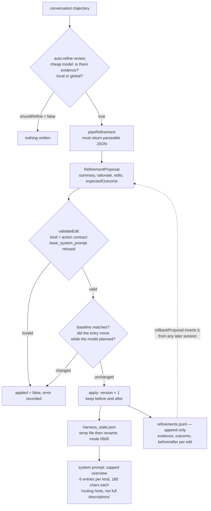

## 1. Executive Summary

Prime Agent is PrimeIntellect's coding agent — roughly 184,000 lines of
TypeScript across four packages, MIT-licensed, 4,469 commits, built on the Pi
agent core. The interesting part for this atlas is not that it stores sessions.
It is that **the agent's durable memory is the harness it runs on**, and it
rewrites it.

**Four kinds of durable entry, written by the agent about itself.** A
`RefinementKind` is `prompt`, `memory`, `skill` or `subagent`: a supplemental
prompt note, a durable fact, a callable Python skill with an argument contract,
or a delegation spec. The `refine` skill states the trigger plainly — *"a
repeated failure, reusable tactic, delegation role, or behavior policy that
should be persisted"* — and the refinement pass reads the conversation
trajectory and proposes `create`, `update` and `delete` edits against the
existing state.

That shape is common enough as an aspiration. What makes this one worth reading
is that the mechanics underneath it are built to a standard the aspiration
usually is not.

**Every applied edit carries a full before-and-after snapshot**, and the whole
`RefinementResult` — snapshots included — is appended to
`harness/refinements.jsonl`, in a function whose own comment says why: *"so it
can be rolled back from any session."* `rollbackProposal()` inverts a
refinement by walking its edits in reverse, restoring each `before`, deleting
what was created. A memory the agent invented last week from a bad inference can
be undone this week, by id, and a committed test exercises exactly that across
sessions.

**An edit whose target moved during planning is refused.** Planning is an LLM
call that takes time, and the harness can change under it. `applyRefinementProposal`
compares the current entry against a baseline snapshot and, when they differ,
records the edit as `applied: false` with the error `"entry changed during
refinement planning"`. That is a lost-update defence on a memory write — the
failure most systems in this atlas do not model at all.

**The base system prompt is not editable, and the check is in code.**
`validateEdit` refuses `prompt` edits whose id is `base_system_prompt`, and
refuses them again when the id was derived from a supplied title — the bypass
that would otherwise exist, closed and separately tested.

**The gap is the one this atlas keeps finding.** Nothing here is keyed on a
rejected *value*. Deleting a memory removes the entry, and the next refinement
pass reading a similar trajectory can propose the same content again as a fresh
`create`. The history preserves what was deleted; it does not refuse it.

## 2. Mental Model

The agent's own configuration is the store, and the write path is a proposal
that must survive three checks before it lands.



Read the two rejection paths as the design. A proposal is not a mutation — it is
a request that the contract, and then the world, can refuse. And read the dotted
line as the other half: the log is not a record of what happened, it is the
mechanism by which what happened can be undone.

## 3. Architecture

Four packages — `agent`, `ai`, `coding-agent`, `tui` — over the Pi agent core.
Session transcripts are JSONL under `~/.prime/agent/sessions/`, with a
`migrations.ts` that relocates legacy layouts and de-duplicates filenames.

The memory subsystem is one file: `packages/coding-agent/src/core/refinement/refinement.ts`,
1,017 lines. Its state lives in two places:

- **Global** — `~/.prime/agent/harness/harness_state.json` plus
  `refinements.jsonl`, persisting across every session.
- **Local** — the same pair under the current session's artifact directory,
  belonging to that session alone.

`mergeHarnessStates()` combines them for the prompt, and its collision rule is
worth naming: when a local id already exists globally, the local entry is
re-keyed as `local:<id>` rather than overwriting. Nothing is hidden by a
name clash, which is the failure this kind of two-tier store usually has.

`saveHarnessState()` writes a temp file and renames, preserving the existing
file mode and defaulting to `0600`. `loadHarnessState()` runs on every
system-prompt build, so a corrupt file degrades to empty state rather than
throwing — with a comment explaining that a broken harness must not break the
session, and that the next save rewrites it cleanly.

## 4. Essential Implementation Paths

### The review before the write

Refinement does not begin with a proposal. `reviewAutoRefine()` sends the last
40,000 characters of the trajectory, the current harness overview and the recent
refinement history to a cheap model, and asks for a JSON verdict:
`shouldRefine`, a rationale, and optional instructions. The instruction it
carries is the scope policy:

> Return shouldRefine=true when the trajectory contains evidence useful to this
> session's future turns. Prefer local harness edits for current task progress,
> temporary blockers, and current-run coordination. Ask for global refinement
> only for durable cross-session lessons or explicitly project-qualified facts
> likely to be reused in future sessions.

So the default is local and the promotion to global needs a reason. That is the
right direction for a store the agent writes about itself, and it is worth
noting that the gate is another model rather than a person.

### The three checks, in order

`validateEdit()` enforces per-kind contracts before anything is touched. Actions
are `create`/`update`/`delete` and kinds are the four above; `update` and
`delete` require an id; anything but `delete` requires title and content. A
`skill` edit additionally requires an `arguments` contract and a `reference` of
type `python` carrying both an import and a callable — so the harness cannot
mint a skill the kernel could not call.

Then the baseline check:

```ts
if (
    options.baselineState &&
    !proposalModifiedKeys.has(entryKey) &&
    JSON.stringify(before) !== JSON.stringify(baseline)
) {
    appliedEdits.push({ ...edit, id, before, applied: false, error: "entry changed during refinement planning" });
    continue;
}
```

The `proposalModifiedKeys` guard is the part that shows someone ran into the
obvious bug: without it, the second edit to the same entry inside one proposal
would compare against a baseline its own first edit had already invalidated.
There is a test named for exactly that — *"allows sequential edits to the same
entry after the baseline matches once."*

Then the write, which sets `version = before.version + 1`, stamps `updated_at`,
preserves the original `created_at`, and pushes `{...edit, before, after, applied: true}`.

### Rollback, which is what the snapshots are for

```ts
for (const edit of [...target.appliedEdits].reverse()) {
    if (!edit.applied) continue;
    if (edit.before) { /* update or create it back to `before` */ }
    else if (edit.after) { /* delete what was created */ }
}
```

Reversed order, `before` restored, creations deleted. It is generated as an
ordinary `RefinementProposal`, so a rollback goes through the same validation and
baseline checks as any other edit and lands in the history as its own event with
`rollbackOf` set.

Because global refinements are appended to `refinements.jsonl` rather than only
to the session transcript, a refinement made in one session is rollback-addressable
from another — and `loadGlobalRefinementHistory()` skips malformed lines instead
of failing, with a test for that too.

This is the most complete undo for a self-modifying memory in this atlas. The
comparison worth drawing is with systems whose background consolidation deletes
on model judgement and keeps nothing: here the same judgement is exercised, and
the result is addressable and reversible afterwards.

### What reaches the prompt

`formatHarnessStateForPrompt()` renders a capped overview: six entries per kind,
content compacted to 180 characters, five recent refinements. It tells the model
what it is looking at:

> The continual harness entries below are compact summaries, not full
> descriptions. Use them as routing/context hints; inspect or refine the
> underlying continual harness entry only when detail matters.

The same routing-card arrangement several other local systems here arrive at
independently — an index in the prompt, the detail fetched on demand. The cap is
a real ceiling rather than a soft one: past six entries of a kind, an entry is
not represented in the prompt at all, and nothing ranks which six.

## 5. Memory Data Model

`HarnessEntry` carries `id`, `kind`, `title`, `content`, `path`, `scope`,
`reference`, `arguments`, `metadata`, `source`, `created_at`, `updated_at` and
`version`. `path` is a coarse grouping string defaulting to `"general"`;
`source` is `"refine"` for anything the pass wrote.

`HarnessRefinementEvent` — the in-state summary — carries `id`, `trigger`,
`changes`, `evidence`, `outcome`, `created_at`. The richer form in
`refinements.jsonl` is the whole `RefinementResult`, including every
`AppliedRefinementEdit` with its `before`, `after`, `applied` flag and any
`error`.

Two things follow. **A refused edit is recorded, not discarded** — the history
holds edits the contract or the baseline check rejected, with the reason. Very
little in this atlas records what a background pass was not allowed to do.

And **`evidence` is prose the model wrote about its own trajectory**. It is a
rationale, not a citation: no turn id, no message range, nothing a reader could
follow back to the exchange that justified the edit. For a store whose whole
premise is evidence-backed self-modification, that is the seam — the audit trail
records what the model *said* its reason was.

There is no trust state. `version` counts revisions and `scope` says where an
entry lives; neither expresses candidate, verified or rejected, and nothing
distinguishes a memory the user confirmed from one the model inferred.

## 6. Retrieval Mechanics

There is no retrieval on the harness. The overview is injected wholesale within
its caps and the model chooses what to inspect. No index, no embedding, no
ranking, and no query — which for a store expected to hold tens of entries is a
defensible trade and becomes a real limit at the cap.

Scope does reach the read path on the session side:
`sessionHeaderMatchesCwd()` compares a session's stored `cwd` against the current
one and the listing skips non-matching sessions, so the resume picker is scoped
to the directory you are in — a stored key applied as a filter, which is what the
[scope as a first-class key](../../patterns/scope-as-a-first-class-key/) pattern
asks for. On the harness itself, scope decides which of two files an entry is
written to and how a collision is named, and never excludes an entry from a read.

## 7. Write Mechanics

Every durable write goes through `applyRefinementProposal`. There is no second
path: no tool that edits an entry directly, no manual harness editor in the CLI.
That single funnel is what makes the versioning, the snapshots and the baseline
check meaningful — the
[governed write gateway](../../patterns/governed-write-gateway/) shape, arrived
at for a store the agent writes about itself.

Refinement is triggered three ways: `await refine.run()` from the IPython kernel,
the `/refine` slash command, and the automatic review at turn end. The kernel
call returns immediately and the work happens when the turn ends, so refinement
is off the critical path.

### Operational cost

Two model calls per automatic refinement — the review and the plan — against a
cheap model where one is configured, with the trajectory truncated to 40,000
characters. The review exists partly to make the second call conditional. State
writes are a whole-file rewrite of `harness_state.json` plus one appended JSONL
line; the history grows monotonically and nothing prunes it, which is the right
trade given that pruning it would break rollback.

## 8. Agent Integration

The `refine` skill is the kernel-side interface — `refine.status()` reporting
`pending` and `in_flight`, `refine.run(instructions, global_=True)`. Alongside it
are skills for goals, compaction, subagent messaging and observation, plus a
`skill-creator` that writes new skills to `.prime/agent/skills/` or
`~/.prime/agent/skills/`, following the
[Agent Skills standard](https://agentskills.io/specification).

So there are two ways procedural memory is authored here — a skill the agent
writes as files, and a `skill` entry the refinement pass mints with a Python
reference contract — and only the second gets versioning, snapshots and rollback.

Front ends are a TUI, a daemon with a session list and per-session status
summaries, an ACP mode and an SDK. The daemon summarizer is worth not
mis-reading: it produces a recap and a `taskState` for the session list, which is
operational status rather than recall, and it is not fed back into a later
session's context.

## 9. Reliability, Safety, and Trust

Strengths:

- **Before-and-after snapshots on every applied edit**, persisted where a later
  session can reach them.
- **Cross-session rollback**, generated as an ordinary proposal so it passes the
  same checks, and tested against history written by a different session.
- **An optimistic-concurrency guard** refusing an edit whose target changed while
  the model was planning — with the same-proposal case correctly excluded.
- **An immutable base prompt enforced in code**, including the derive-id bypass.
- **Contract validation per kind**, so a minted skill must carry an import and a
  callable.
- **Refused edits recorded with their reason**, not silently dropped.
- **Atomic state writes** at mode 0600, and corrupt state degrading to empty
  rather than breaking the session.
- **A scope policy that defaults to local** and requires a reason to go global.

Gaps:

- **Nothing is keyed on a rejected value.** A memory deleted as wrong can be
  proposed again by the next pass; the history remembers the deletion and does
  not refuse the content.
- **`evidence` is model-authored prose**, with no reference back to the turns it
  claims to rest on.
- **No trust state.** A user-confirmed preference and a model's inference are the
  same kind of entry.
- **The gate before a write is another model**, so an automatic refinement lands
  without a person in the loop unless one runs `/refine` deliberately.
- **The prompt cap silently drops entries.** Past six per kind, an entry is
  absent from the overview and nothing ranks which six survive.
- **Local harness state lives in the session artifact directory**, so it shares
  that session's lifetime.

## 10. Tests, Evals, and Benchmarks

`packages/coding-agent/test/refinement.test.ts` is 1,519 lines and covers the
mechanism rather than the happy path. Named cases include the baseline guard
(*"rejects an edit when the target entry changed after planning"*) and its
counterpart (*"allows sequential edits to the same entry after the baseline
matches once"*), the atomic write (*"atomically replaces harness state without
leaving temporary files"*, asserting the directory contains only the state file),
the immutable base prompt from both directions, the skill contract requirements,
the merge that must not hide colliding entries, malformed history lines skipped
without throwing, and rollback of created, updated and deleted entries —
including *"rolls back a refinement recorded in a different session via global
history."*

There is also a cluster of tests for the failure mode a JSON-returning LLM call
actually has: an exhausted output budget reported as such rather than as a parse
error, a truncated proposal that never reports a length stop reason, and
malformed JSON classified as invalid rather than truncated. That distinction
matters operationally and is the kind of thing usually discovered in production.

On the negative side, `compaction.test.ts` asserts that an earlier summary is not
fed back into the next summarization —
`expect(extractText(preparation!.messagesToSummarize)).not.toContain("First summary")`,
in two places — which is a committed case that particular material must not reach
the model, and what earns the mark here.

What is not tested is the judgement: no committed case fixes what the refinement
model *should* propose from a given trajectory, which is the same oracle problem
every system in this family has. The difference is that here a wrong proposal is
recoverable.

Nothing was executed from this checkout. Six dependency surfaces had changed
inside the seven-day cooldown, and every claim above is established by reading.

## 11. For Your Own Build

### Steal

- **Snapshot before and after on every edit a background pass makes**, and put
  the snapshots where a later run can reach them. It converts an irreversible
  model judgement into a reversible one for the cost of some JSON.
- **Refuse an edit whose target moved while you were planning.** An LLM call is
  long enough for the world to change, and comparing against a baseline snapshot
  is a few lines.
- **Make one thing immutable and enforce it in code** — then close the id-derivation
  bypass, which is the version of the check that actually gets exercised.
- **Record the edits you refused**, with the reason, in the same log as the ones
  you applied.
- **Default a self-written memory to session scope** and make promotion to global
  need a stated reason.
- **Re-key colliding entries instead of overwriting them** when merging two
  scopes.

### Avoid

- **Treating a model's rationale as evidence.** `evidence` here is prose the
  model wrote about its own trajectory, with no reference to the turns it rests
  on — so the audit trail records the claim rather than the ground for it. A turn
  id would cost nothing.
- **Deleting without refusing.** Rollback undoes an edit; it does not stop the
  next pass proposing the same content again. If a memory was deleted because it
  was wrong, something has to be keyed on the value.
- **A hard cap with no ranking.** Six entries per kind reach the prompt and
  nothing decides which six, so the store degrades by insertion order rather than
  by relevance once it outgrows the window.

### Fit

Right if you want a coding agent that improves its own harness and you want that
improvement to be auditable and reversible — this is the most carefully built
version of that idea in the atlas, and the test suite is evidence the care is
real rather than aspirational.

Wrong if you need the correction to *hold*. The machinery answers "can I undo
what it learned", which most systems cannot, and does not answer "can I stop it
learning that again", which is a different question and the one this atlas keeps
asking.

## 12. Open Questions

- Would a turn id or message range on `evidence` be enough to make a refinement
  audit-followable, given the trajectory is already persisted as JSONL?
- Should a deletion write something keyed on the entry's content, so the next
  pass sees that this material was rejected rather than merely absent?
- What ranks the six entries per kind that reach the prompt once a harness
  outgrows the cap?
- Local harness state lives in the session artifact directory — is a local entry
  meant to be lost when that session is deleted, and is anything promoted first?
- `refinements.jsonl` grows without bound and pruning it would break rollback. Is
  there an intended retention story, or is unbounded growth the deliberate price
  of the undo?
- The auto-refine gate is a model judging whether a model should write. Is a
  human approval path intended for global-scope edits specifically?

## Appendix: File Index

- The whole memory subsystem: `packages/coding-agent/src/core/refinement/refinement.ts`
  (`applyRefinementProposal`, `validateEdit`, `rollbackProposal`,
  `reviewAutoRefine`, `planRefinement`, `refineHarness`, `loadHarnessState`,
  `mergeHarnessStates`, `saveHarnessState`, `appendGlobalRefinement`,
  `loadGlobalRefinementHistory`, `formatHarnessStateForPrompt`).
- Config and state locations: `packages/coding-agent/src/config.ts`
  (`CONFIG_DIR_NAME`, `getAgentDir`, `getSessionsDir`).
- Session persistence, cwd scoping and resume/branch:
  `packages/coding-agent/src/core/session-manager.ts`
  (`sessionHeaderMatchesCwd`, `readSessionHeader`, `readSessionInfo`);
  layout migrations: `packages/coding-agent/src/migrations.ts`.
- Kernel-side interfaces: `packages/coding-agent/skills/refine/SKILL.md`,
  `skills/goal/SKILL.md`, `skills/skill-creator/SKILL.md`.
- Project instructions discovery: `packages/coding-agent/src/core/resource-loader.ts`.
- Install-time behaviour: `packages/coding-agent/src/postinstall.ts`.
- Tests: `packages/coding-agent/test/refinement.test.ts`,
  `compaction.test.ts`, `builtin-skills.test.ts`.

## History

**2026-08-05** — [`c98941a2a5cf40faecf9b4648ac3c304abf48fd3`](https://github.com/PrimeIntellect-ai/prime-agent/commit/c98941a2a5cf40faecf9b4648ac3c304abf48fd3) — first reading. Screened before reading: 0 auto-run surfaces, 7 build-time exec paths, 22 unpinned dependency surfaces, and 6 manifests changed inside the seven-day cooldown — the repository landed commits on the day it was pinned. The first screen returned `NOTHING SCANNED` against a `--no-checkout` clone, which is the tool reporting an empty working tree rather than a clean one; it was re-run after checkout and is the result recorded here. The one `postinstall` in the tree, `packages/coding-agent/postinstall.cjs`, was read before anything else: it defers to a built `dist/postinstall.js` whose source exits immediately unless `PRIME_AGENT_BOOTSTRAP_KERNEL_ON_INSTALL` or `PRIME_AGENT_BOOTSTRAP_TOOLS_ON_INSTALL` is set to `1`, so the tool- and kernel-fetching path is opt-in rather than default. `AGENTS.md` is present and was read as data. **Nothing was executed.** The continual harness was traced end to end: the two-stage auto-refine gate, the per-kind edit contracts, the baseline comparison that refuses an edit whose target moved during planning, the `before`/`after` snapshots on every applied edit, `appendGlobalRefinement` writing the whole result to `harness/refinements.jsonl`, and `rollbackProposal` inverting a refinement into an ordinary proposal — the mechanism its own comment says exists so a refinement "can be rolled back from any session". Marks: `audit_log` for that append-only history, which carries evidence, outcome, and both snapshots per edit including for refused edits; `scope_enforced` for `sessionHeaderMatchesCwd` filtering the session listing by stored working directory; and `negative_eval` for `compaction.test.ts` asserting an earlier summary is not fed back into the next summarization. `tombstone` is withheld and the near-miss is specific: a deleted entry's content survives in the history and is reachable by rollback, but nothing is keyed on that content, so the next refinement pass can propose it again as a fresh `create`.
