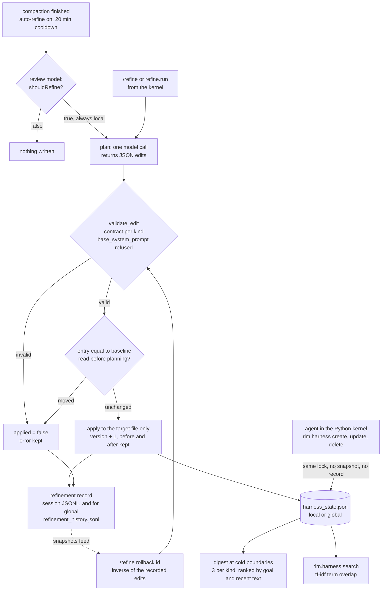

## 1. Executive Summary

Prime Agent is PrimeIntellect's coding and research agent, and its durable
memory is the harness it runs on: prompt notes, memories, Python skills,
subagent specs and factory workflows the agent rewrites from its own
trajectory. The `/refine` path that rewrites them is built to a high standard
— validated edits, a refusal for an entry that moved while the model planned,
before-and-after snapshots, rollback by id. The weakness is that it is one of
two doors: the agent also holds direct create, update and delete calls on the
same store, and those leave no snapshot and no record.

**The product was rewritten in Rust and the harness was ported with it.** The
TypeScript tree was removed and nine crates added in one commit,
[`39bc99a91d102c46474c090fdc7ae7cd5037ffcf`](https://github.com/PrimeIntellect-ai/prime-agent/commit/39bc99a91d102c46474c090fdc7ae7cd5037ffcf)
(*Port Prime Agent to Rust*, #2524, 30 September 2026). The project's
[announcement](https://www.primeintellect.ai/blog/prime-agent-rust) of 9 October
2026 gives type safety, error handling and runtime overhead as the reasons and
says nothing about the harness. In the tree the mechanism survives nearly line
for line: `crates/pa-core/src/refinement/` carries the same entry type, the same
validation messages (its comment says they *"mirror the TS messages exactly"*),
the same baseline check and the same rollback inversion. Every anchor in this
report is to the Rust and Python tree at the pinned commit.

Two papers stand behind it. *Prime Agent: A Self-Improving RLM Harness*
([arXiv:2608.23552](https://arxiv.org/abs/2608.23552), 24 August 2026) is the
one the README asks to be cited. The harness design comes from *Continual
Harness: Online Adaptation for Self-Improving Foundation Agents*
([arXiv:2605.09998](https://arxiv.org/abs/2605.09998), 11 May 2026), which the
README links as the source of the store of *"supplemental prompts, memories,
skill descriptions, and reusable subagent specifications"*. Section 10 records
what neither puts in this repository.

**What the refinement path gets right.** An edit is a proposal the contract and
then the world can refuse. `validate_edit` enforces a per-kind contract and
refuses a prompt entry claiming the id `base_system_prompt`, including one whose
id would be derived from its title. An edit whose entry changed between the
baseline and the apply is recorded as refused. Every applied edit keeps the
entry before and after, and `/refine rollback <id>` turns those snapshots back
into an ordinary proposal. A local refinement plans against local and global
entries and applies to the local file only, so it cannot edit a global entry.

**What it does not cover.** The system prompt lists `rlm.harness.create_memory`,
`update_memory`, `delete_memory` and their prompt, skill and subagent twins as
*"Active memory management by the agent"*, with `global_=True` reaching the
cross-session store. Those calls write `harness_state.json` directly: no
snapshot, no refinement record, no base-prompt check, nothing a rollback can
invert. And as on the refinement path, nothing is keyed on a rejected value, so
content deleted as wrong can be written again by either door.

## 2. Mental Model

A harness entry is a belief the agent holds about how to work: a fact, a policy
note, a callable skill, a delegation role, a workflow. It becomes one in two
ways and stops being one in the same two ways. On the refinement path a model
reads the trajectory and proposes edits, and the proposal must survive a
contract check and a staleness check before it lands; the record of what landed
and what was refused is what makes it reversible. On the kernel path the agent
calls a method and the entry exists.

Nothing in between: an entry has no status, so a memory the user confirmed and
one the model inferred from a single failed command are the same object, and
both reach the digest on equal terms. An entry stops being believed when
an edit or a kernel call deletes it, and nothing remembers why.


```mermaid
%% caption: the refinement path refuses, snapshots and records; the kernel path reaches the same file with none of the three
flowchart TD
    C["compaction finished<br/>auto-refine on, 20 min cooldown"] --> RV{"review model:<br/>shouldRefine?"}
    RV -- "false" --> STOP["nothing written"]
    RV -- "true, always local" --> PL
    U["/refine or refine.run<br/>from the kernel"] --> PL["plan: one model call<br/>returns JSON edits"]
    RB["/refine rollback id<br/>inverse of the recorded edits"] --> V
    PL --> V{"validate_edit<br/>contract per kind<br/>base_system_prompt refused"}
    V -- "invalid" --> REJ["applied = false<br/>error kept"]
    V -- "valid" --> B{"entry equal to baseline<br/>read before planning?"}
    B -- "moved" --> REJ
    B -- "unchanged" --> AP["apply to the target file only<br/>version + 1, before and after kept"]
    AP --> ST[("harness_state.json<br/>local or global")]
    AP --> H["refinement record<br/>session JSONL, and for global<br/>refinement_history.jsonl"]
    REJ --> H
    H -. "snapshots feed" .-> RB
    K["agent in the Python kernel<br/>rlm.harness create, update, delete"] -- "same lock, no snapshot, no record" --> ST
    ST --> D["digest at cold boundaries<br/>3 per kind, ranked by goal and recent text"]
    ST --> S["rlm.harness.search<br/>tf-idf term overlap"]
```

Read the dotted edge as the design: the log is what makes a refinement undoable,
and only the left half of the diagram writes to it. The `K` edge is the finding.

## 3. Architecture

Nine crates with a one-way dependency graph: `pa-core` holds the session
engine, tools, skills, prompts, compaction and the harness; `pa-daemon` runs a
supervisor with one worker process per session; `pa-tui`, `pa-cli`, `pa-ai`,
`pa-agent`, `pa-models`, `pa-types` and `pa-telemetry` carry the interface,
binary, providers, loop, catalog, wire types and telemetry. The model-facing
tool is a persistent IPython kernel run from `prime-agent-runtime/`, a Python
package installed into a venv under `~/.prime/agent/kernel-venv`
(`crates/pa-core/src/kernel/bootstrap/venv/layout.rs:28`). The kernel's
readiness probe requires the harness CRUD methods to be callable before a
session starts (`crates/pa-core/src/kernel/bootstrap/venv/probe.rs:28`).

The harness lives in two stores of the same shape:

- **Global**: `~/.prime/agent/harness/harness_state.json`, plus
  `refinement_history.jsonl` beside it (`crates/pa-core/src/refinement/mod.rs:13-14`,
  `:122-134`).
- **Local**: `harness/harness_state.json` under the session's own directory
  (`crates/pa-core/src/session_engine/refine.rs:217-221`). A local refinement
  without a session directory is refused (`:329-336`).

Both writers take the same lock, a directory named `harness_state.json.lock`
with an owner file, taken with fifty 20 ms attempts and a ten-second stale
timeout on both sides: the Rust host through `LockDir::acquire_owned_retrying`
(`crates/pa-core/src/refinement/mod.rs:300-318`), the Python kernel through
`_locked` (`prime-agent-runtime/src/rlm/harness.py:41-43`, `:505-522`). Both write
a temp file, fsync it and rename (`mod.rs:279-292`, `harness.py:610-658`). A
corrupt state file loads as empty on both sides (`mod.rs:169-185`,
`harness.py:533-534`).

Sessions are JSONL under `~/.prime/agent/sessions/`, and the session file also
carries every refinement result as a `prime-agent.refinement` custom entry
(`refine.rs:21`, `:415-418`).

### Deployment and ergonomics

One binary installed by script, a Python venv the binary bootstraps for the
kernel, and a model provider. Refinement needs a model call; the kernel CRUD
path does not. The store is two pretty-printed JSON files and one JSONL file,
readable and repairable by hand. The daemon keeps sessions alive across
terminal detaches, and the README warns that worker and kernel processes are
*"not a security sandbox"*.

## 4. Essential Implementation Paths

### The refinement funnel

`execute_refinement_with_rows` is the one function every refinement goes
through, whether `/refine`, `refine.run` or the automatic review started it
(`crates/pa-core/src/session_engine/refine.rs:301-445`). In order:

1. The planning state is the global store for a global refinement and the merge
   of global and local for a local one (`:338-344`). `merge_harness_states`
   re-keys a local entry whose id exists globally as `local:<id>`, so neither
   hides the other (`crates/pa-core/src/refinement/mod.rs:230-272`).
2. The baseline is read from the target store before the model call — *"so
   concurrent kernel writes are rejected instead of clobbered"* (`refine.rs:347-359`).
3. `plan_refinement` builds the prompt from the overview (40 entries per kind,
   240 characters each), the last 20 refinement results, the last 80,000
   characters of conversation and a scope policy, and parses the JSON reply
   (`crates/pa-core/src/refinement/executor.rs:41-86`, `:89-125`, `:194-268`).
   A rollback skips the model and returns `rollback_proposal(target)` (`:203-218`).
4. Display prefixes `local:` and `global:` are stripped from ids (`refine.rs:224-237`).
5. The target store is re-read and the plan applied inside
   `update_harness_state`, under the lock (`refine.rs:395-407`).
6. A global result is appended to `refinement_history.jsonl`; every result is
   appended to the session file; a notice listing applied edits goes into the
   model's context when any edit applied (`refine.rs:409-443`).

### The checks inside apply

`apply_refinement_proposal` (`crates/pa-core/src/refinement/planner.rs:310-501`)
runs, per edit:

- `validate_edit`: action and kind present; `update` and `delete` need an id;
  anything but `delete` needs title and content; a skill needs an `arguments`
  object and a `reference` of type `python` with an import and a callable; a
  factory needs one `dag` or `machine` object (`planner.rs:193-285`). A prompt
  entry whose given or derived id is `base_system_prompt` is refused (`:210-215`).
- The baseline comparison, skipped for an entry an earlier edit in the same
  proposal already changed (`:357-372`):

```rust
if options.baseline_state.is_some()
    && !proposal_modified_keys.contains(&entry_key)
    && serde_json::to_value(&before).ok() != serde_json::to_value(&baseline).ok()
{
    // ... row.error = Some("entry changed during refinement planning".to_string());
```

- The factory opt-in, re-read from settings after the model call so a
  `/factory off` during planning decides (`:380-389`, `refine.rs:377-394`).
- Existence: `delete` and `update` of a missing entry and `create` of an
  existing one are refused (`:390-417`).
- The write: `version = before.version + 1`, `created_at` kept, `source` set to
  `"refine"`, and the row pushed with `before`, `after` and `applied: true`
  (`:418-469`).

### Rollback

`rollback_proposal` walks the target's applied edits in reverse: an edit with a
`before` is restored to it, an edit that created an entry is deleted
(`planner.rs:505-547`). The result is an ordinary proposal, so it passes the same
validation and baseline checks and is recorded with `rollback_of` set. The
history it searches is the global JSONL merged with the session's own records
(`refine.rs:345-346`, `mod.rs:472-493`), so a global refinement made in one
session can be rolled back from another. Rollback is a user command,
`/refine rollback <id>` (`crates/pa-core/src/session_engine/slash_commands.rs:45-85`);
`refine.run` from the kernel takes instructions and a scope and no rollback id
(`skills/refine/src/refine/__init__.py:25-50`).

### The kernel path

`HarnessState` in `prime-agent-runtime/src/rlm/harness.py` is a CRUD store over
the same file. `create`, `update` and `delete` take the lock, re-read the file
and write it (`:791-912`); the typed helpers `create_memory`, `update_memory`,
`delete_memory` and their prompt, skill, subagent and factory twins wrap them
(`:914-1139`). `global_=True` or a `global:` id prefix routes the call to the
global store (`:136-157`, `:602-608`). `_validate_entry_shape` checks types, the
skill reference and the factory spec (`:312-366`). The core prompt advertises
all of it to the agent (`crates/pa-core/src/prompts/layers/core.md:90-108`).

### The automatic trigger

Auto-refine runs after compaction. The gates default to enabled, compaction on
and a 20-minute review cooldown (`refine.rs:38-47`); the consumers check
`enabled` and `compact` (`crates/pa-core/src/session_engine/auto_refine_trigger.rs:143`,
`crates/pa-cli/src/print_boundary/autorefine.rs:95`). A `turn_interval` of 25 is
parsed from settings (`refine.rs:52-62`) and read by nothing else in the tree.
The review sends the last 40,000 characters of conversation to a model that
returns `shouldRefine` (`executor.rs:348-387`); an approval runs a refinement
with `global: false` and instructions to *"Do not promote anything global unless
explicitly requested"* (`refine.rs:68-84`, `:564-584`).

## 5. Memory Data Model

`HarnessEntry` carries `id`, `kind`, `title`, `content`, `path`, `scope`,
`reference`, `arguments`, `metadata`, `source`, `created_at`, `updated_at` and
`version` (`crates/pa-core/src/refinement/mod.rs:49-69`). Kinds are `prompt`,
`memory`, `skill`, `subagent` and `factory` (`:10`, `:21-29`); a factory is a
declarative state machine of subagent states, gated behind a default-off
`factory.enabled` setting on both writers (`:136-167`, `harness.py:349-366`).
`source` is `"refine"` from the refinement path and `"agent"` by default from
the kernel (`planner.rs:456`, `harness.py:671`).

The state file also holds `refinements`, a list of `HarnessRefinementEvent`
with `trigger`, `changes`, `evidence` and `outcome` (`mod.rs:71-92`). Two
writers feed it: apply pushes one per refinement with `evidence` set to the
model's `rationale` (`planner.rs:483-490`), and the kernel's
`record_refinement` appends whatever the agent passes (`harness.py:1141-1172`).
The list lives inside the rewritten state file, so it is not append-only; the
digest shows its last ten.

The full record is `RefinementResult`: summary, rationale, expected outcome, an
optional `rollback_of` and scope, and every `AppliedRefinementEdit` with the
planned fields, `before`, `after`, `applied`, `error` and the edit's `reason`
(`mod.rs:325-371`).

Three consequences:

- **A refused edit is recorded with its reason.** The record holds what the
  harness declined to become as well as what it became.
- **`evidence` is prose the model wrote about its own trajectory.** No turn id
  or message range points back to the exchange that justified it.
- **No status.** `version` counts revisions and `scope` names a file; neither
  withholds an entry from being acted on.

The TypeScript product wrote its global history to `harness/refinements.jsonl`;
the Rust reader opens `refinement_history.jsonl` (`mod.rs:14`, `:320-323`,
`:446-467`). No file in the tree reads the older name, and the TypeScript-era
cleanup deliberately leaves it on disk (`crates/pa-daemon/src/ts_era.rs:3-18`,
its test at `:50`). The state file kept its name, so entries written by the
TypeScript product load, and the global refinements that wrote them are absent
from the history a rollback searches. That is read from the code, not observed
on an upgraded install.

## 6. Retrieval Mechanics

**The digest.** The merged harness is rendered as a `[harness-digest]` context
message at cold boundaries — session start, resume and the head of a compacted
context — and re-delivered only when a fingerprint of the state differs
(`crates/pa-core/src/session_engine/harness_digest.rs:1-4`, `:79-111`,
`:443-456`, `:496-520`). Within each kind, entries are sorted by a weighted term
overlap with the active goal objective (weight 3) and the last four messages
(weights 2 down to 1), each term discounted by its document frequency within
the kind, with path, title and id as the tie-break (`harness_digest.rs:36-59`,
`crates/pa-core/src/refinement/ranking.rs:104-175`, `:243-262`). The first three
per kind are shown at 140 characters, with `+N more` and a pointer to
`harness.search` when the kind overflows, followed by the last ten refinement
events (`mod.rs:17-19`, `ranking.rs:275-327`, `:334-368`). The header tells the
model these are *"compact summaries, not full descriptions"* to be used as
*"routing/context hints"* (`ranking.rs:215`).

**The search.** `rlm.harness.search(query, kind=None, limit=10)` tokenises the
query into terms of at least three ASCII characters, two in other scripts and
CJK bigrams, scores each entry by fields matched with a `log(1 + N/df)`
discount, sorts by score and then recency, and drops zero scores
(`prime-agent-runtime/src/rlm/harness.py:93-124`, `:1246-1311`). It searches one
store at a time: local by default, global with `global_=True`.

Scope reaches the read path on the session side. `header_matches_cwd` compares
a saved session's stored `cwd` with the caller's, and
`find_most_recent_session_for_cwd` offers only matching sessions to `--continue`
(`crates/pa-core/src/session/discovery.rs:110-112`, `:142-155`;
`crates/pa-cli/src/interactive_mode.rs:613`). `resolve_session_path` tries the
current directory first and resolves another project's session only by explicit
selector (`discovery.rs:190-226`), and headless mode refuses that case unless
`--fork` is passed (`crates/pa-cli/src/print_runtime.rs:947-956`). A stored key
applied as a filter on a read path is what the
[scope as a first-class key](../../patterns/scope-as-a-first-class-key/) pattern
asks for. On the harness, scope selects a file and never filters an entry.

## 7. Write Mechanics

**The scope rule is enforced by construction on the refinement path.** The
planner's prompt says global entries are *"read-only context"* during a local
refinement (`planner.rs:10`, `executor.rs:224`), and the code makes that true:
apply runs against the target store alone (`refine.rs:372-407`), so a local
refinement naming a global id finds no entry and the edit is recorded as
`entry not found`. The scope an entry keeps on update is
`before.scope`, falling back to the refinement's (`planner.rs:436-440`), and
since `before` comes from the target file the two agree.

**The kernel path enforces less.** `rlm.harness.update_memory(id, ..., global_=True)`
edits a global entry from any session in one call, and `delete_memory` removes
one, with no baseline, no snapshot and no line in any history
(`harness.py:791-803`, `:867-912`). It does validate shape, and it takes the
same lock, which is what lets the refinement path's baseline see a kernel write
made during planning. The `base_system_prompt` refusal exists only in
`validate_edit`; the kernel will store a prompt note with that id. The base
system prompt itself is compiled into the binary from
`crates/pa-core/src/prompts/layers/` by `include_str!`
(`crates/pa-core/src/prompts/layers.rs:4-6`), so that note is a mislabelled
addendum rather than a replacement.

**Refinement is between turns, and the turn waits.** `refine.run` from the
kernel only schedules; the host runs the refinement at the turn boundary and
resumes the agent afterwards, and `refine.status` reports `in_flight: false`
because *"the Rust consumption runs refinement synchronously between turns"*
(`crates/pa-core/src/session_engine/turn_boundary.rs:297-371`). A refinement
lands before the next turn starts and announces itself through the notice row.
A kernel write lands immediately and is visible to `search` at once; it reaches
the digest at the next cold boundary.

### Operational cost

An automatic round is two model calls after a compaction — a review with a
4,096-token output cap and, on approval, a plan with 32,000
(`planner.rs:15-16`) — and at most one review per 20 minutes. The plan prompt
carries up to 80,000 characters of conversation, trimmed from the front by
binary search to fit the model's window (`planner.rs:572-632`). A write is a
whole-file rewrite of one `harness_state.json` with one fsync, plus an appended
line. Nothing prunes `refinement_history.jsonl` or the in-state `refinements`
list; pruning the first would break rollback.

### Hard-won defences

- **Planning and applying are separated by a re-read.** `plan_refinement`
  mutates nothing, and its comment states why the caller re-reads: *"the LLM
  call can take many seconds"* (`executor.rs:187-193`).
- **The factory gate decides on the setting at apply time**, not on a snapshot
  taken before the model call (`refine.rs:377-394`), with a test named for that
  ordering (`refine.rs:847`).
- **A failed audit append is reported after the durable edits**, so the user's
  view and the stores do not diverge (`refine.rs:412-433`, test at `:960`).

## 8. Agent Integration

The agent works through the Python kernel. `refine.status()` and
`refine.run(instructions, global_=False)` are host requests
(`skills/refine/SKILL.md`, `turn_boundary.rs:299-371`); `rlm.harness.*` is the
direct store, with `overview`, `search`, `snapshot` and `record_refinement`
beside the CRUD methods (`core.md:90-108`). The user has `/refine [--global]
[instructions]` and `/refine rollback <id> [--global]`. Skills on disk are a
separate mechanism: `skill-creator` writes packages to `.prime/agent/skills/` or
`~/.prime/agent/skills/` (`skills/skill-creator/SKILL.md:21-22`), and those
carry no version, snapshot or rollback.

So procedural memory is authored three ways — a skill package on disk, a
`skill` entry from `/refine`, and a `skill` entry from `rlm.harness.create_skill`
— and only the second is reversible.

Project instructions come from an `AGENTS.md` or `CLAUDE.md` walk
(`crates/pa-core/src/resources/mod.rs:15-16`). Compaction summaries persist in
the session file and are summarised forward (`crates/pa-core/src/session_engine/compact_session/prepare.rs:61`);
they are conversation-window state with no identity outside the session.

## 9. Reliability, Safety, and Trust

Strengths:

- **Before-and-after snapshots on every refined edit**, recorded where a later
  session can reach them for global refinements.
- **Rollback as an ordinary proposal**, so it passes the same checks.
- **A baseline check** refusing an edit whose target changed during planning,
  with the same-proposal case excluded.
- **A local refinement cannot edit a global entry**, because apply sees only the
  target file.
- **One lock across languages**, tested with eight threads writing eighty
  entries (`mod.rs:697-722`).
- **Refused edits recorded with their reason.**
- **Atomic, fsynced writes**, and corrupt state degrading to empty.

Gaps:

- **A second write path with none of the above.** `rlm.harness` create, update
  and delete, local or global, leave no snapshot and no record, and cannot be
  rolled back.
- **Nothing is keyed on a rejected value.** Deleting or rolling back an entry
  removes it; the next refinement, or the next kernel call, can write the same
  content.
- **`evidence` is model-authored prose** with no reference to the turns it rests on.
- **No trust state.** A user's stated preference and a model's guess are the
  same object.
- **The gate before an automatic write is another model.**
- **TypeScript-era global history is unread** by the Rust product, so those
  refinements cannot be rolled back by id after an upgrade.
- **Local state shares the session directory's lifetime.**

## 10. Tests, Evals, and Benchmarks

44 Rust tests sit in the refinement module, `refine.rs` and the digest
(`#[test]` and `#[tokio::test]` counted by line), and 69 Python tests in
`prime-agent-runtime/test/test_harness.py`. Nothing was run for this reading.

What the Rust tests assert: the validation contract including the
`base_system_prompt` refusal by direct id (`planner.rs:668-718`); create, the
duplicate refusal, update to version 2 and a rollback that deletes a created
entry (`planner.rs:796-877`); a global refinement appended to history and rolled
back from a call whose in-session history is empty
(`refine.rs:1146-1201`); the factory gate at apply time (`refine.rs:847`); the
fsync count, the concurrent writes and the `local:` merge (`mod.rs:669-773`);
and digest ranking by idf (`ranking.rs:594-642`).

What they do not assert, by search: the baseline refusal has no test anywhere
in the tree — the message appears once, at its producer (`planner.rs:369`). The
derived-id route to `base_system_prompt` is untested; every `validate_edit` call
in the tests passes `None` for the computed id. Rollback of an update or a
delete, which restores a `before`, is untested; the one rollback with content
inverts a create.

**The negative cases are on the harness search.** `test_search_ranks_relevant_entries_first`
seeds a tea memory, a worktree memory and a worktree prompt note, asserts the
result for *"worktree branches"* is non-empty and led by the worktree memory, and
asserts `all(entry.id != "tea" for entry in results)`
(`prime-agent-runtime/test/test_harness.py:1510-1521`). The fixture guarantees a
populated result, so the absence assertion cannot pass on an empty one.
`test_search_segments_whitespace_free_cjk` asserts the result equals `["login"]`
with the tea memory present (`:1545-1553`), and
`test_search_filters_by_kind_and_limit` asserts a memory entry never appears in
a prompt-kind search (`:1523-1535`). These keep a stored memory out of a
populated result on a read path the agent is told to use. The compaction tests
assert what reaches the next summarisation — for example
`prepare_compaction_strips_file_blocks_from_the_previous_summary`
(`crates/pa-core/src/session_engine/compact_session/tests/prepare_compaction.rs:225`)
— which is window assembly rather than retrieval of memory.

**The published numbers are not checkable from this repository.**
*Prime Agent* ([arXiv:2608.23552](https://arxiv.org/abs/2608.23552)) reports
raising *"ARC-AGI-3 RHAE Best@1 from 30% to 95.5%"*, and *Continual Harness*
([arXiv:2605.09998](https://arxiv.org/abs/2605.09998)) reports that automated
refinement *"recovers a majority of the gap to a hand-engineered expert
harness"* on Pokémon Red and Emerald. The tree at this pin has no evaluation
directory, task definitions, result files or run traces; the one tracked path
containing *eval* is `crates/pa-cli/tests/eval_composition_e2e.rs`, an
end-to-end test of the autonomous-mode verifier gate. Only the abstracts were
read, and a paper's artifacts need not live in the product repository.

## 11. For Your Own Build

### Steal

- **Snapshot before and after on every edit a background pass makes**, and keep
  the snapshots where a later run can reach them. It turns an irreversible model
  judgement into a reversible one for the cost of some JSON.
- **Re-read and compare before applying a slow plan.** Take the baseline before
  the model call and refuse an edit whose target moved; exclude entries the same
  proposal already changed.
- **Apply to the target store only.** Plan against everything the agent can see,
  write against the one file the scope names, and the "read-only context" rule
  needs no enforcement of its own.
- **Record refused edits with the reason**, in the same record as applied ones.
- **Re-read a gate setting at apply time**, not at plan time.
- **Re-key colliding ids when merging two scopes** instead of letting one hide
  the other.

### Avoid

- **A governed write path beside an ungoverned one onto the same store.** Every
  property the refinement path buys — rollback, refusal record, protected ids —
  is a property of the path, not of the store, and a direct CRUD tool on the
  same file opts out of all of them. Put the snapshot and the record in the
  store's write function, or route the tool through the gateway.
- **Treating a model's rationale as evidence.** A turn id would cost nothing.
- **Deleting without refusing.** An undo does not stop the next pass writing the
  same thing; something has to be keyed on the value.
- **Renaming a log file in a port.** A history whose file name changed is a
  history the new reader does not have.

### Fit

Right for an agent that should improve its own operating notes over long
sessions, where an operator wants to see and reverse what it learned — the
refinement path is the most carefully reasoned version of that idea here, and
the port kept the reasoning intact. Read
[dsh-continual-harness](../dsh-continual-harness/) beside it for a port that
added a declared reach per edit.

Wrong if the guarantee has to hold for every write. The agent is told to manage
its memory directly, and those writes are outside the undo. And wrong if a
correction must stick: the machinery answers "can I undo what it learned" and
not "can I stop it learning that again".

## 12. Open Questions

- Is the kernel CRUD path meant to stay outside the refinement record, or should
  `HarnessState.save` append a before-and-after line the way apply does?
- Does any migration carry `harness/refinements.jsonl` into
  `refinement_history.jsonl` outside this repository, for example in the
  installer?
- `turn_interval` is parsed and unread. Is a turn-count trigger planned, or was
  it left behind by the port?
- Would a turn id or message range on `evidence` be enough to make a refinement
  audit-followable, given the session JSONL is persisted?
- Should a deletion write something keyed on the content, so the next pass sees
  that this material was rejected rather than absent?
- Is a local entry meant to be lost with its session directory, and is anything
  promoted first?

## Appendix

### File index

| Path | What to read it for |
| --- | --- |
| `crates/pa-core/src/refinement/mod.rs` | Entry, event and result types; load, merge, locked save; history append and load |
| `crates/pa-core/src/refinement/planner.rs:193-547` | `validate_edit`, `apply_refinement_proposal`, `rollback_proposal` |
| `crates/pa-core/src/refinement/executor.rs` | Planning and review prompts, rollback planning |
| `crates/pa-core/src/refinement/ranking.rs` | Digest ranking and rendering |
| `crates/pa-core/src/session_engine/refine.rs:301-445` | The one refinement funnel; auto-refine gates and run |
| `crates/pa-core/src/session_engine/turn_boundary.rs:297-371` | Kernel `refine.run` and `refine.status` |
| `crates/pa-core/src/session_engine/harness_digest.rs` | Cold-boundary delivery and query terms |
| `prime-agent-runtime/src/rlm/harness.py` | The kernel CRUD store, lock and search |
| `crates/pa-core/src/prompts/layers/core.md:90-108` | What the agent is told it may call |
| `crates/pa-core/src/session/discovery.rs` | cwd-scoped session lookup |
| `crates/pa-daemon/src/ts_era.rs` | TypeScript-era cleanup that leaves `refinements.jsonl` |
| `prime-agent-runtime/test/test_harness.py:1509-1633` | Search tests, including the negative cases |

### Recorded searches

Run from the repository root at `3bf96596`, a depth-1 clone. `git grep` reads
tracked files regardless of `.gitignore`.

| Claim | Command | Result |
| --- | --- | --- |
| The kernel exposes direct CRUD | `git grep -n -E "def (create\|update\|delete)_memory" -- prime-agent-runtime/src/rlm/harness.py` | `:914`, `:927`, `:940` |
| Kernel writes append no history | `git grep -n -E "refinement_history\|append_global_refinement" -- prime-agent-runtime` | no match |
| The kernel has no base-prompt id check | `git grep -n base_system_prompt -- prime-agent-runtime skills` | no match |
| Nothing reads the TypeScript history file | `git grep -n -F "refinements.jsonl"` | `crates/pa-daemon/src/ts_era.rs:39`, `:50`, both in a test |
| `turn_interval` has no reader | `git grep -n -E "\.turn_interval\|turnInterval"` | `crates/pa-core/src/session_engine/refine.rs:59` only |
| The baseline refusal is untested | `git grep -n "changed during refinement planning"` | `planner.rs:369` only |
| Rollback tests | `git grep -n -E "rollback_proposal\(\|rollback_id: Some" -- crates` | two producers (`executor.rs:213`, `slash_commands.rs:75`); tests at `executor.rs:560`, `:575`, `planner.rs:862`, `refine.rs:1187`, `slash_commands.rs:117` |
| Derived-id base prompt untested | `git grep -n -E "validate_edit\(" -- crates/pa-core/src/refinement/planner.rs` | every test call passes `None` |
| No refine hook in the Rust tree | `git grep -n -E "before_refine\|beforeRefine"` | no match |
| No status on an entry | `git grep -n -i -E "status\|verified\|candidate\|rejected" -- crates/pa-core/src/refinement/mod.rs` | no match |
| No value-keyed refusal in the harness | `git grep -n -i -E "tombstone\|blocklist\|deny_?list\|rejected_" -- crates/pa-core/src/refinement crates/pa-core/src/session_engine/refine.rs prime-agent-runtime/src/rlm/harness.py` | no match |
| Nothing prunes history | `git grep -n -E "refinements\.(drain\|truncate\|retain\|clear\|split_off)" -- crates prime-agent-runtime` | no match; `harness.py:581` resets the list only on load |
| No evaluation artifacts | `git ls-files \| grep -i eval` | `crates/pa-cli/tests/eval_composition_e2e.rs` only |
| The TypeScript tree left in the port commit | GitHub contents API for `packages/coding-agent/src/core/refinement/refinement.ts` at `39bc99a9` and its parent | 404 and 200 |

## History

**2026-10-10** — [`3bf96596375007e58df24619f8c441f62bf602b2`](https://github.com/PrimeIntellect-ai/prime-agent/commit/3bf96596375007e58df24619f8c441f62bf602b2) — 280 commits on, past the Rust port of 30 September 2026; the harness was ported and every anchor is new. Marks kept at three. `negative_eval` moves off a compaction test, which is window assembly, onto `rlm.harness.search` cases that keep a stored memory out of a populated result ([section 10](#10-tests-evals-and-benchmarks)). The TypeScript `refinements.jsonl` has no Rust reader. Three claims were wrong at the previous pin and are corrected in [section 7](#7-write-mechanics) and [section 6](#6-retrieval-mechanics): the kernel's `rlm.harness` CRUD was a second write path, a search and a ranked digest existed, and a local refinement could not edit a global entry. Screened: no auto-run, one build-time exec (Makefile), 23 files inside cooldown on a depth-1 clone, 9 unpinned surfaces, `AGENTS.md` read as data. MIT with a port note naming Mario Zechner; no rider. Nothing was run.

**2026-09-16** — [`66abc2a604fc42a220292a1ca4cf33ee60cb5733`](https://github.com/PrimeIntellect-ai/prime-agent/commit/66abc2a604fc42a220292a1ca4cf33ee60cb5733) — re-read at a commit dated 2026-09-16, 204 commits past the previous pin. All three marks re-tested and held. `sessionHeaderMatchesCwd` moved to `session-manager.ts:882` and is still applied before a session is offered for resume or branch. The refinement notice now prints each applied edit in a digest notation carrying the scope it touched — `action kind [scope:id] title: content` — with rollbacks printed through their own summaries, so the record a person reads names the scope of every edit rather than only the edit. Screened before reading, from a full clone: no auto-run surface, seven build-time execution points, 21 unpinned dependency surfaces and twelve dependency files inside the seven-day cooldown; an agent-addressed instruction file was recorded as data. Nothing was installed, built or run.

**2026-08-25** — [`9bc00557489020e4dc981bef3111cb651c5955e7`](https://github.com/PrimeIntellect-ai/prime-agent/commit/9bc00557489020e4dc981bef3111cb651c5955e7) — re-pinned six commits on. Screened again before reading: no auto-run surface, seven build-time execution surfaces, twenty-one unpinned surfaces and eight files inside the seven-day cooldown, plus a `.husky/pre-commit` payload that is inert until something points `core.hooksPath` at it; nothing was installed and nothing was run. Marks unchanged at `scope_enforced`, `audit_log` and `negative_eval`. The diff touches model catalogs, ACP quiescence, an IPython cell highlighter and the RLM depth default; `git diff --stat` over `src/core/refinement/` and `session-manager.ts` is empty, so every mechanism this report describes is byte-identical to the previous pin and was not re-derived.

What moved is the citation. *Prime Agent: A Self-Improving RLM Harness* ([arXiv:2608.23552](https://arxiv.org/abs/2608.23552)) was submitted on 24 August 2026 — three days after the previous pin — and the README now carries its badge and BibTeX. Reading it surfaced the paper this report should have named from the start: the harness-memory design comes from *Continual Harness* ([arXiv:2605.09998](https://arxiv.org/abs/2605.09998), 11 May 2026), linked from the README's own description of the mechanism. Both are added to section 1, and section 10 records that neither paper's figures can be checked against anything in this repository.

One divergence is worth keeping. The *Continual Harness* abstract describes an agent that *"alternates between acting and refining its own prompt, sub-agents, skills, and memory, drawing on any past trajectory data,"* and says nothing about versioning, before-and-after snapshots, refused edits or rollback — the four properties that make this implementation worth a report and that give it its `audit_log` mark. The repository does name the last of them, in a README bullet reading *"recorded snapshots support rollback."* So the gap is between the paper's summary of the mechanism and the mechanism, not between the project and its own documentation.

**2026-08-21** — [`8d7deeab5861bf9d77bde3d8511046a5c799818d`](https://github.com/PrimeIntellect-ai/prime-agent/commit/8d7deeab5861bf9d77bde3d8511046a5c799818d) — re-pinned 88 commits on, at v0.8.0. Screened again: build-time execution declared across the workspace's `package.json` files; nothing was installed and nothing was run. Marks unchanged at `scope_enforced`, `audit_log` and `negative_eval`. `sessionHeaderMatchesCwd` was re-checked rather than carried forward — `session-manager.ts` lost 257 lines to a refactor in this range and the predicate survives it.

New in section 8: the `session_before_refine` extension hook, which can skip a refinement round or replace the planner entirely, with two properties that make that safe — edits from a replaced planner are still validated at apply time, and rollbacks bypass the hook, so an extension cannot interpose on the undo that would correct its own bad proposal. Reading it also produced the scope finding in the same section: the "global entries are read-only during a local refinement" rule is a line in the built-in planner's prompt, `applyRefinementProposal` resolves scope as `before?.scope ?? options.scope ?? "local"` with no comparison between the refinement's scope and the target's, and the hook exists to replace the prompt that carries the rule.

The `audit_log` evidence record is sharpened at the same pin: the mechanism is not only that refinements are appended, but that a refused edit is appended too, carrying `applied: false` and an `error` naming why — a validation failure, `entry not found`, `entry already exists`, or `entry changed during refinement planning`. `normalizeRefinementProposal` was extracted in this range with a docstring stating the reason it does not clean up: it *"normalizes an untrusted refinement proposal while preserving invalid edit fields for apply-time validation"*, so a malformed field survives parsing in order to be refused with a reason rather than disappearing quietly.

**2026-08-05** — [`c98941a2a5cf40faecf9b4648ac3c304abf48fd3`](https://github.com/PrimeIntellect-ai/prime-agent/commit/c98941a2a5cf40faecf9b4648ac3c304abf48fd3) — first reading. Screened before reading: 0 auto-run surfaces, 7 build-time exec paths, 22 unpinned dependency surfaces, and 6 manifests changed inside the seven-day cooldown — the repository landed commits on the day it was pinned. The first screen returned `NOTHING SCANNED` against a `--no-checkout` clone, which is the tool reporting an empty working tree rather than a clean one; it was re-run after checkout and is the result recorded here. The one `postinstall` in the tree, `packages/coding-agent/postinstall.cjs`, was read before anything else: it defers to a built `dist/postinstall.js` whose source exits immediately unless `PRIME_AGENT_BOOTSTRAP_KERNEL_ON_INSTALL` or `PRIME_AGENT_BOOTSTRAP_TOOLS_ON_INSTALL` is set to `1`, so the tool- and kernel-fetching path is opt-in rather than default. `AGENTS.md` is present and was read as data. **Nothing was executed.** The continual harness was traced end to end: the two-stage auto-refine gate, the per-kind edit contracts, the baseline comparison that refuses an edit whose target moved during planning, the `before`/`after` snapshots on every applied edit, `appendGlobalRefinement` writing the whole result to `harness/refinements.jsonl`, and `rollbackProposal` inverting a refinement into an ordinary proposal — the mechanism its own comment says exists so a refinement "can be rolled back from any session". Marks: `audit_log` for that append-only history, which carries evidence, outcome, and both snapshots per edit including for refused edits; `scope_enforced` for `sessionHeaderMatchesCwd` filtering the session listing by stored working directory; and `negative_eval` for `compaction.test.ts` asserting an earlier summary is not fed back into the next summarization. `tombstone` is withheld and the near-miss is specific: a deleted entry's content survives in the history and is reachable by rollback, but nothing is keyed on that content, so the next refinement pass can propose it again as a fresh `create`.
