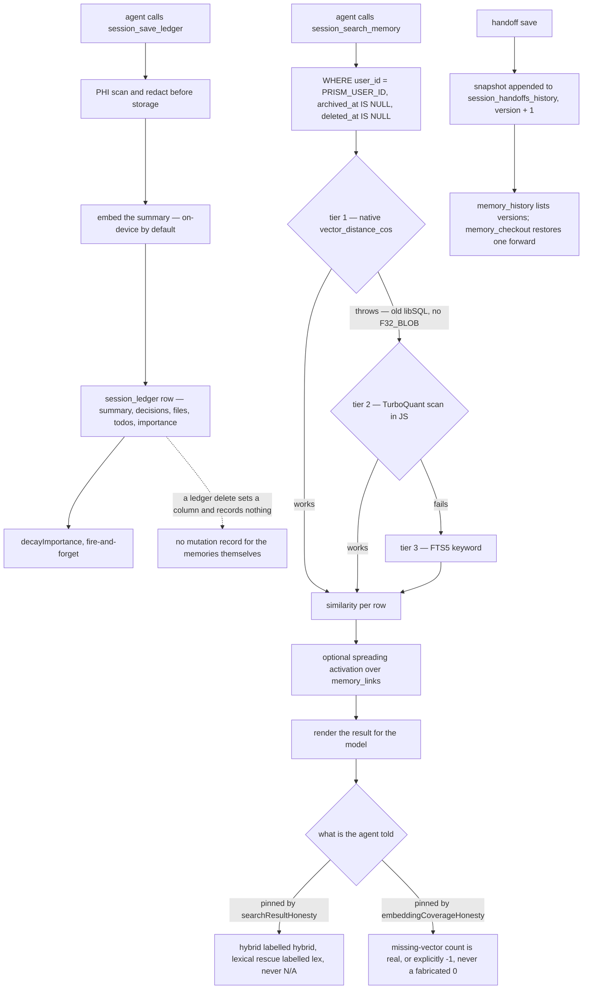

## 1. Executive Summary

Prism is session memory for coding agents: an MCP server with 41 tools over one libSQL file, published as `prism-mcp-server` at version 20.18.0, Apache-2.0, about 72,800 lines of TypeScript against 64,200 lines of tests in 195 test files. It restores what the last session decided, what it changed and what is still open, with a local-first posture — on-device embeddings, nothing leaving the machine by default — and a Supabase path behind the same storage interface for hosted use.

**The reason to read it is a test family, not a mechanism.** Nine files named `*Honesty` or `*Contract` assert something this atlas usually has to check by hand: that the sentence the system shows the model about its own retrieval is true. `searchResultHonesty.test.ts` pins that a result set containing lexical ranks is labelled "hybrid retrieval" rather than "semantically similar", and that a lexical-only rescue renders as `exact-term match (lex#3)` rather than `N/A similar`. Its docstring names the class in five words — *"correct data, misleading presentation"*.

**One of those tests documents a real outage, and it is the sharpest finding here.** `getHealthStats` hardcoded `missingEmbeddings: 0` on both its success *and* its failure paths, so `session_health_check` reported "HEALTHY — all clean" through an incident in which, in the test's own words, *"100% of 8,560 rows lacked a vector and semantic search returned nothing for every query."* The repair is the interesting part: the metric now returns a real count when the portal reports one and an explicit `-1` for unknown when it cannot be reached — *"never a fabricated zero"*. A health metric that could not fail is the exact shape this atlas looks for in evaluation code; finding it in a *production* self-report, with the incident written into the regression test, is rarer.

**The scope boundary is the strong kind.** `searchMemory` opens its WHERE with four conditions before any caller option is considered, and `l.user_id = ?` is among them unconditionally. The bound value is `PRISM_USER_ID`, a module constant read once from the environment — not a tool argument — so a model calling `session_search_memory` cannot name a tenant it should not see. 53 `user_id` predicates and 29 `archived_at IS NULL` filters apply the same pair across the storage layer.

**What is missing is the other half of correction.** Live handoff state is versioned properly: every save appends a full snapshot, and `memory_history`/`memory_checkout` give the agent a git-like revert that moves the version forward rather than rewinding it. The ledger entries — the memories — have none of that. A soft delete sets a column and records nothing, no table holds ledger mutations, and the one table named `memory_access_log` records *retrievals*, which is the half that cannot say what changed.

## 2. Mental Model

A memory is **a session's residue with a vector attached**. The unit is not a fact or an utterance but a whole working session compressed into one row: a summary, the decisions taken, the files touched, the todos left open, keywords, and an embedding of the summary. That choice drives everything downstream — recall returns sessions, consolidation rolls sessions into rollups, and the thing an agent gets back at boot is "here is where you were", not "here is a fact you established".

**Belief is not modelled; availability is.** There is no status field. What a row has instead is `importance` (a number that decays), `archived_at` and `deleted_at` (two ways to stop being returned), and `is_rollup` (a marker that this row stands for several). Nothing says a memory is on record and not to be trusted.

**The distinctive epistemic move is one level up, about the system rather than the memory.** Retrieval can happen three different ways, and which way it happened changes how much the result is worth. Prism's answer is to carry the tier into the rendering and then test the rendering: the model is told `sem#6 + lex#1` for a fused hit, `exact-term match (lex#3)` for a lexical rescue, and an explicit unknown when the health of the vector index cannot be determined. The system's claims about itself are treated as something that can be wrong, and pinned.



## 3. Architecture

One process, one file, no services required. The default is a local libSQL database under the user's home with on-device embeddings; `SupabaseStorage` implements the same `interface.ts` for a hosted multi-tenant deployment, and the interface is where the contract lives — 1,029 lines of it, heavily commented.

The server speaks MCP over stdio and is distributed several ways at once: npm as `prism-mcp-server`, an MCP registry entry in `server.json`, a Claude Code plugin through `.claude-plugin/marketplace.json`, a Smithery manifest, a Docker image, and Python and Vercel AI SDK adapters. A local dashboard with optional authentication serves health, analytics, projects, settings, and bulk maintenance actions.

Fifteen tables carry more than the memory path: an agent registry with heartbeats for multi-agent "hivemind" use, `memory_links` for spreading activation, `semantic_knowledge` and an HDC dictionary, `dark_factory_pipelines`, and `verification_harnesses`/`verification_runs`. This report is about the ledger, the handoffs and their retrieval.

## 4. Essential Implementation Paths

**Save** — `session_save_ledger` → PHI scan and redaction (`src/utils/phiGuard.ts`) → embedding of the summary → insert into `session_ledger` → fire-and-forget `decayImportance(project, PRISM_USER_ID, 30)`.

**Recall** — `searchMemory` (`src/storage/sqlite.ts:1742`): compose the scoped WHERE, try native vector search, fall back to a TurboQuant scan in JS, fall back again to FTS5, filter by the similarity threshold, optionally expand through spreading activation, and return rows carrying `similarity`, `session_date`, `importance` and `last_accessed_at`.

**Boot** — `session_bootstrap` / `session_load_context` assemble the handoff plus recent ledger entries for the project and role into the block a new session starts from.

**Correct** — `session_save_handoff` takes an expected version, reads the current one, and refuses the write when they disagree; on success it appends the prior state to `session_handoffs_history`. `memory_history` lists those versions; `memory_checkout` restores one as a new version.

**Consolidate** — `session_compact_ledger` folds old entries into an `is_rollup` row with a `rollup_count`; `session_backfill_embeddings` repairs rows the write path left without a vector, which is the operation the health check exists to make visible.

## 5. Memory Data Model

`session_ledger` is the memory. Its two-copy embedding design is worth noting: `embedding F32_BLOB(768)` for native vector search beside `embedding_compressed` with an `embedding_format` tag, so the tier-2 fallback has something to scan when the native path is unavailable. `importance` and `last_accessed_at` feed decay; `is_rollup`/`rollup_count` mark consolidated rows.

Two timestamps exist and one axis is queried. `session_date` is when the work happened and `created_at` is when the row was written, which is a real distinction — but every read coalesces them (`session_date: r.session_date || r.created_at` at `:1492` and `:1543`, and the same expression in the search projection), so there is no way to ask what the store held as of a past date. That is why the bi-temporal mark is withheld: both fields are stored, one axis is reachable.

`session_handoffs` is the live state, unique per `(project, user_id)`, carrying `version` for optimistic concurrency. `session_handoffs_history` holds one full `snapshot` per version. `memory_access_log` holds `(entry_id, accessed_at, context_hash)` — a retrieval record, not a mutation record.

## 6. Retrieval Mechanics

The three tiers are the design, and the source documents them in a reviewer note rather than leaving them to be discovered: native `vector_distance_cos()` over the DiskANN-indexed column; a JavaScript asymmetric scan over compressed vectors when the native path throws, with the reason given — `@libsql/client` has no user-defined functions, and the TurboQuant math needs `Float64Array` operations that cannot be expressed in SQL; and FTS5 keyword search when both fail.

A fallback chain like this is where a memory system usually starts lying to its caller: the query still returns rows, so nothing errors, and the model has no way to know it just got keyword matches labelled as semantic ones. The honesty tests exist precisely on that seam, and they are the reason the tier machinery is trustworthy rather than merely clever.

Scoping is applied before any of it. `user_id` is unconditional and comes from the environment; `project` and `role` narrow when supplied. Spreading activation expands a result set over `memory_links` and takes the same `userId`.

## 7. Write Mechanics

Writes are synchronous MCP calls on the agent's turn. The PHI guard runs before storage and is tested in both directions — SSN and date-of-birth patterns are redacted, and `does not flag non-SSN numbers` is the control that stops the matcher becoming indiscriminate. Redaction at the write path means the raw value never lands, which is the right place for it and also means the guard's false negatives are permanent.

Decay is not a background pass; `decayImportance` is kicked off after a save and not awaited. Consolidation is an explicit tool call. Nothing rewrites the whole store on a timer.

The handoff write is the careful one: an expected version in, a current version read, a refusal on disagreement, a snapshot appended on success. That is a correction path a second agent cannot silently clobber — and it is the only part of the store with one.

## 8. Agent Integration

41 tool definitions, of which the memory-shaped ones are `session_save_ledger`, `session_save_handoff`, `session_load_context`, `session_bootstrap`, `session_search_memory`, `knowledge_search`, `knowledge_forget`, `session_compact_ledger`, `memory_history` and `memory_checkout`. The descriptions are written for a model rather than a developer — `memory_checkout` says *"Time travel! … like a Git revert — the version number moves forward (no data is lost). Call memory_history first"* — and the ordering advice is doing real work, since a checkout without a prior history call is a guess at a version number.

A drift timer on the session context tracks how long since the last `session_detect_drift` or save, and nudges. The nudge is a reminder to the agent, not an action.

## 9. Reliability, Safety, and Trust

**The self-report discipline is the strength**, and it is unusual enough to be worth listing as a family: `searchResultHonesty`, `embeddingCoverageHonesty`, `inferFailureContract`, `inferenceMetricsContract`, `layer1DeterministicContract`, `routeContract`, `behavioralVerifierContract`, `codingQualityPolicyContract`, `server-startup-contract`. Their common subject is the accuracy of what the system tells its caller about itself.

**Export is confined.** `sessionExportMemoryConfinement.test.ts` asserts that an `output_dir` outside every allowed root is rejected, including when the directory already exists — a path-traversal guard on the one tool that writes memory out of the store and onto arbitrary disk.

**The mutation gap is the weakness.** A ledger soft-delete writes a column and nothing else; `knowledge_forget` prunes; neither leaves a record. So "why is this memory gone, and who removed it" is unanswerable for the memories, while the same question about live handoff state has a complete answer. The one table named for logging holds retrievals, and by the rubric's own reasoning a record of what was read cannot be false in the way a record of what changed can.

**The install surface is broad.** Five auto-run surfaces at the pin — a Claude Code plugin manifest, a harness settings file, an empty `.gitmodules`, an MCP server manifest and a Smithery manifest — plus an npm `postinstall`, a Python `setup.py`, and 33 floating ranges above a present lockfile. One of those is stale rather than dangerous: `.claude/settings.json` configures a `PostToolUse` hook running `bash scripts/hooks/post-commit-repomix.sh`, and `scripts/hooks/` does not exist in the tree, so the hook is inert.

**Version 20.18.0 in seven months, from one non-bot contributor and two bots.** The changelog runs to 3,269 lines. Release velocity at that rate over a store holding a developer's decisions and file history is a maintenance risk worth weighing against the test count, which is genuinely high.

## 10. Tests, Evals, and Benchmarks

**I did not run this suite.** Four dependency surfaces changed the day before the pin, inside the seven-day cooldown this atlas applies before installing anything, and the tree carries a `postinstall` and a Python `setup.py`. Everything below is read from the committed code.

195 test files, 64,200 lines — close to one-to-one with the implementation — running under vitest against a real libSQL file in a temp directory, with no mock storage layer between the assertion and the schema and no skip path that would let a run pass having asserted nothing.

The negative assertions worth separating by strength:

- **The predicate case.** `tests/load/hivemind.test.ts:405-418` drives ten workflows into one store and asserts each project returns exactly one entry with exactly its own summary. A leaking project filter fails it.
- **The eligibility case.** `tests/deep-storage.test.ts` seeds seven rows and excludes four for four distinct stated reasons — no compressed blob, too recent, soft-deleted, different project — asserting three eligible.
- **The fixture case, which is weaker than it looks.** `tests/storage/isolation.test.ts` queries a neighbour's project and asserts zero rows, but the neighbour lives in a *different database file*, so the assertion pins the test harness rather than the read path.

**No benchmark, no paper, and no claim to either.** `evidence/` holds a single text file, `delegation-rate-mixed-session.txt`; there is no LoCoMo or LongMemEval harness in the tree and no accuracy figure in the README. For a memory system in 2026 that restraint is worth naming rather than filing as a gap.

## 11. Patterns Worth Stealing

### Steal

**Test the sentence, not just the mechanism.** A fallback chain that still returns rows will mislabel its own results without anything failing. Asserting that a hybrid result set is called hybrid, and that a lexical rescue never renders as `N/A similar`, costs five small cases and closes a gap no retrieval test can see.

**Return an explicit unknown instead of a plausible zero.** `missingEmbeddings: -1` for "could not determine" is worth more than any monitoring dashboard built on a number that is hardcoded on the failure path. The incident that produced this rule is in the test's docstring, which is where such things belong.

**Bind the tenant from the environment, not from the tool schema.** A scope key a model can pass is a scope key a model can get wrong. `PRISM_USER_ID` is read once at startup and threaded through every handler as a constant.

**Keep two embedding encodings so the fallback has something to scan.** A compressed copy beside the native vector is what makes tier 2 possible at all, and the reason the native path cannot be assumed is written down: the client has no UDFs.

**Version the live state and let the agent revert forward.** Snapshot per version, expected-version writes, history before checkout, and a restore that increments rather than rewinds — described to the model in its own tool text.

### Avoid

**Do not log retrievals and call it an audit.** `memory_access_log` is useful for decay and analytics and answers none of the questions a mutation record answers. Naming it `..._log` while the mutations go unrecorded makes the gap harder to see.

**Do not give live state a correction story and leave the memories without one.** The handoff can be inspected, diffed and restored; a deleted ledger entry leaves no trace of who removed it or why.

**Do not coalesce two timestamps at every read.** `session_date || created_at` throws away the distinction the schema paid for.

### Fit

Take Prism if you want **session continuity for a coding agent on one machine**: the boot-time restore is the product, the local-first default is real, the tool surface is broad, and the honesty discipline means what it tells your agent about its own recall can be believed.

Do not take it where **memory must be defensible after the fact**. There is no epistemic state, no mutation record for the memories, and no way to answer why an entry is gone. And weigh the operational shape honestly: a 41-tool MCP server at version 20.18.0 from a solo maintainer, installed through a `postinstall` over 33 floating ranges, is a large surface to point at a developer's project history.

## 12. Antipatterns / Risks

**A `..._log` table that records the half that cannot be wrong.**

**Soft deletes that write nothing.** Two columns stop a row being returned and no record says a removal happened.

**A tombstone in name only.** `interface.ts` calls `deleted_at` a tombstone; it is keyed on the record, so the same content saved again is a new live entry — the case the rubric's definition exists to exclude.

**The PHI guard is regex-shaped and terminal.** Redaction happens before storage, so a pattern it misses is stored in the clear permanently, and a pattern it over-matches destroys content with no record of what was removed.

**A configured harness hook pointing at a missing script.** Inert today, and a sign the settings file is not maintained with the tree.

## 13. Build-vs-Borrow Takeaways

**Borrow the honesty tests.** They carry across to any stack and depend on nothing else in this design: for any retrieval with more than one arm or more than one tier, pin what the caller is told.

**Borrow the health-metric rule** — a real number, or an explicit unknown, never a default that reads as healthy.

**Borrow the handoff versioning** if you have a mutable live-state row that two agents might write.

**Build the mutation record yourself** before relying on this in a setting where a deletion has to be explainable. One append-only table with an operation, an entry id, an actor and a reason would close it, and the schema already has the shape in `session_handoffs_history`.

## 14. Open Questions

- Why does the ledger have no mutation record when the handoff has a full snapshot chain? The machinery exists one table over.
- Is the drift timer meant to become an action? It tracks time since the last check and nudges; nothing in the tree acts on it.
- `session_date` is written but never queried independently. Whether it is intended as a validity axis or as display metadata is not stated.
- What happens to the honesty family as the tool surface grows? Nine contract tests against 41 tools is good coverage of the seams that existed when each incident happened, and nothing in the tree requires a new tool to declare what it tells the caller.

## 15. Appendix: File Index

**Storage**
- `src/storage/interface.ts` — the contract, including the tombstone and GDPR comments
- `src/storage/sqlite.ts` — fifteen tables (`:136` ledger, `:157` handoffs, `:221` handoff history, `:678` access log), `searchMemory` (`:1742`), the three-tier reviewer note (`:1810`), handoff history insert (`:1971`)
- `src/storage/supabase.ts` — the hosted implementation of the same interface

**Tools and session**
- `src/tools/sessionMemoryDefinitions.ts` — 41 tool definitions, `memory_history` and `memory_checkout` at `:733`
- `src/tools/ledgerHandlers.ts` — save, load, handoff, health, decay
- `src/tools/graphHandlers.ts` — `isHybridSearchResults`, `searchResultsHeader`, `formatHitScore`
- `src/memory/spreadingActivation.ts`, `src/session/sessionContext.ts`, `src/utils/phiGuard.ts`, `src/utils/healthCheck.ts`

**Tests cited**
- `tests/searchResultHonesty.test.ts`, `tests/embeddingCoverageHonesty.test.ts`
- `tests/load/hivemind.test.ts`, `tests/deep-storage.test.ts`, `tests/storage/isolation.test.ts`
- `tests/phiGuard.test.ts`, `tests/tools/sessionExportMemoryConfinement.test.ts`

**Commands this reading used**
```sh
python3 scripts/screen_repo.py <checkout>
grep -c "user_id = ?" src/storage/sqlite.ts              # 53 scope predicates
grep -c "archived_at IS NULL" src/storage/sqlite.ts      # 29 read-path filters
grep -rn "PRISM_USER_ID" src/config.ts src/tools/ledgerHandlers.ts   # env constant, never a tool arg
grep -n "CREATE TABLE" src/storage/sqlite.ts             # fifteen tables; one log, of retrievals
grep -n "session_date" src/storage/sqlite.ts             # coalesced with created_at on every read
test -e scripts/hooks/post-commit-repomix.sh             # the configured hook's payload is absent
```

## History

**2026-09-12** — [`839b1afe7b26386af5a4ad6d228661f282faa5b9`](https://github.com/dcostenco/prism-coder/commit/839b1afe7b26386af5a4ad6d228661f282faa5b9) — first reading, at the default branch's head, a commit dated 10 September 2026. Screened before reading: five auto-run surfaces, all read first — a Claude Code plugin marketplace manifest, a `.claude/settings.json` whose `PostToolUse` hook invokes a script absent from the tree, an **empty** `.gitmodules`, and MCP and Smithery manifests declaring the published npm package as the start command; three build-time execution paths (an npm `postinstall`, a `prepublishOnly` chain, a Python `adapters/python/setup.py`); four dependency surfaces changed the day before the pin, inside the seven-day cooldown; three unpinned surfaces including 33 floating ranges above a present lockfile; one uninstalled git-hook payload under `scripts/knowledge-ingest/`; and `GEMINI.md` read as data. Nothing was installed, built or run, and no test in this repository was executed. Licence is Apache-2.0 per `LICENSE` and `package.json`.
