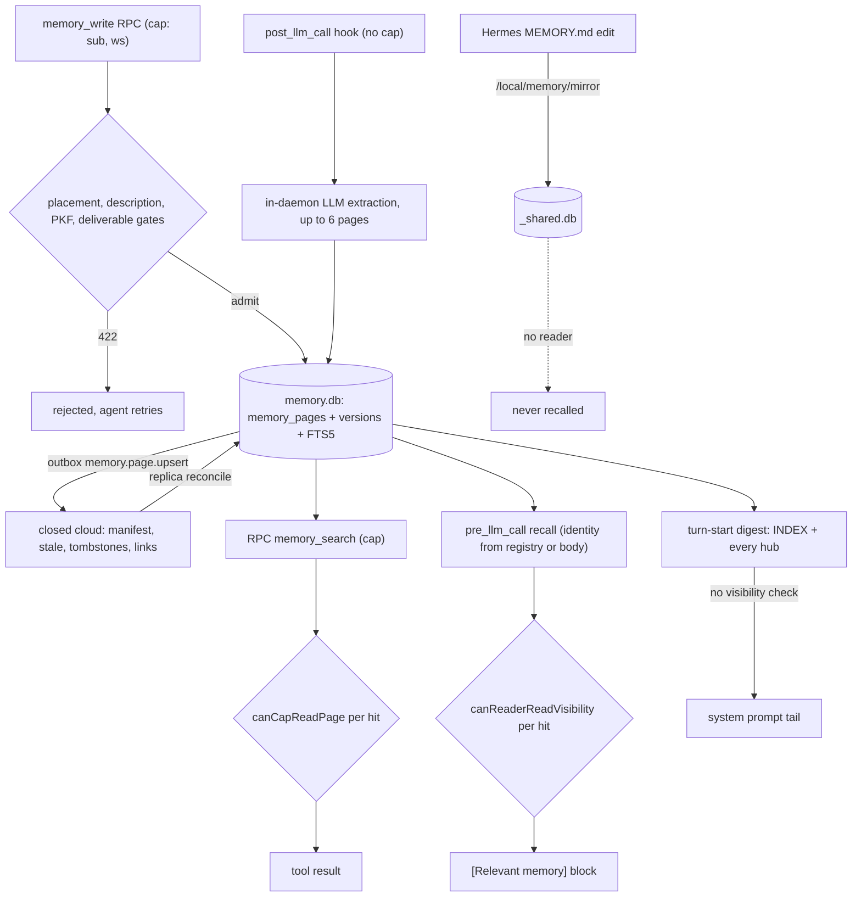

## 1. Executive Summary

Prismer Cloud is a hosted agent platform — evolution, messaging, tasks and
memory — and this repository holds only its SDKs and plugins. The server is
closed-source and absent from the tree, and `sdk/` is rsync-mirrored from a
closed repository (`CONTRIBUTING.md:15-19`). What is inspectable is the
`@prismer/runtime` daemon under `sdk/prismer`. It keeps a per-workspace SQLite
replica of the platform's memory wiki, answers every agent recall from that
replica with FTS5 and a link-graph band, runs post-turn LLM extraction inside
the agent's own pod, and filters every hit through one visibility matrix.

The notable part is the access boundary. A daemon-minted, HMAC-signed
capability binds each agent to one workspace; the acting identity on a write is
the capability's subject and never a body field. A single predicate,
`canReaderReadVisibility`, gates search, list, load, browse and automatic
recall, and a committed test proves the recall filter both excludes and admits.

The weak part is that the predicate does not reach two paths. The hook intake
at `/v1/hooks/*` carries no capability and, on the branch the Hermes plugin
uses, takes the agent and workspace from the request body. The turn-start
digest, on by default, writes every hub's path and one-line summary from the
same `memory.db` into every agent's system prompt with no visibility check.
That digest is why the report carries one mark, `negative_eval`, and withholds
`scope_enforced`.

Three more findings shape the rest of this report.

- **Correction lives in code this report cannot read.** Supersede, merge,
  rewire, delete, health scans and consolidation all forward to cloud
  endpoints (`rpc.ts:2330-2532`). Locally, supersession is a −0.8 ranking
  term and `stale` is a flag only the cloud down-sync sets.
- **A write path lands in a database no read path opens.** `POST
  /local/memory/mirror`, which the Hermes plugin calls on every built-in
  `MEMORY.md` edit, writes to `_shared.db`; recall reads `memory.db` and the
  per-agent bucket.
- **The README's memory claims describe the server.** "4-type
  classification, LLM recall, Dream consolidation" have no counterpart in the
  daemon, whose recall is lexical and graph only and whose Dream timer is set
  to `null` (`runner-wiring.ts:152-159`).

## 2. Mental Model

A memory is a page: an HTML document in Prismer's PKF format, addressed by a
workspace path and a `prismer://workspace/` URI, typed `hub`, `leaf`,
`decision`, `glossary` or `archive`, and hung under an `INDEX` → hub → leaf tree
by `child-of` links. The wiki is the belief store, and a page is treated as
true once it exists; nothing on the row says otherwise.

A page enters by one of three doors:

1. **An agent writes it** with `memory_write`. The daemon admits it only if it
   is placed in the tree, carries a frontmatter description when new, and
   validates as PKF (`rpc.ts:1396-1563`).
2. **The daemon extracts it** after a turn. A heuristic filter drops short and
   greeting turns, then an LLM call through the platform gateway returns up to
   six pages with a placement of `extend`, `attach`, `hub` or `new`
   (`extract.ts:1-30, 82`).
3. **The cloud sends it** in a replica reconcile, with a version, a visibility,
   an exact actor set and a `stale` flag (`cloud-sync.ts:910-940`).

It stops counting in one of four ways. A later write to the same path replaces
it and appends a version. A cloud `stale` flag removes it from local recall. A
cloud supersede or contradicts edge sinks it by 0.8 in ranking without removing
it. A cloud delete, a tombstone in the reconcile, or an invalidation deletes the
row, and its version history goes with it. Only the first happens without the
cloud.

The agent decides what is written; the cloud decides what is corrected; the
daemon decides who sees what. The diagram follows a page from each door to the
three places it can be read, and marks where the visibility check is missing.

## 3. Architecture

The daemon is a Node process (`sdk/prismer/src/daemon/`) that hosts agent
adapters — Hermes, Claude Code, Codex, OpenClaw — and serves one HTTP server on
`127.0.0.1`, or on `0.0.0.0` when `PRISMER_DAEMON_BIND` says so for Kubernetes
pods (`local-server.ts:468-477`). Handlers are chained by prefix: `/v1/hooks/*`
for agent lifecycle hooks, `/local/memory/*` for the memory RPC, and others for
the IM gateway, assets and PKF (`local-server.ts:518-556`).

Memory state is SQLite through `better-sqlite3`. `MemoryRuntime` opens one
`memory.db` per workspace under `~/.prismer/memory/SLUG/` (`runtime.ts:75-82`),
created `0600` in a `0700` directory (`store.ts:14-17`). `ScopedMemoryStore`
adds sibling files under the same root — `_shared.db`, `agents/ID.db`,
`scratch/KEY.db` (`scoped-store.ts:6-16`). The schema is at version 6: pages,
immutable versions, content, links, FTS5 over path, title, description, content
and a CJK bigram column, an outbox with a dead-letter table, replica state, and
a raw-asset chunk mirror with its own FTS5 index (`store.ts:150-341`).

The cloud is the authority and the local file is a replica. The comment on the
V4 migration calls `local.db` "a rebuildable cache" (`store.ts:56-58`). A
reconcile pins an access version and subject hash, pulls a manifest of heads
and content through a snapshot token, and commits them in one transaction that
also deletes rows the manifest no longer covers (`store.ts:1814-1944`). Recall
is refused whenever the replica is not `ready`, the cloud authority snapshot
drifted, or its lease expired (`store.ts:2014-2046`).

Two background loops matter. The outbox worker pushes `memory.page.upsert`,
`memory.link.upsert` and observability events and marks them `acked`
(`outbox-worker.ts:7, 473`). A WebSocket from the cloud invalidates pages and
triggers a re-pull. Extraction and compaction run per turn from the post-turn
worker. The Dream timer exists as code and is wired to `null`, because the cloud
dispatches consolidation to the workspace orchestrator agent instead
(`runner-wiring.ts:152-159`).

### Deployment and ergonomics

Storing anything through the supported path needs a Prismer account and API
key: the README's quick start signs in through a browser and writes
`~/.prismer/config.toml`, and extraction calls the platform's LLM gateway with
that key (`extract.ts:1-9`). The local store survives offline — a write never
blocks on the cloud (`rpc.ts:1371-1394`) — but for a replicated workspace
recall closes once the authority lease expires. The SQLite file is readable and
repairable with ordinary tools, though a reconcile will overwrite or delete
local edits the cloud does not hold. The Claude Code plugin the README
recommends installs `@prismer/claude-code-plugin` from npm, and its source is
not in this tree (`.claude-plugin/marketplace.json`).

## 4. Essential Implementation Paths

- **Explicit write.** `memory_write` in `adapters/memory-tools.ts` and the
  Hermes plugin posts to `POST /local/memory/write`. `attachMemoryRpc` verifies
  the `x-prismer-memory-cap` header (`rpc.ts:185-236`), then `handleWrite`
  pins the actor to `cap.sub` (`rpc.ts:1279-1280`). It authorizes the requested
  visibility (`rpc.ts:1297-1308`) and pulls the cloud head for an unseen path
  (`rpc.ts:1379-1394`). It runs the placement, deliverable, description and PKF
  gates, then writes page and outbox event in one transaction
  (`rpc.ts:1632-1737`).
- **Store write.** `MemoryStore.write` rejects another workspace's id, upserts
  `memory_pages` on `(workspaceId, path)`, appends `memory_page_versions` with
  actor, kind and device, inserts content and replaces the FTS row, all in one
  transaction (`store.ts:842-998`).
- **Automatic extraction.** `handlePostLlmCall` persists a terminal snapshot and
  returns 204 (`hook-server.ts:714-746`). The post-turn worker calls
  `extractFromTurn`, which builds a recall context through
  `assemblePlaceContext` with the reader (`hook-server.ts:900`) and prompts for
  PKF pages. `enforceExtractedPlacement` turns an `extend` of a path the model
  was not shown into a new hub (`extract.ts:785-800`).
  `ExtractedPageApplicator.apply` writes each page idempotently by turn key
  (`extracted-page-applicator.ts:64-120`).
- **Search.** `GET /local/memory/search` → `handleSearch` (`rpc.ts:468-588`) →
  `runWorkspaceSearch`, which calls `MemorySearch.hybridWithNavigation` and
  filters each hit through `canCapReadPage` or `canCapReadAsset`
  (`rpc.ts:711-755`). The SQL is at `search.ts:172-191`; re-scoring at
  `search.ts:293-312`; graph expansion at `search.ts:318-322`.
- **Automatic recall.** `POST /v1/hooks/pre_llm_call` → `resolveContext`
  (`hook-server.ts:1821-1925`) → `handlePreLlmCall`, which runs the workspace
  search, filters it with `filterRecallHits`, adds the agent-private bucket and
  returns five hits in a `[Relevant memory from prior sessions]` block
  (`hook-server.ts:515-646`).
- **Turn-start digest.** The Hermes adapter appends
  `renderMemoryDigestBlock(workspaceId)` to the system prompt
  (`adapters/persistence/hermes/index.ts:1149`), backed by `buildMemoryDigest`
  over the INDEX page and every hub (`digest.ts:163-230`).
- **Correction and deletion.** `POST /local/memory/curate` forwards
  `promote_to_hub`, `supersede`, `rebuild_index`, `section_merge`,
  `section_supersede` and `rewire` to cloud routes with the acting agent in
  `X-Prismer-Memory-Actor` (`rpc.ts:2374-2532`). `POST /local/memory/delete`
  forwards to the cloud page delete and then invalidates the local row
  (`rpc.ts:2330-2372`).
- **Replica.** `cloud-sync.ts` reconciles the manifest into
  `applyReplicaCommit`, and the link down-sync fills `memory_links`
  (`cloud-sync.ts:470-505`).
- **Tests.** `sdk/prismer/test/memory-*.test.ts` and
  `hook-server-recall-acl.test.ts`, run by `vitest run`.

## 5. Memory Data Model

`memory_pages` is the current state: `id`, `workspaceId`, `path` unique per
workspace, `title`, `description`, `contentHash`, `version`, `pageType`,
`visibilityKind`, `visibilityImUserId`, `encrypted`, `stale`, `archivedAt`,
`sourceAssetId`, `sourceRefsJson`, `syncStatus`, timestamps, and since V3
`sourceKind` and `replicaActorIdsJson` (`store.ts:156-176, 289-290`).
`visibilityImUserId` holds the subject for every non-workspace kind — an agent
or member id, a role slug, a council id or a task id (`store.ts:856-868`).

History is `memory_page_versions` plus `memory_page_content`, keyed
`(pageId, version)`, one row per write with `actorImUserId`, `actorKind` and
`deviceId` (`store.ts:179-197`). Both carry `ON DELETE CASCADE` to the page, so
the history exists only while the page does. `syncStatus` moves `local-only` →
`acked`, or to `remote-conflict` when the cloud reports that this device lost a
last-writer-wins race; `GET /local/memory/conflicts` lists those rows and
resolves nothing (`store.ts:1000-1041`).

`memory_links` is URI-keyed with a relation and weight (`store.ts:198-208`).
Its only writer outside the replica commit is the cloud link down-sync
(`cloud-sync.ts:495`), so `supersedes`, `superseded-by` and `contradicts`
edges exist locally only after the cloud has produced them.

Two columns are consumed and never produced in this tree. `archivedAt` is
inserted as `NULL` on both writers (`store.ts:921, 1824`), so the search
predicate `p.archivedAt IS NULL` never excludes anything. `stale` is set from
`head.stale` in the reconcile (`cloud-sync.ts:932, 1007`) and from a caller
flag no agent path passes. The cloud's `validFrom` and `validUntil` columns are
named in a comment as absent from the local schema (`search.ts:286-292`).

## 6. Retrieval Mechanics

Recall is lexical first. `tokenizeFtsTerms` and `buildFtsMatchQuery` turn the
query into an AND expression with CJK bigram alternatives; if that returns
nothing and the query has two or more terms, an OR pass runs
(`search.ts:214-233`). The SQL joins FTS to pages and filters
`workspaceId`, `stale = 0` and `archivedAt IS NULL`, pulling twice `topK`
(`search.ts:172-191`). BM25 is normalised to 0-1, a threshold floor applies,
and three terms re-rank: recency at weight 0.2, the inert stale penalty, and
−0.8 for the older side of a supersede or contradicts edge (`search.ts:85-87,
293-312`).

Graph hits come second and are banded below the weakest text hit: one hop by
default, a hard cap of five, fan-out eight by edge weight (`search.ts:57-64,
318-322`). A raw-asset chunk lane runs on every query against its own FTS
index. When the text leg misses, the answer is a navigation payload of INDEX
and hub entry points with walking instructions, not a ranked list
(`search.ts:246-265`). A token budget caps aggregate snippet bytes at 8 KiB
by default (`search.ts:54`).

Visibility is applied after all of this, per hit (`rpc.ts:727-739`). A
reader who cannot see some of the top hits therefore receives fewer than
`topK`, and a private page's snippet still spends the shared byte budget
before it is dropped. The agent never sees it; the cost is under-recall.

Automatic recall uses the first 240 characters of the user message as the
query, keeps five hits over a 0.2 threshold within 3 KiB, and renders them as
path, title and snippet lines (`hook-server.ts:295-297, 533, 637-644`). The
digest injects the INDEX table of contents and one line per hub, unbounded
below a 32K-token extreme guard, deterministic so it keeps the provider prefix
cache warm (`digest.ts:1-24, 163-205`).

## 7. Write Mechanics

The explicit surface has four admission gates, each a 422 the agent can act
on. `placement_required` refuses a new leaf with no hub, no `child-of` link and
no existing edge, and it is on by default through
`PRISMER_MEMORY_PLACEMENT_ENFORCE=enforce` (`rpc.ts:1183-1188, 1396-1450`).
`checkDeliverableGate` requires a pointer back to a declared source asset and
refuses a body over 64K characters. A provenance token deduplicates a repeat
distillation of the same asset hash (`rpc.ts:1452-1510`).
`description_required` and `pkf_invalid` complete the four
(`write-gate.ts:1-22`).

The automatic path skips the description and PKF gates on purpose, because a
background writer cannot repair a 422 and would lose the memory
(`write-gate.ts:17-22`). It runs the deliverable gate through
`filterGatedExtractedPages` (`extract.ts:1146`). `enforceExtractedPlacement`
confines `extend` to paths in the recall context the model was shown, which
that context's reader filter has already scoped (`hook-server.ts:1556-1600`).

Neither writer compares the visibility of the row it replaces. The upsert
rewrites `visibilityKind` and `visibilityImUserId` on conflict
(`store.ts:922-934`); `handleWrite` authorizes only the visibility the caller
requests (`rpc.ts:1297`). An agent that names an existing path it cannot read,
with the default `workspace` visibility, replaces that page locally and makes
the new body workspace-visible. Whether the cloud accepts the up-sync is decided
in code not in the tree.

Deduplication is by path and by deliverable token; there is no similarity
merge in the daemon. Conflict is last-writer-wins, adjudicated by the cloud.
Model output passes the extraction prompt's rules and the sanitiser. Nothing
screens turn content for injected instructions before extraction.

### Operational cost

An explicit write is synchronous SQLite plus, for a new path, one cloud
round-trip to fetch the head; the outbox flush is asynchronous. The post-turn
hook returns 204 at once, and extraction is one gateway call with a
120-second timeout and one retry (`extract.ts:66-87`), so a new memory is
retrievable on a turn after that call finishes. No background pass rewrites
the whole store locally; the cloud's consolidation is invisible here. Per turn
the digest can reach tens of thousands of tokens by design, placed at the
system-prompt tail to keep the earlier prefix cached, and recall adds up to
3 KiB.

## 8. Agent Integration

The agent holds five memory tools with one schema file generated for every
adapter: `memory_search`, `memory_load`, `memory_browse`, `memory_write` and
`memory_curate` (`plugins/memory/prismer/__init__.py:288-293`). The daemon
mints a capability at agent spawn and injects it as `PRISMER_MEMORY_CAP`; the
tool client carries it on every call, renewing a v2 cap in place
(`cap.ts:1-29`, `rpc.ts:193-211`). Search can reach another workspace only
through a cloud-side memory grant (`rpc.ts:489-502`).

Memory also arrives unasked, twice per turn. The digest sits at the end of the
system prompt, and `pre_llm_call` recall is prepended to the turn. The Hermes
memory provider triggers post-turn extraction from `sync_turn` and mirrors
built-in `MEMORY.md` edits to the daemon (`plugins/memory/prismer/__init__.py:1085-1197`).
[Hermes Agent](../hermes-agent/) is the host runtime this plugin targets.

`memory_curate` puts every correction verb on the agent's surface. The daemon
forwards the acting agent's identity and leaves the decision to the cloud,
which documents an `orchestrator_only` gate — consolidation is an agent role,
not a human one (`rpc.ts:2498-2516`). Porting the daemon's store and search to
another runtime would be straightforward; porting correction would mean
writing the server.

## 9. Reliability, Safety, and Trust

**The capability boundary is carefully built on the RPC.** A per-boot 32-byte
key signs caps with HMAC-SHA256, is held only in memory and never reaches an
agent; an agent cap names exactly one workspace and the wildcard is reserved
for the system subject (`cap.ts:15-29, 330-343`). Body actor fields are ignored
(`rpc.ts:1275-1280`), and `PRISMER_MEMORY_CAP_ENFORCE=false` no longer reopens
a bypass (`rpc.ts:214-236`). `memory-cap-rpc.test.ts` asserts each of these.

**The hook route is outside that boundary.** `/v1/hooks/*` is documented as
"127.0.0.1 trust boundary, no Bearer auth" (`hook-server.ts:3`), and
`hook-server.ts` reads no capability header. When no `profile` is given,
`resolveContext` takes `agent_im_user_id` and `workspace_id` from the body and
returns a context even when no active run matches (`hook-server.ts:1835-1874`).
That is the shape the Hermes plugin sends (`plugins/memory/prismer/__init__.py:1092-1107`).

So any process that can reach the port can ask `pre_llm_call` for another
agent's recall. It receives that agent's `agent` and `private` pages and its
per-agent bucket, and can post a turn that extraction writes under that
agent's name. `cap.ts:3-6` names this exact threat — agent against agent inside
a shared pod, choosing an arbitrary workspace — as the reason the capability
exists. In pod mode the bind is `0.0.0.0` (`local-server.ts:468-477`).

**The digest forgets the predicate its neighbour applies.**
`assemblePlaceContext` filters hubs through `canSee` before they reach browse,
extraction or a 422 hint, and its own comment calls `store.list` raw, "every
visibility" (`hook-server.ts:1561-1590`). `buildMemoryDigest` lists hubs with
`store.list({ pageType: 'hub', limit: 1000 })` and skips only encrypted ones
(`digest.ts:188-203`). Each line is the hub's path and its description, or else
the first non-heading line of its body, up to 160 characters
(`digest.ts:97-107, 206-207`); the INDEX page's table of contents goes in whole
(`digest.ts:179-186`).

The store is the one search reads. The runner's provider calls
`buildMemoryDigest(slot.store)` on the workspace's `memory.db` slot
(`runner-wiring.ts:114-125`), the slot `runWorkspaceSearch` filters
(`rpc.ts:711-739`). The provider takes a workspace id and nothing else
(`digest.ts:118-120`), so no reader reaches it. The Hermes adapter appends the
block to every dispatch (`adapters/persistence/hermes/index.ts:1143-1157`), and
`FF_MEMORY_INDEX_INJECT_ENABLED` unset means on (`index-toc-inject.ts:38-42`).
A role-, council- or agent-scoped hub therefore puts its path and summary into
every agent's system prompt in the workspace.

**Withheld marks.**

- **`scope_enforced` — withheld.** The key is on the row and the predicate is
  applied per hit on RPC search, list and load and on `pre_llm_call` recall
  (`store.ts:156-176`; `rpc.ts:404-407, 727-739`; `hook-server.ts:489-511`).
  The turn-start digest reads the same `memory.db` through an injection path
  whose signature cannot carry a reader (`digest.ts:118-120, 190-207`;
  `runner-wiring.ts:114-118`), and it injects hub content, not names alone.
  That is the near-miss: one unfiltered assembler beside a filtered one. The
  body-supplied identity on `/v1/hooks/*` is a separate limit; the predicate
  runs there, on a reader the caller names.
- **`trust_state` — withheld.** `stale` does withhold a page from recall, but
  it is a boolean the cloud sets, not a status this tree produces, and there is
  no candidate or verified state (`cloud-sync.ts:932`). Supersession is a
  ranking term (`search.ts:87`).
- **`tombstone` — withheld.** The reconcile's `tombstonePageIds` delete pages by
  id (`store.ts:425-426, 1928-1944`); nothing records a rejected value, and an
  extraction that restates it writes a new page.
- **`bitemporal` — withheld.** Validity columns are cloud-only by the code's own
  comment (`search.ts:286-292`).
- **`audit_log` — withheld.** `memory_page_versions` appends per write with
  actor and device, but a delete cascades it away and leaves no row, and the
  outbox is a delivery queue whose rows change status and leave on dead-letter
  (`store.ts:188, 1066`; `outbox-worker.ts:388, 473`). The cloud is described
  as "authoritative + auditable" (`acl-predicate.ts:10-11`) in code not present.
- **`human_review` — withheld.** The agent holds `memory_curate`, the conflict
  route only lists, and the admission gates are checks the writing agent
  retries against; no memory waits for a person.

Privacy follows the same split. At-rest encryption marks cloud-bound payloads
behind `FF_MEMORY_ENCRYPTION_ENABLED` and keeps the local row plaintext
(`store.ts:894-914`). Every `memory_search` enqueues a `recall_pull` event
carrying the query text to the cloud (`rpc.ts:2572-2600`), while the read trace
beside it records counts only.

## 10. Tests, Evals, and Benchmarks

The daemon's memory module has 78 test files in 19,982 lines under
`sdk/prismer/test/`. They cover the store, the V3 replica migration and
reconcile, the capability, each write gate, search payloads, graph and CJK
recall, extraction parsing and salvage, and the outbox. I read them; I ran
nothing.

`hook-server-recall-acl.test.ts` earns `negative_eval`. Three pages share one
token so ranking cannot explain an absence. The roleA agent's injected recall
omits the role and council pages while containing the shared one, and two more
cases show each scoped page recalled by its member (`lines 101-221`). What it
does not cover is the body-identity branch of `resolveContext`: every case
registers a run and posts a `profile`. No test posts a hub with a non-workspace
visibility and reads the digest; the one digest test file checks receipts and
byte stability (`memory-digest-verified.test.ts`). `digest.ts:25-28` names a
`memory-digest.test.ts` as the negative control for determinism, and no file of
that name is in the tree.

No public workflow runs this suite. `ci.yml` builds `server/` and `sdk-test.yml`
targets `sdk/prismer-cloud/*`; neither directory exists at this commit, and the
closed repository runs the tests (`CLAUDE.md:22-23`). No retrieval benchmark,
LoCoMo or LongMemEval harness is committed, and no paper describes the memory
system; the two arXiv links in `docs/HYPERGRAPH-THEORY.md` are third-party
background for the evolution engine.

Before trusting it I would want four cases: a `pre_llm_call` with a forged
`agent_im_user_id` refused; a role-scoped hub absent from another agent's
digest; a write to another agent's private path refused or kept private; and a
mirror write read back by some recall path.

## 11. For Your Own Build

### Steal

- **Take the acting identity from a token the runtime minted, not from the
  request.** A per-boot key, one workspace per agent cap, and a handler that
  overwrites any body actor field make impersonation a forgery problem rather
  than a typo.
- **One visibility function, called from every filtered read surface.**
  Search, list, load, browse, recall and the 422 hint share
  `canReaderReadVisibility`, which keeps the matrix from drifting — and the
  digest shows the cost of one assembler that does not call it. See [scope as a first-class
  key](../../patterns/scope-as-a-first-class-key/).
- **Close recall when the authority behind the replica goes stale.** A lease
  and a pinned subject hash turn "offline for a day" into "no recall" instead
  of recall under an access list the server has since changed.
- **Answer a lexical miss with a map.** Returning INDEX and hub entry points
  instead of low-confidence hits tells the agent where to look without
  pretending to have found it.

### Avoid

- **A second door with its own identity rule.** A capability on the RPC and a
  body field on the hook route is one boundary with a hole; every route that
  reads or writes memory needs the same credential.
- **A context builder outside the predicate.** The digest is the one assembler
  that skips `canSee`; when a filter exists as a shared function, grep for every
  `store.list` feeding a prompt.
- **An upsert that authorizes the new row and not the old one.** Replacing a
  page by path should check who may write the page that is already there.
- **A write-only bucket.** Mirroring into a store no read path opens produces
  the appearance of capture and no recall.

### Fit

For a reader choosing a memory layer, this is not one: the store that decides
what is true, the correction verbs and the full ACL are a hosted service whose
code is not published. What transfers is the daemon's local half — a
capability-gated, visibility-filtered SQLite replica with deterministic
digest injection — and it suits a team already running agents on Prismer,
who want to know what the local process does with their memory. Anyone needing
correctable memory they can inspect end to end should read this for its
boundary design and take the correction path from a system that publishes one.

## 12. Open Questions

- Does the cloud re-authorize an up-synced page that replaced another agent's
  private row, or accept it because the envelope is well-formed? The server is
  not in the tree.
- What sets `stale` cloud-side, and does anything ever un-stale a page?
- Does the orchestrator gate on `memory_curate` hold when the orchestrator is
  itself an extraction-driven agent? The gate is documented at
  `rpc.ts:2498-2516` and implemented in the closed server.
- Is `/v1/hooks/*` reachable from other pods when `PRISMER_DAEMON_BIND=0.0.0.0`,
  or does pod networking confine it? The entrypoint script is not in the tree.
- Does the closed repository hold `memory-digest.test.ts`, and does its CI run
  the suite this repository mirrors?

## Appendix: File Index

All paths are under `sdk/prismer/` unless stated.

- **Storage and schema:** `src/daemon/memory/store.ts`, `types.ts`,
  `runtime.ts`, `scoped-store.ts`, `crypto.ts`.
- **Write path:** `src/daemon/memory/rpc.ts` (`handleWrite`,
  `handleSectionWrite`, `handleMirror`), `write-gate.ts`,
  `deliverable-gate.ts`, `outbox.ts`, `outbox-worker.ts`.
- **Extraction and compaction:** `src/daemon/memory/extract.ts`,
  `extracted-page-applicator.ts`, `compaction.ts`, `hook-server.ts`
  (`handlePostLlmCall`, `writeExtractedPage`).
- **Retrieval:** `src/daemon/memory/search.ts`, `rpc.ts`
  (`handleSearch`, `runWorkspaceSearch`, `handleLoad`), `section.ts`.
- **Access control:** `src/daemon/memory/acl-predicate.ts`, `cap.ts`,
  `hook-server.ts` (`resolveContext`, `filterRecallHits`,
  `assemblePlaceContext`), `src/daemon/local-server.ts`.
- **Context assembly:** `src/daemon/memory/digest.ts`, `index-toc.ts`,
  `index-toc-inject.ts`, `src/adapters/persistence/hermes/index.ts:1149`.
- **Replica and correction:** `src/daemon/memory/cloud-sync.ts`,
  `ws-invalidate.ts`, `rpc.ts` (`handleCurate`, `handleDelete`,
  `handleConflicts`), `runner-wiring.ts`, `dream/`.
- **Agent integration:** `src/adapters/memory-tools.ts`,
  `plugins/memory/prismer/__init__.py`,
  `plugins/tools/prismer-recall/__init__.py`; repository root
  `.claude-plugin/marketplace.json`.
- **Tests:** `test/hook-server-recall-acl.test.ts`,
  `test/memory-cap-rpc.test.ts`, `test/memory-visibility-scope.test.ts`,
  `test/memory-digest-verified.test.ts`, `test/memory-store.test.ts`,
  `vitest.config.ts`; repository root `.github/workflows/`.

### Recorded searches

Run at the repository root of the pinned checkout unless a directory is named.

- `grep -rliE 'arxiv|bibtex|@article|@misc|doi\.org' . --exclude-dir=.git` — `docs/HYPERGRAPH-THEORY.md` and its translations (two third-party arXiv links), SDK example URLs, one test fixture; no `CITATION.cff`.
- `grep -rliE 'locomo|longmemeval' . --exclude-dir=.git` — no match.
- `grep -nE 'x-prismer-memory-cap|verifyCap|readHeader|authorization' sdk/prismer/src/daemon/memory/hook-server.ts` — no match; `rpc.ts:226` reads the header for the RPC.
- `grep -nE 'visib|canReader|canSee' sdk/prismer/src/daemon/memory/digest.ts` — no match.
- `grep -rn "\.list({" sdk/prismer/src/daemon/memory | grep -v test` — five callers: `rpc.ts:404` (filtered at 407), `hook-server.ts:1590` and `hook-server.ts:1632` (both filtered by `canSee`), `search.ts:595` (navigation seeds, filtered at `rpc.ts:746-753`), and `digest.ts:191`, unfiltered.
- `grep -rnE 'searchForAgent|\.shared\(\)|_shared\.db' sdk/prismer/src sdk/prismer/plugins | grep -v scoped-store.ts` — one comment at `hook-server.ts:1960`; no reader of `_shared.db` outside `scoped-store.ts`.
- `grep -rn 'upsertLink(' sdk/prismer/src | grep -v 'store.ts:'` — `cloud-sync.ts:495` only.
- `grep -rn 'archivedAt' sdk/prismer/src --include='*.ts'` — both inserts write `NULL` (`store.ts:921`, `store.ts:1824`); the rest are reads.
- `grep -rnE 'stale:\s*(true|[a-zA-Z!])' sdk/prismer/src --include='*.ts' | grep -v test` — `cloud-sync.ts:932`, `cloud-sync.ts:1007` from the cloud head; `scoped-store.ts:418` passes a caller value through.
- `grep -rnE 'DELETE FROM memory_page_versions|UPDATE memory_page_versions' sdk/prismer/src` — no match; versions leave only by `ON DELETE CASCADE` (`store.ts:188`).
- `grep -rn 'new DreamScheduler' sdk/prismer/src` — no match; `runner-wiring.ts:159` assigns `null`.
- `grep -rnoiE 'tombstone' sdk/prismer/src/daemon/memory` — replica page-id deletions only (`store.ts`, `cloud-sync.ts`).
- `git ls-files | grep -iE 'claude-code-plugin|opencode-plugin'` — no match; the marketplace entry sources the plugin from npm.
- `ls sdk/prismer-cloud server` — neither exists; `.github/workflows/ci.yml:25` and `sdk-test.yml:26-70` name them as working directories.
- `git ls-files | grep -i digest` — `digest.ts` and `test/memory-digest-verified.test.ts`; no `memory-digest.test.ts`.
- `grep -rniE 'renamed|formerly' README.md CHANGELOG.md` — no match.

## History

**2026-10-01** — [`5337ca14c0e03e99446aff43bcbf1a2ad18f7205`](https://github.com/Prismer-AI/PrismerCloud/commit/5337ca14c0e03e99446aff43bcbf1a2ad18f7205) — audited at the same commit; `scope_enforced` withdrawn. The turn-start digest, on by default, injects every hub's path and its description or first body line, plus the whole INDEX table of contents, from the same `memory.db` that search filters, through a provider that takes only a workspace id (`digest.ts:97-107, 118-120, 190-207`; `runner-wiring.ts:114-118`). An injection path over the scoped store that cannot carry the predicate withholds the mark. One mark remains, `negative_eval`.

**2026-09-30** — [`5337ca14c0e03e99446aff43bcbf1a2ad18f7205`](https://github.com/Prismer-AI/PrismerCloud/commit/5337ca14c0e03e99446aff43bcbf1a2ad18f7205) — first reading, at the head of `main`, a commit dated 29 September 2026. Two marks, `scope_enforced` and `negative_eval`; section 9 names each withheld mark. Only the daemon under `sdk/prismer` is covered; the server is closed-source and absent. Screened before reading: one auto-run surface (`.claude-plugin/marketplace.json`, which installs a plugin from npm and is inert unless added as a marketplace), four build-time execution points, eleven unpinned surfaces, fifteen dependency files inside the cooldown — every file in a depth-1 clone dates to the tip — and `CLAUDE.md` recorded as data. Read with `grep` and `sed`; nothing installed, built or run.
