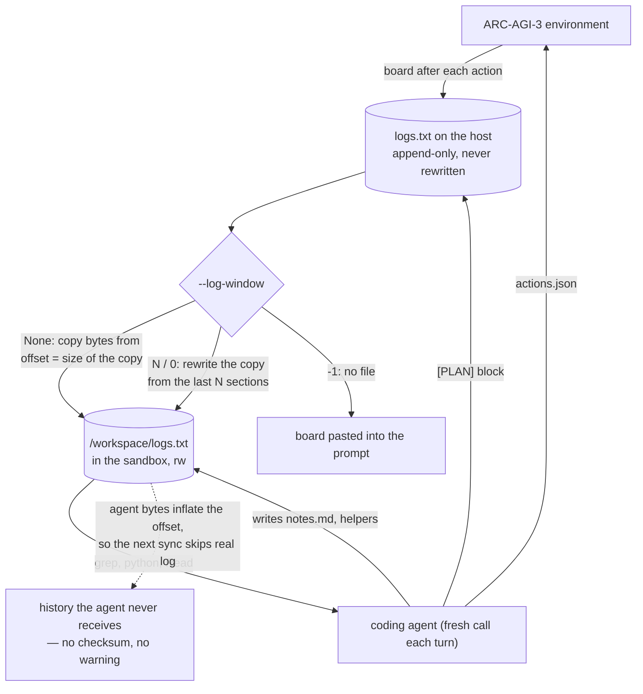

## 1. Executive Summary

PRO-LONG is a harness for ARC-AGI-3, the benchmark built to measure learning on
first contact, and its memory is one file. `logs.txt` accumulates an action
header, the tool call, the resulting 64x64 board and the agent's own written
analysis, for every action of a game. There is no database, no index, no
embedding and no retrieval function. The agent is a coding agent, so retrieval is
`grep`.

The repository is 4,355 lines of Python under `prolong_agent/`, MIT-classified,
with an accompanying paper: *PRO-LONG: Programmatic Memory Enables Long-Horizon
Reasoning* ([arXiv:2607.20064](https://arxiv.org/abs/2607.20064), Alexis Fox,
Junlin Wang, Paul Rosu and Bhuwan Dhingra, submitted 22 July 2026). The paper's
framing is a memory argument stated as a tradeoff: *"preserving more information
makes retrieving relevant details less tractable"*, and its answer is to keep
everything and make the agent pay the search cost programmatically.

**What earns the report is the evidence posture, not the store.** Four scorecards
are committed under `scorecards/`, and two of them are the same model at the same
effort with one variable changed. `prolong_r3_online` runs with the full log and
scores a 50.2% mean over 25 games; `inprompt_r3_online` runs with `--log-window
-1` — board injected into the prompt, no log file in the workspace at all — and
scores 24.7%. Every game in the log arm carries a replay URL on `arcprize.org`,
so the numbers are checkable by somebody who did not run them.

**Then they cut their own headline.** The log arm ran to 1,000 actions and the
no-log arm to 500, which makes the raw comparison unfair in the authors' favour.
`prolong_r3_online_scorecards_at500.txt` re-scores the log run at the 500-action
cutoff and publishes the result: **45.6%**, against 24.7%. The advantage is real
and it is 4.6 points smaller than the file next to it says. Committing the
budget-matched rerun of your own flagship number, when nobody would have noticed
its absence, is the [benchmark discipline this atlas asks for](../../benchmarks/)
and finds in very few repositories.

**The defect is in the sync, not the design.** In the default full-history mode
the harness copies only the new tail of the master log into the agent's sandbox,
and it computes where the tail starts from `dest.stat().st_size` — the size of
the copy sitting in a writable workspace the system prompt invites the agent to
save notes into. Every byte the agent adds to that file is a byte of real log the
harness then skips. I re-derived the routine in isolation: 32 agent-written bytes
cost two of four board states, silently and permanently, with nothing anywhere
reporting a gap. **It has not fired in anything published here** — in all 25
committed Fable 5 runs the agent's copy is an exact byte prefix of the host
master, so no agent ever wrote to its own log. The defect is latent, and what
keeps it latent is a convention no code states.

The research harness under `research/` carries no test of any kind. The
installer beside it, described in section 3, has one — so the half that ships to
other people's machines is tested and the half the paper's numbers come from is
not. MIT, by a `LICENSE` file at the root as well as the trove classifier in
`pyproject.toml`.

## 2. Mental Model

A memory is an **action section**: everything between two eighty-column rules of
equals signs. The harness writes it, the agent reads it back, and nothing else in the
system has an opinion about what a memory is.

The lifecycle has no states. A section is appended and then it is permanent on
the host. What changes is not the memory but **how much of it the agent is
allowed to see**, which is set by a flag at launch and never by the agent:

```text
--log-window  None   the whole log            (default; incremental tail sync)
--log-window  N>0    the last N sections      (header always kept)
--log-window  0      the newest section only, animation frames stripped
--log-window  -1     no log file at all; the board goes in the prompt
--baseline           no log; only current_board.txt, overwritten each call
--workspace stateless  wipe every workspace file except logs.txt and AGENTS.md,
                       and divert the agent's own [PLAN] to a separate file
```

That list is the system's real contribution. Forgetting here is a harness
parameter with an ablation arm attached, rather than a decay curve nobody
measured.

The second memory is the one the agent writes. `/workspace/` persists across
calls and the prompt says so — *"Feel free to save notes, state, or helper
functions"* — and the committed run under `release_logs/` shows what the agent
does with it. Its `notes.md` keeps an epistemic distinction the schema does not:

```text
- Purpose unknown: goals? move counter?
## Hypothesis
Ship floats to ceiling of water region. …
## Confirmed mechanics (after Actions 1-2)
- ACTION4 moves ship RIGHT by exactly 6 columns …
```

Hypothesis, then confirmed, with the evidence that promoted it. That is a trust
state kept in prose by the memory's own author, read by nothing, enforced by
nothing, and lost entirely in the stateless arm.



## 3. Architecture

**The repository holds two things, and only one is the paper's.** The ARC-AGI-3
agent the rest of this report describes lives under `research/arc-agi-3/`.
Beside it is a second, smaller product: `src/` is a TypeScript installer that
wires an append-only `.prolong/log.jsonl` into a coding CLI — Claude Code,
opencode, pi and an OpenAI agent each get a template — and ships a skill telling
the agent to treat that file as external memory, retrieved with `rg`, `tail` and
`jq` rather than through any index.

It is worth reading for one instruction, which is the kind of thing most skills
omit: after recovering history, *"verify old observations against the current
workspace before acting on them."* A log of what happened is not a claim about
what is true now, and the skill says so to the agent that will read it.

The log is the memory rather than a record of changes to one, so it earns no
`audit_log`; there is no scope key, no status field and no second clock, so the
rest stay withheld too.

Two backends implement one interface. `research/arc-agi-3/prolong_agent/agent/base.py` (191 lines)
holds session-state persistence, `actions.json` parsing and the truncation
helper; `claude_code_agent.py` (847 lines) and `codex_agent.py` (1,063 lines)
each drive a headless coding agent inside a Docker container.

- **The runner** (`environment/runner.py`, 628 lines) owns the loop: call the
  agent, read `actions.json`, execute up to `--action-cap` actions against the
  environment, append what happened, repeat.
- **The environment** (`environment/arcagi3.py`) is the ARC-AGI-3 API, online or
  offline against a committed local copy of three games under
  `environment_files/`.
- **The swarm** (`agent/swarm.py`, 538 lines) is the CLI and the parallel runner
  across games.

### Deployment and ergonomics

Four Docker images (two sandboxes, two API proxies), Python 3.12, an ARC API key
and a model key. The containers are the safety story and it is a deliberate one:
`--tmpfs /tmp`, a bind mount of the game workspace, and network access only to
the proxy that reaches the model API. `utils/sandbox_net.py` exists to enforce
that boundary rather than to document it.

The operational cost is a real one for a reader thinking about adoption: nothing
here runs without Docker, and the memory it demonstrates would work in a plain
directory.

## 4. Essential Implementation Paths

**The write** — `runner._log_action` (`environment/runner.py:603`) opens the log
in append mode, writes the separator, the header (`Action N | Level L | Attempt A
| Score: S`), the agent's consumed hint block, and the tool call. There is no
other writer on the harness side.

**The stateless divert** — in the same function, `if self.stateless:` sends the
agent's `[PLAN]` to a sibling `plans.txt` instead of into the log, under a
comment that states the experiment exactly: *"the agent sees only the objective
trace (boards/actions/scores) next turn"*.

**The window** — `BaseAgent._copy_truncated_log` (`agent/base.py:120`) splits on
`(?=={80}\n)`, always keeps `parts[0]`, and joins the last `window` sections.
`CodexAgent` carries a byte-identical copy of the same static method at
`codex_agent.py:356`, so the truncation logic exists twice and can diverge.

**The incremental sync** — `claude_code_agent.py:509` and `codex_agent.py:620`:

```python
dest = sandbox / log_path.name
prev_size = dest.stat().st_size if dest.exists() else 0
with open(log_path, "rb") as fsrc, open(dest, "ab") as fdst:
    fsrc.seek(prev_size)
    shutil.copyfileobj(fsrc, fdst)
```

**The replay** — `utils/log_parser.py` reconstructs the executed action list from
the log's own headers and `Tool Call:` lines, and `runner` uses it on `--resume`
to replay every action against a fresh environment. The plain-text log is
therefore authoritative for the harness as well as for the agent, which is the
strongest single argument for the format.

## 5. Memory Data Model

There is no schema. A section is text, and its structure is a convention shared
between the writer and two regexes:

| Marker | Written by | Read by |
| --- | --- | --- |
| `================` ×80 | `_log_action` | the window splitter |
| `Action N \| Level L \| Attempt A \| Score: S` | `_log_action` | `log_parser`, on resume |
| `Tool Call: ACTION6({"x": 30, "y": 40})` | `_log_action` | `log_parser`, on resume |
| `[INITIAL BOARD STATE]` / `[POST-ACTION BOARD STATE]` | the runner | the agent, programmatically |
| `[frame 1/N]` … `[settled]` | the runner | the agent; stripped at window 0 |
| `[PLAN]` block | the agent, folded in by the harness | the agent, next turn |

Beside it sit `notes.md` (the agent's, unstructured), `actions.json` (cleared
each call), `session_state.json` (backend, session id, last action) and
`current_board.txt` (overwritten each call, the baseline arm's only input).

Nothing carries a validity interval, a source, a confidence or a status. The
board states are observations and are true by construction; the agent's analyses
are beliefs and sit in the same file with the same weight.

## 6. Retrieval Mechanics

The retrieval mechanism is the absence of one. The system prompt tells the agent
to *"Parse it **programmatically**, as reading full 64x64 board states from
prompt can introduce precision errors"* and lists Read, Write, Edit, Bash, Grep
and Glob. That is the whole read path.

Two properties follow, and they are the interesting half of the design:

- **Recall is exact when it happens.** A grep for a fixed cell across board
  sections returns the actual bytes, not the nearest neighbour of an embedding of
  them. For a task whose state is a grid, an approximate retriever is worse than
  useless, and the paper's tradeoff framing is really an argument that lexical
  exactness beats semantic recall when the memory is machine-generated.
- **Recall is entirely discretionary.** Nothing injects. If the agent does not
  think to look, the memory is inert — the failure this atlas records for every
  progressive-disclosure store, here with no index and no table of contents to
  make looking cheap.

The prompt adds one nudge in full-log mode, and it is the only retrieval guidance
in the system: *"Cross-turn parsing (diffs between distant boards, greps of a
fixed cell across board sections) is tractable and can be useful for
understanding mechanics, including long-horizon ones."*

## 7. Write Mechanics

Writes are synchronous, deterministic and unconditional. The harness appends
after each action; no model call decides what is worth keeping; there is no
extraction, no summarization and no consolidation pass anywhere in the tree. The
lag between a write and its being retrievable is one turn boundary — the next
call sees the new bytes, because the copy happens before the agent is invoked.

Nothing rewrites the store. There is no delete, no expiry, no supersession and no
tombstone, and for the master log that is defensible: it is a record of what
happened in a game, and what happened does not stop having happened.

The agent's half of memory has no discipline at all. It may write, edit or delete
anything under `/workspace/` including the log copy, and in the stateless arm the
harness deletes everything except `logs.txt` and `AGENTS.md` on every turn. There
is no record of either kind of change.

**Whether writes block the agent:** they cannot, because the agent is not running
when they happen. The turn structure is strictly alternating.

## 8. Agent Integration

The agent is a stock coding agent, headless, with no MCP server and no custom
tool. It communicates its intent by writing `/workspace/actions.json`, which the
runner parses with a cap and a validity check (`base.py:137`), discarding
unrecognized entries with a warning rather than failing the turn.

The model conversation is *also* persisted: `session_state.json` records the
backend and session id, `prime_session_from_disk` restores it after a process
restart, and `--session-mode` is fixed to `resume`. So there are two memories —
the provider's opaque conversation and the inspectable log — and the second is
the one the harness can replay, the reader can read and the ablation can remove.
`--compact-pct` triggers compaction of the first on the Claude Code backend,
which is precisely the moment the second earns its keep.

**How the installer's side writes.** The `.prolong/runtime.mjs` it generates is
63 lines. Each hook event is appended as
`{timestamp, client, sessionId, type, content}`, and `eventType` normalises the
four clients' differing event names onto six shared kinds — `session_start`,
`user_prompt`, `tool_call`, `tool_result`, `assistant_message`, `session_end` —
by lowercasing and substring-matching, so an unrecognised name is recorded under
itself rather than dropped.

One mechanism there has no counterpart in the research code, because only the
installed version needs it. An agent that greps its own memory produces tool
output containing the log, which a naive recorder would append straight back
into it — so `record` drops any tool event whose serialized input names the log
path:

```js
if (json(toolInput)?.includes(".prolong/log.jsonl")) return;
```

The guard is a substring match on one spelling. An absolute path still contains
that substring and is caught; `cd .prolong && rg decision log.jsonl` is not, and
neither is a `.prolong/*.jsonl` glob. Installation is careful in a way worth
naming: `init` is idempotent, refuses to touch a client whose existing hook JSON
does not parse, and `uninstall` removes PRO-LONG's own block while preserving
both the user's pre-existing hooks and any adapter file they edited.

## 9. Reliability, Safety, and Trust

**The sync defect.** The invariant the incremental copy needs is that the sandbox
file is a byte-exact prefix of the host file. Nothing establishes it. The
workspace is bind-mounted `rw`, the agent has Write and Edit, and the system
prompt encourages it to keep files there. I re-derived the routine over a
scratch master and copy, without importing the target:

```text
turn 1: harness appends 4 board lines, syncs        → copy == master
        agent appends a 32-byte note to the copy
turn 2: harness appends 4 more board lines, syncs
        → prev_size is 32 bytes too large
        → master bytes 64..96 are never copied
        → copy holds 2 of the 4 new board lines; nothing reports a gap
```

The same failure runs the other way: an agent that truncates its copy causes the
harness to re-append material already present, so the log the agent parses gains
duplicate action sections with the same index. Both are silent. A checksum, a
byte offset kept in `session_state.json`, or copying to a path the agent does not
own would each close it.

**Whether it has ever fired is checkable, because both files are committed.**
Each of the 25 runs under `release_logs/` holds the host master beside the
agent's `workspace/logs.txt`. Comparing them byte for byte: in all 25 the copy is
an exact prefix of the master — shorter only by the tail appended after the final
agent call. No published result is affected. What protected them is that no agent
happened to write to `logs.txt`, which the prompt neither forbids nor mentions
while inviting writes to the directory it sits in.

**The window is a governance decision made outside the agent**, which is a
genuine strength stated plainly: the agent cannot expand its own context by
deciding it needs more history, and cannot be prompt-injected into doing so,
because truncation happens on the host before the container ever sees the file.

**Trust has no representation.** Observations and the agent's own inferences
share one file with no marker distinguishing them, so a wrong hypothesis written
at action 40 is grepped at action 400 with exactly the weight of a board state.
The stateless arm exists because the authors saw this: it removes the agent's
`[PLAN]` from the log specifically to isolate the objective trace.

**Sandboxing** is the strongest operational property. Containers, tmpfs,
no general network egress, and a proxy for the model API only.

## 10. Tests, Evals, and Benchmarks

**One test file, and it is on the other half of the repository.**
`tests/lifecycle.test.ts` is 144 lines over three cases, wired to `npm test`
(`npm run build && node --test dist/tests/*.test.js`), and it covers the npm
tooling layer of section 8 — not the ARC harness. It is good: it spawns the
generated `runtime.mjs` as a real subprocess, feeds it a hook event on stdin,
and reads back the log it wrote.

Its centre is a must-not case. The agent is made to grep its own memory, and the
assertion is that the memory did not grow:

```js
assert.equal(afterSelfRead.length, 1, "reading the memory log must not copy it back into itself");
```

Two more sit beside it — an `uninstall` must leave a user-modified adapter file
in place and warn rather than delete, and an `init` that meets unparseable
existing hook JSON must fail *before* creating any managed file, asserted by
`assert.rejects` on both `runtime.mjs` and `AGENTS.md`. All three are about what
must not happen to something the user owns, which is the right instinct for a
tool that edits other programs' config.

**The research harness has nothing.** No test touches
`research/arc-agi-3/prolong_agent/`. For a harness whose result is a benchmark
number, the evaluation is the test suite — but the log parser, the window
splitter and the sync are ordinary functions that would take a dozen lines each
to pin, and the sync defect above is exactly what a test would have caught. The
asymmetry is the finding: the half that ships to other people's machines is
tested, and the half the paper's numbers come from is not.

**Four committed scorecards**, and the set is unusually well-formed:

| File | Arm | Actions | Mean |
| --- | --- | --- | --- |
| `prolong_r3_online_scorecards.txt` | full log | 1,000 | **50.2%** |
| `prolong_r3_online_scorecards_at500.txt` | full log, re-scored | 500 | **45.6%** |
| `inprompt_r3_online_scorecards.txt` | `--log-window -1`, no log | 500 | **24.7%** |
| `fable_online_scorecards.txt` | Fable 5, official runs | — | per-game, 25 cards |

Each carries its settings block — backend, model, reasoning effort, grid mode,
action cap — so the arms can be compared on their face, and the two GPT-5.5 rows
differ in one setting. The budget-matched row is the one worth naming again: it
exists only because the honest comparison is worse than the available one.

Per-game lines carry `arcprize.org` replay or scorecard URLs. That is
third-party-hosted evidence for a published number, which is a stronger artifact
than a committed results file — the reader is not asked to trust the repository's
own arithmetic.

What is not committed: the token counts behind the paper's
"4.2–5.8x fewer tokens", and any run of the `--workspace stateless` arm. The
stateless ablation is implemented, documented and unreported.

## 11. Patterns Worth Stealing

### Steal

- **Make the ablation a flag, and ship the arm.** `--log-window` and
  `--workspace stateless` turn "does the memory help?" into a runnable
  configuration rather than an argument. Most memory systems in this atlas cannot
  be run without their memory, so nobody can price it.
- **Publish the budget-matched rerun.** When two arms differ in a second
  variable, re-score the flattering one under the stricter setting and commit
  both files. It costs a rerun and buys the only version of the claim that
  survives scrutiny.
- **Link the replay, not just the number.** A per-game URL on the benchmark
  operator's own site is evidence the repository cannot fabricate.
- **Let the log be the recovery journal too.** `--resume` reconstructs a run by
  parsing the same file the agent reads. One artifact serving memory and recovery
  means the format cannot silently rot: a change that breaks the parser breaks
  the resume path immediately.

### Avoid

- **An incremental sync keyed on the size of a file somebody else may write.**
  If the destination is writable by the party you are syncing to, the offset must
  come from your own bookkeeping, not from `stat()`.
- **Two copies of the truncation logic.** `base.py` and `codex_agent.py` hold the
  same static method; a fix to one is a silent divergence in the other.
- **Stale flags that document removed modes.** `--session-mode` accepts only
  `resume` and says the other modes "were removed as a confusing footgun", while
  `--clear-every` and `--clear-every-actions` still describe themselves as being
  "for session_mode=clear/summary". A reader cannot tell which options are live.

### Fit

Right for anyone building a long-horizon agent whose observations are
machine-generated and exactly checkable — grids, diffs, logs, traces. The whole
design rests on that: lexical recall over a verbatim record beats semantic recall
when the query is *"what did cell (43,17) hold at action 212"*, and no embedding
model can answer that better than `grep`.

Wrong as a memory component for anything where memories are claims about the
world. There is no correction path, no scope key, no trust state and no
provenance, and adding them would mean giving the log a schema — at which point
it stops being the thing that made it work. It is also wrong for a reader who
wants a library: this is a benchmark harness with three Dockerfiles and an ARC
API key, and the transferable part is 200 lines and an idea.

## 12. Antipatterns / Risks

- **The sync-offset defect**, above. The highest-severity item, because it
  degrades the memory rather than breaking it: an agent gets a log with a hole in
  it and cannot tell.
- **No tombstone.** Nothing anywhere is keyed on a rejected value, so an agent
  that writes a refuted hypothesis into `notes.md` and later re-reads it has no
  mechanism preventing the mistake from returning. The nearest thing the
  repository ever had was `consume_clear_tombstone`, which marked that a
  *session* had been cleared rather than that a claim was wrong; it and its
  `clear_session` partner were removed in favour of a `_clear_files` helper, and
  the word no longer appears in the tree.
- **Belief and observation in one undifferentiated stream.** The `[PLAN]` blocks
  the harness folds into the log are the agent's own guesses, stored beside board
  states with no marker.
- **The scope boundary is a directory.** Isolation is real — one workspace per
  game, one container — but it is a filesystem fact, not a stored key applied on
  a read path, so nothing survives a change in how runs are laid out.
- **No tests where the numbers are.** The npm tooling layer has a test file; the
  research harness the paper reports on has none, in a repository whose central
  claim is a measurement.
- **A self-ingestion guard that matches one spelling of a path.** `record` drops
  a tool event whose serialized input contains `.prolong/log.jsonl`; reaching the
  same file by another route records normally, and the committed case exercises
  only the spelling the guard checks.

## 13. Build-vs-Borrow Takeaways

Borrow the idea and none of the code. The transferable claim is that for
machine-generated, exactly-checkable observations, a verbatim append-only text
log plus a coding agent outperforms a summarizing memory — and it is supported
by a matched pair of committed runs rather than by assertion.

Build the three things the research harness does not have, in this order: a sync
whose offset you own, a marker separating what was observed from what was
inferred, and one test per parser. The first is a correctness bug, the second is what turns the
log into memory rather than a transcript, and the third is what stops the first
from recurring.

Do not borrow the deployment. Four images and a proxy exist because the benchmark
demands isolation, not because the memory does.

## 14. Open Questions

- **Does the `--workspace stateless` arm change the score?** It is implemented
  and documented and no scorecard for it is committed, so the value of the
  agent's *own* notes — as opposed to the objective trace — is unmeasured. It is
  the cheapest remaining experiment in the repository and the most interesting.
- **What happens at window sizes between 0 and full?** The flag accepts any N and
  only the endpoints are reported, so the shape of the curve — whether memory
  helps linearly or has a knee — is unknown.
- **Do the two backends' truncation methods still agree?** They are identical at
  this commit; nothing tests that they stay so.

## Appendix: File Index

| Path | What it holds |
| --- | --- |
| `research/arc-agi-3/prolong_agent/agent/base.py` | Session state, `actions.json` parsing, `_copy_truncated_log`, `consume_clear_tombstone` |
| `research/arc-agi-3/prolong_agent/agent/claude_code_agent.py` | Claude Code backend, container pool, the incremental sync at line 509 |
| `research/arc-agi-3/prolong_agent/agent/codex_agent.py` | Codex backend, duplicate truncation helper, the stateless wipe |
| `research/arc-agi-3/prolong_agent/agent/prompts.py` | Both system prompts and the four user-prompt templates |
| `research/arc-agi-3/prolong_agent/agent/swarm.py` | CLI, including `--log-window`, `--workspace`, `--baseline` |
| `research/arc-agi-3/prolong_agent/environment/runner.py` | The turn loop, `_log_action`, the `--resume` replay |
| `research/arc-agi-3/prolong_agent/utils/log_parser.py` | Reconstructs executed actions from the log's own text |
| `research/arc-agi-3/prolong_agent/utils/sandbox_net.py` | Network isolation for the agent container |
| `scorecards/` | Four committed result files, including the 500-action rerun |
| `release_logs/` | 25 full workspaces — `logs.txt`, `notes.md`, `actions.json`, `CLAUDE.md` |
| `environment_files/` | Three games committed for offline runs |
| `src/` | The npm tooling layer — `init`, `status`, `uninstall`, one adapter per client |
| `templates/runtime.mjs` | The 63-line hook runtime that writes `.prolong/log.jsonl`, including the self-read guard |
| `tests/lifecycle.test.ts` | The repository's only test file, over the tooling layer |
| `LICENSE` | MIT, at the repository root |

## Appendix: Recorded Searches

Run from the root of the checkout at the pinned commit.

| Claim | Command | Result at this pin |
| --- | --- | --- |
| ~~No assertion anywhere in the tree~~ — **false, corrected 2026-09-19** | GitHub trees API at this commit, filtered for `test`/`spec` | `tests/lifecycle.test.ts`, 144 lines, wired to `npm test`. The original claim was made over the `research/` subtree and published over the whole repository |
| ~~No `LICENSE` exists in the tree~~ — **false, corrected 2026-09-19** | `ls LICENSE` | A top-level MIT `LICENSE`, *"Copyright (c) 2026 PRO-LONG authors"*. The grant is a file, not only a trove classifier |
| The research harness has no test | `grep -rl "research/arc-agi-3" tests/`; and the whole of `tests/` is one file over `src/` | Nothing. `tests/lifecycle.test.ts` imports `../src/init.js`, `../src/status.js`, `../src/uninstall.js` |
| The self-read guard matches one spelling | read `templates/runtime.mjs:33-38` | `json(toolInput)?.includes(".prolong/log.jsonl")` — a substring test on the serialized input |
| Nothing has moved upstream since this pin | `GET /repos/alexisfox7/PRO-LONG/commits?sha=main&per_page=1` | This commit is still the tip, dated 2026-08-20 |

## History

**2026-09-19** — [`9d2f2d46fea8759ed494ce5b0166c7004a2e97c4`](https://github.com/alexisfox7/PRO-LONG/commit/9d2f2d46fea8759ed494ce5b0166c7004a2e97c4) — audited at the unchanged pin, which is still the tip of `main`; the last commit upstream is 20 August 2026. Nothing could have moved, so every error found here is this atlas's own. Two published claims were false, and both were checkable with one `ls`.

**There is a `LICENSE` file**, MIT, at the repository root. Section 1 and section 12 both stated that the grant was asserted by a trove classifier and absent as a file, and section 12 listed it as an antipattern. That is withdrawn in full, including the comparison to [Membase](../membase/), which is a different situation. A report telling readers a licence grant is missing is the most consequential kind of error this atlas can make, because it argues against reuse.

**There is a test file.** `tests/lifecycle.test.ts`, 144 lines, wired to `npm test`. The claim was true of `research/` — where the paper's numbers come from — and published over the whole repository. Section 10 is rewritten around the asymmetry that replaces it.

`negative_eval` is **added**. The test's centre is a must-not case over the installed runtime: the agent is made to grep its own memory and the log is asserted not to have grown, *"reading the memory log must not copy it back into itself."* Reading the guard behind it added a finding of its own — it is a substring match on one spelling of the path, so `cd .prolong && rg x log.jsonl` records normally. Section 8 gains the runtime's write mechanism; the appendix gains the searches that should have grounded both original claims.

**2026-09-13** — [`9d2f2d46fea8759ed494ce5b0166c7004a2e97c4`](https://github.com/alexisfox7/PRO-LONG/commit/9d2f2d46fea8759ed494ce5b0166c7004a2e97c4) — re-read, 18 commits past the previous pin and a restructuring: 256 files changed, 3,709 lines added against 9,841 removed. The ARC-AGI-3 implementation moved wholesale under `research/arc-agi-3/`, so every path in the appendix gained that prefix, and a TypeScript installer for coding CLIs arrived beside it, described in section 4. Two published claims are corrected. `consume_clear_tombstone` at `base.py:97` no longer exists — it and `clear_session` were replaced by a `_clear_files` helper, and the word `tombstone` appears nowhere in the tree — so the observation that the word was taken for session-clearing is recorded as the repository's own history rather than as current state. The mark itself is unaffected: nothing is keyed on a rejected value, and `capabilities` stays empty. The paper the report already cites, [arXiv:2607.20064](https://arxiv.org/abs/2607.20064), now has a `CITATION.cff` and a README badge beside it. Screened again first; nothing was installed and no suite was run.

**2026-08-12** — [`e30ac528c68b66abd68c802424d3724a85e927a8`](https://github.com/alexisfox7/PRO-LONG/commit/e30ac528c68b66abd68c802424d3724a85e927a8) — first reading. The screen reported one auto-run surface, an empty `.gitmodules`, and a `uv.lock` unchanged for 158 days; nothing was installed and nothing in the tree was executed. The sync defect in section 9 was verified by re-deriving the routine over a scratch file pair, without importing the repository, and then checked against the 25 committed runs — in every one the agent's `workspace/logs.txt` is an exact byte prefix of the host master, so the defect is latent rather than realised.
