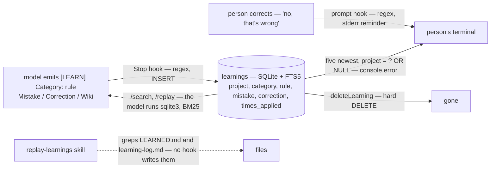

## 1. Executive Summary

Pro Workflow is a Claude Code plugin whose README opens with *"Your Claude
Code gets smarter every session"* and a loop: a correction becomes a rule,
the rule is saved to SQLite, the next session loads it, and *"after 50
sessions you barely correct anything."* MIT is asserted in the README badge
and `package.json` and there is no licence file in the tree; 86 commits
between 1 February and 18 July 2026 by four authors; version 3.4.0 in
`package.json` beside 3.3.0 in the plugin manifest; 2,544 lines of
TypeScript under `src/`, 2,459 lines of JavaScript across 38 hook scripts,
41 skills, 23 commands, eight agents, and one test file. The screen found
three auto-run surfaces — the plugin manifest, `hooks/hooks.json` registering
24 events, and a plugin settings file that allowlists test and worktree
commands — and one unpinned manifest with a lockfile untouched for 96 days.
Every registered script was read: they write under `~/.pro-workflow/` and the
temp directory, and the one network reach is the research loop and the
optimizer calling model providers with keys the person supplies. Nothing was
installed or run.

The memory is a table. `learnings` (`src/db/schema.sql:5-13`) holds a
category, a rule, a mistake, a correction, a project, a creation time and a
`times_applied` counter, with an FTS5 shadow table kept in step by three
triggers (`:17-42`). It is written by `scripts/learn-capture.js`, a Stop hook
that runs a regular expression over the assistant's reply for
`[LEARN] Category: rule` blocks with optional `Mistake:`, `Correction:` and
`Wiki:` lines and inserts each one with the project set to the basename of
`CLAUDE_PROJECT_DIR`. It is read by `searchLearnings`, `searchByCategory` and
`getRecentLearnings` (`src/search/fts.ts:15-133`), each of which adds
`project = ? OR project IS NULL` to its SQL when a project is given, and by
`/search` and `/replay`, which tell the model to run `sqlite3` against the
file. That filter earns the one mark.

Two findings sit between the README's loop and the code. **The session-start
hook does not load learnings into the model.** `scripts/session-start.js`
reads the five most recent learnings for the project (`:48-50`) and prints
them through a `log` function that is `console.error` (`:6-7`); the file
contains no `console.log`, no `additionalContext` and no write to stdout.
Claude Code's hook contract adds a SessionStart hook's stdout to the model's
context and shows its stderr to the person, so what the README calls
*"SessionStart loads all learnings"* is a message on the person's terminal.
The prompt hook's wiki hits go the same way (`scripts/prompt-submit.js:16-17`).
The learnings reach the model only when it runs `/search`, `/replay` or the
optimizer reads them, or when the person types them back. **The Stop hook
saves without approval.** The self-correction rule says *"Wait for approval
before persisting the learning"* (`rules/self-correction.mdc`) and the learn
command's save step begins *"After the user confirms"*
(`commands/learn.md:177-210`), but `learn-capture.js` parses every `[LEARN]`
block in the reply and inserts it; a rule the model proposed and the person
had not yet answered is in the table when the turn ends.

Beside the learnings is a knowledge plane added in 3.3 — wikis as Markdown
folders with an FTS5 shadow index, claims with a confidence, a budget-capped
research loop, an optional embedding arm and a multi-provider council — and a
skill optimizer that patches a skill file in epochs against frozen validation
prompts, recording every candidate, patch and rejection. Those are the better
engineered half of the repository and they are not the memory the README
leads with.

## 2. Mental Model

A belief here is a rule with a project. It is meant to be born from a
correction: the person says *no, that's wrong*, the prompt hook notices the
phrase and prints a reminder to use `/learn`, the model proposes
`[LEARN] Category: rule`, the person approves, and the row lands. What the
code does is shorter: when the model's reply contains the block, the Stop
hook saves it, and the approval is whatever the model chose to wait for.

A belief is *used* in three ways the code supports and one it does not. The
model can run `/search <query>` and `/replay <task>`, both of which are
instructions to query the SQLite file with FTS5 and rank by BM25; the skill
optimizer reads learnings as trajectories to build validation prompts; and the
`replay-learnings` skill greps `.claude/LEARNED.md` and `.claude/learning-log.md`,
two files that a skill's prose tells the model to append to and no hook
writes. What it does not do is arrive on its own: the session-start hook's
five recent learnings are printed to the person, and the prompt hook's wiki
hits likewise.

A belief stops being used only by `deleteLearning`, a hard DELETE the FTS
trigger mirrors. There is no status, no supersession and no archive; a rule
corrected by a later rule is two rows, and `times_applied`, the column the
replay briefing sorts by in its example, is incremented by nothing in the
tree.



## 3. Architecture

A plugin, not a service: `hooks/hooks.json` registers 38 scripts across 24
Claude Code events, from `PreToolUse` gates on edits, reads and shell commands
through `Stop`, `SessionStart`, `SessionEnd`, `UserPromptSubmit`, the
compaction pair, and the `TaskCreated`, `PermissionRequest`,
`WorktreeCreate` and `CwdChanged` events. The scripts are plain Node with no
dependency; the TypeScript under `src/` builds to `dist/`, and the hooks
`require` `dist/db/store.js` when it exists and fall back to file-based state
when it does not. The store (`src/db/store.ts:110`) opens
`~/.pro-workflow/data.db` through `better-sqlite3` and executes the schema;
`src/search/fts.ts` is the learnings query layer; `src/search/embeddings.ts`
the optional vector arm; `src/optimizer/` the skill optimizer with its own
tables. Commands are Markdown that instruct the model, several of which end
in a literal `sqlite3` invocation against the same file.

### Deployment and ergonomics

Two commands from the marketplace, then `npm run build` if the compiled store
is wanted; without `dist/` the hooks skip the database and the commands still
tell the model to run `sqlite3`. The knowledge plane needs a provider key for
embeddings, the council and the survey; the research tick needs a cron entry
and stops on a `STOP` file. The cost is 38 processes across a session's
events; the memory itself costs one regex per reply.

## 4. Essential Implementation Paths

- **Capture.** `scripts/learn-capture.js` reads the Stop payload, takes
  `assistant_response`, runs the `[LEARN]` regex in a loop, loads the store
  from `dist/`, and calls `addLearning` with the project basename, category,
  rule, mistake, correction and an optional wiki slug; it prints a count to
  stderr and echoes the input.
- **Read.** `getRecentLearnings(db, limit, project)` (`fts.ts:120-133`) and
  `searchLearnings(db, query, {limit, project, category})` (`:15-50`) build SQL
  with the project clause at `:40-42` and `:128-130`; `sanitizeFtsQuery`
  (`store.ts:431`) escapes the query.
- **Session start.** `scripts/session-start.js` counts `LEARNED.md` patterns
  (`:34`), loads five learnings (`:48-50`), lists wikis (`:70-77`), and prints
  everything through `console.error` (`:6-7`); it exits zero (`:141`).
- **Prompt.** `scripts/prompt-submit.js` matches nine correction patterns and
  five learn-trigger patterns, updates session counters, searches wikis when
  the prompt has three or more words, and prints the hits to stderr; it echoes
  the input on stdout (`:121-123`).
- **Instruct.** `commands/learn.md:177-210` — identify, confirm, then an
  `INSERT INTO learnings` or the store API; `commands/replay.md:25-45` — an
  FTS5 query ordered by `bm25()` and a session-history query;
  `commands/search.md` — BM25 with prefix and phrase matching.
- **Delete.** `deleteLearning` (`store.ts:139-140`, `:301`) runs a hard
  DELETE.
- **Optimize.** `src/optimizer/trainer.ts` reflects on trajectories,
  aggregates patches, clips by a learning rate, applies, validates against
  `optimization_validation` rows, and records candidates, patches and
  rejections (`schema.sql:176-253`); `reflect.ts:58` is the one reader of
  `times_applied`.

## 5. Memory Data Model

`learnings(id, created_at, project, category, rule NOT NULL, mistake,
correction, times_applied DEFAULT 0)` with `learnings_fts` over rule, mistake
and correction and three triggers; `sessions(id, project, started_at,
ended_at, edit_count, corrections_count, prompts_count)`. The wiki tables:
`wikis(slug, title, flavor, root_path, scope, auto_research, private)`,
`wiki_pages` with a content hash and FTS5, `wiki_sources` with a fetcher and
a fetched time, `wiki_claims(page_id, source_id, text, confidence DEFAULT 0.8,
last_verified_at)`, `wiki_seeds` with a status of pending, active, done or
failed, `wiki_embeddings(page_id, model, dim, vector)`, and `learnings_wiki`
linking a learning to a wiki. The optimizer tables carry a run's budget and
spend, candidates with a score and status, patches with an op, anchor,
payload, status and rejection reason, frozen validation prompts, and
rejections with a delta score.

## 6. Retrieval Mechanics

Learnings are retrieved by FTS5 with BM25 ranking over the three text
columns, prefix and phrase matching, OR between terms, a category filter, and
the project clause; or by recency; or, in the optimizer, by `times_applied`
descending, which orders by a column that is always zero. Wikis are retrieved
by BM25 over page title, summary and content with snippets, by an embedding
arm when a key is present, and by reciprocal-rank fusion of the two under
`/wiki hybrid`. None of it is injected: the prompt hook's three wiki hits and
the session hook's five learnings are written to stderr, and the model sees
the table when a command tells it to run a query.

## 7. Write Mechanics

A learning is written at Stop by regex, synchronously, before the hook echoes
the payload; it is searchable at the next query. The learn command's save is
an INSERT the model runs after the person confirms; the Stop hook's save is
unconditional on the block being present. No background pass touches a
learning; the research tick grows wikis a page per tick and the optimizer
rewrites a skill file, both under budgets and both recorded. `session-end.js`
writes a handoff file and prints a reminder to run `/wrap-up`; `pre-compact.js`
snapshots counters and the summary to a JSON file under the temp directory,
and `post-compact.js` prints them back to stderr.

### Operational cost

A regex per reply and a query per `/search`; a provider call per council
round, embedding batch, survey or optimizer epoch, under a budget the tables
record.

## 8. Agent Integration

The agent is Claude Code, and the memory reaches it through three commands
that end in `sqlite3` and one skill that greps files. The hooks are the
person's surface: gates on edits and commands, secret scanning, a tool-call
budget, a git blast-radius check, and reminders — a correction detected, a
learning trigger detected, wiki pages relevant — all on stderr. Other agents
get the skills through a cross-agent installer and none of the hooks. There
is no page, no queue and no review command over learnings; `/insights` and
`/sprint-status` report counts.

## 9. Reliability, Safety, and Trust

**Scope — awarded.** `project` is a stored column and every read that takes
a project adds `project = ? OR project IS NULL` to the query; a learning
saved with no project is global by construction.

**Human review — withheld.** The rule and the command say wait for approval;
the Stop hook does not. Nothing distinguishes an approved row from one the
model emitted and the person never answered, and there is no surface to
approve, reject or edit a learning short of running SQL.

**Trust state, tombstone, bitemporal, audit log — withheld.** A learning has
no status, no supersession and no record of deletion; its one time is
creation. A wiki claim's confidence is a number.

**Negative evaluation — withheld.** The one test file covers the optimizer's
patch application.

**What reaches the model, stated plainly.** Claude Code adds a hook's stdout
to the model's context for `SessionStart` and `UserPromptSubmit` and shows
stderr to the person. `session-start.js` and `prompt-submit.js` write their
learnings and wiki hits to stderr and nothing to stdout except, in the prompt
hook, the input payload echoed back. The README's *"auto-loaded on session
start"* and *"auto-injects top wiki hits"* describe messages the person reads.

**Unwired.** `times_applied` is read by the optimizer and the replay
briefing's example and incremented by nothing. `.claude/LEARNED.md` and
`.claude/learning-log.md` are grepped by the replay skill and counted by the
session hook, and the only writer is a skill's instruction to the model to
append.

## 10. Tests, Evals, and Benchmarks

One test file, `src/optimizer/__tests__/apply.test.ts`, fourteen cases on
patch application. Nothing tests the learnings store, the FTS queries, the
project filter, the Stop-hook regex or any hook script. No benchmark, no
paper; the README's comparison table against four other plugins is a feature
checklist.

## 11. For Your Own Build

### Steal

- **A schema a person can read.** 253 lines, FTS5 with triggers, and a
  project column in the query.
- **Record what the optimizer refused.** Candidates, patches, rejections with
  a reason and a delta, and frozen validation prompts are the right tables
  for a loop that edits a prompt.

### Avoid

- **Loading memory on stderr.** A hook that prints to the person and calls
  it context injection is the whole product claim resting on the wrong
  stream; one `console.log` of the same lines, or a `hookSpecificOutput`
  with `additionalContext`, is the fix.
- **A regex that saves what the rule says to wait for.** An approval that
  lives in the model's discipline and not in the capture path is not an
  approval.
- **A counter nothing counts.** Sorting by `times_applied` orders by zero.

### Fit

For a Claude Code user who wants the gates — secret scan, read-before-write,
a tool budget, commit checks — and a wiki with a research loop, this is a
broad plugin with a readable store underneath. As memory it does less than
it says: the rules are captured, filtered by project and searchable, and they
reach the model only when the model goes and looks. Anyone adopting it should
fix the two streams first and then decide whether the rest of the loop is
worth the 38 processes.

## 12. Open Questions

- Was the stderr path ever stdout? The hook contract has been stable and the
  script has no trace of an `additionalContext` output; a one-line change
  would make the README's loop true.
- Does anything approve a learning before Stop, or is the wait in the rule
  the only gate?
- What increments `times_applied`? The replay briefing's *applied 8x* example
  needs a producer.

## Appendix: File Index

| Path | Lines | What it holds |
| --- | --- | --- |
| `src/db/schema.sql` | 253 | `learnings`, `sessions`, the wiki tables, the optimizer tables |
| `src/db/store.ts` | 445 | `createStore`, learning CRUD, wiki and seed methods, `sanitizeFtsQuery` |
| `src/search/fts.ts`, `embeddings.ts` | 181, 139 | BM25 queries with the project clause; the embedding arm |
| `src/optimizer/` | 1,331 | Trainer, reflect, aggregate, clip, apply, validate, slow update, store |
| `scripts/learn-capture.js` | — | The Stop-hook `[LEARN]` parser |
| `scripts/session-start.js`, `prompt-submit.js`, `session-end.js`, `pre-compact.js`, `post-compact.js` | 147, 131, 133, 98, — | The stderr loaders, the correction detector, the handoff and snapshot |
| `hooks/hooks.json` | — | 24 events, 38 scripts |
| `commands/learn.md`, `learn-rule.md`, `search.md`, `replay.md`, `wiki.md` | — | The save flow, the rule format, the two `sqlite3` queries, the wiki subcommands |
| `rules/self-correction.mdc`, `skills/replay-learnings/SKILL.md` | — | The wait-for-approval rule; the grep over two unwritten files |
| `src/optimizer/__tests__/apply.test.ts` | 130 | Fourteen cases |

Searches behind the absence claims above, run from the repository root:

```sh
rg -c 'console\.log|process\.stdout|additionalContext' scripts/session-start.js   # 0: nothing reaches stdout
rg -n 'times_applied|incrementTimesApplied' scripts src skills --glob '!*.sql' | rg -v 'store.ts|fts.ts'   # reflect.ts:58, a read; no writer
rg -n 'LEARNED\.md|learning-log' scripts src hooks | rg -v 'grep '        # a hook description and a read in session-start.js; no writer
rg -n -i 'status|supersed|archiv' src/db/schema.sql | rg -i learning     # none on learnings
find . -path ./node_modules -prune -o -name '*.test.*' -print             # one file
ls LICENSE                                                                # absent
```

## History

**2026-09-08** — [`7f7209d7215bced7d651209ef050c77953c298d6`](https://github.com/rohitg00/pro-workflow/commit/7f7209d7215bced7d651209ef050c77953c298d6) — first reading, at the head of `main`, the last commit of 18 July 2026. Screened first: three auto-run surfaces (the plugin manifest, 24 hook registrations, a plugin settings allowlist), one unpinned manifest behind a 96-day-old lockfile; every registered script read; nothing installed or run, the read made from a full clone. One mark. The stderr finding rests on the harness's documented hook contract and on the script's lack of any stdout write, both stated in section 9.
