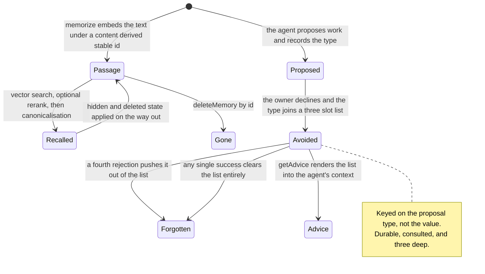

## 1. Executive Summary

Project Golem is a desktop agent that proposes work to its owner and acts on
approval. Its memory is two unrelated things: a 668-line LanceDB vector store,
and a 33-line file called `ExperienceMemory` that is the reason this report is
interesting.

**Licensing note.** The repository carries a **Project Golem Source-Available
Non-Commercial License** — not an open-source licence, and more restrictive than
the Elastic and Business Source licences elsewhere in this atlas, because it
forbids commercial use outright. Read it for the design; you cannot build a
product on it.

**The thing worth the visit is the rejection record.** `ExperienceMemory` keeps
four fields in a JSON file — `lastProposalType`, `rejectedCount`, `avoidList`,
`nextWakeup` — and three methods that move them:

```js
recordProposal(type) { this.data.lastProposalType = type; this.save(); }
recordRejection() {
    this.data.rejectedCount++;
    if (this.data.lastProposalType) {
        this.data.avoidList.push(this.data.lastProposalType);
        if (this.data.avoidList.length > 3) this.data.avoidList.shift();
    }
    this.save();
}
recordSuccess() { this.data.rejectedCount = 0; this.data.avoidList = []; this.save(); }
```

and one that reads them back:

```js
getAdvice() {
    if (this.data.avoidList.length > 0)
        return `⚠️ 注意：主人最近拒絕了：[${this.data.avoidList.join(', ')}]。請避開。`;
    return "";
}
```

— *"the owner recently rejected: [...]. Please avoid."*

This atlas has spent the whole corpus asking a version of one
question: when a person says no, does anything remember? Sixteen carry a
value-level tombstone. Here is another answer, in a file shorter than most of
the imports above it: the rejected thing is recorded, it is durable across
restarts, and it is read back into the agent's context before the next proposal.
The mechanism is right even though the implementation is small.

**It is not a tombstone, and the reasons are worth being precise about.** It is
keyed on the proposal *type*, not on the value, so a rejection of one phrasing
does not stop another. The list holds **three** entries and shifts the oldest out.
And `recordSuccess()` clears the whole list — so one accepted proposal erases
every rejection that preceded it. A user who declined the same suggestion three
times, then accepted something unrelated, has told the system nothing it still
knows. The atlas withholds the mark on the first ground and would withhold it on
either of the others.

The vector half is conventional and competently built: LanceDB, a pluggable
embedder (Gemini, Ollama, or a local provider running in a worker), recall with
an optional rerank, and — the part worth noting — a canonicalisation pass on
every result set.

## 2. Mental Model

Two stores that do not know about each other.

**The vector store** holds passages. A passage is text plus metadata plus a
**stable id derived from its content**, so re-memorising the same thing resolves
to the same record rather than a duplicate. Records carry `visible`, `createdAt`
and `updatedAt`, and hidden or deleted state is applied when results come back
rather than at query time.

**The experience store** holds one thing: what the owner has been saying no to
lately. It has no ids, no content, no timestamps — a proposal type string and a
counter.

The split is the design's honest shape. The vector store remembers *material*;
the experience store remembers *judgement*. Almost every system in this atlas
tries to hold both in one row and ends up holding neither.

### How a thing becomes a belief

`memorize(text, metadata)` embeds and writes. There is no extraction, no
candidate state and no review — the agent decides to remember and it is
remembered.

The experience store is written by outcome: `recordProposal` when the agent
proposes, `recordRejection` when the owner declines, `recordSuccess` when the
owner accepts. That is an outcome-gated write, and it is the same instinct the
atlas credits in [Acontext](../acontext/) — a write that fires on a terminal
result rather than on a model's enthusiasm.

### How a belief stops being one

For a passage: `deleteMemory(id)`, `updateMemory(id, patch)`, or a `visible`
flag that `_applyVisibilityAndCanonicalize` honours when resolving recall hits
against the canonical list. Visibility is enforced on the read path, which is
the part several larger systems here get wrong.

For a rejection: it ages out after three more rejections, or is wiped by the
next success. There is no way to make one permanent.



## 3. Architecture

A desktop application. `packages/memory/` holds the drivers; `packages/protocol/`
holds a **memory firewall** consulted by `NeuroShunter.js` and
`ProtocolFormatter.js`, with `src/core/ConversationManager.js` on the other side
of it and a `runtime-check.js` script that verifies the wiring. The firewall's
shipped configuration is `{ "enabled": true, "rules": [], "hits": [] }` — the
mechanism is connected and the rule set is empty, so an operator writes the
policy.

**Two drivers.** `LanceDBProDriver` (445 lines) is the vector path;
`SystemNativeDriver` (223 lines) is the fallback. Embedding is pluggable across
three providers, with the local one running in a worker so the UI does not block.

**No background work.** `nextWakeup` exists in the experience store's schema and
is written by nothing and read by nothing — the one dead field in an otherwise
tight file.

### Deployment and ergonomics

A desktop install with an embedded LanceDB and a choice of embedder, including a
local one — so it runs with no API key and no network if you take that option.
The experience store is a JSON file in the working directory that you can open
and edit.

The cost is the licence: non-commercial, so this is a design to read rather than
a dependency to take.

## 4. Essential Implementation Paths

**Rejection memory** — `packages/memory/ExperienceMemory.js`, all 33 lines.

**Vector store** — `packages/memory/LanceDBProDriver.js`: `recall` (`:91`),
`memorize` (`:116`), `listMemories` (`:195`), `updateMemory` (`:245`),
`deleteMemory` (`:267`), `_buildStableId` (`:333`),
`_applyVisibilityAndCanonicalize` (`:301`), `_maybeRerank` (`:405`),
`exportMemory` / `importMemory` (`:172`, `:178`).

**Fallback store** — `packages/memory/SystemNativeDriver.js`.

**Embedders** — `packages/memory/embeddings/` (Gemini, Ollama, Local, plus
`embeddingWorker.js`).

**Firewall** — `data/dashboard/memory-firewall.json`,
`packages/protocol/NeuroShunter.js`, `ProtocolFormatter.js`,
`src/core/ConversationManager.js`.

## 5. Memory Data Model

A passage carries `id`, `text`, `metadata`, `visible`, `createdAt`, `updatedAt`
and a score when it arrives from recall. The id is built by `_buildStableId`
from the content and hints, with a random UUID as the last resort — so identity
is derived rather than assigned, and the same text re-memorised lands on the same
record.

**There is no scope key of any kind** — no user, agent, session or project
field. One store per working directory is the entire boundary.

**Temporal fields are record time.** The experience store has no timestamps at
all, which is why a rejection cannot age by time, only by being pushed out of a
three-slot list.

## 6. Retrieval Mechanics

`recall(query, limit = 5)` embeds the query, searches LanceDB, optionally
reranks, then runs `_applyVisibilityAndCanonicalize`: it loads the canonical list
including hidden items, resolves each hit's metadata against it, drops anything
already seen by id, and computes `visible` from the canonical state rather than
from the hit.

That last step is better than it looks. A vector index and a canonical table can
disagree — a record deleted from one and still present in the other is the most
common bug in this shape — and resolving every hit against the canonical list on
the way out means the index is allowed to be stale without the answer being
wrong.

Failure modes:

- **The canonicalisation pass loads up to 10,000 records on every recall.** It is
  correct and it is O(store) per query.
- **No scope means no isolation.** Two projects sharing a working directory share
  a memory.
- **The rerank is optional and unconfigured by default**, so ranking is raw
  vector similarity in the shipped state.

## 7. Write Mechanics

`memorize` embeds and writes; the embedding provider is whichever is configured,
and with the local provider there is no network call. Identity is the
content-derived stable id, which gives deduplication by construction for exact
repeats.

The experience store's writes are the interesting half, and they are the cheapest
correct thing in this report: three methods, each called from the proposal loop
at the point where the outcome is already known. No model, no classification, no
inference about whether the owner was happy — the accept and decline paths
already exist in the product, and the memory hangs off them.

## 8. Agent Integration

The agent proposes; the owner accepts or declines; `getAdvice()` renders the
avoid list into the agent's context before the next proposal. That loop is the
integration, and it is closed — the signal is produced by the same interaction it
later biases.

**The memory firewall is a tombstone, and the first version of this report did
not read it.** That reading stopped at the shipped configuration —
`{ "enabled": true, "rules": [], "hits": [] }` — and filed the behaviour under a
populated rule set as an open question. The behaviour is thirty lines of
`MemoryFirewallService.js` and did not need a populated policy to read.

The loop is four steps and it starts in the system prompt. `ProtocolFormatter`
tells the model: *"If user clearly requests 'do not mention X again', write
concise phrase X in `[AVOID_MEMORY]`."* `ResponseParser` extracts that block;
`NeuroShunter` writes the phrase into long-term memory as a `type: 'avoid_memory'`
record **and** calls

```js
firewall.addRule({ pattern, scope: `golem:${golemId}`, matchMode: 'contains', enabled: true })
```

which persists to `data/dashboard/memory-firewall.json`. From then on every
recall passes through `ConversationManager.js:261`:

```js
const guarded = this.memoryFirewall.filterMemories(memories, { golemId: this.golemId });
```

and `filterMemories` drops any recalled passage matching an active in-scope rule,
recording a hit as it goes. `brain.recall` is called from exactly one place in
the codebase and the firewall is applied on the next line, so there is no second
read path to leak through.

That is the capability's definition almost word for word: a durable record of a
rejected value, keyed on the value rather than on a row id, consulted on the read
path so a later extraction cannot silently re-assert it. Deleting the memory
would not have achieved it — the agent could learn the same thing again tomorrow;
the rule survives re-learning. **`tombstone` is awarded**, one of the rarer marks
in this atlas.

Four limits belong beside it. The rule exists only if the *model* chooses to emit
the tag, so there is no deterministic detector behind a user saying "forget
that". Matching is a lowercased substring against a store that is retrieved by
vector similarity — so the one thing semantic recall is best at, surfacing a
paraphrase of X, is the one thing a `contains` rule cannot catch; the tombstone
is lexical and the memory it guards is not. The shipped policy is empty and a
single `enabled: false` switches off every rule at once. And nothing tests any of
it.

One detail is either careless or quietly right, depending on how you read it: the
rejected phrase is also written into the vector store in plaintext, as a
`visible: true` record. It is then unretrievable, because its own text contains
the pattern and `filterMemories` blocks it — the avoid record tombstones itself.
The dashboard can still read it, which is presumably the point.

**`audit_log` is withheld** even though `hits[]` looks like one. It records
blocks at recall — retrieval events, which the capability explicitly counts as
the other half of the pattern — and it is a ring of the newest 500. Nothing logs
the memory writes themselves.

**`human_review` is withheld.** `web-dashboard/routes/api.memory-firewall.js`
lets the owner add, edit, disable and delete rules and read the hit list, and the
proposal loop puts actions to the owner for approval — but neither is a person
adjudicating a *memory*. The owner writes policy and approves actions; no memory
is held pending anyone's decision.

## 9. Reliability, Safety, and Trust

**Visibility is enforced where it should be** — on the way out of recall, against
the canonical list.

**There is no trust model on a passage**: no status, no confidence, no source, no
provenance beyond whatever a caller puts in metadata.

**The only judgement the system keeps is the owner's**, and it keeps three of
them. That is the finding of this report in one sentence: the design is right and
the capacity is a magic number. Four rejections and the first is gone; one
success and all of them are.

**`recordSuccess` clearing the whole list is the decision to argue with.** It is
defensible as "the owner is engaged again, start fresh", and it means a rejection
is never a durable statement about a *kind* of proposal — only about the current
streak. A user cannot say "never again"; they can only say "not right now",
repeatedly.

## 10. Tests, Evals, and Benchmarks

74 files in the repository match test or spec by name. None of them covers
`ExperienceMemory`, and no test asserts that a rejected proposal type reaches
`getAdvice`, that the three-entry cap shifts correctly, or that
`recordSuccess` clears the list — which is the behaviour most worth pinning,
because it is the one a maintainer is most likely to change without noticing what
it costs.

Nothing asserts that a hidden or deleted record is absent from recall either, so
`negative_eval` is withheld.

No retrieval benchmark and no published numbers. I inspected these files; I did
not run them.

## 11. For Your Own Build

### Steal

**Record the rejection where the rejection already happens.** The accept and
decline paths exist in every agent that proposes work. Hanging a durable
`avoidList` off the decline path is thirty-three lines, needs no model, and gives
you the one signal that extraction can never produce: what the user did *not*
want. Most of this atlas's correction machinery is trying to infer this from text.

**Derive the id from the content.** `_buildStableId` makes re-memorising
idempotent without a dedup pass, and makes export and import round-trip.

**Resolve recall hits against the canonical table on the way out.** It lets the
vector index be stale without the answer being wrong, which is the failure this
shape produces most often.

**Separate the store of material from the store of judgement.** Two files, no
shared schema, and each one legible. The systems here that fold both into one row
end up with a `confidence` float that nothing revises.

### Avoid

**Do not cap a rejection list at three.** If the mechanism is worth having, the
capacity should be a policy, not a literal in a `shift()`.

**Do not let one success erase every rejection.** A streak counter and a set of
rejected things are different state with different lifetimes, and collapsing
them means the durable half inherits the volatile half's reset.

**Do not key a rejection on the category when the user rejected an instance.**
Proposal *type* is coarse enough that avoiding it may suppress a good suggestion,
and specific enough that a rephrasing escapes it. The value is the thing to key
on, which is what a tombstone is.

**Do not ship a field nothing reads.** `nextWakeup` sits in the schema and the
save path and is consulted nowhere.

### Fit

This is a design to read, not a dependency to take — the licence forbids
commercial use, and the memory is wired into a desktop application with no seam
to lift it through.

Read it if you are building anything that proposes work to a person. The
rejection loop is the smallest complete answer in this atlas to "the user said no,
now what", and its faults are all parameters rather than architecture: a cap, a
reset, and a key. Fix those three and the file is still under fifty lines.

## 12. Open Questions

- **Why three?** The cap is a literal with no comment, and it is the number that
  decides how much of the owner's judgement survives.
- **Was clearing on success intended to clear the avoid list, or only the
  counter?** The two are reset by the same line, and only one of them is
  obviously volatile.
- **What was `nextWakeup` for?** It is in the default shape and in every save,
  and nothing reads it.
- **Why is the block lexical when the recall is semantic?** A `contains` rule
  cannot suppress the paraphrase a vector store is most likely to return, and the
  embedder is already in the process that would need to compare them.
- **Why is the avoid rule the model's judgement call?** The prompt asks the model
  to notice "do not mention X again"; nothing detects it deterministically, so a
  refusal that the model paraphrases instead of tagging leaves no record at all.

## Appendix: File Index

**Rejection memory** — `packages/memory/ExperienceMemory.js`.

**Vector store** — `packages/memory/LanceDBProDriver.js`,
`packages/memory/SystemNativeDriver.js`, `packages/memory/index.js`.

**Embedders** — `packages/memory/embeddings/GeminiProvider.js`,
`OllamaProvider.js`, `LocalProvider.js`, `embeddingWorker.js`, `index.js`.

**Firewall** — `data/dashboard/memory-firewall.json`,
`packages/protocol/NeuroShunter.js`, `packages/protocol/ProtocolFormatter.js`,
`src/core/ConversationManager.js`.

**Licence** — `LICENSE` (Project Golem Source-Available Non-Commercial License).

## History

**2026-09-18** — [`210658a11bee669df875cc6edc0511fac239d1ba`](https://github.com/Arvincreator/project-golem/commit/210658a11bee669df875cc6edc0511fac239d1ba) — re-read at the same commit. Nothing upstream had moved, so every change is the atlas's own, and the main one is a mark. **`tombstone` is awarded.** The first reading saw the memory firewall's shipped configuration — `{enabled: true, rules: [], hits: []}` — and filed its behaviour under a populated rule set as an open question; the behaviour is thirty lines of `MemoryFirewallService.filterMemories` and never needed a populated policy to read. The system prompt asks the model to write a phrase the user has asked never to hear again into `[AVOID_MEMORY]`; `NeuroShunter` turns that into a persisted firewall rule keyed on the phrase; and every recall — there is exactly one call site for `brain.recall` — passes through `filterMemories` on the next line. A durable record of a rejected value, keyed on the value, consulted on the read path. Section 9 carries the four limits, of which the sharpest is that the block is a lowercased substring while the store is retrieved by vector similarity, so the paraphrase semantic recall is best at surfacing is the case a `contains` rule cannot catch.

`audit_log` and `human_review` were both examined and withheld, with the reasons in section 9: the `hits[]` array records recall-time blocks, which the capability counts as the other half of the pattern, and the owner writes firewall policy and approves proposed actions rather than adjudicating any memory. One detail was added to the experience store: `avoidList.push` does not deduplicate, so rejecting the same proposal type three times fills the three-entry list with three copies of it and evicts every other rejection. `stack_source` goes from seeded to reviewed.

**2026-07-31** — [`210658a11bee669df875cc6edc0511fac239d1ba`](https://github.com/Arvincreator/project-golem/commit/210658a11bee669df875cc6edc0511fac239d1ba) — first reading.
