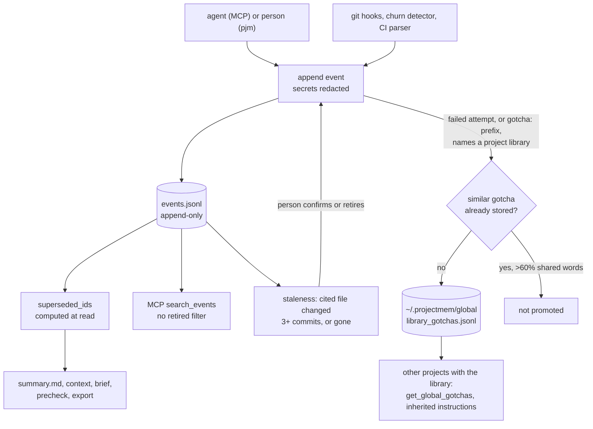

## 1. Executive Summary

projectmem is a local-first memory for AI coding agents, published on PyPI as
version 0.3.3, MIT, 74 commits since 9 May 2026, about 15,100 lines of Python and
241 tests, with a paper at [arXiv:2606.12329](https://arxiv.org/abs/2606.12329)
describing a 207-event dogfooding study. One MCP server serves every registered
repository, beside a `pjm` CLI and git hooks.

Its model is a debugging notebook rather than a fact store. An agent or a person
logs an issue, the hypotheses and attempts made against it with their outcomes,
the fix, and the decisions and notes that came out of it. Each is one JSON line
appended to `.projectmem/events.jsonl` in the repository. Nothing is edited: a
revised decision names the event it supersedes, and every reader computes the
retired set when it reads.

The log is put to work in three ways:

- **Precheck** compares staged files with the log and warns before a commit
  that touches a file where an approach already failed.
- **Staleness** flags a decision, fix or note whose cited file has changed in
  three or more commits since, or has disappeared, for a person to confirm or
  retire.
- **Global promotion** copies a failed attempt, or a decision or note that opens
  with `gotcha:`, `lesson:`, `never` and similar, into a machine-wide store of
  library gotchas when it names a library the project uses. Projects with the
  same stack inherit it.

Supersession is careful inside a repository, and a test pins every agent-facing
module to the retired-event filter. It does not reach the global store. A
promoted gotcha keeps no link to its event. Promotion also skips a new entry
that shares more than 60% of its words with one already stored, so a correction
worded like the lesson it retires is dropped as a duplicate, and other projects
go on inheriting the retired one. The MCP `search_events` tool, outside the
pinned modules, returns retired events untagged.

Two marks: `human_review`, `negative_eval`.

## 2. Mental Model

A repository's memory is a sequence of **cases**. An issue opens one; attempts
record what was tried and whether it worked; a fix closes it. Decisions and notes
sit beside cases. `summary.md` and the per-issue files are views regenerated
from the log.

**Retirement** is a pointer, not a status. An event with `supersedes: evt_…`
retires that event. `superseded_ids` collects every pointer, and each view drops
the retired ids (`models.py:186-192`).

**Automatic events** arrive from git hooks (post-commit, post-revert,
post-merge), a churn detector and a CI parser, each with a capture source and a
confidence.

**Global memory** is machine-wide: gotchas keyed by library, patterns and stack
preferences. It is inherited by a new project whose detected stack matches, and
served to agents through `get_global_gotchas`.

## 3. Architecture

| Module | Role |
| --- | --- |
| `models.py` | `Event`, validation, timestamps, locations, `superseded_ids`, event references |
| `storage.py` | Paths, initialisation, `read_events`, `append_event` with redaction and global promotion, instruction text |
| `summary.py`, `commands/context.py`, `commands/brief.py`, `commands/export.py` | Views over the log, each filtering retired events |
| `commands/precheck.py`, `staleness.py` | Warnings on staged files and staleness from git history |
| `commands/auto_capture.py`, `commands/hooks.py`, `commands/watch.py` | Automatic capture |
| `global_memory.py`, `commands/global_cmd.py` | Stack detection, the global store, promotion and inheritance |
| `mcp_server.py`, `project_registry.py`, `resolver.py` | The multi-project MCP server |
| `commands/score.py`, `commands/visualize.py`, `commands/dashboard.py` | The prevention score and HTML dashboards |

### Deployment and ergonomics

- **Install:** `pip install projectmem`, `pjm doctor --fix` to register existing
  projects, one MCP entry for all of them, `pjm init` per repository.
- **Storage:** JSONL and Markdown inside the repository's `.projectmem/`, added
  to `.gitignore` by default, plus `~/.projectmem/` for the registry and global
  store; `PROJECTMEM_HOME` relocates both.
- **Hand-repairable:** yes. Every file is text, and the log can be read with
  `jq`.
- **No network** except an opt-in version check.

The screen of this checkout found no auto-run surface, one build-time execution
point (`tests/conftest.py`), one unpinned surface and `pyproject.toml` inside
the seven-day cooldown. Nothing was installed, built or run.

## 4. Essential Implementation Paths

- **Append** — `storage.py:532-584`: redact secret patterns, write one sorted
  JSON line, then attempt global promotion for attempts, decisions and notes.
- **Decision with supersession** — `commands/decision.py:13-35`: resolve the
  referenced event by id or unique prefix, append, regenerate the summary; the
  MCP tool `add_decision` calls it (`mcp_server.py:656-698`).
- **Retired set** — `models.py:186-192`, read by `summary.py:89`,
  `staleness.py:125`, `commands/context.py:117`, `brief.py:163`,
  `export.py:59`, `precheck.py:419` and the CLI `search.py:42`.
- **MCP search** — `mcp_server.py:374-414`: substring match over every event.
- **Promotion** — `global_memory.py:681-786`: the signal filter, a whole-word
  match against libraries the project declares, the similarity skip at
  `:776-779`, `add_gotcha`.
- **Global removal** — `global_memory.py:399-446` (`remove_entry`,
  `prune_entries`), both rewriting the JSONL file.

## 5. Memory Data Model

`Event` (`models.py:125-183`): `type` from six values, `summary`, `id`,
`timestamp` normalised to UTC, `issue_id`, `outcome` from worked, failed or
partial, `files`, `command`, `notes`, `git_commit`, `location`, the
auto-capture fields `auto_captured`, `capture_source` and `capture_confidence`,
`git_message`, and `supersedes`.

**Supersession** is the only form of change. The retired event stays in the log
and is shown tagged `(superseded)` by the CLI search. Nothing records a
rejected value that later writes are checked against, so `tombstone` is
withheld. Outcomes and capture confidence describe an attempt or a capture, not
belief in a claim, so `trust_state` is withheld. There is one time axis, the
event timestamp, so `bitemporal` is withheld.

**The log is the history.** Every change to project memory, a supersession
included, is a new line, and no code path rewrites `events.jsonl`. The global
store is different: `remove_entry` and `prune_entries` rewrite its JSONL files
and leave no record of what was removed. Because a mutation path in the system's
own store goes unrecorded, `audit_log` is withheld.

**Scope.** One log per repository is a partition, and the global store is
shared by design, so `scope_enforced` is withheld.

**Global gotcha:** `id`, `library`, `gotcha` text, `tags`, `source_project`,
`version_range`, `discovered`. It carries no event id, so a later supersession in the
source project cannot find it.

## 6. Retrieval Mechanics

**Context and summary.** `generate_context` builds a Markdown block within a
token budget from open issues, recent cases, failed attempts and live decisions.
`summary.md` is regenerated after each decision, so `get_summary` reads a
current view.

**Precheck** collects live events for each staged or named file and warns at
info, warn or block level. Snoozing silences it for a period.

**Staleness** runs one `git log` count per distinct file and oldest event, and
flags an event after three commits to its file or when the file is gone.

**Search.** The CLI search tags retired events. The MCP `search_events` has no
retired filter and no tag (`mcp_server.py:398-414`). An agent searching for a
decision can read the retired version beside the current one, in log order, with
nothing to tell them apart. The test that pins the filter lists the modules
`summary`, `brief`, `context`, `export`, `precheck` and `search`
(`tests/test_agent_guidance.py:157-167`), and `mcp_server` is not among them.

**Global gotchas** are returned whole or for one library.

## 7. Write Mechanics

**Redaction** runs before the write and never blocks it: a scrubber failure still
writes the event, which the comment defends as better than losing an event in a
tool whose job is logging.

**Promotion and its duplicate check.** `auto_promote_event` passes an event
through two filters. The signal filter admits failed or partial attempts, and
decisions and notes that open with a lesson prefix. The library filter requires
a whole-word match to a library the project declares. Then it compares the text
with every stored gotcha for the same library and returns without writing when
more than 60% of the shorter text's words are shared (`global_memory.py:776-779`,
`_similar` at `:789-796`). Supersession plays no part:

- `gotcha: pydantic validators must be classmethods` is promoted.
- The project later retires it with `gotcha: pydantic validators no longer need
  to be classmethods`, superseding the first.
- The second shares most of its words with the first and is skipped.

The project's own views now show only the correction. Every other project using
pydantic inherits only the retired lesson, through `get_global_gotchas` and the
instructions written at `pjm init`. Nothing reports the skip, and removing the
stale gotcha takes a person running `pjm global remove`.

**Automatic capture** writes from git hooks and CI with a confidence, and the
watcher and churn detector record repeated edits.

## 8. Agent Integration

- **MCP tools:** `get_instructions`, `get_summary`, `get_project_map`,
  `get_plan`, `precheck_file`, `get_issue`, `search_events`, `get_score`,
  `get_context`, `get_global_gotchas`, `log_issue`, `record_attempt`,
  `record_fix`, `add_decision`, `add_note`, `list_projects`,
  `current_project`, each taking an optional project.
- **Instruction blocks** in CLAUDE.md and AGENTS.md, written for every client
  because some never read CLAUDE.md, tell the agent when to read and write
  memory and how to supersede.
- **The prevention score** grades the log and converts it into estimated hours,
  tokens and dollars saved. These are estimates computed from event counts, not
  measurements.

## 9. Reliability, Safety, and Trust

**History is never lost in the project.** Append-only writes and read-time
supersession mean a mistaken retirement can be undone by superseding again.

**Staleness asks a person.** Rather than decay or delete, the system flags
memory whose ground has moved and waits for a confirmation or a retirement.

**The global store is the weak side.** It is shared across projects, written
automatically, rewritten by removal and pruning without a record, and blind to
supersession, as above. The README's "projectmem never deletes" holds for the
project log. `pjm global prune` deletes global entries older than a year.

**Injection.** Summaries and notes are free text an agent writes, and promotion
can carry one project's text into every project with the same library.

## 10. Tests, Evals, and Benchmarks

241 tests in 23 files cover the log, supersession on each view, staleness
performance, precheck, redaction, the multi-project MCP server, client
configuration discovery, Windows hooks and encoding, and the dashboards. None was
run for this report.

**Negative retrieval.** `tests/test_agent_guidance.py:137` asserts that a
superseded decision is absent from the generated context while its successor is
present, and `:148` does the same for precheck. That earns `negative_eval`. No
test covers `search_events` or global promotion after a supersession.

**Benchmarks.** The paper reports a 207-event dogfooding study; no benchmark
harness or results are in this tree.

## 11. For Your Own Build

### Steal

- **Supersession computed at read time** over an append-only log.
- **Warn before the commit,** from the failures already recorded for the staged
  files.
- **Staleness from the cited file's git history,** not from age.
- **A test that lists every agent-facing module** and fails if one stops
  filtering retired events. Include the transport layer in the list.

### Avoid

- **Copying memory into a shared store without its identity.** A promoted entry
  that cannot be traced to its event cannot follow a later correction.
- **Deduplicating by word overlap alone** when the likeliest near-duplicate of a
  lesson is its correction.

### Fit

projectmem suits a developer or small team who wants coding agents to stop
repeating failed approaches in a repository, with memory they can read in a text
editor and a review step when code moves under a decision. The global store is
worth enabling only with the understanding that it does not follow corrections
at this commit.

## 12. Open Questions

- **Should a promoted gotcha record its source event** so that a supersession
  retires it globally?
- **Should `search_events` tag or drop retired events** like the CLI search?
- **Will the dogfooding study's events be published** beside the paper?

## Appendix: File Index

- `src/projectmem/models.py`, `storage.py`, `summary.py`, `staleness.py`, `global_memory.py`, `mcp_server.py`
- `src/projectmem/commands/decision.py`, `context.py`, `brief.py`, `precheck.py`, `search.py`, `export.py`, `global_cmd.py`
- `tests/test_agent_guidance.py`, `tests/test_v014_features.py`, `tests/test_global_mcp.py`

**Searches behind the absence claims**

- `grep -rn "superseded_ids" src` — seven modules; not `mcp_server.py` or `global_memory.py`
- `grep -n "supersed" src/projectmem/global_memory.py` — no matches
- `grep -rn "events_path" src` — read in four places, appended in one; nothing rewrites the log
- `grep -n "_write_jsonl" src/projectmem/global_memory.py` — `remove_entry` and `prune_entries`

## History

**2026-09-15** — [`e8d73137acde6f091ef6196f88ba5eccf6eb0e8a`](https://github.com/riponcm/projectmem/commit/e8d73137acde6f091ef6196f88ba5eccf6eb0e8a) — first reading, at a commit dated 14 September 2026. Screened before opening: no auto-run surface, one build-time execution point, one unpinned surface, and one dependency file inside the cooldown. Nothing was installed, built or run.
