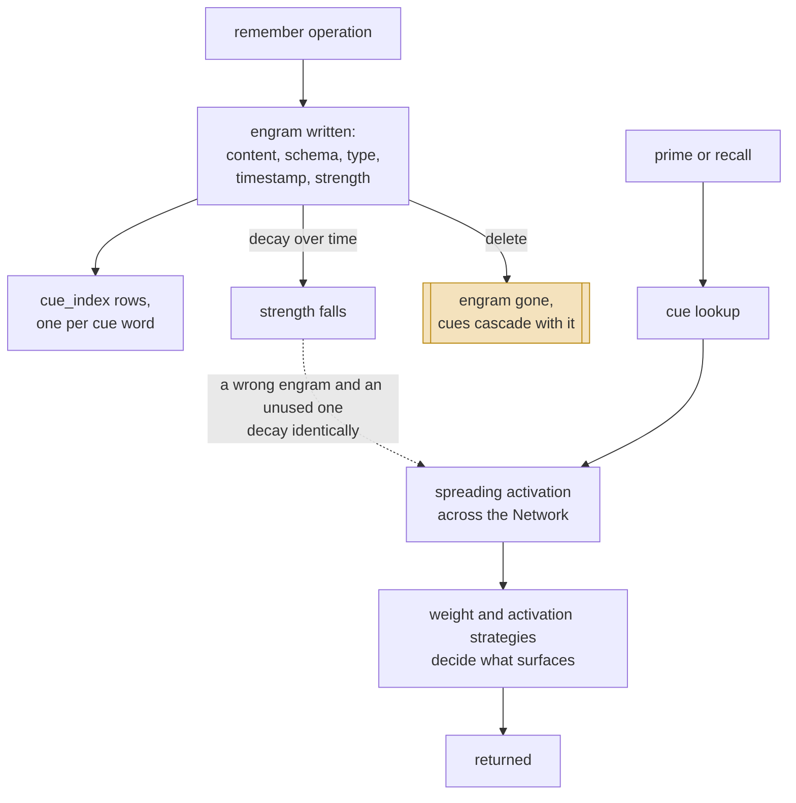

## 1. Executive Summary

PromptX presents itself as an **"AI Agent Context Platform"** with the tagline
*"Chat is all you need"*, MIT, 63,237 lines. On that description it belongs in
this atlas's not-in-scope section beside the other context-window managers.

It does not, and the reason is worth stating because it is a lesson about
reading. The directory named `memory` in this repository is
`apps/desktop/src/view/pages/roles-window/components/memory` — a *view*. The
memory is `packages/core/src/cognition/`, twenty-one modules implementing a
spreading-activation network over `better-sqlite3`. **The scope test is answered
by the package layout and never by the positioning.**

The model is associative rather than retrieval-scored. An `engram` carries
content, a schema, a type, a timestamp and a strength. A `cue_index` maps words
to engrams, and recall is activation spreading from cues through a `Network`
rather than a similarity ranking. `Mind`, `Consciousness`, `Anchor`, `Prime`,
`Cue` and `FrequencyCue` are all first-class modules, and the cognition layer
dispatches on an operation type of `prime | recall | remember`.

**Scope is earned by construction and is the cleanest instance of that shape
here.** `CognitionManager.getRolePath(roleId)` resolves to `basePath/roleId`,
`system.network.directory` is assigned it, and `engrams.db` is opened inside that
directory. Each role therefore has **its own database file**. A read cannot leak
across roles because a cross-role read would have to open a different file —
there is no predicate to forget and no filter to apply late.

**There is no correction path of any kind.** Searching the cognition package for
`tombstone`, `supersede`, `retract` or `forget` returns nothing; the only
lifecycle vocabulary is `weight` (241), `strength` (63) and `decay` (41), all of
it activation arithmetic. An engram that is wrong decays at the same rate as one
that is merely unused, and nothing records that anything was ever judged.

## 2. Mental Model

A memory is an **engram reachable by the words that cue it**.

```sql
CREATE TABLE IF NOT EXISTS engrams (
    id TEXT PRIMARY KEY, content TEXT, schema TEXT,
    type TEXT, timestamp INTEGER, strength REAL, metadata TEXT
);
CREATE TABLE IF NOT EXISTS cue_index (
    word TEXT, engram_id TEXT,
    PRIMARY KEY (word, engram_id),
    FOREIGN KEY (engram_id) REFERENCES engrams(id) ON DELETE CASCADE
);
```

The `ON DELETE CASCADE` is the one piece of referential hygiene in the design and
it is correct: deleting an engram removes every cue pointing at it, so the index
cannot outlive its target. That is the failure [7layermem](../7layermem/) has in
the other direction, and it is worth noting that a foreign key does here what a
whole background pass fails to do elsewhere.

`strength` is a float and the only epistemic field. There is no status, no
provenance, no verification and no source — consistent with the model, since
spreading activation is a theory about *reachability* rather than about truth.

### How a thing becomes a belief, and how it stops being one



The dashed edge is the design's blind spot: strength is the only lever, and it
answers "how reachable" rather than "how true".

## 3. Architecture

A monorepo — `packages/core` holds the cognition system, `apps/desktop` is a
desktop application, and there is an MCP surface and a CLI. The memory subsystem
is self-contained inside `packages/core/src/cognition/` and depends on
`better-sqlite3` and the filesystem.

Per role, on disk: a directory containing `network.json` (the activation
network), `engrams.db` (the store) and `state.json` (the anchor's state). Three
files, one role, no server.

### Deployment and ergonomics

Cheap to run and hard to find. An operator inherits one directory per role and no
migration path — `CREATE TABLE IF NOT EXISTS` with no version column, so the
first schema change is a manual migration across every role directory in
existence.

## 4. Essential Implementation Paths

- **Store:** `packages/core/src/cognition/Memory.js:97` — the `engrams` and
  `cue_index` DDL and the prepared statements below it.
- **Scope by construction:** `CognitionManager.js:50` (`getRolePath`), `:60`
  (`network.json` path), `:95` (`system.network.directory` assignment);
  `CognitionSystem.js:183` (`engrams.db` inside that directory).
- **Operations:** `Remember.js`, `Recall.js`, `Prime.js`.
- **Activation:** `Network.js`, `Cue.js`, `FrequencyCue.js`,
  `ActivationStrategy.js`, `ActivationContext.js`, `ActivationMode.js`,
  `TwoPhaseRecallStrategy.js`.
- **Weighting:** `WeightStrategy.js`, `WeightContext.js`.
- **State:** `Anchor.js:44` — `state.json`; `Mind.js`, `Consciousness.js`.

## 5. Memory Data Model

Two tables. The `schema` and `type` columns on an engram are the typing, and
`metadata` is the escape hatch.

The cue index is the interesting half: a memory is not addressed by id or by
embedding but by **the words that lead to it**, with the primary key
`(word, engram_id)` making the relationship many-to-many. That is a different
retrieval primitive from everything else in this corpus, which is overwhelmingly
similarity-over-embeddings, and it means recall quality depends on how cues were
extracted at write time rather than on how a query is phrased at read time.

## 6. Retrieval Mechanics

Cue lookup into a spreading-activation network. `TwoPhaseRecallStrategy` names
the shape — a first pass to seed activation and a second to collect what lit up —
and `ActivationStrategy` and `WeightStrategy` are pluggable, so the traversal
policy is a strategy object rather than a hard-coded rank.

There is no vector similarity in this path. `FrequencyCue` indicates
frequency-weighted cueing, and the weights decide the result.

**A query that matches nothing returns the network's hubs, and says so.** When
`query` is null — or, for compatibility, the string `"null"` —
`TwoPhaseRecallStrategy.performCoarseRecall` enters DMN mode and seeds
activation from the most connected nodes instead of from the query's cues.
`RecallCommand` then uses that as a fallback:

```js
mind = await this.cognitionManager.recall(role, query, { mode })
if (query && (!mind || mind.activatedCues.size === 0)) {
  mind = await this.cognitionManager.recall(role, null, { mode })
  fallbackToDMN = true
}
```

So a miss never returns empty. What saves this from being the silent
substitution it looks like is that the flag travels: `operationType` becomes
`prime` rather than `recall`, and `cognitionLayer.metadata.fallbackToDMN` is set,
so the caller is told it received an overview rather than an answer. Most of this
atlas either returns the least-bad match as though it matched, or returns
nothing; relabelling the operation is the third option and the better one.

## 7. Write Mechanics

`remember` writes an engram and its cue rows. `prime` and `recall` are the read
operations, and the layer dispatches on that operation type — so the write path
is a single named operation rather than an extraction pipeline, and what becomes
a memory is whatever the caller passes.

Background work is weight and decay maintenance over the network. Nothing
rewrites content, and no consolidation pass merges engrams.

## 8. Agent Integration

An MCP surface, a desktop application and a CLI, with **roles** as the organising
unit throughout — a role is both the persona and the memory boundary, which is a
tidy identity to hang isolation on.

The consequence for a reader is the one from section 1: everything user-facing is
described in terms of roles and context, and the memory is reachable only through
that vocabulary.

## 9. Reliability, Safety, and Trust

**Isolation is by construction, and `scope_enforced` is withheld anyway.** One
database per role, opened from the role's own directory, so there is no predicate
that can be omitted — [daimon](../daimon/) and
[memory-project](../memory-project/) scope by directory too. That is a genuine
property with a genuine advantage over a filter, and it is not what the mark
certifies: `scope_enforced` asks for a stored scope key applied as a filter on
the read path, and here no record carries a scope key and no query applies one.
The boundary is the file handle.

Two limits follow from that rather than from any oversight. A role is not a user
and not a tenant: two people using the same install share every role, and nothing
in the cognition package expresses a person. And nothing can express a query that
spans roles, or one that admits a subset of them — the partition is total in both
directions.

**And the file handle is chosen by an argument the model supplies.**
`CognitionManager.getRolePath(roleId)` is `path.join(this.basePath, roleId)` with
no validation, `ensureRoleDirectory` creates whatever that resolves to, and
`RecallCommand.parseArgs` returns the MCP tool's argument object verbatim —
`const { role, query, mode } = this.parseArgs(args)`, with `if (!role)` as the
only check. Two consequences worth separating. A caller that names another role
reads that role: the partition keeps roles from leaking into each other by
accident, and nothing asks whether this caller may open that file. And a `roleId`
containing `..` is joined and created without complaint, so the directory a
"role" resolves to need not be inside the roles directory at all.

**`tombstone`, `trust_state`, `bitemporal`, `audit_log`, `human_review`,
`negative_eval` — none found.** The cognition package has no correction
vocabulary at all, no status column, no validity interval, no mutation log and no
review surface. `strength` is the only epistemic quantity and it is a
reachability weight.

**The `ON DELETE CASCADE` deserves its own line**, because it is the one place
this design gets a durability question right that larger systems get wrong: the
cue index cannot outlive the engram it points at. Deletion is complete within the
store, even though nothing records that it happened.

## 10. Tests, Evals, and Benchmarks

The first reading noted a Cucumber-style suite and made no claim about it. Traced
now, it is the most interesting test artifact in this repository and the reason
`negative_eval` is nevertheless withheld.

`features/e2e/cognition/memory-lifecycle.feature` is written in Chinese Gherkin
and its fourth scenario is **多角色记忆隔离** — multi-role memory isolation:

```gherkin
假设 角色"alice"存储了"Alice的专属记忆"
并且 角色"bob"存储了"Bob的专属记忆"
当 角色"alice"执行recall"专属记忆"
那么 只能检索到"Alice的专属记忆"
并且 不能检索到"Bob的专属记忆"
```

Two roles write, one reads, and the last line asserts the other role's memory is
absent. That is exactly the shape the `negative_eval` flag is for, and the steps
are not stubs: `cognition.steps.js:141-193` implements all five, calling
`cognitionManager.remember(roleId, [engram])` and
`cognitionManager.recall(roleId, query)` and asserting over
`activatedMind.activatedCues`.

Two things stop it from earning the mark, and the second is decisive.

The negative step is vacuous on its own. `不能检索到` opens with

```js
if (!activatedMind || activatedMind.activatedCues.size === 0) {
  return;   // 如果没有激活任何概念，那么肯定不包含unexpected
}
```

so a recall that returns nothing passes it. The scenario survives that only
because `只能检索到` runs first and throws when `activatedMind` is null — the
positive control is load-bearing, and it is load-bearing by step order rather
than by design.

**And nothing can run it.** There is no `@cucumber/cucumber` dependency in any
`package.json` in the monorepo, no `cucumber.js` or `.cucumberrc`, and no script
that points at `features/`; the root `test` script is `turbo test`, which runs
the fourteen `*.test.*` files in the packages. The feature file and its step
definitions are complete, committed, and unexecutable as the repository stands.
A case that cannot be run is not an evaluation, so the mark is withheld — with
the note that restoring it costs one dev dependency and one line in `scripts`.

No benchmark and no committed retrieval numbers were found — which for a design
whose retrieval primitive is unusual, cue-driven activation rather than
similarity, is the measurement most worth having and least available.

## 11. For Your Own Build

### Steal

- **One database file per scope.** Isolation that cannot be forgotten, because
  crossing it means opening a different file. If your scopes are coarse and
  stable — roles, projects, tenants — this is stronger than any predicate.
- **`ON DELETE CASCADE` from the index to the record.** A foreign key doing what
  a background cleanup pass usually fails to do.
- **Cue extraction as the write-time investment.** Deciding at write time what a
  memory should be reachable *by* is a different bet from embedding it and hoping
  the query lands nearby, and it is legible in a way an embedding is not.

### Avoid

- **Strength as the only epistemic field.** A wrong engram and an unused one
  decay identically, so nothing distinguishes forgetting from correcting.
- **`CREATE TABLE IF NOT EXISTS` with no version column**, once the store is
  per-role and there are many directories to migrate.

### Fit

This suits someone building **role-scoped agents where associative recall is the
point** and correction is not — a persona that should surface related material by
cue rather than by similarity. The per-role isolation is genuinely good, and the
activation model is the only one of its kind in this corpus.

Poor fit if you need any correction, if your scope is a person rather than a
role, or if you want the memory as a dependency: it is twenty-one modules inside
a 63,000-line platform with no separate package boundary.

## 12. Open Questions

- **How are cues extracted at write time?** Recall quality rests entirely on
  this, and the extraction was not traced.
- **What does `schema` hold on an engram?** A column named `schema` beside `type`
  suggests structure the rest of the package may rely on.
- **Does anything expire an engram, or only weaken it?** Decay lowers strength;
  no removal pass was found.
- **What does the Cucumber suite assert about cognition?** Present, untraced.

## Appendix: File Index

**Store and schema**
- `packages/core/src/cognition/Memory.js` — `engrams`, `cue_index`, prepared
  statements
- `packages/core/src/cognition/Anchor.js` — `state.json`

**Scope**
- `packages/core/src/cognition/CognitionManager.js` — role paths and per-role
  network directories
- `packages/core/src/cognition/CognitionSystem.js` — `engrams.db` resolution

**Operations**
- `Remember.js`, `Recall.js`, `Prime.js`

**Activation and weighting**
- `Network.js`, `Cue.js`, `FrequencyCue.js`, `ActivationStrategy.js`,
  `ActivationContext.js`, `ActivationMode.js`, `TwoPhaseRecallStrategy.js`,
  `WeightStrategy.js`, `WeightContext.js`

**Higher-level**
- `Mind.js`, `Consciousness.js`, `CognitivePrompts.js`, `Engram.js`

**Tests**
- `features/support/step-definitions/cognition/cognition.steps.js`

## History

**2026-09-18** — [`93c1e53556cd5c91215e6eab18bc802dbce5e8a5`](https://github.com/deepractice/promptx/commit/93c1e53556cd5c91215e6eab18bc802dbce5e8a5) — re-read at the same commit. Nothing upstream had moved, so every change is the atlas's own. The first reading had noted a Cucumber suite and declined to characterise it; reading it produced the sharpest finding here. `features/e2e/cognition/memory-lifecycle.feature` contains a multi-role isolation scenario that asserts Alice's recall returns her memory and **not** Bob's, and `cognition.steps.js:141-193` implements every step against the real `CognitionManager`. It is the clearest negative-retrieval assertion this kind of system could have, and the mark is still withheld: there is no `@cucumber/cucumber` dependency in any `package.json` in the monorepo, no runner configuration and no script pointing at `features/`, so the scenario is complete, committed and unexecutable as the repository stands. Separately, its negative step returns early when nothing was activated, so it is non-vacuous only because the positive step runs first.

`stack_retrieval` was empty and is now `graph` — cue lookup into a spreading-activation traversal is a graph arm, and recording it as nothing implied there was no retrieval. Two mechanisms were added to the body. A query that matches nothing falls back to DMN mode, which seeds activation from the network's hub nodes rather than returning empty — and the substitution is labelled, with `operationType` switching to `prime` and `fallbackToDMN` set in the layer metadata, which is the better of the three available choices and worth section 11. And the role that selects the database is an unvalidated argument: `getRolePath` is `path.join(basePath, roleId)`, `RecallCommand.parseArgs` returns the MCP argument object verbatim with `if (!role)` as the only check, so naming another role opens it and a `roleId` containing `..` resolves outside the roles directory. `stack_source` goes from seeded to reviewed.

**2026-08-04** — [`93c1e53556cd5c91215e6eab18bc802dbce5e8a5`](https://github.com/deepractice/promptx/commit/93c1e53556cd5c91215e6eab18bc802dbce5e8a5) — first reading.
