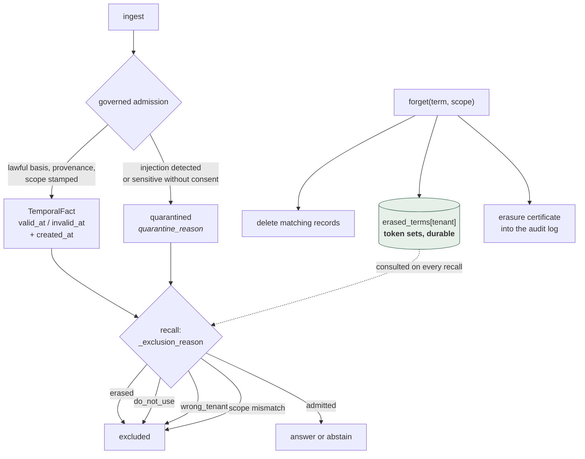

## 1. Executive Summary

Provem is 21,444 lines of Python with 7,658 lines of tests, positioned not as a
memory but as a **governance layer over one** — right-to-erasure, tenant
isolation, injection defense and a tamper-evident audit, able to run over Mem0 or
Graphiti or as its own store. Its README states the thesis in a sentence: the
hard question is no longer *"can I find it?"* but *"am I allowed to use it?"*

It carries **all seven capability marks**, the second system in this atlas to do
so after [Verel](../verel/) — and unlike Verel, which arrived at them under
red-team pressure, Provem arrived at them because a regulation names each one.

**The evidence practice is the most disciplined in the corpus.** The repository
ships `scripts/verify_repro.sh`, described in its own header as a *"self-checking
EUR-0 replay of every published benchmark number"* that *"ASSERTS the exact
published values; any missing input or drifted number exits non-zero."* Run at
this commit from a clean clone:

```text
== dataset integrity ==  == baseline ==  == optimized ==  == post empty-fix ==
== headline ==  == three-system scoreboard v1 ==  == v2 ==
== neutral-prompt control (prompt-confound disclosure) ==  == manifest freshness ==
VERIFY OK (21 assertions)
```

and with `--full`, which adds the deterministic governance benchmark and the unit
tests, **VERIFY OK (25 assertions)**, exit 0. This is a stronger artifact than
anything else here: not a harness a reader may run, but a regression gate that
fails if the README drifts from the numbers.

**It publishes its losing configurations.** The tier table lists four
deployments, and two of them lose: the stdlib-retrieval tier scores 0.388 *"below
Mem0"*, and the fully keyless tier scores 0.21 against a stated **0.24
no-memory baseline** — a configuration that is worse than having no memory at
all, published in the same table as the recommended tier's 0.614.

**It discloses a confound in its own favour-adjacent result.** One replay step is
named *"neutral-prompt control (prompt-confound disclosure)"*, and the README
marks the abstention gap against Mem0 as *"a statistical tie and
prompt-confounded"*. It also configured the Zep comparison *"following its own
published evaluation checklist… to pre-empt the misconfiguration critique it
raised against Mem0's paper"*, and closes with *"We rank only what we measured."*

**And `docs/claim_register.md` records claims it has rejected.** One row reads
`Unsupported` with the evidence column literally `None (ai4privacy download
pending license review)` and the disposition *"Rejected for now; scope track runs
only on committed fixtures until a licensed real PII set is approved."* A claim
register that carries a rejected claim is the artifact this atlas has been
describing in the abstract for months.

Reservations. **There is no licence file anywhere in the tree**, and neither
`README.md` nor `pyproject.toml` asserts one, so all rights are reserved by
default — reviewed under the same exception applied to OptMem, and stated here
because it governs what a reader may do with the code. The governance benchmark
that produces the headline compliance numbers is self-authored, which the
repository says plainly. And the erasure guard is read-side suppression rather
than write-side refusal, which matters in the way described below.

## 2. Mental Model

A fact is admitted or quarantined, ranked or excluded with a reason, and erasure
leaves behind a durable token set that outlives the records it deleted.



The dotted edge is the mark most systems here lack. `forget` does not only
delete: it tokenizes the term and appends the token set to a per-tenant
`erased_terms` registry, and every later recall excludes any record whose tokens
are a **superset** of an erased set. Deleting the rows removes what exists;
keeping the token set is what survives the next ingest.

## 3. Architecture

Forty-eight Python modules under `src/cognitive_memory/`. The governance core is
`reliability.py` (admission, erasure, exclusion), `compliance.py` (regime
profiles, erasure modes), `policy.py`, `scope.py`, `safety.py`, `audit.py` and
`review.py`. Around it sit `retrieval.py`, `ranking.py`, `temporal.py`,
`reflection.py`, `consolidation_eval.py` and an answerer stack. `adapters/`
carries the Mem0 and Graphiti bridges plus mocks, and `mcp_server.py` exposes the
whole thing over MCP.

`docs/` is unusually load-bearing: a claim register, a research journal
documenting *"every synthetic suite, every negative result"*, an optimization log
covering *"every optimization iteration incl. failures and the bug post-mortem"*,
a trust model naming what belongs in a gateway instead, a ship report with full
limitations, and `docs/runs/` holding the frozen artifacts and manifest.

### Deployment and ergonomics

Four tiers, with their costs stated: keyless and air-gap-safe (and worse than no
memory), stdlib retrieval with an LLM answerer, dense with an embeddings key
(*"cents per conversation, disk-cached"*), and local embeddings marked
**"projected, unbuilt"**. Marking an unbuilt tier as projected in the same table
as measured ones, rather than omitting it, is the same instinct as publishing the
losing rows.

The compliance profiles are configuration: a HIPAA-style profile is described in
`compliance.py` as *"PHI: MRN/patient identifiers, consent required, strict
erasure, long adverse-event retention"*, with `erasure_mode` validated to
`strict` or `lenient` and a config error otherwise.

## 4. Essential Implementation Paths

### A replay that asserts instead of printing

`scripts/replay_report.sh` is four lines that exec `verify_repro.sh`, kept as the
documented entry point because *"the replay is now self-checking — it ASSERTS
every published number instead of just printing them."*

The script `require`s each frozen input by path, runs each step, and `expect`s
verbatim strings in the output, counting assertions. A missing artifact exits 1
before anything runs; a drifted number exits 1 at the step that produced it.

The dataset is handled the way this atlas asks for and almost never sees.
LoCoMo is CC BY-NC, so it is not redistributed; `scripts/fetch_locomo.sh`
downloads it from the authors' repository, verifies it against a **sha256 pinned
in the reproducibility manifest**, refuses to overwrite an existing file whose
hash differs, and aborts on mismatch with *"upstream changed?"*. That is a
dataset checksum doing work rather than decorating a config block.

**Read carefully, the "zero cost" claim has one prerequisite and no exception.**
Without the dataset the gate exits 1 with `MISSING INPUT`. With it fetched — one
hash-verified download — all 21 assertions pass with no API key and no model
call, and 25 with `--full`.

### Erasure that outlives the record

```python
def forget(self, term: str, scope: Scope) -> int:
    term_tokens = tokenize(term)
    if term_tokens:
        self.erased_terms.setdefault(scope.tenant, []).append(term_tokens)
    ...
    removed = self.backend.delete_ids(remove)
    self.audit.erasure_certificate(term, remove, scope.tenant, removed)
```

and on the read path, in `_exclusion_reason`:

```python
if any(term <= erasure_tokens for term in self.erased_terms.get(record.scope.tenant, [])):
    return "erased"
```

Three things make this a
[rejected-value tombstone](../../patterns/rejected-value-tombstone/) rather than
a soft delete. It is keyed on the **value**, not the row. It is **normalized** —
a token set with a subset test, so a later record that restates the erased term
inside different surrounding text is still caught, which is a looser and more
forgiving key than the exact-text hash [Daimon](../daimon/) uses. And it is
**tenant-scoped**, so an erasure in one tenant does not silently censor another.

The limitation is the same one this atlas records for Daimon: it is suppression
at read rather than refusal at write. A re-ingested erased value still lands in
the backing store and is stopped on the way out, so every future read path has to
consult the registry, and the store holds content a subject asked to erase. For a
system whose stated purpose is GDPR Article 17, that distinction is the one a
reader should press hardest on.

### Exclusion with a reason, and scope that cannot be dodged

`_exclusion_reason` returns a string per rejected record — `quarantined`,
`erased`, `do_not_use`, `wrong_tenant`, or a scope mismatch — so a recall result
carries *why* something was withheld rather than silently returning less. The
cross-tenant check is labelled *"defense in depth (backends that do not pre-filter
by tenant)"*, which is the right posture when the store is pluggable.

The subject-scope rule is the sharpest line in the file:

> "a query about subject X must not be answered by a look-alike record about
> subject Y. A subject-less query (entity="") must **NOT** be served a
> subject-scoped record either — otherwise scope isolation is bypassable by
> simply omitting the entity."

Closing the omitted-parameter bypass is the kind of thing that only gets written
after somebody tried it, and it is stated as the reason rather than left as a
condition.

### Admission that can hold a write

`store` applies governance before anything is retrievable: prompt-injection
quarantine, a sensitive-without-consent hold, provenance and scope stamped at
write. A quarantined record keeps a `quarantine_reason` and is excluded at
recall rather than dropped, so the hold is inspectable. That is a
[governed write gateway](../../patterns/governed-write-gateway/) whose refusal
state is durable and reviewable, and it is what `review.py`'s `ReviewStatus`
workflow adjudicates.

## 5. Memory Data Model

`TemporalFact` is subject / relation / object plus `valid_at`, `invalid_at`,
`created_at`, `confidence`, `evidence`, `supersedes` and `superseded_by`,
`scope`, `privacy_policy`, `source_type`, `source_trust`, `source_timestamp`,
`source_conflict_policy` and `conflict_with`.

`valid_at`/`invalid_at` against `created_at` is world time against record time,
which is the [bi-temporal](../../patterns/bi-temporal-fact-validity/) mark, and
`source_timestamp` defaults to `valid_at` when unstated rather than to now — a
small choice that keeps an undated source from looking freshly observed.

Trust is several fields rather than one: discrete statuses (`hypothesis`,
`accepted`, `proposed`, `pending`, plus `quarantined` as a flag with a reason),
`source_trust` as a separate axis from `confidence`, and
`source_conflict_policy` defaulting to **`abstain_on_conflict`** — a store whose
default answer to a contradiction is to say nothing is unusual and is the correct
default for the regulated setting it targets.

## 6. Retrieval Mechanics

Dense recall in the recommended tier, with the exclusion pass above between
candidates and answer, and abstention as a first-class outcome rather than an
empty result. The headline recall figures come from LoCoMo: 0.614 for the dense
tier against Mem0's 0.565 and Zep's 0.449, with p-values reported
(`Provem>Mem0 p = 2.5×10⁻⁴`, `Provem>Zep p = 1×10⁻³⁴`) and the ordering stated as
identical under all three judges.

The README's framing of its own recall result is the notable part — *"On recall
it holds its own… roughly a tie with Mem0"* — for a number that is nominally a
win. A project describing its own benchmark victory as a tie is not a common
failure mode.

## 7. Write Mechanics

Writes pass admission, are stamped with provenance and scope, and either land
live or land quarantined with a reason. Erasure is synchronous: delete, register
the token set, emit a certificate. Background work covers reflection and
consolidation.

### Operational cost

The governance path needs no model — the entire governance benchmark is
*"deterministic, no API key"*, which is why the replay can assert its numbers for
free. Cost enters only at recall in the dense tier (embeddings, disk-cached) and
at answering. The keyless tier removes both and is honestly reported as worse
than no memory, which is the trade named rather than hidden.

## 8. Agent Integration

An MCP server, a CLI, and adapters for Mem0 and Graphiti. The adapter posture is
the product thesis: the governance layer is meant to sit *over* an existing
memory rather than replace it, which is why `mem0_audit.py`, `mem0_env.py` and
the Graphiti bridge exist alongside its own store. `docs/trust_model.md` states
the boundaries and *"what belongs in a gateway"* instead — declining scope in a
security document is worth more than claiming it.

## 9. Reliability, Safety, and Trust

Strengths:

- **A replay that asserts every published number** and exits non-zero on drift;
  21 assertions, 25 with `--full`, passing at this commit.
- **A hash-pinned external dataset** fetched rather than redistributed, with an
  overwrite refusal on hash mismatch.
- **Losing configurations published** in the same table as the winner, including
  one below the no-memory baseline.
- **A disclosed prompt confound**, with its own replay step, and a
  favour-adjacent gap called a statistical tie.
- **The competitor configured to its own published checklist**, to pre-empt the
  critique it made of a third party.
- **A claim register carrying rejected and unsupported claims**, with evidence
  level and risk per row.
- **A research journal of negative results** and an optimization log including
  failures and a bug post-mortem.
- **Value-keyed, normalized, tenant-scoped erasure** with a certificate in the
  audit log.
- **Exclusion reasons returned per record**, so a withheld memory is explainable.
- **Scope isolation closed against the omitted-parameter bypass.**
- **`abstain_on_conflict` as the default** source-conflict policy.

Gaps:

- **No licence file, and no licence asserted anywhere**, so all rights are
  reserved by default.
- **Erasure is read-side suppression**, so the store retains content a subject
  asked to erase and every read path must consult the registry.
- **The governance benchmark is self-authored**, and its 240 → 0 and 100% → 0%
  figures are measurements of the author's own scenario suite.
- **The local-embeddings tier is unbuilt**, marked projected.

## 10. Tests, Evals, and Benchmarks

7,658 lines of tests, run as part of `verify_repro.sh --full`, which passed here.

The compliance headline — *"Compliance violations 240 → 0, memory-poisoning
success 100% → 0%, silent compounding errors 72.6% → 0.0% (paired: governance
flips 497 trajectories out of 960, loses 0; deterministic, no API key)"* — is
reproducible without a key and is asserted by the gate. **"Loses 0" is the
claim worth noting**: reporting that the governance layer regressed no trajectory
is a stronger and more falsifiable statement than the improvement figure beside
it.

Two caveats the repository states itself and this report repeats rather than
discovers. The governance suite is self-authored, so it measures the failure
modes its author thought of; and the LoCoMo comparison, while replayable, is a
self-run evaluation of two competitors rather than a third-party leaderboard —
which is why the README separates *"independent third-party evaluations (quoted
verbatim, their setups)"* into a second ranking labelled as not comparable to the
first.

The `negative_eval` mark rests on the compliance arm: committed, deterministic
cases asserting that erased, restricted and poisoned material is **not** returned,
wired into a gate that fails if the count moves off zero.

## 11. For Your Own Build

### Steal

- **Make the replay assert, not print.** A script that re-derives your published
  numbers and exits non-zero on drift turns your README into something CI can
  fail on.
- **Pin the dataset by hash and fetch it**, when a licence forbids
  redistribution — and refuse to overwrite a local copy whose hash differs.
- **Publish the configurations that lose**, including any that are worse than the
  no-memory baseline. It costs two rows and it is the difference between a
  scoreboard and an advertisement.
- **Keep a claim register with an evidence level per claim**, and let rows say
  `Unsupported` and `Rejected for now`.
- **Register the erased value, not just delete the row.** Tokenize, normalize,
  scope it to the tenant, and consult it on every read.
- **Return a reason for every exclusion.** "Erased", "wrong_tenant" and
  "do_not_use" are three different silences and a caller needs to tell them
  apart.
- **Close the omitted-parameter bypass explicitly.** If a scoped record can be
  reached by a query that names no scope, the isolation is decorative.
- **Default to abstaining on source conflict** in any setting where a confident
  wrong answer is worse than none.

### Avoid

- **Read-side suppression as the whole of an erasure story.** It is a real
  defence and it leaves the erased content in the store, which is exactly the
  property the regulation is about.
- **Shipping without a licence file** when the pitch is enterprise compliance.
  The one thing a compliance-minded adopter cannot do with this repository is use
  it.
- **Treating a self-authored governance suite as a general result.** It measures
  the attacks the author modelled.

### Fit

Right if governance is your actual problem — regulated data, multiple tenants,
subject erasure requests, an audit you will be asked to produce — and you already
have a memory that retrieves well enough. The adapter posture means you may be
able to keep it. Seven of seven marks is a genuinely unusual position, and the
evidence practice around the claims is the strongest in this atlas.

Wrong as a drop-in recall upgrade: the recall win is real and modest, its author
calls it a tie, and two of the four deployment tiers are slower or worse than the
baseline. And until a licence appears, wrong for anything you intend to ship.

## 12. Open Questions

- Will there be a licence? Nothing in the tree grants any rights.
- Could the erasure registry move to the write path, so an erased value is
  refused at ingest rather than filtered at recall?
- The erased-token subset test is looser than an exact hash — what is its false
  positive rate on innocent records that happen to contain the term?
- The governance benchmark is self-authored. Is there an external attack suite it
  has not been run against, beyond the injection datasets already used?
- What does the local-embeddings tier actually score, once built?
- `source_timestamp` defaults to `valid_at` — how often is a real source
  timestamp available in practice, and does the fallback distort recency?

## Appendix: File Index

- Governance core: `src/cognitive_memory/reliability.py` (`forget`,
  `erased_terms`, `_exclusion_reason`, quarantine), `compliance.py` (regime
  profiles, `erasure_mode`), `policy.py`, `scope.py`, `safety.py`.
- Audit and review: `src/cognitive_memory/audit.py` (erasure certificates),
  `review.py` (`ReviewStatus`).
- Model: `src/cognitive_memory/models.py` (`TemporalFact`), `temporal.py`.
- Adapters and integration: `src/cognitive_memory/adapters/`, `mem0_audit.py`,
  `mem0_env.py`, `graphiti_env.py`, `mcp_server.py`, `cli.py`.
- Reproducibility: `scripts/verify_repro.sh`, `scripts/replay_report.sh`,
  `scripts/fetch_locomo.sh`, `docs/runs/manifest.json`, `docs/runs/`.
- Evidence documents: `docs/claim_register.md`, `docs/research_journal.md`,
  `docs/lager_optimization_log.md`, `docs/ship_report.md`,
  `docs/reliability_results.md`, `docs/trust_model.md`,
  `docs/locomo_benchmark.md`.
- No licence file exists at any path.

## History

**2026-08-04** — [`fc722f06767eb534c7d71d0463d5d5fd2564fe4c`](https://github.com/BernhardJackiewicz/provem/commit/fc722f06767eb534c7d71d0463d5d5fd2564fe4c) — first reading. `scripts/verify_repro.sh` was executed from a clean clone after fetching the hash-pinned LoCoMo dataset: VERIFY OK, 21 assertions, and 25 with `--full` including the governance benchmark and the unit tests. Without the dataset the gate exits 1 with `MISSING INPUT`, which is the one prerequisite behind the zero-cost claim.
