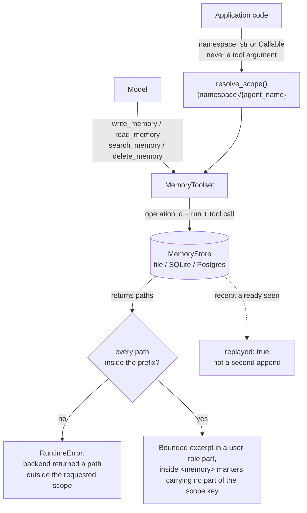

## 1. Executive Summary

Pydantic AI Harness is a companion package to Pydantic AI, MIT-licensed, and its
`memory` capability is 2,483 lines carrying four model-facing tools —
`write_memory`, `read_memory`, `delete_memory`, `search_memory` — over a
notebook of Markdown files. `MEMORY.md` is the notebook; other files hold longer
notes the model reads on demand. This is the same shape as
[Basic Memory](../basic-memory/) and [claude-mem](../claude-mem/), and it is the
first instance of that shape in this atlas built by people who write database
libraries for a living.

**The mechanism worth the visit is scope, and it goes one step further than
anything else here.** The namespace is `str | Callable[[RunContext], str]`,
resolved by application code and documented as *"never exposed as a tool
argument"*; `resolve_scope` composes it into `{namespace}/{agent_name}`
(`_capability.py:134`) and every tool prefixes paths with it. So a model cannot
ask for another tenant's notebook, because there is no argument in which to name
one. Google's ADK reaches the same end by making `user_id` a required parameter —
strong, and it still trusts the implementation to use it.

This one **checks**, at three call sites. The subfile listing verifies every
returned path against the requested prefix (`_toolset.py:118`); the bounded
search fallback verifies every path it scans (`:574`); and the store-provided
search results are verified again with a message of their own — `'memory search
backend returned a result outside the requested scope'` (`:628`). The
`MemoryStore` Protocol is public and third-party stores are expected; the
capability treats its own backend as untrusted and validates the boundary on the
way back — a scope filter that asserts it worked, rather than trusting that it
did.

**And neither segment of the scope key reaches the model.** The injected block
carries no heading by default, because it already sits inside `<memory>` markers;
a separate `heading` field labels it when an agent carries several notebooks, and
`agent_name` is documented as a "storage segment … never rendered into the
model-facing memory block". The docs say the consequence out loud: "`agent_name`
is a storage key and never appears in the prompt, so it can't label them." Two
tests hold the line — one asserts a populated block contains no `## ` heading and
does not contain the agent segment `main`, another that instructions carrying
`## Team notes` do not carry the storage id `storage-id`. A scope key that is
neither nameable nor observable is a stronger claim than one that is merely
unnameable.

The write path is the second reason to read it. Every write and delete carries a
`MemoryOperation` derived from the run id and the tool call id, and the store
records a receipt against it, so a retried tool call returns
`{'replayed': True}` rather than appending the same note twice. On top of that,
writes use optimistic concurrency on a per-file version with a CAS retry and a
`MemoryConflictError` when it exhausts. Concurrent writes are a question this
atlas asks of every system and few answer:
[Mastra](../mastra-observational-memory/) prevents lost updates with per-scope
locks, [Logseq](../logseq/) settles for last-write-wins. This one handles the
*duplicate*-update problem as well, which is the failure an agent framework
actually hits when a tool call is retried after a timeout.

What it does not have is any notion of belief. A memory is a line of Markdown.
There is no status, no confidence, no source, no timestamp on a fact, and — most
consequentially — `delete_memory` is deliberately **content-free**: a test
asserts that the deleted body does not appear in the tool's return value. That
is the right call for a tool result the model will read back, and it means the
system has no record anywhere that a particular value was rejected.

## 2. Mental Model

The epistemic model is the one a notebook has. Something is true because the
model wrote it down, it stops being true when the model edits or deletes the
line, and nothing else participates. There is no extraction pass proposing
candidates, no consolidation revisiting old notes, and no gate between the
model's judgement and the durable store — `write_memory` is the model's decision
and the file changes.

What replaces trust machinery is **bounded exposure**. The capability's real
argument is that a memory system's risk is what reaches the prompt, so the
default injection is a token-budgeted excerpt in a *user-role* part wrapped in
`<memory>` delimiters, kept separate from the trusted instructions, with
overflow replaced by a pointer telling the model to call `read_memory` or
`search_memory`. Model-written content is structurally marked as model-written
and can never silently occupy the whole context. That is a smaller claim than
most systems here make and a much more defensible one.

## 3. Architecture

There is nothing to operate. `Memory(FileStore('.agent-memory'))` is the whole
deployment for the local case: Markdown files in a directory, with a SQLite
sidecar holding `file_state`, `file_metadata` and `memory_operations` for
versions, generations and receipts. `InMemoryStore` is the test and ephemeral
case. `_postgres.py` (297 lines) is the multi-tenant one. A separate
`SqliteMemoryStore` provides transactional CAS with the same receipt model.

The store contract is two Protocols: `MemoryStore` with `read`, `get_operation`,
`write`, `delete`, `list_paths`, and `SearchableMemoryStore` adding `search`.
Splitting search into an optional extension is the right shape — a store that
cannot search degrades to a bounded scan the capability performs itself, rather
than being excluded.

## 4. Essential Implementation Paths

- `pydantic_ai_harness/memory/_store.py` (1,117) — the Protocols, the three
  stores, the schemas, CAS, receipts, `_recover`.
- `pydantic_ai_harness/memory/_toolset.py` (662) — the four tools, scope
  composition, the out-of-scope check, bounded search fallback.
- `pydantic_ai_harness/memory/_capability.py` (358) — namespace resolution,
  the token budget, instruction and context assembly, and `_load_snapshot`.
- `pydantic_ai_harness/memory/_postgres.py` (297) — the multi-tenant backend.
- `tests/memory/test_memory.py` (1,436) and `test_stores.py` (1,214).

## 5. Memory Data Model

A file, and the bookkeeping around it. `MemoryFile` carries path, content and a
version; `file_state` holds `path`, `last_operation_id`, `version` and
`fingerprint`; a `generation` counter in `file_metadata` detects
out-of-band changes to the directory. The fingerprint is what makes an
externally-edited file safe: a person can open `MEMORY.md` in an editor, and the
store notices the content no longer matches what it recorded.

There is no unit below the file. No fact, no entity, no claim, no id, and
therefore nothing to attach a status or a validity interval to. Every column
this atlas counts except scope is absent by design rather than by omission, and
the documentation does not pretend otherwise.

## 6. Retrieval Mechanics

Two paths. **Automatic injection** puts a bounded excerpt of `MEMORY.md` plus
the names of other files into the current request, sharing a `max_tokens` budget
(default 2,000, estimated at four characters per token) with the usage guidance,
and additionally capped by `max_lines`. The number of paths requested from the
backend is derived from the remaining budget, so the capability never asks for
an unbounded listing — a small discipline that most systems here skip, and the
reason a large notebook degrades into a pointer instead of a truncation.

**On demand**, `read_memory` returns a bounded prefix of one file and
`search_memory` runs text search subject to result, character and file-scan
limits, returning `scanned` and `truncated` alongside the matches so the model
can tell a complete search from a curtailed one. There is no embedding, no
ranking and no relevance model: this is grep with a budget, and for a notebook
of a few dozen files that is the correct engineering.

Scope applies to all of it, as described above, and is re-verified on return.

## 7. Write Mechanics

Writes block, and they are the model's own tool calls — there is no extraction
pass, so nothing is written that the model did not decide to write. `write_memory`
either appends to a file or replaces **one unique text fragment**, which is the
same safe-edit constraint a code-editing tool uses and rules out the ambiguous
multi-match rewrite.

Concurrency is handled twice over. The version on a file gives optimistic
concurrency with a CAS retry loop and `MemoryConflictError` on exhaustion; the
`MemoryOperation` id, derived from the run and tool call, gives idempotency, so
the same logical write attempted twice is detected as a replay rather than
applied twice. `_recover` completes or rolls back an operation interrupted
mid-flight using the receipt.

The lag before a memory is retrievable is zero. Nothing rewrites the store in
the background, and there is no compaction, decay or promotion.

## 8. Agent Integration

`Memory` is a Pydantic AI *capability*: it contributes a toolset and a
per-request context part to an `Agent`. It is re-exported from the package root
(`from pydantic_ai_harness import Memory`) with the stores under
`pydantic_ai_harness.memory`, and the docs say the package is 0.x so the API may
move, with "deprecation warnings and release-note migration guidance" as the
promised path. Spans are emitted with a `_scope_hash` — `sha256(scope)` truncated
to sixteen hex characters — rather than the scope itself, so observability does
not leak tenant identifiers into traces; a detail almost nothing else in this
atlas gets right.

**Automatic injection is a durable operation.** `_load_snapshot` carries
`@durable_operation('load_snapshot')` (`_capability.py:243`), and `Memory`
overrides its inherited capability id to the constant `'memory'` "because
durable-operation recovery needs a stable identity". Under Temporal or Prefect
the snapshot read is journaled and reused on replay; under DBOS it is a step. The
care is in the failure path: when the store raises and `injection_errors` is
`'ignore'`, the operation returns the exception *type name* and no content, under
a comment reading "Best-effort injection must not inherit an engine's retry
policy and stall a workflow." A best-effort read inside a retrying engine is
exactly where a system stalls, and this one refuses to.

Two residual constraints are documented rather than hidden. `store_resolver` and
a callable `namespace` run *before* the durable operation, "so they must be
deterministic and free of backend I/O; a per-tenant resolver that queries a
backend is not workflow-safe". And every request that loads a snapshot "records
one bounded snapshot result in workflow history, so choose `max_memory_size` and
`max_tokens` with the engine's history limits in mind" — the prompt budget
doubles as a workflow-history budget, which is not a consequence most designs
notice.

## 9. Reliability, Safety, and Trust

**The `memory_operations` table is not an audit log, and the distinction is
worth stating because it looks like one.** It records id, fingerprint, status,
kind, path, expected version and new content — everything an audit would want —
and then, on success, `UPDATE memory_operations SET status = 'completed',
expected_version = NULL, new_content = NULL`. The payload is deliberately
cleared once it is no longer needed for recovery. It is a write-ahead journal
with a receipt, not a history: after a successful write, the table knows *that*
an operation happened and no longer knows what it did. `audit_log` is withheld,
and the near-miss is exact — the mechanism that would carry the audit exists and
is emptied on purpose.

The intent is not in doubt. A schema migration guarded by `PRAGMA user_version`
runs `UPDATE memory_operations SET expected_version = NULL, new_content = NULL
WHERE status = 'completed' AND (expected_version IS NOT NULL OR new_content IS
NOT NULL)` on open, so a database written before the clearing landed has its old
payloads scrubbed too. This is a retention decision applied retroactively, which
is the opposite of an oversight and the reason the mark cannot be argued back in.
The Postgres journal settles it further: its operations table is
`id, fingerprint, version, existed, completed` — the payload columns do not
exist, so there is nothing to clear. Nothing prunes either table, so the one
structure here that only grows is a journal that has forgotten its contents.

**No tombstone, and the design pushes away from one.** `delete_memory` is
content-free by test (`test_delete_existing_is_content_free`), which is correct
for a tool result and means nothing durable records the deleted value. A model
that later re-derives the same claim writes it back with nothing to consult. For
a per-agent notebook this is a smaller exposure than in a system with an
extraction pipeline — there is no background pass to re-assert anything, only
the model itself.

**Which tier holds the scope guarantee?** Both the store and the toolset, and
they are independent. `PostgresMemoryStore.list_paths` calls
`validate_store_prefix` and then filters in SQL —
`SELECT path FROM {table} WHERE starts_with(path, $1) ORDER BY path LIMIT $2` —
so the predicate is on the read path in the database. The toolset then re-checks
every path the store returned. The mark rests on the SQL predicate; the
re-check is what makes a third-party store's bug loud instead of silent.

The main notebook is protected from deletion. Search results and injected context
are bounded on every axis the code can bound.

External edits surface as `MemoryConflictError`, with two distinct messages that
say what the system will and will not do. A CAS conflict is "memory path {path}
changed before it could be written"; an operation being replayed after a crash
onto a file someone has since edited is "externally modified memory path {path}
blocks recovery" — recovery *stops* rather than completing over a person's edit.
That is the right answer to the harder of the two cases.

## 10. Tests, Evals, and Benchmarks

2,650 lines of tests against 2,483 lines of implementation, none run here. The
ratio is unusual at this size for this atlas, and the content is better than the
ratio: the suite asserts what must **not** happen.

Nothing was executed, and the screen gives several reasons not to. It flags sixteen `conftest.py` files that run on pytest collection, a
`Makefile` default target, and an `AGENTS.md` and `CLAUDE.md` addressed to a
reading agent — data here, never instructions. It also flags
`.claude/settings.json` as carrying harness hooks; opening it shows a
`permissions.allow` list of four read-only `gh` commands and no `hooks` key, and
no JSON in the tree has one, so that finding is a false positive recorded rather
than propagated.

`test_delete_existing_is_content_free` asserts the deleted body is absent from
the result. A search test asserts `all('secret' not in repr(match))` under a
character budget. Injection tests assert that a superseded line — `'- version
one'` — and a `'stale fact'` from an earlier message history do not appear in
the captured model context, that an over-long file is not injected whole, and
that the file listing is dropped rather than overflowing. These are the
*content* kind of negative assertion rather than the boundary kind, which is the
harder and more useful half of the column, and they are aimed at the exact
failure the design worries about: material reaching the prompt that should not.

Two more of that kind guard the scope key itself. `test_heading_is_omitted_by_default`
seeds `main/MEMORY.md` with `'- a durable fact'`, captures the injected context,
and asserts it starts with `<memory>`, contains no `## ` line, and does not
contain the string `main`; a spec-construction test sets `agent_name='storage-id'`
with `heading='Team notes'` and asserts the rendered instructions contain
`## Team notes` and not `storage-id`. Both assert against a populated block, and
both fail the moment the storage key leaks into the prompt — which is the
specific regression the `heading` field was introduced to prevent.

`negative_eval` is earned. There is no benchmark, no retrieval-quality
measurement and no published number — consistent with a capability whose
retrieval is a bounded scan and makes no accuracy claim at all.

## 11. For Your Own Build

### Steal

- **Make the scope key unnameable.** If the tenant is resolved from run context
  and never appears in a tool signature, prompt injection cannot request another
  tenant's memory. This is strictly stronger than a required `user_id`
  parameter, and it costs one callable field.
- **Then check that your backend honoured it.** Verifying returned paths against
  the requested prefix and raising on a mismatch turns a third-party store's bug
  into a loud failure instead of a cross-tenant leak. Any system with a pluggable
  provider should copy this exact line.
- **Give every write an idempotency id derived from the run and tool call.**
  Agent frameworks retry. Without a receipt, a retried `write_memory` appends the
  note twice and nothing notices.
- **Budget the injection and degrade to a pointer.** Overflow replaced by "use
  `read_memory`" beats truncation, because the model learns the rest exists.
- **Return `scanned` and `truncated` from search.** A model that cannot tell a
  complete search from a curtailed one will treat absence as evidence.
- **Hash the scope in your spans.** Tenant identifiers do not belong in traces;
  `sha256(scope)[:16]` is enough to correlate and useless to an attacker.
- **Keep the storage key out of the prompt, and label with something else.** A
  scope segment rendered as a heading is a tenant identifier the model can read
  back. Separating the storage key from the display heading costs one field, and
  two tests keep them apart.
- **Make best-effort work refuse the engine's retry policy.** A snapshot read
  that fails inside a durable workflow must not be retried into a stall; return
  content-safe failure metadata as the operation's durable result instead.
- **Budget for the journal, not only the prompt.** If an injected snapshot is
  recorded in workflow history, the token budget is also a history budget, and
  the docs should say so before an operator discovers it.

### Avoid

- **Clearing the payload of the only table that records mutations.** Recovery
  and audit want the same row and disagree about its lifetime; if you want both,
  write the audit row separately before you clear the journal.
- **Assuming a content-free delete is a complete delete.** It is right for the
  tool result and it leaves nothing that can stop the value being written again.
- **Reading this as a memory system.** It is a notebook with excellent
  plumbing, and the plumbing is the transferable part.

### Fit

This is the right choice if you are already on Pydantic AI, your agent's memory
is genuinely notebook-shaped, and you care more about multi-tenant safety than
about recall quality. It suits a per-user assistant with tens of files, and it
suits it very well: the concurrency, idempotency and scope handling are what
teams usually discover they needed after shipping.

It is the wrong choice if you need memory to hold *claims* — anything you will
later want to mark uncertain, correct with provenance, or prove you deleted.
There is no unit below the file to attach that to, and adding one means building
a different system beside this one.

## 12. Open Questions

- **How does the notebook behave at size?** Every limit is per-request; nothing
  prunes, compacts or splits a file that grows for a year, and the degradation
  path is "the excerpt becomes a smaller fraction of the whole".
- **What happens to a durable workflow whose notebook is edited between the
  original run and the replay?** The recorded snapshot is reused on replay, which
  is correct for determinism and means the replayed run reasons over a notebook
  that no longer exists. Whether anything surfaces that divergence was not
  traced.
- **Does anything bound the growth of `memory_operations`?** No `DELETE`, prune
  or retention path exists against it in either backend, so completed receipts
  accumulate for the life of the store. For a per-agent notebook that is small;
  for a shared Postgres table across many tenants it is the row count nobody is
  watching.

## Appendix: File Index

| Path | Lines | What it holds |
| --- | --- | --- |
| `pydantic_ai_harness/memory/_store.py` | 1,117 | Protocols, three stores, schemas, CAS, receipts, recovery; the journal scrub at `:464-469`, the clearing `UPDATE` at `:575` |
| `pydantic_ai_harness/memory/_toolset.py` | 662 | Four tools, scope composition, the three out-of-scope raises at `:118`, `:574`, `:628`, the scope hash at `:644` |
| `pydantic_ai_harness/memory/_capability.py` | 358 | Namespace resolution at `:134`, the `heading` field at `:65`, the token budget, `_load_snapshot` at `:243` |
| `pydantic_ai_harness/memory/_postgres.py` | 297 | Multi-tenant backend; `starts_with` prefix filter at `:259`, the payload-free operations table at `:93-96` |
| `tests/memory/test_memory.py` | 1,436 | Tool behaviour, injection bounds, the negative assertions at `:560-565` and `:712-724` |
| `tests/memory/test_stores.py` | 1,214 | Store conformance, CAS, replay, recovery |
| `docs/memory.md` | 255 | The notebook model, injection modes, limits, the durable-execution table at `:227-237` |

**Recorded searches.** Run from a checkout at
`5dd1e0e3dd4becd2eb64cde6fe98802cd1b60221`; each backs an absence claim above.

- **No tool names a scope.** `grep -n 'async def write_memory\|async def read_memory\|async def delete_memory\|async def search_memory' -A 8 pydantic_ai_harness/memory/_toolset.py`
  — the parameters are `content`, `file`, `old_text`, `query`, and nothing else.
- **The scope key never reaches the prompt.**
  `grep -rn 'agent_name' pydantic_ai_harness/memory/*.py` — four hits, all in
  `_capability.py`: the field, the `resolve_scope` composition, and the two
  `from_spec` plumbing lines. None is a render call.
- **Nothing prunes the journal.**
  `grep -rn 'DELETE FROM memory_operations\|prune\|vacuum\|retention' pydantic_ai_harness/memory/*.py`
  — nothing.

## History

**2026-09-11** — [`5dd1e0e3dd4becd2eb64cde6fe98802cd1b60221`](https://github.com/pydantic/pydantic-ai-harness/commit/5dd1e0e3dd4becd2eb64cde6fe98802cd1b60221) — re-read. Screened again, and the screen is louder than it was: a `RUNS` finding on `.claude/settings.json`, an `AGENT` finding on each of `AGENTS.md` and `CLAUDE.md`, sixteen `conftest.py` files that execute on pytest collection, a `Makefile` default target, and `pyproject.toml`/`uv.lock` changed the same day. The `RUNS` finding was opened and is a false positive: the file holds a `permissions.allow` list of four read-only `gh` commands and no `hooks` key, and no `"hooks"` key exists in any JSON in the tree. The tree was read, never installed, and nothing was run. Marks unchanged at `scope_enforced` and `negative_eval`, with `capability_evidence` records added for both; the scope record names the SQL prefix filter in `PostgresMemoryStore` as the tier the mark rests on and the toolset re-check as the backstop, which answers one of the questions the previous entry left open. The other is answered too: an external edit onto a file with an in-flight operation refuses to complete recovery rather than overwriting it. The whole package grew by 316 files and 77,735 insertions, of which the memory capability is 283 lines across five files. Two changes matter. The injected block no longer carries `## Agent Memory ({agent_name})`: the storage segment is documented as never reaching the prompt, an optional `heading` labels the block when an agent carries several notebooks, and two committed tests assert the storage key is absent from a populated block and from the rendered instructions. And automatic snapshot loading is now `@durable_operation('load_snapshot')` with a constant capability id, so it is journaled under Temporal, Prefect and DBOS — with a failure path that returns the exception type rather than inheriting the engine's retry policy, and two residual constraints stated in the docs rather than left to be discovered. Corrections of counts: the capability is 2,483 lines against 2,650 of test, `_capability.py` is 358, `test_memory.py` is 1,436, and the scope re-check has three call sites rather than one.

**2026-07-30** — [`39ee7e08101c54b1ddf9c1e3a7f603f09ae34555`](https://github.com/pydantic/pydantic-ai-harness/commit/39ee7e08101c54b1ddf9c1e3a7f603f09ae34555) — first reading.
