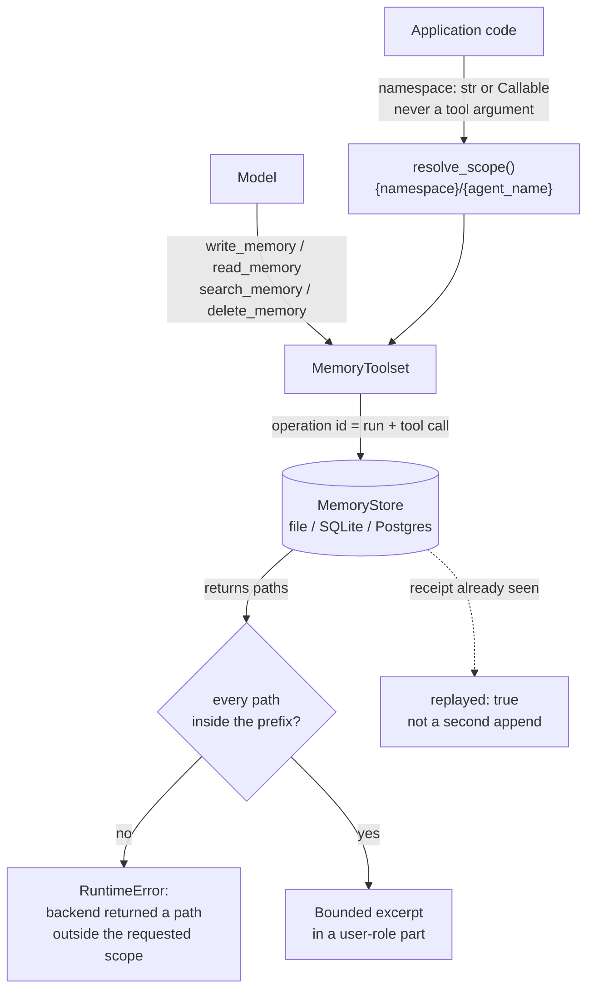

## 1. Executive Summary

Pydantic AI Harness is a companion package to Pydantic AI, MIT-licensed, and its
`memory` capability is 2,452 lines carrying four model-facing tools —
`write_memory`, `read_memory`, `delete_memory`, `search_memory` — over a
notebook of Markdown files. `MEMORY.md` is the notebook; other files hold longer
notes the model reads on demand. This is the same shape as
[Basic Memory](../basic-memory/) and [claude-mem](../claude-mem/), and it is the
first instance of that shape in this atlas built by people who write database
libraries for a living.

**The mechanism worth the visit is scope, and it goes one step further than
anything else here.** The namespace is `str | Callable[[RunContext], str]`,
resolved by application code and documented as *"never exposed as a tool
argument"*; `resolve_scope` composes it into `{namespace}/{agent_name}` and every
tool prefixes paths with it. So a model cannot ask for another tenant's notebook,
because there is no argument in which to name one. Google's ADK reaches the same
end by making `user_id` a required parameter — strong, and it still trusts the
implementation to use it. This one **checks**: `list_subfiles` verifies each
returned path against the requested prefix and raises
`RuntimeError('memory backend returned a path outside the requested scope')` if a
store hands back anything else. The `MemoryStore` Protocol is public and
third-party stores are expected; the capability treats its own backend as
untrusted and validates the boundary on the way back. No other system in this
atlas asserts its scope filter worked.

The write path is the second reason to read it. Every write and delete carries a
`MemoryOperation` derived from the run id and the tool call id, and the store
records a receipt against it, so a retried tool call returns
`{'replayed': True}` rather than appending the same note twice. On top of that,
writes use optimistic concurrency on a per-file version with a CAS retry and a
`MemoryConflictError` when it exhausts. The atlas asks about concurrent writes in
every report and had found the question answered twice in ninety-three —
[Mastra](../mastra-observational-memory/) preventing lost updates with per-scope
locks, [Logseq](../logseq/) settling for last-write-wins. This is the third, and
the only one that also handles the *duplicate*-update problem, which is the
failure an agent framework actually hits when a tool call is retried after a
timeout.

What it does not have is any notion of belief. A memory is a line of Markdown.
There is no status, no confidence, no source, no timestamp on a fact, and — most
consequentially — `delete_memory` is deliberately **content-free**: a test
asserts that the deleted body does not appear in the tool's return value. That
is the right call for a tool result the model will read back, and it means the
system has no record anywhere that a particular value was rejected.

## 2. Mental Model

The epistemic model is the one a notebook has. Something is true because the
model wrote it down, it stops being true when the model edits or deletes the
line, and nothing else participates. There is no extraction pass proposing
candidates, no consolidation revisiting old notes, and no gate between the
model's judgement and the durable store — `write_memory` is the model's decision
and the file changes.

What replaces trust machinery is **bounded exposure**. The capability's real
argument is that a memory system's risk is what reaches the prompt, so the
default injection is a token-budgeted excerpt in a *user-role* part wrapped in
`<memory>` delimiters, kept separate from the trusted instructions, with
overflow replaced by a pointer telling the model to call `read_memory` or
`search_memory`. Model-written content is structurally marked as model-written
and can never silently occupy the whole context. That is a smaller claim than
most systems here make and a much more defensible one.

## 3. Architecture

There is nothing to operate. `Memory(FileStore('.agent-memory'))` is the whole
deployment for the local case: Markdown files in a directory, with a SQLite
sidecar holding `file_state`, `file_metadata` and `memory_operations` for
versions, generations and receipts. `InMemoryStore` is the test and ephemeral
case. `_postgres.py` (297 lines) is the multi-tenant one. A separate
`SqliteMemoryStore` provides transactional CAS with the same receipt model.

The store contract is two Protocols: `MemoryStore` with `read`, `get_operation`,
`write`, `delete`, `list_paths`, and `SearchableMemoryStore` adding `search`.
Splitting search into an optional extension is the right shape — a store that
cannot search degrades to a bounded scan the capability performs itself, rather
than being excluded.

## 4. Essential Implementation Paths

- `pydantic_ai_harness/memory/_store.py` (1,117) — the Protocols, the three
  stores, the schemas, CAS, receipts, `_recover`.
- `pydantic_ai_harness/memory/_toolset.py` (662) — the four tools, scope
  composition, the out-of-scope check, bounded search fallback.
- `pydantic_ai_harness/memory/_capability.py` (327) — namespace resolution,
  the token budget, instruction and context assembly.
- `pydantic_ai_harness/memory/_postgres.py` (297) — the multi-tenant backend.
- `tests/memory/test_memory.py` (1,284) and `test_stores.py` (1,214).

## 5. Memory Data Model

A file, and the bookkeeping around it. `MemoryFile` carries path, content and a
version; `file_state` holds `path`, `last_operation_id`, `version` and
`fingerprint`; a `generation` counter in `file_metadata` detects
out-of-band changes to the directory. The fingerprint is what makes an
externally-edited file safe: a person can open `MEMORY.md` in an editor, and the
store notices the content no longer matches what it recorded.

There is no unit below the file. No fact, no entity, no claim, no id, and
therefore nothing to attach a status or a validity interval to. Every column
this atlas counts except scope is absent by design rather than by omission, and
the documentation does not pretend otherwise.

## 6. Retrieval Mechanics

Two paths. **Automatic injection** puts a bounded excerpt of `MEMORY.md` plus
the names of other files into the current request, sharing a `max_tokens` budget
(default 2,000, estimated at four characters per token) with the usage guidance,
and additionally capped by `max_lines`. The number of paths requested from the
backend is derived from the remaining budget, so the capability never asks for
an unbounded listing — a small discipline that most systems here skip, and the
reason a large notebook degrades into a pointer instead of a truncation.

**On demand**, `read_memory` returns a bounded prefix of one file and
`search_memory` runs text search subject to result, character and file-scan
limits, returning `scanned` and `truncated` alongside the matches so the model
can tell a complete search from a curtailed one. There is no embedding, no
ranking and no relevance model: this is grep with a budget, and for a notebook
of a few dozen files that is the correct engineering.

Scope applies to all of it, as described above, and is re-verified on return.

## 7. Write Mechanics

Writes block, and they are the model's own tool calls — there is no extraction
pass, so nothing is written that the model did not decide to write. `write_memory`
either appends to a file or replaces **one unique text fragment**, which is the
same safe-edit constraint a code-editing tool uses and rules out the ambiguous
multi-match rewrite.

Concurrency is handled twice over. The version on a file gives optimistic
concurrency with a CAS retry loop and `MemoryConflictError` on exhaustion; the
`MemoryOperation` id, derived from the run and tool call, gives idempotency, so
the same logical write attempted twice is detected as a replay rather than
applied twice. `_recover` completes or rolls back an operation interrupted
mid-flight using the receipt.

The lag before a memory is retrievable is zero. Nothing rewrites the store in
the background, and there is no compaction, decay or promotion.

## 8. Agent Integration

`Memory` is a Pydantic AI *capability*: it contributes a toolset and a
per-request context part to an `Agent`. The docs are explicit that it is imported
from the submodule and not re-exported, and that the package is 0.x so the API
may move. Spans are emitted with a `_scope_hash` rather than the scope itself,
so observability does not leak tenant identifiers into traces — a detail almost
nothing else in this atlas gets right.

## 9. Reliability, Safety, and Trust

**The `memory_operations` table is not an audit log, and the distinction is
worth stating because it looks like one.** It records id, fingerprint, status,
kind, path, expected version and new content — everything an audit would want —
and then, on success, `UPDATE memory_operations SET status = 'completed',
expected_version = NULL, new_content = NULL`. The payload is deliberately
cleared once it is no longer needed for recovery. It is a write-ahead journal
with a receipt, not a history: after a successful write, the table knows *that*
an operation happened and no longer knows what it did. `audit_log` is withheld,
and the near-miss is exact — the mechanism that would carry the audit exists and
is emptied on purpose.

**No tombstone, and the design pushes away from one.** `delete_memory` is
content-free by test (`test_delete_existing_is_content_free`), which is correct
for a tool result and means nothing durable records the deleted value. A model
that later re-derives the same claim writes it back with nothing to consult. For
a per-agent notebook this is a smaller exposure than in a system with an
extraction pipeline — there is no background pass to re-assert anything, only
the model itself.

The main notebook is protected from deletion. External edits are detected by
fingerprint. Search results and injected context are bounded on every axis the
code can bound.

## 10. Tests, Evals, and Benchmarks

2,498 lines of tests against 2,452 lines of implementation, none run here. That
ratio is the highest in this atlas at this size, and the content is better than
the ratio: the suite asserts what must **not** happen.

`test_delete_existing_is_content_free` asserts the deleted body is absent from
the result. A search test asserts `all('secret' not in repr(match))` under a
character budget. Injection tests assert that a superseded line — `'- version
one'` — and a `'stale fact'` from an earlier message history do not appear in
the captured model context, that an over-long file is not injected whole, and
that the file listing is dropped rather than overflowing. These are the
*content* kind of negative assertion rather than the boundary kind, which is the
harder and more useful half of the column, and they are aimed at the exact
failure the design worries about: material reaching the prompt that should not.

`negative_eval` is earned. There is no benchmark, no retrieval-quality
measurement and no published number — consistent with a capability whose
retrieval is a bounded scan and makes no accuracy claim at all.

## 11. For Your Own Build

### Steal

- **Make the scope key unnameable.** If the tenant is resolved from run context
  and never appears in a tool signature, prompt injection cannot request another
  tenant's memory. This is strictly stronger than a required `user_id`
  parameter, and it costs one callable field.
- **Then check that your backend honoured it.** Verifying returned paths against
  the requested prefix and raising on a mismatch turns a third-party store's bug
  into a loud failure instead of a cross-tenant leak. Any system with a pluggable
  provider should copy this exact line.
- **Give every write an idempotency id derived from the run and tool call.**
  Agent frameworks retry. Without a receipt, a retried `write_memory` appends the
  note twice and nothing notices.
- **Budget the injection and degrade to a pointer.** Overflow replaced by "use
  `read_memory`" beats truncation, because the model learns the rest exists.
- **Return `scanned` and `truncated` from search.** A model that cannot tell a
  complete search from a curtailed one will treat absence as evidence.
- **Hash the scope in your spans.** Tenant identifiers do not belong in traces.

### Avoid

- **Clearing the payload of the only table that records mutations.** Recovery
  and audit want the same row and disagree about its lifetime; if you want both,
  write the audit row separately before you clear the journal.
- **Assuming a content-free delete is a complete delete.** It is right for the
  tool result and it leaves nothing that can stop the value being written again.
- **Reading this as a memory system.** It is a notebook with excellent
  plumbing, and the plumbing is the transferable part.

### Fit

This is the right choice if you are already on Pydantic AI, your agent's memory
is genuinely notebook-shaped, and you care more about multi-tenant safety than
about recall quality. It suits a per-user assistant with tens of files, and it
suits it very well: the concurrency, idempotency and scope handling are what
teams usually discover they needed after shipping.

It is the wrong choice if you need memory to hold *claims* — anything you will
later want to mark uncertain, correct with provenance, or prove you deleted.
There is no unit below the file to attach that to, and adding one means building
a different system beside this one.

## 12. Open Questions

- **How does the notebook behave at size?** Every limit is per-request; nothing
  prunes, compacts or splits a file that grows for a year, and the degradation
  path is "the excerpt becomes a smaller fraction of the whole".
- **Does the Postgres store enforce scope in SQL, or rely on the toolset's
  prefix check?** The toolset's re-verification is the backstop either way, and
  which layer holds the guarantee was not traced here.
- **What does the fingerprint do when a person edits a file mid-run?** The
  mechanism detects it; what the capability then does to an in-flight CAS write
  was not established.

## Appendix: File Index

| Path | Lines | What it holds |
| --- | --- | --- |
| `pydantic_ai_harness/memory/_store.py` | 1,117 | Protocols, three stores, schemas, CAS, receipts, recovery |
| `pydantic_ai_harness/memory/_toolset.py` | 662 | Four tools, scope composition, the out-of-scope raise |
| `pydantic_ai_harness/memory/_capability.py` | 327 | Namespace resolution, token budget, context assembly |
| `pydantic_ai_harness/memory/_postgres.py` | 297 | Multi-tenant backend |
| `tests/memory/test_memory.py` | 1,284 | Tool behaviour, injection bounds, the negative assertions |
| `tests/memory/test_stores.py` | 1,214 | Store conformance, CAS, replay, recovery |
| `docs/memory.md` | 248 | The notebook model, injection modes, limits |

## History

**2026-07-30** — [`39ee7e08101c54b1ddf9c1e3a7f603f09ae34555`](https://github.com/pydantic/pydantic-ai-harness/commit/39ee7e08101c54b1ddf9c1e3a7f603f09ae34555) — first reading.
