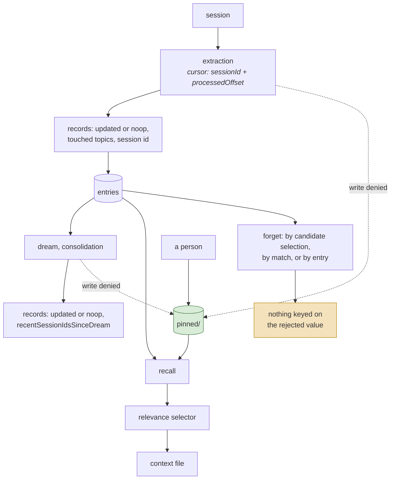

## 1. Executive Summary

Qwen Code is an Apache-2.0 coding agent — a fork of Gemini CLI, and the file
headers show it: some memory modules carry "Copyright 2025 Google LLC" and
others "Copyright 2026 Qwen Team", so a reader tracing provenance should expect
part of this subsystem to have an upstream.

The memory package is about 10,500 lines across 33 modules under
`packages/core/src/memory/`, with a test file beside nearly every one and about
18,000 lines of tests. The part worth the review is the **third tier**.

Memory is split across user, project and **team** scopes; the team tier is
committed to the repository, and a `pinned/` subdirectory inside the managed
roots is reserved for records a person writes and the automation may not touch. That makes it shared memory with a distribution
mechanism everyone already has — and it makes a leak permanent, which the code
addresses directly:

> "Team memory is committed to the repo and shared with every collaborator, so
> any write that targets the team directory and contains a detected secret is
> rejected — **unconditionally (even if the team tier is otherwise disabled)**,
> since the directory is source-controlled regardless."

Two things about that are worth copying. The guard is **fail-closed** on the
shared path, where shared memory more commonly either confirms or simply writes. And it ignores the feature flag: disabling the
team tier does not disable the guard, because the directory is still under
version control and a write landing there is still a commit away from being
public. Most feature flags in this position would gate the check along with the
feature, and the comment explains why this one does not.

The rest of the design is careful in the same register. Extraction runs against
a **resumable cursor** (`sessionId`, `processedOffset`), so an interrupted pass
does not restart or skip. Extraction and consolidation both record whether they
`updated` or were a `noop`, so "the pass ran and changed nothing" is
distinguishable from "the pass did not run" — a distinction memory systems rarely
record. Memories carry `messageIds` back to the
exchange that produced them.

Reservations: correction is `forget`, keyed on entries and matches, with no
value-level tombstone — and since extraction runs repeatedly over retained
sessions, a forgotten memory can be re-derived from the material that produced
it. The subsystem is also large enough that its own design documents describe
several partially-landed efforts.

## 2. Mental Model

Three tiers, and only one of them leaves the machine:

| Tier | Notes |
| --- | --- |
| `user/` | local |
| `project/` | local; partitioned by git root by default, or by exact workspace directory under `QWEN_CODE_MEMORY_PROJECT_SCOPE=workspace` |
| `team/` | **committed to the repository** — every write is path-checked, and secrets are refused with or without a flag |

Entry types are `user`, `feedback`, `project` and `reference`.

Cutting across the tiers is one directory that decides *who* may write rather
than *who may read*: `pinned/`, reserved inside both the project and the user
managed roots. A memory in `pinned/` is one a person authored, and the
background agents are refused write access to it by the permission layer. So the
state machine has two entrances and only one of them is automatic — and the
manual entrance is the only place a memory is safe from consolidation.



Three ways to forget and none of them records *what* was rejected, so the next
extraction can re-derive it from the same session. `pinned/` is the exception
that proves the shape: the only memory the automation cannot rewrite is memory
the automation never wrote.

## 3. Architecture

`packages/core/src/memory/` — 33 modules and about 9,170 lines beside a test file
for nearly every one: `manager.ts` (1,504), `channel-memory.ts` (555),
`prompt.ts` (542), `forget.ts` (529), `skillReviewAgentPlanner.ts` (468),
`writeContextFile.ts` (433), `memory-scoped-agent-config.ts` (410),
`recall.ts` (406), `channel-memory-document.ts` (373), `paths.ts` (362), plus
`dream.ts`, `extract.ts`, `extractionAgentPlanner.ts`, `dreamAgentPlanner.ts`,
`indexer.ts`, `scan.ts`, `refresh.ts`, `relevanceSelector.ts`, `remember.ts`,
`entries.ts`, `store.ts`, `memoryAge.ts`, `status.ts`, `secret-scanner.ts`,
`learn-skill-agent.ts`, `pending-skills.ts`, `scopes.ts`, and the team modules
(`team-memory-sync.ts`, `team-memory-git-status.ts`,
`team-memory-secret-guard.ts`, `team-paths.ts`).

`scopes.ts` is worth naming for a reason unrelated to memory: it holds two string
constants and *no imports at all*, with a comment explaining that this is
deliberate so the module can be subpath-imported "without pulling the core
barrel — and its 5 MB+ settings/TOML/glob transitive closure — into
bundle-critical paths". A scope vocabulary that half the codebase needs to agree
on is exactly the thing that should not drag a dependency graph behind it.

`packages/channels/base/` adds `channel-memory-intent.ts` and
`channel-memory-recall.ts`.

### Deployment and ergonomics

Nothing to stand up: memory is Markdown files on disk plus, for the team tier,
files in the repository the developer already has. No database, no vector
service, no key required to store anything — extraction and consolidation use
the model the CLI is already configured with.

The team tier's distribution story is its best ergonomic property. Sharing
memory across a team normally means a service, an account model and an
authorization scheme; here it means `git pull`.

## 4. Essential Implementation Paths

### A shared tier that is source-controlled, and guarded accordingly

Putting shared memory in the repository is a decision with an obvious upside and
one serious hazard, and the code treats the hazard as primary. `checkTeamMemorySecrets`
"returns an error message to block the write, or null to allow it", and the
docstring records a performance decision alongside the safety one: "the cheap
path check runs first, so non-memory writes pay only a single path compare."

The atlas's [explicit write destination](../../patterns/explicit-write-destination/)
pattern refuses a write that names no destination. This goes further on the
shared side — a class of shared write that is *refused* outright — and the unconditional
behaviour is the detail that makes it trustworthy. A guard that a feature flag
can switch off protects you only while the flag is set the way you remember.

### A human tier the automation is refused, in code as well as in the prompt

`AUTO_MEMORY_PINNED_DIRNAME = 'pinned'` names a directory reserved inside both
managed memory roots, and it is defended twice.

The planner prompts say so. `extractionAgentPlanner.ts` instructs the model to
treat `pinned/` as "protected read-only records … you may read them to avoid
duplicates, but never modify, overwrite, rename, merge into, or delete them",
and `dreamAgentPlanner.ts` goes further and removes it from consideration —
"leave `pinned/` out of consolidation analysis; do not list, read, or compare
its files during Dream", and "never use a pinned file as a merge target or
deletion candidate".

Then `memory-scoped-agent-config.ts` enforces it where the model cannot argue.
`isProtectedPinnedMemoryPath` runs inside the permission manager the memory
agents execute under, and a write landing there returns
`ManagedAutoMemory(<tool>: pinned memory is read-only)`. The containment is the
careful part: `createPinnedMemoryRoots` snapshots both a `literalPath` and a
`realpathSync`-resolved path per root, and the check matches a candidate against
either. The comment states the threat model it is snapshotting against —
"literal containment still protects the reserved path if it is created later;
retargeting symlinks during a run is outside the automatic worker's
capabilities."

This is the distinction the atlas keeps drawing between instructing a behaviour
and enforcing one, and here both halves are present with the code as the
backstop. It matters more than it looks: this system has three ways to forget
and no tombstone, so a memory a person cares about is otherwise one dream pass
away from being merged, rewritten or dropped. `pinned/` is the only place in the
design where a human decision outranks the consolidator.

### Project memory partitioned two ways, with the wider one as the fallback

`QWEN_CODE_MEMORY_PROJECT_SCOPE` takes `git-root` or `workspace`.
Under `git-root` — the default — `getAutoMemoryRoot` anchors at the nearest git
root without resolving linked worktrees to their canonical repository, so each
worktree keeps its own memory. Under `workspace` it keys on the exact resolved
directory instead, so nested workspaces inside one checkout do not share.

The failure direction is worth stating exactly, because the code's own comment
and the code's own behaviour point different ways. `resolveWorkspaceProjectScope`
returns the narrow scope only for the literal string `workspace` after trimming
and lower-casing; anything else yields `git-root`. An unrecognised non-empty
value prints one `console.warn` per process — the comment says this exists "so a
typo surfaces instead of silently falling back to the shared scope this flag
exists to prevent". The warning does surface it. The fallback happens anyway, and
it is toward the *wider* scope: `QWEN_CODE_MEMORY_PROJECT_SCOPE=Workspaces` gets
git-root memory plus one line on stderr, in a process whose output is a scrolling
agent session.

### Extraction that can be resumed rather than restarted

```ts
export interface AutoMemoryExtractCursor {
  sessionId?: string;
  processedOffset?: number;
  updatedAt: string;
}
```

An offset into a session, persisted. [nanobot](../nanobot/)'s best idea in this
atlas is not advancing a cursor after a failure; Qwen Code carries the cursor as
a first-class record, so an extraction interrupted halfway resumes at the
boundary rather than reprocessing the session or skipping the remainder.

This is the [recoverable background work](../../patterns/recoverable-background-work/)
requirement, met at the input rather than by a job queue.

### `noop` recorded as an outcome

```ts
lastExtractionStatus?: 'updated' | 'noop';
lastDreamStatus?: 'updated' | 'noop';
```

with `lastExtractionTouchedTopics`, `lastDreamTouchedTopics`, and
`recentSessionIdsSinceDream`.

Distinguishing "ran and found nothing" from "did not run" is a small schema
decision with a large operational return. Any memory with a
background pass has the failure where memory silently stops updating, and
without this field the two causes — the pass is broken, or there was genuinely
nothing to learn — look identical from the outside. Recording which *topics*
were touched narrows it further.

### Three forget paths

`selectManagedAutoMemoryForgetCandidates`, `forgetManagedAutoMemoryMatches` and
`forgetManagedAutoMemoryEntries` — a module that has grown to over 700 lines, with
a test file of more than 1,200. Forget selection is scoped per requested memory
scope, splits deletion seats evenly when both scopes overflow the quota, bounds
how much the unconfirmed path can delete at once, and wraps the user's forget
query as data in the selector prompt.

Selecting candidates separately from acting on them is the shape
[Memora](../memora/) gets right with its dry-run default: a selection function
can be called and inspected without mutating. Whether it is used that way was not
traced.

What is missing is the same thing missing nearly everywhere: none of the three
records that a *value* was rejected. Extraction runs repeatedly over retained
sessions, so a forgotten memory can be re-derived by the pass that produced it,
and nothing consults the forget history on the way in.

### Signal handling as scar tissue

`team-memory-sync.ts` explains its own choice of kill signal per git operation:

> "`killSignal` is chosen PER OP because Node's `timeout` does not escalate: a
> git child that traps/blocks the signal hangs past the timeout. SIGKILL is
> unblockable but skips cleanup, so it is safe ONLY for read-only / network ops
> (no index/lock to corrupt) — which are also the hang-prone ones. MUTATING ops
> (add/commit) default to SIGTERM so git can release `index.lock` and finish
> cleanup."

It also uses `execFile` with no shell "so paths with spaces / metacharacters are
safe".

This is the kind of comment that only exists after an incident, and it belongs in
the same category as [Waku](../waku-agent/)'s fail-open gate and
[OptMem](../optmem/)'s UTF-8 note. A memory tier that commits to a shared
repository can corrupt `index.lock` for a whole team, and the code knows it.

### Skills with a review step

`learn-skill-agent.ts`, `pending-skills.ts`, `skillReviewAgentPlanner.ts` and a
`skillReviewNudge` integration test describe skills that are learned, held
pending, and reviewed before use.

That is closer to the [skills as procedural memory](../../patterns/skills-as-procedural-memory/)
pattern's verified-execution gate than most systems manage — a review is not an
execution proof, but a pending state that something must clear is more than a
file appearing in a directory. The staging is structural rather than a flag:
`.qwen/pending-skills/` is a sibling of `.qwen/skills/` precisely so the loader
cannot reach it, and the comment in `skill-paths.ts:27-31` says so. Accepting
means moving the directory back, and the two functions that do it are called
from one place, the CLI's review dialog.

## 5. Memory Data Model

Entries typed `user | feedback | project | reference`, with
`AutoMemorySourceRef` carrying `sessionId`, `recordedAt` and `messageIds`, and
`AutoMemoryMetadata` carrying schema version, timestamps, and the extraction and
dream bookkeeping above. `AUTO_MEMORY_SCHEMA_VERSION` is explicit, so a format
change has somewhere to hang a migration.

What is absent:

- **No trust state.** A memory exists; nothing marks it candidate or verified.
- **No value-level tombstone**, so `forget` does not survive re-extraction.
- **No supersession chain** — a revised memory replaces rather than links.

The four types are a good default set, and the presence of `feedback` as a
distinct type from `user` is notable: guidance about how to work is separated
from facts about the person, which most systems collapse into one bucket.

Authorship is modelled too, and it is modelled as a **path rather than a field**.
Nothing on an entry records who wrote it; what records it is whether the file
sits under `pinned/`. That is cheap, greppable and enforceable by the same path
machinery that guards the team tier, and it has the limitation of every
location-as-metadata scheme: a memory cannot change hands. A machine-extracted
entry a person has since verified has no way to become pinned other than being
rewritten as a new file in a different directory, and the connection between the
two is not recorded anywhere.

## 6. Retrieval Mechanics

`indexer.ts` and `scan.ts` build the index; `relevanceSelector.ts` chooses what
to surface; `recall.ts` and the channel modules provide sync and async paths, and
`docs/design/2026-05-15-async-memory-recall-design.md` documents the latter. The
selected memories are rendered by `writeContextFile.ts`.

Recall reads three roots — the project's managed auto-memory directory, the
user-level directory and the in-repo team directory — and unions them; the
candidate scan is uncapped. Two exclusions apply before selection: documents
already surfaced in this session (`excludedFilePaths`, fed from the client's
`surfacedRelevantAutoMemoryPaths`) and documents that restate the schema of a tool
in the recent-tools list. The model selector is the precision gate, with a
deterministic scorer as the fallback, and that scorer is now multilingual.

**Scope is the directory, not a filter.** The project root is chosen by git root
or exact workspace, and nothing on a stored entry names a scope that a read then
filters on — recall's boundary is which directories it scans. The permission
layer that refuses the memory agents writes outside their roots is a write
boundary. Together they are real isolation for a single-user CLI, and they are a
partition rather than the read-path predicate `scope_enforced` counts.

`memoryAge.ts` exists, so age participates in selection.

## 7. Write Mechanics

Sessions feed extraction under the cursor; `remember.ts` handles explicit writes;
`dream.ts` consolidates; `refresh.ts` and `writeContextFile.ts` re-render the
context file. Team writes pass the secret guard, then the git sync.

### Operational cost

Extraction and dream are model calls that run against sessions rather than on
the critical path, so recall does not block on them. The design documents include
`2026-05-21-memory-pressure-monitor-design.md` and
`2026-07-11-managed-memory-microcompaction.md`, which indicates the context cost
of injected memory is treated as a managed budget rather than left to grow — the
concern the atlas's [benchmarks page](../../benchmarks/) says is usually
unmeasured.

The lag between an exchange and its extraction is bounded by when the background
pass runs, and the cursor makes the unprocessed remainder explicit, but no figure
for it was found.

## 8. Agent Integration

Memory is built into the CLI rather than mounted as a plugin, with
`memory-scoped-agent-config.ts` allowing configuration per scope and
`channel-memory-intent.ts` / `channel-memory-recall.ts` giving the agent an
intent and recall surface.

## 9. Reliability, Safety, and Trust

Strengths:

- **A shared tier distributed by git**, needing no service or account model.
- **Secret writes to the shared tier refused unconditionally**, independent of
  the feature flag, because the directory is source-controlled regardless.
- **A cheap path check first**, so the guard costs almost nothing on other
  writes.
- **`pinned/` enforced by the permission layer**, not only by the planner
  prompts, with literal and symlink-resolved containment and a stated threat
  model.
- **A resumable extraction cursor** with a processed offset.
- **`noop` recorded as an outcome** for both extraction and consolidation, with
  touched topics.
- **Provenance to message ids.**
- **An explicit schema version.**
- **Three distinct forget paths**, with candidate selection separable from
  action.
- **Per-operation kill-signal reasoning** in the git path, and `execFile` with no
  shell.
- **Skills held pending until reviewed.**
- **Tests beside nearly every module**, plus lifecycle and nudge integration
  tests.

Gaps:

- **No value-level tombstone**, in a system whose extraction re-reads retained
  sessions.
- **No trust state or supersession chain.**
- **Secret detection bounds the guard.** Unconditional refusal is only as good as
  `secret-scanner.ts`, and a missed pattern is a permanent commit.
- **The project-scope flag fails toward the wider scope.** A misspelled
  `QWEN_CODE_MEMORY_PROJECT_SCOPE` yields git-root memory and one `console.warn`
  per process. The safe default for a partitioning flag is the narrow side, and
  a warning on stderr in an agent session is a weak substitute for one.
- **`pinned/` protects the file, not the claim.** It is a location, so it can
  say a person wrote this and cannot say the person still believes it, nor link
  a pinned correction to the extracted entry it corrects.
- **Large surface with in-flight designs**, so behaviour may differ between the
  documents and the code.
- **Mixed provenance** — some modules are upstream Gemini CLI by their headers,
  which matters when deciding where to report a bug. The team-memory secret
  guard, which is the report's headline mechanism and has no obvious upstream
  analogue, carries a `Copyright 2025 Google LLC` header; that is evidence about
  header hygiene rather than about who wrote it.

## 10. Tests, Evals, and Benchmarks

Roughly half the files in the memory package are tests, including
`memoryLifecycle.integration.test.ts`, `skillReviewNudge.integration.test.ts`,
`team-memory-secret-guard.test.ts` and `team-memory-sync.test.ts`. There is also
`integration-tests/cli/save_memory.test.ts`.

Recall has an evaluation harness now. `recall-eval.test.ts` scores the
deterministic selector over a labeled corpus in English, Chinese, Japanese and
other categories (`__fixtures__/auto-memory-recall-eval.json`), holds a
multilingual quality floor, and keeps a frozen copy of the previous scorer so it
can assert English Recall@5 and no-result handling do not regress — the gate RFC
#7040 set for the multilingual change. `recall-delivery-eval.test.ts` compares a
single-path and a fast-path delivery design on the same corpus, including that
no-result queries stay silent under both. Scores are asserted in the tests rather
than committed as a results file.

`memory-scoped-agent-config.test.ts` is the densest of the older tests and it is
almost entirely written in the negative. Among its cases: *"denies memory-root symlinks
that resolve outside memory"*, *"denies dangling symlink leaves inside memory
roots"*, *"denies a write via a `.qwen` symlink escaping the project when the
target is absent"* and again *"when the target already exists"*, *"protects
paths below a dangling top-level pinned symlink"*, *"reports the outside-root
reason for a pinned symlink target outside memory"*, and — the control that
makes the rest mean something — *"leaves pinned memory writable when protection
is disabled"*. Each dangling-symlink case exists because `fs.existsSync` follows
links and reports a dangling one as missing, which is the decoy the shared
`realpathNearestExisting` helper in `packages/core/src/utils/paths.ts` was
written to defeat.

**Those are write-authorization tests.** The
[negative retrieval assertion](../../methodology/atlas-rubric/) rests on
`recall.test.ts` instead, where two cases assert what recall must not hand the
model and carry their own controls: a document already surfaced this session is
absent from the selection while a relevant one is present, and a document
restating an active tool's schema is kept out of both the model's candidates and
the fallback selection while two related documents are selected. Neither is a
boundary test — a project-A-writes, project-B-recalls assertion is still absent,
and the partitioning machinery it would test has two modes.

Nothing was run for this review, and apart from the recall harness above no
retrieval-quality benchmark was found. The test coverage tracks the risky logic
closely.

The measurement this design invites is the secret guard's recall: of secrets that
reach a team-memory write, what fraction does `secret-scanner.ts` catch? An
unconditional refusal is a strong guarantee about the *decision* and says nothing
about the *detector*.

## 11. For Your Own Build

### Steal

- **Distribute shared memory through the repository.** It removes a service, an
  account model and an authorization scheme, and every collaborator already has
  the client.
- **Refuse secret-bearing writes to a shared tier unconditionally**, ignoring the
  feature flag that governs the tier. A guard a flag can disable protects you
  only while the flag is set the way you remember.
- **Put the cheap check first**, so a guard on one path does not tax every other.
- **Persist an extraction cursor with an offset**, so an interrupted pass resumes
  instead of restarting or skipping.
- **Record `noop` as an outcome.** "Ran and changed nothing" and "did not run"
  look identical from outside, and only one of them is a bug.
- **Separate `feedback` from `user`.** How to work and who the person is are
  different kinds of memory with different lifetimes.
- **Choose kill signals per operation** when shelling out to git, and never
  SIGKILL a mutating one.
- **Give the human tier a directory the automation is refused, and enforce it
  below the prompt.** Telling a consolidator to skip a path is a request;
  denying the write in the permission layer is a guarantee, and the two together
  cost one constant and one containment check. In any design where a background
  pass may rewrite or merge memories, this is the only thing that makes a
  person's correction durable.
- **Resolve symlinks when a path decides a security question.** `fs.existsSync`
  follows links and calls a dangling one missing, which is enough to classify a
  write as outside a guarded directory while the bytes land inside it.

### Avoid

- **Forget without a tombstone**, where extraction re-reads the sessions that
  produced the memory. Three forget paths and none of them survive the next pass.
- **Trusting a detector to make a guarantee.** The refusal is unconditional; the
  detection is not, and the permanent consequence sits behind the weaker half.
- **A scope flag that falls back to the wider scope on a typo.** A partitioning
  option exists to keep two things apart, so an unparseable value should refuse
  or take the narrow side. Falling back to shared and printing a warning puts
  the consequence and the notice in different places, and only one of them is
  durable.

### Fit

Right for a team that already shares a repository and wants shared agent memory
without standing anything up — the git tier is a cheap, credible answer to
that problem. Right also as a study in operational care: the cursor,
the `noop` status and the signal handling are all things learned the hard way.
Wrong if you need memory that stays corrected: forget is thorough about removing
entries and silent about preventing their return, and in a system that
re-extracts continuously that is the gap that will find you.

## 12. Open Questions

- What stops a forgotten memory being re-extracted from the sessions that
  produced it?
- What is `secret-scanner.ts`'s recall, and has it been measured against real
  credential formats?
- Is `selectManagedAutoMemoryForgetCandidates` ever used as a preview, or only
  internally before acting?
- Which memory modules are inherited from Gemini CLI and which are Qwen's? The
  headers differ; the boundary was not traced, and at least one header
  contradicts the feature it sits on.
- Do the memory-pressure and microcompaction designs describe shipped behaviour
  or intent?
- Is there a surface that writes to `pinned/` — a command, a flag, a documented
  convention — or is it a directory a person is expected to populate by hand?
  The protection is thoroughly implemented; the authoring path was not found.

## Appendix: File Index

- Model: `packages/core/src/memory/types.ts` (`AUTO_MEMORY_TYPES`,
  `AutoMemorySourceRef`, `AutoMemoryMetadata`, `AutoMemoryExtractCursor`),
  `const.ts`.
- Team tier: `team-memory-secret-guard.ts` (`checkTeamMemorySecrets`),
  `team-memory-sync.ts`, `team-memory-git-status.ts`, `team-paths.ts`.
- Correction: `forget.ts` (`selectManagedAutoMemoryForgetCandidates`,
  `forgetManagedAutoMemoryMatches`, `forgetManagedAutoMemoryEntries`).
- Background: `extract.ts`, `extractionAgentPlanner.ts`, `dream.ts`,
  `dreamAgentPlanner.ts`, `refresh.ts`.
- Retrieval: `indexer.ts`, `scan.ts`, `relevanceSelector.ts`, `recall.ts`,
  `memoryAge.ts`, `writeContextFile.ts`.
- Pinned tier: `paths.ts` (`AUTO_MEMORY_PINNED_DIRNAME`),
  `memory-scoped-agent-config.ts` (`createPinnedMemoryRoots`,
  `isProtectedPinnedMemoryPath`), `extractionAgentPlanner.ts`,
  `dreamAgentPlanner.ts`, `packages/core/src/utils/paths.ts`
  (`realpathNearestExisting`).
- Scoping: `scopes.ts` (`MEMORY_PROJECT_SCOPES`), `paths.ts`
  (`resolveWorkspaceProjectScope`, `getAutoMemoryRoot`).
- Skills: `learn-skill-agent.ts`, `pending-skills.ts`,
  `skillReviewAgentPlanner.ts`.
- Channels: `packages/channels/base/src/channel-memory-intent.ts`,
  `channel-memory-recall.ts`.
- Design notes: `docs/design/2026-05-15-async-memory-recall-design.md`,
  `docs/design/auto-memory/`, `docs/design/2026-05-21-memory-pressure-monitor-design.md`,
  `docs/design/2026-07-11-managed-memory-microcompaction.md`.

## History

**2026-09-25** — [`537311b8a5d85fd12ab2cff84b418e3a908ca830`](https://github.com/QwenLM/qwen-code/commit/537311b8a5d85fd12ab2cff84b418e3a908ca830) — same pin. The comparison with explicit write destination described that pattern as asking for confirmation of shared writes; the pattern page states it as refusing a write with no named destination, and the sentence now compares against that. No mark moved.

**2026-09-19** — re-pinned to [`537311b8a5d85fd12ab2cff84b418e3a908ca830`](https://github.com/QwenLM/qwen-code/commit/537311b8a5d85fd12ab2cff84b418e3a908ca830), 80 commits on. Both marks stand. `human_review` was producer-tested rather than carried forward, and a pair of functions new since the last reading needed the check: `acceptPendingSkillFromTask` and `rejectPendingSkillFromTask` (`packages/core/src/memory/manager.ts:1103`, `:1111`) are named for the task record they look a staged skill up in, not for a caller that could be a task, and their only callers are the two handlers in the CLI review dialog. The staging itself is structural rather than a flag — `.qwen/pending-skills/` is a sibling of `.qwen/skills/` so the loader scanning the skills root cannot reach it, which the code states in as many words. The record now names the limit every coding agent carries: a general `shell` tool could move the directory, which is not the same as an approve verb on the tool surface. `negative_eval` stands with `excludedFilePaths` re-anchored. Screened again first; nothing was installed and no suite was run.

**2026-09-15** — [`d313505fdb7e31e795bab00f76ab8488ff72f90f`](https://github.com/QwenLM/qwen-code/commit/d313505fdb7e31e795bab00f76ab8488ff72f90f) — 1,349 commits on, 2026-09-15, with the memory package at +7,732/-453 across 41 files, most of it tests. Screened before reading: two auto-run surfaces (`.vscode/settings.json`, `.vscode/tasks.json`), nineteen build-time execution points, forty-five unpinned surfaces and thirty-four dependency surfaces inside the cooldown; nothing was installed or run. Marks changed in both directions on code that predates the previous pin. `negative_eval` is added: `recall.test.ts` already asserted that already-surfaced and active-tool-schema documents are excluded from recall, each with a control, and the reading that withheld the mark looked only at write-authorization tests. `scope_enforced` is withdrawn: project, user and team memory are separate directories that recall unions, the project root is chosen by git root or workspace, and no stored scope key is filtered on a read, so the isolation is a partition plus a write sandbox. Since the pin: a recall evaluation harness with a labeled multilingual corpus and a frozen previous scorer as the regression gate, a delivery-design evaluation, forget selection scoped and quota-split per scope, uncapped candidate scans, workspace-scoped memory tasks in the daemon, and git helper programs guarded on internal git calls. Corpus-ranking sentences were rewritten.

**2026-08-10** — [`8c90697aced835c8fa027861febcce7de02a9bc2`](https://github.com/QwenLM/qwen-code/commit/8c90697aced835c8fa027861febcce7de02a9bc2) — 515 commits on, with the memory package at +3,153/-140 across 38 files and one module added. No published claim was stale and no mark moved. Two mechanisms arrived: a `pinned/` directory enforced by the agents' permission layer as well as by their planner prompts, and a `QWEN_CODE_MEMORY_PROJECT_SCOPE` flag partitioning project memory by git root or by workspace. The central criticism holds — a grep of the whole memory package for a rejected-value record still returns nothing but unrelated uses of `suppress`. Module line counts were re-verified and three had drifted. `stack_source` promoted from `seeded` to `reviewed`. Screened before reading: 2 auto-run surfaces (`.vscode/settings.json`, `.vscode/tasks.json`), 18 build-time exec, 50 dependency surfaces inside the seven-day cooldown; nothing installed and nothing executed.

**2026-07-28** — [`6a432ad2ebce57b0b48cd3d6a8f4f7fab50c33fe`](https://github.com/QwenLM/qwen-code/commit/6a432ad2ebce57b0b48cd3d6a8f4f7fab50c33fe) — first reading.
