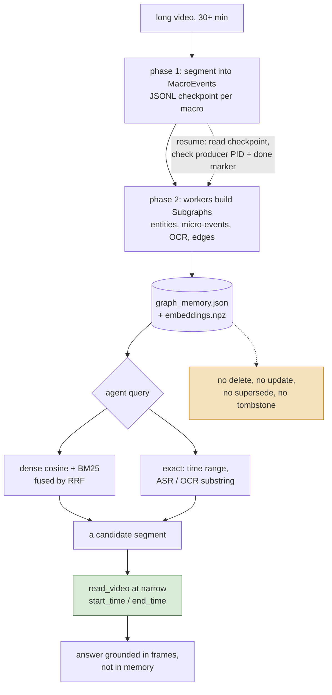

## 1. Executive Summary

Qwen-MM-Plugins is an Apache-2.0 plugin suite — "make any agent harness
multimodal-native" — that ships eight capabilities behind one MCP framework:
`blender`, `freecad`, `omni-av`, `video-edit`, `edu-agent`, `example`, `core`,
and `video-memory`. Seven of them are tool bundles. The eighth is a memory
system, and it is the only part of the repository this report covers.

`video-memory` is about 5,600 lines of Python that turn a long video into a
persistent, queryable graph and then hand an agent nine MCP tools to explore it.
The memory outlives the session that built it — it is two files sitting beside
the video on disk — and it is addressed by path, so a second session pointed at
the same file gets the same memory back.

What makes it worth a report is that it is a memory of **perception rather than
conversation**. Almost everything in this atlas remembers what someone said or
what an agent concluded. This remembers what was on screen: typed entities,
timestamped actions, on-screen text, and relations between them, arranged in a
four-level hierarchy so an agent can start at a story arc and descend to a
three-minute segment.

The retrieval is the strongest part and it is properly built. `embeddings.py`
maintains a dense index and a sparse BM25 index over the same nodes and fuses
them with reciprocal rank fusion — the docstring is exactly *"Hybrid search:
dense cosine + sparse BM25, fused with RRF"*. It also carries
`check_dimension_compatibility`, which detects a stored index built by a
different embedding model than the one now answering queries and says so, rather
than returning confident nonsense from mismatched vectors.

The weakest part is stated plainly by the design rather than hidden: **nothing
can be corrected**. There is no delete, forget, update, supersede or tombstone
surface anywhere in the capability. A mis-extracted entity, a wrong causal edge
or a hallucinated event is in the graph until somebody rebuilds the whole thing
from the video. The skill's own instructions compensate at the prompt level, and
the compensation is honest: after locating a segment through memory, the agent
*must* re-read the video at a narrow time range, "because memory is always coarse
and maybe inaccurate."

## 2. Mental Model

A memory here is **a node in a tree over one video's timeline**, and every node
is derived, never asserted. Nothing a user says enters this store.

The tree has four levels:

| Level | What it holds | Ids |
| --- | --- | --- |
| Root | Title, description, themes, key entities, emotional tone | — |
| SuperEvent | A narrative arc with a time range | `super_01` … |
| MacroEvent | A three-to-eight-minute segment with a summary, key entities, OCR text, a dense description and the ASR transcript | `macro_0001` … |
| Subgraph | The leaf: `Entity`, `MicroEvent`, `OnScreenText` and `Edge` records | `macro_0001:ent_001` … |

`Edge.relation_type` is drawn from `SEMANTIC`, `CAUSAL`, `TEMPORAL`,
`HIERARCHICAL`, `SPATIAL` and `IDENTITY` — a richer relation vocabulary than most
graph memories in this atlas commit to, and one that is produced by a model in a
single pass with nothing checking it afterwards.

The state machine is the shortest in this atlas: a memory is **built**, and then
it is **read**. There is no candidate state, no verification, no supersession, no
expiry and no deletion. The only transition after creation is one that operates
on the whole store — `merge_memories.py` concatenates several videos' graphs into
one, prefixing every id with a short per-video key.

Which means the interesting epistemic question is not how a thing becomes a
belief, because everything in the store has identical standing the moment it is
written. It is what the *reader* is told to do about that, and here the design
does something unusual: it puts the correction outside the memory entirely.

The green box is the design's answer to the amber one. Memory is not trusted to
be right; it is trusted to be *approximately where to look*, and the authoritative
read is always a fresh look at the source. That is a coherent position for a
store nobody can correct, and it is worth separating from the more common
position in this atlas, which is to treat retrieved memory as fact and have no
recovery path when it is wrong.

## 3. Architecture

A **library of MCP servers**, not a service. `src/mcp_framework.py` is the shared
harness; each capability ships `.claude-plugin/`, `.codex-plugin/`,
`.qoder-plugin/` and `.mcp.json` manifests so the same Python package mounts in
several harnesses. `video-memory` runs as one stdio MCP server exposing nine
tools.

The store is two files in a directory, and `loader.py` resolves them in a fixed
order: an explicit path, then a directory-level merged `graph_memory.json`, then
the per-video `<video_path>.memory/graph_memory.json`. `embeddings.npz` sits
beside the graph. There is no database.

Build is a separate offline program — `skill/script/build_memory/`, invoked
through `build_memory.sh`, not through the MCP server. It is two-phase:
`pipeline_worker.py` reads completed macro events from a JSONL checkpoint,
checks whether the phase-one producer is still alive with `_p1_alive(pid)`, and
consults a done marker to distinguish "producer finished" from "producer died".
That is a real resume, at the level of individual macro events, and it belongs
with the [recoverable background work](../../patterns/recoverable-background-work/)
pattern.

`time_system.py` is a pluggable adapter for the time axis: a `TimeSystem` base
class converting between seconds and display strings and patching time ranges in
place, with a `DefaultTimeSystem` and an `EgoLifeTimeSystem` that applies
per-day offsets and detects whether `merge_memories.py` already applied them.
The presence of a named research-dataset adapter is the clearest signal of what
this was tuned against.

### Deployment and ergonomics

Building requires a **DashScope API key** and a vision-language model —
`build_memory.sh` defaults to `qwen3.7-plus` and reads `$DASHSCOPE_API_KEY`. So
unlike most file-based memories in this atlas, you cannot store anything here
without a paid model call, and the cost scales with video length rather than with
usage.

Querying is cheaper but not free: `search_nodes` embeds the query, so the same
API is on the read path unless the embedding backend is local.

Nothing has to be running. The store is a JSON file, so it is readable and
hand-editable, and a person who disagrees with an extracted event can open it in
an editor — which, given section 7, is the only correction mechanism there is.

## 4. Essential Implementation Paths

**Build.** `build_memory.sh` parses `--model`, `--video-dir`, `--output-dir`,
`--api-key` and `--p2-workers`, then runs the two phases. Phase one segments the
video into `MacroEvent` records and appends them to a JSONL checkpoint. Phase two
fans out across workers, calling the model per macro event to produce the
`Subgraph` — entities, micro-events, on-screen text and edges — with
`prompts.py` holding the extraction prompts and `llm_client.py` the transport.
`build_graph.py` assembles the tree and `schema.py` defines every record as a
`@dataclass`.

**Embedding.** `embeddings.py` builds both indexes over the node texts.
`_embed_via_dashscope_native` batches at 256 with retries; `build()` parallelises
across workers and vstacks the result into a float32 array; `_build_sparse_index`
and `_tokenize` construct the BM25 side.

**Retrieval.** `search()` runs dense cosine over L2-normalised vectors and sparse
BM25 over the same nodes, then fuses by RRF. `check_dimension_compatibility`
compares the stored matrix's width against the current backend and raises with a
message naming the likely cause — a memory "built with a different model than the
current query backend".

**The nine tools.** `search_nodes` (embedding similarity over entity and event
nodes, returning top-k with scores and ego-graph context), `search_asr_text`,
`search_ocr_text`, `search_by_time`, `get_subgraph`, `get_macro_events`,
`get_super_events`, `get_summary`, `enumerate_events`.

`search_nodes`'s tool description is worth quoting because it is teaching query
formulation in the schema itself: the embedding "matches event descriptions, not
questions", with a worked good example — *"A player scores with an alley-oop
dunk"* — against a bad one, *"Which player scored the alley-oop?"*, marked
"question format, poor match with event descriptions". Most tool descriptions in
this atlas describe parameters. This one describes the failure mode of the
retriever it fronts.

**Merge.** `merge_memories.py` scans a directory for `*.mp4.memory/graph_memory.json`,
prefixes ids with a short video key, concatenates the graphs, and merges the
`.npz` files — "rebuilds corrupt ones", per its own docstring.

**Correction.** There is no path. A grep of the capability for `def delete`,
`def remove`, `def forget`, `def update`, `tombstone` and `correct` returns
nothing.

## 5. Memory Data Model

Seven dataclasses in `schema.py`, all plain and all derived:

- `MicroEvent` — `event_id`, `event_type`, `time_range`, `subject`, `object`,
  `action`, `description`, `macro_id`.
- `Entity` — `entity_id`, `name`, `entity_type`, `attributes`, `description`,
  `visual_grounding`, `macro_id`.
- `Edge` — `source_id`, `target_id`, `relation_label`, `relation_type`,
  `description`.
- `OnScreenText` — `text_id`, `text`, `time_range`, `description`, `macro_id`.
- `Subgraph`, `MacroEvent`, `SuperEvent` — the containers.

**Temporal fields are content time, not record time.** `time_range` says when
something happened *in the video*. Nothing records when the memory was written,
by which model, at which version, or from which build run. That is the absence
worth naming: this is a store whose every row is a model's opinion, and no row
carries the provenance that would let a later reader decide how much to trust it
or which build to blame.

**Scope is the filesystem path.** There is no user id, tenant id, agent id or
session id in any record. Two people querying the same file get the same memory,
which is correct for the use case and means the store has no boundary of its own.

There is no separation of episodic from semantic memory because everything is
episodic: the entire store is one video's events.

## 6. Retrieval Mechanics

Three retrieval modes, and they are genuinely different rather than three names
for a vector search.

**Hybrid semantic.** `search_nodes` embeds the query and runs dense cosine and
BM25 in parallel over the node set, fusing with RRF. This is the
[hybrid retrieval fusion](../../patterns/hybrid-retrieval-fusion/) pattern
implemented the way that page argues for — two arms whose failure modes differ,
combined by rank rather than by a tuned score blend, so neither arm's score
distribution has to be calibrated against the other's.

**Exact lexical.** `search_asr_text` and `search_ocr_text` search the transcript
and the on-screen text directly. These matter more than they look: a name, a
score, a caption or a slide title is exactly the material dense embeddings blur,
and OCR text as a first-class searchable field is something no other system in
this atlas has, because no other system is reading a screen.

**Structural.** `search_by_time`, `get_subgraph`, `get_macro_events`,
`get_super_events` and `enumerate_events` walk the tree rather than searching it,
which is what makes the hierarchy pay: an agent can bound a query to a time
range or a story arc and then search within it.

Token budgeting is by level. Starting at `get_summary` or `get_super_events`
returns tens of records; descending returns more. Nothing enforces a budget, and
nothing bounds the size of an `enumerate_events` result.

The failure modes follow from the build being a single model pass. **Under-recall
is bounded by whatever the extractor noticed** — an event the vision model did not
describe is not in the graph and no query will find it, which the routing rule
implicitly concedes by requiring a frame-level re-read. **Over-recall and false
recall are unbounded and unmarked**: a hallucinated entity is indistinguishable
from a real one, since neither carries a confidence, a source frame reference
beyond `visual_grounding`, or a verification state.

## 7. Write Mechanics

Writes happen **once, offline, in batch**, and never during a session. That is
unusual enough in this atlas to be the defining property: there is no capture
path, no hot-path extraction, no consolidation pass and no background worker
running alongside the agent. The agent that queries the memory cannot write to
it.

Deduplication is not attempted within a video. Across videos, `merge_memories.py`
avoids collisions by prefixing ids rather than by resolving that two videos
mention the same person — so a `PERSON` entity appearing in ten videos becomes
ten unrelated nodes, and the `IDENTITY` relation type that could express the link
is only ever populated inside one video's subgraph.

**Delete, update and forget do not exist.** Neither does conflict handling,
because nothing ever writes twice.

Noisy or adversarial input is worth stating precisely: the input is a video, and
the extractor is a vision-language model reading it. On-screen text is captured
verbatim into `OnScreenText.text` and is searchable and returnable to the agent.
Nothing marks that text as untrusted, so instructions rendered on screen in a
video arrive in the agent's context as memory content. No system in this atlas
has a clean answer to that, but most of them are not reading arbitrary footage.

### Operational cost

Nothing blocks the agent, because nothing is written while it runs. The build's
cost is one vision-model pass over the whole video plus an embedding pass over
every node, paid once per video before any query is possible — and the routing
rule says a thirty-minute video is the *lower* bound for using this at all.

The lag between an event happening and it being retrievable is the whole build,
which is the correct answer for recorded footage and the wrong one for anything
live.

No pass ever re-reads or rewrites the store.

## 8. Agent Integration

Nine MCP tools plus `skill/SKILL.md`, and the skill is the more interesting
half. It opens with a section headed **"ROUTING RULE — Read This First"** that
tells the agent when *not* to use its own default: for a video over thirty
minutes the agent must use this skill instead of `read_video`, because
`read_video` "samples too few frames once, which is ineffective and always misses
important content."

Then a four-step workflow: check whether `<video_path>.memory/` exists, query it
if so, build it if not, and — step four — after locating a segment, go back to
`read_video` with a narrow window.

Two things are worth taking from that. A memory skill that documents the
condition under which it is the wrong tool is rare, and a memory skill that ends
by handing control back to the primary tool is rarer. The memory is positioned as
an *index over a source that is still available*, not as a replacement for it.

The model has no agency over memory content: it can read, it cannot write, and
there is no tool that would let it.

## 9. Reliability, Safety, and Trust

**Provenance is thin.** `visual_grounding` on an entity is the only link back to
the footage, and nothing records the model, the build run or the timestamp of
extraction.

**There is no trust state and no uncertainty representation.** Every node reads
as equally true. The design's answer is procedural rather than structural — the
skill tells the agent memory is "coarse and maybe inaccurate" and mandates a
frame-level confirmation — which works exactly as well as the agent's compliance
with a prompt, and not at all when a tool result is consumed by something that
did not read the skill.

**The dimension check is the one real integrity mechanism.**
`check_dimension_compatibility` catches the specific silent failure where a store
embedded by one model is queried by another, and its error text names the cause
instead of surfacing a shape mismatch. That failure is easy to hit here, because
the store is a loose `.npz` beside a JSON file with nothing binding either to a
model identifier.

**Recovery is by rebuild.** The resumable checkpoint makes an interrupted build
cheap to finish, which is the right mechanism for the failure this design
actually has — a multi-hour model pass dying halfway.

**No multi-tenancy, and none claimed.** Anyone who can read the video directory
can read the memory.

## 10. Tests, Evals, and Benchmarks

**No paper.** There is no `CITATION.cff`, and no `arxiv`, `doi` or bibtex block
in the README or the docs directories. The `EgoLifeTimeSystem` adapter names a
published long-video benchmark, and that is the only research anchor in the tree
— an adapter for a dataset's time convention is evidence the code was run against
it, not a result.

**No committed benchmark, no eval harness, and no accuracy number** anywhere in
the repository. For a retrieval system this specific — hierarchical graph,
hybrid fusion, four-level descent — the absence of a single committed retrieval
measurement is the gap that matters most, because every design decision here is a
retrieval-quality decision.

The suite is 21 test files for the whole repository, and for this capability the
split is lopsided in the wrong direction.
`tests/test_build_memory.py` carries 26 test functions over the build pipeline.
`tests/test_video_memory.py` carries **two**: `test_vm_server_lists_tools` and
`test_vm_server_graceful_without_memory` — the server advertises its tools, and
it degrades gracefully when no memory exists. Neither touches retrieval. The
hybrid search, the RRF fusion, the dimension check and all nine tools are
uncovered.

**I did not run them.** The screen flagged `pyproject.toml` as changed the same
day, inside the seven-day cooldown, so nothing was installed, and
`tests/conftest.py` executes at pytest collection.

Before trusting this: a retrieval test with a known-answer fixture; an assertion
that RRF beats either arm alone on that fixture, since fusion is the design's
central claim; a case exercising `check_dimension_compatibility` from both sides;
and a merge test asserting that two videos' ids cannot collide.

## 11. For Your Own Build

### Steal

**Write the retriever's failure mode into the tool description.**
`search_nodes` tells the model that the index matches event descriptions rather
than questions, and gives a good query and a bad one side by side. The model
reads that string every time it considers the tool, which is the one place
guidance is guaranteed to be in context — better than a README nobody loads and
better than a system prompt competing with everything else.

**Check that the index and the query backend agree before searching.** A stored
embedding matrix and a live embedding model are two artifacts that can drift
apart with no error, and the result is not a crash but plausible, confidently
ranked garbage. One width comparison and a message naming the cause converts the
worst class of silent failure into a startup error.

**Give a hierarchy real entry points at every level.** The four-level tree is
only useful because there is a tool for each level, so an agent can start broad
and descend. A hierarchy that can only be entered at the leaves is a flat store
with extra fields.

**Say when your memory is the wrong tool.** The routing rule names a threshold —
thirty minutes — below which the agent should not use this at all, and step four
sends it back to the primary tool for the authoritative read. A memory that
positions itself as an index over a source that still exists is a much weaker
claim than "remember this", and much easier to keep true.

### Avoid

**Shipping a retriever with no retrieval test.** Hybrid fusion, hierarchical
descent and an embedding index are three independent things that can each be
subtly wrong while the server still lists its tools and returns results. Twenty-six
tests on the build and two on the query is coverage pointed at the half that
fails loudly.

**Treating text extracted from untrusted media as ordinary memory content.**
On-screen text is captured verbatim, stored, searched and returned. Whatever your
source medium is, text that came out of it and text a user typed should not
arrive in a prompt with the same standing.

**Deferring correction to the reader.** Telling the agent that memory is coarse
and must be re-verified is honest, and it is not a mechanism: it holds only while
the reader follows the instruction, and it does nothing about the wrong record,
which stays in the graph and will be retrieved again tomorrow. If a store cannot
be corrected, that is a design constraint to state in the schema — a build id, a
confidence, something a later pass can act on — not a paragraph in a skill file.

### Fit

Right for exactly what it says: an agent that must answer questions about hours
of recorded footage it cannot hold in context. In that job the offline build, the
lack of a write path and the absence of correction are all defensible, because the
source of truth is the video file, it is still there, and the memory's only job is
to point at the right minute.

Wrong as a template for anything an agent accumulates over time. Every property
that makes it fit its job — build once, never update, no provenance, no scope key,
no deletion — is a property you would have to remove to use it for memory about a
person, a project or a codebase. Read it for the retrieval layer and the routing
rule, which transfer cleanly, and leave the lifecycle behind.

The maintenance budget is low and the running cost is not: a DashScope key and a
vision-model pass over every hour of video, before the first question can be
asked.

## 12. Open Questions

- What retrieval accuracy does the hierarchy plus RRF actually achieve? Nothing
  in the repository measures it, and the design makes several strong claims that
  a fixture would settle.
- Does RRF beat dense alone on this content? Fusion is the central retrieval
  decision and the code contains no comparison.
- Is `EgoLifeTimeSystem` evidence of a published evaluation held elsewhere? The
  adapter implies a benchmark run this tree does not contain.
- How does the build behave when the vision model returns a malformed subgraph
  for one macro event — is that macro dropped, retried, or written partial? The
  checkpoint resumes at macro granularity, but the partial-failure semantics were
  not traced.
- What happens to `IDENTITY` edges across a merge? Ids are prefixed per video, so
  the same person in two videos becomes two nodes; whether anything downstream
  reconciles them was not found.

## Appendix: File Index

**Schema and store**
- `src/capabilities/video-memory/skill/script/build_memory/schema.py` — the seven dataclasses
- `.../qwen_mm_plugins_video_memory/loader.py` — three-step resolution of `graph_memory.json` and `embeddings.npz`
- `.../qwen_mm_plugins_video_memory/schema.py` — the query-side view of the same tree

**Build path**
- `.../build_memory/build_memory.sh` — entry point, model and worker flags
- `.../build_memory/pipeline_worker.py` — JSONL checkpoint, `_p1_alive`, done marker
- `.../build_memory/build_graph.py`, `prompts.py`, `llm_client.py`
- `.../build_memory/merge_memories.py` — cross-video concatenation with id prefixing

**Retrieval path**
- `.../qwen_mm_plugins_video_memory/embeddings.py` — dense + BM25 + RRF, `check_dimension_compatibility`
- `.../tools/search_nodes.py`, `search_asr_text.py`, `search_ocr_text.py`, `search_by_time.py`
- `.../tools/get_subgraph.py`, `get_macro_events.py`, `get_super_events.py`, `get_summary.py`, `enumerate_events.py`

**Time**
- `.../qwen_mm_plugins_video_memory/time_system.py` — `TimeSystem`, `DefaultTimeSystem`, `EgoLifeTimeSystem`, `detect_time_system`

**Integration**
- `src/mcp_framework.py` — the shared MCP harness
- `src/capabilities/video-memory/skill/SKILL.md` — the routing rule and workflow
- `.../.claude-plugin/plugin.json`, `.codex-plugin/plugin.json`, `.qoder-plugin/plugin.json`, `.mcp.json`

**Tests**
- `tests/test_build_memory.py` — 26 functions over the build
- `tests/test_video_memory.py` — two functions over the server

## History

**2026-08-10** — [`f4e02952a059f3a0a23081f72e5faa7956d1b3af`](https://github.com/QwenLM/Qwen-MM-Plugins/commit/f4e02952a059f3a0a23081f72e5faa7956d1b3af)
— first reading, covering the `video-memory` capability only; the other seven
capabilities are tool bundles and were not traced. Screened before reading: 0
auto-run surfaces, 1 build-time exec (`tests/conftest.py`, which executes at
pytest collection), 1 unpinned manifest, and `pyproject.toml` changed the same
day — inside the seven-day cooldown, so nothing was installed and nothing was
executed. `AGENTS.md` and `CLAUDE.md` are present and were read as data.
