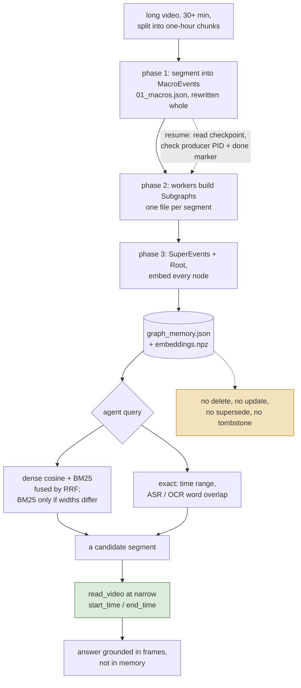

## 1. Executive Summary

Qwen-MM-Plugins is an Apache-2.0 plugin suite — "make any agent harness
multimodal-native" — with two memories of recorded video. `video-memory` builds
a four-level scene graph over hours of footage and searches it by dense-plus-BM25
fusion. `omni-memory` keeps semantic triples, clip records and a cast of people.
Neither can be corrected: the graph has no update or delete surface, and the
triple store's supersession stamp is written onto a copy that never reaches disk.

The other thirteen capabilities — `api`, `blender`, `core`, `edu-agent`,
`example`, `freecad`, `mhs`, `omni-chatcut`, `omni-skill-creator`,
`omni-video2note`, `search`, `video-edit` and `video-spatio` — are tool bundles,
and this report covers only the two memories. The search that sorted them is in
[Recorded Searches](#appendix-recorded-searches).

`omni-memory` is built around a semantic triple store rather than a scene graph,
read through twelve MCP tools: `search_memory`, `search_facts`,
`search_dialogue`, `get_people`, `get_person_dialogue`, `get_timeline`,
`get_moment`, `plan_and_search`, `replay_and_answer`, `watch_and_answer`,
`get_memory_status` and `get_memory_overview`. A store is located by video path
or by a namespace directory that several videos can stream into
(`service.py:58-71`). Both are physical partitions, with no key on a row.

Its one epistemic mechanism is supersession, and the stamp never reaches the
store. `_resolve` picks a winner by *"confidence > evidence-count >
recency(new)"*, copies the loser with `dict(lose)`, stamps the copy
`status = "superseded"` with `superseded_by`, and appends it to a list whose only
readers are counts in the build log and in `s2_stats`
(`stages.py:414-425`, `pipeline.py:353`, `:548-557`).

What that does to the stored rows depends on the key. When the contradicting
triple reuses the key, the winner overwrites the loser in place and the losing
value is gone. When it arrives under a different key with `conflicts_with`
naming the old one, and wins, the original row keeps `status = "active"`
(`stages.py:436-439`), so both claims are stored and both are retrieved. The
loser's evidence is unioned into the winner's either way (`stages.py:423`), which
raises the evidence count the next comparison ranks on.

`set_semantic` drops any superseded row before the store is serialised
(`store_writer.py:32-33`), and an append or resume re-seeds the working set from
that filtered store. The four read filters in `mem_core.py` (`:57`, `:125`,
`:180`, `:349`) therefore exclude nothing from a store this build writes, and
`search()`, behind the `search_memory` tool, carries no filter at all
(`mem_core.py:276-321`).

That earns neither of the two marks the shape resembles. Not `tombstone`: no
durable record of the losing value exists to consult on a later build. Not
`trust_state`: the one status that could withhold a triple is never persisted,
and the `confidence` label that feeds the comparison is a score, not a state.

`video-memory` turns a long video into a persistent, queryable graph and hands
an agent nine MCP tools to explore it. The memory outlives the session that built
it — two files beside the video on disk — and is addressed by path, so a second
session pointed at the same file gets the same memory back.

It is a memory of **perception rather than conversation**. It remembers what was
on screen: typed entities, timestamped actions, on-screen text, and relations
between them, arranged in a four-level hierarchy so an agent can start at a story
arc and descend to a three-minute segment.

The retrieval is the strongest part. `embeddings.py` maintains a dense index and
a sparse BM25 index over the same nodes and fuses them with reciprocal rank
fusion — the docstring is exactly *"Hybrid search: dense cosine + sparse BM25,
fused with RRF"*. `check_dimension_compatibility` detects a stored index built by
a different embedding model than the one answering queries. Its one caller
catches the error, disables the dense arm and logs a warning
(`loader.py:133-137`), so a mismatched store answers from BM25 alone rather than
from the wrong vector space, and the tool result does not say which arm ran.

The weakest part is stated plainly by the design rather than hidden: **nothing
can be corrected**. There is no delete, forget, update, supersede or tombstone
surface anywhere in the capability. A mis-extracted entity, a wrong causal edge
or a hallucinated event is in the graph until somebody rebuilds the whole thing
from the video. The skill's own instructions compensate at the prompt level:
after locating a segment through memory, the agent *must* re-read the video at a
narrow time range, "because memory is always coarse and maybe inaccurate."

## 2. Mental Model

A memory here is **a node in a tree over one video's timeline**, and every node
is derived, never asserted. Nothing a user says enters this store.

The tree has four levels:

| Level | What it holds | Ids |
| --- | --- | --- |
| Root | Title, description, themes, key entities, emotional tone | — |
| SuperEvent | A narrative arc with a time range | `super_01` … |
| MacroEvent | A three-to-eight-minute segment with a summary, key entities, OCR text, a dense description and the ASR transcript | `macro_0001` … |
| Subgraph | The leaf: `Entity`, `MicroEvent`, `OnScreenText` and `Edge` records | `macro_0001:ent_001` … |

`Edge.relation_type` is drawn from `SEMANTIC`, `CAUSAL`, `TEMPORAL`,
`HIERARCHICAL`, `SPATIAL` and `IDENTITY` — a richer relation vocabulary than most
graph memories in this atlas commit to, and one that is produced by a model in a
single pass with nothing checking it afterwards.

The state machine is the shortest in this atlas: a memory is **built**, and then
it is **read**. There is no candidate state, no verification, no supersession, no
expiry and no deletion. The only transition after creation is one that operates
on the whole store — `merge_memories.py` concatenates several videos' graphs into
one, prefixing every id with a short per-video key.

Which means the interesting epistemic question is not how a thing becomes a
belief, because everything in the store has identical standing the moment it is
written. It is what the *reader* is told to do about that, and here the design
does something unusual: it puts the correction outside the memory entirely.

The green box is the design's answer to the amber one. Memory is not trusted to
be right; it is trusted to be *approximately where to look*, and the authoritative
read is always a fresh look at the source. That is a coherent position for a
store nobody can correct, and it is worth separating from the more common
position in this atlas, which is to treat retrieved memory as fact and have no
recovery path when it is wrong.

## 3. Architecture

A **library of MCP servers**, not a service. `src/mcp_framework.py` is the shared
harness; each capability ships `.claude-plugin/`, `.codex-plugin/`,
`.qoder-plugin/` and `.mcp.json` manifests so the same Python package mounts in
several harnesses. `video-memory` runs as one stdio MCP server exposing nine
tools.

The store is two files in a directory, and `loader.py` resolves them in a fixed
order: `GRAPH_MEMORY_PATH` from the environment, then a directory-level merged
`graph_memory.json`, then the per-video `<video_path>.memory/graph_memory.json`.
`embeddings.npz` sits beside the graph. There is no database.

Build is a separate offline program — `skill/script/build_memory/`, invoked
through `build_memory.sh`, not through the MCP server. The script splits the
video into one-hour chunks (`CHUNK_SEC=3600`) and runs a phase-one and phase-two
process pair per chunk in parallel, then merges the chunks and runs phase three.
A chunk holding `02_done` is skipped on the next run.

Phase one writes the segment list to `01_macros.json`, rewritten whole through a
temporary file and `os.replace` (`build_graph.py:1434-1447`).
`pipeline_worker.py` polls that file, submits each new segment, writes one
`subgraphs/<macro_id>.json` per completed segment, and seeds a restart from the
files already present. It checks whether the phase-one producer is alive with
`_p1_alive(pid)` and consults the `01_done` marker to tell "producer finished"
from "producer died". That is a real resume at segment granularity, and it
belongs with the
[recoverable background work](../../patterns/recoverable-background-work/)
pattern.

A segment whose extraction raises is logged in `failed_ids`, and the chunk is
still marked `02_done` (`pipeline_worker.py:102-104`, `:150`). Phase three
reloads the subgraph files, retries the missing ones for up to three rounds, and
writes any still empty with a printed warning (`build_graph.py:907-932`,
`:1625-1640`). A segment that never extracts is in the graph with no entities
and no events.

`time_system.py` is a pluggable adapter for the time axis: a `TimeSystem` base
class converting between seconds and display strings and patching time ranges in
place, with a `DefaultTimeSystem` and an `EgoLifeTimeSystem` that applies
per-day offsets and detects whether `merge_memories.py` already applied them.
The presence of a named research-dataset adapter is the clearest signal of what
this was tuned against.

### Deployment and ergonomics

Building requires a **DashScope API key** and a vision-language model —
`build_memory.sh` defaults to `qwen3.7-plus` and reads `$DASHSCOPE_API_KEY`. You
cannot store anything here without a paid model call, and the cost scales with
video length rather than with usage. The same script pip-installs any missing
`opencv-python-headless`, `numpy` or `dashscope` from an Aliyun mirror at build
time (`build_memory.sh:89`).

Querying is cheaper but not free. `search_nodes` embeds the query through
DashScope's `qwen3-vl-embedding`, the only embedding backend in the capability
(`embeddings.py:40`), and every toolkit load spends one embedding call on the
dimension probe.

Nothing has to be running. The store is a JSON file, so it is readable and
hand-editable, and a person who disagrees with an extracted event can open it in
an editor — which, given section 7, is the only correction mechanism there is.

## 4. Essential Implementation Paths

**Build.** `build_memory.sh` parses `--model`, `--video-dir`, `--output-dir`,
`--api-key`, `--p2-workers`, `--chunk-sec`, `--no-asr` and `--asr-model`, then
runs the three phases. Phase one segments the video into `MacroEvent` records by
scene detection, with ASR in parallel. Phase two fans out across workers, calling
the model per segment to produce the `Subgraph`, with `prompts.py` holding the
extraction prompts and `llm_client.py` the transport. Phase three aggregates the
segments into SuperEvents and a Root. `build_graph.py` assembles the tree and
`schema.py` defines every record as a `@dataclass`.

**Embedding.** `embeddings.py` builds both indexes over the node texts.
`_embed_via_dashscope_native` caps each request at 10 texts
(`_NATIVE_MAX_BATCH`, `embeddings.py:43`, `:55`) and retries up to 80 times;
`build()` parallelises across workers and vstacks the result into a float32
array; `_build_sparse_index` and `_tokenize` construct the BM25 side.

**Retrieval.** `search()` restricts the candidates to the requested node types,
runs dense cosine over L2-normalised vectors and sparse BM25 over the same
nodes, then fuses by RRF with `k = 60` (`embeddings.py:329-407`).
`check_dimension_compatibility` compares the stored matrix's width against the
current backend and raises with a message naming the likely cause — a memory
"built with a different model than the current query backend". `load_toolkit`
catches that error and sets `_dense_disabled` (`loader.py:133-137`), and
`search()` makes the same switch per query on a width mismatch or a failed embed.

**The nine tools.** `search_nodes` (entity and event nodes by default, returning
top-k with scores and ego-graph context), `search_asr_text`, `search_ocr_text`,
`search_by_time`, `get_subgraph`, `get_macro_events`, `get_super_events`,
`get_summary`, `enumerate_events`.

`search_nodes`'s tool description teaches query formulation in the schema itself:
the embedding "matches event descriptions, not questions", with a worked good
example — *"A player scores with an alley-oop dunk"* — against a bad one,
*"Which player scored the alley-oop?"*, marked "question format, poor match with
event descriptions". It describes the failure mode of the retriever it fronts,
not only its parameters.

**Merge.** `merge_memories.py` scans a directory for `*.mp4.memory/graph_memory.json`,
prefixes ids with a short video key, concatenates the graphs, and merges the
`.npz` files — "rebuilds corrupt ones", per its own docstring.

**Correction.** There is no path. A grep of the capability for `def delete`,
`def remove`, `def forget`, `def update`, `tombstone` and `correct` returns
nothing.

## 5. Memory Data Model

Eleven dataclasses in `schema.py`, all plain and all derived:

- `MicroEvent` — `event_id`, `event_type`, `time_range`, `subject`, `object`,
  `action`, `description`, `macro_id`.
- `Entity` — `entity_id`, `name`, `entity_type`, `attributes`, `description`,
  `visual_grounding`, `macro_id`.
- `Edge` — `source_id`, `target_id`, `relation_label`, `relation_type`,
  `description`.
- `OnScreenText` — `text_id`, `text`, `time_range`, `description`, `macro_id`.
- `MacroRelation` and `SuperRelation` — `source`, `target`, `type`, `reason`:
  typed links between segments and between arcs.
- `VideoRoot` — `title`, `description`, `themes`, `key_entities`,
  `emotional_tone`.
- `Subgraph`, `MacroEvent`, `SuperEvent` and `HierarchicalGraphMemory` — the
  containers; the last carries `video_key` and `video_path` and saves through a
  temporary file and `os.replace`.

**Temporal fields are content time, not record time.** `time_range` says when
something happened *in the video*. No field in `graph_memory.json` or
`embeddings.npz` records when the memory was written, by which model, at which
version, or from which build run; a directory-mode build tees a timestamped log
beside the memory (`build_memory.sh:336`, `:355`), and the loader never reads it.
Every row is a model's opinion, and no row carries the provenance that would let
a later reader decide how much to trust it or which build to blame.

**Scope is the filesystem path.** There is no user id, tenant id, agent id or
session id in any record. Two people querying the same file get the same memory,
which is correct for the use case and means the store has no boundary of its own.

There is no separation of episodic from semantic memory because everything is
episodic: the entire store is one video's events.

## 6. Retrieval Mechanics

Three retrieval modes, and they are different mechanisms rather than three names
for a vector search.

**Hybrid semantic.** `search_nodes` embeds the query and runs dense cosine and
BM25 in parallel over the entity and event nodes, fusing with RRF. This is the
[hybrid retrieval fusion](../../patterns/hybrid-retrieval-fusion/) pattern
implemented the way that page argues for — two arms whose failure modes differ,
combined by rank rather than by a tuned score blend, so neither arm's score
distribution has to be calibrated against the other's.

**Transcript and on-screen text.** `search_asr_text` and `search_ocr_text` run
the same fused index restricted to `asr_text` or `on_screen_text` nodes, and fall
back to a word-overlap scan of the stored text when the index is absent or
returns nothing (`toolkit.py:467-523`, `:525`). A name, a score, a caption or a
slide title is the material dense embeddings blur, and here the BM25 arm and the
fallback scan both reach it.

**Structural.** `search_by_time`, `get_subgraph`, `get_macro_events`,
`get_super_events` and `enumerate_events` walk the tree rather than searching it,
which is what makes the hierarchy pay: an agent can bound a query to a time
range or a story arc and then search within it.

Token budgeting is by level. Starting at `get_summary` or `get_super_events`
returns tens of records; descending returns more. `enumerate_events` defaults to
120 matches and is capped at 300 (`toolkit.py:413`), with a 0.5 cosine floor that
applies only while the dense arm answers. A `CUTOFF_SEC` variable hides every
segment starting after that content time from every read tool
(`toolkit.py:83-91`, `loader.py:85`), which lets an evaluation ask what was
knowable at a given moment of the video.

The failure modes follow from the build being a single model pass. **Under-recall
is bounded by whatever the extractor noticed** — an event the vision model did not
describe is not in the graph and no query will find it, which the routing rule
implicitly concedes by requiring a frame-level re-read. **Over-recall and false
recall are unbounded and unmarked**: a hallucinated entity is indistinguishable
from a real one, since neither carries a confidence, a source frame reference
beyond `visual_grounding`, or a verification state.

## 7. Write Mechanics

Writes happen **once, offline, in batch**, and never during a session. That is
unusual enough in this atlas to be the defining property: there is no capture
path, no hot-path extraction, no consolidation pass and no background worker
running alongside the agent. The agent that queries the memory can start a
build over a video, as step three of the skill's workflow tells it to, and has no
way to author or edit a record.

Deduplication is not attempted within a video. Across videos, `merge_memories.py`
avoids collisions by prefixing ids rather than by resolving that two videos
mention the same person — so a `PERSON` entity appearing in ten videos becomes
ten unrelated nodes, and the `IDENTITY` relation type that could express the link
is only ever populated inside one video's subgraph.

**Delete, update and forget do not exist.** Neither does conflict handling,
because nothing ever writes twice.

Noisy or adversarial input is worth stating precisely: the input is a video, and
the extractor is a vision-language model reading it. On-screen text is captured
verbatim into `OnScreenText.text` and is searchable and returnable to the agent.
Nothing marks that text as untrusted, so instructions rendered on screen in a
video arrive in the agent's context as memory content. No system in this atlas
has a clean answer to that, but most of them are not reading arbitrary footage.

### Operational cost

Nothing blocks the agent, because nothing is written while it runs. The build's
cost is one vision-model pass over the whole video plus an embedding pass over
every node, paid once per video before any query is possible — and the routing
rule says a thirty-minute video is the *lower* bound for using this at all.

The lag between an event happening and it being retrievable is the whole build,
which is the correct answer for recorded footage and the wrong one for anything
live.

No pass ever re-reads or rewrites the store.

## 8. Agent Integration

Nine MCP tools plus `skill/SKILL.md`, and the skill is the more interesting
half. It opens with a section headed **"ROUTING RULE — Read This First"** that
tells the agent when *not* to use its own default: for a video over thirty
minutes the agent must use this skill instead of `read_video`, because
`read_video` "samples too few frames once, which is ineffective and always misses
important content."

Then a four-step workflow: check whether `<video_path>.memory/` exists, query it
if so, build it if not, and — step four — after locating a segment, go back to
`read_video` with a narrow window.

Two things are worth taking from that. A memory skill that documents the
condition under which it is the wrong tool is rare, and a memory skill that ends
by handing control back to the primary tool is rarer. The memory is positioned as
an *index over a source that is still available*, not as a replacement for it.

The model has no agency over memory content. It reads through nine tools and can
start a build from the shell; no MCP tool writes, edits or deletes a record.

## 9. Reliability, Safety, and Trust

**Provenance is thin.** `visual_grounding` on an entity is the only link back to
the footage, and no stored record names the model, the build run or the
timestamp of extraction.

**There is no trust state and no uncertainty representation.** Every node reads
as equally true. The design's answer is procedural rather than structural — the
skill tells the agent memory is "coarse and maybe inaccurate" and mandates a
frame-level confirmation — which works exactly as well as the agent's compliance
with a prompt, and not at all when a tool result is consumed by something that
did not read the skill.

**The dimension check keeps the wrong vector space out, and says so only in a
log.** `check_dimension_compatibility` catches the silent failure where a store
embedded by one model is queried by another. The loader turns its error into a
warning and a BM25-only index (`loader.py:133-137`), and the `search_nodes`
result carries scores and no mode field (`toolkit.py:346-400`). The agent
receives lexical-only results in the same shape as fused ones.

That failure is easy to hit here, because the store is a loose `.npz` beside a
JSON file with nothing binding either to a model identifier.

**Recovery is by rebuild.** The resumable checkpoint makes an interrupted build
cheap to finish, which is the right mechanism for the failure this design
actually has — a multi-hour model pass dying halfway.

**No multi-tenancy, and none claimed.** Anyone who can read the video directory
can read the memory.

**omni-memory keeps credentials out of its logs.** Both of its entry points
record the names of `MEM_*` variables and never their values, and upstream error
text reaches a log or a tool result only as an exception type and an HTTP status
(`service.py:28-36`, `watch.py:110-137`).

## 10. Tests, Evals, and Benchmarks

**No paper.** There is no `CITATION.cff` and no arXiv id or DOI in the README
or the docs. The README's one citation block, added on 22 September 2026, is a
`@misc` entry for the repository itself. The `EgoLifeTimeSystem` adapter names a
published long-video benchmark, and an adapter for a dataset's time convention is
evidence the code was run against it, not a result.

**No retrieval benchmark, eval harness or accuracy number is committed for
either memory.** The only eval scripts in the tree,
`omni-skill-creator/skill/scripts/run_eval.py` and `aggregate_benchmark.py`,
measure whether a generated skill's description triggers. For a retrieval system
this specific, the missing measurement is the gap that matters most, because
every design decision here is a retrieval-quality decision.

The suite is 56 test files for the whole repository. For `video-memory`,
`tests/test_build_memory.py` carries 27 functions, four of them over the hybrid
index with the embedding boundary monkeypatched, `tests/test_build_merge.py` one
over the chunk merge, and `tests/test_video_memory.py` two over the server:
it lists its tools, and it degrades gracefully with no memory.

`test_search_filters_by_node_type` is the one negative retrieval case. Over a
populated three-node index it asserts a non-empty result under an entity filter
in which every row is an entity, so the event and on-screen-text nodes must not
be returned (`tests/test_build_memory.py:268-274`).
`test_sparse_fallback_omits_zero_score_nodes` asserts the BM25 path returns
exactly the one matching node (`:281-287`). Both earn `negative_eval` about a
node type, not about a corrected value or a scope.

Nothing tests `check_dimension_compatibility` or the loader's fallback around
it, RRF against either arm alone, `merge_memories.py`, or any of the nine tool
handlers beyond the listing. For `omni-memory`, `tests/test_omni_memory.py`
carries 28 functions over configuration, encoding, error classification and the
build-to-server store boundary. None calls `merge_triple`, `_resolve` or
`set_semantic`, which is where a superseded row is stamped and then dropped.

**I did not run them.** The screen found `pyproject.toml` changed five days
before the pin, inside the seven-day cooldown, so nothing was installed, and
`tests/conftest.py` executes at pytest collection. The numpy-gated cases run in
CI, which installs `numpy<3` (`.github/workflows/ci.yml:54`).

Before trusting this:

- a retrieval test with a known-answer fixture, and an assertion that RRF beats
  either arm alone on it, since fusion is the design's central claim;
- a case asserting that a width mismatch is visible in the tool result;
- a merge test asserting that two videos' ids cannot collide;
- for `omni-memory`, a case asserting that a contradicted triple is absent from
  the written `store.json`.

## 11. For Your Own Build

### Steal

**Write the retriever's failure mode into the tool description.**
`search_nodes` tells the model that the index matches event descriptions rather
than questions, and gives a good query and a bad one side by side. The model
reads that string every time it considers the tool, which is the one place
guidance is guaranteed to be in context — better than a README nobody loads and
better than a system prompt competing with everything else.

**Check that the index and the query backend agree before searching, and put
the answer in the result.** A stored embedding matrix and a live embedding model
are two artifacts that can drift apart with no error, and the result is
plausible, confidently ranked garbage. One width comparison at load keeps the
wrong vector space out. Here the cause goes to a log line the agent never sees;
a `mode` field on each result would close that.

**Give a hierarchy real entry points at every level.** The four-level tree is
only useful because there is a tool for each level, so an agent can start broad
and descend. A hierarchy that can only be entered at the leaves is a flat store
with extra fields.

**Say when your memory is the wrong tool.** The routing rule names a threshold —
thirty minutes — below which the agent should not use this at all, and step four
sends it back to the primary tool for the authoritative read. A memory that
positions itself as an index over a source that still exists is a much weaker
claim than "remember this", and much easier to keep true.

### Avoid

**Testing the index and not the path around it.** The four index tests cover
ranking, the node-type filter and the BM25 fallback. Nothing tests the loader
that decides which of those runs, or asserts that fusion beats either arm, so
the switch most likely to fire in production is the one with no case.

**Stamping a status on a copy.** `omni-memory` marks the losing triple
superseded on `dict(lose)`, counts the list, and serialises a store that never
held the stamp. Every read filter downstream is correct and inert. Assert
against the written artifact, not the in-memory list the writer built.

**Treating text extracted from untrusted media as ordinary memory content.**
On-screen text is captured verbatim, stored, searched and returned. Whatever your
source medium is, text that came out of it and text a user typed should not
arrive in a prompt with the same standing.

**Deferring correction to the reader.** Telling the agent that memory is coarse
and must be re-verified is honest, and it is not a mechanism: it holds only while
the reader follows the instruction, and it does nothing about the wrong record,
which stays in the graph and will be retrieved again tomorrow. If a store cannot
be corrected, that is a design constraint to state in the schema — a build id, a
confidence, something a later pass can act on — not a paragraph in a skill file.

### Fit

Right for exactly what it says: an agent that must answer questions about hours
of recorded footage it cannot hold in context. In that job the offline build, the
lack of a write path and the absence of correction are all defensible, because the
source of truth is the video file, it is still there, and the memory's only job is
to point at the right minute.

Wrong as a template for anything an agent accumulates over time. Every property
that makes it fit its job — build once, never update, no provenance, no scope key,
no deletion — is a property you would have to remove to use it for memory about a
person, a project or a codebase. Read it for the retrieval layer and the routing
rule, which transfer cleanly, and leave the lifecycle behind.

The maintenance budget is low and the running cost is not: a DashScope key and a
vision-model pass over every hour of video, before the first question can be
asked.

## 12. Open Questions

- What retrieval accuracy does the hierarchy plus RRF actually achieve? Nothing
  in the repository measures it, and the design makes several strong claims that
  a fixture would settle.
- Does RRF beat dense alone on this content? Fusion is the central retrieval
  decision and the code contains no comparison.
- Is `EgoLifeTimeSystem` evidence of a published evaluation held outside this
  repository? The adapter and `CUTOFF_SEC` imply a benchmark run this tree does
  not contain.
- What happens to `IDENTITY` edges across a merge? Ids are prefixed per video, so
  the same person in two videos becomes two nodes; whether anything downstream
  reconciles them was not found.
- Is `omni-memory`'s superseded list meant to be persisted? The induction prompt
  calls the loser "soft-superseded" and the log counts it under 软删 (soft
  delete), while the writer drops it.

## Appendix: File Index

**Schema and store**
- `src/capabilities/video-memory/skill/script/build_memory/schema.py` — the eleven dataclasses
- `.../qwen_mm_plugins_video_memory/loader.py` — three-step resolution of `graph_memory.json` and `embeddings.npz`; the dimension-check fallback at `:133-137`
- `.../qwen_mm_plugins_video_memory/schema.py` — the query-side copy of the same file, byte-identical

**Build path**
- `.../build_memory/build_memory.sh` — entry point, chunking, model and worker flags
- `.../build_memory/pipeline_worker.py` — polls `01_macros.json`, one subgraph file per segment, `_p1_alive`, done markers
- `.../build_memory/build_graph.py`, `prompts.py`, `llm_client.py` — three phases, `_save_checkpoint`, phase-three retries
- `.../build_memory/merge_memories.py` — cross-video concatenation with id prefixing

**Retrieval path**
- `.../qwen_mm_plugins_video_memory/embeddings.py` — dense + BM25 + RRF, the node-type filter, `check_dimension_compatibility`
- `.../qwen_mm_plugins_video_memory/toolkit.py` — tool bodies, OCR and ASR fallback scans, the `enumerate_events` cap, the cutoff
- `.../tools/search_nodes.py`, `search_asr_text.py`, `search_ocr_text.py`, `search_by_time.py`
- `.../tools/get_subgraph.py`, `get_macro_events.py`, `get_super_events.py`, `get_summary.py`, `enumerate_events.py`

**Time**
- `.../qwen_mm_plugins_video_memory/time_system.py` — `TimeSystem`, `DefaultTimeSystem`, `EgoLifeTimeSystem`, `detect_time_system`

**omni-memory**
- `src/capabilities/omni-memory/skill/script/build_memory/stages.py` — `_resolve`, `merge_triple`, `stage2_rollup`, `stage2_finalize`
- `.../build_memory/pipeline.py` — the rollup driver and the `sem_superseded` list
- `.../build_memory/store_writer.py` — `set_semantic`, which drops superseded rows
- `.../qwen_mm_plugins_omni_memory/mem_core.py` — the read filters and `search()`
- `.../qwen_mm_plugins_omni_memory/service.py` — video-path and namespace resolution

**Integration**
- `src/mcp_framework.py` — the shared MCP harness
- `src/capabilities/video-memory/skill/SKILL.md` — the routing rule and workflow
- `.../.claude-plugin/plugin.json`, `.codex-plugin/plugin.json`, `.qoder-plugin/plugin.json`, `.mcp.json`

**Tests**
- `tests/test_build_memory.py` — 27 functions over the build and the index
- `tests/test_build_merge.py` — one function over the chunk merge
- `tests/test_video_memory.py` — two functions over the server
- `tests/test_omni_memory.py` — 28 functions over `omni-memory`

## Appendix: Recorded Searches

Run in a full clone at the pinned revision unless the check says otherwise.

| Claim | Check | Result at this pin |
| --- | --- | --- |
| No committed benchmark, no eval harness and no accuracy number for either memory | `git ls-tree -r --name-only HEAD \| grep -iE 'bench\|eval\|leaderboard\|result\|score\|\.csv$\|\.jsonl$'` | `tests/assets/sample.csv`, a `seedance-characters.jsonl` asset, and five `omni-skill-creator` eval files that measure skill triggering. |
| No paper | `grep -rniE 'arxiv\|bibtex\|@article\|@misc\|doi\.org\|citation' README* docs`; `ls CITATION*` | One `@misc` block in `README.md` and `README.zh.md` citing the repository; no arXiv id, DOI or `CITATION.cff`. |
| The other thirteen capabilities hold no memory store | `grep -rlE 'sqlite\|faiss\|embeddings\.npz\|store\.json\|vector' --include='*.py'` over each | Four files: a dubbing server, an audio dedup tool and two geometry modules; `SceneMemory` in `video-spatio` is a parameter with no class in the tree. |
| No correction surface in `video-memory` | `grep -rnE 'def (delete\|remove\|forget\|update)\|tombstone' src/capabilities/video-memory`; `grep -rn -i correct --include='*.py'` | Nothing. |
| The superseded stamp is never persisted | `grep -rn superseded src/capabilities/omni-memory` | Stamped only in `_resolve` on a copy; every other hit is a `!= "superseded"` filter or a count of `sem_superseded`. |
| No test reaches the supersession path | `grep -rn 'merge_triple\|_resolve\|stage2\|set_semantic\|conflicts_with' tests/` | No `omni-memory` hit. |
| No test reaches the dimension check | `grep -rn 'check_dimension\|_dense_disabled' tests/` | One hit, `test_build_memory.py:284`, which sets the flag directly. |
| The phase-one checkpoint is not JSONL | `grep -rn -i jsonl src/capabilities/video-memory` | Nothing. |

## History

**2026-09-26** — [`07736672525443c7f8a3f6405eed37d2236f023f`](https://github.com/QwenLM/Qwen-MM-Plugins/commit/07736672525443c7f8a3f6405eed37d2236f023f) — 44 commits on; `video-memory`'s tree is identical, and `omni-memory` changed only log and error-text redaction and its default model, so errors found are the atlas's own. Screened from a full clone: the plugin-marketplace auto-run surface, `pyproject.toml` inside the cooldown, one build-time exec; nothing installed, built or run. `negative_eval` is awarded on a node-type filter case present since the first pin ([section 10](#10-tests-evals-and-benchmarks)). Corrected: supersession stamps a copy that is never written, so the read filters exclude nothing ([section 1](#1-executive-summary)). A width mismatch disables the dense arm with a log line, not a startup error. Also corrected: a JSON-array checkpoint and three build phases, eleven dataclasses, the `enumerate_events` cap, 10-text embedding requests, the capability list and the test counts.

**2026-09-13** — [`ad8139d58ebca5740df2be3a6871a2e9c1d31e36`](https://github.com/QwenLM/Qwen-MM-Plugins/commit/ad8139d58ebca5740df2be3a6871a2e9c1d31e36) — re-read, 168 commits past the previous pin. A second memory capability arrived: `omni-memory`, a semantic triple store with a dozen MCP tools and 489 lines of committed tests, described in section 1. `capabilities` stays empty and the reasoning is recorded rather than assumed. Its supersession mechanism has a real producer and real consumers — `stages.py:414-422` stamps the losing triple `status = "superseded"` with a `superseded_by` key after a stated precedence, and four reads in `mem_core.py` filter on it — but supersession is keyed on the row that lost rather than on the value that was wrong, and the status is derived by comparison rather than asserted about truth, so neither `tombstone` nor `trust_state` is earned. There is one timestamp per moment and no record-time axis, so `bitemporal` stays withheld; the new tests assert error-absence and behaviour rather than that particular material is not retrieved, so `negative_eval` does too. Screened again first; nothing was installed and no suite was run.

**2026-08-10** — [`f4e02952a059f3a0a23081f72e5faa7956d1b3af`](https://github.com/QwenLM/Qwen-MM-Plugins/commit/f4e02952a059f3a0a23081f72e5faa7956d1b3af)
— first reading, covering the `video-memory` capability only; the other seven
capabilities are tool bundles and were not traced. Screened before reading: 0
auto-run surfaces, 1 build-time exec (`tests/conftest.py`, which executes at
pytest collection), 1 unpinned manifest, and `pyproject.toml` changed the same
day — inside the seven-day cooldown, so nothing was installed and nothing was
executed. `AGENTS.md` and `CLAUDE.md` are present and were read as data.
