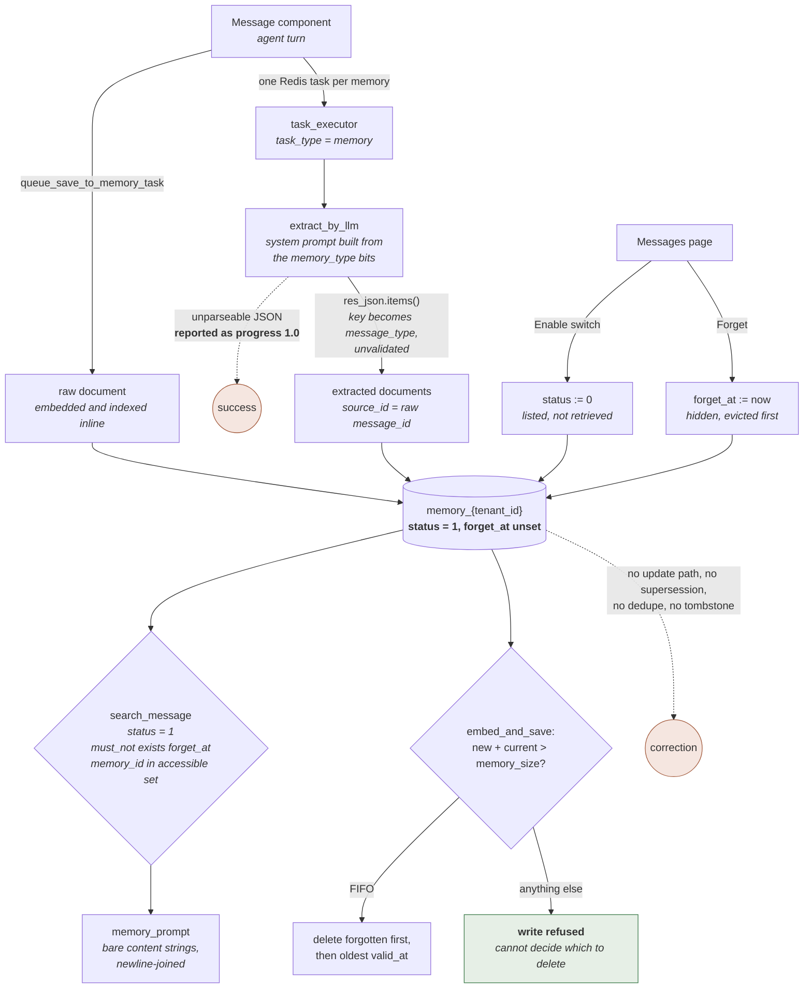

## 1. Executive Summary

**This report is not about retrieval-augmented generation.** RAGFlow is best known
as a RAG engine, and its knowledge bases, chunking pipeline and DeepDoc parsers
are a document index — content that is ingested once and read back, with no
notion of a belief that could later turn out to be wrong and need correcting.
That is outside what this atlas compares. Since version 0.27 the same repository
also ships a **Memory** feature with its own database table, its own REST
resource, its own page in the web UI, its own SDK module and its own agent
components: an agent's conversation turns are written into a store, an LLM splits
them into typed entries, and those entries are retrieved into later turns,
scoped, disabled and forgotten. That subsystem is what this report covers. The
in-session `RetrievalMemory` in `rag/advanced_rag/harness/memory.py` and the
`tool_call_summary` compaction in `agent/component/llm.py` share the word and are
conversation-window management; they are also out of scope.

The Memory feature landed on 10 December 2025 (`a1164b9c8`, "Feat/memory",
PR #11812) and has moved in 57 commits since, the most recent of which is the
pinned commit's own day. RAGFlow is Apache-2.0, at version 0.27.1, 8,924 commits
and 5,932 files since 12 December 2023.

**What is worth reading.** The scoping is the good part and it is done twice.
`api/apps/services/memory_api_service.py` resolves the caller's requested memory
ids through `_filter_accessible_memories` before any query is built, returns an
empty result rather than a broad one when nothing survives, and every doc-store
adapter then *overwrites* the memory predicate with
`condition["memory_id"] = memory_ids` so a caller cannot construct a query
without it. The index name is `memory_{tenant_id}`, so a cross-tenant read needs
the wrong index as well as the wrong id. Beside that, the capacity path fails
closed: when a memory is full and its `forgetting_policy` is not `FIFO`, the
write is refused with *"Memory size reached limit and cannot decide which to
delete"* rather than an arbitrary eviction. Both are the right instincts, and
both are rare enough in this corpus to name.

**What is weakest is the type system the feature is sold on.** `Memory.memory_type`
is an integer bit field whose help text reads *"1=raw, 2=semantic, 4=episodic,
8=procedural"*, and the docs describe four levels of memory. In the code the bits
do exactly two things: they decide whether extraction runs at all, and they
select which paragraphs go into the extraction system prompt. The `message_type`
stored on an entry is the top-level JSON key the LLM happened to return —
`for message_type, extracted_content_list in res_json.items()` at
`api/db/joint_services/memory_message_service.py:205` — and nothing validates it
against `MemoryType`, nothing checks it against the memory's own bits, and
nothing on the read path branches on it. Four typed memories behind one integer
is a strong claim; at this commit it is a label.

Three marks: `scope_enforced`, `human_review` and `negative_eval`. `tombstone`,
`trust_state`, `bitemporal` and `audit_log` were each examined and withheld, and
the near-misses are named in sections 2, 5 and 9 — `status` in particular is a
discrete field that genuinely withholds an entry from retrieval, and is a
two-valued switch the UI labels `Enable`.

## 2. Mental Model

A memory in RAGFlow is a **named container with an extraction policy**, not a
belief. The `memory` row holds a name, an embedding model, a chat model, a
temperature, a system prompt, a user prompt, a byte cap, a forgetting policy and
a `me|team` permission. Everything inside it is a *message document*.

Each agent turn that reaches a configured `Message` component produces one `raw`
document holding `f"User Input: {...}\nAgent Response: {...}"`, and then — if the
memory's bit field is anything other than `MemoryType.RAW` alone — an LLM pass
returns a JSON object whose keys become the `message_type` of zero or more child
documents, each pointing back at the raw parent through `source_id`. The parent
is the audit trail; the children are what a query is meant to hit.

**How something becomes a memory.** By being said. There is no gate. The
extraction prompt at `memory/utils/prompt_util.py` asks the model for `content`,
`valid_at` and `invalid_at` per item and caps it at five items per type, and
whatever comes back is embedded and indexed. `get_json_result_from_llm_response`
returns `{}` on a parse failure, which yields an empty extraction list, which
`save_extracted_to_memory_only` reports as *"No memory extracted from raw
dialogue"* at `progress: 1.0` — a **success**. A model that refused, rambled or
emitted malformed JSON is indistinguishable from a turn that genuinely contained
nothing worth keeping.

**How something stops being a memory.** Three exits, and a fourth that does not
exist.

- **Disabled** — `status` set to `0` through the Messages page or
  `PUT /messages/<memory_id>:<message_id>`. `MessageService.search_message`
  defaults `condition_dict["status"] = 1`, so the entry stops reaching agents and
  stays visible in the list. Reversible.
- **Forgotten** — `forget_at` stamped through the Forget action or
  `DELETE /messages/<memory_id>:<message_id>`. Every adapter's `search` defaults
  `hide_forgotten=True` and adds `must_not exists forget_at`. Not reversible
  through any surface in the tree: nothing clears `forget_at`.
- **Evicted** — hard deletion on the *next* write to a full memory.
  `MessageService.pick_messages_to_delete_by_fifo` drains forgotten documents
  first (ordered by `forget_at` ascending), then falls back to `valid_at`
  ascending. So "forget" is a soft delete that also volunteers the row for the
  next eviction, which is a better design than either half alone.
- **Corrected** — nothing. There is no update path for an entry's content, no
  supersession pointer, no contradiction handling, no dedupe. `MessageService.update_message`
  has three callers in the tree: two write `forget_at` and `status`, and the
  third, `fix_missing_tokenized_memory`, rewrites `content` with the value it
  just read in order to re-trigger tokenization on Elasticsearch. Re-running the
  same conversation
  writes the same fact again as a new document with a new id.

Nothing an agent does can move an entry between these states. The states are
moved by a person on the Messages page, or by the capacity check on a write.

The one field that looks epistemic is `status`, and it is worth being precise
about. It is a real discrete field, it is genuinely used to *withhold* rather than
to discount, and `docs/guides/memory/message_page.md` describes it accurately:
*"Controls whether this message participates in subsequent retrieval. After it is
disabled, the message is still retained, but it no longer affects Agent
retrieval results."* It is also a
boolean whose column header is `Enable`, with no vocabulary — it cannot separate
"never checked" from "checked and rejected", and nothing records which of those a
`0` means or who set it. That is why `trust_state` is withheld here and the
near-miss is written down instead.



## 3. Architecture

Memory is not a library. It is a feature of a multi-service deployment, and the
operator's cost is RAGFlow's cost, not the memory subsystem's.

**What has to be running.** The default `docker/docker-compose.yml` stack is a
metadata database (MySQL by default; PostgreSQL and GaussDB are supported through
`DB_TYPE`), Redis, MinIO, a doc-store engine, the API server, and at least one
task executor. Memory uses four of those five and cannot run without any of them:

- **Metadata database** — one Peewee model, `Memory` at
  `api/db/db_models.py:1809`, table `memory`. Configuration only; no message
  ever lands here.
- **Doc-store engine** — the messages. `common/settings.py:426-440` selects a
  `msgStoreConn` beside the RAG `docStoreConn`, with four adapters under
  `memory/utils/`: `es_conn.py` (571 lines), `infinity_conn.py` (516),
  `ob_conn.py` (585) and `gaussdb_conn.py` (1,607). Elasticsearch is the default.
- **Redis** — `REDIS_CONN.generate_auto_increment_id(namespace="memory")` is the
  only source of `message_id`, and `memory_{memory_id}` holds the running byte
  total that the capacity check reads. Redis is also the task queue.
- **Task executor** — `rag/svr/task_executor.py:1415` dispatches `task_type ==
  "memory"` to `handle_save_to_memory_task`. Without a worker, raw turns are
  stored and no extraction ever happens; the Messages page shows the task stuck.

**A gap in that selection worth naming.** `docStoreConn` is chosen from seven
engines — `elasticsearch`, `infinity`, `opensearch`, `oceanbase`, `seekdb`,
`gaussdb`, `serenedb` — using `lower_case_doc_engine`. `msgStoreConn` is chosen
from five, and the first two branches compare the *unlowered* `DOC_ENGINE`
directly:

```python
if DOC_ENGINE == "elasticsearch":
    msgStoreConn = memory_es_conn.ESConnection()
elif DOC_ENGINE == "infinity":
    ...
elif lower_case_doc_engine in ["oceanbase", "seekdb"]:
```

With `DOC_ENGINE=opensearch` or `serenedb`, or with `DOC_ENGINE=Elasticsearch`
spelled with a capital, RAGFlow starts normally and `settings.msgStoreConn` stays
`None`; the first memory operation fails on `None`. Nothing in the memory code
checks for it.

**Two runtimes, one API.** RAGFlow is mid-port to Go. `cmd/ragflow_server.go` and
`docker/docker-compose-go.yml` ship a second, complete implementation of the same
memory surface — `internal/router/router.go:505-523` registers the identical
`/memories` and `/messages` routes against `internal/handler/memory.go` (930
lines) over `internal/service/memory.go` (1,991) and `internal/dao/memory.go`
(411). The two are not equivalent, and section 7 records where they diverge. The
Go side is also where the memory tests worth having live.

**Human-readable and repairable?** Partly. The `memory` row is a normal SQL row.
The messages are documents in a search index; on Elasticsearch they are readable
and editable by hand, and `content_ltks` holds the original text alongside the
tokenized copy. The Redis byte total is a bare integer with no TTL that is never
deleted when a memory is, and no path recomputes it except a cold start with the
key absent — and that recompute (`MessageService.calculate_memory_size`) reads at
most `2048 * len(memory_ids)` documents, so a memory with more than 2,048
messages under-counts itself on every cold start.

## 4. Essential Implementation Paths

**Capture / write.** `agent/component/message.py:579` `Message._save_to_memory` →
`api/db/joint_services/memory_message_service.py:376` `queue_save_to_memory_task`.
Per memory id: allocate `message_id` from Redis, build the raw document, call
`embed_and_save` **inline**, insert a `Task` row with `task_type="memory"` and
`digest=str(raw_message_id)`, push a task message onto
`settings.get_svr_queue_name(priority=0)`.

**Extraction / consolidation.** `rag/svr/task_executor.py:1415` →
`memory_message_service.py:445` `handle_save_to_memory_task` →
`save_extracted_to_memory_only` → `extract_by_llm` (line 162) → `embed_and_save`
(line 210). `extract_by_llm` assembles the system prompt from
`PromptAssembler.assemble_system_prompt` unless `memory.system_prompt` is set,
calls `llm.async_chat`, parses with `get_json_result_from_llm_response`, and
flattens `res_json.items()` into `{content, valid_at, invalid_at, message_type}`
records. There is no consolidation path; nothing ever re-reads what was written.

**Retrieval.** `agent/tools/retrieval.py:255` `Retrieval._retrieve_memory` or
`api/apps/services/memory_api_service.py:359` `search_message` →
`memory_message_service.py:261` `query_message` → `memory/services/query.py`
(`MsgTextQuery.question`, `get_vector`) → `memory/services/messages.py:151`
`MessageService.search_message` → the selected adapter's `search`.

**Context assembly.** `rag/prompts/generator.py:177` `memory_prompt(message_list,
max_tokens)`. It walks the hits, counts tokens, stops at `max_tokens * 0.97`, and
returns a list of bare `content` strings. `_retrieve_memory` calls it with a
hardcoded `200000` and joins with newlines. Nothing about type, validity, source,
agent or session reaches the model.

**Update / delete / forget.** `memory_api_service.py:340` `forget_message` and
`:350` `update_message_status`, both through `MessageService.update_message`.
Memory deletion is `:243` `delete_memory` → `MemoryService.delete_by_id` plus
`MessageService.delete_message({"memory_id": memory_id}, ...)`. Eviction is
`embed_and_save`'s capacity branch at `memory_message_service.py:237-247`.

**Schema.** `api/db/db_models.py:1809` (`Memory`); the message document shape is
declared per adapter — `conf/message_infinity_mapping.json`,
`memory/utils/gaussdb_conn.py:163-184` (`build_memory_table_ddl`),
`memory/utils/ob_conn.py:30-60`, and implicitly by
`ESConnection.map_message_to_es_fields` at `memory/utils/es_conn.py:52-77`.

**API / SDK.** `api/apps/restful_apis/memory_api.py` (337 lines, ten routes),
`sdk/python/ragflow_sdk/modules/memory.py` plus seven methods on `RAGFlow`.
`rg -ni 'memory' mcp/` returns nothing: no MCP tool touches this subsystem.

**Tests.** `internal/service/memory_message_test.go` (732 lines) is the
substantial one; `test/testcases/test_web_api/test_message_app/` and
`test/testcases/test_sdk_api/test_message_management/` are live-server
integration suites. Section 10 separates them.

## 5. Memory Data Model

The `memory` row is configuration. The interesting object is the message
document, whose backend-neutral field set is fixed by
`memory/services/messages.py` and mapped per adapter:

| Field | Meaning | Read by |
| --- | --- | --- |
| `message_id` | Redis-allocated integer, globally sequential across all tenants and memories | doc `_id` is `f"{memory_id}_{message_id}"` |
| `message_type` | `raw`, or whatever JSON key the LLM returned | listing only, to select raw parents |
| `source_id` | parent `message_id`; `0` for a raw document | listing only, to group extractions under their parent |
| `memory_id` | container | forced into every query |
| `user_id` | canvas-supplied, may be a variable, may be `""` | optional query filter |
| `agent_id` | the canvas id | optional query filter |
| `session_id` | the canvas task id | optional filter, substring-matched |
| `content` / `content_embed` | the text and its vector | the two retrieval arms |
| `valid_at` | LLM-asserted validity start, or write time for a raw document | sort key, FIFO order key |
| `invalid_at` | LLM-asserted validity end | **nothing** |
| `forget_at` | soft-delete stamp | `must_not exists`, and FIFO priority |
| `status` | `1`/`0` | default retrieval filter |
| `zone_id` | — | **nothing** |

**Scoping.** `tenant_id` sits on the memory, not the message, and it is the
partition: the index is `memory_{tenant_id}` (`memory/services/query.py:29`).
`permissions` is `me` or `team`, and `team` widens access to any user who shares
a tenant with the owner — `_joined_tenant_ids(user_id)` returns `{user_id} ∪
{t["tenant_id"] for t in UserTenantService.get_user_tenant_relation_by_user_id(user_id)}`,
and `_memory_accessible` requires *both* `permissions == "team"` and membership.
`user_id`, `agent_id` and `session_id` are stored on every document and are
optional query filters; they are not boundaries, and an agent that omits
`user_id` reads every user's entries in the memory it was pointed at.

**Temporal fields, and why `bitemporal` is withheld.** `valid_at` and
`invalid_at` are validity time and are explicitly described that way in the
extraction prompt — *"valid_at: When the fact became true (e.g. law enactment,
discovery)"*. There is no record-time column. The message table has no
`created_at`, no `indexed_at`, nothing (`memory/utils/gaussdb_conn.py:163-184`
lists every column). Instead `valid_at` is stamped with `timestamp_to_date(current_timestamp())`
for raw documents and is simultaneously the FIFO eviction key, the recency sort
key on every read, and the LLM's assertion about the world for extracted
children. One column carrying both clocks is the specific confusion bitemporality
exists to prevent, and a fact the model dates to 2019 sorts and evicts as if it
were written in 2019.

`invalid_at` is worse than absent: it is asked for in the prompt, parsed,
normalized, stored in every backend, indexed in the GaussDB DDL, returned in
every select list, and rendered in the UI — and no filter, sort or branch
anywhere reads it. `rg -n 'invalid_at'` over the tree returns schema, mapping,
prompt and select-list occurrences and nothing else. An entry the model marked
expired is retrieved exactly like one that is still true.

`zone_id` is the same shape one step further along: it exists in all four
adapter schemas and in the Go OceanBase schema, and every reference in the tree
is `message.get("zone_id", 0)`. `rg -n 'zone_id.*[1-9]|ZoneID'` returns nothing.
Nothing ever sets it.

**Versioning, correction, contradiction.** None.
`rg -ni 'dedup|supersede|tombstone|conflict|revision|version' memory/ api/db/services/memory_service.py api/db/joint_services/memory_message_service.py api/apps/services/memory_api_service.py`
returns one comment about deduplicating *memory names* within a tenant and one
`replace_on_conflict=True` on the `Task` row. The message store has no notion of
one entry replacing another.

**Storage type.** `Memory.storage_type` is `table|graph` per the column help
text, and `common/constants.py:245` declares `MemoryStorageType { TABLE, GRAPH }`.
`rg -n 'MemoryStorageType'` returns exactly one line — the class definition.
Neither `create_memory` nor `update_memory` accepts the field, so nothing outside
a direct `UPDATE` can set it; every memory is `table`. The web settings form
declares `z.enum(['table', 'graph'])` and the hook that would submit it has the
key commented out at `web/src/pages/memory/memory-setting/hook.ts:20`. The
documentation is the honest surface here: *"Currently, Table (`table`) can be
selected."*

## 6. Retrieval Mechanics

One hybrid pass, no reranker, no query rewriting beyond tokenization.

`query_message` at `memory_message_service.py:261` builds three expressions:

- **Lexical** — `MsgTextQuery().question(question, min_match=similarity_threshold)`.
  This is RAGFlow's full-strength query builder reused for memory: term weights
  from `term_weight.Dealer`, WordNet synonym expansion through a Redis-backed
  `synonym.Dealer`, adjacent-pair phrase boosts at
  `max(w_left, w_right) * 2`, a Chinese branch with fine-grained tokenization,
  and a `minimum_should_match` derived from the caller's similarity threshold.
  The field searched is `tokenized_content_ltks`, written at index time as
  `fine_grained_tokenize(tokenize(content))`, so write-time and query-time
  tokenization match.
- **Dense** — `get_vector` encodes the query with the memory's embedding model and
  emits `MatchDenseExpr(f"q_{dim}_vec", ..., "cosine", topk=10, {"similarity": threshold})`.
  Note `topk=10` is hardcoded in `get_vector` regardless of the caller's `top_n`.
- **Fusion** — `FusionExpr("weighted_sum", top_n, {"weights": f"{k:g},{1-k:g}"})`
  where `k` is `keywords_similarity_weight` (default 0.7). Slot order is
  `[text, vector]`; the comment in the source says so and names the two adapters
  that depend on it. This ordering is one day old at the pinned commit —
  `cd27ae4c6`, "fix(memory): put the keyword weight in the text slot of the
  fusion expression" (PR #18989), landed 1 September 2026, and the Go test that
  guards it says the pair was previously emitted reversed in both runtimes,
  *"which handed every memory search the inverse of the requested hybrid
  balance."* The test deliberately uses asymmetric weights because *"an even
  split cannot tell the two orders apart"* — a good habit, and one worth copying.

Two filters are then added by the layers below rather than by the caller.
`MessageService.search_message` sets `condition_dict["status"] = 1` unless the
caller set it, and every adapter's `search` defaults `hide_forgotten=True` and
appends `must_not exists forget_at`. Results are ordered `valid_at` descending,
not by score — so the hybrid ranking decides *which* `top_n` documents come back
and recency decides the order they are presented in.

**What reaches the model.** `memory_prompt` returns content strings and nothing
else, newline-joined by the caller. No type, no dates, no session, no agent, no
score, no separator. An agent given ten memories cannot tell a `procedural`
instruction from a stale `episodic` note, cannot tell which turn produced which,
and cannot cite. The `max_tokens` argument is `200000` at the only call site, so
the real bound is `top_n` (default 8 on the tool, configurable per component).

**Failure modes.** Over-recall is the structural one: nothing filters by
`message_type`, so a memory configured for all four types returns raw
conversation transcripts alongside extracted facts, and the raw document is the
concatenation of a whole turn — usually the longest and most lexically rich
document in the store, which is exactly what BM25 rewards. Under-recall arrives
through `topk=10` on the dense arm. Staleness arrives through `invalid_at` being
inert. And `session_id` filtering is a wildcard `query_string` (`f"*{v}*"` with
`analyze_wildcard=True`), which is a substring match, not an equality.

## 7. Write Mechanics

**Does the agent block?** Partly, and the split is deliberate. `Message._invoke_async`
`await`s `_save_to_memory`, which awaits `queue_save_to_memory_task`, which calls
`embed_and_save` for the raw document **on the agent's turn** — one embedding
call, an index-existence check, a capacity check, and a bulk insert, per memory
the component is pointed at. The LLM extraction is what gets deferred, onto the
Redis queue. The synchronous `Message._invoke` path instead uses
`asyncio.run_coroutine_threadsafe`, so there the whole write is fire-and-forget
and its failure is invisible to the canvas.

**Lag before retrievable.** The raw document is retrievable as soon as the index
refreshes — `ESConnection.insert` passes `refresh=False`, so it is the engine's
own interval; the repository's own integration fixtures `time.sleep(2)` before
searching. The extracted children wait for the queue: a task executor dequeue,
one chat completion, one embedding call, one insert. Nothing measures this and
nothing in the code bounds it.

**Does any background pass rewrite the store?** No. There is no consolidation,
no decay, no summarization, no re-embedding, no nightly job. The only background
work is the per-turn extraction task. That is a real strength for cost
predictability — the token bill scales with the day's activity and never with
the corpus — and the reason the store has no correction path.

**Capacity accounting.** `memory_size` defaults to 5,242,880 bytes.
`MessageService.calculate_message_size` is
`sys.getsizeof(content) + sys.getsizeof(embed[0]) * len(embed)`, and the two
callers hand it different objects: on the write path `content_embed` is a row of
the numpy array returned by `embedding_model.encode`, so element zero is a numpy
scalar; on the cold-start recompute it is a decoded list of Python floats, whose
`sys.getsizeof` is 24. Neither is the stored size — the vector is written as
float32 — and the UI tooltip states a third figure, *"≈ Content + Dimensions × 8
Bytes"*, concluding that *"The 5 MB default limit holds ~500 such messages."*
The running total lives in Redis at `memory_{memory_id}`, incremented on insert
and decremented on eviction. `forget_message` does not decrement it, which is
correct — the document is still there — and no path deletes the key when the
memory is deleted.

**Eviction, and the fail-closed branch.** At `memory_message_service.py:237`:

```python
if new_msg_size + current_memory_size > memory.memory_size:
    size_to_delete = current_memory_size + new_msg_size - memory.memory_size
    if memory.forgetting_policy == "FIFO":
        ...
    else:
        error_msg = "Failed to insert message into memory. Memory size reached limit and cannot decide which to delete."
        return False, error_msg
```

The `else` is currently unreachable through the API, and the reason is worth
stating exactly because the column advertises otherwise. `Memory.forgetting_policy`
carries `help_text="LRU|FIFO"`. `common/constants.py:250` declares
`class ForgettingPolicy(StrEnum)` with `FIFO` as its **only** member, and
`memory_api_service.py:188-192` validates the submitted value against
`[e.value for e in ForgettingPolicy]`, so `LRU` is rejected at the API. The
documentation agrees with the enum — *"Currently, First in, first out (FIFO) can
be selected"* — so the stale claim is the column's help text, not the docs.
What matters is the direction of the unreachable branch: it **refuses the write**
rather than picking a victim it has no policy for. A future `LRU` member added to
the enum without a matching branch here would fail closed, loudly, with a message
naming the reason. That is the right default and this atlas credits it.

**Where the two runtimes diverge, and it is not a small divergence.** Go's
`MemoryMessageService.embedAndSaveMessages` at
`internal/service/memory_message_service.go:245` carries the comment *"Mirrors
Python embed_and_save"* and implements the embedding, the index creation and the
insert. It has no size accounting and no eviction — no Redis byte total, no
`pick_messages_to_delete_by_fifo`, no capacity branch.
`rg -ni 'forgotten' --glob '*.go'` returns two comment lines and no
implementation. So on the Go server `memory_size` and `forgetting_policy` are
both validated on write (`internal/service/memory.go:581-592`,
`validForgettingPolicies`) and neither is ever enforced: a memory grows without
bound. The two runtimes also disagree on the ceiling — Go's `MemorySizeLimit` is
`5242880` and Python's `MEMORY_SIZE_LIMIT` at `api/constants.py:29` is
`10 * 1024 * 1024` — and the documentation states the Go number.

**Noisy or malicious input.** Nothing is filtered. The content written is the
agent's own turn, which by construction contains whatever the user typed. The
extraction prompt is a plain instruction with no delimiter discipline around the
conversation text, and `memory.user_prompt` — settable per memory through the
API — is inserted as a `user` message *before* the conversation, so a memory's
own configuration can rewrite what the extractor is looking for. Nothing
validates the resulting `message_type` against the memory's bits, so a prompt can
mint types the memory was never configured for.

**Raw is written unconditionally.** The docs state that *"Raw (`raw`) is required
and cannot be removed"*, and the API does not enforce it — `create_memory` only
checks membership in `MemoryType`, so `memory_type: ["semantic"]` is accepted.
It makes no difference: both write paths construct the raw document before
looking at the bit field at all. A memory configured without `raw` still stores
every complete conversation turn verbatim.

## 8. Agent Integration

**Two canvas components, no model agency over memory.**

*Writing* is `agent/component/message.py`. A `Message` component with
`memory_ids` configured calls `_save_to_memory` after every emission. The model
is not asked, cannot decline, and cannot choose what is stored: the unit is the
whole turn, `get_sys_query()` plus the rendered response.

*Reading* is `agent/tools/retrieval.py`. `Retrieval` is a `ToolBase`, so the
model does choose *when* to call it — but its `ToolMeta` name is
`search_my_dateset`, its description is *"This tool can be utilized for relevant
content searching in the datasets"*, and its only parameter is `query`. Whether
that call hits a knowledge base or a memory is decided by the component's
`retrieval_from` and `memory_ids` in the canvas DSL. A model calling the tool has
no way to know it is querying memory, and no way to name a memory, a user, a
session or a type.

**The agent path skips the permission filter, and the Go port says so in a test
name.** `_memory_accessible`, `_require_memory_access` and
`_filter_accessible_memories` live in `api/apps/services/memory_api_service.py`
and every reference to them is in that file. Both agent components call the joint
service directly — `agent/tools/retrieval.py:277` calls
`memory_message_service.query_message`, and `agent/component/message.py:592`
calls `queue_save_to_memory_task` — with the raw `memory_ids` from the canvas.
`query_message` then resolves the owning tenant from the memory rows themselves
(`uids = [memory.tenant_id for memory in memory_list]`) and searches those
tenants' indices. So the boundary that protects the REST surface is a property of
the REST surface: a canvas DSL naming another tenant's memory id reads it.

The Go implementation reproduces this and pins it with
`TestSaveAgentMessageBypassesRequestAccessFilter`, which asserts that `AddMessage`
with an empty current user returns `"Memory not found."` and that
`saveAgentMessage` reaches the message store instead. The bypass is intentional —
a background agent run has no request user — but the write side and the read side
are not the same risk, and only the write side has a justification.

**Session lifecycle.** `session_id` is `self._canvas.task_id` and `agent_id` is
`self._canvas._id`. Nothing closes a session, nothing summarizes at a boundary,
and there is no compaction interaction: memory is retrieved by similarity, never
injected automatically, and never assembled into a system prompt by the memory
subsystem.

**Portability.** The REST surface is clean and the SDK is thin, so pointing
another agent at this is a matter of `POST /messages` and `GET /messages/search`.
What does not port is the extraction policy, which lives entirely in the memory
row.

## 9. Reliability, Safety, and Trust

**Provenance.** An entry knows the agent, the session, the optional user, and —
for an extracted child — the raw parent it came from. That is better than most
stores here, and `list_message` uses it well: the Messages page shows each raw
turn with its extractions nested underneath and the extraction task's progress
beside it, so a person can see what the LLM made of a given conversation. What is
absent is any record of *changes*: nothing logs that a message was disabled,
forgotten or evicted, or by whom.
`rg -in 'audit|event_log|history' api/db/db_models.py` returns one comment about
a retired artifact table across 37 models. `audit_log` is withheld with nothing
close to it.

**Prompt-injected false memories.** The path is open and short. Text a user types
reaches the agent's turn, the turn is written verbatim as a raw document, and the
extraction LLM reads that text as part of its conversation input. A retrieved
memory is then concatenated into a later prompt as an unlabelled content string
with no delimiter and no provenance marker. Nothing scores, verifies or
corroborates. The mitigation available to an operator is the Messages page —
which is why `human_review` is the right mark for it and also why the review is
after the fact.

**Race conditions.** Two writes to the same memory can both read the Redis total
before either increments it, so the cap is advisory under concurrency;
`increase_memory_size_cache` is an `INCRBY`, so the total self-corrects, but the
eviction decision does not. `message_id` allocation is atomic in Redis. If the
Redis key is lost, `init_message_id_sequence` re-derives the maximum from the
store by sorting `message_id` descending with `hide_forgotten=False` — a genuine
recovery, and the reason `get_max_message_id` passes that flag.

**Data loss.** The extraction task is the exposure. `queue_save_to_memory_task`
inserts the `Task` row and then pushes to Redis; if the push fails the raw
document is already stored and the memory is reported failed, which is the
recoverable direction. If the executor dies mid-task, the row stays at its last
progress and nothing retries. And `delete_memory` deletes the documents by
`memory_id` but never drops the index — `MessageService.delete_index` has exactly
one caller in the tree, `api/db/joint_services/user_account_service.py:220`, on
account deletion.

**Privacy and delete semantics.** `forget_at` is a hide, not a delete: the
content and the vector remain in the index and remain returned by
`get_message_content`, by `calculate_memory_size` and by `pick_messages_to_delete_by_fifo`,
all of which pass `hide_forgotten=False` or query for the flag directly. The UI
string is careful about this — *"After forgetting, this message will not be
retrieved by agents"* — and it is accurate. A person asking for erasure gets
eviction only when the memory next fills up.

**Representing uncertainty.** It cannot. `status` is the only discrete field and
it is a switch.

## 10. Tests, Evals, and Benchmarks

**No paper.** `rg -in 'arxiv|bibtex|@article|@misc|citation|doi:' README.md docs/`
returns matches for RAGFlow's *product* citation feature (grounded answers citing
source chunks) and nothing bibliographic; there is no `CITATION.cff`. No
benchmark, ablation or eval harness for the memory subsystem is committed to this
repository, and none is claimed in the docs.

**The Go unit tests are the real coverage, and they are good.**
`internal/service/memory_message_test.go` (732 lines) runs against an in-process
`glebarez/sqlite` `:memory:` database with no skip path and no external service.
Three cases carry weight:

- `TestSearchMessageFiltersAccessibleMemoryAndDefaultsStatus` and
  `TestGetMessagesFiltersAccessibleMemoryAndBuildsRecentSearch` seed two
  memories — `mem-owned` on `user-1` and `mem-other` on `user-2` with
  `permissions: me` — call the service as `user-1` asking for both, and assert
  `reflect.DeepEqual(req.Filter["memory_id"], []string{"mem-owned"})` on the
  request that reached the doc engine, plus `IndexNames == [memory_user-1]`. The
  assertion is an exact one-element slice, so it fails both if the other tenant's
  memory survives and if the filter is empty; the fixture guarantees the
  contrasting row exists. This is the `negative_eval` mark, and it is a
  scope-boundary assertion rather than a corrected-value one.
- `TestMemoryFusionWeightsPutTheKeywordWeightInTheTextSlot` pins the slot order
  the retrieval balance depends on, and its comment states the anti-vacuity
  reasoning explicitly: *"The weights below are asymmetric on purpose: an even
  split cannot tell the two orders apart."*
- `TestUpdateMemoryTeamMemberCannotChangePermissions` asserts a team member
  cannot widen a memory they do not own.

**The Python suites are integration tests against a running deployment**, and
their coverage of the mechanisms this report cares about is weaker.
`test/testcases/test_web_api/test_message_app/` and the SDK mirror exercise
create, list, add, search, forget, status and content against `HOST_ADDRESS` with
real embedding and chat models named in the fixtures
(`BAAI/bge-small-en-v1.5@Builtin`, `glm-4-flash@ZHIPU-AI`). Two gaps stand out.

`test_forget_message` forgets a random message and then asserts
`forget_at not in ["-", ""]` — that the field was written. It never searches
afterwards. `test_update_message_status` does the same for `status`. So the two
mechanisms that hold up every claim about withholding an entry from an agent are
tested by reading back the field that was just set, on the same document, through
an endpoint that passes `hide_forgotten=False`. The one-line repair is a
`search_message` call after the forget asserting the message is absent from a
populated result.

`test_query_with_agent_filter` looks like a scope assertion — it asserts
`len(res["data"]) > 0` and then `message["agent_id"] == agent_id` for every hit —
but its fixture, `add_memory_with_multiple_type_message_func`, adds exactly one
message under one `agent_id`. There is no contrasting material for the filter to
exclude, so the loop passes against a retriever that ignores `agent_id` entirely.
The sibling fixture `add_memory_with_5_raw_message_func` already seeds five
messages across two agent ids and is used by `test_list_message.py`; pointing the
search test at it would make the same assertion mean something.

**Tests I would want before trusting this.** A forgotten message absent from a
populated search. A disabled message absent from a populated search. An entry
whose `invalid_at` has passed — which would fail, and should. A second `user_id`
in the same memory, asserting the filter separates them. And a capacity test that
fills a memory and checks what FIFO chose.

## 11. For Your Own Build

### Steal

- **Resolve the accessible set before you build the query, and force the
  predicate inside the adapter.** RAGFlow does both:
  `_filter_accessible_memories` maps a requested id list to a permitted one at
  the service layer and returns `[]` rather than searching when nothing survives,
  and then `condition["memory_id"] = memory_ids` is an assignment, not a
  `setdefault`, in every one of the four backend adapters. The second half is
  what makes it hold when a new caller appears — and a new caller did appear, on
  the agent path, which is exactly why the belt-and-braces version is worth the
  duplication.
- **Make "forget" a soft hide that also volunteers the row for the next
  eviction.** `pick_messages_to_delete_by_fifo` drains `forget_at IS NOT NULL`
  ordered by `forget_at` ascending before it touches anything else. A user's
  forget is honoured immediately at the read path and settled physically without
  a separate purge job. Two lines of ordering buy a deletion story.
- **When a policy branch cannot decide, refuse the write.** The
  `else: return False, "...cannot decide which to delete."` branch is unreachable
  today and is the reason a future non-FIFO policy fails loudly instead of
  evicting arbitrarily. Write the branch before you need it, and make it the
  refusing one.
- **Write your ranking-weight test with asymmetric weights.** RAGFlow's own
  comment is the lesson: an even split cannot distinguish `[text, vector]` from
  `[vector, text]`, and the reversed pair shipped in both runtimes until one day
  before this commit.

### Avoid

- **A type taxonomy that exists only in a prompt.** Four memory types in a bit
  field, four blocks of extraction instructions, and a stored `message_type` that
  is whatever key the model returned. Nothing validates it, nothing reconciles it
  with the memory's configuration, and nothing on the read path branches on it —
  so the taxonomy costs prompt tokens and buys a string. If you declare types,
  validate them at the boundary and use them in retrieval, or do not declare
  them.
- **Asking a model for an expiry you never read.** `invalid_at` is prompted for,
  parsed, normalized, stored, indexed and rendered, and no query consults it. A
  field with a producer and no consumer is worse than a missing field, because
  the UI shows it and a reader concludes the system honours it.
- **Reporting a failed extraction as success.** A JSON parse failure yields `{}`,
  which yields an empty list, which is reported at `progress: 1.0` with *"No
  memory extracted from raw dialogue."* Separate "the model produced nothing"
  from "the model's output could not be read", or you will never see the second
  one.
- **Letting a port validate a constraint it does not implement.** The Go server
  accepts `memory_size` and `forgetting_policy`, rejects invalid values, and
  enforces neither. The operator-visible surface says the cap exists.
- **One timestamp doing duty as both validity time and record time.** `valid_at`
  is the model's claim about the world *and* the FIFO eviction key *and* the
  recency sort. Backdating a fact changes when it gets deleted.

### Fit

This is not a memory system you adopt; it is a feature you get if you are already
running RAGFlow. That framing decides everything. If your agents live on
RAGFlow's canvas and you want conversational recall across sessions with an
operator who can look at what was stored and switch off the wrong bits, this is
well-shaped for that and the deployment cost is zero marginal — the four services
it needs are already up. The permission model is the strongest reason to use it:
few systems in this corpus resolve scope before the query builds and re-force it
underneath.

If you are shopping for a memory layer to put behind a different agent, look
elsewhere and read this for the two or three mechanisms above. The dependency
footprint is a metadata database, Redis, a search cluster and a worker pool for a
subsystem that stores flat text documents, the store cannot represent that
anything it holds is wrong, and the object you actually retrieve is a bare string
with no type, date or source attached. Anyone who needs correction — a fact
superseded, a value rejected so extraction cannot re-assert it, an audit of who
changed what — should walk away now rather than discover it at scale, because
there is no field to add it to and no write path to hang it on.

## 12. Open Questions

- **Which runtime is deployed in practice.** Both `docker-compose.yml` (Python)
  and `docker-compose-go.yml` (Go) ship. The eviction divergence in section 7
  means the answer changes whether `memory_size` is a limit or a display value,
  and nothing in the tree states which is recommended.
- **What Elasticsearch's refresh interval actually is under RAGFlow's index
  template**, and therefore how long a raw turn is invisible after being written.
  `refresh=False` on insert defers to the engine; the fixtures assume two seconds.
- **Whether `storage_type: graph` is in progress or abandoned.** The enum, the
  column, the help text and the frontend schema all exist; the submit path is
  commented out and no graph code references memory. Issue history would settle
  it.
- **Whether `zone_id` is a placeholder for a sharding or partitioning scheme.**
  It is carried through four backend schemas and the Go OceanBase schema with no
  producer.
- **Whether the OpenSearch and SereneDB `msgStoreConn` gap is known.** Running
  the server with `DOC_ENGINE=opensearch` and touching memory would confirm the
  failure mode; it was not run here.
- **What the extraction quality is.** No eval exists in the repository, and
  reading the prompt cannot tell you how often a five-item cap truncates
  something that mattered.

## Appendix: File Index

**Storage / schema** — `api/db/db_models.py:1809` (`Memory`),
`common/constants.py:238-251` (`MemoryType`, `MemoryStorageType`,
`ForgettingPolicy`), `conf/message_infinity_mapping.json`,
`memory/utils/gaussdb_conn.py:60-184` (columns, field map, DDL),
`memory/utils/ob_conn.py:30-60`, `memory/utils/es_conn.py:52-101`,
`internal/entity/memory.go`, `internal/engine/oceanbase/schema.go`.

**Write path** — `api/db/joint_services/memory_message_service.py`
(`save_to_memory`, `save_extracted_to_memory_only`, `extract_by_llm`,
`embed_and_save`, `queue_save_to_memory_task`, `handle_save_to_memory_task`, the
four `*_memory_size_cache` helpers), `memory/utils/prompt_util.py`
(`PromptAssembler`), `memory/utils/msg_util.py`,
`agent/component/message.py:579-592`, `rag/svr/task_executor.py:1415`,
`internal/service/memory_message_service.go`, `internal/service/memory_extractor.go`.

**Retrieval path** — `memory/services/query.py` (`MsgTextQuery`, `get_vector`,
`index_name`), `memory/services/messages.py` (`MessageService`),
`memory/utils/es_conn.py:110-260`, `memory/utils/infinity_conn.py`,
`memory/utils/ob_conn.py:200-400`, `memory/utils/gaussdb_conn.py:800-1100`,
`api/db/joint_services/memory_message_service.py:261` (`query_message`).

**Context assembly** — `rag/prompts/generator.py:177` (`memory_prompt`),
`agent/tools/retrieval.py:255-305`.

**Background** — `rag/svr/task_executor.py:135,285,1415`,
`rag/svr/task_executor_refactor/task_handler.py:141,192`.

**API / SDK / UI** — `api/apps/restful_apis/memory_api.py`,
`api/apps/services/memory_api_service.py`, `api/db/services/memory_service.py`,
`api/utils/memory_utils.py`, `sdk/python/ragflow_sdk/modules/memory.py`,
`internal/router/router.go:505-523`, `internal/handler/memory.go`,
`internal/service/memory.go`, `internal/dao/memory.go`,
`web/src/pages/memory/memory-message/message-table.tsx`,
`web/src/pages/memory/memory-setting/`.

**Tests** — `internal/service/memory_message_test.go`,
`internal/service/memory_message_service_test.go`,
`internal/service/memory_extractor_test.go`,
`test/testcases/test_web_api/test_message_app/`,
`test/testcases/test_sdk_api/test_message_management/`,
`test/unit_test/api/db/joint_services/test_memory_message_service.py`,
`test/unit_test/memory/utils/`.

**Configuration / deployment** — `common/settings.py:395-440`,
`api/constants.py:27-29`, `docker/docker-compose.yml`,
`docker/docker-compose-go.yml`, `docker/oceanbase/init.d/vec_memory.sql` (a
single `ALTER SYSTEM SET ob_vector_memory_limit_percentage = 30;` — an OceanBase
tuning knob, unrelated to the Memory feature despite the filename).

**Documentation** — `docs/guides/memory/create_memory.md`,
`configure_memory.md`, `connect_to_an_agent.md`, `message_page.md`,
`docs/guides/team/sharing_scope_configuration/share_memories.md`.

**Searches behind the absence claims in this report**, run at the tree root so
the next reading re-runs them rather than re-deriving them:

```sh
rg -n 'MemoryStorageType'
rg -n 'storage_type.*graph|graph.*storage_type' --glob '!node_modules'
rg -n 'invalid_at' --glob '!web/**'
rg -n 'zone_id' --glob '*.py' --glob '*.go'
rg -n 'zone_id["\x27]?\s*[:=]\s*[1-9]|ZoneID' --glob '!node_modules'
rg -ni 'dedup|supersede|superseded|tombstone|conflict|revision|version' memory/ \
   api/db/services/memory_service.py api/db/joint_services/memory_message_service.py \
   api/apps/services/memory_api_service.py api/utils/memory_utils.py
rg -in 'audit|event_log|history' api/db/db_models.py
rg -n '_filter_accessible_memories|_require_memory_access|_memory_accessible' --glob '*.py'
rg -n 'MemoryService.get_by_filter|MemoryService.get_by_ids' --glob '*.py'
rg -n 'delete_index|delete_idx' --glob '*.py'
rg -n 'message_type' --glob '*.py' --glob '!test/**'
rg -n 'hide_forgotten' memory/utils/*.py common/doc_store/*.py
rg -ni 'memory' mcp/ -l
rg -n 'MemorySize|memory_size|pickMessages|fifo|evict' internal/service/*.go \
   internal/dao/memory.go internal/handler/memory.go
rg -ni 'forgotten' --glob '*.go'
rg -n 'SUMMARY4MEMORY|RANK_MEMORY|rank_memories_async' --glob '!node_modules'
rg -n 'save_to_memory' --glob '*.py'
rg -in 'arxiv|bibtex|@article|@misc|citation|doi:' README.md docs/
ls CITATION*
rg -n 'Skip\(|t.Skip' internal/service/memory_message_test.go
```

## History

**2026-09-01** — [`880876f60ff8c30e023e42360d13688a0a021fdf`](https://github.com/infiniflow/ragflow/commit/880876f60ff8c30e023e42360d13688a0a021fdf) — first reading, at 8,924 commits and 5,932 files since 12 December 2023, on a commit dated 1 September 2026. Screened before anything was read: **1 auto-run surface** (`.github/copilot-instructions.md` — a stale template still containing `(fill)` placeholders, an `app/` layout this repository does not have and a `requirements.txt` that does not exist in a tree managed by `pyproject.toml` and `uv.lock`), **36 build-time execution surfaces, 8 unpinned surfaces, and 9 files inside the seven-day cooldown**, `go.mod` and `go.sum` among them, changed the day of reading. Nothing from the checkout was executed in consequence: no `docker`, no `docker compose`, no `uv`, no `pip`, no `make`, no `go build`, no `go test`, no `npm`, and no script under `scripts/` or `bin/`. Every finding here comes from reading files and from `git log`. `AGENTS.md` and `CLAUDE.md` — the latter a symlink to the former — are addressed to a reading agent and open by telling it how to treat the codebase; both were read as data, neither directed this review, and their claims were checked against the tree rather than repeated. Scope was settled before writing: the retrieval-augmented-generation half of this repository is a document index and is not what the report covers; the Memory feature added on 10 December 2025 is. Three marks: `scope_enforced` on an accessible-id set resolved before the query and a `memory_id` predicate overwritten inside all four backend adapters, `human_review` on a Messages page whose `Enable` switch and `Forget` action both change what retrieval returns, and `negative_eval` on two Go cases asserting another tenant's memory never reaches the doc-engine filter over a fixture that seeds it. `tombstone`, `trust_state`, `bitemporal` and `audit_log` were each examined and withheld — `status` is a two-valued switch labelled `Enable`, and `valid_at` is the only clock on a message document. Four mechanisms were traced from the field back to every assignment rather than from the symbol to its callers, and reported as unwired: `storage_type: graph`, `invalid_at`, `zone_id`, and the Go server's `memory_size` and `forgetting_policy`.
