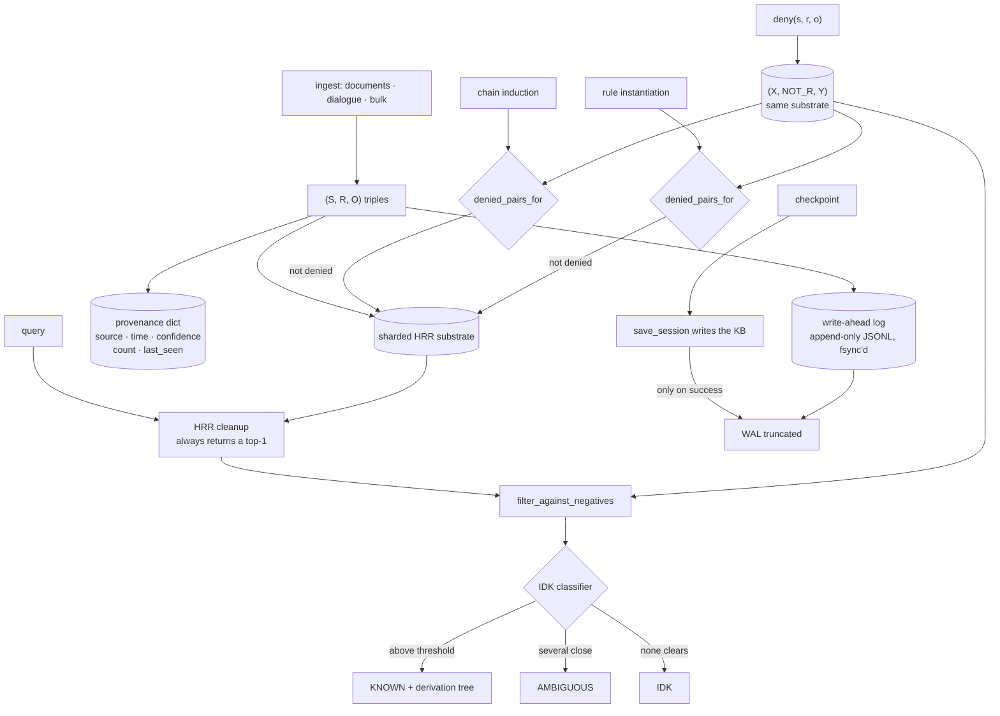

## 1. Executive Summary

RCK — Resonant Cognitive Kernel — is an Apache-2.0 Python reasoning system that
is deliberately not a language model: about 20,000 lines across 131 modules,
82 commits since 21 May 2026, at v16.0, with 907 test functions across 111
files, a paper in `papers/rck-architecture/`, and every number in that paper
traced to a script in `scripts/` and a JSON output in `data/`. Knowledge is
subject-relation-object triples in a hyperdimensional (HRR/VSA) substrate;
answers come from multi-hop chains, rule instantiation and induction, with a
provenance graph behind each one.

It is in this atlas because the store is correctable in the way the atlas cares
about — facts are denied, retracted, superseded by source priority, and checked
for contradiction — and because two of its mechanisms are better than their
common form.

**A denial blocks the derivation, not just the answer.** `deny(kb, s, r, o)`
stores an explicit `(X, NOT_R, Y)` triple, and the filter that consults it runs
on the read path *and* on both paths that manufacture new facts: chain induction
checks denials before accepting an induced fact, and rule instantiation checks
them at a score floor. Most tombstones in this corpus guard a write and leave
inference free to regenerate what was refused.

**"I don't know" is a named state rather than a low score.** `idk_detection.py`
returns `KNOWN`, `AMBIGUOUS` or `IDK` because *"the HRR cleanup always picks
one"* — without a calibration step, a retrieval that found nothing still returns
its best candidate. The classifier is deliberately conservative.

**And the reason to read this repository is what its own paper does to it.** The
tip commit is titled *"v16.0: production core, and the honest verdict on the
substrate"*, and the verdict is against the substrate the project is named for:
six axes measured against non-VSA baselines — ingest, memory, query latency,
chain discovery, analogy, federated merge — and **the HRR substrate wins none**.
Section 5.0 puts numbers on it: against a plain index, ~300× slower to build,
~75× larger, ~1,200× slower per query at 100,000 facts, *at identical recall*,
and against `networkx` it discovers fewer of the chains that provably exist. The
paper then withdraws the claim it had made, names what it was —
*"'Cheap fuzzy retrieval' was an assertion we had never tested"* — and restates
the contribution narrowly: **"RCK's contribution is the reasoning and
auditability layer, and that layer does not currently require the HRR
substrate."**

**Weakest:** the write-ahead log is truncated at every checkpoint, so the system
that can *replay a decision* cannot answer what changed last month; and the
epistemic state that would carry belief is computed per query and never stored.

## 2. Mental Model

```text
ingest ──► (S, R, O) triples ──► sharded HRR substrate
                │                        │
                │                   provenance dict
                │                (source, timestamp, confidence,
                │                 count, last_seen, tags)
                ▼
        WAL append (one JSONL line per mutation, fsync'd)
                │
        checkpoint ──► save_session writes the KB ──► WAL truncated
                                                       (only after)

query ──► HRR cleanup ──► candidates
             │
      filter_against_negatives  ◄── stored (X, NOT_R, Y)
             │
      IDK classifier ──► KNOWN | AMBIGUOUS | IDK
             │
      derivation tree + provenance

derive ──► chain induction / rule instantiation
             │
      denied_pairs_for  ◄── the same denials block the inference
```

The design's premise is that a system which can only answer from facts it was
given, and can show the derivation, is worth its costs. The v16.0 release is the
project checking whether the *substrate* underneath that premise is worth its
costs, separately, and concluding that it is not — while leaving the reasoning
layer, which was never the thing under test, standing.

## 3. Architecture



**Runtime.** One Python package, importable, with a CLI, an HTTP server
(`server.py`, `gen_server.py`), an MCP server (`mcp_server.py`), and a public
API frozen at 27 methods as of v16.0. The module list is unusually broad —
abduction, analogy, causal reasoning, counterfactual universes, theory of mind,
curriculum, dreaming, curiosity — and the atlas-relevant subset is small:
`knowledge_base`, `negative_facts`, `contradiction`, `corrections`,
`belief_revision`, `provenance`, `idk_detection`, `wal`, `atomic`, `replay`,
`session`, `universes`.

**Persistence.** Hypervectors live in process and are written by a session
snapshot; skills, provenance and query memory go to JSONL sidecars. A second
exact-index backend arrived at v16.0 with a 34-test parity suite, which is what
made the substrate comparison possible at all.

**The WAL is the durability story and its docstring is the best failure report
in this repository.** It is one JSONL line per `(op, fact)` mutation, flushed
and `fsync`'d, deliberately not routed through the atomic-rewrite helper because
*"appending without rewriting the whole file is the entire point."* Then the
measurement:

> Measured on this machine: four independent handles appending 300 fsync'd lines
> each to one path produced 1055 of 1200 lines, with ZERO unparseable lines —
> 12% of committed writes silently vanished, because Windows `"a"` mode does not
> give POSIX `O_APPEND`'s atomic seek-and-write across independent handles. The
> torn-line check in `replay()` cannot detect this class of loss.

A measured silent-loss rate, the platform reason, and the explicit statement
that the existing integrity check cannot see it — followed by the fix, an
exclusive lock on a sibling file that raises rather than losing writes, acquired
lazily so a read-only replay never needs it.

## 4. Essential Implementation Paths

**Negative facts.** `negative_facts.py` encodes a denial as a `NOT_`-prefixed
relation in the same substrate, so `(fish, NOT_isa, vegetable)` is an ordinary
triple. Four helpers: `deny`, `negate`/`denegate`, `denied_pairs_for`, and
`filter_against_negatives`. The header draws the distinction the design turns
on — a negative fact is *"positive certainty about non-membership"*, which is
*"structurally different from 'we don't know'"*.

**The three consumers are what earn the mark.** `conscious_agent.py` imports the
filter for the answer path. `chain_induction.py:280` checks
`denied_pairs_for(kb, induced.subject, induced.relation, …)` before an induced
fact is accepted. `rule_instantiation.py:113` does the same with a `min_score`
of 0.10. `contradiction.py:144` uses the same lookup to flag a store holding
both `(X, R, Y)` and `(X, NOT_R, Y)`. A refusal that only guards the front door
is defeated by the system's own inference; this one is not.

**Corrections.** `corrections.py` parses natural-language retractions —
*"Actually, X is Y, not Z"* → store `(X, is, Y)`, forget `(X, is, Z)` — into a
store-and-forget pair, returning a summary the dialogue layer confirms back. The
docstring states the stake plainly: *"Without this, no AI truly learns from
interaction."*

**IDK.** `idk_detection.py` exists because *"every retrieval returns SOME top
candidate from the codebook — the HRR cleanup always picks one."* Three states,
tunable thresholds, and a stated bias: *"we'd rather say IDK than hallucinate a
confident wrong answer."* This is the correct diagnosis of a real failure mode in
vector cleanup and it is a per-query classification, not a field on a fact —
which is why `trust_state` is withheld, on the same reading the atlas applied to
[Heimdall](../heimdall/)'s read-time verdicts.

**Checkpoint ordering.** `conscious_agent.checkpoint` truncates the WAL only
after `save_session` returns, and the docstring names the near-miss:
`save_state()` writes skills, provenance and query memory but explicitly does
*not* persist the HRR knowledge base, so `save_state()` followed by
`wal.truncate()` *"would therefore erase the only other durable record of every
fact, with a normal-looking return dict and no exception."* Two persisters, one
of which is not the one you want, and the wrong pairing fails silently — found
and fixed with the reasoning recorded.

## 5. Memory Data Model

A fact is a triple. Provenance is a parallel dict keyed on `(S, R, O)` holding
`source`, `timestamp` (when stored), `confidence`, `count`, `last_seen` and
`tags`, kept out of the hypervector budget on purpose and described as
*"intentionally simple"*, with decay, consolidation and source ranking pushed to
the modules that consume it.

**One clock, not two.** `timestamp` and `last_seen` are both record-axis: when
the store learned or re-saw the fact. `temporal.py` is common-sense temporal
reasoning over months, days and seasons for dialogue, not a validity interval on
a fact. So `bitemporal` is absent rather than partial — nothing tracks when a
fact was true as distinct from when it was recorded.

**Denials are first-class rows**, which is the cleaner half of the model: a
refusal is the same kind of thing as an assertion and lives in the same store,
so it survives, replays and merges by the same machinery.

**No principal scoping.** `universes.py` gives copy-on-write branches so a
counterfactual can be explored and discarded without touching the ground-truth
KB — real isolation, of a hypothesis rather than a tenant, and not what the scope
mark measures.

## 6. Retrieval Mechanics

HRR cleanup against a codebook produces ranked candidates; denied triples are
filtered out; the IDK classifier decides whether what remains is an answer, a
set of plausible answers, or nothing. Above that sit chain walking, rule
extraction and induction, analogy and abduction, each contributing to a
derivation tree that is returned with the answer rather than generated after it.

**The substrate's cost is measured and published.** Section 5.0 of the paper
compares it against a plain index at 100,000 facts: ~300× slower to build, ~75×
larger, ~1,200× slower per query, *at identical recall*. Against `networkx` it
finds fewer of the chains that provably exist. The conclusion in the paper is
blunt — *"on these measurements it is not cheap and its fuzziness buys no
accuracy"* — and the v16.0 exact-index backend runs the same reasoning layer
about 10× faster to ingest and 2.8× smaller with query latency flat.

## 7. Write Mechanics

Ingest paths for documents, dialogue, bulk triples and web content, each landing
triples plus provenance plus a WAL line. Corrections retract as well as write.
Belief revision, fact pruning and consensus operate over the store, and conflicts
resolve by source priority.

**Induction is guarded twice**, once by the denial check above and once by a
gate whose behaviour the release re-characterises: the commit records that
*"induction Gate 1 turns out to be partly a noise filter rather than purely a
semantic one."* Discovering that your semantic gate is doing part of its work as
a noise filter, and saying so in the release notes rather than quietly retuning
it, is the same discipline as the substrate verdict at a smaller scale.

### Operational cost

No model call anywhere in the reasoning path — this is a symbolic system and the
absence is the point. The costs are the substrate's, and they are the thing the
project measured and found wanting.

## 8. Agent Integration

A CLI, an HTTP API, an MCP server and a 27-method frozen Python API. The MCP
surface is what puts this in reach of a coding agent as a memory: an agent can
assert, deny, query and get back a derivation tree rather than a paragraph.

## 9. Reliability, Safety, and Trust

**Crash safety is the strongest engineering here**: atomic writes, a locked
append-only WAL with a measured account of the loss mode it prevents, verified
hard-kill recovery, and a checkpoint that truncates only after the one persister
that actually writes the KB has returned.

**And that WAL is why `audit_log` is withheld.** It is append-only and it does
record mutations, but it is erased at every checkpoint by design, so it answers
*what has happened since the last snapshot* and cannot answer *what changed last
month* or *who removed this fact*. Provenance covers the origin half — source,
timestamp, confidence, count — and there is no event record of mutation. The
distinction is worth stating rather than splitting: a recovery log and an audit
log have the same shape and opposite retention policies.

**Trust is a per-query classification**, not a stored status. A fact carries a
confidence float; the KNOWN/AMBIGUOUS/IDK state is recomputed on every read and
discarded. The effect at answer time is strong — an IDK is a refusal, not a
low-ranked guess — and nothing accumulates, so the store cannot say which of its
facts have been repeatedly unresolvable.

**No human review surface** and no scope boundary between principals.

## 10. Tests, Evals, and Benchmarks

907 test functions across 111 files, in public CI, with a 34-test parity suite
between the two backends added at v16.0. The negative-fact suite carries the
mark: a `deny` followed by an assertion that the denied object is absent while a
legitimate one is present, plus a passthrough case establishing that the filter
returns candidates when nothing is denied — the control that stops the negative
from passing vacuously.

**The paper is the artifact.** `papers/rck-architecture/` with every §5 number
traced to a script in `scripts/` and a JSON in `data/` — twenty-odd committed
study files including `chain_induction_failures.json`, which is a results file
named for the failures.

**Two claims are withdrawn in the paper, by name, with the measurement that
killed them.** The first is quoted in section 1. The second is sharper, because
the project judges its own result to be worse than the baseline's:

> **We withdraw the claim that "no entity-alignment step is needed."** It was
> true but vacuous … name-hashed vectors need no alignment only because both
> parties already use identical identifiers — which is equally true of merging
> two dictionaries. … Measured: after merging a renamed party's KB, cross-name
> resolution is 0.0% for a dict and 1.0% for RCK, and the 1.0% is bundle
> crosstalk rather than alignment — a false positive, which is worse than the
> honest zero.

Reading your own 1.0% against a baseline's 0.0% and reporting it as the *worse*
number is a standard almost nothing in this corpus meets. The README's comparison
table is built the same way: it includes the rows RCK loses, and a paragraph
above it retracts an earlier version of the table that had compared against a
bare LLM and claimed LLMs cannot run on a laptop CPU — *"Both are false."*

This atlas credits [Engram Alpha](../engram-alpha/) for labelling its shipped
row in an ablation it does not win and [GENOME](../genome/) — the same author's
other project — for publishing that one of its own features is harmful at the
default. RCK goes further than either: the thing measured and found wanting is
the architecture the system is named after.

## 11. For Your Own Build

### Steal

- **Make a denial block the derivation, not just the answer.** A tombstone
  consulted only at the write or read path is defeated by your own induction. The
  same lookup at chain induction and rule instantiation costs two calls and
  closes the loop.
- **Store the refusal as the same kind of row as the assertion.** A `NOT_R`
  triple in the same substrate survives, replays, merges and is contradicted by
  the machinery you already have, with no second schema.
- **Name the state that means "nothing cleared the bar."** A vector cleanup
  always returns a top-1; without an explicit IDK, the absence of an answer is
  indistinguishable from a weak one, and the system's failure mode is a confident
  wrong answer.
- **Measure the concurrency loss you cannot see, then lock.** Four handles, 300
  fsync'd lines each, 1055 of 1200 arriving with zero unparseable lines — the
  torn-line check could not detect it, and the number is what justifies the lock.
- **Truncate a recovery log only after the persister that writes the real state
  returns** — and check which persister that is. Two savers, one of which omits
  the knowledge base, is a silent total-loss bug with a normal-looking return
  value.
- **Benchmark the part of your design you are most attached to, against the
  boring alternative.** And publish it when it loses.

### Avoid

- **Do not let a recovery log stand in for an audit trail.** Append-only and
  fsync'd is not the same as retained; a WAL truncated at checkpoint answers a
  different question from the one an auditor asks.
- **Do not leave the epistemic state unstored if you need to see a pattern.**
  Recomputing KNOWN/AMBIGUOUS/IDK per query is correct for answering and useless
  for noticing that one subject has been unresolvable for six months.
- **Do not report a non-zero score as a win without asking what produced it.**
  1.0% cross-name resolution that turns out to be bundle crosstalk is worse than
  0.0%, and only the project looking at its own number caught that.

### Fit

Take RCK if you need answers that cannot be fabricated and derivations you can
show — a domain where "I don't know" is an acceptable output and a wrong
confident answer is not. Take `negative_facts.py` regardless: the pattern of a
denial that also blocks inference is about eighty lines and transfers to any
store with a derivation step.

Look elsewhere if you need fluent open-domain answers, a scope boundary between
principals, a retained audit of mutations, or compact storage — the last of which
the project's own comparison table marks as a row it loses, and the paper
quantifies.

## 12. Open Questions

- **What happens to the substrate now?** The paper's honest statement is that the
  reasoning layer does not currently require it, and the v16.0 exact-index
  backend runs that layer faster and smaller. The two properties held open —
  federated merge without entity alignment and analogy as native vector algebra —
  are the ones §5.10 has already withdrawn half of.
- **Should the WAL be retained rather than truncated?** The machinery for an
  audit exists — one JSONL line per mutation, already fsync'd — and the only
  thing standing between it and a mutation history is the truncation at
  checkpoint.
- **Could the epistemic state be recorded on the fact rather than the query?**
  A subject that returns IDK repeatedly is a gap the system could report;
  `gap_detection.py` and `curiosity.py` exist, and nothing connects them to the
  IDK classifier's own history.
- **How far does the denial check reach?** Three consumers were traced here —
  the answer path, chain induction and rule instantiation. Abduction, analogy,
  cascading induction and rule composition also manufacture facts, and whether
  each consults `denied_pairs_for` decides whether the guarantee is a property or
  a habit.
- **What does induction Gate 1 filter?** The release records that it is *"partly
  a noise filter rather than purely a semantic one"*; the split between the two
  is the number that would say whether the semantic half is doing anything.

## Appendix: File Index

- **Denials and contradiction:** `rck/negative_facts.py` (`deny`,
  `denied_pairs_for`, `filter_against_negatives`), `rck/contradiction.py`,
  `rck/negation.py`, `rck/negation_propagation.py`
- **Correction and revision:** `rck/corrections.py`, `rck/belief_revision.py`,
  `rck/fact_pruning.py`, `rck/consensus.py`
- **Epistemics:** `rck/idk_detection.py` (`EpistemicState`, `IDKPolicy`),
  `rck/confidence_calibration.py`, `rck/score_calibration.py`,
  `rck/provenance.py`
- **Durability:** `rck/wal.py` (the measured append-loss report),
  `rck/atomic.py`, `rck/replay.py`, `rck/snapshot_hash.py`, `rck/session.py`,
  `rck/conscious_agent.py` (`checkpoint`, `recover`)
- **Store and reasoning:** `rck/knowledge_base.py`, `rck/vsa.py`,
  `rck/sparse_hrr.py`, `rck/chain_induction.py`, `rck/rule_instantiation.py`,
  `rck/chain_walker.py`, `rck/universes.py`
- **Surfaces:** `rck/cli.py`, `rck/server.py`, `rck/mcp_server.py`
- **Evidence:** `papers/rck-architecture/paper.md` (§5.0, §5.10, §5.11),
  `data/` (including `chain_induction_failures.json`), `scripts/`
- **Tests:** `tests/` — 907 functions across 111 files;
  `test_negative_facts.py` carries the mark

## History

**2026-08-23** — [`440f6259266ffd69073b676caf0f78d9a343e111`](https://github.com/NORTHTEKDevs/rck/commit/440f6259266ffd69073b676caf0f78d9a343e111) — first reading, at v16.0, Apache-2.0, ~20,000 lines across 131 modules, 82 commits since 21 May 2026. Screened before anything was read: no auto-run surface, one build-time execution point (a `Makefile` in the paper directory), one unpinned surface, nothing inside the cooldown. Nothing was installed, no test was run and no benchmark was executed. Two marks. `audit_log` is withheld on retention rather than shape — the write-ahead log is append-only, fsync'd and records every mutation, and is truncated at every checkpoint by design, so it is a recovery mechanism. `trust_state` is withheld because KNOWN/AMBIGUOUS/IDK is computed per query and discarded, the same reading applied to Heimdall's read-time verdicts. `bitemporal` is absent: provenance carries `timestamp` and `last_seen`, both record-axis, and `temporal.py` is common-sense reasoning about months and seasons rather than fact validity. `scope_enforced` is absent by principal; `universes.py` isolates a hypothesis, not a tenant.
