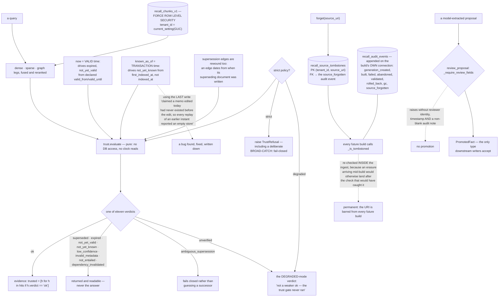

## 1. Executive Summary

RE-call is "[m]emory that abstains instead of guessing" — version 0.14.0,
103,088 lines of Python across 254 modules with 518 test files, running on the
caller's own PostgreSQL with pgvector. **The licence changed between the
previous pin and this one**: releases up to and including 0.13.x stay Apache-2.0,
and this release and later ones are under the PolyForm Noncommercial License
1.0.0, which permits personal, educational and noncommercial research use and
requires a separate written licence for commercial production, a hosted service
or redistribution. A `COMMERCIAL_LICENSE.md` sits beside it in the tree. It stores source documents, indexes
them, "and keeps validity and lineage attached to every hit."

The pitch is a distinction rather than a feature:

> "Plain vector search returns nearby text. RE-call also asks whether that text
> is current, supported, and trustworthy enough for the query. A superseded
> claim comes back marked `superseded`; a result that does not clear the
> calibrated trust gate becomes `ABSTAIN` with a reason."

That is implemented as a closed vocabulary of eleven verdicts, of which exactly
one — `ok` — becomes evidence. The rest stay readable and never become the
answer. Under a strict policy the gate does not degrade quietly; it raises.

**What makes this repository worth a careful read is not the retrieval stack but
what surrounds it.** `docs/preregistrations/` holds 162 dated markdown documents,
running from 15 August to 15 September 2026, each stating what was about to be
measured before the measurement happened. Amendments are separate dated files
(`...-amendment-2.md` through `-amendment-5.md` on one canary), and results are
separate documents again (`2026-08-27-checker-ground-truth.md` beside
`2026-08-27-checker-ground-truth-result.md`). A hypothesis and its outcome
cannot be reconciled after the fact when both are committed under their own
dates.

**The single best passage in the tree is about the project's own test data.** The
off-topic query pool — subjects a search must abstain on — was written as Python
literals, and RE-call is a system people point at code corpora, including its
own:

> "These subjects are DATA, and as Python literals they were also CORPUS.
> `offtopic_subjects_absent_from` keeps a subject only when none of its content
> words appear anywhere in the corpus under test, so a code corpus that includes
> recall's own tree ingested this very list and then disqualified every one of
> its 25 subjects."

It was measured, not assumed: none of twenty-five survived against a
repository-rooted corpus, eleven of twenty-five against a third-party corpus of
the same size, "so the failure was recall dogfooding itself, not the pool being
too small." The pool moved to JSON, which the wizard's `**/*.py` and `**/*.md`
globs do not match. And the distinctive words are deliberately never written in
prose, because naming one re-contaminates the pool — a rule the author reports
breaking twice while fixing it, "once in a comment in
`recall/wizard/queryset.py`, caught only because the measured survivor count
moved the wrong way, and once in THIS paragraph, caught in seconds by the guard
below."

Every one of the atlas's seven capabilities is present, and the reason is
visible in the code rather than in the README: each was built as an argument
about what a neighbouring design would have got wrong.

## 2. Mental Model

A **hit** carries a verdict, and only `ok` becomes evidence.

A **verdict** is a member of a closed set, each one defined against the one it
is most likely to be confused with.

A **tombstone** is permanent, keyed on the source URI, and re-checked mid-build.

A **tenant** is a Postgres row-level-security policy, not a `WHERE` clause.

A **preregistration** is what you wrote down before you measured.

## 3. Architecture

| Area | Role |
| --- | --- |
| `recall/trust.py` | The gate: two time axes, the verdicts, and where it refuses |
| `recall/types.py` | The verdict vocabulary, each value argued against its neighbour |
| `recall/generations.py` | Builds, the audit events, and the tombstone re-checks |
| `recall/migrations/sql/0008_generation_foundation.sql` | Forced RLS, the audit table, the tombstone table |
| `recall/promotion.py` | The review gate a proposal cannot go around |
| `recall/decision_ledger.py` | A witness of retrieval decisions, deliberately not an enforcer |
| `recall/eval/`, `docs/preregistrations/` | The negative sets, and what was written down first |

## 4. Essential Implementation Paths

`recall/trust.py:520-544` — the two axes, how they compose, and the
`first_indexed_at` bug that made every point-in-time replay return an empty
store.

`recall/types.py:55-81` — eleven verdicts, and the argument for why `unverified`
is not `low_confidence`.

`recall/generations.py:566-570` with `:810`, `:976`, `:1005` — one tombstone
check, called three times, for a reason stated in `generation_store.py:52-58`.

`recall/migrations/sql/0008_generation_foundation.sql:128-133` — `FORCE ROW
LEVEL SECURITY` on the chunk table itself.

`recall/promotion.py:200-210` — a gate that refuses three ways.

`recall/eval/synthetic.py:75-100` — the negative pool that was contaminating
itself, measured.

## 5. Memory Data Model

Source documents are chunked into `recall_chunks_v1` with declared validity,
lineage and supersession attached, all under a tenant policy. Beside them,
`AtomicFact` is a structured claim — namespace, subject, predicate, object,
context, `valid_from`, `valid_until` — validated on construction and promoted
into an append-only fact ledger with a current-state projection. Generations
version the corpus: a build produces a new generation, promotion makes it
active, and a garbage collector removes superseded ones.

## 6. Retrieval Mechanics

Dense, sparse and graph legs are fused and reranked, then every surviving hit is
judged by `trust.evaluate` — a pure function with no database access and no
clock reads, which is what makes the two time axes testable without a database.
Calibration supplies the threshold, and carries its own certification status, so
the system can tell a threshold it fitted from one it never had.

## 7. Write Mechanics

A build reads a manifest, skips tombstoned URIs, writes chunks, and appends its
lifecycle events on the same connection. The corpus fingerprint is computed from
the manifest minus the tombstoned set, so a build whose only change is an
erasure is still a distinct generation rather than a no-op. Extracted proposals
take the other path, through review.

## 8. Agent Integration

A CLI, an MCP server registered as `io.github.GiulioDER/re-call`, a Codex
plugin, Claude Code hooks, desktop packaging and Docker compose files. Several
preregistrations measure the integration itself — hook ordering, in-process
against MCP transport, tool-definition context cost, and Claude Code with and
without RE-call, calibrated and not.

## 9. Reliability, Safety, and Trust

**The review gate is kept off the model's own surface, and the project says
why.** The MCP server registers `recall_rewrite_plan` and no apply twin, and the
docstring is the clearest statement of this rule anywhere in the corpus:
*"There is deliberately no `recall_rewrite_apply`. The MCP client is the model,
so letting it supply a reviewer id and an audit note would make the named human
gate a formality it satisfies by typing a string: the gate becomes a field, not
a person. This surface proposes; a human applies at `recall rewrite apply`."*
The plan tool hands back the exact CLI line a person would run
(`recall_mcp/reasoning_admin.py:14-20`), so the handoff is spelled out rather
than implied. The one fact-writing tool states the same rule as a property of
its inputs: on `recall_apply_fact`, trust verdicts, timestamps, approval fields
and writer identity are *"server-owned and cannot be supplied here"*. That is
what `human_review` is for, and this is the version to copy.

Fail-closed is the default posture and is written as such, including a broad
exception catch annotated with its intent. The gaps are the configured ones: a
development mode that serves `unverified` results, a
`generation_promoted_unsafe_development` path that exists, and a decision ledger
that is off unless enabled and best-effort when it is. The mutation audit is the
part that is not optional — it commits with the build.

## 10. Tests, Evals, and Benchmarks

494 test files, evaluation suites over LoCoMo, LongMemEval, BEIR and synthetic
corpora, a labelled gap study, and abstention scored as its own axis. The
preregistration directory is the artifact that distinguishes it: hypotheses,
amendments and results filed separately and dated, including negative results
and a holdout-validation document.

## 11. For Your Own Build

Write down what you are about to measure, in a dated file, before you measure
it. Everything else here follows from that habit.

Check whether your evaluation data is inside your corpus. If your system indexes
code and your negative examples are Python literals, they are corpus, and the
failure is silent.

Re-check your tombstones inside the ingest, not only at the start of it.

Define each status against the one it will be confused with, and say so in the
type. `unverified` and `low_confidence` look interchangeable until somebody has
to explain a result.

## 12. Open Questions

Whether the degraded path should be reachable in a packaged install at all. Both
escape hatches are honestly named and audited, which is the right second-best;
the first-best would be that a deployment cannot serve an unjudged result.

Whether `reviewer_id` should be bound to an authenticated identity. The gate is
structural and the field is a string, so the mechanism is stronger than the
attribution it records.

## Appendix: File Index

| Path | What to read it for |
| --- | --- |
| `recall/types.py:55-81` | A status vocabulary where each value argues against its neighbour |
| `recall/trust.py:520-544` | Two time axes that compose, and the replay bug that shaped them |
| `recall/eval/synthetic.py:75-100` | Your own repository contaminating your own negative set |
| `recall/generations.py:566-570` | A tombstone check placed where the race actually is |
| `recall/promotion.py:200-210` | A review gate that refuses without a reviewer, a time and a note |
| `docs/preregistrations/` | 162 dated statements of what was going to be measured |

## History

**2026-09-19** — re-pinned to [`1157360f1e0704a06548d93a4f4797c415c722f9`](https://github.com/GiulioDER/RE-call/commit/1157360f1e0704a06548d93a4f4797c415c722f9), 29 commits and 184 files on. **All seven marks re-tested and held**, and `human_review` is re-grounded on the thing that actually settles the producer test. The structural gate is unchanged — `_require_review_fields` (`recall/promotion.py:200-210`) still raises without a reviewer identity, a review timestamp and a non-blank audit note, and `recall/rewrite.py:26` still records that a downstream function cannot take an unreviewed proposal because only `promote_accepted_proposal` produces a `PromotedFact`. What the record now cites beside it is the absence: the MCP server registers `recall_rewrite_plan` and no apply twin, and its docstring states the rule this atlas's rubric arrived at independently — *"letting it supply a reviewer id and an audit note would make the named human gate a formality it satisfies by typing a string: the gate becomes a field, not a person."* `recall_apply_fact` repeats it as an input property, with approval fields and writer identity server-owned. Quoted in section 9, and re-call is added to the rubric's list of what passing looks like. The stated limit is unchanged: on the CLI path `reviewer_id` is a supplied string, so the mechanism is stronger than the attribution it records, and section 12 still asks whether it should be bound to an authenticated principal. Screened again first; nothing installed or run.

**2026-09-16** — [`1994fd256820df7970eac1f1d588a1961da16edf`](https://github.com/GiulioDER/RE-call/commit/1994fd256820df7970eac1f1d588a1961da16edf) — first reading, at a commit dated 16 September 2026. Screened before opening, from a shallow clone: fifteen files scanned, three auto-run surfaces, three build-time execution points (`recall/setup.py`, which executes at install time, `tests/conftest.py`, which runs on pytest collection, and the `Makefile` default target), one unpinned dependency surface and three dependency files inside the seven-day cooldown. `uv.lock` is present. A `hooks/pre-commit` payload sits in the tree uninstalled and inert. `AGENTS.md` and `CLAUDE.md` are addressed to a reading agent and were recorded as data. Nothing was installed, built or run, so every claim here is read from source rather than observed.
