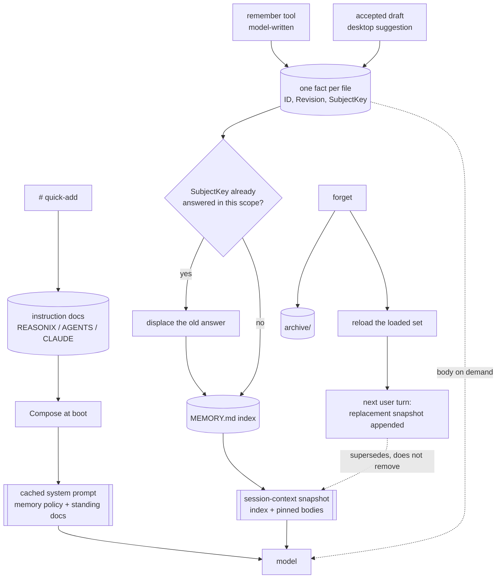

## 1. Executive Summary

Reasonix is a coding agent — one Go binary, reachable from a terminal, a desktop
app, a browser, or an editor over ACP. MIT and mostly Go. Most of it is not memory; `internal/memory` is ~7,300 lines
with 156 tests, and it is worth reading for one architectural constraint and one
artifact.

**The constraint is the prefix cache, and it shapes everything else.** Since
[`2b7c65227775a09392cc0070907ff06ca9af0fcd`](https://github.com/esengine/DeepSeek-Reasonix/commit/2b7c65227775a09392cc0070907ff06ca9af0fcd)
(2 September 2026) the cached system prompt carries only what is stable: a short
memory policy and the standing instruction documents. The memory index and the
bodies of pinned facts moved into a host-generated `<session-context version="1">`
snapshot (`internal/sessioncontext`), whose preamble reads *"This host-generated
snapshot supersedes every earlier session-context snapshot."* A write refreshes
the loaded set, and *"the next real user turn observes the new
BackgroundDataBlock and appends one complete replacement session-context"*
(`internal/control/memory.go`); an unchanged snapshot is deduplicated by digest.
This is the [cache-preserving injection](../../patterns/cache-preserving-injection/)
pattern with the mutable part moved out of the prefix rather than frozen in it.
The package doc in `internal/memory/doc.go` still describes the earlier design,
where everything folded into the prefix once at boot.

**Correction is a replacement, and the replaced copy stays in the transcript.**
`forget` archives the file. It still builds the sentence *"Forgot memory `<name>`
— disregard its loaded guidance and background-index entry for the rest of this
session"*, but the controller's `QueueMemory` now ignores the note and refreshes
the background snapshot instead; the tool result tells the model the fact *"no
longer applies"*, and the next user turn appends a session-context without it.
The earlier snapshot, with the fact in it, is still earlier in the conversation,
so the retraction rests on the model preferring the newest snapshot as its
preamble instructs — enforcement by precedence rather than by removal.

**The store is one Markdown file per fact.** A record carries an immutable `ID`
separate from a renameable `Name`, a monotonic `Revision`, a four-value `Type`
(`user`, `feedback`, `project`, `reference`), an `Activation`, a `Volatility`,
`ExpiresAt`, `LastVerifiedAt`, and a **`SubjectKey`** — *"which question the fact
answers (project.package_manager); one active value per scope+subject."* That
last field is the supersession key, and it is the mechanism the benchmark below
tests.

**The artifact is `benchmarks/memorybench`.** Fifteen committed tasks whose classes read like this
project's own risk register — `mb-contradiction`, `mb-stale`, `mb-conflict`,
`mb-update`, `mb-history`, `mb-distractor`, `mb-pin`, `mb-paraphrase`,
`mb-exact`, plus three `mb-v1miss-*` regression cases named for a retrieval miss
that shipped. Each is a real workspace, a seeded memory directory, a prompt, and
a `verify.sh`.

**Two of seven marks.** `human_review` and `negative_eval`. The misses are
near-misses worth reading rather than absences: a freshness classification that
is about age instead of belief, revision snapshots and a recall audit that sit
either side of a mutation event log without being one, a supersession key that
keys on the record, and a project boundary that is a directory rather than a
filter.

## 2. Mental Model

A fact is written by the model, or accepted by a person from a mined draft. It
answers exactly one question — its `SubjectKey` — and a newer answer to the same
question in the same scope displaces the older one. Its index line rides the
session-context snapshot; its body is fetched on demand unless it is pinned. It ages on a clock set by its
volatility and reset by explicit verification, and past `ExpiresAt` it stops
reaching automatic recall.

The thing the diagram has to show is the seam the cache creates: the system prompt
stays fixed, and memory reaches the model as a sequence of snapshots, each
superseding the last without removing it.

The dotted arrow at the bottom is the finding. A correction ends at a new
snapshot appended after the old one, and the old one stays readable above it.

## 3. Architecture

A single binary and no server. Memory lives in `~/.reasonix`: a per-project
directory under `projects/<slug>/memory`, a shared `memory/global`, an
`archive/`, and instruction docs discovered at four scopes — user, ancestor,
project, and a git-ignored `*.local.md` override with the highest precedence.
`REASONIX.md` is the project's own name; `AGENTS.md` and `CLAUDE.md` are read as
cross-tool conventions, and when several exist in one directory all of them load,
each labelled with its source path.

## 4. Essential Implementation Paths

- **Compose.** `internal/memory.Compose` folds `SystemBlock` — the memory
  policy and the standing instruction docs — into the cached system prompt at
  boot; `BackgroundDataBlock` renders pinned bodies and the index into the
  session-context section `internal/control/session_context.go` builds.
- **Write.** `remember` → normalise `Type` (anything unknown becomes `project`,
  so *"a sloppy tool argument never blocks a save"*) → resolve scope → displace
  any existing answer to the same `SubjectKey` → write the file → rewrite
  `MEMORY.md`.
- **Read.** The index is already in the session-context snapshot; `memory`
  fetches bodies on demand; `auto_recall.go` selects by keyword with expired facts excluded.
- **Forget.** `forget.go` → `Store.Archive(name)` → `QueueMemory`, which
  reloads the set and lets the next user turn publish a replacement snapshot.
- **Review.** `desktop/memory_suggestions.go` mines recent local history into
  drafts; `AcceptMemorySuggestion` is what turns one into a saved memory.

## 5. Memory Data Model

The `ID`/`Name` split is the right one: identity is immutable, the human-facing
name can change without breaking references. `Revision` is monotonic, a save can
require the expected revision, and every overwritten revision is kept as an
immutable snapshot under `.revisions/<id>/<revision>.md`, which `Restore` and
`RestoreArchived` bring back as a new revision (`store_v2.go`).

`SubjectKey` is the field to copy. Naming *which question* a fact answers, and
enforcing one active value per `(scope, subject)`, converts supersession from a
similarity judgement into a lookup. A store that detects a contradiction
by embedding distance still has to decide what to do; this one declares the key
up front.

Its limit is that it keys on the record. Displacing the old answer removes it
from active memory, and nothing records that the *value* was wrong — so the same
claim saved again under a different name, or after an archive, is a fresh fact.

`Keywords` is a small good idea: search aliases including bilingual synonyms,
used for recall and *"never rendered into the index"*, so recall breadth costs no
index tokens.

## 6. Retrieval Mechanics

Two tiers. The index rides the session-context snapshot, so the model always
knows what exists without a retrieval step. Bodies are lexical-matched and
fetched on demand. `Activation` decides which tier a fact gets: `relevant` is
retrieval-only — index plus recall — while `pinned` loads its body into the
snapshot.

Freshness gates recall. `FreshnessFor` classifies a fact `fresh`, `current`,
`stale` or `expired` from its `Volatility` and `LastVerifiedAt`, and only
`expired` — past an explicit `ExpiresAt` — is *"excluded from automatic recall"*.

**That is not a trust state and the mark is withheld.** The four values are a
statement about age, not about belief: a stale fact is old, not doubted, and
`LastVerifiedAt` renews a clock rather than setting a status. The distinction
matters here more than usual, because `mb-stale` and `mb-contradiction` are
exactly the cases where the *older* fact is wrong rather than merely aged, and
nothing in the record can say so.

## 7. Write Mechanics

Writes are synchronous and explicit. There is no extraction pass and no
background consolidation on the memory path — the model decides to call
`remember`, or a person accepts a draft.

The displacement rule runs at write time: one active value per scope and subject.
Beyond that the store is permissive by design, and says so — an unknown `Type`
normalises rather than failing.

## 8. Agent Integration

`remember`, `forget` and `memory` as model tools; a `#` quick-add for the human;
a desktop Memory page carrying suggestions and an accept action; and the whole
engine reachable over ACP from an editor. In the approval modes below
workspace-write and full access, `remember` and `forget` are ask rules in the
permission gate, so each model write or retraction waits for a person;
`AssessRememberWrite` lets a low-risk project fact through without asking. Memory is one part of a much larger
agent — plan mode, permissions, a workspace sandbox and per-turn checkpoints are
the product, and the checkpoints are session state rather than memory.

## 9. Reliability, Safety, and Trust

The honest summary is that this store is well-built for a single trusted user on
one machine and has no mechanism for anything else. Scope is a directory root, so
a project fact cannot reach another project's session — a real boundary, by
path, and a partition rather than a stored key applied on a read, so
`scope_enforced` is not carried. The global tier deliberately loads everywhere,
and there is no principal, tenant or authentication concept anywhere near it.

There is no mutation audit. `forget` archives rather than deleting and every
overwritten revision is snapshotted, which preserves the states, but nothing
appends an event saying a fact was written, displaced, archived or restored, by
whom or why, so "why does it believe this" is answerable only by reading files
and their revision snapshots.

**The recall audit is the near-miss, and it is a good mechanism aimed at the
other half of the problem.** `TestComposeEmitsMemoryRecallAudit` asserts exactly
one recall audit per composed user turn, and that the audit *"must explain
itself"* — either it carries hits or it names why recall was suppressed. A
retrieval log that cannot be silent is worth having. It is still the retrieval half of the [append-only memory
audit](../../patterns/append-only-memory-audit/) pattern, and the rubric puts a
mutation record on the other side of the line.

## 10. Tests, Evals, and Benchmarks

156 Go test functions in `internal/memory`. No paper.

**`benchmarks/memorybench` is the reason to read this repository if you care
about evaluation.** It is unchanged since the first reading. Fifteen tasks, each a workspace plus a seeded memory
directory plus a prompt plus a `verify.sh`, and the verifications are what make
it a negative suite rather than a recall suite. `mb-contradiction` seeds two
memories — one saying the project uses npm, one saying it migrated to pnpm — and
requires `grep -q "pnpm install" && ! grep -q "npm install"`. `mb-stale` requires
`release/1.21` and forbids `release/0.9`. The forbidden half is the assertion:
**the superseded value must not be what the agent answers with.**

Two things make it stronger than a store-level negative test.
It asserts on *end-to-end agent behaviour* rather than on a store method, so it
catches a memory that was retrieved correctly and then lost an argument with the
context around it. And three tasks are named `mb-v1miss-*` — regression cases
preserved from a retrieval miss that shipped, including a cross-language one and
a symbol one.

**The harness measures utility, not just recall.**
`taskExperimentEnv` can set `REASONIX_EXPERIMENT_NO_MEMORY=1`, and
`memoryUtilitySection(pathA, pathB)` pairs the two runs by task id and reports
`paired`, `onPass`, `offPass`, a **`helpful`** list, a **`harmful`** list, and
`overheadChars` — the character cost of what recall injected. A benchmark with a
column for the tasks memory made *worse*, beside its token cost, is the shape
the [benchmarks page](../../benchmarks/) asks for.

What is missing is the result. No memorybench output is committed to the tree, so
what exists here is an instrument rather than a measurement — a distinction worth
keeping, because the instrument is the harder half and it is already built.

I did not run any of it.

## 11. For Your Own Build

### Steal

- **Name the question a fact answers.** `SubjectKey` — `project.package_manager`
  — with one active value per scope and subject turns supersession from a
  similarity judgement into a lookup, and gives the benchmark something exact to
  assert on.
- **Write the benchmark as the failure register.** Task classes named
  `contradiction`, `stale`, `distractor`, `paraphrase`, `pin` are the questions a
  memory system should be asked, and preserving `v1miss` regressions means a
  retrieval bug that shipped once cannot ship twice.
- **Put the forbidden string in the verification.** `! grep -q "npm install"`
  beside the required one is the cheapest possible negative retrieval assertion,
  and it works end to end without any test harness at all.
- **Measure memory-off.** One environment variable and a paired run gives you
  which tasks memory helped, which it *hurt*, and what it cost in characters.
- **Keep recall aliases out of the index.** `Keywords` widens matching at zero
  index cost, because it is read on the recall path and never rendered.
- **Make the retrieval log unable to be silent.** One audit per composed turn
  that must either carry hits or name why it was suppressed.

### Avoid

- **A retraction that is a newer snapshot.** Forgetting mid-session appends a
  replacement session-context on the next user turn, and the earlier snapshot
  with the fact in it stays in the conversation. Moving memory out of the
  cached prefix made correction reach the model within a turn; what binds it is
  still the model honouring *"supersedes every earlier session-context
  snapshot"*, not the removal of the old text.
- **Freshness standing in for belief.** Four values, one of which withholds, all
  computed from age. The two benchmark tasks that matter most — a contradiction
  and a stale branch — are cases where the old fact is *wrong*, and nothing in
  the record distinguishes wrong from old.
- **Supersession keyed on the record.** Displacing an answer removes it from
  active memory; the same claim can be saved again under a different name and
  nothing consults what was displaced.

### Fit

Take this if you want a coding agent whose memory costs nothing per turn and is
plain files you can read, and take the benchmark whatever you build — it is
MIT-licensed, portable, and each task needs nothing but a workspace, a seeded
memory directory and a shell verification.

Walk away from the memory design if you need multi-user boundaries, an audit of
what changed, or a correction that removes the retracted text rather than superseding it.
The first is absent by scope, the second is absent, and the third is a
consequence of an append-only conversation rather than an oversight.

## 12. Open Questions

- `SubjectKey` already declares which question a fact answers. What would it take
  for a displaced answer to leave a record keyed on its *value*, so the same
  wrong claim cannot be re-saved under a new name?
- Does the model honour a replacement snapshot over an earlier one it can still
  read? No memorybench task forgets a fact mid-run and forbids the answer that
  used it.
- Freshness and correctness are conflated at the point where it matters most.
  Would a separate two-value status on top of the freshness clock cost anything
  the snapshot budget cannot afford?
- No memorybench results are committed. What does the helpful/harmful split
  actually look like, and how large is `overheadChars` in practice?
- The global tier loads in every project by design. What is the intended
  behaviour when a global fact contradicts a project fact answering the same
  `SubjectKey`?

## Appendix: File Index

**Memory**
- `internal/memory/doc.go` — the two-layer model; its prefix-cache paragraph predates the session-context move
- `internal/memory/memory.go` — `PolicyBlock`, `BackgroundDataBlock`, `SystemBlock`, `Compose`
- `internal/sessioncontext/session_context.go` — the snapshot envelope, digest and supersession preamble
- `internal/control/memory.go`, `internal/control/session_context.go` — reload on write and the next-turn replacement
- `internal/memory/store.go`, `store_v2.go` — the `Memory` record, scopes, the
  index, `Archive`, `.revisions` snapshots and `Restore`
- `internal/memory/remember.go`, `remember_policy.go`, `forget.go`,
  `quickadd.go` — the write and retract surfaces
- `internal/memory/recall.go`, `auto_recall.go`, `recall_index.go`,
  `activation.go`, `freshness.go`, `subject.go`
- `internal/control/memory_recall_audit_test.go` — one explaining audit per turn
- `desktop/memory_suggestions.go` — mined drafts and the accept action

**Evaluation**
- `benchmarks/memorybench/tasks/` — fifteen tasks, each with `task.toml`,
  `verify.sh`, a seeded `memory/` and a `workdir/`
- `cmd/e2ebench/memorybench.go` — seeding, marker scanning, the shadow render and
  `memoryUtilitySection`'s paired memory-off comparison

**Docs**
- `docs/SESSION_MEMORY_RETRIEVAL.md`, `docs/SPEC.md`, `docs/ACP.md`

## History

**2026-09-15** — [`e4bfeb67f9125af238aca4ff9bf69b21cb1df998`](https://github.com/esengine/DeepSeek-Reasonix/commit/e4bfeb67f9125af238aca4ff9bf69b21cb1df998) — 1,585 commits on, 2026-09-15. Screened on a sparse checkout of the memory, session-context, control, benchmark and desktop suggestion files plus the root manifests and `.githooks/`: one auto-run surface, one unpinned surface and four dependency surfaces inside the cooldown; nothing was installed or run. The memory package changed in ten files, and one change rewrote the report's premise: [`2b7c65227775a09392cc0070907ff06ca9af0fcd`](https://github.com/esengine/DeepSeek-Reasonix/commit/2b7c65227775a09392cc0070907ff06ca9af0fcd) (2 September) moved the memory index and pinned bodies out of the cached system prompt into a host-generated session-context snapshot that a write replaces on the next user turn, and `QueueMemory` now drops `forget`'s disregard sentence in favour of that replacement. Sections 1, 2, 4, 6, 8, 9 and 11 are rewritten for it. `scope_enforced` withdrawn: the project boundary is a directory partition, not a stored key applied on a read. `human_review` kept, with the approval gate on `remember` and `forget` added to its record; `negative_eval` kept on the unchanged memorybench. Revision snapshots under `.revisions/` are now described; they are not an event log. Two marks.

**2026-08-16** — [`d95e2510cfb3088fb51787668b61a7982b94849b`](https://github.com/esengine/DeepSeek-Reasonix/commit/d95e2510cfb3088fb51787668b61a7982b94849b) — First reading, at 5,487 commits. Screened first: one auto-run surface (committed `.githooks/pre-push`, inert unless `core.hooksPath` points at it), one build-time execution path (`Makefile`), and nine manifests inside the seven-day cooldown; nothing was installed, built or run. Three marks — `scope_enforced`, `human_review`, `negative_eval` — and four near-misses stated in place: freshness classifies age rather than belief, the recall audit is the retrieval half of the audit pattern, supersession by `SubjectKey` keys on the record, and there is no principal boundary. No paper, and no memorybench results committed to the tree.
