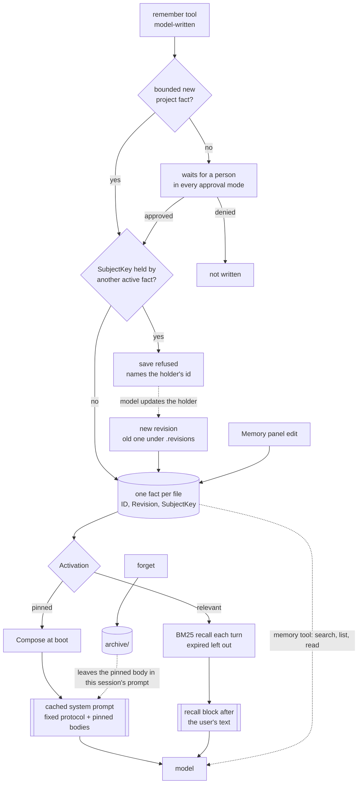

## 1. Executive Summary

Reasonix is a coding agent whose memory is one Markdown file per fact, designed
around the provider's prefix cache. The cached system prompt carries a memory
protocol that is byte-identical across projects, plus the bodies of pinned facts;
every other fact reaches the model per turn. What is notable is the committed
memory benchmark, with a memory-off arm and a column for the tasks memory made
worse. What is weak is correction: a fact forgotten mid-session stays in
whichever text already carried it, and one of the benchmark's five must-not
checks cannot pass.

**This report reads the 2.x line.** The repository ships two lines from two
branches. `studio`, the default branch and the pin here, is 2.x — Reasonix Studio,
pre-release and under active development. `main-v2` is 1.x, in maintenance.
The two forked on 12 August 2026 and share the store format and `~/.reasonix`
(`docs/MIGRATING.md`). They differ in how memory reaches the model: 1.x moves
the index into a `<session-context>` snapshot on the user turn
([`2b7c65227775a09392cc0070907ff06ca9af0fcd`](https://github.com/esengine/DeepSeek-Reasonix/commit/2b7c65227775a09392cc0070907ff06ca9af0fcd)),
and 2.x puts the index in no prompt at all.

**The constraint is the prefix cache.** `BackgroundBlock` renders a fixed
`memoryProtocol` and the pinned bodies. Its doc comment gives the reason the
index is absent: it *"changes on every remember, and everything after it in the
prefix … would be re-sent with it"* (`internal/state/memory/memory.go:152-192`).
`Compose` folds that block into the system prompt once, at boot
(`internal/assembly/boot/memoryset.go:41`). Standing instruction documents ride
the turn instead, owed once per session and again when they change on disk. The
package doc in `internal/state/memory/doc.go` says all of it folds into the
prefix at boot, which holds only for the protocol and the pinned bodies.

**Correction is text appended after text that stays.** `forget` archives the
file and returns *"it no longer applies"*. A pinned fact's body stays in the
cached prompt for the rest of the session, and a relevant fact recalled on an
earlier turn stays in that turn. Only a forget from the Memory panel adds a
*"disregard its loaded guidance"* note to the next turn; the model's own
`forget` relies on its tool result.

**The store is one Markdown file per fact.** A record carries an immutable `ID`
separate from a renameable `Name`, a monotonic `Revision` and a four-value `Type`
(`user`, `feedback`, `project`, `reference`). It also carries an `Activation`, a
`Volatility`, `ExpiresAt`, `LastVerifiedAt`, and a **`SubjectKey`** — *"which
question the fact answers (project.package_manager); one active value per
scope+subject."* A save that claims a subject another active fact holds is
refused, and the error names the holder's id so the model can write the new
answer as its next revision.

**The artifact is `benchmarks/memorybench`.** Fifteen committed tasks named for
the questions a memory store should be asked — `mb-contradiction`, `mb-stale`,
`mb-conflict`, `mb-update`, `mb-history`, `mb-distractor`, `mb-pin`,
`mb-paraphrase`, `mb-exact`, plus three `mb-v1miss-*` regression cases named for
a retrieval miss that shipped. Each is a workspace, a seeded memory directory, a
prompt and a `verify.sh`.

**Two of seven marks.** `negative_eval` rests on the four satisfiable
must-not verifications in that benchmark. `human_review` rests on the approval
gate over the agent's own `remember` and `forget` calls, which no approval mode
answers. The misses are near-misses. Freshness classifies age instead of
belief. Revision snapshots and a recall audit sit either side of a mutation event
log without being one. The subject key refuses a second answer without
remembering a rejected one, and the project boundary is a directory rather than a
filter.

## 2. Mental Model

A fact is written by the model, behind a person's approval unless it is a bounded
new project fact, or edited by a person in the Memory panel. It answers at most
one question, its `SubjectKey`, and a second fact claiming the same question in
the same scope is refused. A changed answer is a new revision of the one fact,
with the old revision kept under `.revisions/`.

How a fact reaches the model depends on its `Activation`. A `pinned` body is
folded into the cached system prompt at session start. A `relevant` fact is
retrieved: a BM25 recall block is appended after the user's text on each turn,
and the `memory` tool searches, lists and reads the rest. A fact ages on a clock
set by its volatility and reset by explicit verification, and past `ExpiresAt` it
leaves automatic recall.

The diagram has to show the seam the cache creates. The cached prompt is
composed once, so a forget changes the files and the next turn's recall, and
leaves the prompt the session started with.

```mermaid
%% caption: the cached prompt carries a fixed protocol and pinned bodies composed at boot; everything else arrives per turn, and a forget changes the store but not the prompt already sent
flowchart TD
    W["remember tool<br/>model-written"] --> GATE{"bounded new<br/>project fact?"}
    GATE -- "no" --> ASK["waits for a person<br/>in every approval mode"]
    GATE -- "yes" --> SUB
    ASK -- "approved" --> SUB{"SubjectKey held by<br/>another active fact?"}
    ASK -- "denied" --> DROP["not written"]
    SUB -- "yes" --> REF["save refused<br/>names the holder's id"]
    REF -. "model updates the holder" .-> REV["new revision<br/>old one under .revisions"]
    SUB -- "no" --> F[("one fact per file<br/>ID, Revision, SubjectKey")]
    REV --> F
    PANEL["Memory panel edit"] --> F
    F --> ACT{"Activation"}
    ACT -- "pinned" --> BOOT["Compose at boot"]
    BOOT --> PREFIX[["cached system prompt<br/>fixed protocol + pinned bodies"]]
    ACT -- "relevant" --> RECALL["BM25 recall each turn<br/>expired left out"]
    RECALL --> TAIL[["recall block after<br/>the user's text"]]
    PREFIX --> MODEL["model"]
    TAIL --> MODEL
    F -. "memory tool: search, list, read" .-> MODEL
    FG["forget"] --> ARCH[("archive/")]
    ARCH -. "leaves the pinned body in this session's prompt" .-> PREFIX
```

The dotted arrow at the bottom is the finding. A forget reaches the store at
once and the cached prompt only at the next session.

## 3. Architecture

A single Go kernel and no memory server. Memory lives under `~/.reasonix`: a
per-project directory under `projects/<slug>/memory`, a shared `memory/global`,
an `archive/`, and per-fact `.revisions/` (`internal/state/memory/store.go:116-117`,
`store_v2.go:389`). Instruction docs are discovered at four scopes — user,
ancestor, project, and a git-ignored `*.local.md` override with the highest
precedence. `REASONIX.md` is the project's own name; `AGENTS.md` and `CLAUDE.md`
are read as cross-tool conventions, and when several exist in one directory all
of them load, each labelled with its source path.

The kernel is reachable from a terminal CLI and TUI, from `reasonix serve` over
HTTP, from the Reasonix Studio desktop app, and from editors over ACP. Studio is
an Electron shell whose React renderer calls the same `serve` routes over
loopback (`desktop/README.md`), so the Memory panel and the approval prompt are
HTTP routes rather than a separate desktop binary.

## 4. Essential Implementation Paths

- **Compose.** `internal/state/memory.Compose` folds `BackgroundBlock` — the
  fixed protocol and the pinned bodies — into the system prompt once, from
  `internal/assembly/boot/memoryset.go:41`.
- **Per turn.** `turnBlocksFor` prepends the owed `<project-instructions>` and
  any `<memory-update>` notes, and `recallTail` appends the recall block after
  the user's text (`internal/session/control/turn_projection.go:47-66`,
  `:118-132`).
- **Write.** `remember` → the approval gate, or `AssessRememberWrite`'s
  auto-allow for a bounded new project fact → normalise `Type` (anything unknown
  becomes `project`, so *"a sloppy tool argument never blocks a save"*) →
  resolve scope → refuse a held `SubjectKey` → write the file, snapshot the
  prior revision, rewrite `MEMORY.md`.
- **Read.** `auto_recall.go` ranks relevant facts with BM25 and leaves out
  pinned and expired ones; the `memory` tool serves `search`, `list` and `read`.
- **Forget.** `forget.go` → `Store.Archive(name)` → `QueueMemory`, which the
  controller answers by reloading the store and queuing nothing
  (`internal/session/control/memory.go:316-328`).

## 5. Memory Data Model

The `ID`/`Name` split is the right one: identity is immutable, the human-facing
name can change without breaking references. `Revision` is monotonic, a save can
require the expected revision, and every overwritten revision is kept as an
immutable snapshot under `.revisions/<id>/<revision>.md`, which `Restore` and
`RestoreArchived` bring back as a new revision (`store_v2.go:381`, `:410`, `:438`).

`SubjectKey` is the field to copy. Naming *which question* a fact answers, and
refusing a second active fact for the same `(scope, subject)`, converts a
contradiction into a revision. The refusal names the holder's `id`, `revision`
and current value, and tells the model to *"update that id instead of creating a
second one"* (`internal/state/memory/subject.go:64-81`). A store that detects a
contradiction by embedding distance still has to decide what to do; this one
declares the key up front and refuses the ambiguity.

Its limit is that it keys on the question, not on the value. An update of the
holder is accepted whatever it says, so nothing stops a value an earlier revision
replaced from coming back as the next one. After the holder is archived, the key
is free and any value claims it.

`Keywords` is a small good idea: search aliases including bilingual synonyms,
used for recall and *"never rendered into the index"*, so recall breadth costs no
index tokens.

## 6. Retrieval Mechanics

Two channels, split by `Activation`. A `pinned` body is in the cached system
prompt for the whole session, and automatic recall skips it because it *"already
ride[s] the stable prefix"* (`internal/state/memory/auto_recall.go:342-347`). A
`relevant` fact is ranked with BM25 over its text and keywords, project facts
weighted 1.08 over global ones, and the top hits under a character budget are
appended after the user's text. A global fact whose id, name, title or
`SubjectKey` matches a project fact is dropped from the pool, so the project
answer shadows the global one (`auto_recall.go:341-395`). The index reaches the
model only when the model calls `memory list`.

`TestBlockIsIdenticalWhateverTheStoreHolds` holds the cache property: it builds
the static block over an empty store and over one whose `MEMORY.md` lists a
fact, and fails if they differ or if the fact's line appears
(`internal/state/memory/memory_test.go:43-58`).

Freshness gates recall. `FreshnessFor` classifies a fact `fresh`, `current`,
`stale` or `expired` from its `Volatility` and `LastVerifiedAt`. `stale`
multiplies a recall score by 0.92 and `expired` — past an explicit `ExpiresAt`
— is left out of automatic recall, while explicit search finds it
(`auto_recall.go:197-204`). `Store.Index` also drops expired facts, under a doc
comment calling it the index for the cached prefix, and has no caller outside
its tests (`index.go:12-28`).

**That is not a trust state and the mark is withheld.** The four values are a
statement about age, not about belief: a stale fact is old, not doubted, and
`LastVerifiedAt` renews a clock rather than setting a status. `mb-stale` and
`mb-contradiction` are exactly the cases where the *older* fact is wrong rather
than merely aged, and nothing in the record can say so.

## 7. Write Mechanics

Writes are synchronous and explicit, and a pending approval blocks the turn
until a person answers. There is no extraction pass and no background
consolidation on the memory path — the model decides to call `remember`, or a
person edits a fact in the Memory panel.

A written fact is retrievable on the next turn's recall. A fact written as
`pinned`, or pinned from `/memory`, reaches the cached prompt only at the next
session, and `setMemoryActivation` says so in its reply.

The subject rule runs at write time. Beyond it the store is permissive by design:
an unknown `Type` normalises rather than failing, and the pinned-body budget is
unset unless a user configures `memory.pinned_budget_chars`.

## 8. Agent Integration

`remember`, `forget` and a read-only `memory` tool for the model; a `#`
quick-add and a `/memory` command for the human; and a Memory panel in Studio
that lists facts, marks which were used on the last turn, edits, restores
revisions and forgets.

**The approval gate is what earns `human_review`.** Every interactive gate
appends Ask rules for `remember` and `forget` and strips both from session
allowlists, so `--allowed-tools remember` cannot pre-approve a write
(`internal/session/control/approval_orchestration.go:192-202`). Both are
`RequiresFreshHumanApprovalTool`, which refuses the YOLO bypass and session
grants for them (`internal/session/control/approval.go:593-594`, `:620-622`,
`:693-700`). `TestMemoryApprovalIgnoresAutoApproveTools` asserts that a
memory approval under tool auto-approval *"must wait for manual approval"*, and
a headless run refuses every memory call the auto-allow below does not cover.
The HTTP approval route demands the launch token even with authentication off,
because *"reaching the listener does
not make a caller the operator"* (`internal/frontend/serve/launch_token.go:53-64`).

Two limits go with the mark. `AssessRememberWrite` lets a bounded,
non-sensitive new project or reference fact through with no prompt; updates,
global facts, preferences and feedback ask (`remember_policy.go:26-87`).
The desktop card for such a save describes it as happening *"without being
asked"* and offers a one-click forget
(`desktop/frontend-next/src/ui/cards/RememberCard.tsx:6-11`).
And the pending request lives in process memory, so a proposal open when the
session ends is dropped, not kept.

Memory is one part of a much larger agent — plan mode, permissions, a workspace
sandbox and per-turn checkpoints are the product, and the checkpoints are
session state rather than memory.

## 9. Reliability, Safety, and Trust

The store is well-built for a single trusted user on one machine and has no
mechanism for anything else. Scope is a directory root, so a project fact cannot
reach another project's session — a real boundary, by path, and a partition
rather than a stored key applied on a read, so `scope_enforced` is not carried.
The global tier deliberately loads everywhere, and there is no principal, tenant
or authentication concept on the store.

There is no mutation audit. `forget` archives rather than deleting and every
overwritten revision is snapshotted, which preserves the states. The model's
`remember` and `forget` calls sit in the session transcript as tool calls, and a
panel edit, forget or restore reaches it as a note on the next turn. Nothing in
the store records that a fact was written, refused, archived or restored, by
whom or why.

**The recall audit is the near-miss, a good mechanism aimed at the other half of
the problem.** `TestComposeEmitsMemoryRecallAudit` asserts exactly one recall
audit per composed user turn, and that the audit *"must explain itself"* —
either it carries hits or it names why recall was suppressed
(`internal/session/control/memory_recall_audit_test.go:21-30`). Beside the
served hits it records a shadow ranking from an unserved BM25F ranker,
`internal/base/retrieval/v2.go`. It is the retrieval half of the [append-only
memory audit](../../patterns/append-only-memory-audit/) pattern, and the rubric
puts a mutation record on the other side of the line.

## 10. Tests, Evals, and Benchmarks

174 Go test functions in `internal/state/memory`. No paper.

**`benchmarks/memorybench` is the reason to read this repository if you care
about evaluation.** Fifteen tasks, each a workspace plus a seeded memory
directory plus a prompt plus a `verify.sh`, and five verifications pair a
required string with a forbidden one. `mb-stale` seeds a volatile fact naming
`release/0.9` and requires `release/1.21` while forbidding `release/0.9`.
`mb-update` and `mb-conflict` do the same for a revised API base and for a
project region that shadows a global one, and `mb-symbol` forbids writing the
setting to `.env`. The forbidden half is the assertion: **the superseded value must not be what the agent answers
with.** It is identical on both branches.

**`mb-contradiction` cannot pass.** Its verification is
`grep -q "pnpm install" answer.txt && ! grep -q "npm install" answer.txt`, and
`npm install` is a substring of `pnpm install`. Any answer that satisfies the
first half fails the second, so the task fails for every agent and every memory
arm, and the paired comparison can never count it helpful or harmful. The repair
is a word boundary, `grep -qw`, or a pattern anchored on the preceding
character.

Two things make the rest stronger than a store-level negative test. It asserts
on *end-to-end agent behaviour*, so it catches a memory that was retrieved
correctly and then lost an argument with the context around it. And three tasks
are named `mb-v1miss-*` — regression cases preserved from a retrieval miss that
shipped, including a cross-language one and a symbol one.

**The harness measures utility, not just recall.** `taskExperimentEnv` can set
`REASONIX_EXPERIMENT_NO_MEMORY=1`, which hides the store, the pinned bodies and
recall at load (`internal/state/memory/memory.go:56-62`).
`memoryUtilitySection(pathA, pathB)` pairs the two runs by task id and reports
paired pass counts, a **`helpful`** list, a **`harmful`** list, and the average
characters recall injected (`cmd/e2ebench/memorybench.go:60`, `:217-270`).
A benchmark with a column for the tasks memory made *worse*, beside its token
cost, is the shape the [benchmarks page](../../benchmarks/) asks for.

What is missing is the result. No memorybench output is committed to the tree,
so what exists here is an instrument rather than a measurement. A run of it
would have shown `mb-contradiction` failing in both arms.

I did not run any of it.

## 11. For Your Own Build

### Steal

- **Name the question a fact answers.** `SubjectKey` — `project.package_manager`
  — with one active value per scope and subject turns a contradiction into a
  refused save that names the fact to update.
- **Keep the index out of the cached prompt.** A fixed protocol that names the
  tools, pinned bodies only, and a test that fails if the saved-fact index
  reaches the block.
- **Write the benchmark as the failure register.** Task classes named
  `contradiction`, `stale`, `distractor`, `paraphrase`, `pin` are the questions a
  memory system should be asked, and preserving `v1miss` regressions means a
  retrieval bug that shipped once cannot ship twice.
- **Put the forbidden string in the verification.** `! grep -q "release/0.9"`
  beside the required one is the cheapest negative retrieval assertion there is,
  and it works end to end without a test harness.
- **Measure memory-off.** One environment variable and a paired run gives you
  which tasks memory helped, which it *hurt*, and what it cost in characters.
- **Make the memory approval immune to posture.** A write prompt that YOLO,
  session grants and allowlists cannot answer, with a test that asserts it waits.

### Avoid

- **A forbidden string that the required one contains.** `mb-contradiction`
  forbids a substring of its own answer. Check every must-not pattern against
  the must-have pattern before trusting a zero.
- **A retraction that leaves the text in place.** A forgotten pinned fact stays
  in the cached prompt until the next session, and a recalled one stays in its
  turn. What binds the correction is the model reading a later tool result or
  note over an earlier prompt.
- **Freshness standing in for belief.** Four values, one of which withholds, all
  computed from age. The benchmark's stale and contradiction tasks are cases
  where the old fact is *wrong*, and nothing in the record distinguishes wrong
  from old.

### Fit

Take this if you want a coding agent whose memory costs a fixed block per
session and is plain files you can read. Take the benchmark whatever you build:
it is MIT-licensed, portable, and each task needs a workspace, a seeded
memory directory and a shell verification. Fix `mb-contradiction` first.

Walk away from the memory design if you need multi-user boundaries, an audit of
what changed, or a correction that removes the retracted text from the running
session. The first is absent by scope, the second is absent, and the third
follows from composing the prompt once for the cache.

## 12. Open Questions

- `SubjectKey` declares which question a fact answers. What would it take
  for a replaced value to leave a record keyed on the *value*, so an update
  cannot quietly restore it?
- Does the model honour a tool result saying a fact no longer applies over a
  pinned body still in its system prompt? No memorybench task forgets a fact
  mid-run and forbids the answer that used it.
- Freshness and correctness are conflated at the point where it matters most.
  Would a separate two-value status on top of the freshness clock cost anything
  the prefix budget cannot afford?
- No memorybench results are committed. What does the helpful/harmful split
  look like, and how large is the injected-character overhead in practice?

## Appendix: File Index

**Memory**
- `internal/state/memory/doc.go` — the two-layer model; its boot-fold paragraph describes more than `Compose` folds
- `internal/state/memory/memory.go` — `BackgroundBlock`, `memoryProtocol`, `InstructionsBlockFor`, `Compose`, `PrefixCost`
- `internal/assembly/boot/memoryset.go` — loads the set and composes the prompt once
- `internal/session/control/memory.go`, `turn_projection.go`, `input.go` — owed instructions, `<memory-update>` notes and the recall tail
- `internal/state/memory/store.go`, `store_v2.go`, `store_index.go` — the `Memory` record, scopes, `MEMORY.md`, `Archive`, `.revisions` snapshots and `Restore`
- `internal/state/memory/index.go` — `Store.Index`, called only from tests
- `internal/state/memory/remember.go`, `remember_policy.go`, `forget.go`,
  `quickadd.go`, `queue.go` — the write and retract surfaces
- `internal/state/memory/recall.go`, `auto_recall.go`, `recall_index.go`,
  `activation.go`, `freshness.go`, `subject.go`
- `internal/session/control/approval_orchestration.go`, `approval.go`,
  `approval_bridge.go` — the memory approval gate
- `internal/frontend/serve/memory.go`, `launch_token.go` — the Memory panel's routes and the approval route's token guard
- `internal/session/control/memory_recall_audit_test.go` — one explaining audit per turn

**Evaluation**
- `benchmarks/memorybench/tasks/` — fifteen tasks, each with `task.toml`,
  `verify.sh`, a seeded `memory/` and a `workdir/`
- `cmd/e2ebench/memorybench.go` — seeding, marker scanning and
  `memoryUtilitySection`'s paired memory-off comparison

**Docs**
- `docs/SESSION_MEMORY_RETRIEVAL.md` — calls instruction files part of the cache-stable prefix, which `Compose` does not put there at this pin
- `docs/MIGRATING.md` — the two release lines and what they share
- `docs/SPEC.md`, `docs/ACP.md`

### Recorded searches

Run at the tree root of the pinned checkout.

- `git grep -n -E 'sessioncontext|session-context' -- '*.go' ':!*_test.go'` — no match; the snapshot envelope is 1.x only.
- `git grep -n -E 'MemorySuggestion|AcceptMemory' -- '*.go' '*.ts' '*.tsx'` — no match; the mined-suggestion queue was removed from `studio` by [`908bc3ec0c218532d8b3719c8f23849f0848e59a`](https://github.com/esengine/DeepSeek-Reasonix/commit/908bc3ec0c218532d8b3719c8f23849f0848e59a).
- `git grep -n -E 'func Record[A-Za-z]*Memory' -- internal/contract/event` — only `RecordMemoryRecall`.
- `git grep -n -E '\.Approve\(|ResolveApproval\(' -- internal/tools internal/runtime internal/state ':!*_test.go'` — no match; approvals resolve only from the TUI, ACP and HTTP frontends.
- `git grep -n -i -E 'tombstone|rejected_value|Status ' -- internal/state/memory ':!*_test.go'` — no match.
- `git grep -n -E 'go func|time\.NewTicker|time\.Tick\(' -- internal/state/memory ':!*_test.go'` — no match.
- `git grep -n -E '[A-Za-z)]\.Index\(\)' -- '*.go' ':!*_test.go'` — no match; `Store.Index` and `indexAt` are called from five test files and nowhere else.
- `git grep -n -i -E 'forget' -- 'benchmarks/memorybench/tasks/*/task.toml'` — no match.
- `git ls-files benchmarks/memorybench | grep -v -E '^benchmarks/memorybench/tasks/'` — nothing; no result file is committed.
- `git grep -n -i -E 'arxiv|bibtex|@article|@misc|doi\.org' -- '*.md' '*.cff'` — no match.
- `printf 'pnpm install\n' | grep -c "npm install"` — `1`: the forbidden pattern matches the required answer.

## History

**2026-09-28** — re-pinned to [`025bd17b2f5f9dcbbba390e69e7c43848fd83364`](https://github.com/esengine/DeepSeek-Reasonix/commit/025bd17b2f5f9dcbbba390e69e7c43848fd83364), the tip of `studio`, the default branch at this reading. Nothing was rewritten: the previous pin is an ancestor of `main-v2`, the 1.x maintenance line, and of the archive fork's branch; `studio` forked at [`23bdf0813016ee12164f38aaaf0e17e741e3c5c3`](https://github.com/esengine/DeepSeek-Reasonix/commit/23bdf0813016ee12164f38aaaf0e17e741e3c5c3) (12 August 2026) and holds no commit with the old pin's tree. Sections 1–11 are rewritten for the 2.x design, where the index reaches no prompt. Both marks hold. `human_review` moved to the approval gate ([section 8](#8-agent-integration)): `studio` removed the suggestion queue on 17 August 2026, and its gate is one no mode answers, where 1.x's auto and YOLO modes skipped it. Two claims were wrong at every pin: `SubjectKey` refuses a second answer rather than displacing the first, and `mb-contradiction` cannot pass ([section 10](#10-tests-evals-and-benchmarks)). Screened: one auto-run surface, eleven files inside the cooldown; nothing installed, built or run.

**2026-09-19** — re-pinned to [`86d2424ce3a6bcb5eb2dd1d96d914569d8e2cd9a`](https://github.com/esengine/DeepSeek-Reasonix/commit/86d2424ce3a6bcb5eb2dd1d96d914569d8e2cd9a), 48 commits on. Both marks stand. `human_review` was producer-tested and its record rewritten, because half of what the previous record rested on does not support it: the `remember` / `forget` ask rules raise a confirmation dialog, and `AssessRememberWrite`'s own doc comment says exactly that — it decides *"whether an interactive host may safely allow a remember call without a confirmation dialog."* A prompt guards against a slip, not against a decision. What does earn the mark is the other half, now stated alone: a `MemorySuggestion` is *"generated read-only from recent local history and only persisted through `AcceptMemorySuggestion`"*, and that method is bound on `*App` in the desktop binary's `main` package while the model's tools live in `internal/`. The limit is recorded with it — the queue does not gate the agent's own `remember` writes. `negative_eval` stands on the unchanged memorybench, whose `mb-contradiction/verify.sh` still pairs a required `pnpm install` with a forbidden `npm install`. Screened again first; a dependency surface was inside the cooldown, so nothing was installed and no suite was run.

**2026-09-15** — [`e4bfeb67f9125af238aca4ff9bf69b21cb1df998`](https://github.com/esengine/DeepSeek-Reasonix/commit/e4bfeb67f9125af238aca4ff9bf69b21cb1df998) — 1,585 commits on, 2026-09-15. Screened on a sparse checkout of the memory, session-context, control, benchmark and desktop suggestion files plus the root manifests and `.githooks/`: one auto-run surface, one unpinned surface and four dependency surfaces inside the cooldown; nothing was installed or run. The memory package changed in ten files, and one change rewrote the report's premise: [`2b7c65227775a09392cc0070907ff06ca9af0fcd`](https://github.com/esengine/DeepSeek-Reasonix/commit/2b7c65227775a09392cc0070907ff06ca9af0fcd) (2 September) moved the memory index and pinned bodies out of the cached system prompt into a host-generated session-context snapshot that a write replaces on the next user turn, and `QueueMemory` now drops `forget`'s disregard sentence in favour of that replacement. Sections 1, 2, 4, 6, 8, 9 and 11 are rewritten for it. `scope_enforced` withdrawn: the project boundary is a directory partition, not a stored key applied on a read. `human_review` kept, with the approval gate on `remember` and `forget` added to its record; `negative_eval` kept on the unchanged memorybench. Revision snapshots under `.revisions/` are now described; they are not an event log. Two marks.

**2026-08-16** — [`d95e2510cfb3088fb51787668b61a7982b94849b`](https://github.com/esengine/DeepSeek-Reasonix/commit/d95e2510cfb3088fb51787668b61a7982b94849b) — First reading, at 5,487 commits. Screened first: one auto-run surface (committed `.githooks/pre-push`, inert unless `core.hooksPath` points at it), one build-time execution path (`Makefile`), and nine manifests inside the seven-day cooldown; nothing was installed, built or run. Three marks — `scope_enforced`, `human_review`, `negative_eval` — and four near-misses stated in place: freshness classifies age rather than belief, the recall audit is the retrieval half of the audit pattern, supersession by `SubjectKey` keys on the record, and there is no principal boundary. No paper, and no memorybench results committed to the tree.
