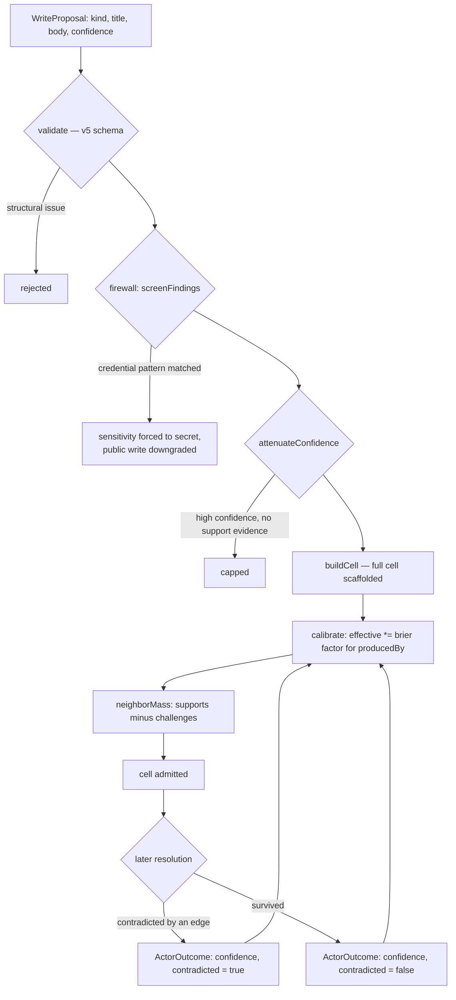

## 1. Executive Summary

Recall is a "push" memory substrate: it does not wait to be queried. It compiles
what an agent needs into every turn through hooks, and — in its own description
— "holds the turn open until memory was actually consulted or updated".
Apache-2.0, about 13,200 lines of TypeScript across 40 source modules, each with
a paired test file.

The stated bet is against the extractor: facts "enter as typed, validated,
confidence-calibrated cells at write time, written by the same model that did the
work, with no extraction pipeline behind it". No second model, no memory service,
"nothing for a human to curate".

**The mechanism worth the report is per-actor Brier calibration.**
`src/calibration.ts` is 26 lines. It takes an actor's resolved write history —
each entry a stated `confidence` and whether the claim was later `contradicted`
— and computes the Brier score, the mean squared error between what the actor
claimed and what turned out to be true. That score becomes a multiplier in
`[0.5, 1]` applied to everything that actor writes afterwards, returning a
neutral 1 until there are at least three outcomes to judge.

This is a different answer to "how much should I believe this" from anything
else in the atlas. Other systems weight by *what kind of source* a memory came
from — user-stated beats LLM-extracted, a fixed multiplier per origin. Recall
weights by *how well-calibrated that particular writer has been*, measured. An
LLM that says 0.9 and is right 90% of the time is not discounted; one that says
0.9 and is right half the time is, automatically, by the arithmetic.

The score legend makes the separation explicit: position 0 is `conf`, "the
immutable stated anchor", position 4 is `actorCalibration`, and position 5 is
`effective`, derived. What was claimed and what is believed are different
numbers in different slots, and the claimed one never changes.

**The gap is one flag.** `Flags.requiresReview` is rendered in the compiled
context, expands a cell's mini-index line, and produces a `review_required`
marker. Searching the tree for anything setting it to `true` returns **three
test files and no production code**. The bit exists, the display exists, and
nothing can raise it.

## 2. Mental Model

A cell is a typed claim from a ten-value vocabulary — `dec`ision, `obs`ervation,
`bel`ief, `tsk`, `obj`ective, `rsk`, `ref`, `ver`ification, `hyp`othesis,
`prg`ram — carrying:

- a **ten-position score legend** (`conf`, `uncertainty`, `concern`,
  `sourceQuality`, `actorCalibration`, `effective`, `currencyC0`, `currency`,
  `salienceSeed`, `salience`), with the stated anchor immutable and the live
  values decayed by a background operator;
- **signed directed edges** with six relations — `supports` (+),
  `contradicts` (−), `concerns` (−0.5), `depends_on`, `supersedes`,
  `derived_from`;
- **provenance** as `origin` × `producedBy` × `verification` × `signatureStatus`,
  where `producedBy` is "the actor id the calibration keys on; unspoofable once
  signed";
- **policy** carrying `sensitivity`, `expiresAt` and `reverifyAfter`.

Belief is not a state transition here; it is a computation over the graph. A
cell's `effective` score folds its stated confidence, its actor's calibration,
and the mass of supporting versus challenging neighbours.

The loop from outcome back to calibration is the design. Every claim an actor
makes is eventually graded against reality, and the grade prices their next one.

## 3. Architecture

One SQLite file per project, registered in a `projects` table keyed on
`root_path` with a slug and a database path, under `~/.recall`. A separate home
database holds cross-project material.

`src/federated-store.ts` is the read side of that: "a read-only union across
home/project locals" where "each member keeps its local trust graph intact. The
union only prefixes stable keys and edge endpoints with a graph slug so callers
can traverse without accidentally mixing domains." Reads federate, writes route
to exactly one local, and the error message says so.

Node 22.13+, npm-installed, no service and no key. The integration is hooks
rather than a server: a `PostToolUse` receipt hook attributes an accepted write
to a session and turn marker, and a `Stop` hook verifies those ids against the
routed store — the comment states the invariant that makes it work,
"ambient/background writes never count".

## 4. Essential Implementation Paths

**Admission** — `src/admission.ts`, and the module header documents the sequence
better than prose can: `validate` → `screenFindings` → `attenuateConfidence` →
`buildCell` → `calibrate`, with a note that support and challenge masses are
zero at this stage "because those come from a cell's graph neighbors".

**Firewall** — `src/firewall.ts`: eight precision-first secret patterns —
OpenAI, AWS, GitHub, Slack, JWT, private-key blocks, bearer tokens, and a
secret-named assignment regex — each "anchored with word boundaries to avoid
tripping on bare UUIDs". A match forces `sensitivity: secret` and downgrades a
public write. Beside it, `attenuateConfidence` caps a high stated confidence
that carries no support evidence.

**Calibration** — `src/calibration.ts`: `brierScore` and `calibrationFactor`,
"pure functions, no side effects", with an explicit throw on a confidence
outside `[0, 1]`.

**Compile and push** — `src/compile.ts` builds the context block;
`src/prompt-hook.ts` injects it; `src/receipt-hook.ts` records what was
accepted.

## 5. Memory Data Model

Four tables carry the model — `cells`, `edges`, `hyperedges`, `semantic_index` —
plus `dag_overlays`, `program_runs`, `eval_runs` and `operator_runs`.

The cell is stored as JSON with a handful of promoted columns (`key`, `handle`,
`kind`, `content_key`, `status`), which is why the rich structure lives in the
type rather than the schema. Three details are worth lifting:

- **`lastSalientAt` is distinct from `updatedAt`.** The comment gives the
  reason: the operator decays salience from the first and currency from the
  second, "so a read reinforces attention without refreshing freshness". Most
  systems in this atlas bump one timestamp on retrieval and thereby make a
  frequently-read stale fact look fresh. This one refuses to.
- **`conf` is immutable.** The stated anchor is never rewritten; everything
  downstream is derived. A reader can always recover what was originally
  claimed.
- **`value` with supersede chains as a delta series.** A numeric reading whose
  supersede chain forms its own time series — a small, unusual idea for
  measurements that change.

`hyperedges` with typed `members_json` gives n-ary relations, which few systems
here model at all: a claim involving four entities is one hyperedge rather than
six pairwise edges.

## 6. Retrieval Mechanics

Retrieval is compiled rather than queried. `src/compile.ts` assembles a context
block ranked by evidence mass and graph structure and hands it to the prompt
hook, so the agent receives memory whether or not it asks.

`src/mass.ts` computes support minus challenge from a cell's neighbours through
the signed edges, which is what makes contradiction a ranking force rather than
a flag: a cell with three `contradicts` edges pointing at it loses effective
score without anything having to mark it wrong.

Scope is a `{ project, tenant }` pair on every cell, and `project` is not
decorative: it is a generated, indexed SQL column, `activeWhere` pushes
`project = ?` into the query, `activeByProject` wraps it, and both
`subgraphCells` and `getRecallPage` filter on it with committed tests. The MCP
tools `recall_subgraph` and `recall_page` expose it to the agent as an optional
argument.

**`scope_enforced` is withheld anyway, and the reason is which caller uses it.**
`src/compile.ts` — the path that assembles the context block and pushes it into
every turn — contains no reference to `project` at all. So the read an agent
performs deliberately can be scoped, and the read it receives whether it asked or
not cannot be. Isolation in practice is the per-project database file plus the
graph-slug prefixing in the federated union, which is the structural boundary
[Kage](../kage/) and [Shodh-Memory](../shodh-memory/) also rely on. A predicate
that exists, is indexed, is tested, and is absent from the default path is a
sharper thing than a scope stored as a tag, and it is still not the mark.

## 7. Write Mechanics

Writes are synchronous, local, and pass the admission firewall. The two
attenuation steps are the interesting half.

`screenFindings` treats a credential as a *sensitivity* problem rather than a
rejection: the write proceeds with `sensitivity: secret` and any public exposure
downgraded, so the fact is not lost and is not leaked. That is a different
choice from [OpenSRE](../opensre/)'s outright refusal and from
[Wenlan](../wenlan/)'s `CredentialLeak` rejection, and it is worth having all
three in view — refuse, redact, or reclassify.

`attenuateConfidence` caps a high stated confidence when the proposal carries no
support evidence. Combined with actor calibration, an overconfident model is
discounted twice: once for this claim having no backing, and once for its own
track record.

Correction never deletes. Supersession appends to a `lineage` array kept
newest-first, and contradiction is an edge with negative weight. The consequence
is that nothing is keyed on a rejected value — the same claim written again
enters as a new cell, gains its own `contradicts` edges, and loses on mass rather
than being refused.

## 8. Agent Integration

Hooks for Claude Code and Codex, plus an MCP server and a CLI. The
agent-integrity gate is the distinctive part: an opt-in `integrityGate` mode in
admission that inspects the raw envelope before normalisation "so an explicit
null is distinguishable from an omitted primitive", paired with the
`PostToolUse` receipt and the `Stop` verification.

The claim being enforced is that the turn does not end until the agent has
either consulted or updated memory, and that only writes attributable to a real
turn marker count. That is an unusual amount of machinery aimed at a real
problem — an agent that has memory available and does not use it.

## 9. Reliability, Safety, and Trust

**Trust state — awarded.** `verification` is a four-value field —
`unverified | checked | tested | external` — set on the cell at build time from
the proposal and raised to `checked` by adapters, analysis, import and programs.
It is epistemic rather than lifecycle: it says how the claim was established.
`status` (`active | superseded | annexed`) carries lifecycle separately, and
`signatureStatus` (`unsigned | signed | verified`) carries attestation — three
orthogonal axes where most systems have one.

**Human review — withheld, and the near-miss is precise.** `requiresReview` is
declared in `Flags`, validated in the schema, rendered by `render.ts`, expanded
by `compile.ts` and emitted as a `review_required` marker. No production code
path sets it to `true` — only three test files do. The README says "nothing for
a human to curate", so this may be deliberate; either way, the compiled context
advertises a review state the system cannot enter.

**Scope — withheld**, for the reason in section 6.

**Audit log — no.** `program_runs`, `eval_runs` and `operator_runs` record
background executions rather than mutations to memory. The receipt hook writes
session state files rather than a durable store-level log.

**Negative eval — awarded.** `subgraph.test.ts` seeds a cell in `proj-a` and a
newer, otherwise-matching cell in `proj-b`, filters on `proj-a`, and asserts the
result set is exactly one cell and that it is the in-project one — the excluded
cell exists, matches every other predicate and ranks higher by recency.
`pages.test.ts` repeats the shape with `project` and `since` together, and
asserts the SQL push-down and the app-side fallback return the same keys, so the
exclusion is pinned on both implementations of the same read rather than on
whichever one the index happens to enable. The assertion idiom is
`assert.equal(results.length, 1)` plus the survivor's title rather than a
`not.toContain`, which pins the result set more tightly than the usual form.

**Tombstone, bitemporal — no.** There is no rejected-value record and no validity
axis distinct from `createdAt`/`updatedAt`.

**A caution about calibration.** The factor floors at 0.5 and needs three
outcomes before it engages, so a new actor is trusted at face value for its first
three claims and the worst possible actor is only halved. Both are defensible
defaults and both are worth knowing before relying on the mechanism.

## 10. Tests, Evals, and Benchmarks

**No paper.** `CITATION.cff` is present and is software-citation metadata — title,
authors, repository, abstract, Apache-2.0, version 0.1.0 — with no DOI and no
publication, so a reader can tell an absent paper from an unread one. Brier
scoring is standard and the implementation is checkable against the definition in
twelve lines.

Every source module has a paired `.test.ts` — 52 files, including
`calibration.test.ts`, `admission.test.ts`, `firewall.test.ts` and
`agent-integration.test.ts`. That one-to-one discipline is rare and it is the
clearest signal of care in the repository. **I did not run them**; the screen
flagged build-time execution in `package.json` and one unpinned dependency
surface.

There is an `evals.ts` module and an `eval_runs` table, so the system can record
its own evaluation runs — and no committed result, dataset or baseline was found
in the tree. No retrieval benchmark is claimed anywhere, which is consistent:
the README's argument is about *when* memory arrives, not how well it ranks.

## 11. For Your Own Build

### Steal

- **Score your writers, not just your sources.** Brier error between stated
  confidence and realised outcome, folded into a `[0.5, 1]` multiplier, is 26
  lines and it prices overconfidence automatically. A fixed per-origin weight
  cannot tell a well-calibrated model from a boastful one.
- **Keep the stated confidence immutable and derive everything else.** `conf` at
  position 0 and `effective` at position 5 means you can always answer "what did
  it originally claim" after any amount of downstream adjustment.
- **Separate the salience clock from the freshness clock.** `lastSalientAt`
  versus `updatedAt` — reading a memory should reinforce attention without
  making a stale fact look current. This is a one-field fix for a bug most
  systems in this atlas have.
- **Reclassify a credential instead of rejecting it.** Forcing `sensitivity:
  secret` and downgrading public exposure keeps the fact and closes the leak.
- **Cap unsupported confidence at admission.** A claim asserting 0.95 with no
  supporting evidence should not be allowed to assert 0.95.
- **Make contradiction a signed edge, not a flag.** Negative-weight edges let
  challenge mass move a score continuously, so a contested claim degrades
  instead of flipping.
- **Prefix keys with a graph slug when you federate reads.** It is what lets a
  union be traversable without mixing domains, and it is one string concat.
- **Distinguish an explicit null from an omitted field at the gate.** The
  integrity mode inspects the raw envelope before normalisation precisely so
  "not applicable" and "forgot to fill it in" are different.

### Avoid

- **Do not render a state you cannot enter.** `requiresReview` reaches the
  compiled context as `review_required`, and nothing outside tests sets it.
- **Do not rely on calibration before it engages.** Under three outcomes the
  factor is exactly 1, so a brand-new actor writes at full weight.
- **Do not read `{ project, tenant }` on a cell as an enforced boundary.** It is
  metadata; the database file is the wall.
- **Do not expect supersession to stop a re-assertion.** The lineage array
  records the chain; nothing refuses a fresh cell carrying the same claim.

### Fit

This suits someone running a single model that does its own memory work and who
wants that memory pushed rather than queried — particularly if the failure they
are fixing is an agent that has memory and forgets to look. The typed cell and
the score legend are a lot of structure to accept, and they are the product.

`calibration.ts` and `firewall.ts` together are under 150 lines, have no
dependencies, and are the two files worth reading whatever you are building.

## 12. Open Questions

- **Where do `ActorOutcome` records come from?** Calibration consumes resolved
  outcomes; the path from a `contradicts` edge landing to an outcome row being
  written was not traced, and it is the loop the whole mechanism depends on.
- **Was `requiresReview` intended for a curation surface that was cut?** The
  README's "nothing for a human to curate" suggests deliberate removal; the
  render path suggests it was once meant to fire.
- **What raises `verification` to `tested` or `external`?** `checked` is set at
  four sites; the two stronger values were not found being written.
- **Does the Stop hook actually block?** The integrity contract says the turn is
  held open; how a non-compliant turn is handled was not traced.

## Appendix: File Index

**Calibration** — `src/calibration.ts` (`calibrationFactor` at `:8`,
`brierScore` `:15`), `src/actors.ts`, `src/calibration.test.ts`

**Admission and firewall** — `src/admission.ts` (the documented sequence at
`:1-11`, `integrityGate` `:29`), `src/firewall.ts` (the secret patterns at
`:12-30`, `attenuateConfidence`), `src/schema.ts`, `src/template.ts`,
`src/build.ts`

**The type contract** — `src/types.ts` (`KINDS` `:4`, `RELATIONS` `:11`,
`Scores` `:18`, `Flags` `:32`, `Provenance` `:109`, `Policy` `:128`, `Cell`
`:134`, the `lastSalientAt` comment `:160-164`)

**Storage and federation** — `src/db.ts`, `src/store.ts`,
`src/federated-store.ts`, `src/routing.ts:42` (the projects registry),
`src/hyperedges.ts`, `src/secrets.ts`

**Push path** — `src/compile.ts`, `src/prompt-hook.ts`, `src/receipt-hook.ts`,
`src/render.ts`, `src/guidance.ts`, `src/cell-context.ts`

**Scoring** — `src/scores.ts`, `src/mass.ts`, `src/operator.ts`,
`src/analysis.ts`

**Integration** — `src/claude-integration.ts`, `src/codex-integration.ts`,
`src/mcp-server.ts`, `src/cli.ts`, `integrations/claude/hooks`,
`integrations/codex/skill`

**Tests** — one `.test.ts` beside every source module

## History

**2026-08-21** — [`b448f24e85309d3a3adc56bc1ad1aaca5d920d89`](https://github.com/H-XX-D/recall-memory-substrate/commit/b448f24e85309d3a3adc56bc1ad1aaca5d920d89) — second reading, at the same commit: `main` had not moved. Screened again first; the findings were unchanged apart from `package-lock.json` having aged past the cooldown, and nothing was installed or run. Two corrections. `negative_eval` is awarded on cross-project retrieval cases that were present at the first reading and not found, because the search was for `not.toContain` and `toHaveLength(0)` while this suite is `node:test` and writes `assert.equal(results.length, 1)`. And section 6's claim that no stored scope key reaches a read-path predicate was wrong: `project` is a generated indexed column, `activeWhere` pushes `project = ?` into SQL, and two read paths and two MCP tools use it — the accurate statement is that `compile.ts`, the path that pushes memory into every turn, never passes one, which is why the mark is still withheld. `stack_source` promoted from `seeded` to `reviewed`.

**2026-08-09** — [`b448f24e85309d3a3adc56bc1ad1aaca5d920d89`](https://github.com/H-XX-D/recall-memory-substrate/commit/b448f24e85309d3a3adc56bc1ad1aaca5d920d89) — first reading. Screened before reading: no auto-run surface, build-time execution declared in `package.json`, one unpinned dependency surface, `package-lock.json` present. The tree was read, never installed, and no test was run.
