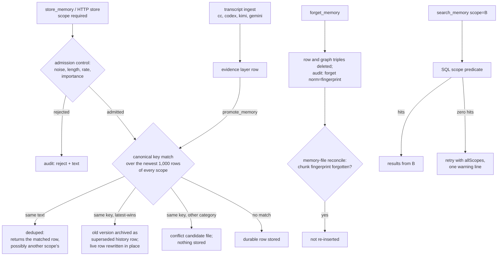

## 1. Executive Summary

RecallNest is a local memory layer that several coding agents share: Claude
Code, Codex, Kimi, Antigravity and a phone agent read and write one LanceDB
store over MCP, an HTTP API or a read-only gateway. Its central distinction is
between evidence and durable memory. Transcript chunks are stored as evidence,
structured writes as durable, and a promotion step copies evidence into durable
memory with its provenance.

The engineering around corrections is careful. A replaced belief leaves a
history row, and a forget leaves a fingerprint that memory-file reconciliation
refuses to re-insert. The weak spot is scope: the store filters it in SQL, but
the write path's canonical-key match reads every scope, and the MCP search tool
retries across all scopes when a scoped search finds nothing.

The project started as a fork of
[memory-lancedb-pro](../memory-lancedb-pro/), an OpenClaw plugin, and credits
it for hybrid retrieval and decay. It has since grown into a separate system of
the same shape and a larger surface: 44 MCP tools in three tiers, a dream
pipeline, a knowledge graph, skills, reminders and session checkpoints. The code
comments are mostly Chinese and dated. Many name the cross-review round that
found the defect they fix.

Three marks: `tombstone`, on a text fingerprint that one re-derivation path
honours; `audit_log`, on `audit.jsonl`; and `negative_eval`, on a real-store
scope exclusion test. Section 9 names the four withheld.

## 2. Mental Model

A memory is a row with a text, a category from six durable ones (`profile`,
`preferences`, `entities`, `events`, `cases`, `patterns`) and a scope. What
kind of claim it is lives in `metadata.boundary`: a `layer` of `durable` or
`evidence`, an `authority` naming where it came from, and a conflict policy
(`src/memory-boundaries.ts:4-37`).

**The layer is decided by the source and never changes on a row.**
`resolveIngestBoundary` puts every transcript chunk on the evidence layer and
demotes a transcript-derived `profile` or `preferences` to `events`, noting
*"Transcript-derived stable facts stay as evidence until explicitly promoted"*
(`memory-boundaries.ts:181-238`). Structured writes through `store_memory` are
durable. Dream syntheses are evidence by design, because *"a model re-reading
its own memories is a lead to its sources, not authority over them"*
(`src/memory-promotion.ts:252-262`). Promotion writes a new durable row that
records `promotedFrom`; the evidence row stays as it was (`src/capture-engine.ts:1456-1480`).

**A durable belief has an identity: its canonical key.** The key is the
caller's, or a slot inferred for preferences, or the category plus the
normalised text (`memory-boundaries.ts:146-171`). A write that meets an active
durable row with the same key and category either deduplicates (same text) or,
for latest-wins categories, archives the old version as a `superseded` history
row and rewrites the live row in place at `version + 1`
(`capture-engine.ts:520-556`; `src/belief-history.ts:72-160`). A collision
across categories opens a conflict candidate and stores nothing.

**A memory stops being current in five ways.** Supersession by key; an LLM
`MERGE` verdict marking a similar same-scope row `superseded`
(`capture-engine.ts:1126-1160`); consolidation during dream; archival by the
GC's age and retention rules; and `forget`, which deletes the row. Only
`active` and `pending_review` rows are searched (`src/memory-evolution.ts:139-143`).
`pending_review` is set when the LLM rates a default-importance write below 0.3,
or on the weakest of five near-duplicates (`capture-engine.ts:986`, `:1172-1180`),
and is searched like `active`.

## 3. Architecture

Everything runs locally on Bun or Node 22 with `tsx`. The store is one LanceDB
database with three tables: `memories`, `memory_triggers` (one embedding per
write-time trigger phrase) and `kg_triples` (`src/store.ts:224`;
`src/trigger-store.ts:25`; `src/kg-store.ts:57`). Beside it sit JSON files:
conflict candidates, session checkpoints, workflow observations, frequency
statistics, and the append-only `audit.jsonl`.

Three processes read the same store. `src/mcp-server.ts` serves 44 tools over
stdio, gated by `RECALLNEST_MCP_TIER`; the default `advanced` tier omits the
governance tools, and the Claude Code plugin manifest sets `full`
(`mcp-server.ts:46-108`; `.claude-plugin/marketplace.json`).
`src/api-server.ts` binds to loopback, rejects non-local Host headers, and
exposes 21 routes including writes. `src/gateway-server.ts` forwards four read
routes behind a bearer token for a phone. LanceDB's read consistency interval
defaults to 0, so a write from the CLI is visible to a resident server on its
next read (`store.ts:63-67`).

Background work is not in any server. Cron scripts under `scripts/` run
incremental ingest, `dream` (consolidation, synthesis, GC) and weekly
distillation through the CLI. `auto-consolidation.ts` has no production
importer; a comment in `src/version-manager.ts:110-113` says so and forbids
wiring it back without fixing a loop first.

Embeddings default to Jina v5 at 1,024 dimensions over an OpenAI-compatible
client. An LLM is optional and, when configured, rates importance, arbitrates
near-duplicates, summarises oversized text and runs dream synthesis.

### Deployment and ergonomics

The plugin install is one command in Claude Code and asks for a Jina API key;
without an embedding endpoint nothing can be stored, because every admitted
write embeds before it persists. The database is LanceDB columnar files, not
hand-editable, but `memory_drill_down`, the web UI on port 4317, JSON exports
and the conflict files make it inspectable.

Three path roots are resolved independently. The database follows
`config.dbPath`; conflict, checkpoint and workflow files live in `../data/`
relative to the source directory (`src/conflict-store.ts:28`;
`src/session-store.ts:69`; `src/workflow-observation-store.ts:30`); and the
audit log defaults to `$RECALLNEST_DATA_DIR` or `data/` under the working
directory (`src/env-config.ts:158`; `src/mcp-server.ts:200`), while the
retrieval audit uses the database's parent directory (`src/runtime-config.ts:201-217`).
Run from the repository root they coincide. In the plugin layout the database
sits in `$CLAUDE_PLUGIN_DATA` and the source in the plugin cache, and the
launcher sets neither `RECALLNEST_DATA_DIR` nor a fixed working directory
(`scripts/start-server.sh`). The reconcile command guards its own side and
refuses to run when the two directories differ (`src/cli.ts:284-297`). This was
read, not reproduced.

## 4. Essential Implementation Paths

**Structured write.** `store_memory` (`src/mcp-tools-core.ts:85-160`) calls
`persistMemory` (`capture-engine.ts:935-1364`). Before storage it parses with
scope required, scans for PII and redacts secrets, summarises or truncates
oversized text, asks the LLM for importance when the caller left the default
0.7, and runs `checkAdmission`, whose rejections are audited with the text. It
then embeds, matches preferences in scope, asks the LLM `dedupDecision` about
the top three same-scope rows at 0.85 for other categories, and runs the
five-neighbour interference check. After `writeDurableEntry` come trigger
embeddings, asynchronous graph extraction, the `store` audit event,
asynchronous read-back verification and an implicit preference dual-write.

**Identity and replacement.** `writeDurableEntry` (`capture-engine.ts:558-748`)
takes candidates from `findCanonicalMatches`, which lists the newest 1,000 rows
with `store.list(undefined, …)` — no scope — and keeps active durable rows with
the same key (`:465-481`). The branches, in order, are cross-category conflict
(`:595-636`), exact-text dedupe (`:638-646`), latest-wins replacement through
`replaceBeliefInPlace` (`:648-703`), and a lookup by deterministic id for a row
outside the scan window (`:705-748`).

**Transcript ingest.** `ingestCCTranscripts`, `ingestCodexSessions`,
`ingestKimiSessions` and `ingestGeminiSessions` in `src/ingest.ts` chunk
turns, run an optional LLM extraction to L0, L1 and category, and build rows
with `buildIngestedEntry` on the evidence layer at tier `peripheral`
(`ingest.ts:717-787`).

**Promotion.** `promote_memory` → `promoteMemory` refuses a source that is not
evidence and writes through `writeDurableEntry` with `promotedFrom`
(`capture-engine.ts:1456-1523`). `promote_scan` promotes recurring transcript
facts; `promote_synthesis` promotes dream conclusions whose validated evidence
set supports them (`src/memory-promotion.ts:114`, `:382`).

**Search.** `search_memory` (`mcp-tools-core.ts:384-625`) builds a context
through `buildRetrievalContext`, runs `MemoryRetriever.retrieve`, and on zero
results retries with `allScopes: true` (`:442-458`). The retriever runs vector
search, BM25 in hybrid mode, trigger recall and PPR over `kg_triples` when
`RECALLNEST_KG_MODE=true`, fuses, rescores by decay and tier, then drops
inactive rows (`src/retriever.ts:1554-1556`) and, when enabled, evidence rows
(`:2083-2107`). Each retrieval is audited with the revision served
(`:975-1000`).

**Resume.** `resume_context` composes stable context, task results, pins and the
latest checkpoint (`src/context-composer.ts`). The stable section refuses
evidence-layer and transcript-scope rows through `shouldUseStableMemoryResult`
(`memory-boundaries.ts:362-377`).

**Forget.** `forget_memory` → `forgetMemory` (`src/forget-engine.ts:81-201`):
fetch with the optional scope, require `confirm` for durable-tier rows,
snapshot, delete graph triples, demote similar rows, mark archived, delete,
then log `forget` with `norm=` and the fingerprint.

**Reconcile.** `reconcileMemoryDocuments` (`src/memory-reconcile.ts`) plans a
full comparison of the memory directory's Markdown chunks against scope
`memory`, consults the forget set before every insert or reactivation, journals
each batch before and after, and supports `--undo`.

## 5. Memory Data Model

| Field | Where | Notes |
| --- | --- | --- |
| `id` | column | sha-256 of scope and canonical key, or of scope and text, formatted as a UUID (`store.ts:101-108`) |
| `text`, `vector` | columns | text capped at 4,000 characters by the schema |
| `category`, `scope`, `importance`, `timestamp` | columns | scope is a free string such as `project:x`, `cc:SESSION`, `memory` |
| `boundary` | metadata | `layer`, `authority`, `conflictPolicy`, `originalCategory`, `downgradedFrom` |
| `canonicalKey`, `promotedFrom`, `provenanceHistory` | metadata | identity and promotion lineage, history capped at 20 |
| `evolution` | metadata | `status`, `version`, `supersedes`, `supersededBy`, `validFrom`, `validUntil`, `eventTime`, access counts (`memory-evolution.ts:22-41`) |
| `confidence` | metadata | a score with optional `verifiedBy` and `verifiedAt`, assigned by source |
| `privacyTier` | metadata | `ephemeral`, `private`, `durable`, `shared`; the first two skip graph extraction |
| `l0_abstract`, `l1_overview`, `l2_content`, `triggers`, `anchor`, `emotion`, `narrative` | metadata | retrieval aids |

Everything beyond the six columns is one JSON string, so nothing but `scope`
and `category` can be filtered in SQL. Status, layer and validity are parsed
and filtered in the application after the candidate pool is fetched.

**Time.** `validFrom` is set to the write instant by every writer
(`memory-evolution.ts:61`; `belief-history.ts:157`); `validUntil` is either
caller-declared or the moment of supersession. `eventTime` is accepted by
`store_memory` as *"when the event actually happened"* and stored, and no
production code reads it.

**Scope** is the `scope` column. The canonical key does not contain it, while
the deterministic id does, which is why two scopes can hold rows with one key.

## 6. Retrieval Mechanics

The default `retrieval.mode` is `vector`; `hybrid` adds BM25 through LanceDB
FTS on a pre-tokenised `fts_text` and fuses by weight. Trigger phrases stored at
write time are embedded separately and pull their host memory into the
candidate pool without ever being shown (`src/trigger-store.ts`). PPR graph
traversal runs only with `graph: true` and `RECALLNEST_KG_MODE=true`.

Scoring then applies Weibull decay modulated by importance and emotional
salience, a tier floor so core memories do not drop out, a bounded popularity
term, boundary weights of 1.03 for structured durable rows and 0.97 for
transcript evidence, and length normalisation (`retriever.ts:2109-2130`). The
boundary weight is deliberately small; a test forbids it from letting source
outrank relevance (`retriever-boundary-weight.test.ts`).

Layer admission — answer from durable rows and fall back to everything when
fewer than three survive — exists and is off unless
`RECALLNEST_LAYER_ADMISSION=on` (`retriever.ts:2083-2107`;
`env-config.ts:115-124`). By default, evidence reaches search results as
evidence, labelled `prov: evidence/transcript-ingest`.

**The scope boundary holds in the store and loosens above it.** Every store
read compiles the filter into SQL before the limit and re-checks each row in the
same mode (`store.ts:235-245`, `:665-683`). A scope without a colon is a prefix,
so `cc` also reads `cc:SESSION` and `ccx`; `exact` mode exists and dream uses
it. The MCP tool then turns an empty scoped result into a cross-scope retry,
and appends *"scope … 命中 0 条,以上结果来自自动跨 scope 重试"* below the results
(`mcp-tools-core.ts:442-458`, `:603-610`). The HTTP `/v1/recall` route has no
such retry (`src/api-server.ts:158-169`).

`detail_level: adaptive` returns L0, L1 or L2 text per hit within an 8,000-token
budget. `validAt` returns rows whose `validFrom`–`validUntil` interval covers a
date (`retriever.ts:350-384`); because `validFrom` is the write time, that
answers what was recorded and not yet replaced then.

## 7. Write Mechanics

Writes are explicit tool or HTTP calls, transcript ingest, or dream output.
`auto_capture` extracts candidates heuristically with no model call.

**Deduplication is by canonical key, and the key is global.**
`findCanonicalMatches` reads the newest 1,000 rows of every scope
(`capture-engine.ts:465-481`). A write to scope B whose key and category match
an active durable row in scope A therefore returns A's row as `deduped` when the
text is the same. When the text differs in a latest-wins category, it rewrites
A's row in place and stores nothing in B. The returned `resolvedScope` is A's,
the only visible sign. Default keys derive from category and text, so identical
text in two projects is enough.

The project records this defect in its own test file. Case T9 seeds its
two-scope state directly, and its comment says that writing the same key
through `persistMemory` in the other scope would land on the first scope's row
because the write path's same-key match ignores scope — an existing defect
left open (`src/__tests__/preference-same-key-revision.test.ts:395-417`).
[memory-lancedb-pro](../memory-lancedb-pro/)'s fact-key supersede scan
re-checks scope itself. This was read, not reproduced.

**Replacement keeps history.** `archiveBeliefVersion` copies the old row under
a derived id as `superseded` with the interval closed, keeping its original
timestamp so history rows do not crowd the scan window
(`belief-history.ts:72-135`). A revert to an earlier wording is a new version,
not a duplicate, because history rows are excluded from matching.

**Rejection is logged, not remembered.** Admission rejections are audited with
the first 100 characters. Nothing consults them later.

**Forget** deletes the row and its graph triples and demotes similar rows. It
asks for `confirm` on durable-tier rows, which the calling agent supplies.

### Operational cost

- Write: synchronous in the tool call — one embedding request, up to two LLM
  calls (importance and duplicate arbitration) when an LLM is configured, three
  vector searches and a 1,000-row listing. Graph extraction and read-back
  verification run after the reply.
- Lag: a stored memory is searchable on the next read in any process.
- Background: dream processes up to 500 entries per run and GC scans the table
  in pages, both from cron through the CLI.
- Read: `search_memory` returns at most 20 hits; `resume_context` is bounded per
  section and injected when the agent calls it, not by a hook.

## 8. Agent Integration

The MCP server is the main surface. `setup.sh` scripts for Claude Code, Codex
and Antigravity register it and install a managed rule block in the agent's
`CLAUDE.md` or equivalent. That block tells the agent to call `resume_context`
before any repository exploration on phrases like *continue*, to reuse the
returned scope, and to call `checkpoint_session` before leaving
(`integrations/claude-code/claude-md-snippet.md`). Nothing is injected by a
hook; recall happens because the rules say so.

The agent's authority over memory depends on the tier. Under `advanced` it can
store, batch-store, promote evidence, run dream and forget any row by id,
optionally scoped. Under the plugin's `full` tier it also resolves conflicts,
runs promotion scans and consolidates.

Checkpoints are kept out of durable memory: they are JSON files under
`data/session-checkpoints`, garbage-collected per scope, and the rule block
forbids persisting repository state the window did not verify.

## 9. Reliability, Safety, and Trust

**Provenance is on every row.** Layer, authority, `promotedFrom`, source and
session image counts are visible in search output, and the retrieval audit
records which revision and layer each served hit had. A promoted fact can be
traced to the transcript chunk it came from.

**Evidence is kept out of the one place that matters most.** The stable section
of `resume_context` — profile, preferences, entities — refuses evidence rows.
Ordinary search does not, by default.

**Scope is a relevance partition, not an authorisation boundary.** The caller
names any scope or `allScopes`, `forget_memory` accepts any id, and the HTTP API
has no caller identity. For one person's agents that is coherent. The two leaks
in sections 6 and 7 are the risk even so. The search fallback puts another
project's memory into an agent's context under one Chinese warning line. The
canonical-key match can overwrite another project's belief.

**Failures are quiet where they are cheapest to make loud.** The audit writer
swallows every error by design, so a missing `forget` event also loses the
fingerprint reconciliation depends on. The three independently resolved path
roots in section 3 can split the log from the store.

**Prompt-injected memory** meets admission control, a noise filter and PII
redaction, then lands as evidence if it arrived by transcript. Written through
`store_memory` by an agent, it is durable at once.

Capability marks:

- `tombstone` — awarded, narrowly. The forget event's `norm=` fingerprint is
  keyed on the words, and memory-file reconciliation refuses to re-insert or
  reactivate them (`memory-reconcile.ts:509-537`). It covers scope `memory` and
  that one path; `store_memory`, transcript ingest and dream never consult it.
- `scope_enforced` — withheld. The store compiles a scope predicate into
  every LanceDB read (`src/store.ts:235-245`, `:665-683`;
  `src/scope-policy.ts:57-65`), but the agent's `search_memory` tool reruns a
  scoped search with `allScopes: true` whenever it returns nothing
  (`src/mcp-tools-core.ts:442-458`), so the supplied key is dropped exactly
  when the asked-for scope holds nothing. The write path's canonical-key match
  lists every scope (`src/capture-engine.ts:465-481`), so a write can dedupe
  against or rewrite another scope's row.
- `audit_log` — awarded on `audit.jsonl`. Ingest, dream, conflict resolution
  and LLM supersession write no event, and `supersede` and `consolidate` are
  declared with no producer.
- `negative_eval` — awarded; evidence in section 10.
- `trust_state` — withheld. The layer is fixed by the writer and never
  transitions on a row, so it is a write-time genre; promotion makes a copy.
  `pending_review` is searched like `active`, and confidence is a score.
- `bitemporal` — withheld. `validFrom` is always the write time, so the
  interval is version history; `eventTime` is stored and read by nothing.
- `human_review` — withheld. A conflict candidate waits for `keep`, `accept` or
  `merge`, and `resolve_conflict` is off the default tier. The plugin manifest
  sets `RECALLNEST_MCP_TIER=full`, which registers it on the agent's own
  surface, and the HTTP resolve route takes no identity.

## 10. Tests, Evals, and Benchmarks

Nothing was installed, built or run for this report; everything here is from
reading the tests at the pin. CI runs `bun test` over the whole suite, a CI-mode
`doctor`, a credential scan, a package-contents check and a build.

**The negative case.** `dream-scope-isolation.test.ts` seeds a real LanceDB
store with rows in `memory`, `memory:pivot` and `project:other`, then asserts a
vector search scoped to `memory` returns exactly the first two and an exact-mode
search exactly the first (`:59-93`). `project:other` scores 0.5 against a 0.1
threshold, so only the predicate excludes it. The file's header explains why it
exists: the older dream tests used a mock that ignored the scope argument, so
they passed whether or not the mode was threaded through.

**Forget and reconcile.** `memory-reconcile.test.ts:826-847` forgets the kept
copy of a duplicated chunk through `forgetMemory`, asserts the log carries its
fingerprint, and asserts the next reconcile run inserts nothing and leaves the
archived sibling archived. Neighbouring cases cover a forget that arrives
between planning and insert (`:573-585`, `:780-798`).

**Belief history, conflicts and promotion** have their own suites:
`belief-history.test.ts`, `preference-same-key-revision.test.ts`,
`conflict-*.test.ts`, `capture-engine.test.ts` and
`promotion-distinct-sources.test.ts`.

**A case that asserts less than its title.** `belief-history.test.ts:142-151`,
*"keeps archived versions out of default retrieval"*, filters the stored array
with `isActiveMemory` and never calls a retriever.

**Evals.** `src/eval.ts` runs `eval/cases.json`, a canary set and a
scope-robustness set against the operator's own store by target id, so they are
not reproducible from the tree. The continuity set is seeded from committed JSON
and carries `forbid` terms that the seeds contain. No result file is committed.
The tree cites outside papers as influences and carries no paper or citation
block of its own.

**Not covered.** No test writes the same canonical key into two scopes through
`persistMemory`; no test covers the MCP zero-hit fallback.

## 11. For Your Own Build

### Steal

- **Put transcript material on a separate layer and keep it out of the stable
  profile.** Promote by copying with a `promotedFrom` link, so the source stays
  inspectable.
- **Archive the old version before rewriting a belief in place.** Keep the
  canonical id live and write the replaced text as its own row with the interval
  closed; then "what did we believe before" has an answer.
- **Record a forget by the words as well as the id.** A text fingerprint in the
  forget event is what lets a later re-import recognise the same sentence under
  a new row.
- **Audit the revision a retrieval served,** not only the query, so a past
  answer can be reconstructed after the memory changed.
- **Log rejected writes with their text.** A refused write that leaves no trace
  cannot be reviewed.
- **Test scope against a real store.** A mock that ignores the scope argument
  passes every isolation test.

### Avoid

- **A global identity key under a scoped read path.** If the key does not
  include the scope, the write path crosses the boundary the read path enforces.
- **Widening scope on an empty result.** Return nothing and say so; a warning
  line under another project's memory reads as memory.
- **Resolving the log, the side files and the store from three roots.** Derive
  every path from the one the store uses, or refuse to start.
- **A review verb that a config tier moves onto the agent's surface.** The
  install path most users take decides who the reviewer is.

### Fit

This suits one developer running several agents on one or two machines who
wants their history searchable everywhere and will run cron jobs and read
Chinese comments. It assumes an embedding API, an operator who tunes flags, and
tolerance for a large surface; many features are opt-in environment switches.
A team or a multi-tenant deployment should not adopt it as is: scope is advisory,
the HTTP API has no identity, and the write path can cross projects.

## 12. Open Questions

- In the plugin layout, which working directory does Claude Code give the MCP
  server, and where do `audit.jsonl`, conflicts and checkpoints end up?
- How often does the canonical-key collision across scopes occur in a real
  store, given that default keys derive from text?
- Is `RECALLNEST_LAYER_ADMISSION=on` used in the author's deployment, and what
  did the shadow reports under `eval/la1-shadow/` show?
- Does anything drain `pending_review` other than distillation prioritising it?

## Appendix: File Index

- **Storage and schema:** `src/store.ts`, `src/memory-schema.ts`,
  `src/memory-boundaries.ts`, `src/memory-evolution.ts`, `src/belief-history.ts`,
  `src/trigger-store.ts`, `src/kg-store.ts`.
- **Write path:** `src/capture-engine.ts`, `src/admission-control.ts`,
  `src/preference-matcher.ts`, `src/ingest.ts`, `src/memory-promotion.ts`.
- **Retrieval:** `src/retriever.ts`, `src/scope-policy.ts`,
  `src/retrieval-profiles.ts`, `src/ppr-traversal.ts`.
- **Context assembly:** `src/context-composer*.ts`, `src/session-store.ts`.
- **Correction and deletion:** `src/forget-engine.ts`, `src/cascade-forget.ts`,
  `src/memory-reconcile.ts`, `src/conflict-store.ts`, `src/conflict-lifecycle.ts`.
- **Background:** `src/dream-pipeline.ts`, `src/consolidation-engine.ts`,
  `src/auto-gc.ts`, `scripts/*.sh`.
- **Audit:** `src/audit-log.ts`, `src/runtime-config.ts:201-217`.
- **MCP, HTTP and integration:** `src/mcp-server.ts`, `src/mcp-tools-core.ts`,
  `src/mcp-tools-advanced.ts`, `src/mcp-tools-governance.ts`,
  `src/api-server.ts`, `src/gateway-server.ts`, `.claude-plugin/marketplace.json`,
  `scripts/start-server.sh`, `integrations/`.
- **Tests and evals:** `src/__tests__/dream-scope-isolation.test.ts`,
  `src/__tests__/memory-reconcile.test.ts`,
  `src/__tests__/preference-same-key-revision.test.ts`,
  `src/__tests__/belief-history.test.ts`, `src/__tests__/capture-engine.test.ts`,
  `src/eval.ts`, `eval/`.

### Recorded searches

Checked against the checkout at the pinned revision.

- `grep -rn 'store.list(undefined' src/capture-engine.ts` — line 470, inside `findCanonicalMatches`; the canonical scan passes no scope.
- `grep -rn 'allScopes: true' src | grep -v __tests__` — `mcp-tools-core.ts:450` (the zero-hit retry) and `scope-policy.ts:86`; no retry in `api-server.ts`.
- `grep -rnE 'operation: *"(supersede|consolidate)"' src` — no match; both are declared in `AuditOperation` only.
- `grep -c 'audit' src/ingest.ts src/dream-pipeline.ts src/conflict-lifecycle.ts src/llm-consolidation.ts` — 0 in each.
- `grep -rn 'loadForgetSet\|ForgetWatcher\|isTextForgotten' src | grep -v __tests__` — only `memory-reconcile.ts`; no other path reads the forget fingerprints.
- `grep -rln 'eventTime' . --exclude-dir=.git` — `memory-evolution.ts`, `capture-engine.ts`, `mcp-tools-core.ts`, two tests, `CHANGELOG.md`, `ROADMAP.md`; no reader in retrieval or output.
- `grep -rn 'validFrom:' src | grep -v __tests__` — every writer sets `Date.now()` or copies the prior value.
- `grep -rn 'pending_review' src | grep -v __tests__` — `isActiveMemory` treats it as active; no read excludes it.
- `grep -rn 'auto-consolidation' . --exclude-dir=.git | grep -v __tests__` — one comment in `version-manager.ts`; no importer.
- `grep -rn 'RECALLNEST_DATA_DIR\|chdir' src scripts integrations .claude-plugin bin` — read in `env-config.ts` and named in `cli.ts`; set by no launcher.
- `grep -rliE 'arxiv|bibtex|@article|@misc|doi\.org|CITATION' . --exclude-dir=.git` — outside papers cited as influences in docs and comments; no citation block and no `CITATION.cff`.

## History

**2026-09-30** — [`d1f4915a4604185369e3fbc20e4e13951cde78a3`](https://github.com/AliceLJY/recallnest/commit/d1f4915a4604185369e3fbc20e4e13951cde78a3) — first reading, at the head of `main`, a commit dated 25 September 2026. Three marks: `tombstone`, `audit_log`, `negative_eval`; `scope_enforced` is withheld because MCP search widens an empty scoped search to every scope. Screened before reading: 2 auto-run surfaces (the `.claude-plugin/` marketplace entry launching `scripts/start-server.sh`, and `.mcp.json` with an empty server list), 1 build-time execution point (npm `prepublishOnly`), and 2 dependency files inside the cooldown, every file in the depth-1 clone dating to the tip. One floating surface of seven caret ranges is resolved by a committed lockfile; `CLAUDE.md` was treated as data. No checkout filter and no submodules. Read with `grep` and `sed`; nothing installed, built or run.
