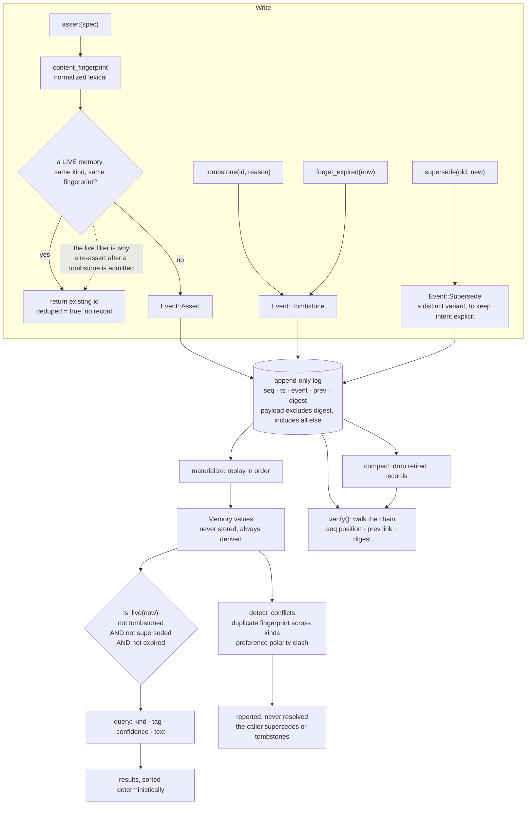

## 1. Executive Summary

RecallWeave is a small Rust engine — seven source files, about 2,900 lines,
**no dependencies at all** — for the part of memory that comes after storing
something. Its README frames the gap the way this atlas does: a vector index
answers what is similar to this and stays silent on where a belief came from,
which of two contradicting beliefs wins, and when something should stop being
believed.

Three marks.

**The log is the source of truth, and the state is replayed from it.** Each
record carries a sequence number, the event, the digest of the record before it
and a digest over its own payload — and that payload *"intentionally excludes
`digest` itself but includes everything else, so any edit to seq/ts/event/prev
is detected by verification."* A memory value is never stored; it is
materialised by replay. That is a stronger position than an audit table beside
a store, because there is no second copy to disagree with the record.

**Three ways to retire, one predicate.** Tombstoned, superseded and expired
compose into a single `is_live`, and the listing path filters on exactly that
method rather than restating the three conditions. Confidence sits beside them
as a separate number, so the store can hold something it does not believe.

**The conflict detector refuses to act.** It ships two lexical detectors, calls
them lexical, and states the boundary: *"They never mutate state; resolving a
conflict is an explicit `supersede`/`tombstone` by the caller."*

And the near miss is a single word. The dedupe consult computes a content
fingerprint — the right key for a rejected-value tombstone — and checks it
against `m.is_live(now) && m.kind == spec.kind && m.fingerprint == fingerprint`.
Because the predicate filters to live memories, a fact that was tombstoned and
then asserted again is admitted as new. Everything the mark needs is present
except that the consult looks only at what survived.

## 2. Mental Model

One file, append-only, hash-chained. Everything else is derived.

Three event variants cover the whole lifecycle: assert a memory, tombstone one
with a reason, supersede one by naming the id it replaces. The third is
redundant in principle — a new memory with a `supersedes` pointer would do —
and the comment says why it exists anyway: *"recording it as a distinct event
keeps the intent explicit."* Legibility of the log to a later reader is treated
as a design goal rather than a side effect.

A memory carries provenance as a source and a free-form detail, a confidence, a
kind from four, tags, and links to other memories described as a lightweight
knowledge graph. Retirement is one of three conditions, and reading is filtering
the replayed live set.

## 3. Architecture

## 4. Essential Implementation Paths

- **Model, events, log record:** `src/model.rs`.
- **Store, dedupe, retirement, verification, compaction:** `src/store.rs`.
- **Hashing and the honesty note:** `src/hash.rs`.
- **Query:** `src/query.rs`.
- **Lifecycle test:** `tests/lifecycle.rs`.

## 5. Memory Data Model

Four kinds — semantic, episodic, procedural, preference — and the struct keeps
the fields an atlas reader looks for: provenance as a source plus a detail, a
confidence in the unit interval, both supersession pointers, and a tombstone
flag *with its reason*.

The reason string is the field most systems omit. Retirement here is not a
boolean but a boolean and an explanation, and the sweep supplies a canonical one
— `ttl-expired` — so a reader of the log can tell an expiry from a correction
from a conflict resolution without inferring it from what else happened.

`fingerprint` is a short stable hash of the normalized content, described as the
dedupe key. It is the right shape for keying a rejection on a value; section 9
covers why it does not get there.

## 6. Retrieval Mechanics

There is no vector index and none is claimed. Retrieval is filtering the
replayed live set by kind, tag, confidence and text, sorted deterministically —
the listing method sorts by id explicitly *"for deterministic output"*, which
matters more than it sounds for a store whose state is a replay.

The single liveness predicate is the whole access-control story for
retirement, and the one place that deliberately bypasses it says so: the expiry
sweep cannot use `is_live` to find work, because an expired memory is already
not live, so it tests the two active flags directly to find the ones that still
need tombstoning.

## 7. Write Mechanics

An assert normalizes, fingerprints, and scans the materialized set for a live
memory of the same kind with the same fingerprint; on a hit it returns that id
with a deduped flag and writes nothing. The docstring is careful about what
kind of dedupe this is: *"exact/normalized-lexical dedupe, not semantic — see
honest limitations in the docs."*

Conflict detection ships two detectors — the same normalized content stored
under two different kinds, and two live preference memories sharing a subject
token but differing on a recognised antonym from a small built-in table — and
describes both as *"lexical and honest about it"*. Neither mutates anything.

Compaction drops records belonging to memories that are already retired, and
the test around it asserts that the live set is identical before and after, id
for id, and that the chain still verifies.

## 8. Agent Integration

A command-line binary and a library, with a TypeScript viewer beside them.
There is no MCP server and no SDK. The dependency list in `Cargo.toml` is
empty: JSON parsing and hashing are both implemented in the repository, in 455
and 184 lines respectively.

## 9. Reliability, Safety, and Trust

**Trust state — awarded**, on the composed liveness predicate and the separate
confidence field.

**Audit log — awarded.** The log is not a record of what happened to the state;
it is what the state is computed from, which removes the failure mode where the
two disagree. The caveat belongs on the record and the project states it first:
the digest is a custom construction and *"is not SHA-256 and makes no
cryptographic security claims"*, suitable for accidental corruption and casual
tampering in a local file. That is the correct claim for a local-first tool and
it is written where someone would look for it.

**Negative eval — awarded**, on the paired absences and the identifier-by-identifier
compaction assertion.

**Tombstone — withheld, by one predicate.** The content fingerprint is the key
a rejected-value tombstone needs, it is computed on the write path, and it is
compared against existing memories before anything is stored. The comparison is
`m.is_live(now) && m.kind == spec.kind && m.fingerprint == fingerprint`. Because
the first clause filters to survivors, a memory that was tombstoned with a
reason — and whose tombstone event is still in the log, still verifiable, still
carrying the word *forgotten* — does not participate in the check, so asserting
the same content again writes a fresh live memory. Dropping the liveness clause
and consulting the tombstone reason would turn this into the mark; leaving it
in makes the fingerprint a duplicate-suppressor rather than a rejection record.

**Scope enforced — withheld.** There is no user, tenant or namespace field
anywhere in the model. The store is one local file for one person, and nothing
pretends otherwise.

**Bi-temporal — withheld.** `created_at` is described as logical creation time
and the log record carries a wall-clock timestamp beside it, which is two
clocks about the *record* rather than one about the record and one about the
world. No read takes an as-of parameter.

**Human review — withheld**, though the conflict detector is built for one. It
reports and refuses to resolve, and the resolution verb belongs to *the
caller* — who, for a local-first agent memory engine, is the agent. Nothing
distinguishes a person's supersede from an agent's, and no field records who
made the call.

## 10. Tests, Evals, and Benchmarks

**No paper** and no `CITATION.cff`.

Two integration files and the unit tests inside the store module. The
end-to-end lifecycle case is the one that carries the mark, and it is worth
noting what it does beyond the assertions quoted in the evidence record: it
verifies the chain at three separate points — after the asserts, after the
retirements, and after compaction — so the integrity property is checked as an
invariant across the test rather than once at the end.

There is no eval harness, no benchmark and no committed result, and none is
claimed. For an engine this size that is the honest position rather than a gap;
the README's argument is about what a vector index cannot answer, not about
retrieval quality.

The repository owner was renamed. The continuous-integration badge in the
README still points at `michaeldelali/RecallWeave`, which now redirects to the
current name — one repository, not two, and the badge is stale rather than the
history being split.

## 11. For Your Own Build

- **Make the log the state, not a record beside it.** Replaying events to
  materialise memories removes the class of bug where an audit table and a row
  disagree about what happened.
- **Exclude the digest from the payload it commits to, and include everything
  else.** One sentence in a comment, and it is the difference between a chain
  that detects an edited timestamp and one that does not.
- **Compose the retirement conditions into one predicate.** Three reasons a
  memory should not be returned, restated at four call sites, is three
  opportunities to forget one.
- **Record the reason beside the tombstone.** Expired, superseded and forgotten
  are different events, and a log a person may read later should say which.
- **Say what your hash is not.** A custom digest with the security claim
  explicitly disclaimed is more trustworthy than an unqualified one.
- **Let a lexical detector report and stop.** Two heuristics that never mutate,
  with resolution handed to the caller, is the right division when the detector
  cannot be sure.

## 12. Open Questions

- The dedupe consult filters to live memories. Would checking the tombstoned
  set too — and returning the tombstone reason rather than an id — be the
  behaviour you want, or does a re-assert after a deliberate forget mean the
  caller changed their mind?
- Compaction drops records for already-retired memories. What happens to the
  evidence that a tombstone ever existed, and does that interact with the
  previous question?
- Conflict resolution is the caller's. Is there a shape in mind for recording
  *who* resolved one, or is the single-user local file the intended boundary?

## Appendix: File Index

- Model, events, log record: `src/model.rs`
- Store, dedupe, retirement, verification, compaction: `src/store.rs`
- Hashing and its stated limits: `src/hash.rs`
- Query: `src/query.rs`
- Hand-rolled JSON: `src/json.rs`
- CLI: `src/main.rs`
- Tests: `tests/lifecycle.rs`, `tests/cli.rs`

## History

**2026-09-19** — [`9acde4a350fc41d15991fdc1e5cef4b5b8171199`](https://github.com/alexahern0808/RecallWeave/commit/9acde4a350fc41d15991fdc1e5cef4b5b8171199) — first reading, at the head of `main`. Screened with `scripts/screen_repo.py` before anything was read: one build-time execution surface in a Makefile whose default target was checked, and two floating ranges with no lockfile in the TypeScript viewer; no instruction file addressed to a reading agent, and the Rust crate declares no dependencies at all. Nothing was installed, built or run. MIT. Three marks. Ownership was checked before scaffolding because the README's badge names a different account: `michaeldelali/RecallWeave` redirects to the current name, so this is a rename rather than a fork and there is one repository. The reading covered the whole crate — the model and its three event variants, the store's assert, tombstone, supersede, expiry, conflict, verification and compaction paths, the query filters and the hash module — and the two integration tests; the TypeScript viewer was read as context. Four marks are withheld with reasons in section 9, and the one worth repeating is `tombstone`: the content fingerprint is the right key and is consulted on the write path, and the liveness clause in that consult is the single reason a re-assert after a tombstone is admitted.
